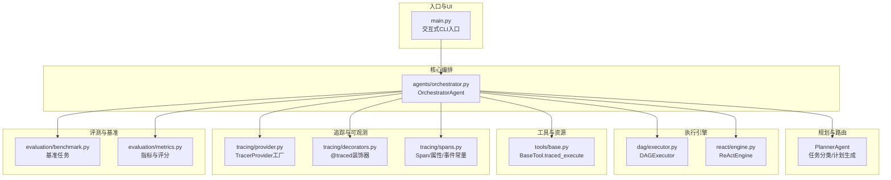
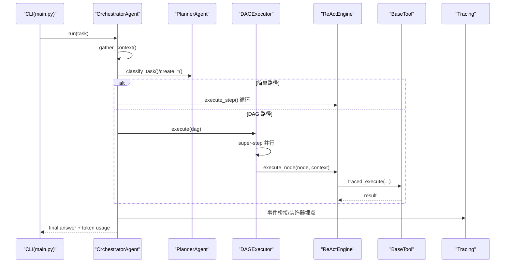
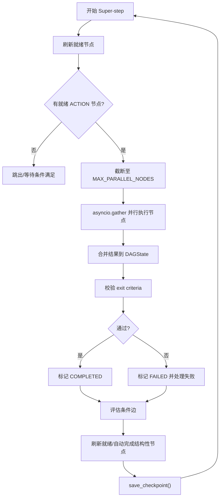
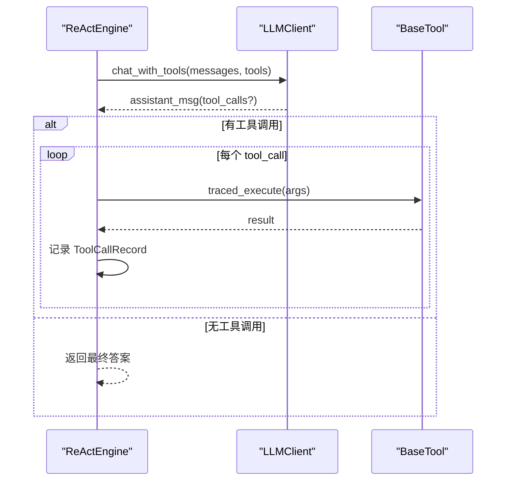
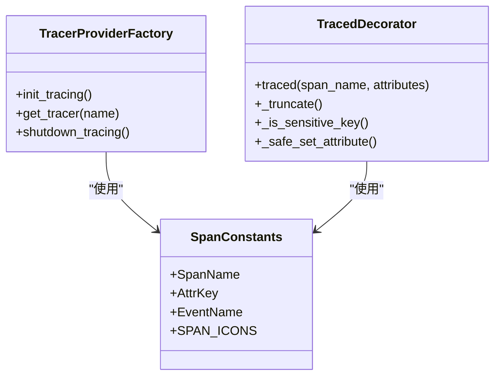
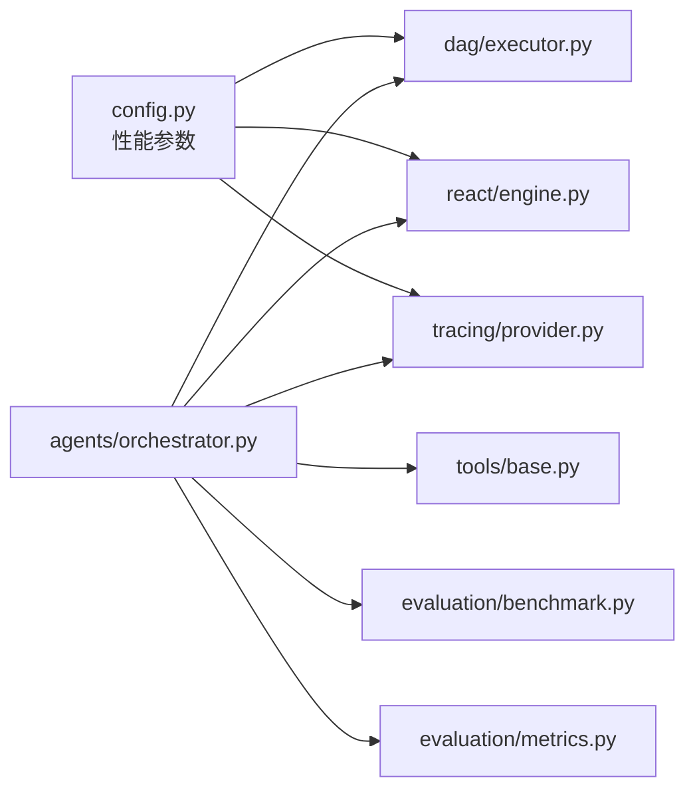

# 性能分析

<cite>
**本文引用的文件**
- [main.py](file://main.py)
- [config.py](file://config.py)
- [dag/executor.py](file://dag/executor.py)
- [react/engine.py](file://react/engine.py)
- [tracing/provider.py](file://tracing/provider.py)
- [tracing/decorators.py](file://tracing/decorators.py)
- [tracing/spans.py](file://tracing/spans.py)
- [agents/orchestrator.py](file://agents/orchestrator.py)
- [tools/base.py](file://tools/base.py)
- [evaluation/benchmark.py](file://evaluation/benchmark.py)
- [evaluation/metrics.py](file://evaluation/metrics.py)
- [tests/test_optimizations.py](file://tests/test_optimizations.py)
- [sxw_aicoding/docs/tracing-guide.md](file://sxw_aicoding/docs/tracing-guide.md)
- [sxw_aicoding/docs/v7_optimization_research.md](file://sxw_aicoding/docs/v7_optimization_research.md)
</cite>

## 目录
1. [简介](#简介)
2. [项目结构](#项目结构)
3. [核心组件](#核心组件)
4. [架构总览](#架构总览)
5. [详细组件分析](#详细组件分析)
6. [依赖分析](#依赖分析)
7. [性能考量](#性能考量)
8. [故障排查指南](#故障排查指南)
9. [结论](#结论)
10. [附录](#附录)

## 简介
本指南面向 manus_demo 的性能分析与优化，围绕执行效率、内存使用、并发性能、资源消耗与可观察性展开。重点覆盖 DAG 并行执行、ReAct 循环、工具调用、追踪系统、基准测试与评测指标，并提供优化建议、最佳实践与常见问题排查方法。

## 项目结构
manus_demo 采用多智能体流水线，结合混合路由（简单/复杂/涌现）与 DAG 并行执行，配合可选的全链路追踪与评测体系，形成“规划-执行-反思-记忆”的闭环。

图表来源
- [main.py:1-516](file://main.py#L1-L516)
- [agents/orchestrator.py:1-600](file://agents/orchestrator.py#L1-L600)
- [dag/executor.py:1-648](file://dag/executor.py#L1-L648)
- [react/engine.py:1-246](file://react/engine.py#L1-L246)
- [tools/base.py:1-175](file://tools/base.py#L1-L175)
- [tracing/provider.py:1-197](file://tracing/provider.py#L1-L197)
- [tracing/decorators.py:1-146](file://tracing/decorators.py#L1-L146)
- [tracing/spans.py:1-249](file://tracing/spans.py#L1-L249)
- [evaluation/benchmark.py:1-311](file://evaluation/benchmark.py#L1-L311)
- [evaluation/metrics.py:1-475](file://evaluation/metrics.py#L1-L475)

章节来源
- [main.py:1-516](file://main.py#L1-L516)
- [agents/orchestrator.py:1-600](file://agents/orchestrator.py#L1-L600)

## 核心组件
- OrchestratorAgent：混合路由编排，负责上下文收集、任务分类、路由到简单/复杂/涌现路径、执行与反思、记忆存储。
- DAGExecutor：基于 Super-step 的并行执行引擎，支持条件边、失败回滚、自适应规划、检查点。
- ReActEngine：统一 ReAct 循环引擎，集成工具路由、迭代上限、工具调用记录与错误恢复。
- BaseTool：工具抽象，提供 traced_execute 包装，自动注入追踪与参数脱敏。
- Tracing 系统：OpenTelemetry 集成，提供多后端导出、装饰器埋点、桥接事件到 Span。
- 评测与基准：基准任务集合、失败分类、指标体系与评分算法。

章节来源
- [agents/orchestrator.py:60-600](file://agents/orchestrator.py#L60-L600)
- [dag/executor.py:62-648](file://dag/executor.py#L62-L648)
- [react/engine.py:43-246](file://react/engine.py#L43-L246)
- [tools/base.py:22-175](file://tools/base.py#L22-L175)
- [tracing/provider.py:45-197](file://tracing/provider.py#L45-L197)
- [tracing/decorators.py:70-146](file://tracing/decorators.py#L70-L146)
- [tracing/spans.py:18-249](file://tracing/spans.py#L18-L249)
- [evaluation/benchmark.py:35-311](file://evaluation/benchmark.py#L35-L311)
- [evaluation/metrics.py:76-475](file://evaluation/metrics.py#L76-L475)

## 架构总览
manus_demo 的性能关键路径包括：
- 上下文压缩与 Token 控制（Context Management）
- DAG 并行执行与状态机（DAGExecutor）
- ReAct 循环与工具调用（ReActEngine + BaseTool）
- 可观察性与追踪（Tracing）
- 评测与基准（Benchmark/Metrics）

图表来源
- [main.py:415-516](file://main.py#L415-L516)
- [agents/orchestrator.py:158-222](file://agents/orchestrator.py#L158-L222)
- [dag/executor.py:110-264](file://dag/executor.py#L110-L264)
- [react/engine.py:84-241](file://react/engine.py#L84-L241)
- [tools/base.py:60-124](file://tools/base.py#L60-L124)

## 详细组件分析

### DAG 并行执行与状态机（DAGExecutor）
- Super-step 并行：每轮仅执行 READY 且依赖满足的 ACTION 节点，使用 asyncio.gather 并行执行，cap 并行度。
- 失败处理：失败节点触发回滚边（若有）与下游子树跳过，避免在不完整状态继续执行。
- 条件边：完成节点后评估 CONDITIONAL 边，按源结果关键字匹配决定目标节点是否激活。
- 自适应规划：按间隔与完成阈值触发 Planner 的自适应调整，动态变更 DAG。
- 检查点：定期保存 DAG 状态快照，限制最大数量，支持回溯与恢复。

图表来源
- [dag/executor.py:110-264](file://dag/executor.py#L110-L264)
- [dag/executor.py:291-310](file://dag/executor.py#L291-L310)
- [dag/executor.py:405-473](file://dag/executor.py#L405-L473)
- [dag/executor.py:601-632](file://dag/executor.py#L601-L632)

章节来源
- [dag/executor.py:62-648](file://dag/executor.py#L62-L648)
- [tests/test_optimizations.py:126-211](file://tests/test_optimizations.py#L126-L211)

### ReAct 循环与工具调用（ReActEngine + BaseTool）
- ReActEngine：迭代上限、工具路由、工具调用记录、错误恢复；支持系统提示注入与消息流管理。
- BaseTool.traced_execute：在追踪开启时包装工具执行，记录延迟、成功/失败、参数与结果大小，参数脱敏。

图表来源
- [react/engine.py:84-241](file://react/engine.py#L84-L241)
- [tools/base.py:60-124](file://tools/base.py#L60-L124)

章节来源
- [react/engine.py:43-246](file://react/engine.py#L43-L246)
- [tools/base.py:22-175](file://tools/base.py#L22-L175)

### 可观察性与追踪（Tracing）
- Provider：按配置初始化 TracerProvider，选择 Exporter（console/file/rich/otlp/phoenix），设置采样率与批处理策略。
- Decorators：@traced 装饰器，自动记录耗时、异常、属性截断与敏感字段脱敏。
- Spans：标准化 Span 名称、属性键与事件名，覆盖任务、规划、执行、LLM、工具、反思、记忆等。
- Bridge：将 Orchestrator 的事件映射为 Span，实现与 UI/评测的多播。

图表来源
- [tracing/provider.py:45-197](file://tracing/provider.py#L45-L197)
- [tracing/decorators.py:70-146](file://tracing/decorators.py#L70-L146)
- [tracing/spans.py:18-249](file://tracing/spans.py#L18-L249)

章节来源
- [tracing/provider.py:1-197](file://tracing/provider.py#L1-L197)
- [tracing/decorators.py:1-146](file://tracing/decorators.py#L1-L146)
- [tracing/spans.py:1-249](file://tracing/spans.py#L1-L249)
- [sxw_aicoding/docs/tracing-guide.md:1-800](file://sxw_aicoding/docs/tracing-guide.md#L1-L800)

### 评测与基准（Benchmark/Metrics）
- 基准任务：包含复杂度、步骤数范围、工具需求、成功标准与参考输出，覆盖简单/中等/困难任务。
- 指标体系：规划质量、执行质量、效率、鲁棒性、反思准确性；支持失败分类与聚合统计。

章节来源
- [evaluation/benchmark.py:35-311](file://evaluation/benchmark.py#L35-L311)
- [evaluation/metrics.py:76-475](file://evaluation/metrics.py#L76-L475)

## 依赖分析
- 配置中心：config.py 提供并行度、超时、采样率、工具并发、特征开关等关键性能参数。
- 事件与追踪：Orchestrator 通过多播将事件同时发送给 UI 回调与 TracingBridge，零侵入接入。
- 工具与 LLM：BaseTool.traced_execute 与 LLMClient 的 Span 包装共同构成 LLM/工具调用的可观测性基础。

图表来源
- [config.py:1-109](file://config.py#L1-L109)
- [agents/orchestrator.py:94-152](file://agents/orchestrator.py#L94-L152)
- [dag/executor.py:87-104](file://dag/executor.py#L87-L104)
- [react/engine.py:64-83](file://react/engine.py#L64-L83)
- [tracing/provider.py:45-118](file://tracing/provider.py#L45-L118)
- [tools/base.py:60-124](file://tools/base.py#L60-L124)

章节来源
- [config.py:1-109](file://config.py#L1-L109)
- [agents/orchestrator.py:1-600](file://agents/orchestrator.py#L1-L600)

## 性能考量

### 执行效率
- 并行度控制：通过 MAX_PARALLEL_NODES 控制每轮并行节点数，避免资源争用导致吞吐下降。
- 超时保护：NODE_EXECUTION_TIMEOUT 防止单节点卡死拖累批次，提升整体稳定性。
- ReAct 迭代上限：MAX_REACT_ITERATIONS 控制 ReAct 循环次数，避免长尾任务占用资源。
- 工具并发：SHELL_MAX_CONCURRENT、CODE_MAX_CONCURRENT 限制子进程并发，平衡吞吐与资源。

章节来源
- [config.py:44-77](file://config.py#L44-L77)
- [dag/executor.py:291-310](file://dag/executor.py#L291-L310)
- [react/engine.py:64-72](file://react/engine.py#L64-L72)

### 内存使用
- 上下文压缩：三层渐进式压缩（微压缩/会话记忆复用/LLM摘要）降低 Token 消耗与内存压力。
- 检查点限制：MAX_CHECKPOINTS 控制内存中保留的检查点数量，避免内存膨胀。
- 工具输出截断：BaseTool.traced_execute 对结果大小与参数进行截断与脱敏，减少 Span 属性体积。

章节来源
- [sxw_aicoding/docs/v7_optimization_research.md:132-641](file://sxw_aicoding/docs/v7_optimization_research.md#L132-L641)
- [config.py:59](file://config.py#L59)
- [tools/base.py:92-124](file://tools/base.py#L92-L124)

### 并发性能
- asyncio.gather 并行执行节点，return_exceptions=True 防止单节点异常影响兄弟节点。
- 工具并发池：限制 Shell/Python 工具并发，避免系统资源枯竭。
- 批处理导出：BatchSpanProcessor 异步导出，降低主线程阻塞。

章节来源
- [dag/executor.py:179-182](file://dag/executor.py#L179-L182)
- [config.py:71-77](file://config.py#L71-L77)
- [tracing/provider.py:98-105](file://tracing/provider.py#L98-L105)

### 资源消耗监控
- Token 追踪：LLMClient 记录每次调用的 prompt/completion/total tokens，Orchestrator 汇总输出。
- 追踪属性：gen_ai.usage.*、tool.*、latency_ms 等标准化属性，便于离线分析。
- 采样率：TRACING_SAMPLE_RATE 控制 Trace 数量，平衡可观测性与开销。

章节来源
- [agents/orchestrator.py:532-554](file://agents/orchestrator.py#L532-L554)
- [tracing/spans.py:98-184](file://tracing/spans.py#L98-L184)
- [config.py:106](file://config.py#L106)

### 性能基准测试
- 基准任务：覆盖简单/中等/困难任务，包含复杂度、工具需求、成功标准与参考输出。
- 指标计算：规划得分、执行得分、效率得分、反思准确性、失败分布等。
- 评测流程：Runner 驱动，按模式（simple/complex/emergent）运行，收集指标并聚合。

章节来源
- [evaluation/benchmark.py:62-311](file://evaluation/benchmark.py#L62-L311)
- [evaluation/metrics.py:259-475](file://evaluation/metrics.py#L259-L475)

## 故障排查指南

### 常见性能问题与定位
- DAG 卡住/无就绪节点：检查 failed 节点是否阻塞、条件边是否误判、依赖是否循环。
- 超时与失败：核对 NODE_EXECUTION_TIMEOUT、工具超时（CODE_EXEC_TIMEOUT、SHELL_EXEC_TIMEOUT）。
- Token 暴涨：检查上下文压缩策略是否生效、是否频繁触发 LLM 压缩、Prompt 是否过大。
- 追踪开销过高：降低采样率、关闭 prompt 记录、选择合适的导出后端。

章节来源
- [dag/executor.py:134-141](file://dag/executor.py#L134-L141)
- [config.py:58-77](file://config.py#L58-L77)
- [sxw_aicoding/docs/tracing-guide.md:661-694](file://sxw_aicoding/docs/tracing-guide.md#L661-L694)

### 优化技巧
- DAG 并行度优化：根据 CPU/IO 调整 MAX_PARALLEL_NODES；观察并行度与吞吐曲线。
- ReAct 循环优化：设置合理 MAX_REACT_ITERATIONS；使用工具路由减少无效尝试。
- 工具调用优化：限制并发、缓存结果、避免重复调用；对只读工具输出进行截断。
- 上下文工程：启用三层压缩，保护关键决策与最近对话；会话记忆复用减少 LLM 调用。
- 自适应规划：合理设置 ADAPT_PLAN_INTERVAL 与 MIN_COMPLETED，避免过度调整。

章节来源
- [config.py:23-67](file://config.py#L23-L67)
- [sxw_aicoding/docs/v7_optimization_research.md:132-641](file://sxw_aicoding/docs/v7_optimization_research.md#L132-L641)
- [dag/executor.py:578-632](file://dag/executor.py#L578-L632)

### 内存泄漏检测与修复
- 对象生命周期：确保工具执行结果及时释放，避免长时间持有大型字符串。
- 资源清理：BaseTool.traced_execute 在异常时记录并抛出，避免静默失败；检查子进程输出大小限制。
- 检查点管理：定期清理过期检查点，避免内存累积。

章节来源
- [tools/base.py:104-124](file://tools/base.py#L104-L124)
- [config.py:59](file://config.py#L59)
- [tests/test_optimizations.py:129-159](file://tests/test_optimizations.py#L129-L159)

## 结论
manus_demo 的性能优化应围绕“上下文工程、并行执行、工具调用、可观测性”四大支柱展开。通过合理的配置参数、三层上下文压缩、适度的并行度与超时控制、以及完善的追踪与评测体系，可在保证质量的前提下显著提升执行效率与资源利用率。

## 附录

### 性能调优最佳实践
- 开发环境：开启 file 后端与全量采样，记录 prompt 以便调试。
- 生产环境：启用 OTLP/Phoenix，设置采样率与属性长度限制，关闭 prompt 记录。
- 参数建议：MAX_PARALLEL_NODES 依据 CPU 核心数与 IO 能力设定；NODE_EXECUTION_TIMEOUT 保障稳定性；工具并发与输出大小限制避免资源枯竭。

章节来源
- [sxw_aicoding/docs/tracing-guide.md:209-230](file://sxw_aicoding/docs/tracing-guide.md#L209-L230)
- [config.py:44-77](file://config.py#L44-L77)