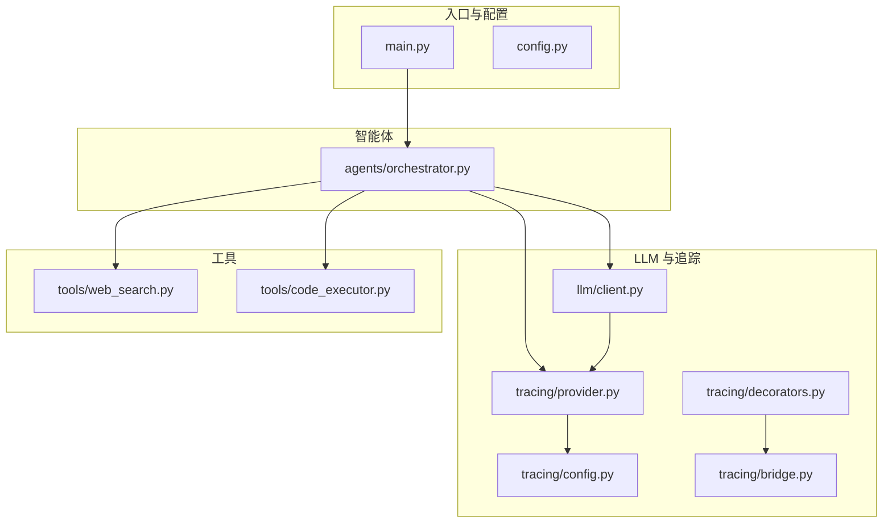
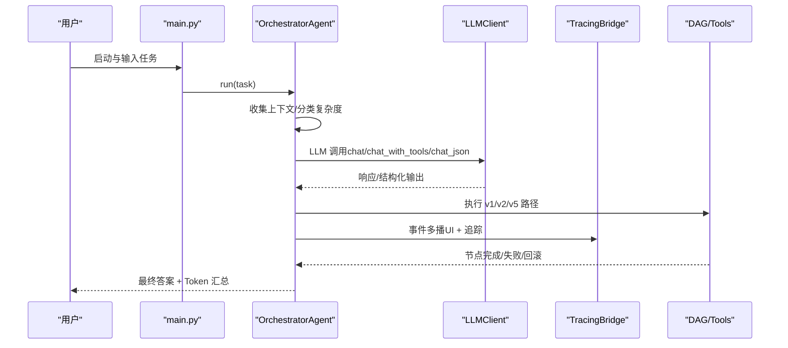
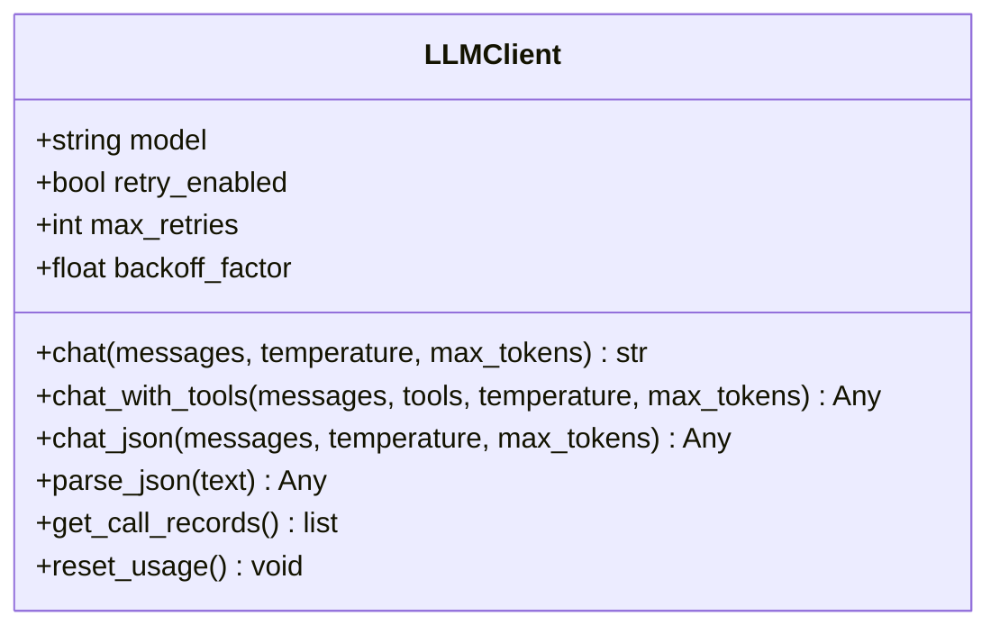
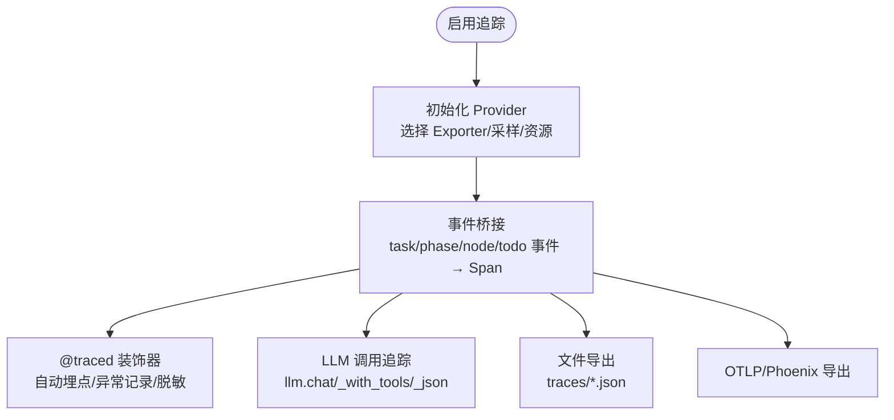
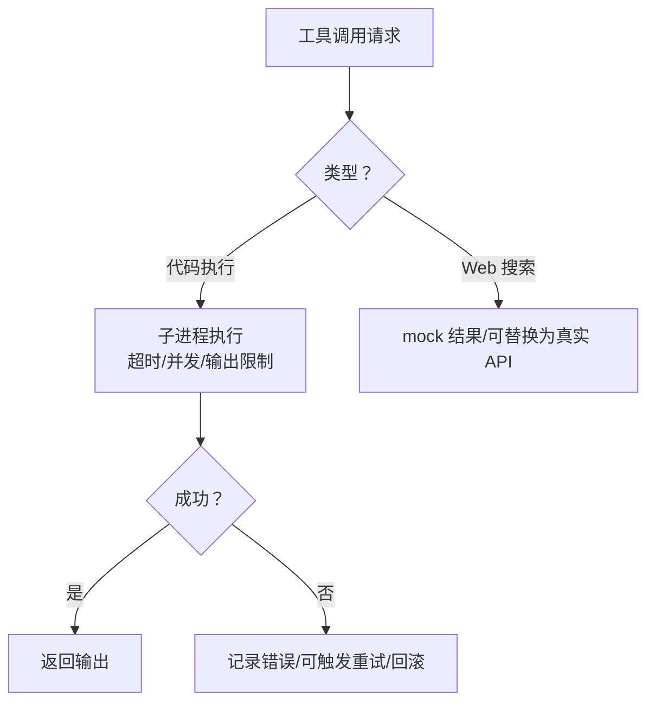
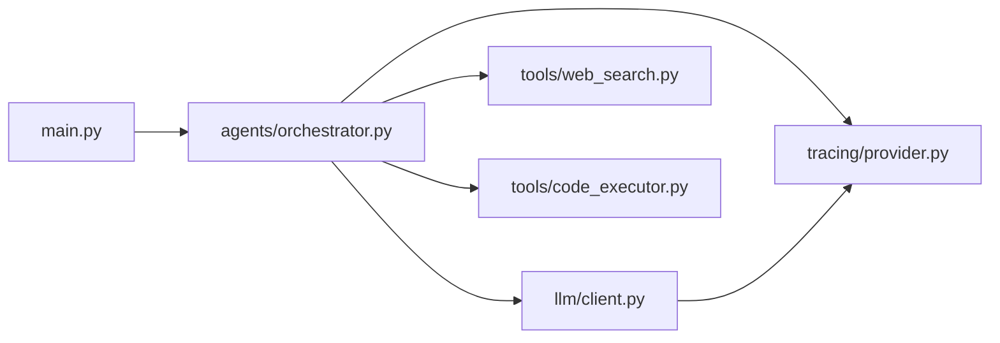

# 故障排除

<cite>
**本文引用的文件**
- [README.md](file://README.md)
- [config.py](file://config.py)
- [main.py](file://main.py)
- [llm/client.py](file://llm/client.py)
- [tracing/provider.py](file://tracing/provider.py)
- [tracing/config.py](file://tracing/config.py)
- [tracing/decorators.py](file://tracing/decorators.py)
- [tracing/bridge.py](file://tracing/bridge.py)
- [tools/code_executor.py](file://tools/code_executor.py)
- [tools/web_search.py](file://tools/web_search.py)
- [agents/orchestrator.py](file://agents/orchestrator.py)
- [tests/test_llm_integration.py](file://tests/test_llm_integration.py)
- [tests/test_tracing.py](file://tests/test_tracing.py)
- [sxw_aicoding/docs/tracing-guide.md](file://sxw_aicoding/docs/tracing-guide.md)
- [sxw_aicoding/docs/emergent-planning-test-scenarios.md](file://sxw_aicoding/docs/emergent-planning-test-scenarios.md)
- [.aone_copilot/plans/fix-dag-code-review-issues/implementation_plan.md](file://.aone_copilot/plans/fix-dag-code-review-issues/implementation_plan.md)
</cite>

## 目录
1. [简介](#简介)
2. [项目结构](#项目结构)
3. [核心组件](#核心组件)
4. [架构总览](#架构总览)
5. [详细组件分析](#详细组件分析)
6. [依赖分析](#依赖分析)
7. [性能考虑](#性能考虑)
8. [故障排除指南](#故障排除指南)
9. [结论](#结论)
10. [附录](#附录)

## 简介
本指南面向 manus_demo 的使用者与维护者，提供系统化的故障排除方法，涵盖 LLM API 问题、工具执行失败、追踪配置问题、网络与权限、资源限制、应急响应与恢复、诊断信息收集与上报、以及预防性维护与健康检查。文档结合项目实际代码与测试用例，给出可操作的排查流程、调试工具使用方法与根因定位技巧。

## 项目结构
manus_demo 是一个基于 DAG 的多智能体系统，支持混合规划路由（v4）、隐式规划（v5）、自适应规划（v3）与统一 ReAct 引擎（v6）。核心模块包括：
- 入口与 UI：main.py
- 配置中心：config.py
- LLM 客户端：llm/client.py
- 追踪系统：tracing/*（provider、config、decorators、bridge）
- 工具集：tools/*（web_search、code_executor、router 等）
- 智能体：agents/*（orchestrator、planner、executor、reflector、emergent_planner）
- DAG 执行：dag/*
- 测试：tests/*

图表来源
- [main.py:1-516](file://main.py#L1-L516)
- [config.py:1-109](file://config.py#L1-L109)
- [agents/orchestrator.py:1-600](file://agents/orchestrator.py#L1-L600)
- [llm/client.py:1-420](file://llm/client.py#L1-L420)
- [tracing/provider.py:1-197](file://tracing/provider.py#L1-L197)
- [tracing/config.py:1-79](file://tracing/config.py#L1-L79)
- [tracing/decorators.py:1-146](file://tracing/decorators.py#L1-L146)
- [tracing/bridge.py:115-149](file://tracing/bridge.py#L115-L149)
- [tools/web_search.py:1-113](file://tools/web_search.py#L1-L113)
- [tools/code_executor.py:1-102](file://tools/code_executor.py#L1-L102)

章节来源
- [README.md:97-154](file://README.md#L97-L154)
- [main.py:1-516](file://main.py#L1-L516)
- [config.py:1-109](file://config.py#L1-L109)

## 核心组件
- 配置中心：集中管理 LLM API、工具参数、追踪开关与采样率、超时与并发限制等。
- LLM 客户端：统一 OpenAI 兼容接口封装，支持重试、令牌追踪与追踪集成。
- 追踪系统：提供多后端导出（console/file/rich/otlp/phoenix）、装饰器埋点、桥接事件到 Span。
- 工具：Web 搜索（mock）、代码执行（沙箱 + 超时）、文件操作、Shell 命令。
- 智能体编排：Orchestrator 负责上下文收集、任务复杂度分类、路由到 v1/v2/v5 路径、执行与反思、记忆存储与 Token 汇总。

章节来源
- [config.py:13-109](file://config.py#L13-L109)
- [llm/client.py:32-420](file://llm/client.py#L32-L420)
- [tracing/provider.py:45-197](file://tracing/provider.py#L45-L197)
- [tracing/decorators.py:70-146](file://tracing/decorators.py#L70-L146)
- [tools/code_executor.py:64-102](file://tools/code_executor.py#L64-L102)
- [tools/web_search.py:87-113](file://tools/web_search.py#L87-L113)
- [agents/orchestrator.py:60-600](file://agents/orchestrator.py#L60-L600)

## 架构总览
manus_demo 的执行路径分为 v1（扁平计划）、v2（DAG 并行）、v5（隐式规划 TODO 列表）。Orchestrator 根据任务复杂度选择路径，执行期间通过事件驱动 UI 与追踪系统联动，支持失败回滚、条件分支、局部重规划与自适应规划。

图表来源
- [main.py:415-516](file://main.py#L415-L516)
- [agents/orchestrator.py:158-222](file://agents/orchestrator.py#L158-L222)
- [llm/client.py:73-228](file://llm/client.py#L73-L228)
- [tracing/bridge.py:115-149](file://tracing/bridge.py#L115-L149)

## 详细组件分析

### LLM 客户端与重试机制
- 支持基础文本对话、工具调用与结构化 JSON 输出。
- 可选指数退避重试（RateLimitError/APITimeoutError/APIError）。
- 追踪集成：在启用追踪时自动创建 llm.* Span，记录请求参数与令牌用量。
- 令牌追踪：可选开启，记录每次调用的 prompt/completion/total tokens。

图表来源
- [llm/client.py:32-420](file://llm/client.py#L32-L420)

章节来源
- [llm/client.py:73-228](file://llm/client.py#L73-L228)
- [llm/client.py:317-420](file://llm/client.py#L317-L420)
- [config.py:82-86](file://config.py#L82-L86)

### 追踪系统与事件桥接
- Provider：根据 TRACING_ENABLED/BACKEND/SAMPLE_RATE 初始化 TracerProvider，支持 console/file/rich/otlp/phoenix。
- Decorators：提供 @traced 装饰器，自动记录延迟、异常与敏感属性脱敏。
- Bridge：将 Orchestrator/UI 事件映射为 Span，构建任务生命周期与 DAG/TODO 执行层次。
- 配置：集中读取根 config 的追踪参数，含敏感键白名单与属性长度限制。

图表来源
- [tracing/provider.py:45-197](file://tracing/provider.py#L45-L197)
- [tracing/decorators.py:70-146](file://tracing/decorators.py#L70-L146)
- [tracing/bridge.py:115-149](file://tracing/bridge.py#L115-L149)
- [tracing/config.py:17-79](file://tracing/config.py#L17-L79)

章节来源
- [tracing/provider.py:45-197](file://tracing/provider.py#L45-L197)
- [tracing/decorators.py:30-146](file://tracing/decorators.py#L30-L146)
- [tracing/bridge.py:115-149](file://tracing/bridge.py#L115-L149)
- [tracing/config.py:17-79](file://tracing/config.py#L17-L79)

### 工具执行与资源限制
- 代码执行：子进程沙箱 + 超时控制 + 并发信号量 + 输出大小限制。
- Web 搜索：默认 mock 结果，可扩展真实搜索 API。
- 工具路由（v3）：失败次数统计与替代工具建议。

图表来源
- [tools/code_executor.py:64-102](file://tools/code_executor.py#L64-L102)
- [tools/web_search.py:87-113](file://tools/web_search.py#L87-L113)

章节来源
- [tools/code_executor.py:64-102](file://tools/code_executor.py#L64-L102)
- [config.py:71-77](file://config.py#L71-L77)

### 智能体编排与反思
- 上下文收集：长期/短期记忆 + 知识检索。
- 复杂度分类：规则快筛 + LLM 兜底，自动选择 v1/v2/v5。
- 执行与反思：v1 顺序、v2 DAG 并行、v5 TODO 列表；失败后局部重规划与回滚。
- Token 汇总：按调用记录与引擎维度统计。

章节来源
- [agents/orchestrator.py:158-222](file://agents/orchestrator.py#L158-L222)
- [agents/orchestrator.py:439-508](file://agents/orchestrator.py#L439-L508)
- [main.py:377-381](file://main.py#L377-L381)

## 依赖分析
- main.py 依赖 OrchestratorAgent、LLMClient 与工具集合，负责日志与 UI 渲染。
- OrchestratorAgent 依赖 Planner/Executor/Reflector、DAG 执行器、知识检索与记忆系统。
- LLMClient 依赖 OpenAI SDK 与追踪系统（可选）。
- 追踪系统依赖 OpenTelemetry SDK，按配置选择导出后端。

图表来源
- [main.py:34-42](file://main.py#L34-L42)
- [agents/orchestrator.py:43-55](file://agents/orchestrator.py#L43-L55)
- [llm/client.py:24-25](file://llm/client.py#L24-L25)
- [tracing/provider.py:23-31](file://tracing/provider.py#L23-L31)

章节来源
- [main.py:34-42](file://main.py#L34-L42)
- [agents/orchestrator.py:43-55](file://agents/orchestrator.py#L43-L55)
- [llm/client.py:24-25](file://llm/client.py#L24-L25)
- [tracing/provider.py:23-31](file://tracing/provider.py#L23-L31)

## 性能考虑
- 并行度与超时：MAX_PARALLEL_NODES、NODE_EXECUTION_TIMEOUT、CODE_EXEC_TIMEOUT、SHELL_EXEC_TIMEOUT 控制吞吐与稳定性。
- 令牌追踪：开启 TOKEN_TRACKING_ENABLED 可能增加少量开销，便于成本控制与优化。
- 追踪采样：TRACING_SAMPLE_RATE 控制全链路开销，建议在生产环境降低采样率。
- 缓存与复用：LLMClient 单实例复用，避免重复初始化。

章节来源
- [config.py:44-88](file://config.py#L44-L88)
- [config.py:102-109](file://config.py#L102-L109)

## 故障排除指南

### 一、LLM API 问题
常见症状
- 请求超时、速率限制、模型不支持 response_format、返回空 usage、重试失败。

排查步骤
1. 核对 .env/.env.example 中 LLM_BASE_URL、LLM_API_KEY、LLM_MODEL 是否正确。
2. 检查 LLM_RETRY_ENABLED、LLM_RETRY_MAX_ATTEMPTS、LLM_RETRY_BACKOFF_FACTOR 设置。
3. 启用详细日志（-v）观察 LLMClient 的重试日志与异常栈。
4. 若 response_format 不受支持，确认 chat_json 降级路径是否生效。
5. 开启 TRACING_LOG_PROMPTS（谨慎）查看完整 prompt，定位格式问题。

定位与根因
- LLMClient.chat/chat_with_tools/chat_json 的异常会被包装并记录，重试逻辑在 RETRYABLE_ERRORS 上下文中处理。
- 若 OTLP/Phoenix 导出器缺失，会回退到 console，不影响业务但影响追踪输出。

章节来源
- [README.md:180-208](file://README.md#L180-L208)
- [config.py:82-86](file://config.py#L82-L86)
- [llm/client.py:29-118](file://llm/client.py#L29-L118)
- [llm/client.py:203-228](file://llm/client.py#L203-L228)
- [tests/test_llm_integration.py:305-334](file://tests/test_llm_integration.py#L305-L334)
- [sxw_aicoding/docs/tracing-guide.md:861-873](file://sxw_aicoding/docs/tracing-guide.md#L861-L873)

### 二、工具执行失败
常见症状
- 代码执行超时、子进程异常、输出过大、并发超限、Shell 命令失败。

排查步骤
1. 检查 CODE_EXEC_TIMEOUT、SHELL_EXEC_TIMEOUT、SUBPROCESS_MAX_OUTPUT_BYTES、SANDBOX_DIR。
2. 查看 CodeExecutorTool 的超时与异常返回信息。
3. 确认并发信号量（CODE_MAX_CONCURRENT、SHELL_MAX_CONCURRENT）是否过小导致排队。
4. 对比工具路由（ToolRouter）失败阈值（TOOL_FAILURE_THRESHOLD）与替代建议是否触发。

定位与根因
- 代码执行失败会返回“超时/错误”信息，便于 UI 与追踪记录。
- Shell/Python 子进程通过 run_with_limits 限制资源，避免系统负载过高。

章节来源
- [config.py:71-77](file://config.py#L71-L77)
- [tools/code_executor.py:64-102](file://tools/code_executor.py#L64-L102)
- [config.py:54](file://config.py#L54)
- [.aone_copilot/plans/fix-dag-code-review-issues/implementation_plan.md:215-234](file://.aone_copilot/plans/fix-dag-code-review-issues/implementation_plan.md#L215-L234)

### 三、追踪配置问题
常见症状
- 追踪未生效、导出器不可用、属性被截断、Rich 控制台输出异常。

排查步骤
1. 确认 TRACING_ENABLED、TRACING_BACKEND、TRACING_ENDPOINT、TRACING_SAMPLE_RATE。
2. 安装缺失的导出器依赖（如 opentelemetry-exporter-otlp、rich）。
3. 调整 TRACING_MAX_ATTRIBUTE_LENGTH 以避免属性截断。
4. 使用 tests/test_tracing.py 的测试用例验证功能（需安装 OTel SDK）。

定位与根因
- Provider 根据 BACKEND 选择 Exporter，未知后端回退 console。
- 装饰器与工具执行均进行敏感键脱敏与长度截断。

章节来源
- [tracing/config.py:17-79](file://tracing/config.py#L17-L79)
- [tracing/provider.py:154-197](file://tracing/provider.py#L154-L197)
- [tracing/decorators.py:30-68](file://tracing/decorators.py#L30-L68)
- [tests/test_tracing.py:35-72](file://tests/test_tracing.py#L35-L72)
- [sxw_aicoding/docs/tracing-guide.md:843-904](file://sxw_aicoding/docs/tracing-guide.md#L843-L904)

### 四、网络连接与权限配置
- 网络：检查 LLM_BASE_URL 可达性、代理与防火墙；OTLP Endpoint 地址与端口。
- 权限：确保 .env/.env.example 中 API Key 正确；SANDBOX_DIR 有读写权限。
- 资源限制：适当提高 MAX_PARALLEL_NODES、NODE_EXECUTION_TIMEOUT、CODE_EXEC_TIMEOUT。

章节来源
- [README.md:180-208](file://README.md#L180-L208)
- [config.py:17-19](file://config.py#L17-L19)
- [config.py:71-77](file://config.py#L71-L77)
- [config.py:58-59](file://config.py#L58-L59)

### 五、DAG 执行与回滚/重试
常见症状
- 节点失败、超时、条件分支未满足、失败后未回滚或跳过子树。

排查步骤
1. 查看 DAGExecutor 的超时控制与回滚链实现。
2. 关注 node_failed 事件与回滚/跳过逻辑。
3. 检查自适应规划（ADAPTIVE_PLANNING_ENABLED、ADAPT_PLAN_INTERVAL）是否触发。
4. 使用 MAX_CHECKPOINTS 限制内存中 Checkpoint 数量，避免 OOM。

定位与根因
- DAGExecutor 在失败时执行回滚链并级联跳过下游节点。
- 超步间自适应规划可在重试后修改失败节点描述或建议替代方案。

章节来源
- [.aone_copilot/plans/fix-dag-code-review-issues/implementation_plan.md:200-234](file://.aone_copilot/plans/fix-dag-code-review-issues/implementation_plan.md#L200-L234)
- [config.py:48-51](file://config.py#L48-L51)
- [config.py:58-59](file://config.py#L58-L59)

### 六、隐式规划（v5）与 TODO 列表
常见症状
- TODO 失败后未重试、重试次数不足、阻塞 TODO 未被及时发现。

排查步骤
1. 检查 MAX_TODO_ITEMS、MAX_TODO_RETRIES、TODO_COMPRESSION_THRESHOLD。
2. 观察 TODO 生命周期事件（todo_start/todo_failed/todo_complete）。
3. 若启用 v8 目标驱动规划，关注 blocked TODO 的质量门控与建议。

定位与根因
- TODO 列表支持 mark_pending 重试机制，最多 MAX_TODO_RETRIES 次。
- 隐式规划完成后若存在 BLOCKED TODO，会触发低分反思与建议。

章节来源
- [config.py:63-67](file://config.py#L63-L67)
- [sxw_aicoding/docs/emergent-planning-test-scenarios.md:470-536](file://sxw_aicoding/docs/emergent-planning-test-scenarios.md#L470-L536)
- [agents/orchestrator.py:408-432](file://agents/orchestrator.py#L408-L432)

### 七、日志分析与性能监控
- 日志级别：使用 -v 启用 DEBUG，观察 LLMClient 重试、工具执行、事件桥接等细节。
- Token 消耗：UI 与 TokenUsageSummary 可视化展示 per-call 与按引擎汇总。
- 追踪文件：FileSpanExporter 输出 traces/*.json，便于离线分析。

章节来源
- [main.py:396-412](file://main.py#L396-L412)
- [main.py:113-177](file://main.py#L113-L177)
- [agents/orchestrator.py:532-554](file://agents/orchestrator.py#L532-L554)
- [tests/test_tracing.py:308-384](file://tests/test_tracing.py#L308-L384)

### 八、使用追踪系统进行问题定位
- 事件映射：task_start/phase/dag_created/superstep/node_* 等事件映射为 Span 层级。
- 异常记录：@traced 与 LLMClient 的 Span 自动记录异常类型与消息。
- 导出验证：OTLP/Phoenix 需要相应依赖；缺失时回退 console。

章节来源
- [tracing/bridge.py:115-149](file://tracing/bridge.py#L115-L149)
- [tracing/decorators.py:105-116](file://tracing/decorators.py#L105-L116)
- [llm/client.py:371-420](file://llm/client.py#L371-L420)
- [tests/test_tracing.py:191-301](file://tests/test_tracing.py#L191-L301)

### 九、应急响应与故障恢复
- 立即措施：关闭高采样率（TRACING_SAMPLE_RATE）、降低 MAX_PARALLEL_NODES、提高超时阈值。
- 降级策略：禁用追踪（TRACING_ENABLED=false）或切换到 console/file 后端。
- 重启与清理：清空 traces 目录、重置长期记忆目录（MEMORY_DIR）。

章节来源
- [tracing/config.py:33](file://tracing/config.py#L33)
- [config.py:102-109](file://config.py#L102-L109)

### 十、诊断信息收集与问题上报
- 收集清单
  - 日志：-v 输出、LLMClient 重试日志、工具执行错误。
  - 追踪：traces/*.json（File 后端）、OTLP/Phoenix 导出器状态。
  - 配置：.env/.env.example、config.py 中关键参数。
  - 任务上下文：最后一次任务输入、最终答案片段、Token 汇总。
- 上报建议：附带最小可复现任务描述、环境信息（Python 版本、依赖版本）、相关日志与 traces 文件。

章节来源
- [tests/test_tracing.py:308-384](file://tests/test_tracing.py#L308-L384)
- [README.md:180-208](file://README.md#L180-L208)

### 十一、预防性维护与健康检查
- 健康检查清单
  - API 连通性：定期 ping LLM_BASE_URL。
  - 资源压力：监控 CPU/内存/磁盘，调整 MAX_PARALLEL_NODES 与超时。
  - 追踪可用性：验证 OTLP/Phoenix Endpoint 可达与依赖安装。
  - 配置审计：定期核对 .env 与 config.py 默认值差异。
- 维护建议
  - 生产环境降低 TRACING_SAMPLE_RATE，避免追踪成为瓶颈。
  - 为关键工具（如代码执行）设置合理的超时与并发上限。
  - 使用 Checkpoint 与日志定期归档，避免无限增长。

章节来源
- [config.py:44-88](file://config.py#L44-L88)
- [config.py:102-109](file://config.py#L102-L109)

## 结论
本指南提供了从配置、API、工具、追踪到 DAG 执行的全链路故障排除方法。建议在日常运维中结合日志与追踪文件进行根因分析，利用测试用例验证关键路径，建立预防性维护与应急响应流程，确保系统稳定与可恢复性。

## 附录

### A. 常见错误码与异常解释
- LLM 重试相关异常：RateLimitError、APITimeoutError、APIError。参见 LLMClient 的 RETRYABLE_ERRORS 与重试逻辑。
- 追踪导出器缺失：OTLP/Phoenix 依赖未安装时回退 console。
- 属性截断：超过 TRACING_MAX_ATTRIBUTE_LENGTH 的属性会被截断并标记 [truncated]。
- 超时错误：节点执行超时（NODE_EXECUTION_TIMEOUT）、代码执行超时（CODE_EXEC_TIMEOUT）。

章节来源
- [llm/client.py:29-118](file://llm/client.py#L29-L118)
- [tracing/provider.py:176-197](file://tracing/provider.py#L176-L197)
- [tracing/decorators.py:30-68](file://tracing/decorators.py#L30-L68)
- [.aone_copilot/plans/fix-dag-code-review-issues/implementation_plan.md:215-234](file://.aone_copilot/plans/fix-dag-code-review-issues/implementation_plan.md#L215-L234)

### B. 快速检查清单
- 配置：LLM_BASE_URL/API_KEY/MODEL、TRACING_ENABLED/BACKEND、超时与并发参数。
- 网络：API 与 OTLP Endpoint 可达。
- 权限：.env 正确、SANDBOX_DIR 可写。
- 追踪：依赖安装、采样率合理、属性长度足够。
- 工具：代码执行超时/并发/输出限制合理。
- DAG：MAX_CHECKPOINTS、NODE_EXECUTION_TIMEOUT、自适应规划开关。

章节来源
- [README.md:180-208](file://README.md#L180-L208)
- [config.py:17-19](file://config.py#L17-L19)
- [config.py:102-109](file://config.py#L102-L109)
- [config.py:71-77](file://config.py#L71-L77)
- [config.py:58-59](file://config.py#L58-L59)