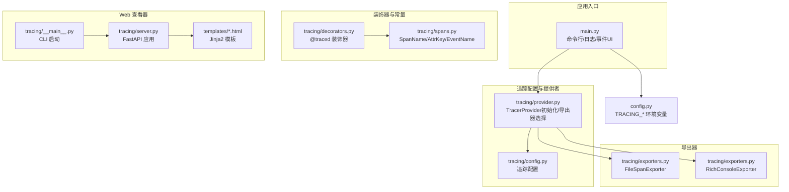
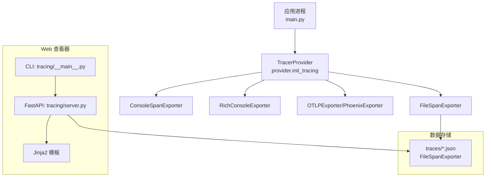
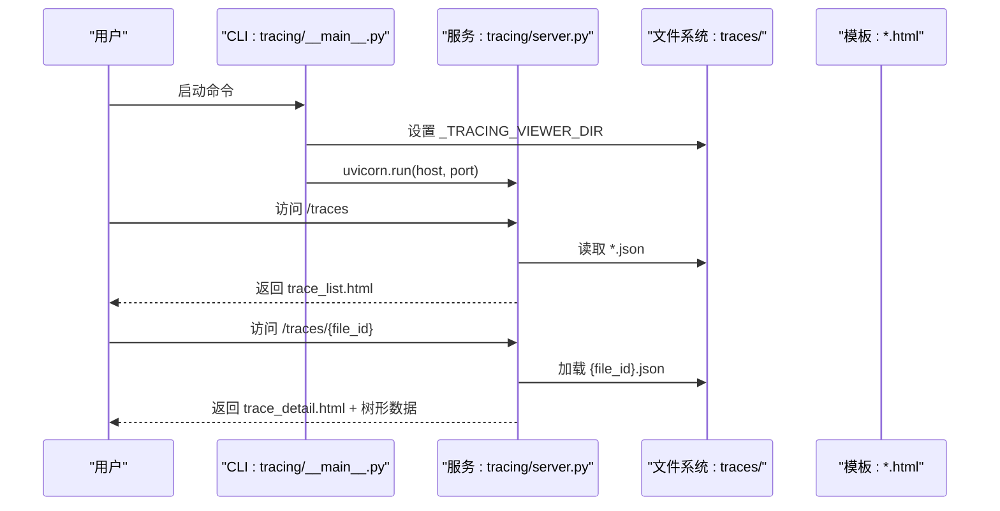
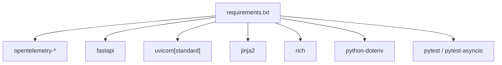

# 调试工具

<cite>
**本文引用的文件**
- [main.py](file://main.py)
- [config.py](file://config.py)
- [tracing/__main__.py](file://tracing/__main__.py)
- [tracing/server.py](file://tracing/server.py)
- [tracing/config.py](file://tracing/config.py)
- [tracing/provider.py](file://tracing/provider.py)
- [tracing/exporters.py](file://tracing/exporters.py)
- [tracing/decorators.py](file://tracing/decorators.py)
- [tracing/spans.py](file://tracing/spans.py)
- [tracing/templates/base.html](file://tracing/templates/base.html)
- [tracing/templates/trace_list.html](file://tracing/templates/trace_list.html)
- [tracing/templates/trace_detail.html](file://tracing/templates/trace_detail.html)
- [requirements.txt](file://requirements.txt)
- [tests/test_tracing.py](file://tests/test_tracing.py)
</cite>

## 目录
1. [简介](#简介)
2. [项目结构](#项目结构)
3. [核心组件](#核心组件)
4. [架构总览](#架构总览)
5. [详细组件分析](#详细组件分析)
6. [依赖分析](#依赖分析)
7. [性能考虑](#性能考虑)
8. [故障排查指南](#故障排查指南)
9. [结论](#结论)
10. [附录](#附录)

## 简介
本指南面向 manus_demo 的调试与问题定位，聚焦内置调试工具链：日志系统、追踪系统（OpenTelemetry）、追踪 Web 查看器（FastAPI + Jinja2 + Rich 控制台导出）、以及性能与状态观测能力。读者将学会：
- 如何启用详细日志模式与追踪后端
- 如何查看追踪数据、分析执行流程与性能瓶颈
- 如何启动并使用追踪 Web 查看器，访问可视化界面
- 如何收集与分析调试信息（状态快照、执行轨迹、性能指标）
- 如何使用调试命令行参数与环境变量

## 项目结构
manus_demo 的调试工具主要分布在以下模块：
- 日志与命令行：main.py 提供 -v/--verbose 详细日志模式与 Rich 控制台输出
- 追踪配置与提供者：tracing/config.py、tracing/provider.py
- 导出器：tracing/exporters.py（文件导出、Rich 控制台导出）
- 装饰器与常量：tracing/decorators.py、tracing/spans.py
- Web 查看器：tracing/__main__.py（CLI）、tracing/server.py（FastAPI 应用）、Jinja2 模板
- 环境变量配置：config.py（含 TRACING_*）

图表来源
- [main.py:396-516](file://main.py#L396-L516)
- [tracing/config.py:14-79](file://tracing/config.py#L14-L79)
- [tracing/provider.py:45-197](file://tracing/provider.py#L45-L197)
- [tracing/exporters.py:28-304](file://tracing/exporters.py#L28-L304)
- [tracing/decorators.py:70-146](file://tracing/decorators.py#L70-L146)
- [tracing/spans.py:18-249](file://tracing/spans.py#L18-L249)
- [tracing/__main__.py:21-108](file://tracing/__main__.py#L21-L108)
- [tracing/server.py:29-276](file://tracing/server.py#L29-L276)
- [tracing/templates/base.html:1-229](file://tracing/templates/base.html#L1-L229)
- [config.py:98-109](file://config.py#L98-L109)

章节来源
- [main.py:396-516](file://main.py#L396-L516)
- [config.py:98-109](file://config.py#L98-L109)

## 核心组件
- 日志系统与命令行
  - 通过 -v/--verbose 启用详细日志（DEBUG 级别），使用 RichHandler 输出，抑制第三方噪声日志
  - 事件驱动 UI：on_event 将执行阶段、DAG 节点状态、反思结果等渲染为 Rich 输出
- 追踪配置与提供者
  - TRACING_ENABLED、TRACING_BACKEND、TRACING_ENDPOINT、TRACING_SERVICE_NAME、TRACING_SAMPLE_RATE、TRACING_LOG_PROMPTS、TRACING_MAX_ATTRIBUTE_LENGTH
  - provider.init_tracing 根据后端选择 Console/File/Rich/OTLP/Phoenix 导出器，配置采样与批处理
- 导出器
  - FileSpanExporter：将完成的 Span 写入 traces/*.json，合并同 trace_id 的多次导出
  - RichConsoleExporter：在终端以 Rich 树渲染 Span 层级与耗时
- 装饰器与常量
  - @traced：对同步/异步方法自动埋点，记录异常、延迟、敏感属性脱敏与截断
  - SpanName/AttrKey/EventName：统一语义常量，遵循 OpenTelemetry GenAI 语义规范
- Web 查看器
  - CLI：tracing/__main__.py 支持 --port/--dir/--host/--no-open，自动打开浏览器
  - 服务：FastAPI + Jinja2 模板，提供 /traces 列表页与 /traces/{file_id} 详情页，树形可视化与属性/事件查看

章节来源
- [main.py:396-516](file://main.py#L396-L516)
- [tracing/config.py:14-79](file://tracing/config.py#L14-L79)
- [tracing/provider.py:45-197](file://tracing/provider.py#L45-L197)
- [tracing/exporters.py:28-304](file://tracing/exporters.py#L28-L304)
- [tracing/decorators.py:70-146](file://tracing/decorators.py#L70-L146)
- [tracing/spans.py:18-249](file://tracing/spans.py#L18-L249)
- [tracing/__main__.py:21-108](file://tracing/__main__.py#L21-L108)
- [tracing/server.py:29-276](file://tracing/server.py#L29-L276)

## 架构总览
manus_demo 的调试工具链采用“配置驱动 + OpenTelemetry SDK + 多后端导出”的架构。运行时通过 TRACING_* 环境变量控制追踪行为，支持：
- 控制台即时输出（console/rich）
- 文件离线分析（file）
- OTLP/Phoenix 远程上报（otlp/phoenix）

Web 查看器独立部署，读取 traces 目录下的 JSON 文件，提供树形可视化与属性/事件详情。

图表来源
- [tracing/provider.py:45-197](file://tracing/provider.py#L45-L197)
- [tracing/exporters.py:28-304](file://tracing/exporters.py#L28-L304)
- [tracing/__main__.py:21-108](file://tracing/__main__.py#L21-L108)
- [tracing/server.py:65-149](file://tracing/server.py#L65-L149)

## 详细组件分析

### 日志系统与命令行参数
- 启用详细日志
  - 使用 -v 或 --verbose 启用 DEBUG 级别日志，RichHandler 输出，抑制 httpx/openai/httpcore 的低优先级日志
- 事件驱动 UI
  - on_event 将任务开始/阶段切换/DAG 执行/反思/工具调用等事件渲染为 Rich 输出，便于快速定位问题
- 常见用途
  - 快速复现问题：-v 观察执行路径与异常栈
  - 结合追踪：同时开启 TRACING_ENABLED=true 与 -v，获得“日志+追踪”双视角

章节来源
- [main.py:396-516](file://main.py#L396-L516)

### 追踪配置与提供者
- 关键配置项（TRACING_*）
  - TRACING_ENABLED：总开关（默认 false）
  - TRACING_BACKEND：console | file | rich | otlp | phoenix
  - TRACING_ENDPOINT：OTLP HTTP 端点（默认本地）
  - TRACING_SERVICE_NAME：服务标识（默认 manus-demo）
  - TRACING_SAMPLE_RATE：采样率（0.0~1.0，默认 1.0）
  - TRACING_LOG_PROMPTS：是否记录完整 prompt/response（默认 false）
  - TRACING_MAX_ATTRIBUTE_LENGTH：属性最大长度（默认 1000）
- 提供者初始化
  - 根据后端选择 SimpleSpanProcessor（console/rich）或 BatchSpanProcessor（file/otlp/phoenix）
  - 采样策略：1.0 时 ALWAYS_ON，否则按比例采样
  - 资源标识：service.name、service.version、deployment.environment

章节来源
- [config.py:98-109](file://config.py#L98-L109)
- [tracing/config.py:14-79](file://tracing/config.py#L14-L79)
- [tracing/provider.py:45-197](file://tracing/provider.py#L45-L197)

### 导出器与数据格式
- FileSpanExporter
  - 输出路径：traces/{trace_id}.json
  - 合并策略：同 trace_id 的多次导出会合并到同一文件
  - 字段：trace_id、exported_at、spans（包含 span_id、parent_span_id、name、start_time、end_time、duration_ms、attributes、events、status）
- RichConsoleExporter
  - 以 Rich 树渲染，展示层级、耗时、状态与关键属性摘要
  - 适合开发调试与快速审查

章节来源
- [tracing/exporters.py:28-304](file://tracing/exporters.py#L28-L304)

### 装饰器与属性安全
- @traced
  - 自动记录开始/结束时间、异常、延迟（ms）
  - 属性安全：敏感键（如 api_key/password/token）统一脱敏；长文本截断
- SpanName/AttrKey/EventName
  - 统一语义常量，遵循 OpenTelemetry GenAI 语义规范，便于跨模块一致化观测

章节来源
- [tracing/decorators.py:70-146](file://tracing/decorators.py#L70-L146)
- [tracing/spans.py:18-249](file://tracing/spans.py#L18-L249)

### Web 查看器（追踪可视化）
- 启动方式
  - python -m tracing [--port 8600] [--dir traces] [--host 127.0.0.1] [--no-open]
  - 自动设置 _TRACING_VIEWER_DIR 环境变量，供服务读取 traces 目录
- 页面功能
  - 列表页：按导出时间倒序列出 trace，显示根 Span、总时长、状态、文件大小
  - 详情页：树形可视化，点击节点查看属性与事件，支持展开/折叠与复制长文本
- 模板与样式
  - base.html 提供深色主题与响应式布局
  - trace_list.html/trace_detail.html 渲染列表与详情

图表来源
- [tracing/__main__.py:21-108](file://tracing/__main__.py#L21-L108)
- [tracing/server.py:65-149](file://tracing/server.py#L65-L149)
- [tracing/server.py:219-276](file://tracing/server.py#L219-L276)
- [tracing/templates/base.html:1-229](file://tracing/templates/base.html#L1-L229)
- [tracing/templates/trace_list.html:1-63](file://tracing/templates/trace_list.html#L1-L63)
- [tracing/templates/trace_detail.html:1-644](file://tracing/templates/trace_detail.html#L1-L644)

## 依赖分析
- 运行时依赖
  - OpenTelemetry API/SDK/OTLP 导出器（追踪）
  - FastAPI/Uvicorn/Jinja2（Web 查看器）
  - Rich（RichConsoleExporter 与 UI）
  - python-dotenv（加载 .env）
- 可选依赖
  - pytest/pytest-asyncio（测试追踪功能）

图表来源
- [requirements.txt:1-19](file://requirements.txt#L1-L19)

章节来源
- [requirements.txt:1-19](file://requirements.txt#L1-L19)

## 性能考虑
- 采样率
  - TRACING_SAMPLE_RATE 接近 0 时显著降低追踪开销；1.0 时全量追踪
- 导出策略
  - console/rich：SimpleSpanProcessor，立即输出，适合开发
  - file/otlp/phoenix：BatchSpanProcessor，异步批处理，降低 I/O/网络开销
- 属性截断与脱敏
  - TRACING_MAX_ATTRIBUTE_LENGTH 与敏感键检测，避免大字段与敏感信息造成性能与安全问题
- Web 查看器
  - 列表按文件修改时间倒序，避免一次性加载过多文件；详情页按需渲染树形与长文本

章节来源
- [tracing/provider.py:90-107](file://tracing/provider.py#L90-L107)
- [tracing/decorators.py:30-68](file://tracing/decorators.py#L30-L68)
- [tracing/server.py:65-121](file://tracing/server.py#L65-L121)

## 故障排查指南
- 启动 Web 查看器报错
  - uvicorn 缺失：安装 uvicorn[standard]；CLI 会提示安装命令
  - traces 目录不存在：先运行应用并导出追踪（TRACING_ENABLED=true TRACING_BACKEND=file），再启动查看器
  - 无 trace 文件：等待应用产生 trace 或检查导出器是否正确工作
- 追踪未生效
  - TRACING_ENABLED=false 时追踪为零开销（装饰器与桥接均为 no-op）
  - 检查 TRACING_BACKEND 是否正确安装对应导出器（如 OTLP）
- 日志不显示
  - 确认使用 -v/--verbose 启用 DEBUG
  - 检查第三方库日志级别被抑制（httpx/openai/httpcore）
- 数据不完整
  - file 导出可能因批处理延迟导致未落盘，可手动触发 flush（FileSpanExporter 提供 force_flush）
- Web 查看器无法访问
  - 检查 --host/--port 参数与防火墙
  - 确保 _TRACING_VIEWER_DIR 环境变量指向正确的 traces 目录

章节来源
- [tracing/__main__.py:52-92](file://tracing/__main__.py#L52-L92)
- [tracing/provider.py:176-196](file://tracing/provider.py#L176-L196)
- [tracing/exporters.py:94-96](file://tracing/exporters.py#L94-L96)
- [main.py:396-413](file://main.py#L396-L413)

## 结论
manus_demo 的调试工具链提供了“日志 + 追踪 + 可视化”的完整闭环：通过 -v 快速定位问题，通过 TRACING_* 精细控制追踪行为，通过 Web 查看器直观分析执行轨迹与性能。建议在问题复现阶段同时启用详细日志与文件导出，随后使用 Web 查看器进行深入分析。

## 附录

### 调试命令行参数与环境变量速查
- 命令行
  - -v/--verbose：启用详细日志（DEBUG 级别）
- 环境变量（TRACING_*）
  - TRACING_ENABLED：布尔，总开关
  - TRACING_BACKEND：console | file | rich | otlp | phoenix
  - TRACING_ENDPOINT：OTLP 端点 URL
  - TRACING_SERVICE_NAME：服务名
  - TRACING_SAMPLE_RATE：采样率（0.0~1.0）
  - TRACING_LOG_PROMPTS：是否记录完整 prompt/response
  - TRACING_MAX_ATTRIBUTE_LENGTH：属性最大长度

章节来源
- [main.py:502-503](file://main.py#L502-L503)
- [config.py:98-109](file://config.py#L98-L109)

### 追踪 Web 查看器使用步骤
- 启动查看器
  - python -m tracing [--port 8600] [--dir traces] [--host 127.0.0.1] [--no-open]
- 访问页面
  - 列表页：http://127.0.0.1:8600/traces
  - 详情页：http://127.0.0.1:8600/traces/{file_id}
- 分析要点
  - 列表页：按总时长排序，快速定位慢 trace
  - 详情页：树形结构查看父-子关系，点击节点查看属性与事件，复制长文本辅助分析

章节来源
- [tracing/__main__.py:21-108](file://tracing/__main__.py#L21-L108)
- [tracing/server.py:219-276](file://tracing/server.py#L219-L276)
- [tracing/templates/trace_list.html:1-63](file://tracing/templates/trace_list.html#L1-L63)
- [tracing/templates/trace_detail.html:1-644](file://tracing/templates/trace_detail.html#L1-L644)

### 调试脚本与辅助工具建议
- 一键启动 Web 查看器
  - 建议编写脚本设置 TRACING_ENABLED=true TRACING_BACKEND=file，运行应用生成 traces，再启动 python -m tracing
- 导出与分析
  - 使用 FileSpanExporter 输出 JSON，结合 Web 查看器进行可视化分析
  - 对于 OTLP/Phoenix，确保安装 opentelemetry-exporter-otlp 并正确配置端点
- 性能观测
  - 通过 @traced 记录的关键属性（如 latency_ms、gen_ai.usage.*、tool.*）在 Web 查看器中筛选与聚合

章节来源
- [tracing/provider.py:176-196](file://tracing/provider.py#L176-L196)
- [tracing/exporters.py:28-304](file://tracing/exporters.py#L28-L304)
- [tracing/decorators.py:70-146](file://tracing/decorators.py#L70-L146)
- [tracing/spans.py:86-184](file://tracing/spans.py#L86-L184)