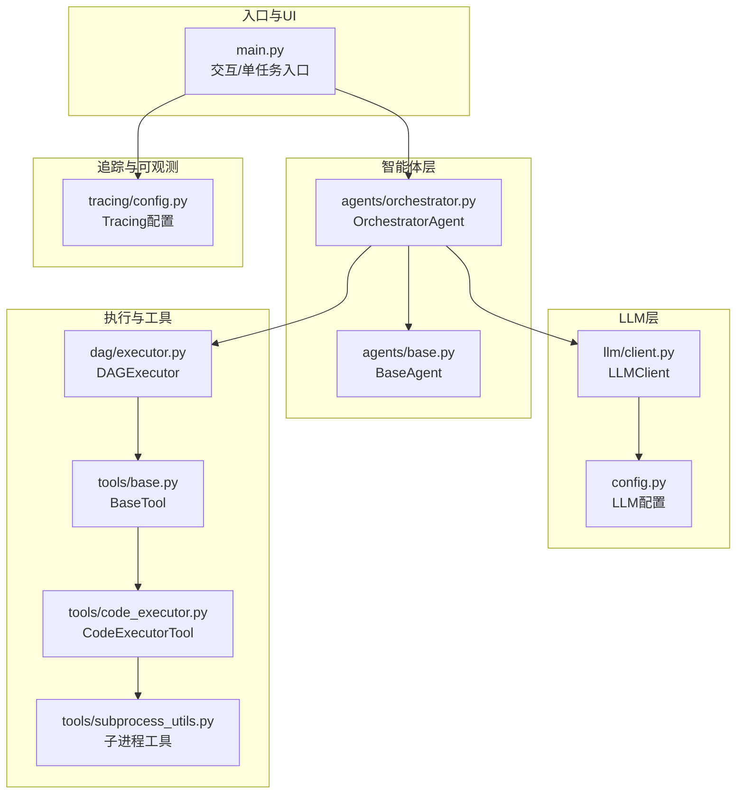
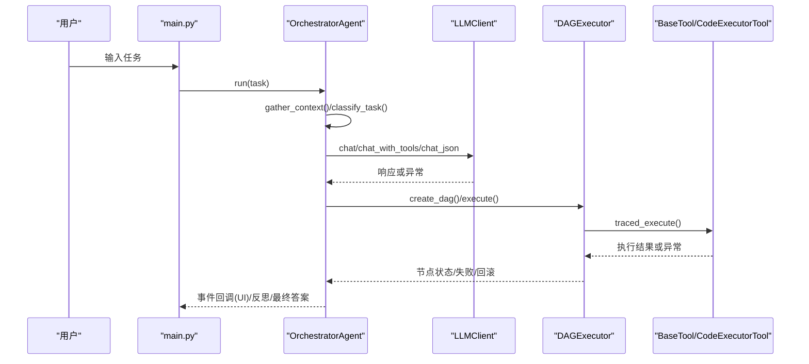
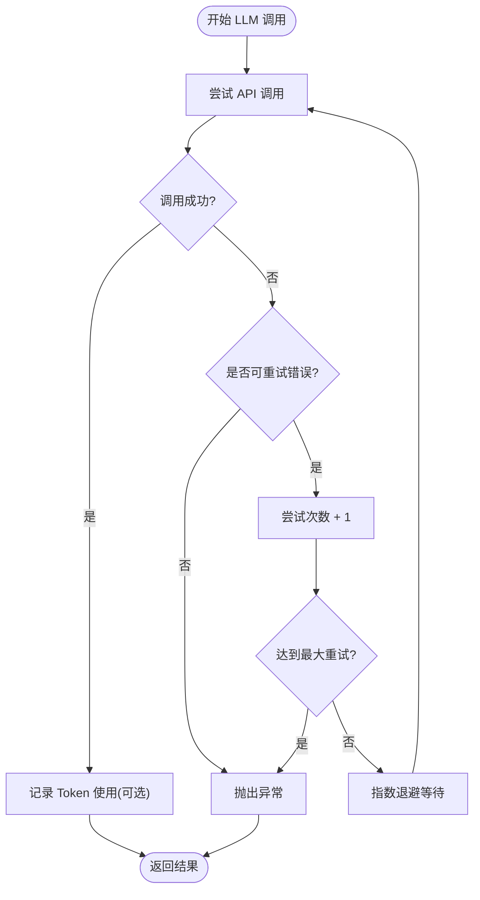
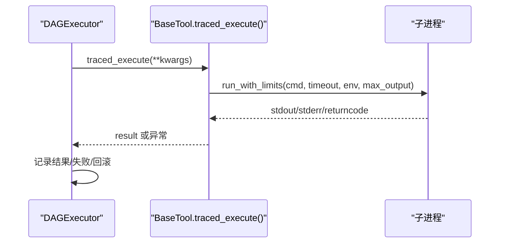
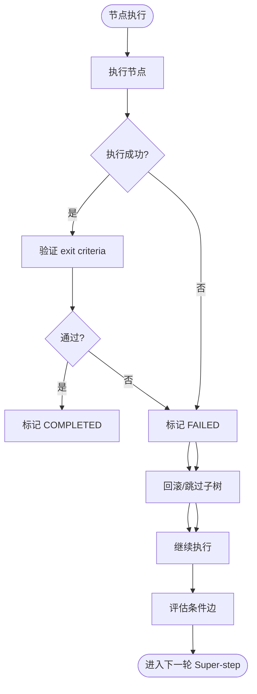
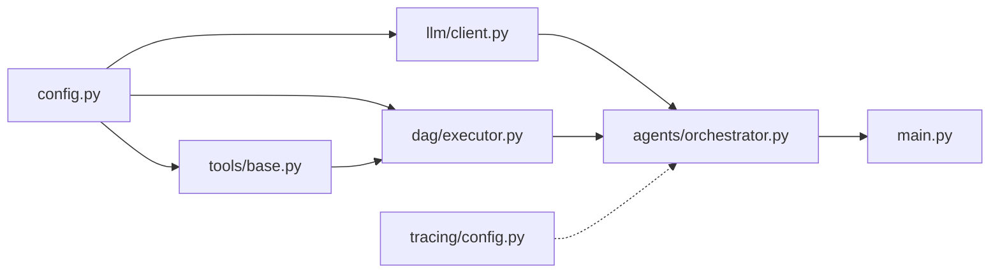

# 错误处理

<cite>
**本文引用的文件**
- [main.py](file://main.py)
- [config.py](file://config.py)
- [llm/client.py](file://llm/client.py)
- [agents/base.py](file://agents/base.py)
- [agents/orchestrator.py](file://agents/orchestrator.py)
- [dag/executor.py](file://dag/executor.py)
- [tools/base.py](file://tools/base.py)
- [tools/code_executor.py](file://tools/code_executor.py)
- [tools/subprocess_utils.py](file://tools/subprocess_utils.py)
- [tracing/config.py](file://tracing/config.py)
- [tests/test_llm_integration.py](file://tests/test_llm_integration.py)
- [sxw_aicoding/docs/llm-integration.md](file://sxw_aicoding/docs/llm-integration.md)
- [sxw_aicoding/docs/tracing-guide.md](file://sxw_aicoding/docs/tracing-guide.md)
- [README.md](file://README.md)
</cite>

## 目录
1. [简介](#简介)
2. [项目结构](#项目结构)
3. [核心组件](#核心组件)
4. [架构总览](#架构总览)
5. [详细组件分析](#详细组件分析)
6. [依赖分析](#依赖分析)
7. [性能考量](#性能考量)
8. [故障排查指南](#故障排查指南)
9. [结论](#结论)
10. [附录](#附录)

## 简介
本指南聚焦于 manus_demo 的错误处理与异常管理，系统性阐述 LLM API 错误、工具执行错误、网络连接错误、资源限制错误等的分类、优先级与处理策略；介绍可恢复与不可恢复错误的界定；提供 LLM 重试机制的配置与使用方法（指数退避、最大重试次数）；说明如何实现优雅降级与故障转移；并给出错误日志记录与监控告警的配置思路，以及错误诊断与根因分析的方法。

## 项目结构
manus_demo 采用“多智能体 + DAG 执行 + 工具调用”的分层架构。错误处理贯穿 LLM 客户端、工具层、DAG 执行器与 Orchestrator 协调器，配合可选的全链路追踪模块，形成从底层 API 到上层 UI 的闭环可观测与稳健执行。

图表来源
- [main.py:1-516](file://main.py#L1-L516)
- [agents/orchestrator.py:1-600](file://agents/orchestrator.py#L1-L600)
- [llm/client.py:1-420](file://llm/client.py#L1-L420)
- [dag/executor.py:1-648](file://dag/executor.py#L1-L648)
- [tools/base.py:1-175](file://tools/base.py#L1-L175)
- [tools/code_executor.py:1-102](file://tools/code_executor.py#L1-L102)
- [tools/subprocess_utils.py:1-156](file://tools/subprocess_utils.py#L1-L156)
- [tracing/config.py:1-79](file://tracing/config.py#L1-L79)

章节来源
- [README.md:1-400](file://README.md#L1-L400)

## 核心组件
- LLMClient：统一的 OpenAI 兼容 API 封装，支持可选的指数退避重试、Token 使用追踪与可选的全链路追踪埋点。
- BaseTool：工具抽象基类，提供 traced_execute() 以在启用追踪时自动包装工具执行。
- CodeExecutorTool：Python 代码执行工具，基于子进程沙箱执行，具备超时与输出限制。
- DAGExecutor：DAG 执行引擎，实现并行 Super-step、节点状态机、失败回滚、条件边评估与局部重规划。
- OrchestratorAgent：多智能体流水线的协调者，负责上下文收集、路由到不同规划路径、执行与反思、以及事件广播。
- 配置模块：集中管理 LLM、工具、DAG 执行、追踪等配置项。

章节来源
- [llm/client.py:1-420](file://llm/client.py#L1-L420)
- [tools/base.py:1-175](file://tools/base.py#L1-L175)
- [tools/code_executor.py:1-102](file://tools/code_executor.py#L1-L102)
- [dag/executor.py:1-648](file://dag/executor.py#L1-L648)
- [agents/orchestrator.py:1-600](file://agents/orchestrator.py#L1-L600)
- [config.py:1-109](file://config.py#L1-L109)

## 架构总览
下图展示了错误处理在系统中的关键触点：LLM 重试、工具执行超时与异常、DAG 执行失败回滚与条件边跳过、事件驱动 UI 与可选的全链路追踪。

图表来源
- [main.py:415-516](file://main.py#L415-L516)
- [agents/orchestrator.py:158-222](file://agents/orchestrator.py#L158-L222)
- [llm/client.py:73-177](file://llm/client.py#L73-L177)
- [dag/executor.py:110-264](file://dag/executor.py#L110-L264)
- [tools/base.py:60-124](file://tools/base.py#L60-L124)

## 详细组件分析

### LLM API 错误与重试机制
- 可重试错误类型：速率限制、请求超时、通用 API 错误。
- 重试策略：指数退避，等待时间随尝试次数增长；最大重试次数与退避因子可配置。
- 重试循环：在 LLMClient 的 chat/chat_with_tools/chat_json 中统一实现，失败时记录警告并等待，直至成功或达到最大重试。
- 不可重试错误：认证错误、参数错误、权限错误、配额超限等，直接抛出异常。
- JSON 解析降级：当 API 不支持结构化输出时，自动降级为从纯文本中提取 JSON，增强兼容性。

图表来源
- [llm/client.py:92-118](file://llm/client.py#L92-L118)
- [llm/client.py:148-176](file://llm/client.py#L148-L176)
- [llm/client.py:202-228](file://llm/client.py#L202-L228)
- [config.py:82-86](file://config.py#L82-L86)

章节来源
- [llm/client.py:1-420](file://llm/client.py#L1-L420)
- [config.py:1-109](file://config.py#L1-L109)
- [tests/test_llm_integration.py:305-334](file://tests/test_llm_integration.py#L305-L334)
- [sxw_aicoding/docs/llm-integration.md:661-714](file://sxw_aicoding/docs/llm-integration.md#L661-L714)

### 工具执行错误与资源限制
- 工具基类：BaseTool 提供 traced_execute()，在启用追踪时自动包装执行，记录参数、耗时、成功/失败与异常。
- 代码执行工具：CodeExecutorTool 使用子进程沙箱执行 Python 代码，具备超时、输出大小限制与并发信号量控制，避免资源滥用。
- 子进程工具：subprocess_utils 提供安全环境变量清理、输出字节预算与超时 kill 保障，防止孤儿进程与内存耗尽。
- 错误传播：工具异常被捕获并转换为 StepResult.success=False 的结果，交由上层 DAGExecutor 处理。

图表来源
- [tools/base.py:60-124](file://tools/base.py#L60-L124)
- [tools/code_executor.py:64-102](file://tools/code_executor.py#L64-L102)
- [tools/subprocess_utils.py:62-156](file://tools/subprocess_utils.py#L62-L156)
- [dag/executor.py:291-310](file://dag/executor.py#L291-L310)

章节来源
- [tools/base.py:1-175](file://tools/base.py#L1-L175)
- [tools/code_executor.py:1-102](file://tools/code_executor.py#L1-L102)
- [tools/subprocess_utils.py:1-156](file://tools/subprocess_utils.py#L1-L156)
- [dag/executor.py:1-648](file://dag/executor.py#L1-L648)

### DAG 执行错误与故障转移
- 失败处理：节点执行失败时，根据是否存在回滚边决定执行回滚节点或直接跳过；随后级联跳过下游子树，避免在不完整状态继续执行。
- 条件边：根据上游节点输出动态评估条件边，满足则激活，否则跳过并记录。
- 超时保护：每个节点执行带超时，超时返回失败结果并触发失败处理。
- 局部重规划：反思失败时仅重建失败子树，保留已完成工作，提升鲁棒性。
- 事件驱动：通过事件回调向 UI 与追踪模块广播节点状态变化。

图表来源
- [dag/executor.py:179-227](file://dag/executor.py#L179-L227)
- [dag/executor.py:350-400](file://dag/executor.py#L350-L400)
- [dag/executor.py:405-448](file://dag/executor.py#L405-L448)
- [dag/executor.py:291-310](file://dag/executor.py#L291-L310)

章节来源
- [dag/executor.py:1-648](file://dag/executor.py#L1-L648)

### 事件驱动 UI 与错误可视化
- 事件回调：OrchestratorAgent 将内部事件（任务开始、阶段切换、节点状态、反思、最终答案等）通过回调广播至 UI。
- UI 层：main.py 的 on_event() 将失败节点与步骤的错误输出以面板形式展示，便于快速定位问题。
- 多播隔离：事件回调失败不影响主流程，确保 UI 异常不阻断执行。

章节来源
- [agents/orchestrator.py:570-599](file://agents/orchestrator.py#L570-L599)
- [main.py:184-390](file://main.py#L184-L390)

### 全链路追踪与错误可观测性
- 零侵入与零开销：TRACING_ENABLED=false 时，所有追踪桩函数与 OpenTelemetry 依赖均不加载。
- 多后端支持：console/file/rich/otlp/phoenix；file 后端将一次任务的完整 Trace 聚合到同一 JSON 文件。
- Span 层级：任务执行树包含 orchestrator、planner、execution、llm、tool、reflector、memory 等关键 Span。
- 隐私与安全：默认不记录 prompt/response，敏感键名自动脱敏；可配置采样率与属性长度上限。
- 事件桥接：TracingBridge 将现有事件流自动转换为 Span，与 UI 回调共存。

章节来源
- [tracing/config.py:1-79](file://tracing/config.py#L1-L79)
- [sxw_aicoding/docs/tracing-guide.md:1-800](file://sxw_aicoding/docs/tracing-guide.md#L1-L800)

## 依赖分析
- LLMClient 依赖配置模块读取 LLM 基础 URL、API Key、模型名与重试配置。
- DAGExecutor 依赖工具基类与子进程工具，实现节点并行执行与超时保护。
- OrchestratorAgent 依赖 LLMClient、DAGExecutor、工具集合与上下文管理器，协调多智能体流水线。
- Tracing 模块通过桥接器与事件回调共存，不影响核心执行。

图表来源
- [config.py:1-109](file://config.py#L1-L109)
- [llm/client.py:1-420](file://llm/client.py#L1-L420)
- [dag/executor.py:1-648](file://dag/executor.py#L1-L648)
- [tools/base.py:1-175](file://tools/base.py#L1-L175)
- [agents/orchestrator.py:1-600](file://agents/orchestrator.py#L1-L600)
- [main.py:1-516](file://main.py#L1-L516)
- [tracing/config.py:1-79](file://tracing/config.py#L1-L79)

章节来源
- [config.py:1-109](file://config.py#L1-L109)
- [agents/orchestrator.py:1-600](file://agents/orchestrator.py#L1-L600)
- [dag/executor.py:1-648](file://dag/executor.py#L1-L648)
- [llm/client.py:1-420](file://llm/client.py#L1-L420)
- [tools/base.py:1-175](file://tools/base.py#L1-L175)
- [main.py:1-516](file://main.py#L1-L516)
- [tracing/config.py:1-79](file://tracing/config.py#L1-L79)

## 性能考量
- LLM 重试：仅在发生可重试错误时触发，正常请求不受影响；可通过配置调整最大重试次数与退避因子。
- 工具并发：通过信号量限制并发执行数量，避免资源争用；超时与输出限制防止内存膨胀。
- DAG 并行：Super-step 并行执行多个就绪节点，提升吞吐；超时保护避免单节点阻塞。
- 追踪开销：TRACING_ENABLED=false 时零开销；开启时采样率与属性长度可调，降低对主流程的影响。

章节来源
- [sxw_aicoding/docs/llm-integration.md:716-776](file://sxw_aicoding/docs/llm-integration.md#L716-L776)
- [tools/code_executor.py:31-37](file://tools/code_executor.py#L31-L37)
- [dag/executor.py:179-182](file://dag/executor.py#L179-L182)
- [tracing/config.py:17-43](file://tracing/config.py#L17-L43)

## 故障排查指南
- LLM API 错误
  - 现象：速率限制、超时、临时错误导致调用失败。
  - 处理：启用 LLM 重试（LLM_RETRY_ENABLED=true），合理设置最大重试次数与退避因子；对不可重试错误（认证/参数/权限/配额）进行针对性修复。
  - 参考：[llm/client.py:29-118](file://llm/client.py#L29-L118)、[config.py:82-86](file://config.py#L82-L86)、[tests/test_llm_integration.py:305-334](file://tests/test_llm_integration.py#L305-L334)

- 工具执行错误
  - 现象：代码执行超时、输出过大、子进程异常退出。
  - 处理：调整超时与输出限制；检查沙箱目录权限；确认工具参数与环境变量安全清理。
  - 参考：[tools/code_executor.py:64-102](file://tools/code_executor.py#L64-L102)、[tools/subprocess_utils.py:62-156](file://tools/subprocess_utils.py#L62-L156)

- DAG 执行错误
  - 现象：节点失败、条件边不满足、死锁/循环、超步过多。
  - 处理：启用回滚与子树跳过；检查 exit criteria 与条件边逻辑；适当放宽最大步数与并行度；利用事件与追踪定位失败节点。
  - 参考：[dag/executor.py:131-141](file://dag/executor.py#L131-L141)、[dag/executor.py:350-400](file://dag/executor.py#L350-L400)、[dag/executor.py:405-448](file://dag/executor.py#L405-L448)

- 日志与监控
  - 日志：main.py 中 setup_logging() 使用 RichHandler 输出结构化日志；UI 层 on_event() 展示错误面板。
  - 追踪：启用 TRACING_ENABLED 后，file/otlp/phoenix 等后端可采集完整 Trace；结合 Web Viewer 分析根因。
  - 参考：[main.py:396-413](file://main.py#L396-L413)、[main.py:184-390](file://main.py#L184-L390)、[tracing/config.py:17-43](file://tracing/config.py#L17-L43)、[sxw_aicoding/docs/tracing-guide.md:195-381](file://sxw_aicoding/docs/tracing-guide.md#L195-L381)

## 结论
manus_demo 的错误处理体系以“可恢复错误重试 + 工具与资源限制 + DAG 局部容错 + 事件与追踪可观测”为核心，既保证了在部分组件失效时的稳健运行，又提供了清晰的诊断与优化路径。通过合理的配置与最佳实践，可在生产环境中实现高可用与可运维性。

## 附录

### 错误分类与优先级处理策略
- 可重试错误：速率限制、超时、通用 API 错误（指数退避重试）。
- 不可重试错误：认证/参数/权限/配额等（直接抛出并告警）。
- 资源限制错误：超时、输出过大、并发超限（通过配置与沙箱限制解决）。
- 事件与追踪：UI 展示 + 追踪 Span 聚合，便于根因分析。

章节来源
- [sxw_aicoding/docs/llm-integration.md:661-714](file://sxw_aicoding/docs/llm-integration.md#L661-L714)
- [dag/executor.py:291-310](file://dag/executor.py#L291-L310)

### LLM 重试机制配置与使用
- 启用方式：LLM_RETRY_ENABLED=true；设置最大重试次数与退避因子。
- 使用场景：网络抖动、服务端限流、临时故障。
- 注意事项：对不可重试错误不进行重试；结合日志与追踪定位根本原因。

章节来源
- [config.py:82-86](file://config.py#L82-L86)
- [llm/client.py:63-67](file://llm/client.py#L63-L67)
- [tests/test_llm_integration.py:105-146](file://tests/test_llm_integration.py#L105-L146)

### 优雅降级与故障转移
- LLM：不可重试错误时直接失败并告警，避免雪崩。
- 工具：超时/异常转为失败结果，交由 DAG 层处理回滚与跳过。
- DAG：失败回滚 + 子树跳过 + 局部重规划，保留已完成工作。
- UI：事件回调隔离，UI 异常不影响主流程。

章节来源
- [llm/client.py:116-118](file://llm/client.py#L116-L118)
- [dag/executor.py:350-400](file://dag/executor.py#L350-L400)
- [agents/orchestrator.py:570-599](file://agents/orchestrator.py#L570-L599)

### 错误日志记录与监控告警
- 日志：RichHandler 输出结构化日志；UI 面板展示错误详情。
- 追踪：file/otlp/phoenix 后端；Web Viewer 可视化 Trace。
- 建议：生产环境禁用 prompt 记录，设置采样率与属性长度上限。

章节来源
- [main.py:396-413](file://main.py#L396-L413)
- [main.py:184-390](file://main.py#L184-L390)
- [tracing/config.py:17-43](file://tracing/config.py#L17-L43)
- [sxw_aicoding/docs/tracing-guide.md:195-381](file://sxw_aicoding/docs/tracing-guide.md#L195-L381)