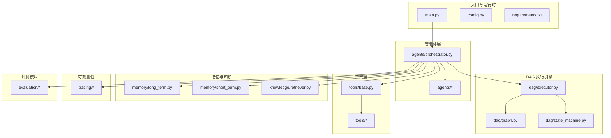
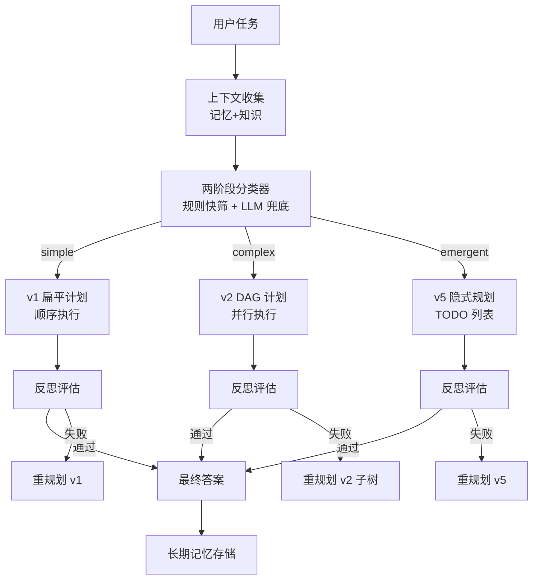
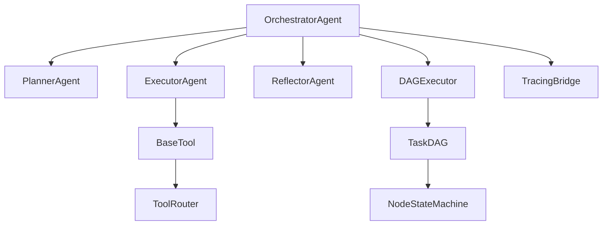
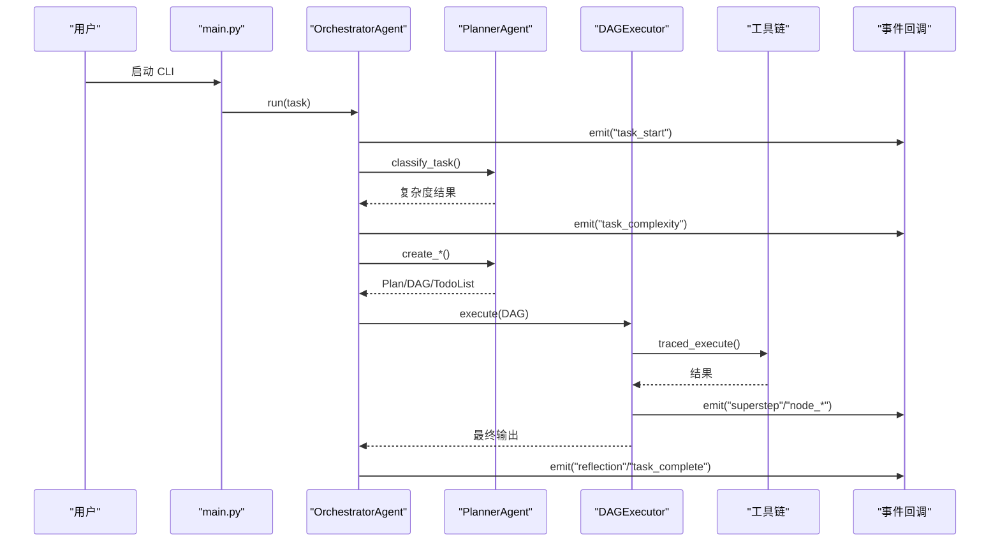

# 团队协作

<cite>
**本文引用的文件**
- [README.md](file://README.md)
- [README_CN.md](file://README_CN.md)
- [requirements.txt](file://requirements.txt)
- [config.py](file://config.py)
- [main.py](file://main.py)
- [agents/orchestrator.py](file://agents/orchestrator.py)
- [dag/graph.py](file://dag/graph.py)
- [tools/base.py](file://tools/base.py)
- [schema.py](file://schema.py)
- [tests/test_dag_capabilities.py](file://tests/test_dag_capabilities.py)
- [sxw_aicoding/docs/codemap.md](file://sxw_aicoding/docs/codemap.md)
- [sxw_aicoding/docs/tracing-design.md](file://sxw_aicoding/docs/tracing-design.md)
</cite>

## 目录
1. [引言](#引言)
2. [项目结构](#项目结构)
3. [核心组件](#核心组件)
4. [架构总览](#架构总览)
5. [详细组件分析](#详细组件分析)
6. [依赖分析](#依赖分析)
7. [性能考量](#性能考量)
8. [故障排查指南](#故障排查指南)
9. [结论](#结论)
10. [附录](#附录)

## 引言
本指南面向 manus_demo 项目团队，旨在建立一套系统化、可落地的团队协作最佳实践。围绕代码审查、沟通协作、项目治理、知识传承、工具使用、质量保证与远程协作等方面，结合项目现有架构与实践，形成可执行的流程与规范，帮助团队高效协同、稳定交付。

## 项目结构
manus_demo 是一个基于 DAG 的多智能体系统演示项目，强调“教学友好”的极简实现与“可观察性”增强。项目采用分层模块化组织，核心包括：
- 入口与运行时：CLI 入口、配置加载、事件驱动 UI
- 智能体层：编排者、规划者、执行器、反思者、隐式规划器、目标驱动规划器
- DAG 执行引擎：图结构、状态机、执行器
- 工具层：网络搜索、代码执行、文件操作、Shell 命令、工具路由
- 记忆与知识：短期/长期记忆、TF-IDF 检索
- 可观测性：全链路追踪（OpenTelemetry）、Web 可视化查看器
- 评测模块：指标模型、基准任务、评估运行器、报告生成
- 测试：单元测试覆盖 DAG 能力、条件分支/回滚、动态变更、工具路由、自适应规划集成

图表来源
- [main.py](file://main.py)
- [config.py](file://config.py)
- [agents/orchestrator.py](file://agents/orchestrator.py)
- [dag/graph.py](file://dag/graph.py)
- [tools/base.py](file://tools/base.py)
- [sxw_aicoding/docs/codemap.md](file://sxw_aicoding/docs/codemap.md)

章节来源
- [README_CN.md](file://README_CN.md)
- [README.md](file://README.md)
- [sxw_aicoding/docs/codemap.md](file://sxw_aicoding/docs/codemap.md)

## 核心组件
- OrchestratorAgent：中央编排者，负责上下文收集、任务分类、路由到 v1/v2/v5 路径、执行与反思、重规划、长期记忆存储。
- PlannerAgent：混合规划器，提供两阶段分类器（规则快筛 + LLM 兜底）、v1 扁平计划、v2 DAG 计划、重规划与自适应规划。
- ExecutorAgent：ReAct 执行器，支持统一 ReActEngine（v6 特性开关）、工具路由（v3）。
- ReflectorAgent：反思验证器，逐节点与全局质量评估。
- TaskDAG：分层任务图，支持拓扑排序、就绪节点发现、条件分支、回滚、动态增删改节点/边、Checkpoint 快照。
- NodeStateMachine：节点状态机，强制合法状态转移。
- BaseTool：工具抽象，统一 OpenAI function schema、traced_execute 埋点。
- LLMClient：OpenAI 兼容封装，支持 LLM 重试（v6）。
- Tracing：全链路追踪（v7），支持多后端导出、Web 可视化。
- Evaluation：评测模块，指标模型、基准任务、评估运行器、报告生成。

章节来源
- [agents/orchestrator.py](file://agents/orchestrator.py)
- [dag/graph.py](file://dag/graph.py)
- [tools/base.py](file://tools/base.py)
- [schema.py](file://schema.py)
- [sxw_aicoding/docs/codemap.md](file://sxw_aicoding/docs/codemap.md)
- [sxw_aicoding/docs/tracing-design.md](file://sxw_aicoding/docs/tracing-design.md)

## 架构总览
manus_demo 采用“混合路由 + 分层规划 + DAG 并行执行 + 反思验证 + 动态自适应”的流水线架构。核心流程：
- 任务输入 → 上下文收集（记忆 + 知识）→ 两阶段分类（规则快筛 + LLM 兜底）→ 路由到 v1/v2/v5 路径
- v1：扁平计划顺序执行 + 反思
- v2：分层 DAG 并行执行 + 节点状态机 + 条件分支/回滚 + 局部重规划
- v5：隐式规划（TODO 列表）+ while(tool_use) 主循环
- v8：目标驱动规划（GoalDocument + 逆向里程碑 + 目标反思 + 周期性重锚定）
- 执行完成后进行反思评估，必要时重规划；最终答案写入长期记忆。

图表来源
- [agents/orchestrator.py](file://agents/orchestrator.py)
- [dag/graph.py](file://dag/graph.py)
- [README_CN.md](file://README_CN.md)

## 详细组件分析

### 代码审查标准流程
- 审查清单
  - 架构一致性：是否符合混合路由、分层规划、DAG 并行、状态机、反思验证的设计原则
  - 数据结构与边界：TaskDAG、NodeStateMachine、Schema 的使用是否正确
  - 工具与路由：BaseTool 接口实现、traced_execute 埋点、ToolRouter 使用
  - 可观测性：Tracing 集成、事件桥接、属性命名规范
  - 性能与健壮性：超步间自适应规划、节点超时、Checkpoint 限制、LLM 重试
  - 测试覆盖：是否补充/更新单元测试，覆盖新增能力
- 反馈机制
  - 评审意见需明确指出问题定位（文件+行号）、影响范围、修复建议
  - 对于架构性问题，要求提供替代方案与权衡说明
- 决策流程
  - 小改动：代码作者自审通过后合并
  - 中等改动：至少一名 reviewer 通过
  - 大改动：提交设计文档（含影响面、测试策略、回滚预案），Team leader 审批

章节来源
- [agents/orchestrator.py](file://agents/orchestrator.py)
- [dag/graph.py](file://dag/graph.py)
- [tools/base.py](file://tools/base.py)
- [schema.py](file://schema.py)
- [sxw_aicoding/docs/tracing-design.md](file://sxw_aicoding/docs/tracing-design.md)

### 沟通协作规范
- 会议制度
  - 每日站会：同步昨日进展、今日计划、阻塞事项（建议 15 分钟）
  - 双周回顾：回顾里程碑、技术债、流程改进
  - 专题评审：重大设计变更、跨模块集成、性能优化
- 文档共享
  - 代码地图、设计文档、变更日志集中存放于 sxw_aicoding/docs，按版本维护
  - README/README_CN 保持最新，关键配置与运行说明同步更新
- 问题跟踪
  - 使用 Issue 追踪需求、缺陷、技术债
  - 每个 Issue 明确类型、优先级、负责人、截止日期、验收标准

章节来源
- [README_CN.md](file://README_CN.md)
- [sxw_aicoding/docs/codemap.md](file://sxw_aicoding/docs/codemap.md)

### 项目治理结构
- 角色分工
  - 项目经理/技术负责人：总体架构把控、重大决策、资源协调
  - 模块负责人：各子系统（智能体、DAG、工具、Tracing、评测）负责人
  - 开发工程师：功能开发、测试、文档
  - QA 工程师：测试策略、回归测试、质量门禁
- 决策权限
  - 日常技术决策：模块负责人
  - 架构变更：技术负责人审批
  - 发布与回滚：技术负责人/项目经理
- 冲突解决机制
  - 优先协商一致；无法达成共识时提请技术负责人仲裁

（本节为概念性治理框架，不直接分析具体文件）

### 知识传承方案
- 文档标准
  - 代码地图：模块职责、数据流、关键设计模式
  - 设计文档：Tracing、评测、目标驱动规划等专题设计
  - 变更日志：版本演进、破坏性变更说明
- 培训体系
  - 新人入职：README/README_CN + 代码地图 + 快速运行指南
  - 技术分享：月度分享会，围绕 DAG 并行、状态机、反思验证、Tracing
- 导师制度
  - 每位新人配备一位导师，负责代码审查、技术答疑、成长规划

章节来源
- [README_CN.md](file://README_CN.md)
- [sxw_aicoding/docs/codemap.md](file://sxw_aicoding/docs/codemap.md)
- [sxw_aicoding/docs/tracing-design.md](file://sxw_aicoding/docs/tracing-design.md)

### 工具使用规范
- 版本控制
  - 分支策略：main 作为保护分支；feature/<issue> 开发；hotfix/<issue> 修复
  - 提交规范：type(scope): subject（如 feat(dag): add dynamic mutation API）
- 分支策略
  - develop：集成测试与预发布
  - release/x.y：发布分支，仅允许紧急修复
- 发布流程
  - 通过 CI/CD（如 pytest + 代码覆盖率）；生成发布说明；打 tag；更新 CHANGELOG

章节来源
- [requirements.txt](file://requirements.txt)
- [config.py](file://config.py)

### 质量保证体系
- 测试策略
  - 单元测试：覆盖 DAG 能力、条件分支/回滚、动态变更、工具路由、自适应规划集成
  - 评测模块：指标模型、基准任务、评估运行器、报告生成
- 代码质量标准
  - 静态检查：类型注解、命名规范、复杂度控制
  - 规范检查：Ruff/Pylance、Black、isort
  - 覆盖率：关键路径测试覆盖 ≥ 80%
- 验收流程
  - 代码审查 + 测试通过 + 评测报告通过 → 合并到 develop/release

章节来源
- [tests/test_dag_capabilities.py](file://tests/test_dag_capabilities.py)
- [README_CN.md](file://README_CN.md)

### 远程协作指导
- 工具选择
  - 协作平台：Issue/PR + 文档共享
  - 通讯工具：视频会议 + 实时聊天
  - 可视化：Tracing Web Viewer、Rich 控制台输出
- 时间协调
  - 建立时区可见的排班表；跨时区会议尽量平衡
- 文化融合
  - 尊重多样性；鼓励提问与分享；透明沟通

章节来源
- [sxw_aicoding/docs/tracing-design.md](file://sxw_aicoding/docs/tracing-design.md)
- [main.py](file://main.py)

## 依赖分析
- 外部依赖
  - OpenAI 兼容接口：llm.client
  - OpenTelemetry：tracing 模块
  - 测试框架：pytest、pytest-asyncio
- 内部耦合
  - Orchestrator 与 Planner/Executor/Reflector 的协作通过事件回调与数据模型解耦
  - DAGExecutor 与 TaskDAG、NodeStateMachine 强耦合，确保状态机合法性
  - ToolRouter 与工具层弱耦合，通过接口抽象实现失败切换

图表来源
- [agents/orchestrator.py](file://agents/orchestrator.py)
- [dag/graph.py](file://dag/graph.py)
- [tools/base.py](file://tools/base.py)

章节来源
- [requirements.txt](file://requirements.txt)
- [agents/orchestrator.py](file://agents/orchestrator.py)
- [dag/graph.py](file://dag/graph.py)
- [tools/base.py](file://tools/base.py)

## 性能考量
- 并行执行
  - Super-step 并行执行，受 MAX_PARALLEL_NODES 限制，避免资源争用
- 超时与重试
  - 节点执行超时、工具执行超时、LLM 重试（指数退避）降低失败率
- 快照与内存
  - Checkpoint 限制数量，避免长时间运行内存泄漏
- 可观测性开销
  - Feature Flag 控制，零侵入集成，生产环境采样降低开销

章节来源
- [config.py](file://config.py)
- [dag/graph.py](file://dag/graph.py)
- [sxw_aicoding/docs/tracing-design.md](file://sxw_aicoding/docs/tracing-design.md)

## 故障排查指南
- 常见问题
  - ModuleNotFoundError：确认虚拟环境与依赖安装
  - API Key 配置：通过配置模块加载，可通过环境变量覆盖
  - 记忆与知识：长期记忆与沙箱目录位置可通过配置修改
- 调试手段
  - 事件驱动 UI：on_event 输出详细阶段与结果
  - Tracing：开启后可查看 Span 树、属性、导出到文件或 OTLP
  - 测试：离线运行单元测试，验证 DAG 能力与工具链路

章节来源
- [README_CN.md](file://README_CN.md)
- [main.py](file://main.py)
- [sxw_aicoding/docs/tracing-design.md](file://sxw_aicoding/docs/tracing-design.md)

## 结论
通过建立完善的代码审查、沟通协作、项目治理、知识传承、工具使用与质量保证体系，manus_demo 项目可在保持教学友好与架构清晰的同时，提升团队协作效率与交付质量。建议团队以本指南为基础，结合项目演进持续优化流程与工具。

## 附录
- 关键流程图（事件驱动 UI）

图表来源
- [main.py](file://main.py)
- [agents/orchestrator.py](file://agents/orchestrator.py)
- [dag/graph.py](file://dag/graph.py)
- [tools/base.py](file://tools/base.py)