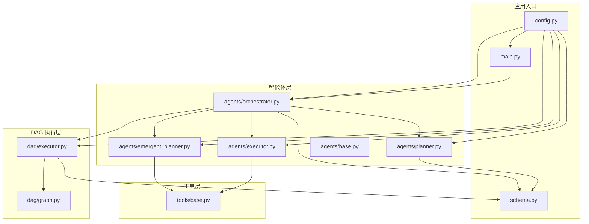
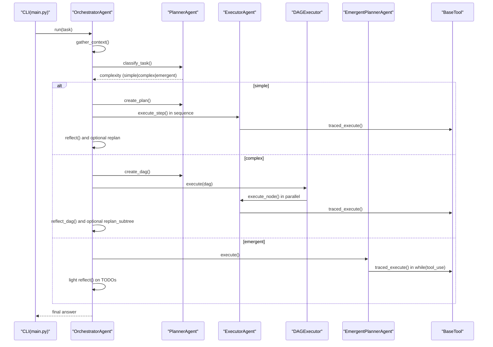
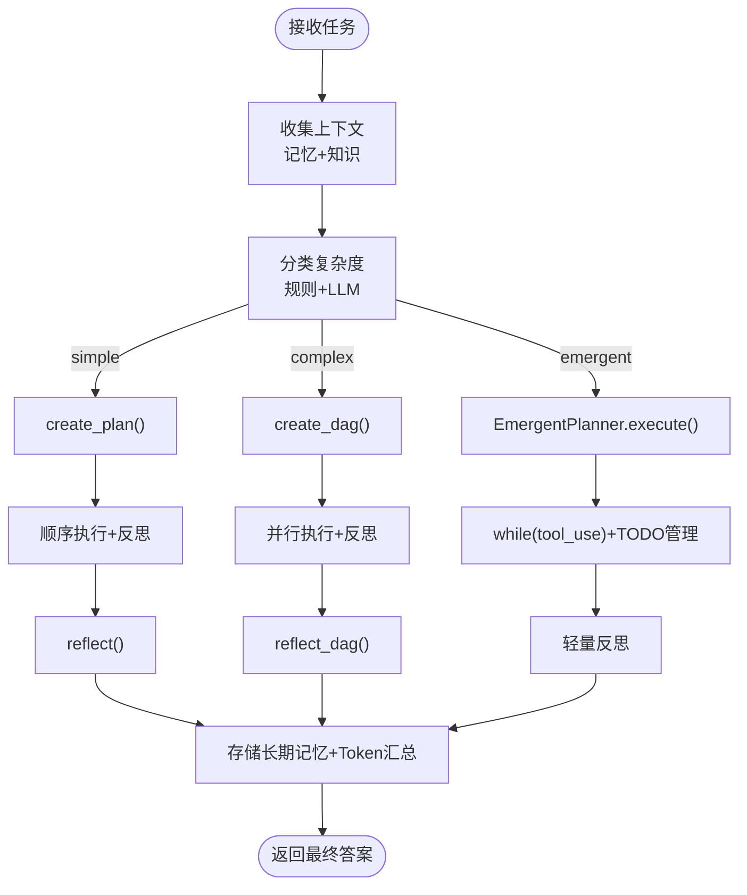
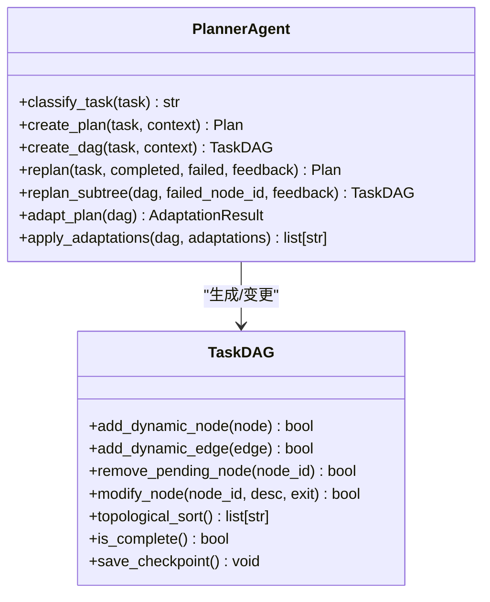
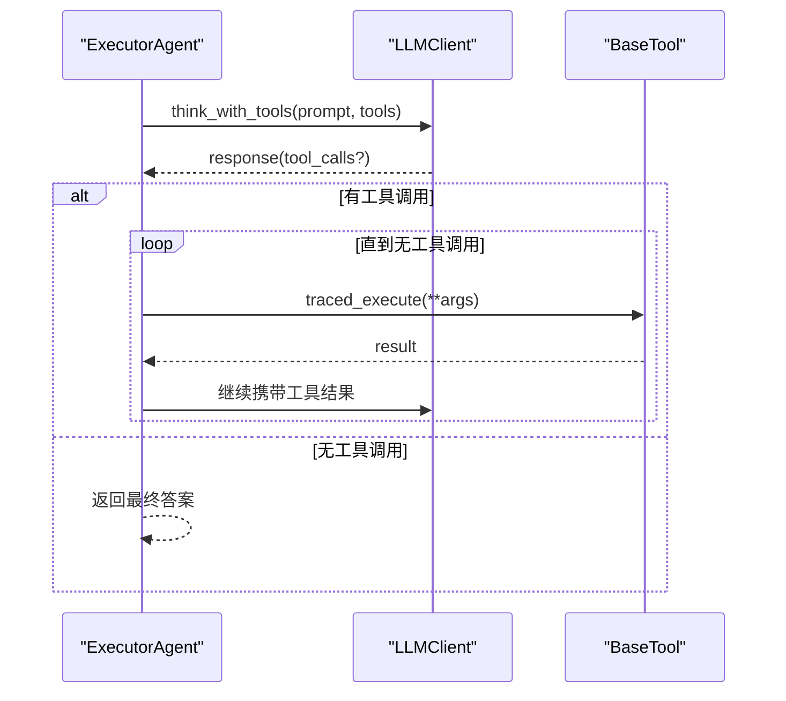
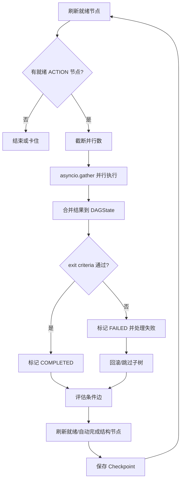
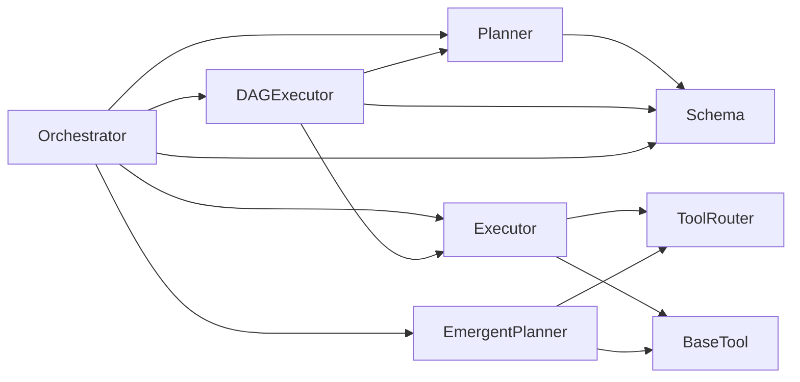

# 开发实践

<cite>
**本文引用的文件**
- [README.md](file://README.md)
- [main.py](file://main.py)
- [config.py](file://config.py)
- [schema.py](file://schema.py)
- [requirements.txt](file://requirements.txt)
- [agents/base.py](file://agents/base.py)
- [agents/orchestrator.py](file://agents/orchestrator.py)
- [agents/planner.py](file://agents/planner.py)
- [agents/emergent_planner.py](file://agents/emergent_planner.py)
- [agents/executor.py](file://agents/executor.py)
- [dag/executor.py](file://dag/executor.py)
- [dag/graph.py](file://dag/graph.py)
- [tools/base.py](file://tools/base.py)
- [tests/test_dag_capabilities.py](file://tests/test_dag_capabilities.py)
- [tests/test_emergent_planning.py](file://tests/test_emergent_planning.py)
</cite>

## 目录
1. [简介](#简介)
2. [项目结构](#项目结构)
3. [核心组件](#核心组件)
4. [架构总览](#架构总览)
5. [详细组件分析](#详细组件分析)
6. [依赖分析](#依赖分析)
7. [性能考量](#性能考量)
8. [故障排查指南](#故障排查指南)
9. [结论](#结论)
10. [附录](#附录)

## 简介
本指南面向 manus_demo 项目的开发者，系统阐述代码组织规范、错误处理模式、性能优化建议、代码复用与模块化设计、单元测试规范以及代码审查清单。项目采用多智能体与 DAG 并行执行架构，支持混合规划路由、条件分支与回滚、自适应规划、隐式规划（v5）等能力，强调可维护性、可观测性与可扩展性。

## 项目结构
项目采用按功能域分层的模块化组织方式，核心目录与职责如下：
- agents：多智能体（Orchestrator、Planner、Executor、Reflector、EmergentPlanner 等）
- dag：DAG 执行引擎（TaskDAG、DAGExecutor、NodeStateMachine）
- tools：工具抽象与实现（BaseTool、WebSearch、CodeExecutor、FileOps、ShellTool、ToolRouter）
- memory/context/knowledge/llm：记忆、上下文、知识检索、LLM 客户端
- tracing/tracing：全链路追踪（可选）
- tests：单元测试（DAG 能力、隐式规划、工具路由、自适应规划等）
- 配置与入口：config.py、main.py、schema.py、requirements.txt

图表来源
- [main.py:1-516](file://main.py#L1-L516)
- [config.py:1-109](file://config.py#L1-L109)
- [schema.py:1-702](file://schema.py#L1-L702)
- [agents/orchestrator.py:1-600](file://agents/orchestrator.py#L1-L600)
- [agents/planner.py:1-934](file://agents/planner.py#L1-L934)
- [agents/executor.py:1-323](file://agents/executor.py#L1-L323)
- [agents/emergent_planner.py:1-685](file://agents/emergent_planner.py#L1-L685)
- [agents/base.py:1-183](file://agents/base.py#L1-L183)
- [dag/executor.py:1-648](file://dag/executor.py#L1-L648)
- [dag/graph.py:1-627](file://dag/graph.py#L1-L627)
- [tools/base.py:1-175](file://tools/base.py#L1-L175)

章节来源
- [README.md:97-154](file://README.md#L97-L154)
- [main.py:1-516](file://main.py#L1-L516)
- [config.py:1-109](file://config.py#L1-L109)
- [schema.py:1-702](file://schema.py#L1-L702)

## 核心组件
- OrchestratorAgent：多智能体流水线的中央协调者，负责上下文收集、任务复杂度分类、路由到 v1/v2/v5 路径、反思与重规划、结果存储。
- PlannerAgent：混合规划器，两阶段分类器（规则快筛 + LLM 兜底）自动选择简单/复杂/隐式规划路径；支持自适应规划与 DAG 动态变更。
- ExecutorAgent：ReAct 执行器，封装 LLM 与工具调用循环，支持统一 ReActEngine（v6.0）。
- EmergentPlannerAgent：隐式规划器（v5），基于 TODO 列表的 while(tool_use) 主循环，支持停滞检测、失败重试与 TODO 列表动态更新。
- DAGExecutor：Super-step 并行执行引擎，基于 NodeStateMachine 的状态机与条件边评估，支持回滚、子树跳过、自适应规划集成与 Checkpoint。
- TaskDAG：有向无环图，集中式状态 DAGState，支持动态节点/边增删改、拓扑排序、就绪节点发现、子树跳过与快照。
- BaseTool：工具抽象，统一 OpenAI function-calling schema，支持 trace 包装与敏感参数脱敏。
- 配置与数据模型：config.py 提供环境变量配置；schema.py 定义数据模型（Plan/DAGState/TodoList 等）。

章节来源
- [agents/orchestrator.py:60-600](file://agents/orchestrator.py#L60-L600)
- [agents/planner.py:147-934](file://agents/planner.py#L147-L934)
- [agents/executor.py:66-323](file://agents/executor.py#L66-L323)
- [agents/emergent_planner.py:72-685](file://agents/emergent_planner.py#L72-L685)
- [dag/executor.py:62-648](file://dag/executor.py#L62-L648)
- [dag/graph.py:43-627](file://dag/graph.py#L43-L627)
- [tools/base.py:22-175](file://tools/base.py#L22-L175)
- [config.py:1-109](file://config.py#L1-L109)
- [schema.py:1-702](file://schema.py#L1-L702)

## 架构总览
系统采用“规划-执行-反思”闭环，结合事件驱动 UI 与可选全链路追踪，支持多路径路由与动态演进。

图表来源
- [main.py:395-516](file://main.py#L395-L516)
- [agents/orchestrator.py:158-222](file://agents/orchestrator.py#L158-L222)
- [agents/planner.py:213-362](file://agents/planner.py#L213-L362)
- [agents/executor.py:131-188](file://agents/executor.py#L131-L188)
- [dag/executor.py:110-264](file://dag/executor.py#L110-L264)
- [agents/emergent_planner.py:134-276](file://agents/emergent_planner.py#L134-L276)
- [tools/base.py:60-124](file://tools/base.py#L60-L124)

## 详细组件分析

### OrchestratorAgent（协调器）
- 职责：上下文收集、复杂度分类、路由到 v1/v2/v5、执行与反思、结果存储与 Token 汇总。
- 事件驱动 UI：通过 on_event 将阶段、DAG 树、节点状态、条件评估、自适应规划、反思、Token 消耗等事件推送到控制台。
- 多播桥接：可选 TracingBridge 与事件多播，保证 UI 与追踪互不干扰。
- 重规划：v1 逐步骤重规划；v2 局部重规划失败子树；v5 轻量反思（阻塞 TODO）。

图表来源
- [agents/orchestrator.py:158-222](file://agents/orchestrator.py#L158-L222)
- [agents/orchestrator.py:257-352](file://agents/orchestrator.py#L257-L352)
- [agents/orchestrator.py:439-508](file://agents/orchestrator.py#L439-L508)
- [agents/emergent_planner.py:134-276](file://agents/emergent_planner.py#L134-L276)

章节来源
- [agents/orchestrator.py:60-600](file://agents/orchestrator.py#L60-L600)
- [main.py:184-390](file://main.py#L184-L390)

### PlannerAgent（规划器）
- 两阶段分类：规则快筛（关键词模式）+ LLM 兜底，支持强制覆盖（PLAN_MODE）与 v5 禁用降级。
- v1：扁平计划（2-6 步），支持重规划。
- v2：分层 DAG（Goal/SubGoal/Action），支持条件边、回滚边、风险评估、完成判据。
- v3：自适应规划（超步间评估），支持 ADD/MODIFY/REMOVE 待执行节点。
- v5：隐式规划路由（可选）。

图表来源
- [agents/planner.py:147-934](file://agents/planner.py#L147-L934)
- [dag/graph.py:341-514](file://dag/graph.py#L341-L514)

章节来源
- [agents/planner.py:213-362](file://agents/planner.py#L213-L362)
- [agents/planner.py:513-722](file://agents/planner.py#L513-L722)

### ExecutorAgent（执行器）
- ReAct 循环：think/think_json/think_with_tools + 工具调用 + 观察（tool result）。
- 统一 ReActEngine（v6.0）可选集成，降低重复实现。
- ToolRouter（v3）：失败计数、阈值触发、替代建议、节点隔离。

图表来源
- [agents/executor.py:195-321](file://agents/executor.py#L195-L321)
- [tools/base.py:60-124](file://tools/base.py#L60-L124)

章节来源
- [agents/executor.py:66-323](file://agents/executor.py#L66-L323)
- [tools/base.py:22-175](file://tools/base.py#L22-L175)

### EmergentPlannerAgent（隐式规划 v5）
- TODO 列表驱动：初始化、就绪选择、执行、更新、停滞检测、失败重试与阻塞。
- 可选 ReActEngine（v6.0）统一执行。
- 与 Orchestrator 的事件回调对接，支持 UI 实时展示。

章节来源
- [agents/emergent_planner.py:72-685](file://agents/emergent_planner.py#L72-L685)

### DAGExecutor 与 TaskDAG
- Super-step 并行：就绪节点批量执行，超时保护，结果合并到 DAGState。
- 状态机与条件边：NodeStateMachine 强制状态转移；条件边按结果关键字评估；失败触发回滚与子树跳过。
- 自适应规划：超步间评估并应用 ADD/MODIFY/REMOVE。
- Checkpoint：每轮保存状态快照，支持调试与恢复。

图表来源
- [dag/executor.py:110-264](file://dag/executor.py#L110-L264)
- [dag/executor.py:350-448](file://dag/executor.py#L350-L448)
- [dag/graph.py:101-213](file://dag/graph.py#L101-L213)

章节来源
- [dag/executor.py:62-648](file://dag/executor.py#L62-L648)
- [dag/graph.py:43-627](file://dag/graph.py#L43-L627)

### BaseTool 与工具路由
- 统一 OpenAI function-calling schema，支持 traced_execute（可选追踪）。
- 参数脱敏（敏感字段红名单），避免隐私泄露。
- ToolRouter：节点级失败统计、阈值触发替代建议、上下文提示生成。

章节来源
- [tools/base.py:22-175](file://tools/base.py#L22-L175)
- [agents/executor.py:195-321](file://agents/executor.py#L195-L321)

## 依赖分析
- 运行时依赖：openai、pydantic、rich、python-dotenv、opentelemetry-*（可选）、pytest/pytest-asyncio（可选）。
- 模块耦合：
  - Orchestrator 依赖 Planner/Executor/EmergentPlanner/DAGExecutor/Reflector 与工具集合。
  - DAGExecutor 依赖 ExecutorAgent、ReflectorAgent、PlannerAgent（v3 自适应）与 NodeStateMachine。
  - Planner 依赖 LLMClient、ContextManager、Schema 模型。
  - ToolRouter 与 Tool 路由在 Executor/EmergentPlanner 中使用。

图表来源
- [requirements.txt:1-19](file://requirements.txt#L1-L19)
- [agents/orchestrator.py:94-141](file://agents/orchestrator.py#L94-L141)
- [dag/executor.py:87-104](file://dag/executor.py#L87-L104)
- [agents/executor.py:92-125](file://agents/executor.py#L92-L125)
- [agents/emergent_planner.py:90-128](file://agents/emergent_planner.py#L90-L128)

章节来源
- [requirements.txt:1-19](file://requirements.txt#L1-L19)

## 性能考量
- 异步与并行
  - DAGExecutor 使用 asyncio.gather 并行执行就绪节点，受 MAX_PARALLEL_NODES 限制，避免资源争用。
  - 节点级超时 NODE_EXECUTION_TIMEOUT，防止卡死影响批次。
- 内存与状态
  - DAGState 采用集中式共享状态，节点结果写入 node_results，避免竞态。
  - Checkpoint 限制 MAX_CHECKPOINTS，防止内存膨胀。
- LLM 与工具
  - 统一 LLMClient 与可选 ReActEngine，减少重复实现与上下文切换。
  - BaseTool traced_execute 在 TRACING_ENABLED=true 时包装 span，注意参数脱敏与长度限制。
- 上下文压缩
  - BaseAgent 与 ContextManager 在消息过长时压缩，降低 Token 消耗。

章节来源
- [dag/executor.py:179-182](file://dag/executor.py#L179-L182)
- [dag/executor.py:296-310](file://dag/executor.py#L296-L310)
- [dag/graph.py:521-542](file://dag/graph.py#L521-L542)
- [agents/base.py:87-121](file://agents/base.py#L87-L121)
- [tools/base.py:60-124](file://tools/base.py#L60-L124)

## 故障排查指南
- 日志与 UI
  - main.py 使用 RichHandler 输出结构化日志，支持 -v/--verbose 开启调试级别。
  - Orchestrator 的事件回调将阶段、DAG 树、节点状态、条件评估、反思、Token 消耗等可视化。
- 常见问题定位
  - DAG 卡住：检查 has_failed_nodes/is_complete、条件边未满足、依赖未完成。
  - 节点失败：查看 FAILED->回滚/跳过子树流程；确认回滚节点是否成功。
  - 超步间自适应：确认 ADAPT_PLAN_INTERVAL/ADAPT_PLAN_MIN_COMPLETED 配置。
  - 隐式规划停滞：检查停滞检测与最大迭代限制。
- 配置核对
  - LLM API Key/URL/Model、MAX_REACT_ITERATIONS、MAX_PARALLEL_NODES、NODE_EXECUTION_TIMEOUT、SANDBOX_DIR、MEMORY_DIR、TRACING_* 等。

章节来源
- [main.py:396-413](file://main.py#L396-L413)
- [main.py:184-390](file://main.py#L184-L390)
- [dag/executor.py:131-141](file://dag/executor.py#L131-L141)
- [dag/executor.py:350-399](file://dag/executor.py#L350-L399)
- [agents/emergent_planner.py:177-190](file://agents/emergent_planner.py#L177-L190)

## 结论
manus_demo 通过清晰的模块划分、事件驱动 UI、集中式状态与状态机、并行执行与条件分支、自适应规划与动态 DAG 变更，构建了可扩展、可观测、可维护的多智能体系统。建议在开发中坚持事件驱动、配置优先、最小实现原则，并配合完善的单元测试与代码审查。

## 附录

### 代码组织规范
- 模块划分
  - agents：智能体职责单一，通过组合与事件回调协作。
  - dag：执行引擎与图结构分离，状态与拓扑算法清晰。
  - tools：工具抽象统一，trace 包装与参数脱敏。
  - tests：按能力分组（DAG 能力、隐式规划、工具路由、自适应规划）。
- 命名约定
  - 类名：驼峰（如 OrchestratorAgent、TaskDAG、BaseTool）。
  - 方法/属性：下划线（如 execute_node、get_ready_nodes、to_openai_tool）。
  - 常量：全大写（如 MAX_PARALLEL_NODES、NODE_EXECUTION_TIMEOUT）。
- 文件结构
  - 每个功能域独立目录，核心入口 main.py 与配置 config.py 位于根目录。

章节来源
- [README.md:97-154](file://README.md#L97-L154)
- [agents/base.py:29-54](file://agents/base.py#L29-L54)
- [dag/graph.py:43-81](file://dag/graph.py#L43-L81)
- [tools/base.py:22-58](file://tools/base.py#L22-L58)

### 错误处理模式
- 异常捕获策略
  - DAGExecutor：并行 gather return_exceptions=True，单节点异常转为 FAILED 并触发失败处理。
  - 节点执行：wait_for 超时包装，未知异常统一记录并返回失败结果。
  - 工具执行：trace 包装记录异常与状态码，导入失败回退到直连执行。
- 错误传播机制
  - 事件驱动：失败事件（node_failed、execution_error）通过 on_event 通知 UI。
  - 状态机：FAILED 节点经回滚/跳过子树处理，最终进入 ROLLED_BACK/SKIPPED。
- 用户友好错误信息
  - UI 层对失败节点输出错误摘要与原因（execution/exit_criteria）。
  - Token 消耗汇总表格化展示，便于定位高消耗阶段。

章节来源
- [dag/executor.py:179-200](file://dag/executor.py#L179-L200)
- [dag/executor.py:296-310](file://dag/executor.py#L296-L310)
- [tools/base.py:113-123](file://tools/base.py#L113-L123)
- [main.py:307-314](file://main.py#L307-L314)
- [main.py:377-380](file://main.py#L377-L380)

### 性能优化建议
- 异步编程最佳实践
  - 使用 asyncio.gather 并行执行，合理设置 MAX_PARALLEL_NODES。
  - 对单节点执行设置超时，避免阻塞批次。
- 内存管理
  - 限制 Checkpoint 数量（MAX_CHECKPOINTS），及时清理历史快照。
  - DAGState 仅存储必要结果，避免冗余。
- 并发控制策略
  - 工具并发限制（SHELL_MAX_CONCURRENT、CODE_MAX_CONCURRENT）与超时（SHELL_EXEC_TIMEOUT、CODE_EXEC_TIMEOUT）。
  - 通过 ToolRouter 降低失败工具的连续调用频率。
- LLM 与工具
  - 使用统一 LLMClient 与可选 ReActEngine，减少上下文切换。
  - 启用 TRACING_ENABLED 时注意参数长度与脱敏，避免性能与安全问题。

章节来源
- [dag/executor.py:179-182](file://dag/executor.py#L179-L182)
- [dag/graph.py:521-542](file://dag/graph.py#L521-L542)
- [config.py:71-77](file://config.py#L71-L77)
- [config.py:82-86](file://config.py#L82-L86)
- [tools/base.py:125-146](file://tools/base.py#L125-L146)

### 代码复用与模块化设计
- 接口设计
  - BaseTool 统一工具接口与 OpenAI function schema，便于扩展新工具。
  - BaseAgent 抽象消息历史、上下文压缩与 LLM 交互。
- 依赖注入
  - Orchestrator 构造函数注入 LLMClient、工具列表、事件回调与可选 TracingBridge。
  - DAGExecutor 注入 ExecutorAgent、ReflectorAgent、PlannerAgent（可选）。
- 配置管理
  - config.py 从 .env/环境变量加载，支持特性开关（如 ENABLE_REACT_ENGINE_V2、TRACING_ENABLED）。

章节来源
- [tools/base.py:22-175](file://tools/base.py#L22-L175)
- [agents/base.py:29-54](file://agents/base.py#L29-L54)
- [agents/orchestrator.py:94-141](file://agents/orchestrator.py#L94-L141)
- [dag/executor.py:87-104](file://dag/executor.py#L87-L104)
- [config.py:1-109](file://config.py#L1-L109)

### 单元测试编写规范
- 测试用例设计
  - DAG 能力：分层规划、并行执行、条件分支与回滚、动态变更、工具路由、自适应规划集成。
  - 隐式规划：TodoItem/TodoList 生命周期、EmergentPlanner 核心循环、停滞检测与失败处理。
- Mock 使用
  - 使用 AsyncMock/MagicMock 模拟 LLM 与工具调用，确保测试不依赖真实 API。
  - 通过事件收集验证 UI 事件流（superstep、node_*、condition_evaluated、plan_adaptation 等）。
- 覆盖率要求
  - 建议关键路径（DAG 执行、条件边、回滚、自适应规划、工具路由、隐式规划）全覆盖。
- 运行方式
  - pytest -m pytest tests/test_dag_capabilities.py -v
  - pytest -m pytest tests/test_emergent_planning.py -v

章节来源
- [tests/test_dag_capabilities.py:1-800](file://tests/test_dag_capabilities.py#L1-L800)
- [tests/test_emergent_planning.py:1-432](file://tests/test_emergent_planning.py#L1-L432)

### 代码审查检查清单
- 安全性
  - 工具参数脱敏（SENSITIVE_KEYS），避免敏感信息泄露。
  - LLM 输出与工具结果长度限制，防止异常输入。
- 可维护性
  - 事件驱动 UI 与状态机解耦，避免 UI 逻辑侵入核心流程。
  - 配置集中管理，特性开关明确，避免硬编码。
- 性能
  - 并行度与超时配置合理，避免资源争用与死锁。
  - DAGState 与 Checkpoint 管理，避免内存泄漏。
- 可观测性
  - 事件覆盖全面（superstep、node_*、condition_evaluated、plan_adaptation、reflection、token_usage_summary）。
  - 可选全链路追踪（OTLP/Console/Rich/File/Phoenix），注意隐私与性能。

章节来源
- [tools/base.py:125-146](file://tools/base.py#L125-L146)
- [main.py:184-390](file://main.py#L184-L390)
- [dag/graph.py:521-542](file://dag/graph.py#L521-L542)
- [config.py:102-109](file://config.py#L102-L109)