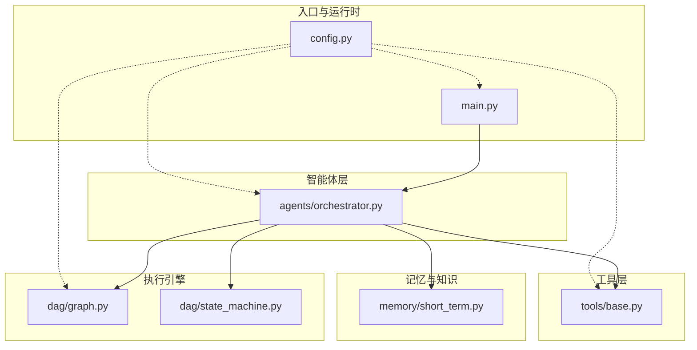
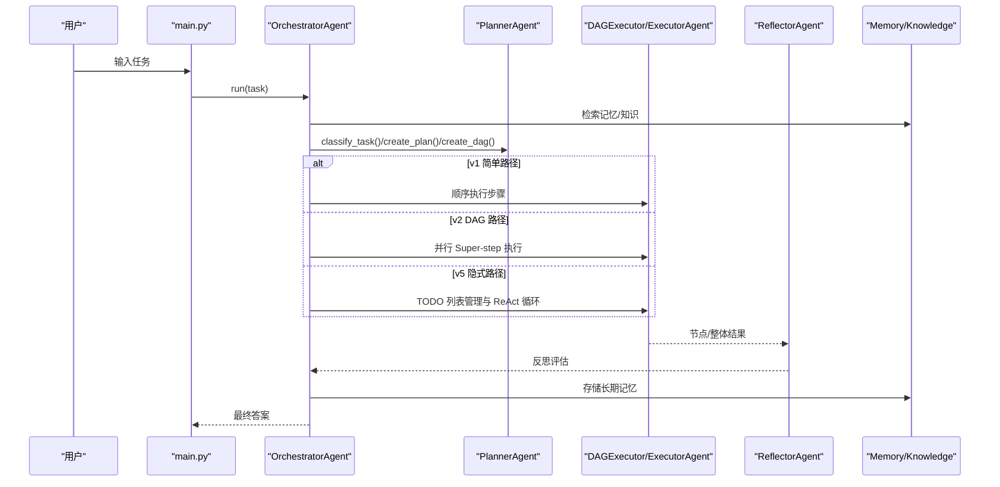
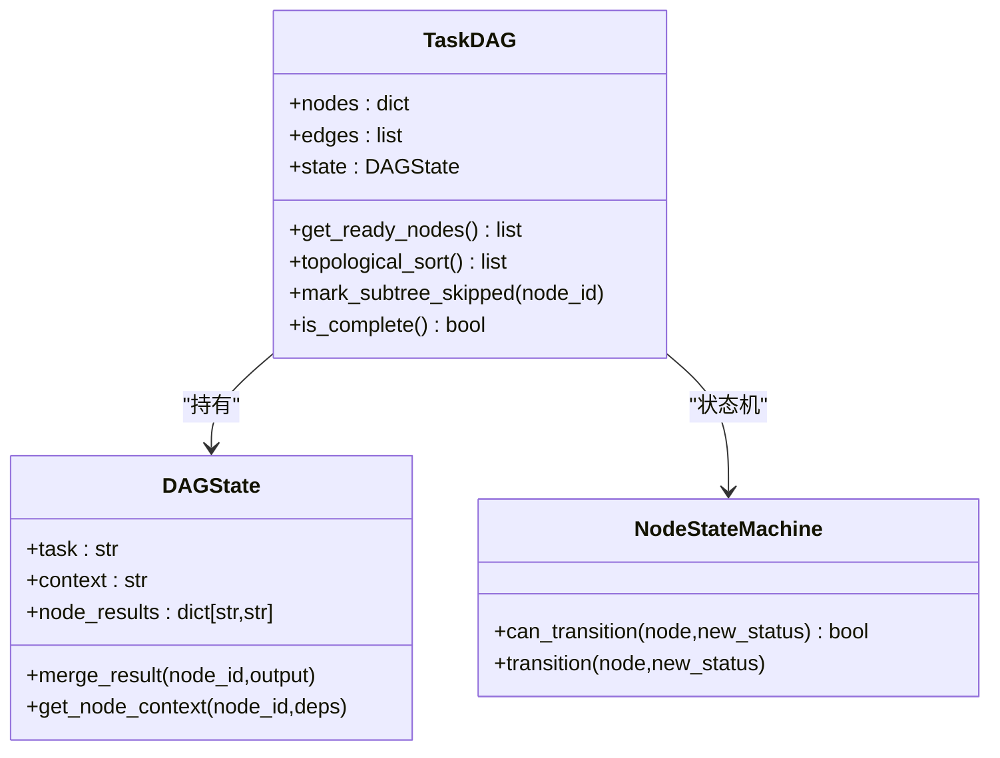
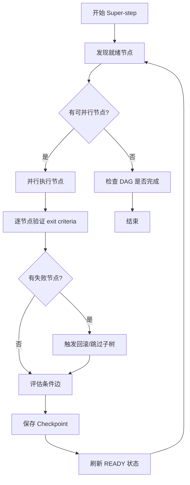
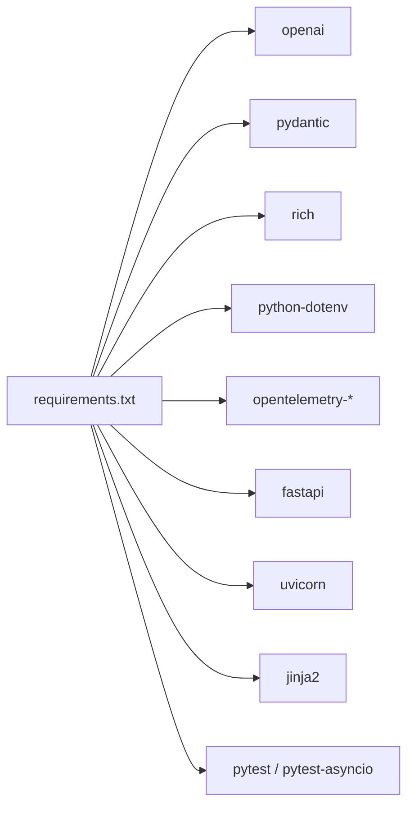

# 最佳实践

<cite>
**本文引用的文件**
- [README_CN.md](file://README_CN.md)
- [README.md](file://README.md)
- [main.py](file://main.py)
- [config.py](file://config.py)
- [schema.py](file://schema.py)
- [agents/orchestrator.py](file://agents/orchestrator.py)
- [dag/graph.py](file://dag/graph.py)
- [dag/state_machine.py](file://dag/state_machine.py)
- [tools/base.py](file://tools/base.py)
- [memory/short_term.py](file://memory/short_term.py)
- [tests/test_dag_capabilities.py](file://tests/test_dag_capabilities.py)
- [tracing/provider.py](file://tracing/provider.py)
- [requirements.txt](file://requirements.txt)
</cite>

## 目录
1. [简介](#简介)
2. [项目结构](#项目结构)
3. [核心组件](#核心组件)
4. [架构总览](#架构总览)
5. [详细组件分析](#详细组件分析)
6. [依赖分析](#依赖分析)
7. [性能考量](#性能考量)
8. [故障排查指南](#故障排查指南)
9. [结论](#结论)
10. [附录](#附录)

## 简介
本指南面向 manus_demo 项目的开发者与运维人员，提供从代码组织、错误处理、性能优化到生产部署、监控告警、故障排查、版本演进与团队协作的系统化最佳实践。项目采用“混合规划路由 + DAG 并行执行 + 自适应规划 + 隐式规划”的多智能体流水线，强调可观察性、可维护性与可扩展性。

## 项目结构
manus_demo 采用按功能域分层的模块化组织方式：
- 入口与 UI：CLI 交互、事件驱动 UI、日志与可视化
- 智能体层：编排者、规划者、执行者、反思者、隐式规划者
- 执行引擎：DAG 图结构、节点状态机、执行器
- 工具层：抽象工具接口与具体工具（网络搜索、代码执行、文件操作、Shell）
- 记忆与知识：短期记忆、长期记忆、TF-IDF 知识检索
- 配置与模式：全局配置、数据模型、事件与追踪
- 测试与文档：单元测试、测试用例、设计文档

图表来源
- [main.py:1-516](file://main.py#L1-L516)
- [config.py:1-109](file://config.py#L1-L109)
- [agents/orchestrator.py:1-600](file://agents/orchestrator.py#L1-L600)
- [dag/graph.py:1-627](file://dag/graph.py#L1-L627)
- [dag/state_machine.py:1-114](file://dag/state_machine.py#L1-L114)
- [tools/base.py:1-175](file://tools/base.py#L1-L175)
- [memory/short_term.py:1-91](file://memory/short_term.py#L1-L91)

章节来源
- [README_CN.md:122-174](file://README_CN.md#L122-L174)
- [README.md:97-154](file://README.md#L97-L154)

## 核心组件
- 配置中心：集中管理 LLM、执行限制、并行度、沙箱、追踪等配置，支持 .env 与环境变量覆盖。
- 数据模型：统一的 Pydantic 模型定义（TaskNode、TaskEdge、DAGState、TodoList、GoalDocument 等），确保跨模块一致性。
- 编排者：混合路由（规则 + LLM）选择 v1/v2/v5 路径，协调规划、执行、反思与记忆。
- DAG 执行：基于拓扑序与就绪检测的并行执行，支持条件分支、回滚、动态变更与 Checkpoint。
- 工具抽象：统一的工具接口与 OpenAI function schema 转换，支持追踪埋点与参数脱敏。
- 记忆与知识：短期滑动窗口 + 长期 JSON 持久化，TF-IDF 检索本地文档。
- 可观测性：OpenTelemetry 集成，支持多后端导出与 UI 可视化。

章节来源
- [config.py:1-109](file://config.py#L1-L109)
- [schema.py:1-688](file://schema.py#L1-L688)
- [agents/orchestrator.py:60-150](file://agents/orchestrator.py#L60-L150)
- [dag/graph.py:43-81](file://dag/graph.py#L43-L81)
- [tools/base.py:22-175](file://tools/base.py#L22-L175)
- [memory/short_term.py:20-91](file://memory/short_term.py#L20-L91)

## 架构总览
manus_demo 的核心是“混合规划路由 + DAG 并行执行 + 自适应规划 + 隐式规划”的多智能体流水线。编排者根据任务复杂度选择路径，执行器负责节点状态推进与并行调度，反思者对节点/整体质量进行评估，工具层提供外部能力，记忆与知识增强上下文，配置与追踪贯穿全链路。

图表来源
- [agents/orchestrator.py:158-222](file://agents/orchestrator.py#L158-L222)
- [main.py:415-512](file://main.py#L415-L512)
- [dag/graph.py:219-270](file://dag/graph.py#L219-L270)

## 详细组件分析

### 配置与环境管理
- 配置加载顺序：.env 文件（项目根）优先级低于系统环境变量；生产环境建议通过环境变量注入。
- 关键配置项：LLM 地址/密钥/模型、上下文 Token 限额、ReAct 迭代次数、最大重规划次数、并行度、沙箱目录、工具超时、追踪开关与后端。
- 建议：将敏感信息（API Key）置于环境变量；对不同环境（dev/staging/prod）使用不同 .env 或 K8s Secret。

章节来源
- [config.py:11-109](file://config.py#L11-L109)
- [README_CN.md:334-358](file://README_CN.md#L334-L358)
- [README.md:304-329](file://README.md#L304-L329)

### 数据模型与状态一致性
- DAGState 作为“唯一真相源”，集中存放节点结果；节点状态通过 NodeStateMachine 严格校验转移，非法转移抛出异常。
- TodoList 与 Goal-Driven 模型支持 v5/v8 的动态规划与目标对齐。
- 建议：对外部输入/工具输出统一收敛为字符串，避免类型漂移；在 schema 中显式声明必填字段与默认值。

图表来源
- [schema.py:192-253](file://schema.py#L192-L253)
- [dag/state_machine.py:55-114](file://dag/state_machine.py#L55-L114)
- [dag/graph.py:43-81](file://dag/graph.py#L43-L81)

章节来源
- [schema.py:192-253](file://schema.py#L192-L253)
- [dag/state_machine.py:42-52](file://dag/state_machine.py#L42-L52)
- [dag/graph.py:101-127](file://dag/graph.py#L101-L127)

### 编排者与混合路由
- 编排者负责上下文收集、任务复杂度分类（规则 + LLM）、路径路由（v1/v2/v5）、执行与反思、记忆存储。
- v8 目标驱动规划可选开启，提供里程碑与目标文档驱动的迭代。
- 建议：将路由决策过程可观测化，事件中记录复杂度与所选路径；对失败场景提供局部重规划与回退策略。

章节来源
- [agents/orchestrator.py:60-150](file://agents/orchestrator.py#L60-L150)
- [agents/orchestrator.py:158-222](file://agents/orchestrator.py#L158-L222)
- [agents/orchestrator.py:382-432](file://agents/orchestrator.py#L382-L432)

### DAG 执行与并行调度
- 就绪节点发现：扫描当前状态，动态识别可并行执行的节点；邻接表优化拓扑与 BFS。
- 条件分支与回滚：条件边按上游结果动态启用/跳过；失败节点触发回滚边清理。
- 动态变更：运行时可增删改节点与边，配合自适应规划持续演进。
- Checkpoint：每轮 Super-step 快照，支持调试与回放。

图表来源
- [dag/graph.py:101-127](file://dag/graph.py#L101-L127)
- [dag/graph.py:184-198](file://dag/graph.py#L184-L198)
- [dag/graph.py:219-270](file://dag/graph.py#L219-L270)
- [dag/graph.py:521-543](file://dag/graph.py#L521-L543)

章节来源
- [dag/graph.py:101-127](file://dag/graph.py#L101-L127)
- [dag/graph.py:184-198](file://dag/graph.py#L184-L198)
- [dag/graph.py:219-270](file://dag/graph.py#L219-L270)
- [dag/graph.py:521-543](file://dag/graph.py#L521-L543)

### 工具抽象与追踪
- 工具接口统一，支持 OpenAI function schema；traced_execute 自动注入 OpenTelemetry Span，参数脱敏与长度截断。
- 建议：为工具实现统一的超时与重试策略；对敏感参数进行白名单过滤。

章节来源
- [tools/base.py:22-175](file://tools/base.py#L22-L175)
- [tracing/provider.py:45-118](file://tracing/provider.py#L45-L118)

### 记忆与知识
- 短期记忆：滑动窗口保留最近 N 条消息；长期记忆：JSON 文件持久化，支持跨会话检索。
- 知识检索：TF-IDF 检索本地文档，支持分片与 Top-K 返回。

章节来源
- [memory/short_term.py:20-91](file://memory/short_term.py#L20-L91)
- [README_CN.md:156-162](file://README_CN.md#L156-L162)

### 事件驱动 UI 与日志
- main.py 通过 on_event 统一渲染任务阶段、DAG 树、工具调用、反思、Token 消耗等；支持 -v 详细日志。
- 建议：将 UI 事件与追踪桥接，实现“事件即指标”的可观测性。

章节来源
- [main.py:184-390](file://main.py#L184-L390)
- [main.py:396-413](file://main.py#L396-L413)

### 测试与回归
- 测试覆盖：分层规划、并行执行与工具调用、条件分支与回滚、动态 DAG 变更、工具路由器、自适应规划集成。
- 建议：为关键路径补充集成测试，覆盖真实 LLM 与工具行为；对追踪与配置项增加参数化测试。

章节来源
- [tests/test_dag_capabilities.py:1-800](file://tests/test_dag_capabilities.py#L1-L800)

## 依赖分析
- 运行时依赖：openai、pydantic、rich、python-dotenv。
- 追踪依赖：opentelemetry-*、FastAPI/Uvicorn、Jinja2（Web 查看器）。
- 测试依赖：pytest、pytest-asyncio。

图表来源
- [requirements.txt:1-19](file://requirements.txt#L1-L19)

章节来源
- [requirements.txt:1-19](file://requirements.txt#L1-L19)

## 性能考量
- 并行度与资源：合理设置 MAX_PARALLEL_NODES，避免过度并行导致资源争用；对工具执行设置超时（CODE_EXEC_TIMEOUT、SHELL_EXEC_TIMEOUT）。
- 上下文与 Token：通过 MAX_CONTEXT_TOKENS 与 ContextManager 控制上下文长度；对长上下文进行摘要压缩。
- I/O 与缓存：文件操作限制在 SANDBOX_DIR；Checkpoint 数量受 MAX_CHECKPOINTS 限制，避免内存膨胀。
- 追踪成本：采样率 TRACING_SAMPLE_RATE 与后端选择（console/file/otlp/rich/phoenix）平衡可观测性与性能。
- I/O 与缓存：文件操作限制在 SANDBOX_DIR；Checkpoint 数量受 MAX_CHECKPOINTS 限制，避免内存膨胀。

章节来源
- [config.py:23-77](file://config.py#L23-L77)
- [config.py:102-109](file://config.py#L102-L109)
- [dag/graph.py:533-543](file://dag/graph.py#L533-L543)

## 故障排查指南
- 常见问题定位
  - API Key/模型配置：检查 LLM_BASE_URL、LLM_API_KEY、LLM_MODEL；可通过最小化命令验证。
  - 依赖缺失：确认 .venv 已激活且依赖已安装；测试需 pytest 与 pytest-asyncio。
  - 记忆与沙箱：确认 MEMORY_DIR 与 SANDBOX_DIR 权限与磁盘空间。
- DAG 执行问题
  - 阻塞节点：使用 get_blockage_report 诊断；必要时 try_recover_blocked_nodes。
  - 环检测：动态添加边后拓扑排序不完整会拒绝变更。
  - 状态机异常：非法状态转移会抛出 InvalidTransitionError，检查状态转移表。
- 工具执行问题
  - 超时与失败：检查 CODE_EXEC_TIMEOUT、SHELL_EXEC_TIMEOUT；查看工具返回与日志。
  - 参数脱敏：确认敏感字段被正确脱敏，避免泄露。
- 追踪问题
  - 后端不可用：OTLP 导出器需安装 opentelemetry-exporter-otlp；未知后端回退到 console。
  - 采样与属性长度：TRACING_SAMPLE_RATE 与 TRACING_MAX_ATTRIBUTE_LENGTH 控制成本与可见性。

章节来源
- [README_CN.md:489-514](file://README_CN.md#L489-L514)
- [dag/graph.py:277-334](file://dag/graph.py#L277-L334)
- [dag/graph.py:389-396](file://dag/graph.py#L389-L396)
- [dag/state_machine.py:98-102](file://dag/state_machine.py#L98-L102)
- [tracing/provider.py:176-196](file://tracing/provider.py#L176-L196)

## 结论
manus_demo 通过清晰的模块边界、严格的模型与状态约束、可观测性与可扩展的工具体系，提供了教学与生产的双重价值。遵循本文的开发实践、部署与运维建议，可在保证稳定性的同时持续演进与优化。

## 附录

### 生产部署实践
- 配置管理
  - 使用环境变量注入敏感配置；为不同环境准备独立 .env 或 K8s Secret。
  - 将 LLM 供应商切换为 OpenAI 兼容接口，统一管理 BASE_URL/MODEL/API_KEY。
- 监控与告警
  - 启用 TRACING_ENABLED，选择合适的后端（otlp/phoenix/file/console）；设置采样率与属性长度。
  - 结合 Token 消耗追踪（TOKEN_TRACKING_ENABLED）与任务完成率建立 SLI/SLA。
- 日志与可观测性
  - 使用 -v/-vv 采集调试信息；生产环境建议使用 rich/console 后端并结合日志聚合。
  - 为关键事件（task_start/task_complete/reflection/plan_adaptation）建立告警。

章节来源
- [config.py:102-109](file://config.py#L102-L109)
- [main.py:396-413](file://main.py#L396-L413)
- [tracing/provider.py:45-118](file://tracing/provider.py#L45-L118)

### 维护与演进最佳实践
- 版本升级
  - 采用 feature flag（如 ENABLE_GOAL_DRIVEN_PLANNER、ENABLE_REACT_ENGINE_V2）渐进式发布。
  - 对新增配置项提供默认值与兼容性检查，避免破坏性变更。
- 代码重构
  - 保持 schema 的向后兼容；对新增模型（如 GoalDocument）提供迁移与降级路径。
  - 对 DAG 动态变更与自适应规划，补充单元测试与集成测试。
- 性能调优
  - 基于 get_blockage_report 与拓扑排序结果优化任务结构；调整 MAX_PARALLEL_NODES 与上下文长度。
  - 对工具执行引入指数退避与重试策略，降低外部依赖抖动影响。

章节来源
- [config.py:78-96](file://config.py#L78-L96)
- [dag/graph.py:277-334](file://dag/graph.py#L277-L334)

### 团队协作与代码审查
- 规范
  - 统一使用 Pydantic 模型与类型注解；事件与日志使用统一格式。
  - 工具实现必须提供 name/description/parameters_schema 与 traced_execute。
- 审查要点
  - 状态机合法性、DAG 环检测、动态变更的副作用与回滚路径。
  - 追踪埋点的参数脱敏与性能影响；测试覆盖率与回归保障。

章节来源
- [tools/base.py:22-175](file://tools/base.py#L22-L175)
- [dag/graph.py:389-396](file://dag/graph.py#L389-L396)
- [tests/test_dag_capabilities.py:1-800](file://tests/test_dag_capabilities.py#L1-L800)

### 安全与合规
- 数据最小化：仅记录必要的上下文与结果；对工具参数进行脱敏与长度限制。
- 访问控制：限制 SANDBOX_DIR 与 MEMORY_DIR 的文件权限；避免路径穿越。
- 合规审计：开启 TRACING_LOG_PROMPTS 时注意隐私保护；对敏感字段白名单过滤。

章节来源
- [tools/base.py:125-146](file://tools/base.py#L125-L146)
- [config.py:71-76](file://config.py#L71-L76)
- [config.py:107-109](file://config.py#L107-L109)

### 代码质量与持续改进
- 质量门禁：为关键模块（DAG、状态机、工具）建立最小测试集；对追踪与配置项进行参数化测试。
- 持续改进：基于反射结果（Reflection）与阻塞报告（Blockage Report）迭代任务结构与工具策略。

章节来源
- [agents/orchestrator.py:473-476](file://agents/orchestrator.py#L473-L476)
- [dag/graph.py:277-312](file://dag/graph.py#L277-L312)

### 实战案例与经验总结
- 案例：条件分支与回滚
  - 通过 CONDITIONAL + ROLLBACK 边实现灵活的失败处理与路径跳过；结合状态机确保终态不可逆。
- 案例：动态 DAG 变更
  - 在执行过程中增删改节点与边，配合自适应规划实现“边执行边优化”。
- 案例：隐式规划（TODO List）
  - v5 通过 TODO 列表生命周期管理与 ReAct 循环，适合探索性任务；v8 目标驱动规划提供里程碑与目标文档对齐。

章节来源
- [tests/test_dag_capabilities.py:346-534](file://tests/test_dag_capabilities.py#L346-L534)
- [agents/orchestrator.py:370-432](file://agents/orchestrator.py#L370-L432)