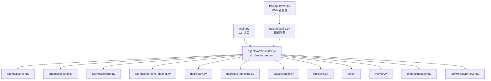
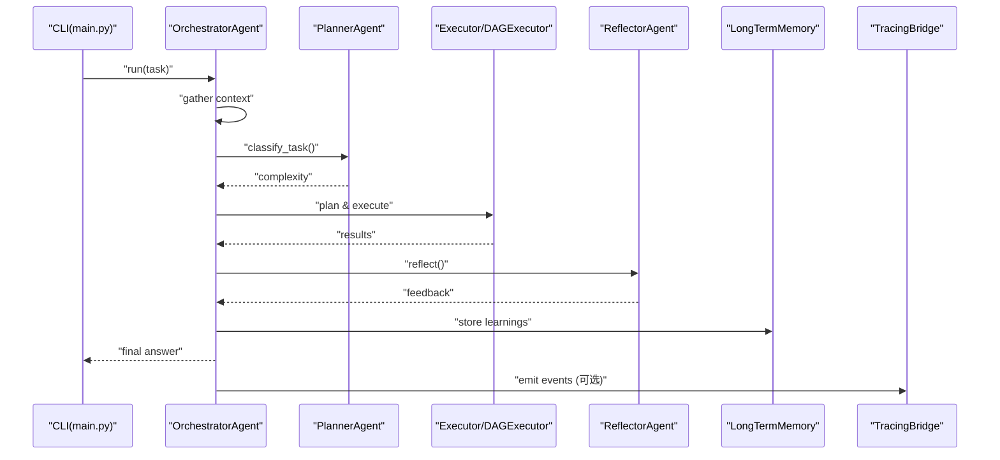
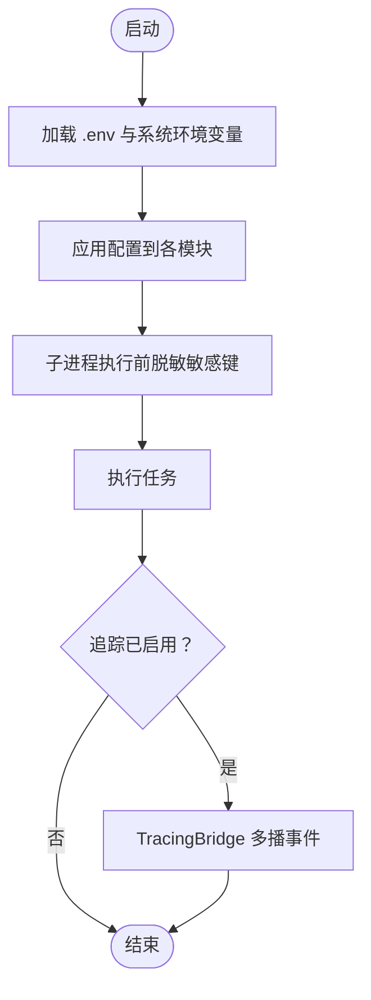
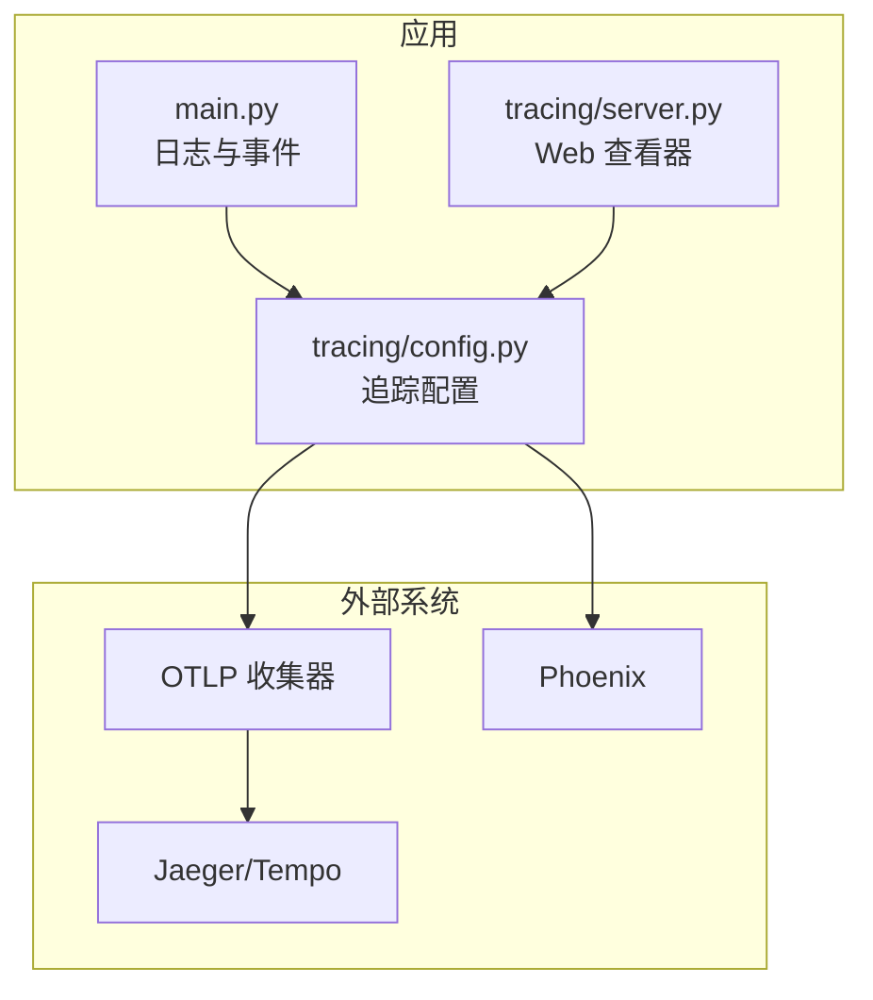
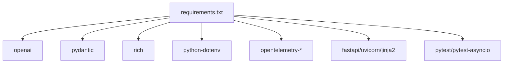

# 部署实践

<cite>
**本文引用的文件**
- [README.md](file://README.md)
- [config.py](file://config.py)
- [requirements.txt](file://requirements.txt)
- [main.py](file://main.py)
- [schema.py](file://schema.py)
- [tracing/config.py](file://tracing/config.py)
- [tracing/server.py](file://tracing/server.py)
- [agents/orchestrator.py](file://agents/orchestrator.py)
- [tools/subprocess_utils.py](file://tools/subprocess_utils.py)
</cite>

## 目录
1. [简介](#简介)
2. [项目结构](#项目结构)
3. [核心组件](#核心组件)
4. [架构总览](#架构总览)
5. [详细组件分析](#详细组件分析)
6. [依赖分析](#依赖分析)
7. [性能考虑](#性能考虑)
8. [故障排查指南](#故障排查指南)
9. [结论](#结论)
10. [附录](#附录)

## 简介
本指南面向 manus_demo 项目的生产部署，围绕配置管理、容器化、云平台部署、监控与日志、高可用与负载均衡、安全加固以及自动化部署流程给出系统化的实践建议。项目采用 Python 与 OpenAI 兼容接口，具备多智能体、DAG 执行、工具调用与全链路追踪能力，适合在云原生环境中以容器形式部署，并结合 OpenTelemetry 进行可观测性建设。

## 项目结构
manus_demo 采用模块化分层组织，核心入口为命令行交互与单任务执行，配置通过环境变量与 .env 文件加载，追踪功能可选启用并通过独立 Web 查看器提供可视化。

图表来源
- [main.py:495-516](file://main.py#L495-L516)
- [agents/orchestrator.py:60-150](file://agents/orchestrator.py#L60-L150)
- [tracing/config.py:1-79](file://tracing/config.py#L1-L79)
- [tracing/server.py:29-38](file://tracing/server.py#L29-L38)

章节来源
- [README.md:97-154](file://README.md#L97-L154)
- [main.py:495-516](file://main.py#L495-L516)

## 核心组件
- 配置管理：通过 config.py 加载 .env 与环境变量，支持 LLM API、执行限制、工具参数、追踪等配置项。
- 日志与 UI：RichHandler 提供结构化日志输出，支持 -v/--verbose 调试级别。
- 追踪与可视化：可选启用 OpenTelemetry，支持 console/file/otlp/phoenix 等导出后端，配套 Web 查看器。
- 安全与沙箱：子进程执行时进行环境变量脱敏与输出限制，沙箱目录隔离文件操作。

章节来源
- [config.py:11-109](file://config.py#L11-L109)
- [main.py:396-413](file://main.py#L396-L413)
- [tracing/config.py:17-43](file://tracing/config.py#L17-L43)
- [tracing/server.py:29-38](file://tracing/server.py#L29-L38)
- [tools/subprocess_utils.py:38-71](file://tools/subprocess_utils.py#L38-L71)

## 架构总览
manus_demo 的运行时由 OrchestratorAgent 编排，按任务复杂度路由到 v1/v2/v5 路径，执行期间可启用自适应规划与工具路由，最终将结果写入长期记忆。追踪功能通过 TracingBridge 与事件回调多播集成。

图表来源
- [agents/orchestrator.py:158-200](file://agents/orchestrator.py#L158-L200)
- [main.py:479-493](file://main.py#L479-L493)

## 详细组件分析

### 配置管理与敏感信息保护
- 环境变量与 .env 优先级：config.py 通过 python-dotenv 自动加载项目根目录 .env，系统环境变量优先级更高。
- 关键配置项：LLM API 基础地址、模型名、API Key；执行限制（上下文 token、ReAct 迭代、并行节点数等）；工具参数（沙箱目录、超时、并发）；追踪开关与导出参数。
- 敏感信息保护：子进程执行时对敏感键进行脱敏，避免泄露；追踪配置支持属性长度截断与敏感键红名单。

图表来源
- [config.py:11-109](file://config.py#L11-L109)
- [tools/subprocess_utils.py:38-52](file://tools/subprocess_utils.py#L38-L52)
- [tracing/config.py:73-79](file://tracing/config.py#L73-L79)

章节来源
- [config.py:11-109](file://config.py#L11-L109)
- [tools/subprocess_utils.py:38-71](file://tools/subprocess_utils.py#L38-L71)
- [tracing/config.py:73-79](file://tracing/config.py#L73-L79)

### 容器化与镜像构建
- 运行时要求：Python 3.11+，建议使用虚拟环境隔离依赖。
- 依赖安装：requirements.txt 包含 openai、pydantic、rich、python-dotenv 以及可选的 OpenTelemetry 与 Web 查看器依赖。
- 镜像构建建议：
  - 基础镜像：官方 Python 3.11 slim。
  - 多阶段构建：构建阶段安装 pip 依赖，运行阶段仅拷贝最小化运行时与业务代码。
  - 安全加固：以非 root 用户运行，禁用缓存 pip 清理，最小权限挂载。
  - 健康检查：提供 /health 探针（建议在应用侧暴露），结合容器健康检查策略。
- 入口命令：CMD ["python", "main.py"]

章节来源
- [README.md:156-179](file://README.md#L156-L179)
- [requirements.txt:1-19](file://requirements.txt#L1-L19)

### 云平台部署选项
- AWS：ECS/Fargate 或 EKS 上以容器方式部署，结合 IAM 角色与 Secrets Manager 管理密钥；使用 ALB/NLB 提供入口流量。
- Azure：Container Instances 或 AKS，配合 Key Vault 管理密钥；利用 Application Gateway/Load Balancer。
- GCP：Cloud Run（无服务器）或 GKE，Secret Manager 管理密钥；利用 Cloud Load Balancing。
- 通用建议：使用托管数据库（如 RDS/Azure SQL/GCP Cloud SQL）存储长期记忆（如需持久化），或采用对象存储（S3/GCS）存放日志与追踪文件。

### 监控与日志配置
- 应用日志：RichHandler 输出结构化日志，支持 -v/--verbose 开启调试级别。
- 追踪与可视化：
  - 后端选择：console/file/otlp/phoenix；OTLP 适合对接 Jaeger/Tempo 等。
  - 采样率与属性长度：通过配置项控制开销与隐私。
  - Web 查看器：FastAPI 提供 HTML 与 JSON API，支持树形视图与搜索。
- 性能指标：建议结合 OpenTelemetry SDK 暴露自定义指标（如任务耗时、节点成功率、Token 消耗）。

图表来源
- [main.py:396-413](file://main.py#L396-L413)
- [tracing/config.py:17-43](file://tracing/config.py#L17-L43)
- [tracing/server.py:29-38](file://tracing/server.py#L29-L38)

章节来源
- [main.py:396-413](file://main.py#L396-L413)
- [tracing/config.py:17-43](file://tracing/config.py#L17-L43)
- [tracing/server.py:29-38](file://tracing/server.py#L29-L38)

### 负载均衡与高可用
- 服务发现：Kubernetes 中使用 Headless Service 或 ClusterIP，结合探针与滚动更新。
- 健康检查：容器层面提供 /health 探针；应用层面可在 OrchestratorAgent 中扩展任务健康状态上报。
- 故障转移：多副本部署，结合容器重启策略与资源限制，避免单点故障。
- 并发与限流：通过 MAX_PARALLEL_NODES、SHELL_MAX_CONCURRENT、CODE_MAX_CONCURRENT 等参数控制资源占用。

章节来源
- [config.py:44-76](file://config.py#L44-L76)
- [agents/orchestrator.py:158-200](file://agents/orchestrator.py#L158-L200)

### 安全加固措施
- 网络隔离：Pod/容器网络策略限制出站访问，仅允许必要的 LLM API 与 OTLP 端点。
- 访问控制：密钥通过平台 Secret 管理，避免硬编码；只授予最小权限的 IAM 角色。
- 数据加密：传输加密（TLS）与静态加密（Secrets/存储），追踪数据脱敏与长度限制。
- 进程安全：子进程执行时脱敏环境变量，限制输出大小与超时，沙箱目录隔离。

章节来源
- [tools/subprocess_utils.py:38-71](file://tools/subprocess_utils.py#L38-L71)
- [tracing/config.py:73-79](file://tracing/config.py#L73-L79)

### 自动化部署流程（CI/CD）
- 版本管理：Git 标签与 SemVer，结合 CHANGELOG。
- 构建：多阶段 Docker 构建，缓存 pip 依赖，产物镜像打上版本标签。
- 测试：单元测试与集成测试（pytest），建议在 CI 中并行执行。
- 部署：蓝绿/金丝雀发布，结合回滚策略；变更追踪与审计日志。
- 回滚：容器镜像回滚、配置回滚（Secrets/ConfigMap），确保可逆。

## 依赖分析
- 运行时依赖：openai、pydantic、rich、python-dotenv。
- 追踪依赖：opentelemetry-api/sdk/exporter-otlp。
- Web 查看器：fastapi、uvicorn、jinja2。
- 测试依赖：pytest、pytest-asyncio。

图表来源
- [requirements.txt:1-19](file://requirements.txt#L1-L19)

章节来源
- [requirements.txt:1-19](file://requirements.txt#L1-L19)

## 性能考虑
- 并行执行：MAX_PARALLEL_NODES 控制 Super-step 并行度，避免过度竞争 CPU/IO。
- 超时与资源限制：NODE_EXECUTION_TIMEOUT、CODE_EXEC_TIMEOUT、SHELL_EXEC_TIMEOUT 保障稳定性。
- Token 与上下文：MAX_CONTEXT_TOKENS、上下文压缩与知识检索 TOP-K 影响 LLM 成本与延迟。
- 追踪开销：采样率与属性长度限制降低追踪对性能的影响。

## 故障排查指南
- 日志级别：使用 -v/--verbose 获取详细日志，定位事件流与错误堆栈。
- 追踪启用：确认 TRACING_ENABLED、TRACING_BACKEND、TRACING_ENDPOINT 设置正确。
- 环境变量：核对 .env 与系统环境变量优先级，确保 LLM API Key 与模型配置有效。
- 子进程问题：检查沙箱目录权限、输出大小限制与超时设置，避免 OOM 或阻塞。

章节来源
- [main.py:396-413](file://main.py#L396-L413)
- [config.py:11-109](file://config.py#L11-L109)
- [tracing/config.py:17-43](file://tracing/config.py#L17-L43)
- [tools/subprocess_utils.py:62-71](file://tools/subprocess_utils.py#L62-L71)

## 结论
manus_demo 的生产部署应以“配置即代码、追踪即可观测、容器即运行时”为核心原则。通过合理的环境变量与 .env 管理、多阶段容器构建、云平台托管与安全加固、完善的监控与日志体系，以及规范的 CI/CD 流程，可实现稳定、可观测、可回滚的持续交付。

## 附录
- 常用配置项速查：LLM_BASE_URL、LLM_API_KEY、LLM_MODEL、MAX_CONTEXT_TOKENS、MAX_REACT_ITERATIONS、MAX_PARALLEL_NODES、SANDBOX_DIR、TRACING_ENABLED、TRACING_BACKEND、TRACING_ENDPOINT、TRACING_SAMPLE_RATE、TRACING_MAX_ATTRIBUTE_LENGTH。
- 追踪后端选择：console（开发）、file（离线分析）、otlp（生产）、phoenix（可视化）。