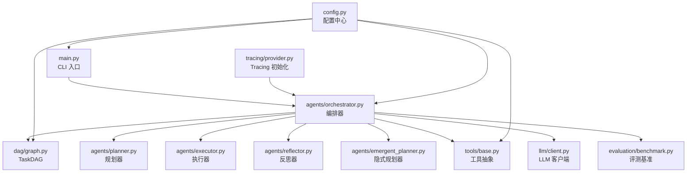
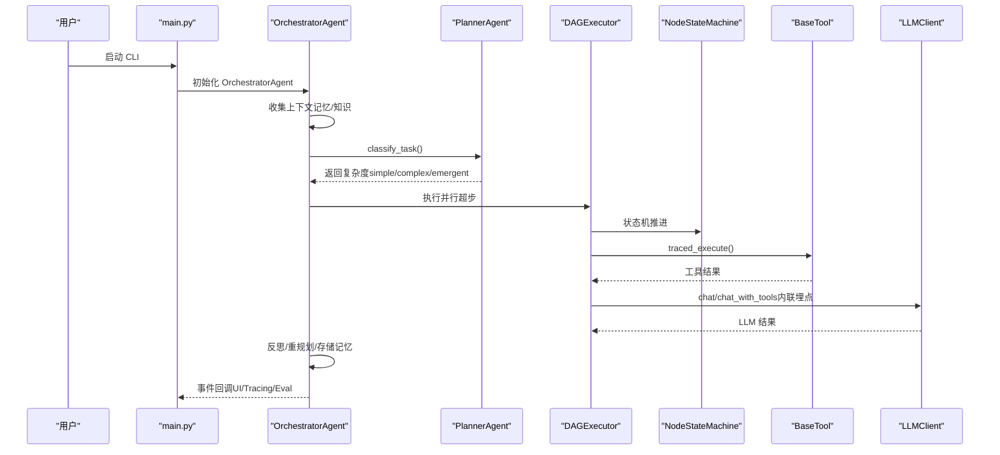
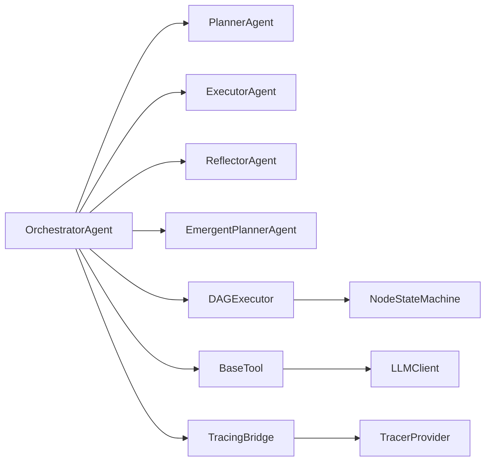

# 项目维护

<cite>
**本文引用的文件**   
- [README.md](file://README.md)
- [requirements.txt](file://requirements.txt)
- [main.py](file://main.py)
- [config.py](file://config.py)
- [schema.py](file://schema.py)
- [agents/orchestrator.py](file://agents/orchestrator.py)
- [dag/graph.py](file://dag/graph.py)
- [tools/base.py](file://tools/base.py)
- [evaluation/benchmark.py](file://evaluation/benchmark.py)
- [sxw_aicoding/docs/upgrade-plan.md](file://sxw_aicoding/docs/upgrade-plan.md)
- [sxw_aicoding/docs/CHANGELOG.md](file://sxw_aicoding/docs/CHANGELOG.md)
- [sxw_aicoding/docs/tracing-design.md](file://sxw_aicoding/docs/tracing-design.md)
- [sxw_aicoding/docs/evaluation-guide.md](file://sxw_aicoding/docs/evaluation-guide.md)
- [tests/test_dag_capabilities.py](file://tests/test_dag_capabilities.py)
- [tracing/provider.py](file://tracing/provider.py)
</cite>

## 目录
1. [简介](#简介)
2. [项目结构](#项目结构)
3. [核心组件](#核心组件)
4. [架构总览](#架构总览)
5. [详细组件分析](#详细组件分析)
6. [依赖分析](#依赖分析)
7. [性能考虑](#性能考虑)
8. [故障排查指南](#故障排查指南)
9. [结论](#结论)
10. [附录](#附录)

## 简介
本指南面向 manus_demo 项目的维护者，围绕版本升级策略、代码重构、性能调优、依赖管理、文档维护、社区贡献、项目健康度监控以及故障预防与应急响应等方面，提供系统化、可操作的最佳实践。项目当前处于 v8.0 阶段，具备混合规划路由、目标驱动规划、全链路追踪、评测模块等先进能力，适合在教学与工程实践中持续演进。

## 项目结构
manus_demo 采用按功能域划分的模块化组织方式，核心模块包括：
- 入口与配置：main.py、config.py、requirements.txt
- 智能体编排：agents/orchestrator.py 及其子智能体
- DAG 执行引擎：dag/graph.py、dag/state_machine.py、dag/executor.py
- 工具体系：tools/base.py 及具体工具
- 数据模型：schema.py
- 评测与基准：evaluation/benchmark.py、evaluation/runner.py、evaluation/report.py
- 全链路追踪：tracing/*（provider、bridge、exporters、server 等）
- 文档与升级计划：sxw_aicoding/docs 下的各类设计与升级文档
- 测试：tests/*（DAG 能力、评测、Tracing、目标驱动规划等）

图表来源
- [main.py](file://main.py)
- [agents/orchestrator.py](file://agents/orchestrator.py)
- [dag/graph.py](file://dag/graph.py)
- [tools/base.py](file://tools/base.py)
- [evaluation/benchmark.py](file://evaluation/benchmark.py)
- [tracing/provider.py](file://tracing/provider.py)
- [config.py](file://config.py)

章节来源
- [README.md](file://README.md)
- [main.py](file://main.py)
- [config.py](file://config.py)

## 核心组件
- 编排器（OrchestratorAgent）：负责上下文收集、任务复杂度分类、路由到 v1/v2/v5 路径、执行与反思、结果存储与事件驱动 UI 更新。
- DAG 执行引擎（TaskDAG + DAGExecutor + NodeStateMachine）：提供分层规划、并行超步执行、条件分支与回滚、动态图变更、检查点与状态收敛。
- 工具体系（BaseTool 及具体工具）：统一的工具抽象与追踪埋点，支持沙箱执行、参数脱敏与超时控制。
- 评测模块（BenchmarkTask + EvaluationRunner + EvaluationProbe）：零侵入式评测，对比三种规划范式，产出多维度评分与报告。
- 全链路追踪（OpenTelemetry 集成）：事件桥接 + 内联埋点，支持多后端导出与 Web 可视化。
- 配置中心（config.py）：集中管理 LLM、工具、DAG、Tracing、目标驱动规划等配置项。

章节来源
- [agents/orchestrator.py](file://agents/orchestrator.py)
- [dag/graph.py](file://dag/graph.py)
- [tools/base.py](file://tools/base.py)
- [evaluation/benchmark.py](file://evaluation/benchmark.py)
- [sxw_aicoding/docs/tracing-design.md](file://sxw_aicoding/docs/tracing-design.md)
- [config.py](file://config.py)

## 架构总览
manus_demo 采用“事件驱动 + 模块化”的架构风格，核心流程如下：
- 交互模式/单任务模式由 main.py 启动，配置日志与 UI 回调。
- OrchestratorAgent 作为中枢，结合 PlannerAgent 的两阶段分类器，自动选择 simple/complex/emergent 路径。
- 执行阶段通过 DAGExecutor 实现并行超步，配合 NodeStateMachine 严格管理状态流转。
- 工具调用通过 BaseTool.traced_execute 自动追踪，LLM 调用通过 LLMClient 内联埋点。
- 评测模块 EvaluationProbe 通过 on_event 回调收集指标，生成对比报告。
- TracingBridge 将事件映射为 OpenTelemetry Span，支持多后端导出与 Web 可视化。

图表来源
- [main.py](file://main.py)
- [agents/orchestrator.py](file://agents/orchestrator.py)
- [dag/graph.py](file://dag/graph.py)
- [tools/base.py](file://tools/base.py)
- [sxw_aicoding/docs/tracing-design.md](file://sxw_aicoding/docs/tracing-design.md)

章节来源
- [README.md](file://README.md)
- [main.py](file://main.py)
- [agents/orchestrator.py](file://agents/orchestrator.py)

## 详细组件分析

### 版本升级策略与向后兼容
- 版本演进与破坏性变更
  - v7：全链路 Tracing（OTel）与内置 Web 可视化，新增大量配置项与导出器，需 Feature Flag 控制以保证向后兼容。
  - v8：目标驱动规划（Goal-driven）引入持久化目标文档与逆向里程碑规划，通过 ENABLE_GOAL_DRIVEN_PLANNER 特性开关控制，Orchestrator 路由自动降级到 v5。
  - v6/v5/v4/v3/v2/v1：通过配置项与事件桥接实现渐进式能力叠加，避免一次性破坏性变更。
- 向后兼容保障
  - Feature Flag：TRACING_ENABLED、ENABLE_GOAL_DRIVEN_PLANNER、ENABLE_REACT_ENGINE_V2 等，确保默认关闭，避免影响现有行为。
  - 事件桥接：TracingBridge 与多播回调，不影响主流程，零侵入集成。
  - 配置优先级：.env 与环境变量优先级明确，避免冲突。
- 迁移路径规划
  - v7 → v8：先启用目标驱动规划特性开关，观察 Orchestrator 路由变化与事件序列，再逐步替换 emergent 路径。
  - Tracing：先在开发环境启用 TRACING_BACKEND=rich，再过渡到 file/otlp/phoenix。
- 破坏性变更处理
  - 严格的功能开关与条件分支，确保在新旧模式间平滑切换。
  - 通过 CHANGELOG 与升级计划文档记录变更点，配合测试用例验证回归。

章节来源
- [sxw_aicoding/docs/CHANGELOG.md](file://sxw_aicoding/docs/CHANGELOG.md)
- [sxw_aicoding/docs/upgrade-plan.md](file://sxw_aicoding/docs/upgrade-plan.md)
- [agents/orchestrator.py](file://agents/orchestrator.py)
- [tracing/provider.py](file://tracing/provider.py)

### 代码重构指导原则
- 重构时机判断
  - 评测模块发现的性能瓶颈或稳定性问题（如 ReAct 迭代过多、Token 消耗过高）。
  - Tracing 事件映射不完整或埋点缺失，影响可观测性。
  - 配置项分散或命名不一致，增加维护成本。
- 重构策略
  - 以最小改动为目标：优先采用装饰器与桥接器（如 @traced、TracingBridge）实现零侵入。
  - 以配置为中心：将分散的常量与阈值收敛到 config.py，统一命名与默认值。
  - 以测试为约束：在重构前后运行 tests/test_dag_capabilities.py、tests/test_evaluation.py 等关键测试。
- 风险控制
  - 通过 Feature Flag 与条件分支（如 PLAN_MODE、ENABLE_GOAL_DRIVEN_PLANNER）灰度发布。
  - 保留回滚路径（如 v8 回退到 v5 emergent），确保异常时系统可用。
  - 严格的变更记录与评审流程，配合 CHANGELOG 与升级计划文档。

章节来源
- [tests/test_dag_capabilities.py](file://tests/test_dag_capabilities.py)
- [sxw_aicoding/docs/tracing-design.md](file://sxw_aicoding/docs/tracing-design.md)
- [config.py](file://config.py)

### 性能调优方法
- 瓶颈识别
  - 使用 Tracing Web Viewer 与 Rich 导出定位热点（LLM 调用、工具执行、DAG 超步并行度不足）。
  - 评测模块的效率指标（轨迹效率、Token 效率、时间效率、重规划惩罚）量化瓶颈。
- 优化策略
  - 并行度与超步：调整 MAX_PARALLEL_NODES，结合 DAG 的就绪节点检测，最大化并行收益。
  - 工具与 LLM：通过 ToolRouter 与 LLM Retry 机制减少失败与重试成本。
  - 上下文与 Token：启用 Token 追踪与上下文压缩（v8 目标驱动规划中采用滑动窗口与阶段性重锚定）。
- 效果评估
  - 评测模块对比三种范式在相同任务集上的综合评分与失败分布。
  - Tracing 导出 JSON 文件进行离线分析，绘制耗时与吞吐趋势。

章节来源
- [evaluation/benchmark.py](file://evaluation/benchmark.py)
- [sxw_aicoding/docs/evaluation-guide.md](file://sxw_aicoding/docs/evaluation-guide.md)
- [tracing/provider.py](file://tracing/provider.py)

### 依赖管理最佳实践
- 依赖更新策略
  - 优先使用语义化版本范围（如 >=、~），避免锁定死版本导致安全漏洞无法修复。
  - 通过 requirements.txt 统一声明，tracing 依赖仅在启用时生效（Feature Flag）。
- 安全漏洞修复
  - 定期扫描第三方包，优先修复高危漏洞；对 OpenTelemetry 系列依赖保持同步。
  - 对敏感参数（如 API Key）通过环境变量注入，避免硬编码。
- 版本锁定
  - 在 CI 中使用 pip-tools 或 Poetry 锁定版本，确保开发与生产一致性。
  - 对可选依赖（如 OTLP、Phoenix）在启用时才安装，减少镜像体积。

章节来源
- [requirements.txt](file://requirements.txt)
- [config.py](file://config.py)

### 文档维护规范
- 文档更新流程
  - 变更 → 更新对应文档（升级计划、设计文档、评测指南）→ 评审 → 合并。
  - 重大变更在 CHANGELOG 中记录，升级计划中给出迁移步骤。
- 版本同步
  - 升级计划与 CHANGELOG 保持一致，Tracing 设计与实现同步更新。
  - 评测指南与基准任务定义保持一致，确保评测结果可信。
- 质量保证
  - 文档与代码注释双轨制，关键流程（事件映射、埋点、配置项）在设计文档中明确。
  - 通过自动化测试（pytest）验证文档示例与配置项的正确性。

章节来源
- [sxw_aicoding/docs/upgrade-plan.md](file://sxw_aicoding/docs/upgrade-plan.md)
- [sxw_aicoding/docs/CHANGELOG.md](file://sxw_aicoding/docs/CHANGELOG.md)
- [sxw_aicoding/docs/tracing-design.md](file://sxw_aicoding/docs/tracing-design.md)
- [sxw_aicoding/docs/evaluation-guide.md](file://sxw_aicoding/docs/evaluation-guide.md)

### 社区贡献指南
- 贡献流程
  - Fork → 分支（feat/fix/docs）→ 编写测试 → 提交 PR → 代码评审 → 合并。
  - 重大变更需附升级计划与 CHANGELOG 更新。
- 代码标准
  - 遵循事件驱动与零侵入原则，优先使用装饰器与桥接器。
  - 配置项集中管理，命名规范统一，文档齐全。
- 沟通规范
  - 在 PR 描述中说明动机、变更范围与影响，附带评测结果或 Tracing 截图。

章节来源
- [README.md](file://README.md)
- [sxw_aicoding/docs/upgrade-plan.md](file://sxw_aicoding/docs/upgrade-plan.md)

### 项目健康度监控指标
- 代码质量
  - 单元测试覆盖率：重点覆盖 DAG 能力、Tracing、评测模块与目标驱动规划。
  - 代码审查通过率与缺陷密度（按模块统计）。
- 测试覆盖率
  - tests/test_dag_capabilities.py：DAG 能力、条件分支、动态变更、自适应规划。
  - tests/test_evaluation.py：评测模块事件探针与评分计算。
  - tests/test_tracing.py：Tracing 功能开关、装饰器行为、敏感数据脱敏。
- 性能基准
  - 评测模块输出的综合评分、轨迹效率、Token 效率、时间效率。
  - Tracing 导出的耗时分布与并行度利用率。

章节来源
- [tests/test_dag_capabilities.py](file://tests/test_dag_capabilities.py)
- [sxw_aicoding/docs/evaluation-guide.md](file://sxw_aicoding/docs/evaluation-guide.md)

### 故障预防与应急响应机制
- 预警系统
  - Tracing 采样率与后端配置（TRACING_SAMPLE_RATE、TRACING_BACKEND）在生产环境下调低采样，避免性能抖动。
  - 通过评测模块的失败分布表识别系统性问题（如工具选择错误、分类偏差）。
- 应急预案
  - Feature Flag 一键关闭：TRACING_ENABLED、ENABLE_GOAL_DRIVEN_PLANNER、ENABLE_REACT_ENGINE_V2。
  - Orchestrator 路由降级：当目标驱动规划出现 BLOCKED TODO 时，自动回退到 v5 emergent。
- 恢复流程
  - 通过 Tracing Web Viewer 快速定位异常 Span，结合日志与事件序列回溯。
  - 使用 DAG Checkpoint 与状态快照进行断点恢复与调试。

章节来源
- [agents/orchestrator.py](file://agents/orchestrator.py)
- [tracing/provider.py](file://tracing/provider.py)
- [sxw_aicoding/docs/tracing-design.md](file://sxw_aicoding/docs/tracing-design.md)

## 依赖分析
- 外部依赖
  - OpenAI 兼容客户端：用于 LLM 调用与评测。
  - OpenTelemetry：全链路追踪与导出。
  - FastAPI/Uvicorn/Jinja2：Tracing Web Viewer。
  - Pydantic：数据模型与校验。
- 内部耦合
  - OrchestratorAgent 与 Planner/Executor/Reflector/EmegentPlanner 强耦合，通过事件回调弱化 UI 与追踪的影响。
  - DAG 执行引擎与 NodeStateMachine 强耦合，保证状态机合法性。
  - BaseTool 与 LLMClient 通过 traced_execute 与内联埋点实现追踪集成。

图表来源
- [agents/orchestrator.py](file://agents/orchestrator.py)
- [dag/graph.py](file://dag/graph.py)
- [tools/base.py](file://tools/base.py)
- [tracing/provider.py](file://tracing/provider.py)

章节来源
- [agents/orchestrator.py](file://agents/orchestrator.py)
- [dag/graph.py](file://dag/graph.py)
- [tools/base.py](file://tools/base.py)
- [tracing/provider.py](file://tracing/provider.py)

## 性能考虑
- 并行与 I/O
  - 通过 MAX_PARALLEL_NODES 控制超步并行度，避免资源争用。
  - 工具与 LLM 调用采用异步与超时控制，减少阻塞。
- 上下文与 Token
  - Token 追踪与上下文压缩（v8 目标驱动规划）降低 LLM 成本。
- 可观测性
  - Tracing 导出与 Web Viewer 用于离线分析与可视化，支撑持续优化。

章节来源
- [config.py](file://config.py)
- [tools/base.py](file://tools/base.py)
- [sxw_aicoding/docs/evaluation-guide.md](file://sxw_aicoding/docs/evaluation-guide.md)

## 故障排查指南
- 常见问题定位
  - DAG 环检测：拓扑排序不完整或节点状态异常，检查依赖边与状态机转换。
  - 工具执行失败：参数脱敏与超时控制，查看 Tracing 中 tool.execute.* Span。
  - LLM 调用异常：启用 LLM Retry 与 Token 追踪，核对请求与响应属性。
- 事件与日志
  - 使用 on_event 回调输出阶段与节点状态，结合 Tracing 事件树进行回溯。
  - 通过 Tracing Web Viewer 查看 Trace 列表与详情页，定位异常 Span。

章节来源
- [dag/graph.py](file://dag/graph.py)
- [tools/base.py](file://tools/base.py)
- [tracing/provider.py](file://tracing/provider.py)

## 结论
manus_demo 在 v8 阶段实现了目标驱动规划与全链路追踪，具备完善的评测与可观测能力。维护者应坚持“事件驱动 + 配置中心 + Feature Flag”的演进策略，以最小代价引入新能力，通过测试与评测持续验证，确保系统在教学与工程场景中稳定演进。

## 附录
- 快速参考
  - 配置项：LLM、工具、DAG、Tracing、目标驱动规划等。
  - 评测命令：--modes、--difficulty、--tasks、--output、--dry-run、--verbose。
  - Tracing 启用：TRACING_ENABLED、TRACING_BACKEND、TRACING_SAMPLE_RATE、TRACING_ENDPOINT。

章节来源
- [config.py](file://config.py)
- [sxw_aicoding/docs/evaluation-guide.md](file://sxw_aicoding/docs/evaluation-guide.md)
- [sxw_aicoding/docs/tracing-design.md](file://sxw_aicoding/docs/tracing-design.md)