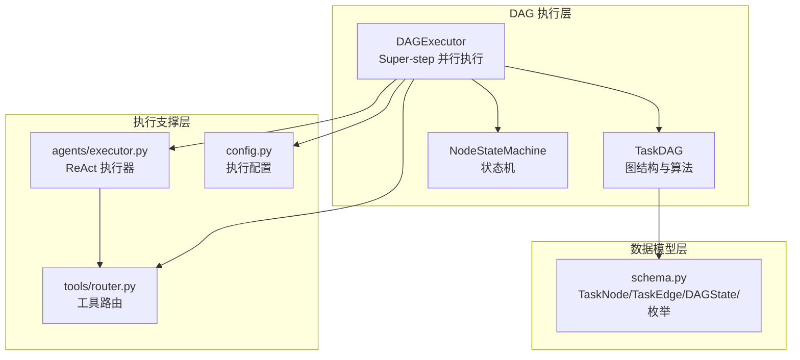
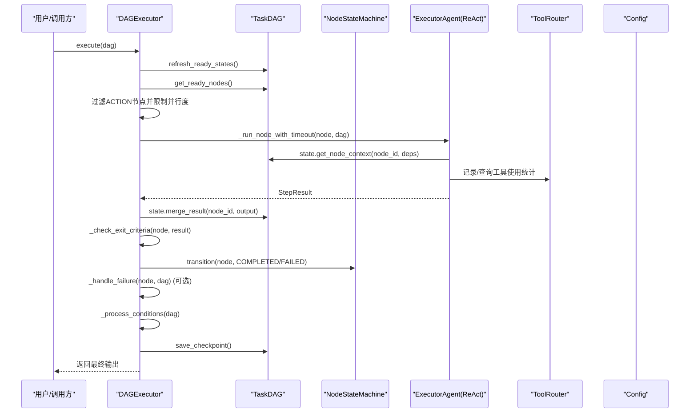
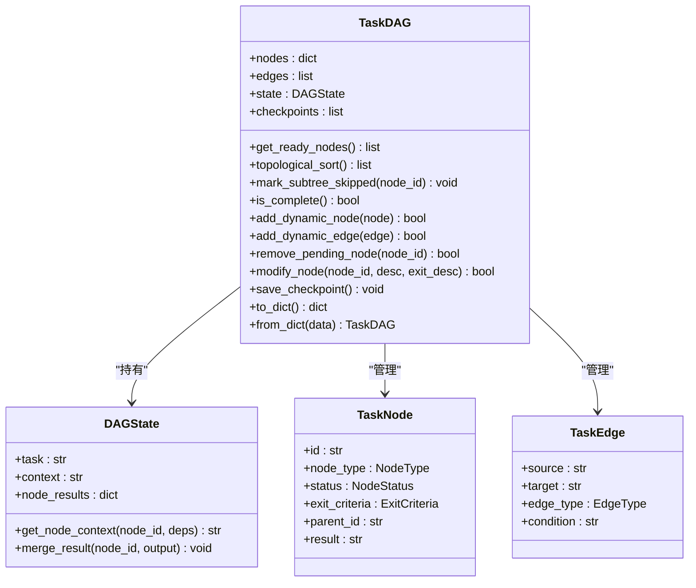
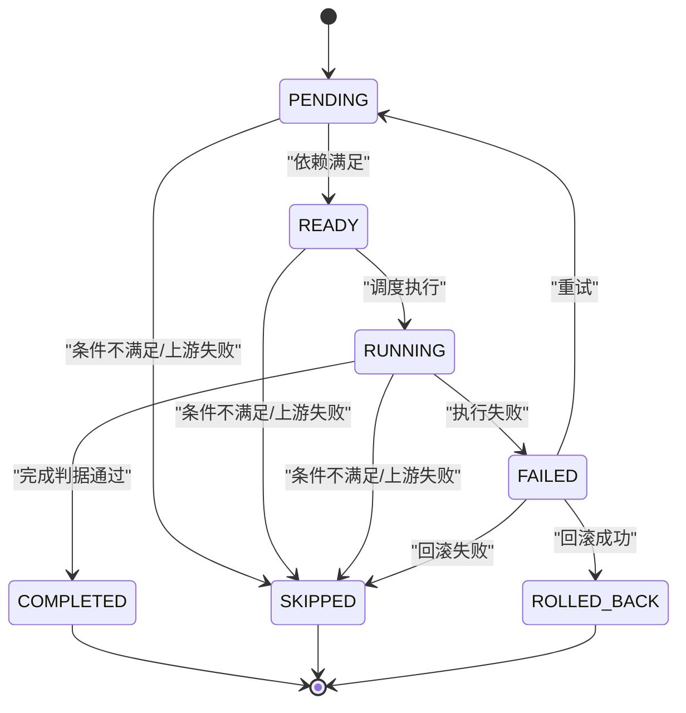
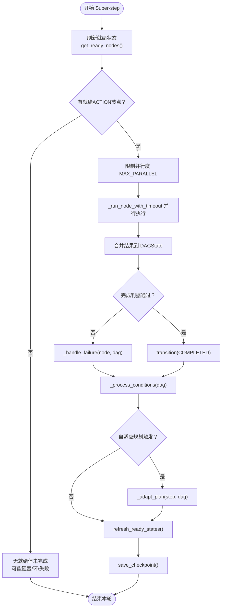
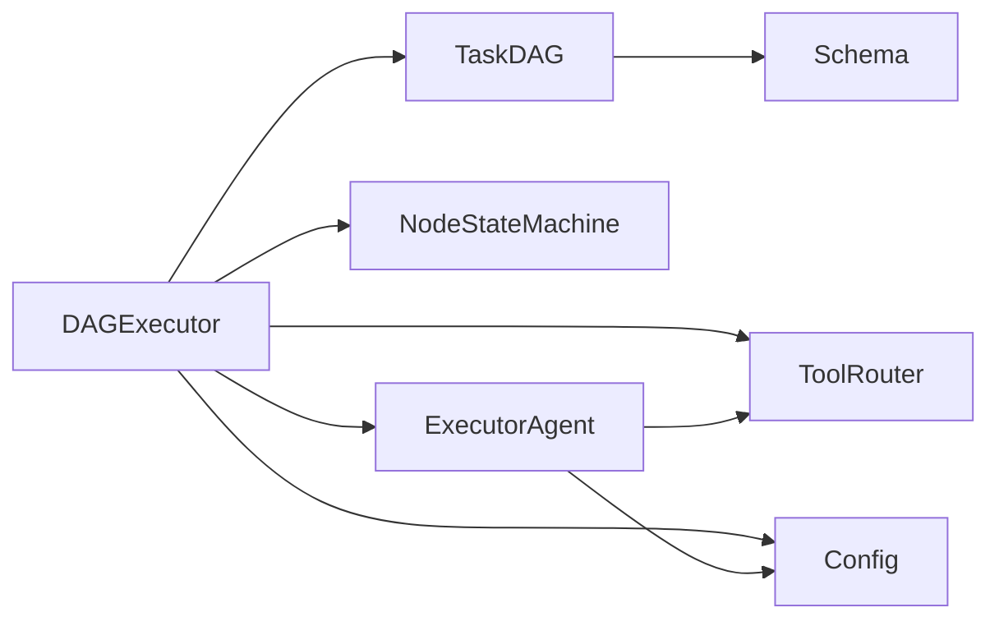

# DAG执行模型

<cite>
**本文引用的文件**
- [dag/__init__.py](file://dag/__init__.py)
- [dag/graph.py](file://dag/graph.py)
- [dag/state_machine.py](file://dag/state_machine.py)
- [dag/executor.py](file://dag/executor.py)
- [schema.py](file://schema.py)
- [config.py](file://config.py)
- [tests/test_dag_capabilities.py](file://tests/test_dag_capabilities.py)
- [README.md](file://README.md)
- [agents/executor.py](file://agents/executor.py)
- [tools/router.py](file://tools/router.py)
</cite>

## 目录
1. [简介](#简介)
2. [项目结构](#项目结构)
3. [核心组件](#核心组件)
4. [架构总览](#架构总览)
5. [详细组件分析](#详细组件分析)
6. [依赖关系分析](#依赖关系分析)
7. [性能考量](#性能考量)
8. [故障排查指南](#故障排查指南)
9. [结论](#结论)
10. [附录](#附录)

## 简介
本技术文档围绕DAG执行模型展开，系统阐述TaskDAG数据结构的设计与实现、节点类型与用途、有向无环图的构建与拓扑排序、并行执行模型（Super-step）与依赖关系处理、状态机驱动的执行流程（节点生命周期、状态转换规则与错误恢复）、动态图变更与性能优化策略，以及调试与故障排查实践。文档同时提供关键代码片段路径，便于读者定位实现细节。

## 项目结构
DAG执行模型位于独立的dag模块，配合schema.py中的数据模型、config.py中的配置项、agents/executor.py中的ReAct执行器、tools/router.py中的工具路由，共同构成完整的执行闭环。

图表来源
- [dag/graph.py](file://dag/graph.py)
- [dag/state_machine.py](file://dag/state_machine.py)
- [dag/executor.py](file://dag/executor.py)
- [schema.py](file://schema.py)
- [agents/executor.py](file://agents/executor.py)
- [tools/router.py](file://tools/router.py)
- [config.py](file://config.py)

章节来源
- [dag/__init__.py](file://dag/__init__.py)
- [README.md](file://README.md)

## 核心组件
- TaskDAG：封装节点、边、集中式状态与检查点，提供就绪节点发现、拓扑排序、条件分支、回滚、动态变更等能力。
- NodeStateMachine：强制节点状态合法转移，确保生命周期约束。
- DAGExecutor：以Super-step模型驱动并行执行，串联ReAct执行器、条件评估、失败回滚、自适应规划与检查点。
- schema.py：定义节点类型（GOAL/SUBGOAL/ACTION）、状态（PENDING/READY/RUNNING/COMPLETED/FAILED/SKIPPED/ROLLED_BACK）、边类型（DEPENDENCY/CONDITIONAL/ROLLBACK）、完成判据、集中式DAGState等。
- config.py：执行参数（并行度、超时、检查点上限）、自适应规划参数、工具路由阈值等。
- agents/executor.py：实现ReAct循环，封装工具调用与上下文传递。
- tools/router.py：追踪工具连续失败并给出替代建议。

章节来源
- [dag/graph.py](file://dag/graph.py)
- [dag/state_machine.py](file://dag/state_machine.py)
- [dag/executor.py](file://dag/executor.py)
- [schema.py](file://schema.py)
- [config.py](file://config.py)
- [agents/executor.py](file://agents/executor.py)
- [tools/router.py](file://tools/router.py)

## 架构总览
DAG执行采用“集中式状态 + Super-step并行”的设计，借鉴LangGraph的思路，将所有节点结果写入DAGState，通过状态机保障状态转移合法性，通过条件边与回滚边实现动态分支与错误恢复，通过自适应规划在执行过程中动态调整图结构。

图表来源
- [dag/executor.py](file://dag/executor.py)
- [dag/graph.py](file://dag/graph.py)
- [agents/executor.py](file://agents/executor.py)
- [tools/router.py](file://tools/router.py)
- [config.py](file://config.py)

## 详细组件分析

### TaskDAG：数据结构与算法
- 节点与边
  - 节点类型：GOAL（顶层目标）、SUBGOAL（逻辑分组）、ACTION（可执行叶节点）。
  - 边类型：DEPENDENCY（依赖）、CONDITIONAL（条件）、ROLLBACK（回滚）。
- 集中式状态
  - DAGState作为单一真相源，节点结果以node_id为键写入，避免并行写冲突。
- 就绪节点发现
  - 运行时扫描所有节点，基于依赖完成状态动态发现可并行执行节点。
- 拓扑排序
  - 使用预构建邻接表实现O(V+E)的Kahn算法，保证执行顺序合法。
- 条件边与回滚
  - 条件边在节点完成后评估，满足则激活目标节点，否则跳过并级联跳过下游。
  - 回滚边在失败时触发，成功则标记为ROLLED_BACK，否则标记为SKIPPED。
- 动态图变更
  - 运行时添加/移除/修改节点与边，维护邻接表并进行环检测。
- 检查点
  - 每轮结束保存快照，支持调试与回溯。

图表来源
- [dag/graph.py](file://dag/graph.py)
- [schema.py](file://schema.py)

章节来源
- [dag/graph.py](file://dag/graph.py)
- [schema.py](file://schema.py)

### NodeStateMachine：状态机与生命周期
- 状态枚举：PENDING → READY → RUNNING → COMPLETED；或 FAILED → ROLLED_BACK 或 SKIPPED；或直接 SKIPPED。
- 转移表：唯一权威的合法转移集合，非法转移抛出异常。
- 回调：状态变更时触发UI事件回调，保证前端一致性。

图表来源
- [dag/state_machine.py](file://dag/state_machine.py)
- [schema.py](file://schema.py)

章节来源
- [dag/state_machine.py](file://dag/state_machine.py)
- [schema.py](file://schema.py)

### DAGExecutor：Super-step并行执行
- 主循环
  - 每轮为一个Super-step：发现就绪节点、并行执行、合并结果、验证完成判据、处理失败、评估条件、保存检查点。
- 并行执行
  - 使用asyncio.gather并行执行ACTION节点，return_exceptions=True避免单节点异常影响其他节点。
- 超时保护
  - 每节点执行带超时，超时返回失败结果，避免阻塞整个批次。
- 完成判据
  - 通过Reflector进行LLM验证或直接以执行成功与否为准。
- 失败处理
  - 执行失败时触发回滚边（若有），否则直接跳过；随后级联跳过下游子树。
- 条件边处理
  - 评估CONDITIONAL边，满足则激活目标节点，否则跳过并级联跳过。
- 结构性节点自动完成
  - GOAL/SUBGOAL在子节点终态后自动完成，遵循“至少一个子节点成功则完成，否则跳过”规则。
- 自适应规划（v3）
  - 每N轮检查已完成ACTION数量，若满足阈值则调用Planner进行REMOVE/MODIFY/ADD等调整。
- 输出编译
  - 按拓扑序汇总ACTION节点结果，形成最终输出。

图表来源
- [dag/executor.py](file://dag/executor.py)
- [dag/graph.py](file://dag/graph.py)

章节来源
- [dag/executor.py](file://dag/executor.py)

### 数据模型与枚举
- 节点类型（NodeType）：GOAL、SUBGOAL、ACTION。
- 节点状态（NodeStatus）：PENDING、READY、RUNNING、COMPLETED、FAILED、SKIPPED、ROLLED_BACK。
- 边类型（EdgeType）：DEPENDENCY、CONDITIONAL、ROLLBACK。
- 完成判据（ExitCriteria）：描述成功条件、是否需要LLM验证、验证提示词。
- 风险评估（RiskAssessment）：置信度、风险等级、失败策略。
- 集中式状态（DAGState）：task、context、node_results，提供上下文拼接与结果合并。

章节来源
- [schema.py](file://schema.py)

### 配置与参数
- 执行参数：MAX_PARALLEL_NODES（每轮最大并行）、NODE_EXECUTION_TIMEOUT（节点超时）、MAX_CHECKPOINTS（检查点上限）。
- 自适应规划：ADAPTIVE_PLANNING_ENABLED、ADAPT_PLAN_INTERVAL、ADAPT_PLAN_MIN_COMPLETED。
- 工具路由：TOOL_FAILURE_THRESHOLD（连续失败阈值）。
- 其他：MAX_CONTEXT_TOKENS、MAX_REACT_ITERATIONS、工具执行超时与并发限制等。

章节来源
- [config.py](file://config.py)

### ReAct执行器与工具路由
- ExecutorAgent：实现ReAct循环，支持DAG节点执行入口execute_node()，与ToolRouter集成，记录工具调用日志。
- ToolRouter：追踪每个节点的工具使用统计，连续失败超过阈值时向LLM注入替代建议，避免工具死循环。

章节来源
- [agents/executor.py](file://agents/executor.py)
- [tools/router.py](file://tools/router.py)

## 依赖关系分析
- DAGExecutor依赖TaskDAG、NodeStateMachine、ExecutorAgent、ToolRouter、Config。
- TaskDAG依赖NodeStateMachine、Schema（TaskNode/TaskEdge/DAGState）。
- ExecutorAgent依赖LLMClient、工具集合、ToolRouter、ContextManager。
- ToolRouter依赖Config中的失败阈值。

图表来源
- [dag/executor.py](file://dag/executor.py)
- [dag/graph.py](file://dag/graph.py)
- [agents/executor.py](file://agents/executor.py)
- [tools/router.py](file://tools/router.py)
- [config.py](file://config.py)

章节来源
- [dag/executor.py](file://dag/executor.py)
- [dag/graph.py](file://dag/graph.py)
- [agents/executor.py](file://agents/executor.py)
- [tools/router.py](file://tools/router.py)
- [config.py](file://config.py)

## 性能考量
- 时间复杂度
  - 就绪节点发现：O(V+E)（基于预构建邻接表）。
  - 拓扑排序：O(V+E)。
  - 条件边评估：每步O(N_completed × E_cond)，通过pair缓存避免重复计算。
- 并行度控制
  - MAX_PARALLEL_NODES限制每轮并发，避免资源争用。
- 超时与回退
  - NODE_EXECUTION_TIMEOUT防止卡死；失败时立即回滚或跳过，减少无效等待。
- 内存与检查点
  - MAX_CHECKPOINTS限制内存中快照数量，避免长时间运行导致内存膨胀。
- 工具路由
  - TOOL_FAILURE_THRESHOLD避免LLM反复尝试失败工具，提高稳定性。

章节来源
- [dag/graph.py](file://dag/graph.py)
- [dag/executor.py](file://dag/executor.py)
- [config.py](file://config.py)

## 故障排查指南
- DAG阻塞诊断
  - 使用get_blockage_report()生成阻塞节点报告，查看依赖未满足的节点与阻塞关系。
  - try_recover_blocked_nodes()尝试将依赖终态但仍为PENDING的节点提升为READY。
- 状态机异常
  - InvalidTransitionError表明状态转移非法，检查节点状态与依赖是否满足。
- 条件分支问题
  - 检查CONDITIONAL边的condition关键字与源节点输出是否匹配（支持CJK子串匹配与拉丁词边界匹配）。
- 回滚与跳过
  - 若节点失败但未回滚，确认ROLLBACK边是否存在；若下游节点被跳过，确认mark_subtree_skipped()是否正确执行。
- 动态变更
  - add_dynamic_edge()会进行环检测，若拒绝添加，检查新增边是否会导致环。
- 日志与事件
  - 关注DAGExecutor发出的事件（superstep、node_running、node_completed、node_failed、condition_evaluated、node_transition、plan_adaptation等），结合DEBUG日志定位问题。

章节来源
- [dag/graph.py](file://dag/graph.py)
- [dag/executor.py](file://dag/executor.py)
- [dag/state_machine.py](file://dag/state_machine.py)
- [tests/test_dag_capabilities.py](file://tests/test_dag_capabilities.py)

## 结论
DAG执行模型通过TaskDAG的数据结构与算法、NodeStateMachine的状态约束、DAGExecutor的Super-step并行执行、以及条件边与回滚边的动态控制，实现了灵活、健壮、可观测的执行流程。配合自适应规划与工具路由，系统能够在执行过程中持续优化与恢复。通过合理的配置与监控，可有效提升性能与稳定性。

## 附录

### 代码示例路径（不展示具体代码）
- 构建三层DAG（Goal/SubGoal/Action）并执行
  - [tests/test_dag_capabilities.py](file://tests/test_dag_capabilities.py)
- 条件分支与回滚
  - [tests/test_dag_capabilities.py](file://tests/test_dag_capabilities.py)
- 动态图变更（增删改节点/边）
  - [tests/test_dag_capabilities.py](file://tests/test_dag_capabilities.py)
- 自适应规划集成
  - [tests/test_dag_capabilities.py](file://tests/test_dag_capabilities.py)
- ReAct执行器与工具路由
  - [agents/executor.py](file://agents/executor.py)
  - [tools/router.py](file://tools/router.py)

### 关键API与方法速览
- TaskDAG
  - get_ready_nodes()、topological_sort()、mark_subtree_skipped()、is_complete()、add_dynamic_node()、add_dynamic_edge()、remove_pending_node()、modify_node()、save_checkpoint()、to_dict()/from_dict()
- NodeStateMachine
  - can_transition()、transition()
- DAGExecutor
  - execute()、_run_node_with_timeout()、_check_exit_criteria()、_handle_failure()、_process_conditions()、_complete_structural_nodes()、_compile_output()、_adapt_plan()

章节来源
- [dag/graph.py](file://dag/graph.py)
- [dag/state_machine.py](file://dag/state_machine.py)
- [dag/executor.py](file://dag/executor.py)
- [tests/test_dag_capabilities.py](file://tests/test_dag_capabilities.py)
- [agents/executor.py](file://agents/executor.py)
- [tools/router.py](file://tools/router.py)