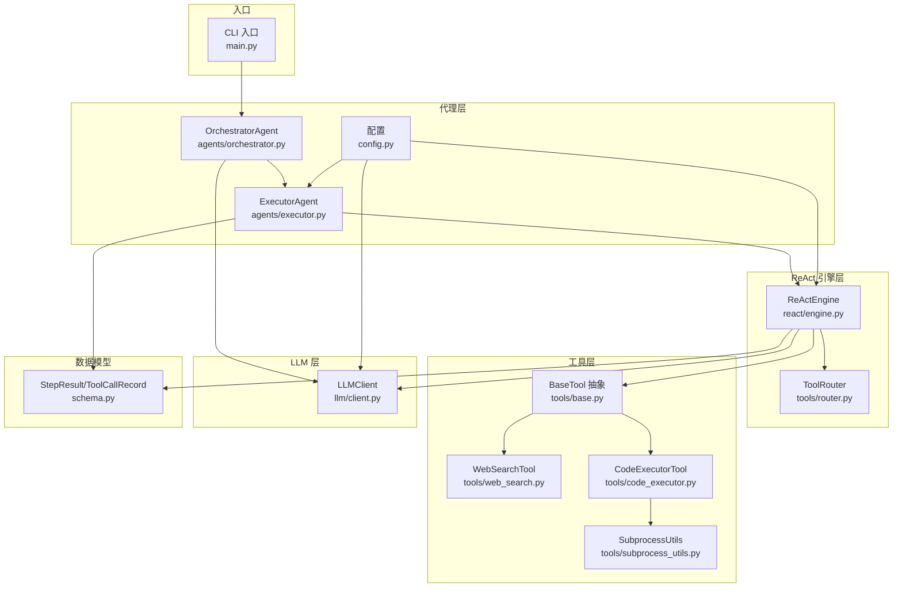
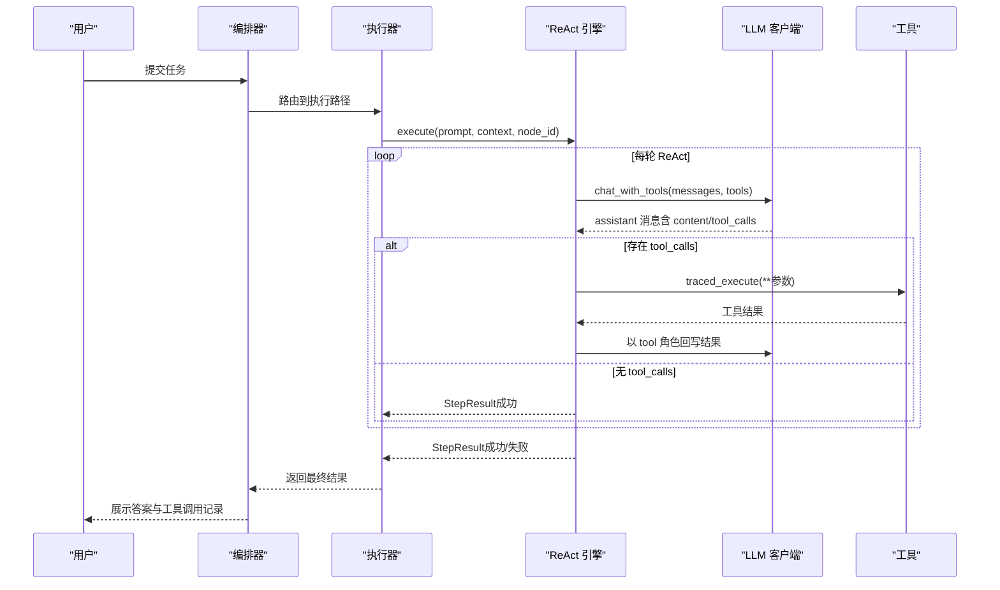
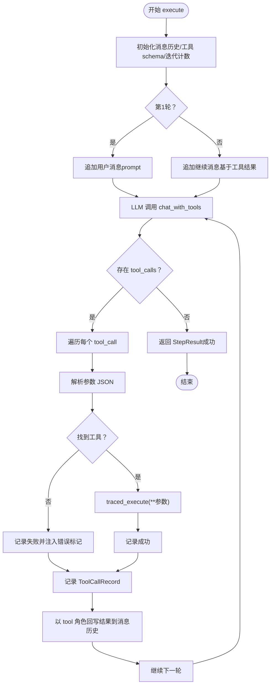
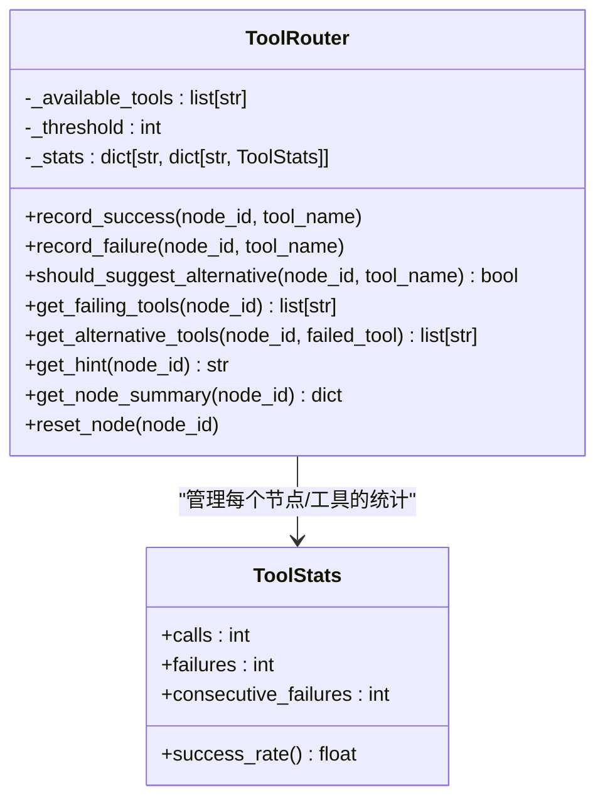
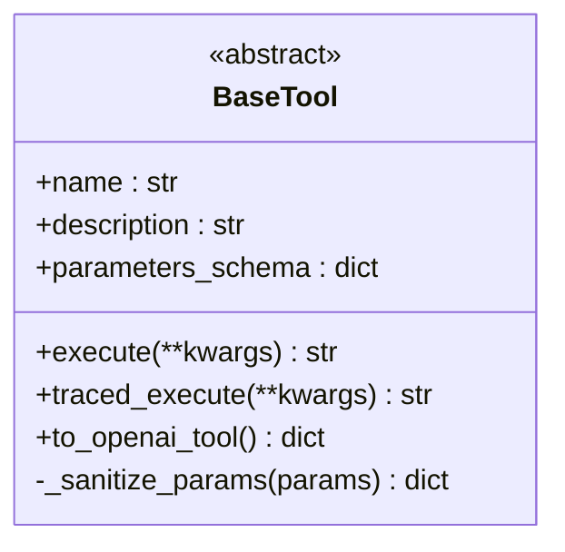
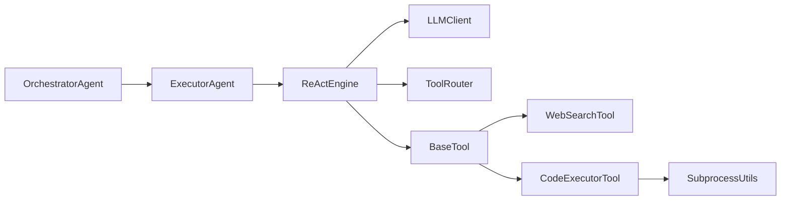

# ReAct循环机制

<cite>
**本文引用的文件**
- [react/engine.py](file://react/engine.py)
- [tools/router.py](file://tools/router.py)
- [tools/base.py](file://tools/base.py)
- [tools/web_search.py](file://tools/web_search.py)
- [tools/code_executor.py](file://tools/code_executor.py)
- [tools/subprocess_utils.py](file://tools/subprocess_utils.py)
- [llm/client.py](file://llm/client.py)
- [schema.py](file://schema.py)
- [config.py](file://config.py)
- [agents/executor.py](file://agents/executor.py)
- [agents/orchestrator.py](file://agents/orchestrator.py)
- [main.py](file://main.py)
</cite>

## 目录
1. [简介](#简介)
2. [项目结构](#项目结构)
3. [核心组件](#核心组件)
4. [架构概览](#架构概览)
5. [详细组件分析](#详细组件分析)
6. [依赖分析](#依赖分析)
7. [性能考虑](#性能考虑)
8. [故障排查指南](#故障排查指南)
9. [结论](#结论)
10. [附录](#附录)

## 简介
本文件系统性阐述 ReAct（推理与行动）循环机制在 Manus Demo 中的实现与应用。ReAct 循环将 LLM 的“思考（Thought）—行动（Action）—观察（Observation）”三阶段整合为统一的迭代执行范式：LLM 基于工具 Schema 决策下一步行动，工具执行后将结果作为 observation 反馈给 LLM，如此往复直至达成目标或达到迭代上限。ReAct 引擎（ReActEngine）抽取了执行器与隐式规划器中的公共循环逻辑，提供统一的循环控制、状态管理与结果聚合能力，并集成工具路由（ToolRouter）以实现基于失败的工具切换提示。

ReAct 循环相比传统 LLM 调用的优势在于：
- 将“工具选择与调用”内嵌于对话流，减少外部状态管理复杂度
- 通过工具调用 schema 与函数调用能力，使 LLM 自主决定何时调用何种工具
- 通过工具路由与错误标记，避免陷入工具失败的死循环
- 通过统一引擎与可配置迭代上限，提升稳定性与可维护性

## 项目结构
ReAct 循环相关的关键文件与职责如下：
- react/engine.py：ReAct 引擎核心，封装统一的 ReAct 循环、工具调用、错误处理与结果聚合
- tools/router.py：工具路由器，统计工具失败次数并生成切换提示
- tools/base.py：工具抽象基类，提供 traced_execute（带追踪）与 OpenAI function schema 转换
- tools/web_search.py：示例工具，演示如何实现工具的参数 schema 与执行逻辑
- tools/code_executor.py：代码执行工具，演示安全子进程执行与超时控制
- tools/subprocess_utils.py：子进程工具集，提供安全环境、输出限制与超时保障
- llm/client.py：LLM 客户端，封装 OpenAI 兼容 API 的聊天与工具调用能力，支持重试与追踪
- schema.py：StepResult、ToolCallRecord 等数据模型，承载执行结果与工具调用记录
- config.py：全局配置，包括最大迭代次数、工具失败阈值、LLM 重试等
- agents/executor.py：执行器，提供 DAG 与 v1 路径的 ReAct 循环入口，支持统一引擎开关
- agents/orchestrator.py：编排器，将 ReAct 循环集成到混合路由的多路径流水线
- main.py：CLI 入口，注册工具与 Orchestrator，展示 ReAct 循环在 UI 中的事件流

图表来源
- [react/engine.py:1-246](file://react/engine.py#L1-L246)
- [tools/router.py:1-168](file://tools/router.py#L1-L168)
- [tools/base.py:1-175](file://tools/base.py#L1-L175)
- [tools/web_search.py:1-113](file://tools/web_search.py#L1-L113)
- [tools/code_executor.py:1-102](file://tools/code_executor.py#L1-L102)
- [tools/subprocess_utils.py:1-156](file://tools/subprocess_utils.py#L1-L156)
- [llm/client.py:1-420](file://llm/client.py#L1-L420)
- [schema.py:342-361](file://schema.py#L342-L361)
- [agents/executor.py:66-323](file://agents/executor.py#L66-L323)
- [agents/orchestrator.py:60-600](file://agents/orchestrator.py#L60-L600)
- [config.py:1-109](file://config.py#L1-L109)
- [main.py:1-516](file://main.py#L1-L516)

章节来源
- [react/engine.py:1-246](file://react/engine.py#L1-L246)
- [agents/executor.py:66-323](file://agents/executor.py#L66-L323)
- [agents/orchestrator.py:60-600](file://agents/orchestrator.py#L60-L600)
- [main.py:1-516](file://main.py#L1-L516)

## 核心组件
- ReActEngine：统一的 ReAct 循环引擎，负责循环控制、工具调用、错误处理与结果聚合
- ToolRouter：工具使用统计与失败切换提示，避免工具连续失败导致的死循环
- BaseTool：工具抽象基类，提供 traced_execute（带追踪）与 OpenAI function schema 转换
- LLMClient：统一的 LLM 客户端，封装工具调用能力与可选重试机制
- StepResult/ToolCallRecord：执行结果与工具调用记录的数据模型
- ExecutorAgent：执行器，提供 DAG 与 v1 路径的 ReAct 循环入口，支持统一引擎开关
- OrchestratorAgent：编排器，将 ReAct 循环集成到混合路由流水线
- 配置模块：提供最大迭代次数、工具失败阈值、LLM 重试等关键参数

章节来源
- [react/engine.py:43-246](file://react/engine.py#L43-L246)
- [tools/router.py:47-168](file://tools/router.py#L47-L168)
- [tools/base.py:22-175](file://tools/base.py#L22-L175)
- [llm/client.py:32-420](file://llm/client.py#L32-L420)
- [schema.py:342-361](file://schema.py#L342-L361)
- [agents/executor.py:66-323](file://agents/executor.py#L66-L323)
- [agents/orchestrator.py:60-600](file://agents/orchestrator.py#L60-L600)
- [config.py:1-109](file://config.py#L1-L109)

## 架构概览
ReAct 循环在 Manus Demo 中的执行路径如下：
- 编排器（OrchestratorAgent）根据任务复杂度选择路径（v1 扁平计划、v2 DAG、v5 隐式规划），并将执行委托给执行器（ExecutorAgent）
- 执行器在启用统一引擎时，调用 ReActEngine；否则使用内置的 legacy 循环
- ReActEngine 通过 LLMClient 的 chat_with_tools 发起工具调用，接收 LLM 的 tool_calls
- 对每个 tool_call，ReActEngine 解析参数（JSON 反序列化），查找工具并执行 traced_execute
- 工具执行结果以 tool 角色消息形式回写到消息历史，供 LLM 下一轮观察
- 循环在达到迭代上限或 LLM 不再发起工具调用时结束，返回 StepResult

图表来源
- [agents/orchestrator.py:158-222](file://agents/orchestrator.py#L158-L222)
- [agents/executor.py:131-188](file://agents/executor.py#L131-L188)
- [react/engine.py:84-241](file://react/engine.py#L84-L241)
- [llm/client.py:125-176](file://llm/client.py#L125-L176)
- [tools/base.py:60-124](file://tools/base.py#L60-L124)

## 详细组件分析

### ReActEngine：统一循环引擎
- 循环控制：维护迭代计数、消息历史、工具 schema 列表与工具路由提示
- 工具调用：将 LLM 的 tool_calls 解析为函数名与参数，查找工具并执行 traced_execute
- 错误处理：捕获 LLM 调用异常与工具执行异常，记录 ToolCallRecord，并在工具失败时注入错误标记
- 结果聚合：将每轮工具调用结果与最终输出封装为 StepResult，包含 success、output 与 tool_calls_log
- 工具路由：在每次 LLM 调用前注入基于失败统计的提示，避免连续失败

图表来源
- [react/engine.py:84-241](file://react/engine.py#L84-L241)
- [tools/base.py:60-124](file://tools/base.py#L60-L124)
- [schema.py:342-361](file://schema.py#L342-L361)

章节来源
- [react/engine.py:84-241](file://react/engine.py#L84-L241)
- [schema.py:342-361](file://schema.py#L342-L361)

### ToolRouter：失败驱动的工具切换
- 统计维度：calls、failures、consecutive_failures（成功后重置）
- 切换策略：当连续失败超过阈值（默认 2），生成提示建议替代工具
- 可观测性：提供节点级别的使用统计，支持 UI 展示与调试

图表来源
- [tools/router.py:47-168](file://tools/router.py#L47-L168)

章节来源
- [tools/router.py:47-168](file://tools/router.py#L47-L168)
- [config.py:54](file://config.py#L54)

### BaseTool：工具抽象与追踪
- traced_execute：在追踪开启时创建工具执行 Span，记录参数、耗时、结果大小与错误，零开销降级
- 参数清洗：递归清洗敏感字段（如 API Key、Token），避免泄露
- OpenAI Schema：to_openai_tool 将工具描述与参数 schema 转换为 LLM 可用的 function calling 格式

图表来源
- [tools/base.py:22-175](file://tools/base.py#L22-L175)

章节来源
- [tools/base.py:22-175](file://tools/base.py#L22-L175)

### LLMClient：工具调用与重试
- chat_with_tools：返回原始响应消息对象，便于检查 tool_calls 与 content
- 重试机制：对速率限制、超时与 API 错误进行指数退避重试
- 追踪集成：在追踪开启时为 LLM 调用创建 Span，记录请求参数与 Token 使用

章节来源
- [llm/client.py:125-176](file://llm/client.py#L125-L176)
- [llm/client.py:32-67](file://llm/client.py#L32-L67)

### 工具实现示例
- WebSearchTool：演示参数 schema 与 mock 结果格式化
- CodeExecutorTool：演示安全子进程执行、超时与输出限制
- subprocess_utils：提供安全环境构建、并发读取与输出截断

章节来源
- [tools/web_search.py:56-113](file://tools/web_search.py#L56-L113)
- [tools/code_executor.py:25-102](file://tools/code_executor.py#L25-L102)
- [tools/subprocess_utils.py:62-156](file://tools/subprocess_utils.py#L62-L156)

### 执行器与编排器集成
- ExecutorAgent：提供 execute_node 与 execute_step 入口，支持统一引擎开关
- OrchestratorAgent：将 ReAct 循环集成到混合路由流水线，按任务复杂度选择 v1、v2 或 v5 路径

章节来源
- [agents/executor.py:131-188](file://agents/executor.py#L131-L188)
- [agents/orchestrator.py:158-222](file://agents/orchestrator.py#L158-L222)

## 依赖分析
- ReActEngine 依赖 LLMClient 的工具调用能力、工具集合与 ToolRouter 的失败统计
- 工具通过 BaseTool 抽象统一参数 schema 与执行接口，traced_execute 提供追踪与安全参数清洗
- ExecutorAgent 在启用统一引擎时委托 ReActEngine，否则使用内置循环
- OrchestratorAgent 将执行结果汇总并进行反思与记忆存储

图表来源
- [react/engine.py:64-83](file://react/engine.py#L64-L83)
- [agents/executor.py:112-121](file://agents/executor.py#L112-L121)
- [agents/orchestrator.py:117-128](file://agents/orchestrator.py#L117-L128)

章节来源
- [react/engine.py:64-83](file://react/engine.py#L64-L83)
- [agents/executor.py:112-121](file://agents/executor.py#L112-L121)
- [agents/orchestrator.py:117-128](file://agents/orchestrator.py#L117-L128)

## 性能考虑
- 迭代上限：通过 MAX_REACT_ITERATIONS 控制循环次数，避免无限循环与 Token 消耗过高
- 工具失败阈值：TOOL_FAILURE_THRESHOLD 防止工具连续失败导致的无效重试
- LLM 重试：LLM_RETRY_ENABLED 开启后，对可重试错误进行指数退避重试，提升鲁棒性
- 追踪与日志：TRACING_ENABLED 与 TRACING_LOG_PROMPTS 可能增加开销，建议在生产关闭或降低采样率
- 子进程限制：CODE_EXEC_TIMEOUT、SUBPROCESS_MAX_OUTPUT_BYTES 与 CODE_MAX_CONCURRENT 限制资源占用，防止资源耗尽

章节来源
- [config.py:24](file://config.py#L24)
- [config.py:54](file://config.py#L54)
- [config.py:83-85](file://config.py#L83-L85)
- [config.py:102-109](file://config.py#L102-L109)
- [tools/code_executor.py:71-77](file://tools/code_executor.py#L71-L77)
- [tools/subprocess_utils.py:62-101](file://tools/subprocess_utils.py#L62-L101)

## 故障排查指南
- LLM 调用失败：检查 LLMClient 的重试配置与日志，确认 API Key、模型与基础 URL 设置正确
- 工具未知或参数解析失败：确认工具名称与参数 schema 一致，检查 JSON 反序列化逻辑
- 工具执行错误：查看工具返回的错误字符串标记，结合 ToolRouter 的失败统计定位问题
- 循环未结束：检查迭代上限与 LLM 是否仍发起工具调用；必要时调整 system_hint 与工具路由提示
- 资源限制：关注子进程超时与输出截断，适当提高超时或降低输出限制

章节来源
- [llm/client.py:93-118](file://llm/client.py#L93-L118)
- [react/engine.py:160-167](file://react/engine.py#L160-L167)
- [react/engine.py:184-204](file://react/engine.py#L184-L204)
- [tools/subprocess_utils.py:86-95](file://tools/subprocess_utils.py#L86-L95)

## 结论
ReAct 循环通过将“思考—行动—观察”三阶段统一到 LLM 的工具调用能力中，显著提升了自动化执行的可控性与可维护性。ReActEngine 抽取了公共逻辑，配合 ToolRouter 的失败切换与 LLMClient 的重试机制，形成稳定高效的执行闭环。在 Manus Demo 中，ReAct 循环被无缝集成到混合路由流水线，既支持传统 v1 路径，也支持 v2 DAG 与 v5 隐式规划路径，为复杂任务提供了灵活的执行范式。

## 附录
- 配置项速览
  - MAX_REACT_ITERATIONS：每步 ReAct 循环最大迭代次数
  - TOOL_FAILURE_THRESHOLD：工具连续失败阈值
  - LLM_RETRY_ENABLED/LLM_RETRY_MAX_ATTEMPTS/LLM_RETRY_BACKOFF_FACTOR：LLM 调用重试策略
  - TRACING_ENABLED/TRACING_LOG_PROMPTS/TRACING_SAMPLE_RATE：追踪配置
  - SANDBOX_DIR/CODE_EXEC_TIMEOUT/SHELL_EXEC_TIMEOUT/SUBPROCESS_MAX_OUTPUT_BYTES：工具执行安全与资源限制

章节来源
- [config.py:24](file://config.py#L24)
- [config.py:54](file://config.py#L54)
- [config.py:83-85](file://config.py#L83-L85)
- [config.py:102-109](file://config.py#L102-L109)
- [tools/code_executor.py:71-77](file://tools/code_executor.py#L71-L77)
- [tools/subprocess_utils.py:62-101](file://tools/subprocess_utils.py#L62-L101)