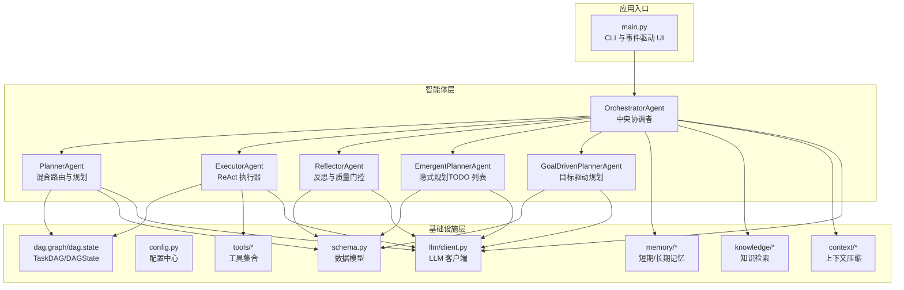
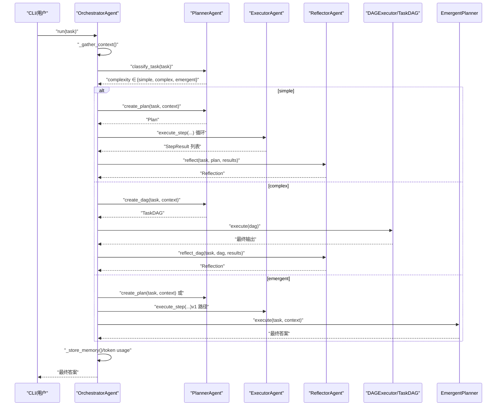
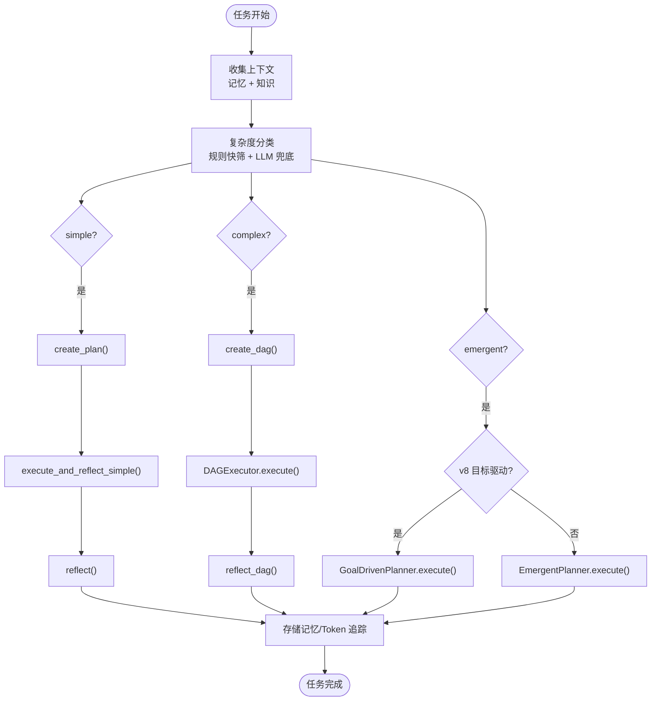
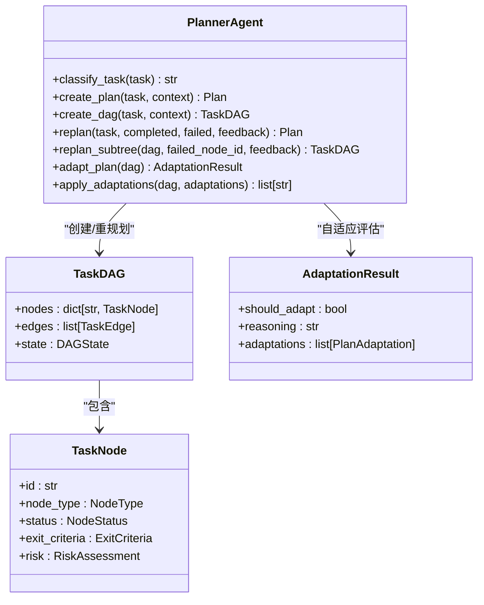
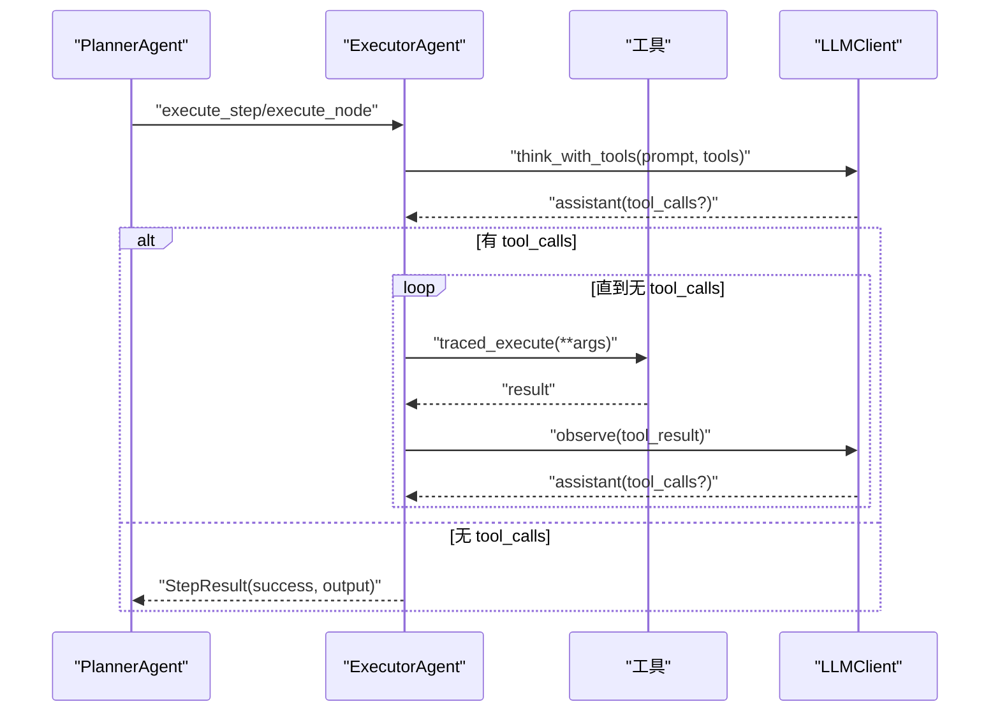
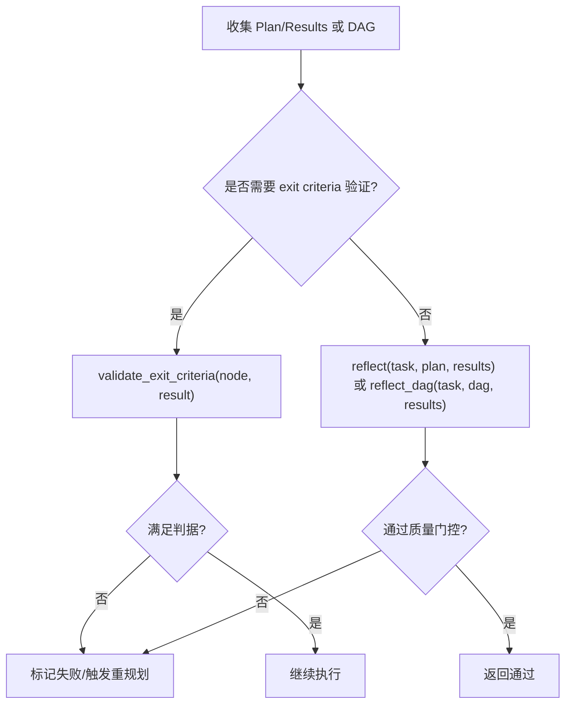
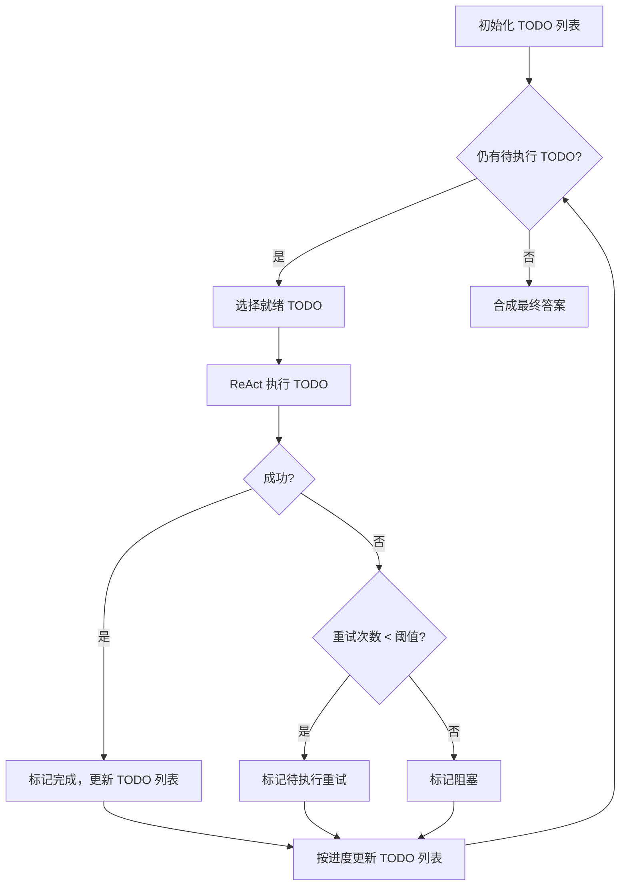
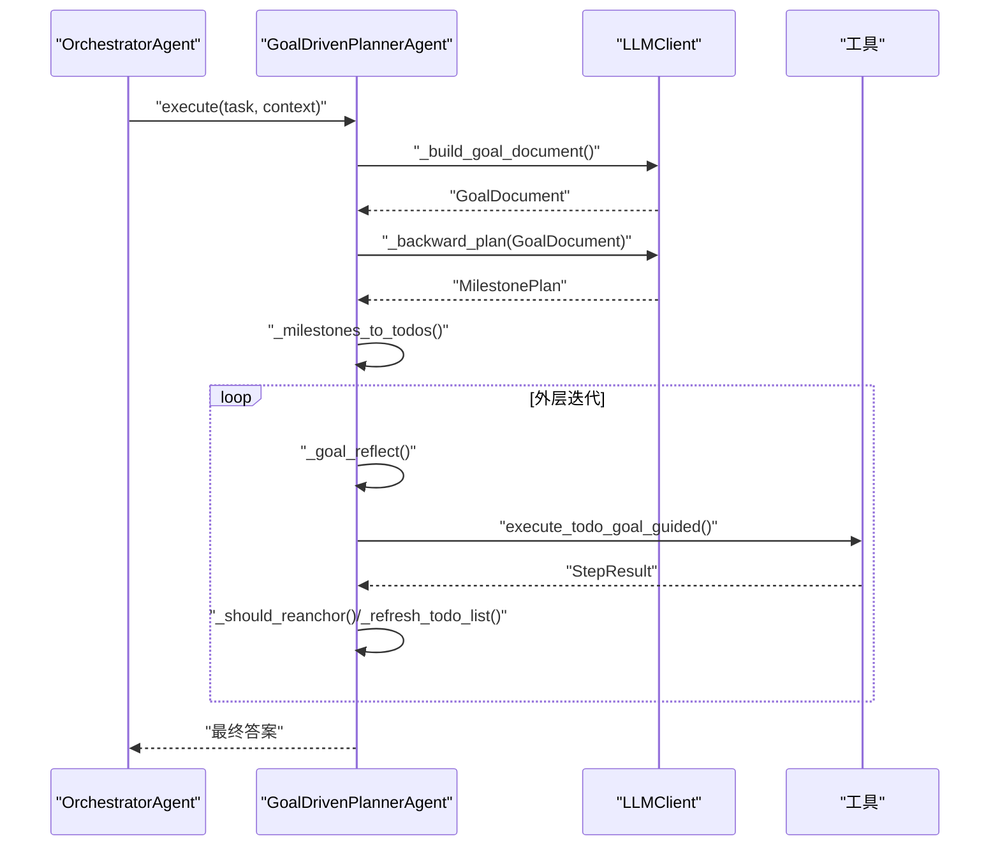
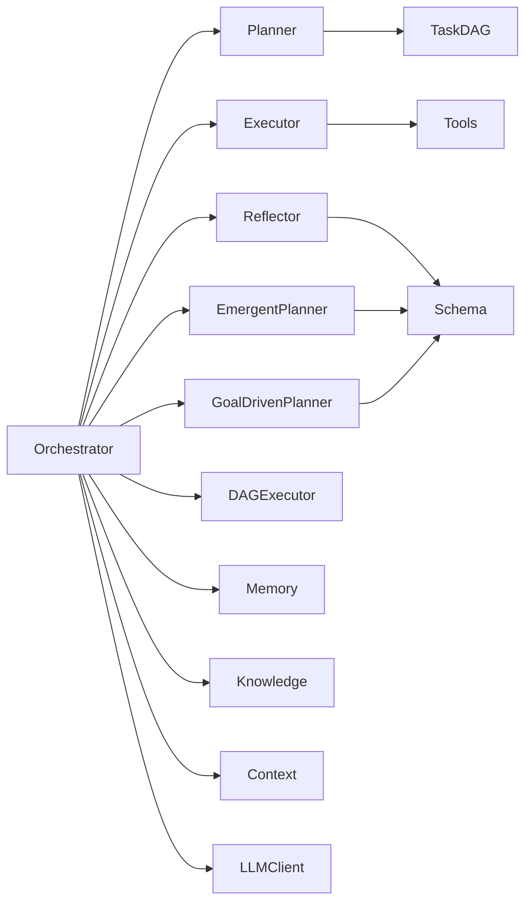

# 多智能体系统原理

<cite>
**本文引用的文件**
- [agents/orchestrator.py](file://agents/orchestrator.py)
- [agents/planner.py](file://agents/planner.py)
- [agents/executor.py](file://agents/executor.py)
- [agents/reflector.py](file://agents/reflector.py)
- [agents/base.py](file://agents/base.py)
- [agents/emergent_planner.py](file://agents/emergent_planner.py)
- [agents/goal_driven_planner.py](file://agents/goal_driven_planner.py)
- [schema.py](file://schema.py)
- [config.py](file://config.py)
- [main.py](file://main.py)
</cite>

## 目录
1. [简介](#简介)
2. [项目结构](#项目结构)
3. [核心组件](#核心组件)
4. [架构总览](#架构总览)
5. [详细组件分析](#详细组件分析)
6. [依赖关系分析](#依赖关系分析)
7. [性能考量](#性能考量)
8. [故障排查指南](#故障排查指南)
9. [结论](#结论)
10. [附录](#附录)

## 简介
本文件面向“多智能体系统原理”，围绕 manus_demo 的 OrchestratorAgent（中央协调者）及其子智能体（PlannerAgent、ExecutorAgent、ReflectorAgent、EmergentPlannerAgent、GoalDrivenPlannerAgent）的架构设计与实现进行系统化解读。重点涵盖：
- 任务复杂度分类与混合路由策略（simple/complex/emergent）
- 中央协调者 OrchestratorAgent 的生命周期管理与状态转换
- 专用智能体的职责边界与协作模式
- 事件驱动的通信机制与 UI 渲染
- DAG 执行、自适应规划与反思闭环
- 扩展与定制的最佳实践

## 项目结构
manus_demo 采用“按职责分层”的模块化组织方式：
- agents：多智能体核心（Orchestrator、Planner、Executor、Reflector、EmergentPlanner、GoalDrivenPlanner）
- dag：DAG 规划与执行（TaskDAG、DAGState、DAGExecutor）
- tools：工具集合（web_search、code_executor、file_ops、shell_tool、router）
- memory、knowledge、context、llm：基础设施层
- schema：统一数据模型（Plan、TaskDAG、TodoList、TokenUsage 等）
- config：统一配置中心
- main：交互式 CLI 入口与事件驱动 UI

图表来源
- [main.py:415-493](file://main.py#L415-L493)
- [agents/orchestrator.py:94-152](file://agents/orchestrator.py#L94-L152)
- [agents/planner.py:147-206](file://agents/planner.py#L147-L206)
- [agents/executor.py:66-125](file://agents/executor.py#L66-L125)
- [agents/reflector.py:59-83](file://agents/reflector.py#L59-L83)
- [agents/emergent_planner.py:72-128](file://agents/emergent_planner.py#L72-L128)
- [agents/goal_driven_planner.py:206-247](file://agents/goal_driven_planner.py#L206-L247)
- [schema.py:35-702](file://schema.py#L35-L702)
- [config.py:1-109](file://config.py#L1-L109)

章节来源
- [main.py:415-493](file://main.py#L415-L493)
- [config.py:1-109](file://config.py#L1-L109)

## 核心组件
- OrchestratorAgent（中央协调者）
  - 职责：收集上下文、复杂度分类、路由到 v1/v2/v5 路径、执行与反思、记忆存储、事件广播
  - 关键能力：两阶段分类器（规则快筛 + LLM 兜底）、多播事件桥接、Token 消耗追踪、可选 ReActEngine 集成
- PlannerAgent（规划器）
  - 职责：任务复杂度分类、生成 v1 扁平计划、构建 v2 DAG、局部重规划、自适应规划
  - 关键能力：规则启发式 + LLM 分类、DAG 解析与合并、子树重规划、计划自适应
- ExecutorAgent（执行器）
  - 职责：ReAct 循环执行步骤/节点、工具调用、失败重试与工具切换提示
  - 关键能力：统一 ReActEngine 抽象、工具路由、上下文压缩
- ReflectorAgent（反思器）
  - 职责：质量门控、逐节点完成判据验证、全 DAG 评估
  - 关键能力：exit criteria 验证、DAG 反思、JSON 结构化反馈
- EmergentPlannerAgent（隐式规划器）
  - 职责：TODO 列表驱动的“涌现式”规划与执行，无预设计划结构
  - 关键能力：while(tool_use) 主循环、TODO 生命周期管理、停滞检测
- GoalDrivenPlannerAgent（目标驱动规划器）
  - 职责：以终为始的逆向里程碑规划，持续目标锚定与反思
  - 关键能力：GoalDocument、MilestonePlan、目标反思与重锚定

章节来源
- [agents/orchestrator.py:60-152](file://agents/orchestrator.py#L60-L152)
- [agents/planner.py:147-206](file://agents/planner.py#L147-L206)
- [agents/executor.py:66-125](file://agents/executor.py#L66-L125)
- [agents/reflector.py:59-83](file://agents/reflector.py#L59-L83)
- [agents/emergent_planner.py:72-128](file://agents/emergent_planner.py#L72-L128)
- [agents/goal_driven_planner.py:206-247](file://agents/goal_driven_planner.py#L206-L247)

## 架构总览
manus_demo 的多智能体流水线采用“混合路由 + 事件驱动”的设计：
- 任务进入 OrchestratorAgent 后，先检索长期记忆与知识库，形成上下文
- PlannerAgent 通过两阶段分类器决定路由：simple（v1）、complex（v2 DAG）、emergent（v5 TODO 列表）
- 各路径分别由 ExecutorAgent 执行，ReflectorAgent 进行质量门控与反馈
- OrchestratorAgent 负责记忆存储、Token 追踪与 UI 事件广播
- DAG 路径支持自适应规划、条件边、回滚与子树重规划

图表来源
- [agents/orchestrator.py:158-222](file://agents/orchestrator.py#L158-L222)
- [agents/planner.py:369-506](file://agents/planner.py#L369-L506)
- [agents/executor.py:171-188](file://agents/executor.py#L171-L188)
- [agents/reflector.py:202-254](file://agents/reflector.py#L202-L254)
- [agents/emergent_planner.py:134-276](file://agents/emergent_planner.py#L134-L276)

## 详细组件分析

### OrchestratorAgent（中央协调者）
- 生命周期与状态转换
  - 任务开始：task_start → 收集上下文 → 任务复杂度分类 → 路由执行 → 反思 → 记忆存储 → 任务完成
  - 复杂度分类：simple（v1）、complex（v2 DAG）、emergent（v5 TODO 列表）
  - 重规划：v1 逐步骤重规划；v2 局部子树重规划；v5 TODO 列表质量门控
- 事件驱动通信
  - 通过 _emit/on_event 广播阶段、计划、节点状态、反思、Token 使用等事件
  - 支持多播桥接（TracingBridge）与 UI 回调解耦
- 记忆与追踪
  - 长期记忆存储任务摘要与学习点
  - TokenUsageSummary 汇总各引擎与全局消耗
- 可选特性
  - ReActEngine 集成（ENABLE_REACT_ENGINE_V2）
  - 目标驱动规划器（v8）开关（ENABLE_GOAL_DRIVEN_PLANNER）

图表来源
- [agents/orchestrator.py:158-222](file://agents/orchestrator.py#L158-L222)
- [agents/orchestrator.py:257-352](file://agents/orchestrator.py#L257-L352)
- [agents/orchestrator.py:439-508](file://agents/orchestrator.py#L439-L508)
- [agents/orchestrator.py:370-432](file://agents/orchestrator.py#L370-L432)

章节来源
- [agents/orchestrator.py:60-152](file://agents/orchestrator.py#L60-L152)
- [agents/orchestrator.py:158-222](file://agents/orchestrator.py#L158-L222)
- [agents/orchestrator.py:257-352](file://agents/orchestrator.py#L257-L352)
- [agents/orchestrator.py:439-508](file://agents/orchestrator.py#L439-L508)
- [agents/orchestrator.py:370-432](file://agents/orchestrator.py#L370-L432)

### PlannerAgent（混合路由与规划）
- 两阶段复杂度分类
  - Stage 1：规则启发式（长度、多步词、条件词、并行词、动作动词、探索/不确定性词）
  - Stage 2：轻量 LLM（~60 tokens，temperature=0.0）兜底
- v1 扁平计划
  - 生成 2-6 步，支持依赖与重规划
- v2 DAG 规划
  - 三层结构（Goal/SubGoal/Action），支持条件边、回滚边、风险评估
  - 局部重规划：仅重建失败子树，保留已完成工作
- 自适应规划（v3）
  - 超步间评估已完成 ACTION 节点，动态增删改节点

图表来源
- [agents/planner.py:147-206](file://agents/planner.py#L147-L206)
- [agents/planner.py:213-259](file://agents/planner.py#L213-L259)
- [agents/planner.py:369-506](file://agents/planner.py#L369-L506)
- [agents/planner.py:513-566](file://agents/planner.py#L513-L566)
- [agents/planner.py:573-672](file://agents/planner.py#L573-L672)
- [schema.py:157-176](file://schema.py#L157-L176)
- [schema.py:255-296](file://schema.py#L255-L296)

章节来源
- [agents/planner.py:147-206](file://agents/planner.py#L147-L206)
- [agents/planner.py:213-259](file://agents/planner.py#L213-L259)
- [agents/planner.py:369-506](file://agents/planner.py#L369-L506)
- [agents/planner.py:513-566](file://agents/planner.py#L513-L566)
- [agents/planner.py:573-672](file://agents/planner.py#L573-L672)
- [schema.py:157-176](file://schema.py#L157-L176)
- [schema.py:255-296](file://schema.py#L255-L296)

### ExecutorAgent（ReAct 执行器）
- ReAct 循环
  - THINK → ACT（工具调用）→ OBSERVE（工具结果）→ REPEAT 或 DONE
- 统一 ReActEngine（可选）
  - v6.0 抽象出 ReActEngine，v1/v2 路径均可复用
- 工具路由与失败切换
  - ToolRouter 基于失败统计给出切换建议，提升鲁棒性
- 上下文管理
  - 与 ContextManager 配合，超长消息自动压缩

图表来源
- [agents/executor.py:171-188](file://agents/executor.py#L171-L188)
- [agents/executor.py:195-321](file://agents/executor.py#L195-L321)
- [agents/base.py:123-168](file://agents/base.py#L123-L168)

章节来源
- [agents/executor.py:66-125](file://agents/executor.py#L66-L125)
- [agents/executor.py:171-188](file://agents/executor.py#L171-L188)
- [agents/executor.py:195-321](file://agents/executor.py#L195-L321)
- [agents/base.py:123-168](file://agents/base.py#L123-L168)

### ReflectorAgent（反思与质量门控）
- v1 反思（旧版）
  - 对 Plan + StepResult 进行综合评估，输出通过/失败、评分与建议
- v2 反思（DAG）
  - 对 TaskDAG 执行结果进行全局评估，支持逐节点 exit criteria 验证
- 质量门控
  - 解析失败或验证失败时返回失败，触发重规划

图表来源
- [agents/reflector.py:90-128](file://agents/reflector.py#L90-L128)
- [agents/reflector.py:135-195](file://agents/reflector.py#L135-L195)
- [agents/reflector.py:202-254](file://agents/reflector.py#L202-L254)

章节来源
- [agents/reflector.py:59-83](file://agents/reflector.py#L59-L83)
- [agents/reflector.py:90-128](file://agents/reflector.py#L90-L128)
- [agents/reflector.py:135-195](file://agents/reflector.py#L135-L195)
- [agents/reflector.py:202-254](file://agents/reflector.py#L202-L254)

### EmergentPlannerAgent（隐式规划）
- 核心思想
  - 无预设计划，通过 TODO 列表在执行中“涌现”
  - while(tool_use) 主循环，扁平消息历史，LLM 自组织
- TODO 生命周期
  - 初始化 → 执行 → 成功/失败（重试/阻塞）→ 动态更新（新增/修改/阻塞）
- 停滞检测与超时保护
  - 连续多轮无进展提前退出，节点执行超时保护

图表来源
- [agents/emergent_planner.py:134-276](file://agents/emergent_planner.py#L134-L276)
- [agents/emergent_planner.py:465-581](file://agents/emergent_planner.py#L465-L581)
- [schema.py:395-568](file://schema.py#L395-L568)

章节来源
- [agents/emergent_planner.py:72-128](file://agents/emergent_planner.py#L72-L128)
- [agents/emergent_planner.py:134-276](file://agents/emergent_planner.py#L134-L276)
- [agents/emergent_planner.py:465-581](file://agents/emergent_planner.py#L465-L581)
- [schema.py:395-568](file://schema.py#L395-L568)

### GoalDrivenPlannerAgent（目标驱动规划）
- 以终为始
  - 先构建 GoalDocument（成功标准、目标状态、关键交付物、约束）
  - 逆向规划里程碑（MilestonePlan），转为 TodoList
- 目标反思与重锚定
  - 每 N 轮进行目标反思，比较当前状态与目标，必要时重锚定
  - 主动 TODO 刷新，避免被动失败才调整
- 有界上下文与目标注入
  - 每次执行使用受限消息窗口，注入 GoalDocument 与依赖结果

图表来源
- [agents/goal_driven_planner.py:253-381](file://agents/goal_driven_planner.py#L253-L381)
- [agents/goal_driven_planner.py:388-450](file://agents/goal_driven_planner.py#L388-L450)
- [agents/goal_driven_planner.py:533-700](file://agents/goal_driven_planner.py#L533-L700)

章节来源
- [agents/goal_driven_planner.py:206-247](file://agents/goal_driven_planner.py#L206-L247)
- [agents/goal_driven_planner.py:253-381](file://agents/goal_driven_planner.py#L253-L381)
- [agents/goal_driven_planner.py:388-450](file://agents/goal_driven_planner.py#L388-L450)
- [agents/goal_driven_planner.py:533-700](file://agents/goal_driven_planner.py#L533-L700)

## 依赖关系分析
- 组件耦合
  - OrchestratorAgent 作为编排中心，依赖 Planner、Executor、Reflector、EmergentPlanner、GoalDrivenPlanner、DAGExecutor、记忆/知识/上下文/LLM 客户端
  - Planner 与 DAG 模型强耦合，提供解析与合并能力
  - Executor 与工具集合、工具路由、上下文管理紧密耦合
  - Reflector 与 schema 的 StepResult/Reflection 强耦合
- 外部依赖
  - LLM 客户端（统一接口）、工具集合（web_search、code_executor、file_ops、shell_tool）
  - 配置中心（config.py）控制路由、执行上限、特性开关
- 循环依赖规避
  - 通过事件回调与数据模型解耦，避免直接循环引用

图表来源
- [agents/orchestrator.py:115-152](file://agents/orchestrator.py#L115-L152)
- [agents/planner.py:481-506](file://agents/planner.py#L481-L506)
- [agents/executor.py:107-125](file://agents/executor.py#L107-L125)
- [agents/reflector.py:28-33](file://agents/reflector.py#L28-L33)
- [agents/emergent_planner.py:107-128](file://agents/emergent_planner.py#L107-L128)
- [agents/goal_driven_planner.py:234-247](file://agents/goal_driven_planner.py#L234-L247)
- [schema.py:35-702](file://schema.py#L35-L702)
- [config.py:1-109](file://config.py#L1-L109)

章节来源
- [agents/orchestrator.py:115-152](file://agents/orchestrator.py#L115-L152)
- [agents/planner.py:481-506](file://agents/planner.py#L481-L506)
- [agents/executor.py:107-125](file://agents/executor.py#L107-L125)
- [agents/reflector.py:28-33](file://agents/reflector.py#L28-L33)
- [agents/emergent_planner.py:107-128](file://agents/emergent_planner.py#L107-L128)
- [agents/goal_driven_planner.py:234-247](file://agents/goal_driven_planner.py#L234-L247)
- [schema.py:35-702](file://schema.py#L35-L702)
- [config.py:1-109](file://config.py#L1-L109)

## 性能考量
- Token 消耗控制
  - 两阶段分类器显著降低 LLM 调用频率（规则快筛 + LLM 兜底）
  - ContextManager 自动压缩消息历史，避免超长上下文
  - TokenUsageSummary 汇总各引擎与全局消耗，便于成本控制
- 执行效率
  - DAG 并行 Super-step 执行，最大化资源利用率
  - 自适应规划减少无效工作，局部重规划保留已完成成果
  - 统一 ReActEngine 减少重复实现，提升一致性与可维护性
- 可靠性
  - 工具路由失败切换提示、节点执行超时保护、停滞检测
  - 目标驱动规划的重锚定与反思，防止长期任务目标漂移

## 故障排查指南
- 任务分类异常
  - 检查 PLAN_MODE 强制覆盖与 EMERGENT_PLANNING_ENABLED 开关
  - 观察规则分类阈值与 LLM 分类兜底逻辑
- 执行失败
  - 查看 StepResult/tool_calls_log，定位工具调用与返回
  - 检查 ToolRouter 的失败统计与切换建议
- DAG 执行卡住
  - 关注条件边评估、节点状态机转换、回滚边触发
  - 检查子树重规划是否正确合并
- 反思解析失败
  - 检查 Reflector 的 JSON 输出格式与温度设置
  - 观察通过/失败判定与建议列表
- UI 事件异常
  - 检查 on_event 回调与多播桥接（TracingBridge）日志
  - 确认事件类型与数据结构一致

章节来源
- [agents/orchestrator.py:570-599](file://agents/orchestrator.py#L570-L599)
- [agents/planner.py:573-672](file://agents/planner.py#L573-L672)
- [agents/executor.py:238-321](file://agents/executor.py#L238-L321)
- [agents/reflector.py:172-195](file://agents/reflector.py#L172-L195)
- [agents/reflector.py:232-254](file://agents/reflector.py#L232-L254)

## 结论
manus_demo 的多智能体系统以 OrchestratorAgent 为核心，通过两阶段复杂度分类与混合路由策略，实现了从简单到复杂的渐进式规划与执行。Planner/Executor/Reflector 形成稳定的“规划-执行-反思”闭环，EmergentPlanner 与 GoalDrivenPlanner 则提供了探索性与目标导向的补充路径。事件驱动的 UI 与统一的数据模型、工具与 LLM 客户端抽象，共同构成了高内聚、低耦合、可扩展的多智能体架构。

## 附录

### 混合路由策略选择逻辑与适用场景
- simple（v1 扁平计划）
  - 适用：单一步骤、线性流程、无需并行/条件逻辑
  - 优势：轻量、快速、成本低
- complex（v2 DAG 分层计划）
  - 适用：多阶段、多子目标、并行与条件分支、风险可控
  - 优势：结构清晰、可并行、可回滚、可自适应
- emergent（v5 TODO 列表）
  - 适用：探索性、开放式、不确定性高、需要动态涌现
  - 优势：无需预设计划、LLM 自组织、灵活应对变化
- 目标驱动（v8）
  - 适用：长流程、目标易漂移、需要持续锚定
  - 优势：以终为始、定期反思与重锚定、主动 TODO 刷新

章节来源
- [agents/orchestrator.py:194-212](file://agents/orchestrator.py#L194-L212)
- [agents/planner.py:213-259](file://agents/planner.py#L213-L259)
- [agents/goal_driven_planner.py:253-381](file://agents/goal_driven_planner.py#L253-L381)

### 智能体生命周期与状态转换（代码路径示例）
- OrchestratorAgent.run
  - [agents/orchestrator.py:158-222](file://agents/orchestrator.py#L158-L222)
- _execute_and_reflect_simple
  - [agents/orchestrator.py:257-352](file://agents/orchestrator.py#L257-L352)
- _execute_dag_and_reflect
  - [agents/orchestrator.py:439-508](file://agents/orchestrator.py#L439-L508)
- _execute_emergent
  - [agents/orchestrator.py:370-432](file://agents/orchestrator.py#L370-L432)

### 数据模型与关键结构（代码路径示例）
- Plan/Step/StepStatus
  - [schema.py:47-67](file://schema.py#L47-L67)
- TaskDAG/TaskNode/TaskEdge/DAGState
  - [schema.py:157-253](file://schema.py#L157-L253)
- Reflection/StepResult/ToolCallRecord
  - [schema.py:368-361](file://schema.py#L368-L361)
- TodoList/TodoItem/TodoStatus
  - [schema.py:395-568](file://schema.py#L395-L568)
- GoalDocument/GoalReflection/MilestonePlan
  - [schema.py:596-655](file://schema.py#L596-L655)

### 配置与特性开关（代码路径示例）
- config.py
  - [config.py:1-109](file://config.py#L1-L109)
- main.py 事件 UI
  - [main.py:184-390](file://main.py#L184-L390)