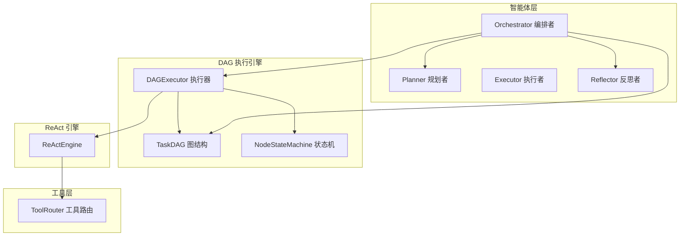
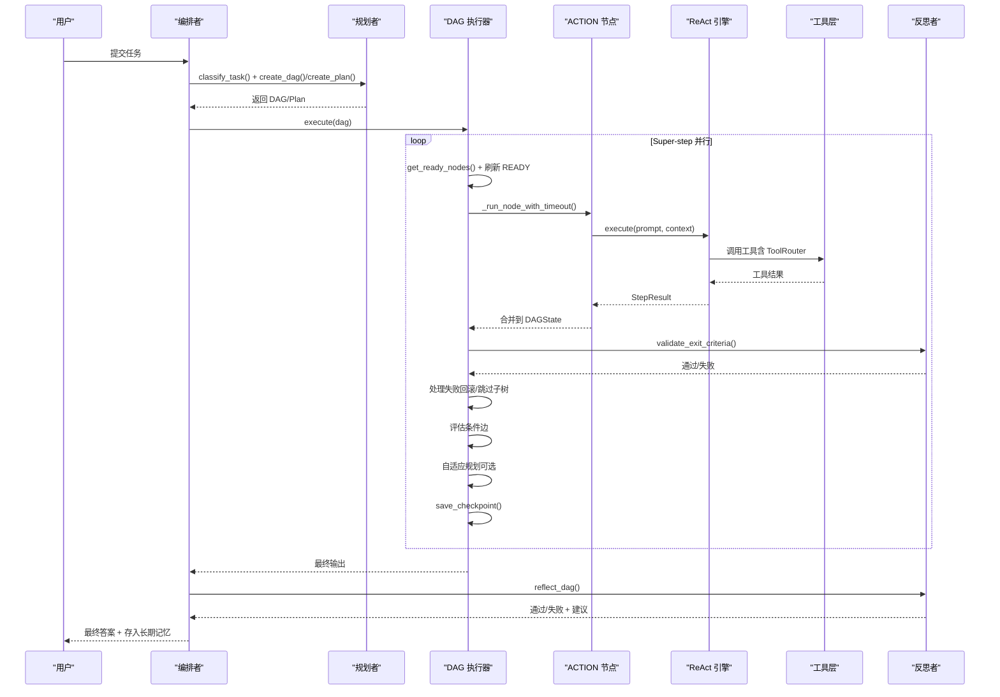
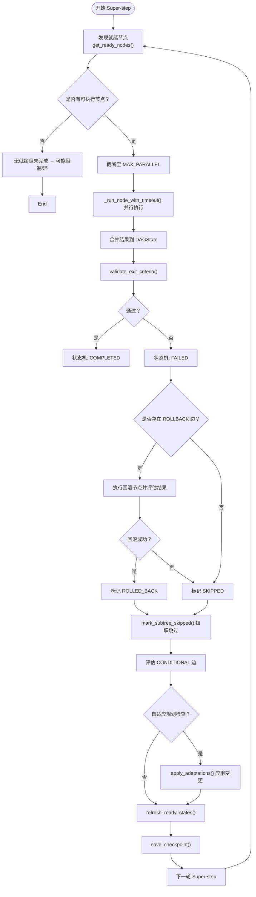
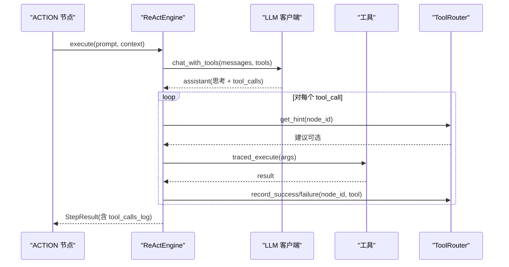
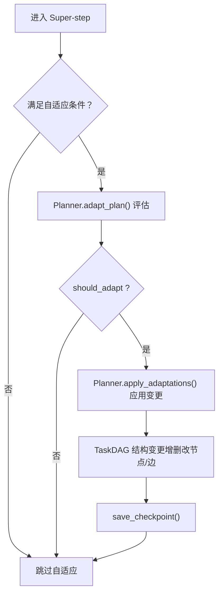
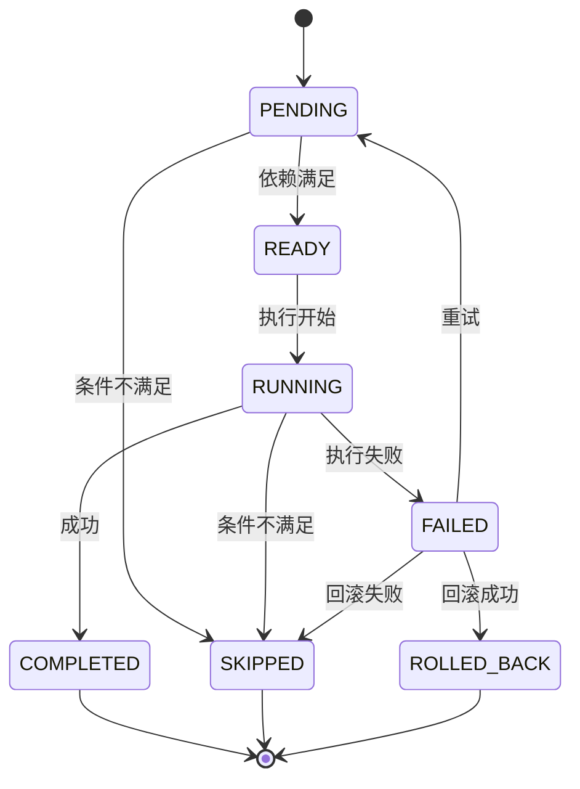
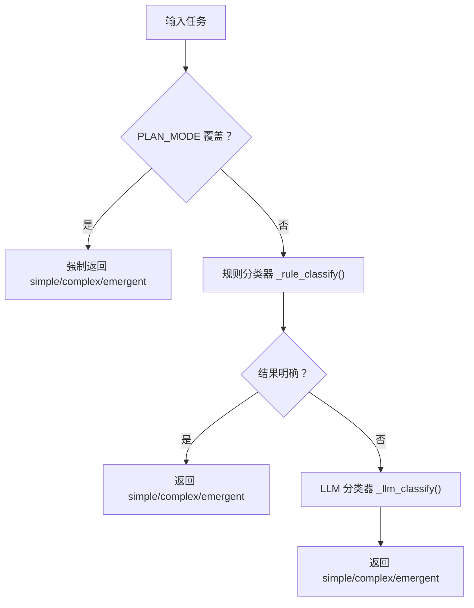
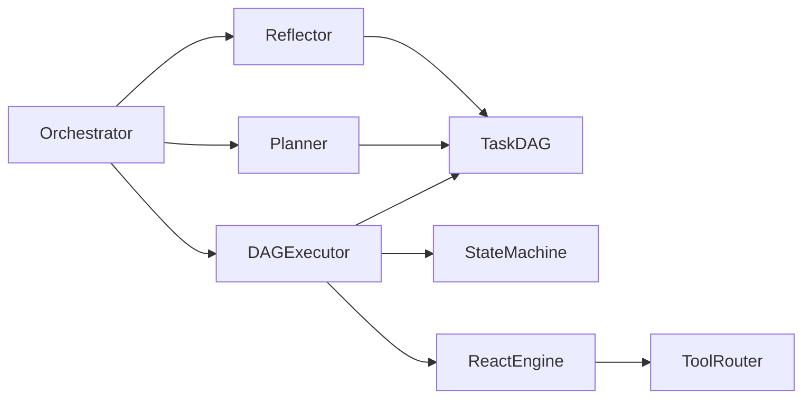

# 核心概念

<cite>
**本文引用的文件**
- [README_CN.md](file://README_CN.md)
- [schema.py](file://schema.py)
- [dag/graph.py](file://dag/graph.py)
- [dag/state_machine.py](file://dag/state_machine.py)
- [dag/executor.py](file://dag/executor.py)
- [react/engine.py](file://react/engine.py)
- [agents/orchestrator.py](file://agents/orchestrator.py)
- [agents/planner.py](file://agents/planner.py)
- [agents/reflector.py](file://agents/reflector.py)
- [tools/router.py](file://tools/router.py)
- [config.py](file://config.py)
- [tests/test_dag_capabilities.py](file://tests/test_dag_capabilities.py)
</cite>

## 目录
1. [简介](#简介)
2. [项目结构](#项目结构)
3. [核心组件](#核心组件)
4. [架构总览](#架构总览)
5. [详细组件分析](#详细组件分析)
6. [依赖分析](#依赖分析)
7. [性能考量](#性能考量)
8. [故障排查指南](#故障排查指南)
9. [结论](#结论)
10. [附录](#附录)

## 简介
本文件面向“manus_demo”多智能体系统，聚焦以下核心概念与机制：
- DAG（有向无环图）执行模型：节点状态管理、拓扑排序、并行执行与条件/回滚分支。
- ReAct 循环：思考（Thought）→ 工具调用（Action）→ 观察（Observe）的迭代闭环。
- 自适应规划：在执行过程中基于中间结果动态调整计划（增删改节点/边）。
- 状态机驱动执行：节点生命周期严格受控，非法状态转移即时报错。
- 混合规划路由：v4 两阶段分类器自动选择 v1 扁平计划或 v2 DAG 路径。

上述机制共同构成“以任务为中心”的分层规划、DAG 并行执行与持续演化的智能体系统。

## 项目结构
manus_demo 采用“分层模块 + 任务图驱动”的组织方式：
- agents：智能体层（编排者、规划者、执行者、反思者、新兴规划者等）
- dag：DAG 执行引擎（TaskDAG、状态机、执行器）
- react：统一 ReAct 执行引擎
- tools：工具层（网络搜索、代码执行、文件操作、工具路由）
- memory/context/knowledge/llm：支撑模块（记忆、上下文压缩、知识检索、LLM 客户端）
- config/schema：配置与数据模型
- tests：覆盖 DAG 能力、并行执行、条件/回滚、动态变更、工具路由、自适应规划集成等

图表来源
- [agents/orchestrator.py:60-92](file://agents/orchestrator.py#L60-L92)
- [dag/graph.py:43-81](file://dag/graph.py#L43-L81)
- [dag/state_machine.py:55-114](file://dag/state_machine.py#L55-L114)
- [dag/executor.py:62-104](file://dag/executor.py#L62-L104)
- [react/engine.py:43-90](file://react/engine.py#L43-L90)
- [tools/router.py:47-100](file://tools/router.py#L47-L100)

章节来源
- [README_CN.md:122-174](file://README_CN.md#L122-L174)

## 核心组件
- 数据模型与状态
  - TaskNode/TaskEdge/DAGState：定义节点类型、状态、边类型、集中式状态与上下文拼接。
  - NodeStatus/EdgeType/ExitCriteria/RiskAssessment：节点生命周期、边类型、完成判据与风险评估。
- DAG 执行
  - TaskDAG：维护节点、边、集中式状态与快照；提供拓扑排序、就绪节点发现、条件分支跳过、回滚目标定位、动态增删改节点/边。
  - NodeStateMachine：严格的状态转移表，非法转移抛异常，保障一致性。
  - DAGExecutor：Super-step 并行执行、逐节点 exit criteria 验证、失败处理（回滚/跳过子树）、条件边评估、自适应规划、Checkpoint 快照。
- ReAct 引擎
  - ReActEngine：统一 ReAct 循环，集成 ToolRouter，可配置迭代上限、工具调用记录、错误恢复。
- 规划与反思
  - Planner：v4 混合路由（规则快筛 + LLM 兜底）；v2 DAG 规划；v3 自适应规划评估与应用；局部重规划（失败子树）。
  - Reflector：逐节点 exit criteria 验证；DAG 全局质量评估与反馈。
- 工具与路由
  - ToolRouter：按节点统计工具连续失败次数，超过阈值建议替代工具，避免死循环。

章节来源
- [schema.py:77-176](file://schema.py#L77-L176)
- [schema.py:192-253](file://schema.py#L192-L253)
- [schema.py:256-296](file://schema.py#L256-L296)
- [dag/graph.py:43-81](file://dag/graph.py#L43-L81)
- [dag/state_machine.py:38-114](file://dag/state_machine.py#L38-L114)
- [dag/executor.py:62-104](file://dag/executor.py#L62-L104)
- [react/engine.py:43-90](file://react/engine.py#L43-L90)
- [agents/planner.py:147-206](file://agents/planner.py#L147-L206)
- [agents/reflector.py:59-83](file://agents/reflector.py#L59-L83)
- [tools/router.py:47-100](file://tools/router.py#L47-L100)

## 架构总览
系统以“编排者-规划者-DAG 执行器-反思者”为主干，结合 ReAct 引擎与工具路由，形成闭环：
- 编排者负责上下文收集、任务复杂度分类、路由到 v1/v2/v5 路径、重规划与记忆存储。
- 规划者生成分层 DAG 或扁平计划，支持自适应规划与局部重规划。
- DAG 执行器以 Super-step 并行执行 ACTION 节点，逐节点验证完成判据，失败时执行回滚与级联跳过，评估条件边，必要时动态调整计划。
- 反思者在节点与全局层面进行质量评估，决定是否需要重规划。
- ReAct 引擎在每个 ACTION 节点内部执行“思考→工具调用→观察”，ToolRouter 提供失败后的替代建议。

图表来源
- [agents/orchestrator.py:158-222](file://agents/orchestrator.py#L158-L222)
- [agents/planner.py:481-506](file://agents/planner.py#L481-L506)
- [dag/executor.py:110-264](file://dag/executor.py#L110-L264)
- [react/engine.py:84-241](file://react/engine.py#L84-L241)
- [agents/reflector.py:135-195](file://agents/reflector.py#L135-L195)

章节来源
- [README_CN.md:37-98](file://README_CN.md#L37-L98)

## 详细组件分析

### DAG 执行模型与状态机
- 节点状态管理
  - NodeStatus：PENDING → READY → RUNNING → COMPLETED/FAILED/ROLLED_BACK/SKIPPED。
  - NodeStateMachine 提供 transition() 校验与应用，非法转移抛出异常，确保状态机安全。
- 拓扑排序与就绪节点
  - TaskDAG.topological_sort() 基于 DEPENDENCY 边的邻接表实现 O(V+E)，保证父先子后。
  - get_ready_nodes() 在运行时扫描依赖完成情况，动态发现可并行节点。
- 并行执行与收敛
  - DAGExecutor.execute() 每轮选出 READY/PENDING 且依赖完成的 ACTION 节点，最多 MAX_PARALLEL 个并发执行。
  - 结果写入 DAGState.node_results（集中式状态，天然无锁冲突）。
- 条件分支与失败回滚
  - 条件边 CONDITIONAL：在源节点完成后评估关键词，不满足则跳过目标节点及其子树。
  - 回滚边 ROLLBACK：节点失败时执行回滚节点，成功则标记 ROLLED_BACK，否则 SKIPPED。
- 动态图变更（v3）
  - 支持运行时 add/remove/modify 节点，add/remove/modify 边，自动环检测与回滚。
- Checkpoint 快照
  - 每轮结束保存 DAG 结构与状态快照，支持事后调试与恢复。

图表来源
- [dag/executor.py:110-264](file://dag/executor.py#L110-L264)
- [dag/graph.py:101-126](file://dag/graph.py#L101-L126)
- [dag/graph.py:184-198](file://dag/graph.py#L184-L198)
- [dag/state_machine.py:88-103](file://dag/state_machine.py#L88-L103)

章节来源
- [dag/state_machine.py:38-114](file://dag/state_machine.py#L38-L114)
- [dag/graph.py:101-126](file://dag/graph.py#L101-L126)
- [dag/graph.py:219-249](file://dag/graph.py#L219-L249)
- [dag/graph.py:341-494](file://dag/graph.py#L341-L494)
- [dag/executor.py:110-264](file://dag/executor.py#L110-L264)

### ReAct 循环机制
- ReActEngine.execute() 统一 ReAct 循环：
  - 构造 messages，调用 LLM 的 function-calling 接口，得到思考与工具调用指令。
  - 遍历工具调用，执行工具（支持 traced_execute），记录 ToolCallRecord。
  - 将工具结果以“tool”角色消息注入，继续下一轮思考，直至无工具调用或达到最大迭代。
- ToolRouter 集成：
  - 记录每个节点的工具调用统计（成功/失败/连续失败），超过阈值自动注入替代建议。
- 适用范围：每个 ACTION 节点内部的 ReAct 循环，由 DAGExecutor._run_node/_run_node_with_timeout 调用。

图表来源
- [react/engine.py:84-241](file://react/engine.py#L84-L241)
- [tools/router.py:123-147](file://tools/router.py#L123-L147)

章节来源
- [react/engine.py:43-241](file://react/engine.py#L43-L241)
- [tools/router.py:47-168](file://tools/router.py#L47-L168)

### 自适应规划（v3）
- 触发条件：每隔 ADAPT_PLAN_INTERVAL 个 Super-step，且已完成 ACTION 节点数 ≥ ADAPT_PLAN_MIN_COMPLETED，且仍有待执行节点。
- 评估：Planner.adapt_plan() 基于已完成 ACTION 的结果与待执行节点描述，判断是否需要 KEEP/MODIFY/REMOVE/ADD。
- 应用：DAGExecutor._adapt_plan() 调用 Planner.apply_adaptations()，对 DAG 执行动态增删改节点与边。
- 价值：在执行过程中持续演进计划，避免一次性规划带来的刚性缺陷。

图表来源
- [dag/executor.py:578-632](file://dag/executor.py#L578-L632)
- [agents/planner.py:573-722](file://agents/planner.py#L573-L722)
- [dag/graph.py:341-494](file://dag/graph.py#L341-L494)

章节来源
- [dag/executor.py:235-237](file://dag/executor.py#L235-L237)
- [agents/planner.py:573-722](file://agents/planner.py#L573-L722)
- [config.py:46-51](file://config.py#L46-L51)

### 状态机驱动执行（节点生命周期）
- 转移表（合法状态迁移）：PENDING → READY → RUNNING → COMPLETED；或 FAILED → ROLLED_BACK/SKIPPED/PENDING（重试）。
- 终态约束：COMPLETED/SKIPPED/ROLLED_BACK 不再允许转移，确保收敛。
- 事件回调：状态机在转移时触发 on_transition，DAGExecutor 将其转发为 UI 事件，便于观测。

图表来源
- [dag/state_machine.py:42-52](file://dag/state_machine.py#L42-L52)
- [dag/state_machine.py:88-103](file://dag/state_machine.py#L88-L103)

章节来源
- [dag/state_machine.py:38-114](file://dag/state_machine.py#L38-L114)

### 混合规划路由（v4）
- 两阶段分类：
  - Stage 1（规则快筛）：基于关键词与长度等启发式，快速判定 simple/complex/emergent/ambiguous。
  - Stage 2（LLM 兜底）：对 ambiguous 场景进行轻量 JSON 分类，避免 token 消耗。
- 路由策略：根据分类结果选择 v1 扁平计划或 v2 DAG；v5 隐式规划在开关开启时参与路由。

图表来源
- [agents/planner.py:213-259](file://agents/planner.py#L213-L259)

章节来源
- [agents/planner.py:147-206](file://agents/planner.py#L147-L206)
- [agents/planner.py:213-259](file://agents/planner.py#L213-L259)

## 依赖分析
- 组件耦合
  - DAGExecutor 依赖 TaskDAG（节点/边/状态）、NodeStateMachine（状态转移）、ReActEngine（节点执行）、Reflector（完成判据验证）。
  - Planner 依赖 LLMClient 生成 DAG/计划，与 DAGExecutor 协作实现局部重规划与自适应规划。
  - Orchestrator 串联 Planner/DAGExecutor/Reflector，负责路由与重规划。
  - ToolRouter 与 ReActEngine 集成，提供失败后的工具切换建议。
- 外部依赖
  - LLM 客户端（OpenAI 兼容接口）
  - 工具（网络搜索、代码执行、文件操作）

图表来源
- [agents/orchestrator.py:116-128](file://agents/orchestrator.py#L116-L128)
- [dag/executor.py:87-104](file://dag/executor.py#L87-L104)
- [react/engine.py:64-83](file://react/engine.py#L64-L83)
- [tools/router.py:65-73](file://tools/router.py#L65-L73)

章节来源
- [agents/orchestrator.py:60-151](file://agents/orchestrator.py#L60-L151)
- [dag/executor.py:62-104](file://dag/executor.py#L62-L104)

## 性能考量
- 并行度控制：MAX_PARALLEL_NODES 控制每轮并发节点数，避免资源争用。
- 执行超时：NODE_EXECUTION_TIMEOUT 防止单节点卡死拖垮批次。
- 状态写入：DAGState.node_results 以节点 ID 为键的字典写入，天然无锁冲突。
- 拓扑与邻接表：TaskDAG 预构建 DEPENDENCY 边邻接表，拓扑排序与就绪节点发现均为 O(V+E)。
- 自适应规划频率：ADAPT_PLAN_INTERVAL 与 ADAPT_PLAN_MIN_COMPLETED 控制自适应触发频率，避免过度评估。
- 工具失败阈值：TOOL_FAILURE_THRESHOLD 防止反复尝试同一失败工具，降低无效重试。

章节来源
- [config.py:44-59](file://config.py#L44-L59)
- [dag/graph.py:82-95](file://dag/graph.py#L82-L95)
- [dag/executor.py:161-182](file://dag/executor.py#L161-L182)
- [react/engine.py:118-140](file://react/engine.py#L118-L140)
- [tools/router.py:65-73](file://tools/router.py#L65-L73)

## 故障排查指南
- DAG 无法推进
  - 检查 get_ready_nodes() 是否返回空：可能因依赖未完成、环或阻塞。
  - 使用 get_blockage_report() 获取阻塞节点清单与依赖关系。
  - try_recover_blocked_nodes() 尝试将被阻塞的 PENDING 节点恢复为 READY。
- 节点状态异常
  - NodeStateMachine 抛出 InvalidTransitionError 表示非法状态转移，需检查状态机调用顺序与前置条件。
- 条件分支未生效
  - 检查 CONDITIONAL 边的 condition 关键词匹配策略（CJK 子串 vs 拉丁词边界）。
- 回滚未生效
  - 确认 ROLLBACK 边是否存在，回滚节点是否成功执行；失败时节点标记为 SKIPPED。
- 自适应规划未触发
  - 检查 ADAPTIVE_PLANNING_ENABLED、ADAPT_PLAN_INTERVAL、ADAPT_PLAN_MIN_COMPLETED 与待执行节点数量。
- 工具频繁失败
  - ToolRouter 连续失败超过阈值会注入替代建议；可在 get_node_summary() 查看统计。

章节来源
- [dag/graph.py:277-334](file://dag/graph.py#L277-L334)
- [dag/state_machine.py:30-36](file://dag/state_machine.py#L30-L36)
- [dag/executor.py:405-473](file://dag/executor.py#L405-L473)
- [agents/planner.py:578-599](file://agents/planner.py#L578-L599)
- [tools/router.py:107-167](file://tools/router.py#L107-L167)

## 结论
manus_demo 通过 DAG 任务图与状态机驱动的执行模型，实现了：
- 可并行、可收敛、可演进的多智能体系统；
- 以 ReAct 为核心的工具调用闭环；
- 基于中间结果的自适应规划；
- 严格的节点生命周期与失败处理机制。

这些设计使系统在复杂任务中具备更强的鲁棒性与可扩展性。

## 附录
- 使用场景示例（基于测试与 README）
  - 分层规划与并行执行：构建三层 DAG（Goal → SubGoal → Action），act_1_1 与 act_1_2 并行，act_2_1 依赖二者结果。
  - 条件分支与回滚：源节点结果不满足条件时跳过目标节点及其子树；失败时执行回滚节点并决定最终状态。
  - 动态图变更：运行时新增/删除/修改节点与边，自动环检测与回滚。
  - 工具路由：连续失败超过阈值自动建议替代工具，避免死循环。
  - 自适应规划：基于已完成节点结果评估待执行节点，必要时增删改计划。

章节来源
- [tests/test_dag_capabilities.py:46-126](file://tests/test_dag_capabilities.py#L46-L126)
- [README_CN.md:287-331](file://README_CN.md#L287-L331)