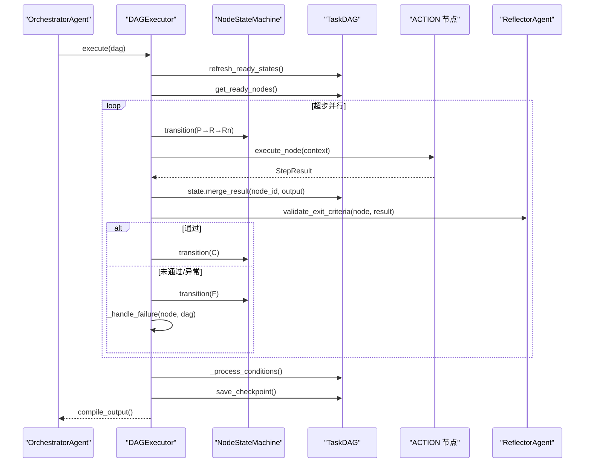
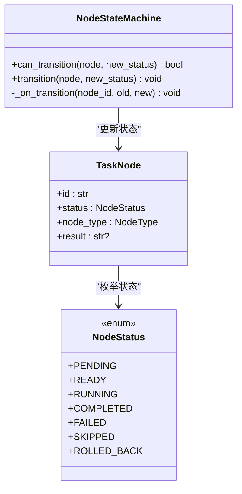
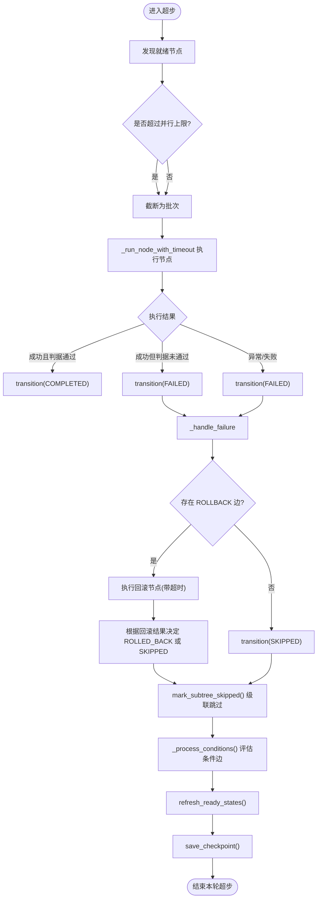
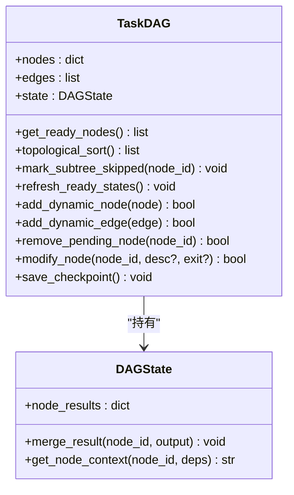
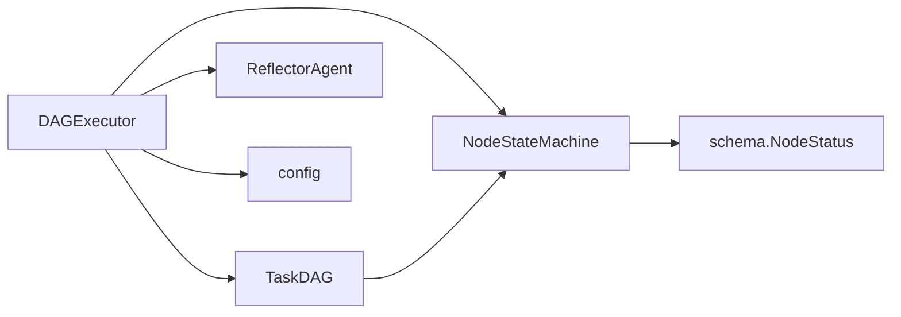

# 状态机驱动执行

<cite>
**本文引用的文件**
- [dag/state_machine.py](file://dag/state_machine.py)
- [dag/executor.py](file://dag/executor.py)
- [dag/graph.py](file://dag/graph.py)
- [schema.py](file://schema.py)
- [config.py](file://config.py)
- [tests/test_dag_capabilities.py](file://tests/test_dag_capabilities.py)
</cite>

## 目录
1. [简介](#简介)
2. [项目结构](#项目结构)
3. [核心组件](#核心组件)
4. [架构总览](#架构总览)
5. [详细组件分析](#详细组件分析)
6. [依赖关系分析](#依赖关系分析)
7. [性能考量](#性能考量)
8. [故障排查指南](#故障排查指南)
9. [结论](#结论)
10. [附录](#附录)

## 简介
本文件围绕“状态机驱动执行”主题，系统阐述状态机在任务执行中的核心作用，包括节点状态管理、状态转换规则与执行流程控制。文档覆盖状态类型（PENDING、READY、RUNNING、COMPLETED、FAILED、SKIPPED、ROLLED_BACK）、正常执行流程与异常处理机制、状态机与事件驱动架构的结合方式、扩展性与可维护性设计，以及调试与故障诊断技巧。文中所有实现细节均以仓库源码为依据，并通过图示与测试用例路径帮助读者快速定位与验证。

## 项目结构
本项目采用“分层+职责分离”的组织方式：
- schema.py 定义核心数据模型（节点、边、状态、执行结果等），为状态机与执行器提供统一的数据契约。
- dag/state_machine.py 提供状态机，严格约束节点状态的合法转换。
- dag/graph.py 提供 TaskDAG，承载节点、边、集中式状态与图算法（拓扑排序、就绪节点发现、条件边/回滚边处理等）。
- dag/executor.py 实现 DAG 执行引擎，以“超步（super-step）”模型并行调度节点，串联状态机、反射器与条件/回滚处理。
- config.py 提供执行相关的全局配置（并行度、超时、自适应规划等）。
- tests/test_dag_capabilities.py 提供大量端到端测试，覆盖状态机合法性、条件分支、失败回滚、动态图变更等场景。

```mermaid
graph TB
subgraph "状态与数据"
S["schema.py<br/>定义节点/边/状态/执行结果等模型"]
end
subgraph "状态机"
SM["dag/state_machine.py<br/>NodeStateMachine<br/>状态转换表与合法性校验"]
end
subgraph "图与执行"
G["dag/graph.py<br/>TaskDAG<br/>节点/边/集中式状态/图算法"]
EX["dag/executor.py<br/>DAGExecutor<br/>超步并行执行/条件/回滚/自适应规划"]
end
CFG["config.py<br/>执行配置"]
T["tests/test_dag_capabilities.py<br/>状态机/条件/回滚/动态图测试"]
S --> SM
S --> G
S --> EX
SM --> G
SM --> EX
G --> EX
CFG --> EX
T --> SM
T --> G
T --> EX
```

图表来源
- [dag/state_machine.py:1-114](file://dag/state_machine.py#L1-L114)
- [dag/graph.py:1-627](file://dag/graph.py#L1-L627)
- [dag/executor.py:1-648](file://dag/executor.py#L1-L648)
- [schema.py:87-106](file://schema.py#L87-L106)
- [config.py:42-60](file://config.py#L42-L60)
- [tests/test_dag_capabilities.py:1-1211](file://tests/test_dag_capabilities.py#L1-L1211)

章节来源
- [dag/state_machine.py:1-114](file://dag/state_machine.py#L1-L114)
- [dag/graph.py:1-627](file://dag/graph.py#L1-L627)
- [dag/executor.py:1-648](file://dag/executor.py#L1-L648)
- [schema.py:87-106](file://schema.py#L87-L106)
- [config.py:42-60](file://config.py#L42-L60)
- [tests/test_dag_capabilities.py:1-1211](file://tests/test_dag_capabilities.py#L1-L1211)

## 核心组件
- 状态机（NodeStateMachine）
  - 通过“状态转换表”约束节点状态的合法转移，非法转移抛出异常，防止 DAG 进入不一致状态。
  - 提供 transition()/can_transition() 方法，支持可选的 UI/日志回调（on_transition）。
- 执行器（DAGExecutor）
  - 以“超步（super-step）”模型并行执行就绪节点，合并结果到集中式状态，验证完成判据，处理失败（回滚/跳过子树），评估条件边，周期性保存检查点。
  - 注入统一状态机实例，确保 DAG 内部状态变更（刷新就绪、标记子树跳过等）也能触发 UI 事件。
- 图（TaskDAG）
  - 维护节点、边、集中式状态与检查点；提供就绪节点发现、拓扑排序、条件边/回滚边处理、动态图变更（新增/删除节点/边、修改节点）等能力。
- 数据模型（schema.NodeStatus/NodeStatus）
  - 定义节点生命周期状态与转换图，为状态机提供权威枚举与约束依据。
- 配置（config）
  - 控制并行度、节点执行超时、自适应规划开关与间隔、检查点上限等。

章节来源
- [dag/state_machine.py:55-114](file://dag/state_machine.py#L55-L114)
- [dag/executor.py:62-265](file://dag/executor.py#L62-L265)
- [dag/graph.py:43-270](file://dag/graph.py#L43-L270)
- [schema.py:87-106](file://schema.py#L87-L106)
- [config.py:42-60](file://config.py#L42-L60)

## 架构总览
状态机驱动执行的整体流程如下：
- DAGExecutor 在每个超步中发现就绪节点，调用 NodeStateMachine 将节点状态推进（PENDING→READY→RUNNING），并执行节点。
- 节点执行结果写入集中式状态，随后由反射器验证完成判据；成功则标记 COMPLETED，失败则进入失败处理流程。
- 失败处理：若存在回滚边，执行回滚节点；否则直接跳过；随后级联跳过下游子树。
- 条件边：在节点完成后评估条件，满足则保留下游节点，否则跳过并级联。
- 结构性节点（GOAL/SUBGOAL）在子节点终态后自动完成或跳过。
- 执行器周期性保存检查点，支持时间旅行调试与故障恢复。

图表来源
- [dag/executor.py:110-265](file://dag/executor.py#L110-L265)
- [dag/state_machine.py:88-114](file://dag/state_machine.py#L88-L114)
- [dag/graph.py:199-249](file://dag/graph.py#L199-L249)

章节来源
- [dag/executor.py:110-265](file://dag/executor.py#L110-L265)
- [dag/state_machine.py:88-114](file://dag/state_machine.py#L88-L114)
- [dag/graph.py:199-249](file://dag/graph.py#L199-L249)

## 详细组件分析

### 状态机（NodeStateMachine）
- 状态转换表（VALID_TRANSITIONS）
  - PENDING → {READY, SKIPPED}
  - READY → {RUNNING, SKIPPED}
  - RUNNING → {COMPLETED, FAILED, SKIPPED}
  - FAILED → {ROLLED_BACK, SKIPPED, PENDING}
  - 终态：COMPLETED、SKIPPED、ROLLED_BACK 不再允许进一步转移
- 核心方法
  - can_transition(node, new_status): 基于转换表判断合法性
  - transition(node, new_status): 非法则抛出 InvalidTransitionError；合法则更新节点状态并触发 on_transition 回调
- 事件驱动
  - on_transition 回调转发给 DAGExecutor 的 _on_node_transition，实现 UI 实时更新

图表来源
- [dag/state_machine.py:55-114](file://dag/state_machine.py#L55-L114)
- [schema.py:87-106](file://schema.py#L87-L106)

章节来源
- [dag/state_machine.py:38-114](file://dag/state_machine.py#L38-L114)
- [schema.py:87-106](file://schema.py#L87-L106)

### 执行器（DAGExecutor）
- 超步模型
  - 发现就绪节点（PENDING/READY 且依赖全部 COMPLETED），按 MAX_PARALLEL_NODES 限制并行度，使用 asyncio.gather 并行执行。
  - 将节点结果写入 DAGState，验证完成判据，处理失败（回滚/跳过子树），评估条件边，保存检查点。
- 失败处理
  - 若存在 ROLLBACK 边：执行回滚节点（带超时），根据回滚结果决定 FAILED→ROLLED_BACK 或 FAILED→SKIPPED，并级联跳过下游子树。
  - 若无回滚边：直接 FAILED→SKIPPED，并级联跳过下游子树。
- 条件边
  - 节点完成后评估 CONDITIONAL 边：若源节点结果包含条件关键词则保留目标节点，否则跳过并级联。
- 结构性节点
  - GOAL/SUBGOAL 在子节点终态后自动完成或跳过，遵循“至少一个子节点成功完成”则结构节点完成的规则。
- 事件与 UI
  - 通过 on_event 回调广播节点状态变化、条件评估、自适应规划等事件，支持 UI 实时更新。

图表来源
- [dag/executor.py:169-251](file://dag/executor.py#L169-L251)
- [dag/executor.py:350-400](file://dag/executor.py#L350-L400)
- [dag/executor.py:405-473](file://dag/executor.py#L405-L473)

章节来源
- [dag/executor.py:110-265](file://dag/executor.py#L110-L265)
- [dag/executor.py:350-400](file://dag/executor.py#L350-L400)
- [dag/executor.py:405-473](file://dag/executor.py#L405-L473)

### 图（TaskDAG）
- 就绪节点发现与拓扑排序
  - get_ready_nodes()：扫描所有节点，判断 PENDING/READY 且依赖全部 COMPLETED。
  - topological_sort()：Kahn 算法，仅考虑 DEPENDENCY 边，保证执行顺序合法。
- 条件边/回滚边/下游遍历
  - get_conditional_edges()/get_rollback_targets()/get_downstream() 提供图算法支持。
- 结构性节点自动完成
  - refresh_ready_states() 将满足依赖的 PENDING 提升为 READY；结构节点在子节点终态后自动完成或跳过。
- 动态图变更（v3）
  - add_dynamic_node()/add_dynamic_edge()/remove_pending_node()/modify_node() 支持运行时变更；变更后进行环检测与邻接表维护。
- 检查点
  - save_checkpoint() 保存当前 DAG 状态，支持内存中最多保留 MAX_CHECKPOINTS 个快照。

图表来源
- [dag/graph.py:101-270](file://dag/graph.py#L101-L270)
- [dag/graph.py:521-543](file://dag/graph.py#L521-L543)

章节来源
- [dag/graph.py:101-270](file://dag/graph.py#L101-L270)
- [dag/graph.py:521-543](file://dag/graph.py#L521-L543)

### 数据模型（NodeStatus/NodeStatus 转移图）
- 状态类型
  - PENDING：等待前置依赖完成
  - READY：依赖已满足，等待执行调度
  - RUNNING：正在执行中
  - COMPLETED：成功完成（终态）
  - FAILED：执行失败
  - SKIPPED：被跳过（终态，条件分支未满足或上游失败）
  - ROLLED_BACK：已回滚（终态，失败后执行了回滚）
- 转移图
  - 正常路径：PENDING→READY→RUNNING→COMPLETED
  - 失败路径：RUNNING→FAILED→{ROLLED_BACK, SKIPPED, PENDING（重试）}
  - 任意非终态可→SKIPPED（条件分支未满足或上游失败）

章节来源
- [schema.py:87-106](file://schema.py#L87-L106)
- [dag/state_machine.py:11-18](file://dag/state_machine.py#L11-L18)

### 配置（config）
- 执行相关
  - MAX_PARALLEL_NODES：每轮最大并行节点数
  - NODE_EXECUTION_TIMEOUT：单节点执行超时
  - MAX_CHECKPOINTS：检查点上限
- 自适应规划（v3）
  - ADAPTIVE_PLANNING_ENABLED：是否启用
  - ADAPT_PLAN_INTERVAL：自适应检查间隔
  - ADAPT_PLAN_MIN_COMPLETED：至少完成 ACTION 节点数后才启动

章节来源
- [config.py:42-60](file://config.py#L42-L60)
- [config.py:46-51](file://config.py#L46-L51)

## 依赖关系分析
- 组件耦合
  - DAGExecutor 依赖 NodeStateMachine（状态推进）、TaskDAG（就绪发现/条件/回滚/拓扑）、Reflector（完成判据验证）。
  - TaskDAG 依赖 NodeStateMachine（统一状态变更，保证合法性）。
  - NodeStateMachine 依赖 schema.NodeStatus（状态枚举）。
- 外部依赖
  - asyncio.gather 实现并行执行与异常隔离。
  - 配置模块提供执行参数与行为开关。

图表来源
- [dag/executor.py:87-104](file://dag/executor.py#L87-L104)
- [dag/graph.py:63-69](file://dag/graph.py#L63-L69)
- [dag/state_machine.py:25](file://dag/state_machine.py#L25)
- [config.py:42-60](file://config.py#L42-L60)

章节来源
- [dag/executor.py:87-104](file://dag/executor.py#L87-L104)
- [dag/graph.py:63-69](file://dag/graph.py#L63-L69)
- [dag/state_machine.py:25](file://dag/state_machine.py#L25)
- [config.py:42-60](file://config.py#L42-L60)

## 性能考量
- 并行度控制
  - 通过 MAX_PARALLEL_NODES 限制每轮并行节点数，避免资源竞争与超时。
- 并行执行与异常隔离
  - 使用 return_exceptions=True，确保单节点异常不取消同批其他节点。
- 检查点与内存占用
  - 限制 MAX_CHECKPOINTS，避免长时间运行导致内存泄漏。
- 图算法优化
  - 预构建邻接表，就绪发现与拓扑排序复杂度降为 O(V+E)。

章节来源
- [dag/executor.py:169-182](file://dag/executor.py#L169-L182)
- [dag/graph.py:82-95](file://dag/graph.py#L82-L95)
- [config.py:58-59](file://config.py#L58-L59)

## 故障排查指南
- 状态机非法转移
  - 现象：抛出 InvalidTransitionError
  - 排查：确认当前节点状态与目标状态是否在 VALID_TRANSITIONS 中；检查是否存在未处理的 FAILED→PENDING 循环。
  - 参考测试：[tests/test_dag_capabilities.py:523-527](file://tests/test_dag_capabilities.py#L523-L527)
- 节点卡住/无就绪节点
  - 现象：执行器在某轮无就绪节点但 DAG 未完成
  - 排查：检查 get_blockage_report()，定位被阻塞节点与其依赖；必要时调用 try_recover_blocked_nodes() 恢复。
  - 参考测试：[tests/test_dag_capabilities.py:912-933](file://tests/test_dag_capabilities.py#L912-L933)
- 条件边未生效或重复评估
  - 现象：条件边未触发或反复评估
  - 排查：确认 _processed_conditions 缓存是否正确；检查条件关键词匹配策略（CJK/拉丁文）。
  - 参考测试：[tests/test_dag_capabilities.py:1181-1211](file://tests/test_dag_capabilities.py#L1181-L1211)
- 回滚未执行或回滚失败
  - 现象：FAILED 后未执行回滚或回滚节点失败
  - 排查：确认 ROLLBACK 边是否存在；检查回滚节点是否为 PENDING；回滚节点执行是否超时。
  - 参考测试：[tests/test_dag_capabilities.py:1140-1180](file://tests/test_dag_capabilities.py#L1140-L1180)
- 结构性节点状态异常
  - 现象：GOAL/SUBGOAL 状态卡住
  - 排查：确认子节点终态；检查 _complete_structural_nodes() 的状态推进逻辑。
  - 参考测试：[dag/executor.py:479-541](file://dag/executor.py#L479-L541)

章节来源
- [tests/test_dag_capabilities.py:523-527](file://tests/test_dag_capabilities.py#L523-L527)
- [tests/test_dag_capabilities.py:912-933](file://tests/test_dag_capabilities.py#L912-L933)
- [tests/test_dag_capabilities.py:1181-1211](file://tests/test_dag_capabilities.py#L1181-L1211)
- [tests/test_dag_capabilities.py:1140-1180](file://tests/test_dag_capabilities.py#L1140-L1180)
- [dag/executor.py:479-541](file://dag/executor.py#L479-L541)

## 结论
本项目通过“状态机 + DAG + 事件驱动”的组合，实现了可控、可观测、可扩展的任务执行体系。状态机确保状态转换的合法性与一致性，DAG 提供灵活的结构与图算法，执行器以超步模型实现高效并行与稳健的异常处理。配合检查点与事件回调，系统具备良好的调试与运维能力。未来可在以下方向持续演进：
- 更细粒度的状态与事件扩展
- 动态图变更的更丰富场景（如批量节点增删改）
- 自适应规划的策略与启发式优化

## 附录
- 代码示例路径（不展示具体代码，仅提供定位）
  - 状态机初始化与回调绑定：[dag/executor.py:94-104](file://dag/executor.py#L94-L104)
  - 节点状态推进（P→R→Rn）：[dag/executor.py:284-287](file://dag/executor.py#L284-L287)
  - 失败处理与回滚：[dag/executor.py:350-399](file://dag/executor.py#L350-L399)
  - 条件边评估与跳过：[dag/executor.py:405-448](file://dag/executor.py#L405-L448)
  - 结构性节点自动完成：[dag/executor.py:479-541](file://dag/executor.py#L479-L541)
  - DAG 就绪发现与拓扑排序：[dag/graph.py:101-249](file://dag/graph.py#L101-L249)
  - 检查点保存与读取：[dag/graph.py:521-578](file://dag/graph.py#L521-L578)
  - 测试用例（状态机合法性/条件/回滚/动态图）：[tests/test_dag_capabilities.py:523-827](file://tests/test_dag_capabilities.py#L523-L827)