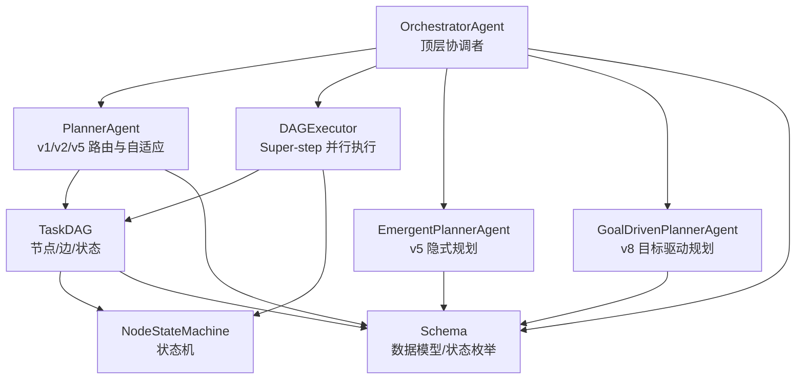
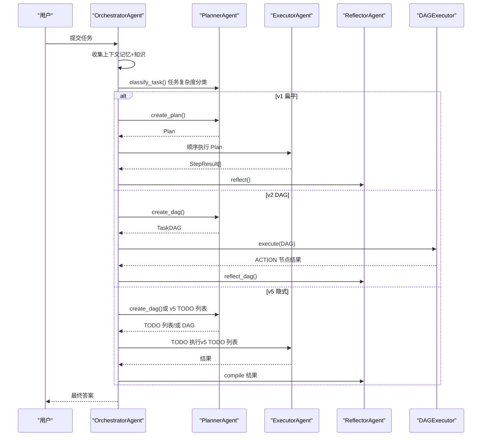
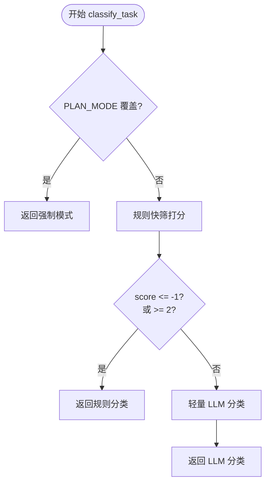
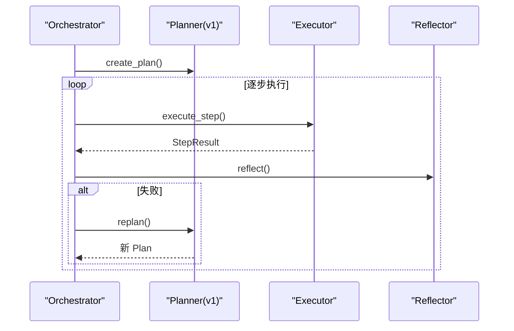
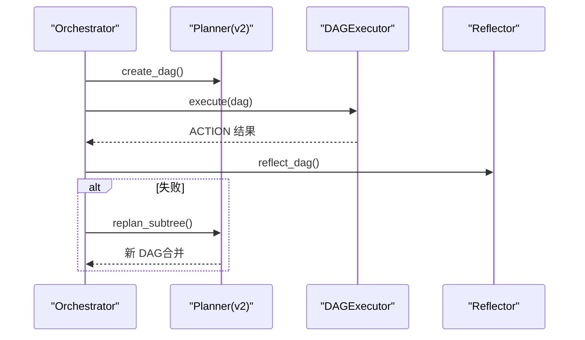
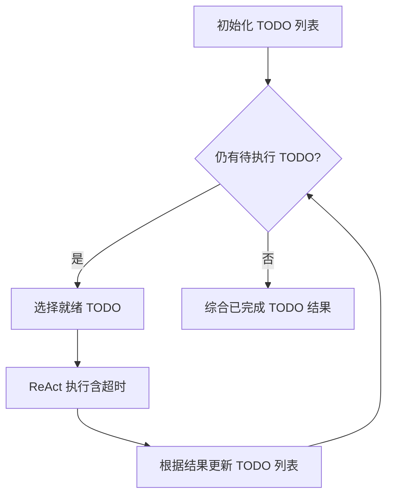
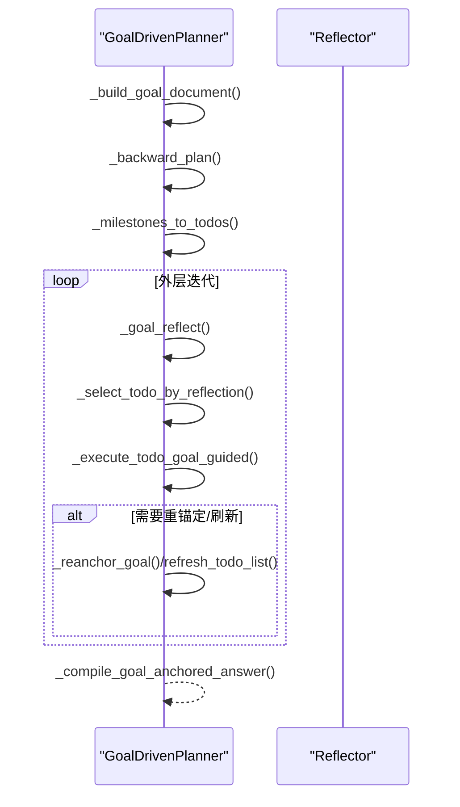
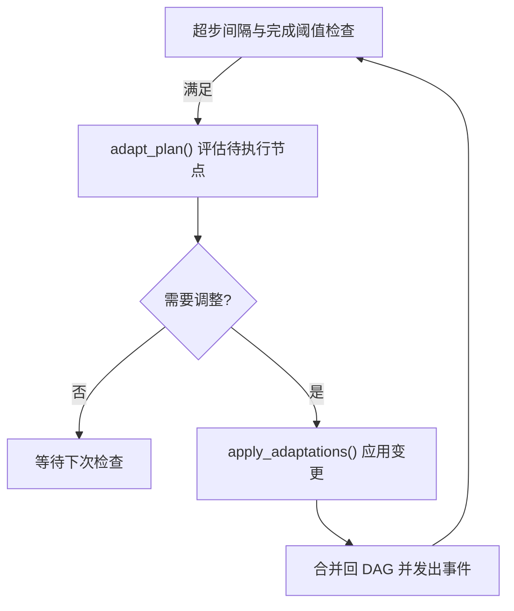
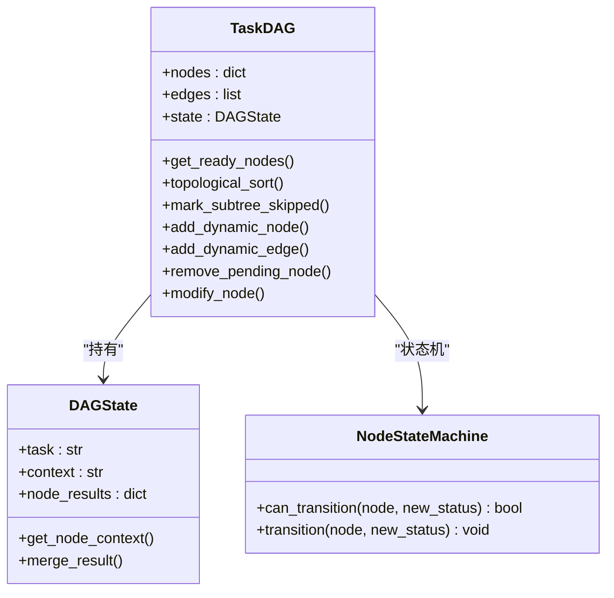
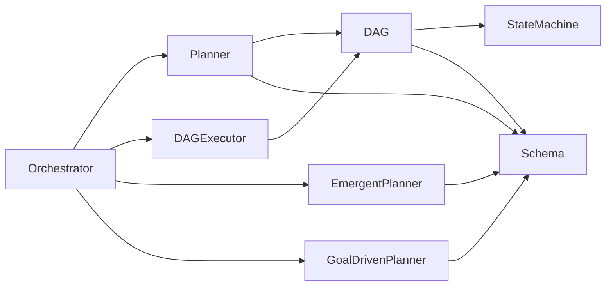

# 自适应规划概念

<cite>
**本文引用的文件**
- [agents/planner.py](file://agents/planner.py)
- [agents/emergent_planner.py](file://agents/emergent_planner.py)
- [agents/goal_driven_planner.py](file://agents/goal_driven_planner.py)
- [agents/orchestrator.py](file://agents/orchestrator.py)
- [dag/graph.py](file://dag/graph.py)
- [dag/executor.py](file://dag/executor.py)
- [dag/state_machine.py](file://dag/state_machine.py)
- [schema.py](file://schema.py)
- [evaluation/benchmark.py](file://evaluation/benchmark.py)
- [config.py](file://config.py)
</cite>

## 目录
1. [简介](#简介)
2. [项目结构](#项目结构)
3. [核心组件](#核心组件)
4. [架构总览](#架构总览)
5. [详细组件分析](#详细组件分析)
6. [依赖分析](#依赖分析)
7. [性能考量](#性能考量)
8. [故障排查指南](#故障排查指南)
9. [结论](#结论)
10. [附录](#附录)

## 简介
本文件系统化阐述“自适应规划”概念在代码库中的实现与工程实践，围绕三大规划路径（v1 扁平规划、v2 DAG 规划、v5 隐式规划）与 v8 目标驱动规划的创新机制，详解任务复杂度自动分类、动态调整（失败检测、重规划触发、局部重规划）、以及评估指标与质量保障体系。文档兼顾技术深度与可读性，既面向工程师也便于非专业读者理解。

## 项目结构
项目采用“多智能体 + 有向无环图执行”的混合架构：
- Orchestrator 作为顶层协调者，负责上下文收集、复杂度分类与路径路由。
- Planner 提供 v1/v2/v5 的规划能力与自适应调整。
- DAG 执行器以 Super-step 模型并行执行，支持条件分支、失败回滚与局部重规划。
- EmergentPlanner 与 GoalDrivenPlanner 分别实现 v5 隐式规划与 v8 目标驱动规划。
- Schema 定义统一的数据模型与状态机，确保各组件一致性。

图表来源
- [agents/orchestrator.py:60-150](file://agents/orchestrator.py#L60-L150)
- [agents/planner.py:147-207](file://agents/planner.py#L147-L207)
- [dag/executor.py:62-104](file://dag/executor.py#L62-L104)
- [dag/graph.py:43-81](file://dag/graph.py#L43-L81)
- [dag/state_machine.py:55-114](file://dag/state_machine.py#L55-L114)
- [schema.py:77-176](file://schema.py#L77-L176)

章节来源
- [agents/orchestrator.py:60-150](file://agents/orchestrator.py#L60-L150)
- [agents/planner.py:147-207](file://agents/planner.py#L147-L207)
- [dag/graph.py:43-81](file://dag/graph.py#L43-L81)
- [dag/executor.py:62-104](file://dag/executor.py#L62-L104)
- [dag/state_machine.py:55-114](file://dag/state_machine.py#L55-L114)
- [schema.py:77-176](file://schema.py#L77-L176)

## 核心组件
- 任务复杂度分类（v4 两阶段混合）：规则快筛（零成本）+ LLM 兜底（轻量），自动选择 v1、v2 或 v5。
- v1 扁平规划：2-6 步顺序计划，失败后整体重规划。
- v2 DAG 规划：三层（Goal/SubGoal/Action）层次化计划，支持并行与条件分支，失败后局部重规划。
- v5 隐式规划：无预设计划，基于 TODO 列表动态演化，Claude Code 风格。
- v8 目标驱动规划：以终为始，逆向里程碑驱动，反思与目标重锚定。
- 自适应规划（v3）：超步间评估与调整，动态增删改待执行节点。
- 执行器与状态机：统一节点生命周期管理，失败回滚与子树跳过。

章节来源
- [agents/planner.py:213-259](file://agents/planner.py#L213-L259)
- [agents/planner.py:369-431](file://agents/planner.py#L369-L431)
- [agents/planner.py:481-566](file://agents/planner.py#L481-L566)
- [agents/planner.py:573-722](file://agents/planner.py#L573-L722)
- [agents/emergent_planner.py:72-128](file://agents/emergent_planner.py#L72-L128)
- [agents/goal_driven_planner.py:214-255](file://agents/goal_driven_planner.py#L214-L255)
- [dag/executor.py:350-400](file://dag/executor.py#L350-L400)
- [dag/state_machine.py:38-114](file://dag/state_machine.py#L38-L114)

## 架构总览
自适应规划的端到端流程如下：

图表来源
- [agents/orchestrator.py:158-222](file://agents/orchestrator.py#L158-L222)
- [agents/planner.py:369-566](file://agents/planner.py#L369-L566)
- [dag/executor.py:110-264](file://dag/executor.py#L110-L264)

章节来源
- [agents/orchestrator.py:158-222](file://agents/orchestrator.py#L158-L222)
- [agents/planner.py:369-566](file://agents/planner.py#L369-L566)
- [dag/executor.py:110-264](file://dag/executor.py#L110-L264)

## 详细组件分析

### 任务复杂度自动分类与路由（v4）
- 规则快筛：基于长度、多步/条件/并行/动作动词等关键词统计打分，快速区分简单/复杂/探索性。
- LLM 兜底：对模糊区间进行轻量 JSON 分类，支持 emergent 选项。
- 路由策略：PLAN_MODE 强制覆盖；禁用 emergent 时将 emergent 降级为 complex；最终选择 v1/v2/v5。

图表来源
- [agents/planner.py:213-259](file://agents/planner.py#L213-L259)
- [agents/planner.py:261-327](file://agents/planner.py#L261-L327)
- [agents/planner.py:329-362](file://agents/planner.py#L329-L362)

章节来源
- [agents/planner.py:213-259](file://agents/planner.py#L213-L259)
- [agents/planner.py:261-327](file://agents/planner.py#L261-L327)
- [agents/planner.py:329-362](file://agents/planner.py#L329-L362)
- [config.py:40-41](file://config.py#L40-L41)

### v1 扁平规划与重规划
- 规划：使用轻量提示词生成 2-6 步顺序计划。
- 执行：顺序执行，依赖未满足则跳过。
- 重规划：基于已完成结果、失败步骤与反馈，生成新计划，避免重复已完成步骤。

图表来源
- [agents/planner.py:369-431](file://agents/planner.py#L369-L431)
- [agents/orchestrator.py:257-352](file://agents/orchestrator.py#L257-L352)

章节来源
- [agents/planner.py:369-431](file://agents/planner.py#L369-L431)
- [agents/orchestrator.py:257-352](file://agents/orchestrator.py#L257-L352)

### v2 DAG 规划与局部重规划
- 规划：三层 JSON 输出（Goal/SubGoal/Actions），一次性构建 DAG。
- 执行：Super-step 并行，条件边运行时评估，失败回滚与子树跳过。
- 局部重规划：仅重建失败节点父节点下的子树，保留已完成工作。

图表来源
- [agents/planner.py:481-566](file://agents/planner.py#L481-L566)
- [agents/orchestrator.py:439-508](file://agents/orchestrator.py#L439-L508)
- [dag/executor.py:350-400](file://dag/executor.py#L350-L400)

章节来源
- [agents/planner.py:481-566](file://agents/planner.py#L481-L566)
- [agents/orchestrator.py:439-508](file://agents/orchestrator.py#L439-L508)
- [dag/executor.py:350-400](file://dag/executor.py#L350-L400)

### v5 隐式规划（Emergent）
- 无预设计划，基于 TODO 列表动态演化。
- 主循环：初始化 TODO → 选择就绪 TODO → ReAct 执行 → 更新 TODO（新增/修改/阻塞）→ 汇总结果。
- 停滞检测与超时保护，支持统一 ReActEngine（v6.0）。

图表来源
- [agents/emergent_planner.py:134-276](file://agents/emergent_planner.py#L134-L276)
- [agents/emergent_planner.py:347-459](file://agents/emergent_planner.py#L347-L459)

章节来源
- [agents/emergent_planner.py:72-128](file://agents/emergent_planner.py#L72-L128)
- [agents/emergent_planner.py:134-276](file://agents/emergent_planner.py#L134-L276)
- [agents/emergent_planner.py:347-459](file://agents/emergent_planner.py#L347-L459)

### v8 目标驱动规划（Goal-Driven）
- 以终为始：构建 GoalDocument，逆向规划里程碑，转换为 TODO 列表。
- 反思与重锚定：定期比较当前状态与目标，必要时重锚定目标并主动刷新 TODO。
- 有界消息上下文，避免 v5 无界历史带来的开销。

图表来源
- [agents/goal_driven_planner.py:261-399](file://agents/goal_driven_planner.py#L261-L399)
- [agents/goal_driven_planner.py:406-464](file://agents/goal_driven_planner.py#L406-L464)
- [agents/goal_driven_planner.py:486-524](file://agents/goal_driven_planner.py#L486-L524)
- [agents/goal_driven_planner.py:575-752](file://agents/goal_driven_planner.py#L575-L752)

章节来源
- [agents/goal_driven_planner.py:214-255](file://agents/goal_driven_planner.py#L214-L255)
- [agents/goal_driven_planner.py:261-399](file://agents/goal_driven_planner.py#L261-L399)
- [agents/goal_driven_planner.py:406-464](file://agents/goal_driven_planner.py#L406-L464)
- [agents/goal_driven_planner.py:486-524](file://agents/goal_driven_planner.py#L486-L524)
- [agents/goal_driven_planner.py:575-752](file://agents/goal_driven_planner.py#L575-L752)

### 自适应规划（v3）：动态调整与局部重规划
- 超步间评估：在 DAG 执行过程中，按间隔与完成阈值触发 adapt_plan。
- 适配动作：保留/修改/删除/新增待执行节点，应用后合并回 DAG。
- 局部重规划：失败后仅重建失败子树，保留已完成工作，避免整体重来。

图表来源
- [dag/executor.py:578-629](file://dag/executor.py#L578-L629)
- [agents/planner.py:573-722](file://agents/planner.py#L573-L722)
- [agents/orchestrator.py:481-506](file://agents/orchestrator.py#L481-L506)

章节来源
- [dag/executor.py:578-629](file://dag/executor.py#L578-L629)
- [agents/planner.py:573-722](file://agents/planner.py#L573-L722)
- [agents/orchestrator.py:481-506](file://agents/orchestrator.py#L481-L506)

### DAG 数据结构与状态机
- TaskDAG：节点/边/集中式状态（DAGState），支持拓扑排序、就绪节点发现、下游子树跳过、动态增删改节点。
- NodeStateMachine：严格的节点生命周期转移表，防止不一致状态。
- 执行器：并行 Super-step、条件边评估、失败回滚与子树跳过、检查点快照。

图表来源
- [dag/graph.py:43-81](file://dag/graph.py#L43-L81)
- [dag/graph.py:101-126](file://dag/graph.py#L101-L126)
- [dag/graph.py:184-213](file://dag/graph.py#L184-L213)
- [dag/graph.py:341-443](file://dag/graph.py#L341-L443)
- [dag/graph.py:466-493](file://dag/graph.py#L466-L493)
- [dag/state_machine.py:55-114](file://dag/state_machine.py#L55-L114)
- [schema.py:192-253](file://schema.py#L192-L253)

章节来源
- [dag/graph.py:43-81](file://dag/graph.py#L43-L81)
- [dag/graph.py:101-126](file://dag/graph.py#L101-L126)
- [dag/graph.py:184-213](file://dag/graph.py#L184-L213)
- [dag/graph.py:341-443](file://dag/graph.py#L341-L443)
- [dag/graph.py:466-493](file://dag/graph.py#L466-L493)
- [dag/state_machine.py:55-114](file://dag/state_machine.py#L55-L114)
- [schema.py:192-253](file://schema.py#L192-L253)

## 依赖分析
- 组件耦合：Orchestrator 与 Planner/DAGExecutor/Emergent/GoalDriven 解耦，通过统一事件回调与数据模型交互。
- 外部依赖：LLM 客户端、工具路由、Tracing（可选）。
- 配置开关：PLAN_MODE、EMERGENT_PLANNING_ENABLED、ADAPTIVE_PLANNING_ENABLED、ENABLE_GOAL_DRIVEN_PLANNER 等。

图表来源
- [agents/orchestrator.py:116-141](file://agents/orchestrator.py#L116-L141)
- [agents/planner.py:147-207](file://agents/planner.py#L147-L207)
- [dag/executor.py:87-104](file://dag/executor.py#L87-L104)
- [dag/graph.py:43-81](file://dag/graph.py#L43-L81)
- [dag/state_machine.py:55-114](file://dag/state_machine.py#L55-L114)
- [schema.py:77-176](file://schema.py#L77-L176)

章节来源
- [agents/orchestrator.py:116-141](file://agents/orchestrator.py#L116-L141)
- [agents/planner.py:147-207](file://agents/planner.py#L147-L207)
- [dag/executor.py:87-104](file://dag/executor.py#L87-L104)
- [dag/graph.py:43-81](file://dag/graph.py#L43-L81)
- [dag/state_machine.py:55-114](file://dag/state_machine.py#L55-L114)
- [schema.py:77-176](file://schema.py#L77-L176)

## 性能考量
- 规则分类零开销：规则快筛在 1ms 内完成，仅对模糊区间触发 LLM。
- DAG 并行：MAX_PARALLEL_NODES 控制每轮并行度，避免资源争用。
- 超步间自适应：ADAPT_PLAN_INTERVAL 与 ADAPT_PLAN_MIN_COMPLETED 控制评估频率与阈值，降低不必要的 LLM 调用。
- 超时与停滞：NODE_EXECUTION_TIMEOUT 与停滞检测防止卡死；TODO 列表上限与压缩阈值控制内存占用。
- Token 跟踪：LLM 调用记录与汇总，便于成本控制与优化。

章节来源
- [agents/planner.py:213-259](file://agents/planner.py#L213-L259)
- [config.py:24-25](file://config.py#L24-L25)
- [config.py:44-49](file://config.py#L44-L49)
- [config.py:58-59](file://config.py#L58-L59)
- [config.py:66-67](file://config.py#L66-L67)
- [dag/executor.py:291-310](file://dag/executor.py#L291-L310)
- [agents/emergent_planner.py:177-190](file://agents/emergent_planner.py#L177-L190)

## 故障排查指南
- 复杂度分类异常
  - 检查 PLAN_MODE 与 EMERGENT_PLANNING_ENABLED 配置，确认 emergent 是否被降级。
  - 查看规则打分日志与 LLM 分类结果。
- DAG 执行卡住
  - 查看 DAG 的阻塞报告与就绪节点发现；确认是否存在循环或条件未满足。
  - 检查 FAILED 节点是否触发了回滚与子树跳过。
- 超步间自适应无效
  - 确认 ADAPTIVE_PLANNING_ENABLED 开关与间隔/阈值配置。
  - 检查 adapt_plan 返回的 should_adapt 与 adaptations 列表。
- v5 隐式规划 TODO 阻塞
  - 检查 TODO 列表更新逻辑与依赖完整性；关注停滞检测与最大迭代限制。
- v8 目标驱动规划目标偏移
  - 检查目标重锚定与反思间隔；确认 BLOCKED TODO 的处理与建议。

章节来源
- [agents/orchestrator.py:178-212](file://agents/orchestrator.py#L178-L212)
- [dag/graph.py:277-312](file://dag/graph.py#L277-L312)
- [dag/executor.py:131-141](file://dag/executor.py#L131-L141)
- [dag/executor.py:578-629](file://dag/executor.py#L578-L629)
- [agents/emergent_planner.py:177-190](file://agents/emergent_planner.py#L177-L190)
- [agents/goal_driven_planner.py:307-328](file://agents/goal_driven_planner.py#L307-L328)

## 结论
该系统以“规则快筛 + LLM 兜底”的混合分类器实现任务复杂度自动路由，结合 v1/v2/v5/v8 的多路径规划与 DAG 执行器的并行与条件分支能力，形成从“显式计划”到“隐式涌现”的完整规划谱系。自适应规划（v3）通过超步间评估与局部重规划，显著提升了鲁棒性与效率。配合完善的评估指标与质量门控，系统在可解释性、可扩展性与工程落地方面具备良好平衡。

## 附录
- 评估指标与质量保证
  - 基准任务：覆盖 easy/medium/hard，标注复杂度、工具需求、成功标准与参考输出。
  - 反思与验证：Reflector 对执行结果进行质量门控与反馈，支持 reflect/reflect_dag。
  - Token 跟踪：记录每次 LLM 调用的 prompt/completion/total，按引擎汇总。
- 配置要点
  - PLAN_MODE：auto/simple/complex/emergent
  - EMERGENT_PLANNING_ENABLED：v5 开关
  - ADAPTIVE_PLANNING_ENABLED：v3 开关
  - ENABLE_GOAL_DRIVEN_PLANNER：v8 开关
  - MAX_PARALLEL_NODES、NODE_EXECUTION_TIMEOUT、ADAPT_PLAN_INTERVAL 等执行参数

章节来源
- [evaluation/benchmark.py:62-291](file://evaluation/benchmark.py#L62-L291)
- [agents/orchestrator.py:473-476](file://agents/orchestrator.py#L473-L476)
- [config.py:40-96](file://config.py#L40-L96)
- [schema.py:303-335](file://schema.py#L303-L335)