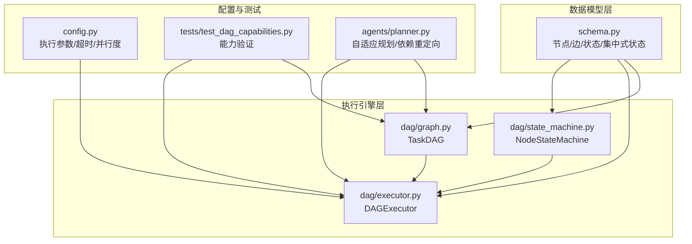
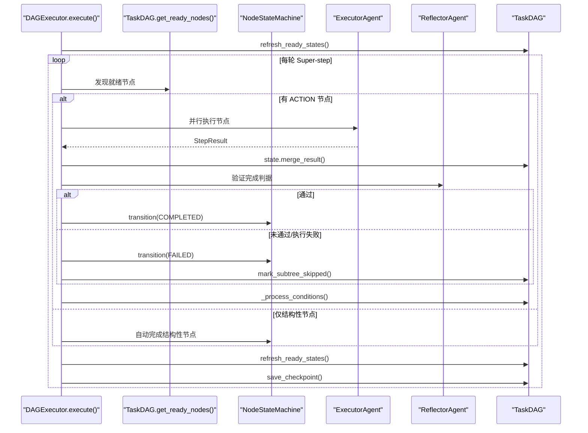
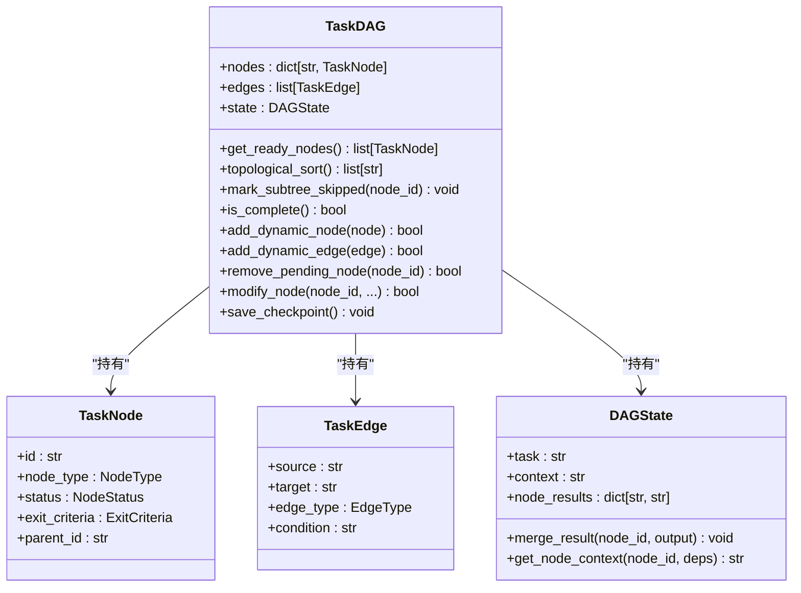
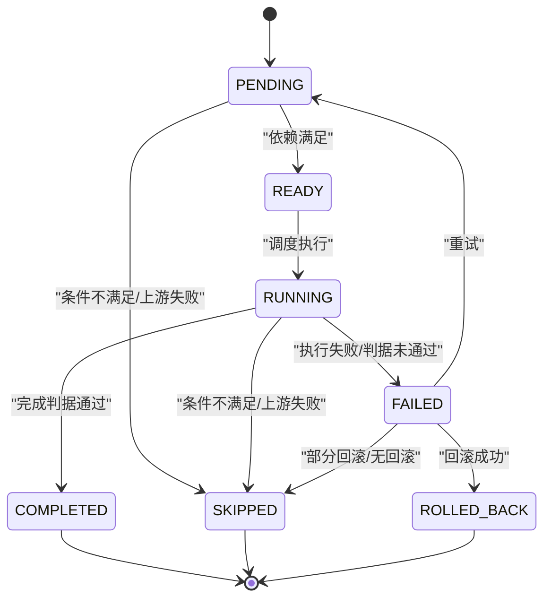
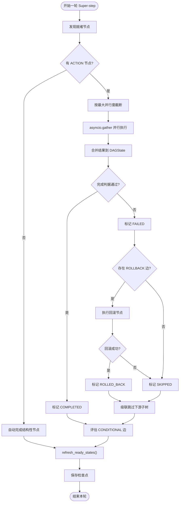
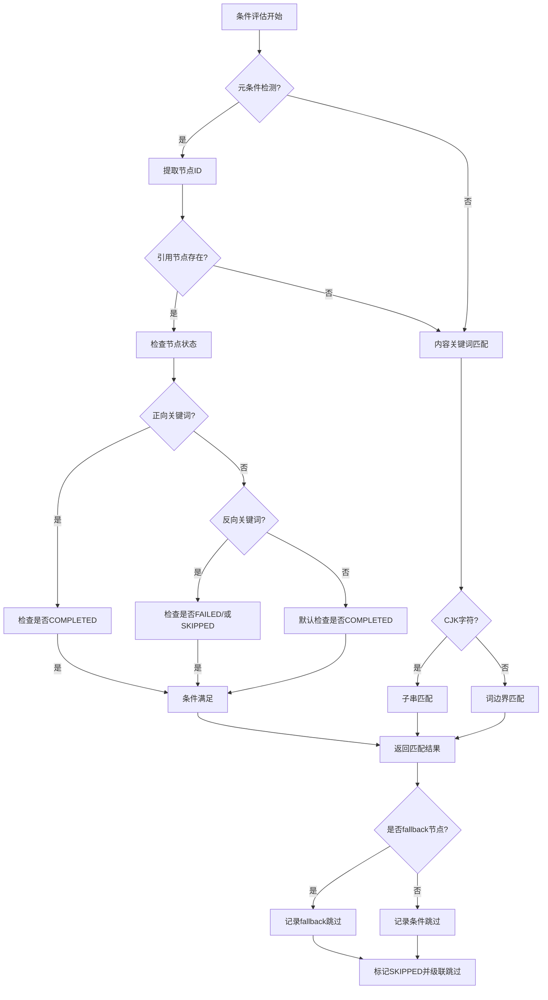
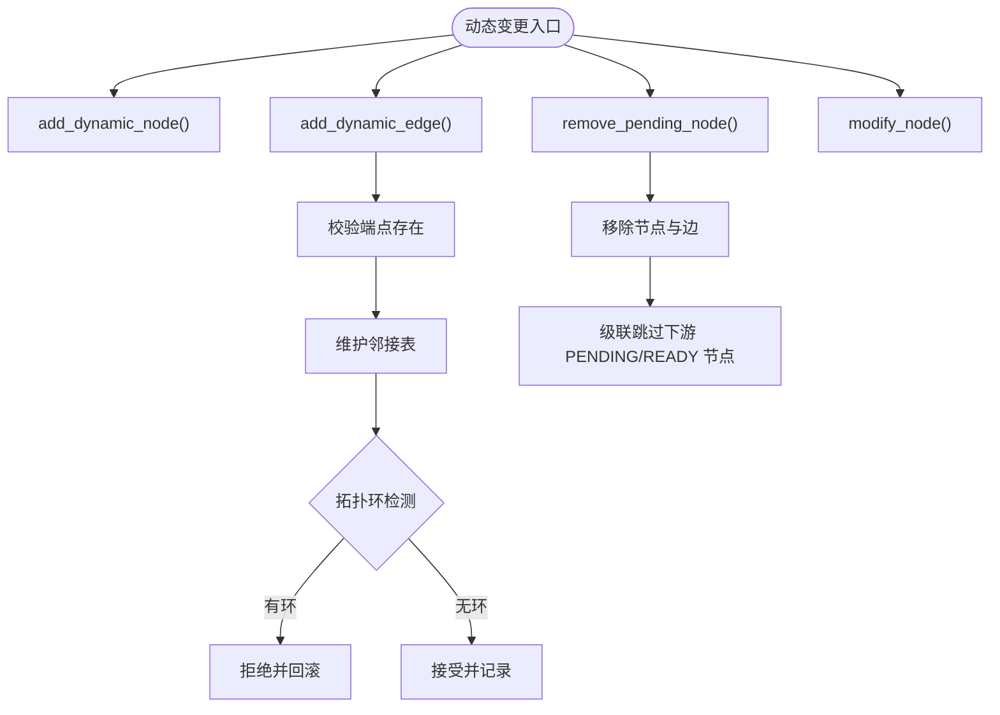
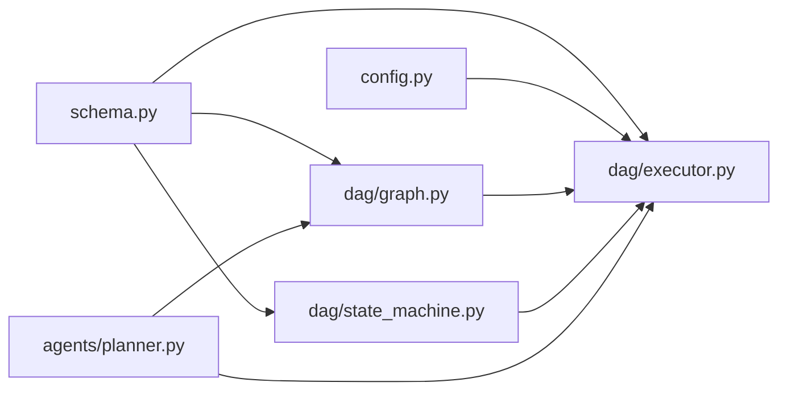

# DAG执行引擎

<cite>
**本文引用的文件**
- [dag/graph.py](file://dag/graph.py)
- [dag/state_machine.py](file://dag/state_machine.py)
- [dag/executor.py](file://dag/executor.py)
- [schema.py](file://schema.py)
- [config.py](file://config.py)
- [tests/test_dag_capabilities.py](file://tests/test_dag_capabilities.py)
- [agents/planner.py](file://agents/planner.py)
</cite>

## 目录
1. [简介](#简介)
2. [项目结构](#项目结构)
3. [核心组件](#核心组件)
4. [架构总览](#架构总览)
5. [详细组件分析](#详细组件分析)
6. [依赖分析](#依赖分析)
7. [性能考量](#性能考量)
8. [故障排查指南](#故障排查指南)
9. [结论](#结论)
10. [附录](#附录)

## 简介
本技术文档面向 DAG 执行引擎，系统性阐述 TaskDAG 数据结构设计、状态机管理、并行执行模型（Super-step）、动态图变更能力、以及构建、验证与优化最佳实践。文档同时覆盖性能监控、错误处理与调试技巧，帮助读者在工程实践中高效落地与演进。

**更新** 本版本重点反映了条件评估的重大改进：引入双模式策略（元条件vs内容关键词）、增强的fallback依赖重定向、改进的条件跳过处理。

## 项目结构
本项目围绕 DAG 执行形成清晰分层：
- 数据模型层：定义节点类型、边类型、状态、集中式状态等核心数据结构
- 执行引擎层：基于 Super-step 的并行执行器，负责调度、执行、收敛与回滚
- 状态机层：统一约束节点生命周期状态转移，保证一致性
- 配置与测试：通过配置项控制执行行为，测试覆盖关键能力

**图表来源**
- [dag/graph.py:43-627](file://dag/graph.py#L43-L627)
- [dag/executor.py:62-685](file://dag/executor.py#L62-L685)
- [dag/state_machine.py:55-114](file://dag/state_machine.py#L55-L114)
- [schema.py:77-253](file://schema.py#L77-L253)
- [config.py:42-60](file://config.py#L42-L60)
- [tests/test_dag_capabilities.py:1-200](file://tests/test_dag_capabilities.py#L1-L200)
- [agents/planner.py:970-995](file://agents/planner.py#L970-L995)

**章节来源**
- [dag/graph.py:1-627](file://dag/graph.py#L1-L627)
- [dag/executor.py:1-685](file://dag/executor.py#L1-L685)
- [dag/state_machine.py:1-114](file://dag/state_machine.py#L1-L114)
- [schema.py:1-702](file://schema.py#L1-L702)
- [config.py:1-109](file://config.py#L1-L109)
- [tests/test_dag_capabilities.py:1-200](file://tests/test_dag_capabilities.py#L1-L200)
- [agents/planner.py:970-995](file://agents/planner.py#L970-L995)

## 核心组件
- TaskDAG：有向无环图容器，持有节点、边、集中式状态与检查点；提供就绪节点发现、拓扑排序、条件边评估、失败级联跳过、动态图变更等能力
- NodeStateMachine：状态机，严格约束节点状态转移，防止非法状态进入
- DAGExecutor：执行器，采用 Super-step 并行模型，负责调度、执行、合并结果、验证完成判据、失败处理、条件评估与检查点

**更新** 条件评估系统现已支持双模式策略，包括元条件检测和内容关键词匹配。

**章节来源**
- [dag/graph.py:43-627](file://dag/graph.py#L43-L627)
- [dag/state_machine.py:55-114](file://dag/state_machine.py#L55-L114)
- [dag/executor.py:62-685](file://dag/executor.py#L62-L685)

## 架构总览
DAG 执行采用"集中式状态 + 状态机 + 并行 Super-step"的组合：
- 集中式状态：DAGState 作为单一真相源，各节点结果以节点 ID 为键写入，天然避免并行写冲突
- 状态机：NodeStateMachine 统一校验与应用状态转移，确保生命周期合规
- 执行器：DAGExecutor 每轮 Super-step 发现就绪节点，按最大并行度并发执行，合并结果、验证完成判据、处理失败、评估条件边、保存检查点

**图表来源**
- [dag/executor.py:110-264](file://dag/executor.py#L110-L264)
- [dag/graph.py:101-213](file://dag/graph.py#L101-L213)
- [dag/state_machine.py:88-114](file://dag/state_machine.py#L88-L114)

## 详细组件分析

### TaskDAG 数据结构与边关系
- 节点类型
  - GOAL：顶层目标，结构分组
  - SUBGOAL：子目标，结构分组
  - ACTION：可执行动作，叶节点
- 边类型
  - DEPENDENCY：依赖边，下游节点需等待上游完成
  - CONDITIONAL：条件边，仅当源节点结果满足关键词时激活目标
  - ROLLBACK：回滚边，失败时触发清理/撤销
- 关键能力
  - 就绪节点发现：基于依赖满足度动态扫描，O(V+E) 邻接表加速
  - 拓扑排序：Kahn 算法，仅考虑 DEPENDENCY 边
  - 条件边评估：关键词匹配（中日韩文本子串匹配，拉丁文本词边界匹配）
  - 失败级联跳过：BFS 遍历下游子树，统一通过状态机标记 SKIPPED
  - 动态图变更：运行时添加/删除节点与边，维护邻接表，边添加时进行环检测
  - 检查点：序列化快照，支持内存中有限数量保留

**更新** 条件边评估现已支持双模式策略，包括元条件检测和内容关键词匹配。

**图表来源**
- [dag/graph.py:43-627](file://dag/graph.py#L43-L627)
- [schema.py:157-253](file://schema.py#L157-L253)

**章节来源**
- [dag/graph.py:43-627](file://dag/graph.py#L43-L627)
- [schema.py:77-253](file://schema.py#L77-L253)

### 状态机管理系统（NodeStateMachine）
- 状态枚举：PENDING、READY、RUNNING、COMPLETED、FAILED、SKIPPED、ROLLED_BACK
- 转移表：明确合法状态变化，非法转移抛出异常
- 事件回调：状态变更时触发 UI/日志回调，便于前端实时展示
- 与执行器耦合：执行器注入状态机，保证 DAG 内部状态变更也触发事件

**图表来源**
- [dag/state_machine.py:42-52](file://dag/state_machine.py#L42-L52)
- [schema.py:87-106](file://schema.py#L87-L106)

**章节来源**
- [dag/state_machine.py:55-114](file://dag/state_machine.py#L55-L114)
- [schema.py:87-106](file://schema.py#L87-L106)

### 并行执行模型（Super-step）
- 每轮 Super-step 步骤
  - 就绪发现：扫描所有节点，筛选依赖满足的 PENDING/READY
  - 并发执行：按最大并行度截断，asyncio.gather 并行执行
  - 结果合并：写入 DAGState，记录节点结果
  - 完成判据验证：Reflector 基于 LLM 或直接判断
  - 失败处理：执行回滚边（若有），失败节点标记 FAILED，级联跳过下游子树
  - 条件评估：遍历已完成节点的 CONDITIONAL 边，按关键词匹配激活/跳过
  - 结构性节点自动完成：当子节点全部终态时，沿正常路径推进或跳过
  - 检查点：保存当前状态快照
- 超时保护：单节点执行超时控制，避免阻塞批次
- 事件驱动：通过回调向 UI/日志推送节点状态变化

**更新** 条件评估现已支持双模式策略，包括元条件检测和内容关键词匹配。

**图表来源**
- [dag/executor.py:110-264](file://dag/executor.py#L110-L264)
- [dag/graph.py:184-213](file://dag/graph.py#L184-L213)

**章节来源**
- [dag/executor.py:62-685](file://dag/executor.py#L62-L685)
- [config.py:56-59](file://config.py#L56-L59)

### 条件评估系统（重大改进）
- 双模式策略
  - 元条件检测：条件中引用节点 ID（如 "act_1_1成功"），直接检查被引用节点的执行状态
  - 内容关键词匹配：条件是期望出现在结果文本中的关键词，对源节点输出做子串/正则匹配
- 关键改进
  - 元条件正向关键词：成功、完成、通过、succeeded/completed/passed/ok
  - 元条件反向关键词：失败、failed/error/not
  - 引用节点不存在时自动降级到内容匹配
- fallback依赖重定向
  - Planner 自动检测 CONDITIONAL 边的 target 作为 DEPENDENCY 边的 source
  - 将 DEPENDENCY 边重定向为指向 primary 路径节点，避免 fallback 被跳过时级联跳过其下游节点

**更新** 新增双模式条件评估策略和增强的fallback依赖重定向机制。

**图表来源**
- [dag/executor.py:460-510](file://dag/executor.py#L460-L510)
- [agents/planner.py:970-995](file://agents/planner.py#L970-L995)

**章节来源**
- [dag/executor.py:405-510](file://dag/executor.py#L405-L510)
- [agents/planner.py:970-995](file://agents/planner.py#L970-L995)

### 动态图变更能力
- 添加节点：运行时新增 ACTION 节点，ID 唯一性校验
- 添加边：运行时新增 DEPENDENCY/CONDITIONAL/ROLLBACK 边，校验端点存在，维护邻接表，添加后进行拓扑环检测
- 删除节点：仅允许删除 PENDING/READY 节点，移除节点及关联边，维护邻接表，对下游节点进行级联跳过
- 修改节点：仅允许修改 PENDING/READY 节点的描述与完成判据
- 诊断与恢复：阻塞报告、阻塞节点定位、阻塞恢复（将依赖终态的 PENDING 提升为 READY）

**图表来源**
- [dag/graph.py:341-494](file://dag/graph.py#L341-L494)

**章节来源**
- [dag/graph.py:341-494](file://dag/graph.py#L341-L494)

### DAG 图构建、验证与优化最佳实践
- 构建
  - 明确三层结构：GOAL → SUBGOAL → ACTION，ACTION 为可执行叶节点
  - 仅使用 DEPENDENCY 边表达执行顺序，避免隐式依赖
  - 为每个节点配置 exit_criteria，必要时提供 validation_prompt
- 验证
  - 构造时基础校验：边端点存在性、无环（拓扑排序长度校验）
  - 运行时校验：阻塞报告、阻塞恢复、条件边缓存避免重复评估
- 优化
  - 邻接表预构建：O(V+E) 就绪发现与下游遍历
  - 并行度控制：MAX_PARALLEL_NODES 限制每轮并发，避免资源争用
  - 超时保护：NODE_EXECUTION_TIMEOUT 防止单节点卡死
  - 检查点：MAX_CHECKPOINTS 控制内存占用

**更新** 条件评估优化：已评估条件边缓存避免重复计算，提升性能。

**章节来源**
- [dag/graph.py:585-605](file://dag/graph.py#L585-L605)
- [config.py:44-59](file://config.py#L44-L59)

## 依赖分析
- TaskDAG 依赖 schema 中的数据模型（TaskNode、TaskEdge、DAGState、枚举等）
- DAGExecutor 依赖 TaskDAG、NodeStateMachine、schema 的 StepResult、NodeStatus、NodeType
- NodeStateMachine 依赖 schema 的 NodeStatus、TaskNode
- 配置通过 config.py 注入执行器与图变更参数
- Planner 依赖 DAG 执行器进行自适应规划和依赖重定向

**图表来源**
- [schema.py:77-253](file://schema.py#L77-L253)
- [dag/graph.py:36-38](file://dag/graph.py#L36-L38)
- [dag/executor.py:49-52](file://dag/executor.py#L49-L52)
- [dag/state_machine.py](file://dag/state_machine.py#L25)
- [config.py:42-60](file://config.py#L42-L60)
- [agents/planner.py:970-995](file://agents/planner.py#L970-L995)

**章节来源**
- [schema.py:1-702](file://schema.py#L1-L702)
- [dag/graph.py:36-38](file://dag/graph.py#L36-L38)
- [dag/executor.py:49-52](file://dag/executor.py#L49-L52)
- [dag/state_machine.py](file://dag/state_machine.py#L25)
- [config.py:42-60](file://config.py#L42-L60)
- [agents/planner.py:970-995](file://agents/planner.py#L970-L995)

## 性能考量
- 时间复杂度
  - 就绪发现：O(V+E)，依赖邻接表
  - 拓扑排序：O(V+E)，仅考虑 DEPENDENCY 边
  - 条件边评估：按已完成节点数量与边数量，配合缓存避免重复
- 并发与资源
  - MAX_PARALLEL_NODES 控制每轮并发，避免 CPU/IO 抢占
  - NODE_EXECUTION_TIMEOUT 防止单节点阻塞批次
  - 检查点数量上限 MAX_CHECKPOINTS 防止内存膨胀
- I/O 与状态合并
  - DAGState 以节点 ID 为键写入，天然无锁冲突，合并成本低

**更新** 条件评估性能优化：已评估条件边缓存避免重复计算，提升性能。

**章节来源**
- [dag/graph.py:101-249](file://dag/graph.py#L101-L249)
- [dag/executor.py:179-182](file://dag/executor.py#L179-L182)
- [config.py:44-59](file://config.py#L44-L59)

## 故障排查指南
- DAG 停滞
  - 现象：无就绪节点但 DAG 未完成
  - 排查：检查是否有 FAILED 节点阻断；使用 get_blockage_report 定位阻塞节点
  - 处理：尝试 recover 被阻塞的 PENDING 节点；确认依赖终态
- 条件分支未生效
  - 现象：CONDITIONAL 边未激活
  - 排查：确认源节点已完成、目标节点为 PENDING/READY；检查关键词匹配策略（中日韩子串匹配，拉丁词边界匹配）
  - **更新** 检查是否为元条件：条件中是否引用了节点 ID（如 "act_1_1成功"）
- 失败处理不当
  - 现象：FAILED 节点未回滚或未级联跳过
  - 排查：确认是否存在 ROLLBACK 边；检查回滚节点是否成功
  - 处理：执行回滚并根据结果标记 ROLLED_BACK 或 SKIPPED；随后级联跳过下游子树
- 动态变更导致环
  - 现象：添加边后 DAG 不可用
  - 排查：检查拓扑排序长度；执行器侧已进行环检测并回滚
  - 处理：修正边方向或依赖关系
- **新增** 条件评估异常
  - 现象：条件评估结果不符合预期
  - 排查：检查元条件语法（节点 ID + 关键词组合）、内容关键词匹配规则
  - 处理：验证条件字符串格式，确保引用的节点 ID 存在于 DAG 中

**更新** 新增条件评估相关的故障排查指导。

**章节来源**
- [dag/executor.py:405-473](file://dag/executor.py#L405-L473)
- [dag/graph.py:384-399](file://dag/graph.py#L384-L399)
- [tests/test_dag_capabilities.py:548-608](file://tests/test_dag_capabilities.py#L548-L608)

## 结论
本 DAG 执行引擎以 TaskDAG 为核心，结合 NodeStateMachine 的状态约束与 DAGExecutor 的 Super-step 并行模型，实现了高并发、可扩展、可观测的执行框架。通过集中式状态、严格的转移表、动态图变更与完善的失败处理，系统在复杂任务场景下具备良好的鲁棒性与可演进性。配合配置项与测试用例，工程落地与持续优化具备良好基础。

**更新** 本版本的条件评估系统显著提升了执行灵活性和可靠性，双模式策略使得条件判断更加智能和多样化。

## 附录
- 关键 API 与路径
  - 就绪发现：[get_ready_nodes:101-126](file://dag/graph.py#L101-L126)
  - 拓扑排序：[topological_sort:219-249](file://dag/graph.py#L219-L249)
  - 条件边评估：[_process_conditions/_evaluate_condition:405-510](file://dag/executor.py#L405-L510)
  - 失败处理与回滚：[_handle_failure:350-399](file://dag/executor.py#L350-L399)
  - 动态图变更：[add/remove/modify:341-494](file://dag/graph.py#L341-L494)
  - 检查点：[save_checkpoint/checkpoints:521-543](file://dag/graph.py#L521-L543)
  - 配置项：[config.py:42-60](file://config.py#L42-L60)
  - **新增** fallback依赖重定向：[planner.py:970-995](file://agents/planner.py#L970-L995)
- 测试参考
  - 能力验证：[tests/test_dag_capabilities.py:1-200](file://tests/test_dag_capabilities.py#L1-L200)
  - **新增** 条件评估测试：[tests/test_dag_capabilities.py:354-553](file://tests/test_dag_capabilities.py#L354-L553)