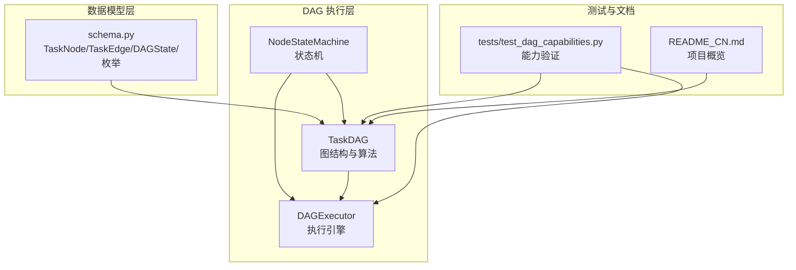
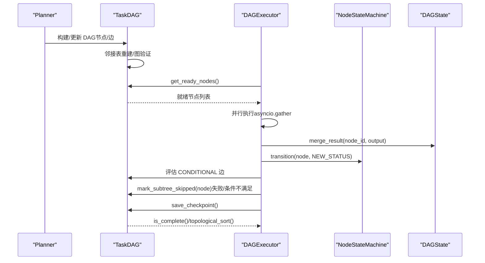
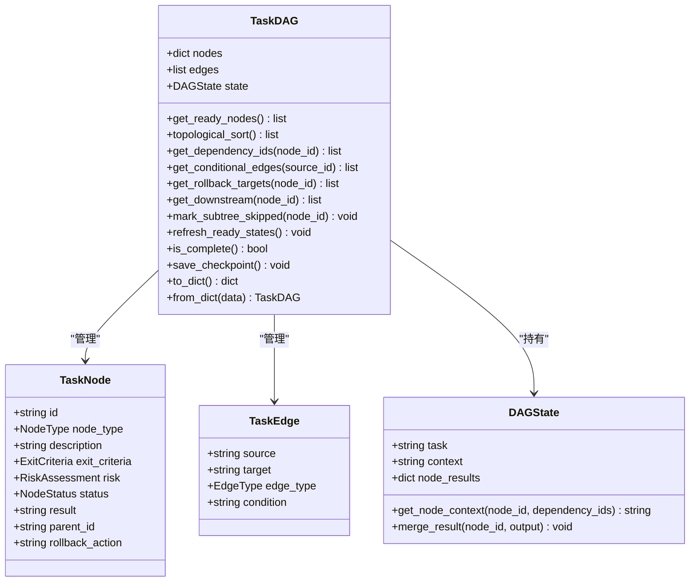
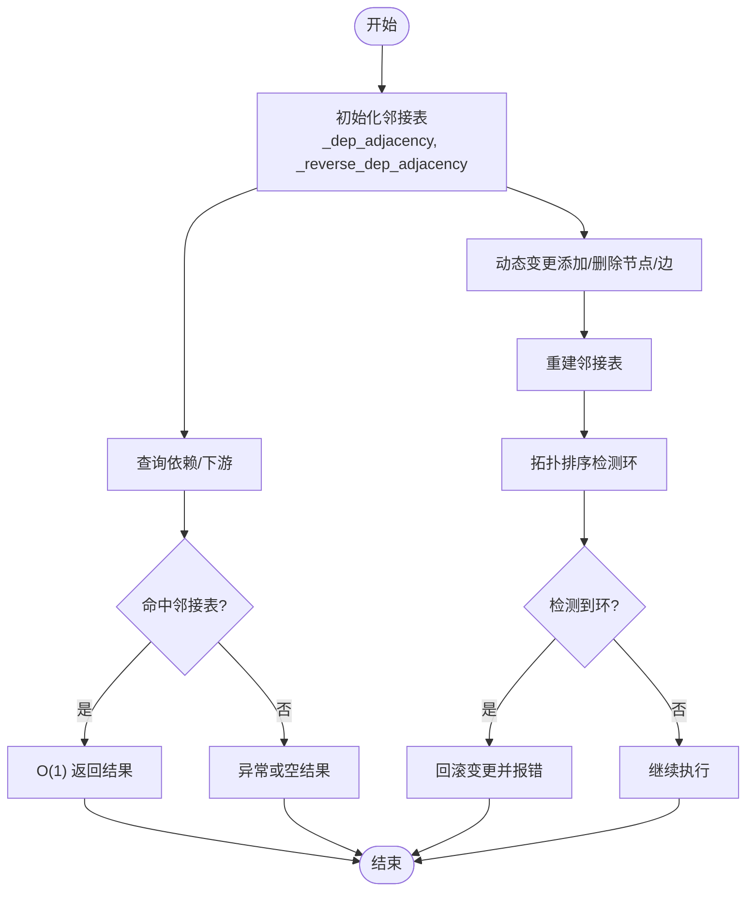
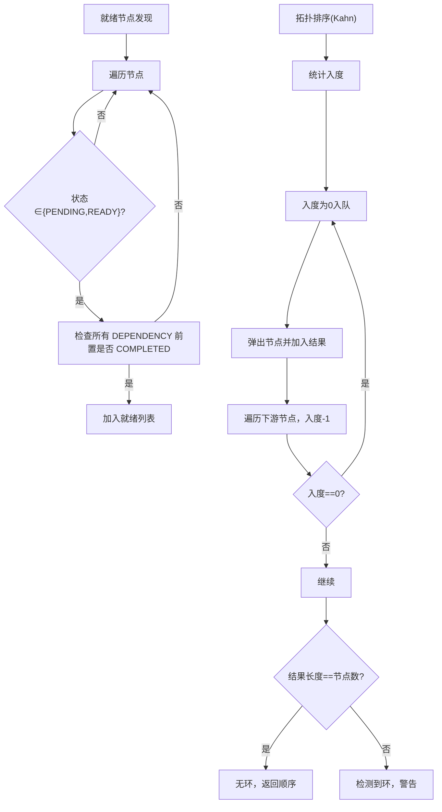
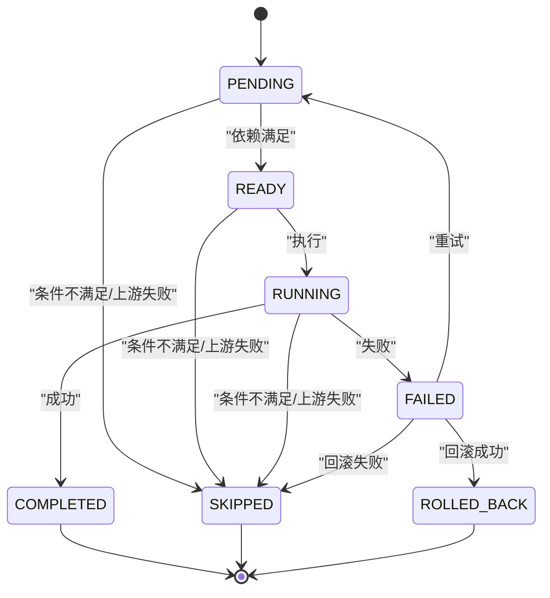
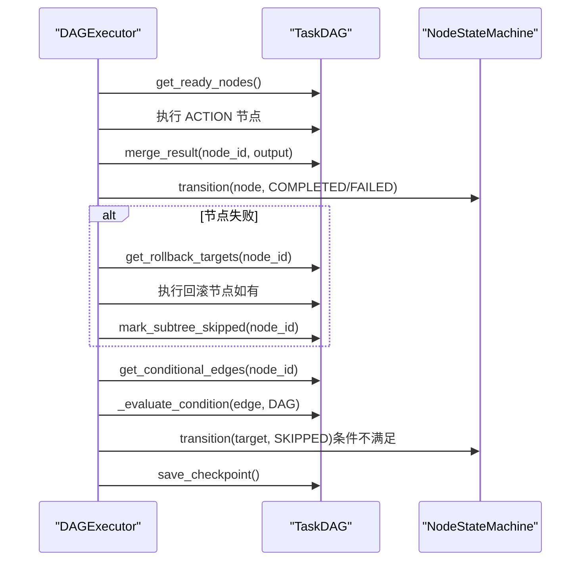
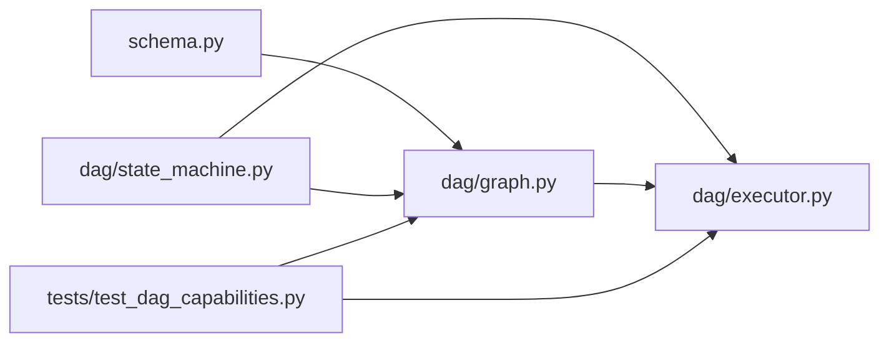

# TaskDAG数据结构

<cite>
**本文引用的文件**
- [dag/graph.py](file://dag/graph.py)
- [dag/state_machine.py](file://dag/state_machine.py)
- [dag/executor.py](file://dag/executor.py)
- [schema.py](file://schema.py)
- [tests/test_dag_capabilities.py](file://tests/test_dag_capabilities.py)
- [README_CN.md](file://README_CN.md)
</cite>

## 目录
1. [简介](#简介)
2. [项目结构](#项目结构)
3. [核心组件](#核心组件)
4. [架构总览](#架构总览)
5. [详细组件分析](#详细组件分析)
6. [依赖分析](#依赖分析)
7. [性能考量](#性能考量)
8. [故障排查指南](#故障排查指南)
9. [结论](#结论)
10. [附录](#附录)

## 简介
本文件围绕 TaskDAG 数据结构展开，系统性阐述其设计理念、数据模型、邻接表优化、图算法实现、状态管理、图验证与动态变更机制，并提供实际使用示例与最佳实践。TaskDAG 以有向无环图为载体，承载分层任务规划（Goal/SubGoal/Action）与执行状态，结合集中式状态（DAGState）、节点状态机（NodeStateMachine）与执行引擎（DAGExecutor），形成“计划可演进、执行可并行、失败可回滚”的闭环。

## 项目结构
与 TaskDAG 直接相关的模块与文件如下：
- 数据模型与枚举：schema.py
- 图结构与算法：dag/graph.py
- 状态机：dag/state_machine.py
- 执行引擎：dag/executor.py
- 能力测试：tests/test_dag_capabilities.py
- 项目概览：README_CN.md

图表来源
- [dag/graph.py:1-627](file://dag/graph.py#L1-L627)
- [dag/state_machine.py:1-114](file://dag/state_machine.py#L1-L114)
- [dag/executor.py:1-648](file://dag/executor.py#L1-L648)
- [schema.py:1-702](file://schema.py#L1-L702)
- [tests/test_dag_capabilities.py:1-1211](file://tests/test_dag_capabilities.py#L1-L1211)
- [README_CN.md:1-514](file://README_CN.md#L1-L514)

章节来源
- [README_CN.md:122-174](file://README_CN.md#L122-L174)

## 核心组件
- TaskDAG：持有节点集合、边集合、集中式状态、节点状态机与检查点快照，提供就绪节点发现、拓扑排序、下游遍历、条件边评估、失败级联跳过、动态增删改节点/边、序列化/反序列化与图验证。
- TaskNode：节点数据模型，包含类型（GOAL/SUBGOAL/ACTION）、状态（NodeStatus）、完成判据（ExitCriteria）、风险评估（RiskAssessment）、父节点ID、回滚动作描述等。
- TaskEdge：边数据模型，包含源节点ID、目标节点ID、边类型（DEPENDENCY/CONDITIONAL/ROLLBACK）、条件关键词（仅CONDITIONAL有效）。
- DAGState：集中式状态，聚合所有节点结果（node_results），提供上下文拼接与结果合并。
- NodeStateMachine：节点状态机，提供状态转移合法性校验与回调通知，确保终态不可再转移。
- DAGExecutor：执行引擎，基于 Super-step 并行模型，协调节点执行、条件边评估、失败回滚、下游跳过、自适应规划与检查点。

章节来源
- [dag/graph.py:43-81](file://dag/graph.py#L43-L81)
- [schema.py:157-187](file://schema.py#L157-L187)
- [schema.py:192-253](file://schema.py#L192-L253)
- [dag/state_machine.py:55-114](file://dag/state_machine.py#L55-L114)
- [dag/executor.py:62-104](file://dag/executor.py#L62-L104)

## 架构总览
TaskDAG 与执行引擎协同工作，形成“计划（DAG）→ 执行（Super-step 并行）→ 反馈（条件/回滚/自适应）→ 快照（Checkpoint）”的闭环。

图表来源
- [dag/executor.py:110-264](file://dag/executor.py#L110-L264)
- [dag/graph.py:101-126](file://dag/graph.py#L101-L126)
- [dag/graph.py:219-249](file://dag/graph.py#L219-L249)
- [dag/graph.py:184-197](file://dag/graph.py#L184-L197)
- [dag/graph.py:521-542](file://dag/graph.py#L521-L542)

## 详细组件分析

### TaskDAG 类与数据模型
- 节点类型（NodeType）：GOAL（顶层目标）、SUBGOAL（逻辑分组）、ACTION（可执行叶节点）。ACTION 节点由执行器实际运行，GOAL/SUBGOAL 仅用于结构化分层与状态派生。
- 边类型（EdgeType）：DEPENDENCY（依赖边，B 必须等 A 完成）、CONDITIONAL（条件边，满足关键词才激活）、ROLLBACK（失败回滚边，触发清理）。
- 完成判据（ExitCriteria）：描述“完成”的语义，可配置是否需要 LLM 验证与验证提示词。
- 风险评估（RiskAssessment）：包含置信度、风险等级与失败回退策略，用于规划与执行阶段的风险管理。
- 集中式状态（DAGState）：node_results 作为单一真相源，每个节点写入自己的 key，避免并行写冲突；提供上下文拼接与结果合并。

图表来源
- [schema.py:157-187](file://schema.py#L157-L187)
- [schema.py:192-253](file://schema.py#L192-L253)
- [dag/graph.py:57-81](file://dag/graph.py#L57-L81)

章节来源
- [schema.py:77-116](file://schema.py#L77-L116)
- [schema.py:121-142](file://schema.py#L121-L142)
- [schema.py:144-152](file://schema.py#L144-L152)
- [schema.py:157-176](file://schema.py#L157-L176)
- [schema.py:178-187](file://schema.py#L178-L187)
- [schema.py:192-253](file://schema.py#L192-L253)

### 邻接表优化与维护
- 正向邻接表（_dep_adjacency）：source -> [targets]，用于拓扑排序与下游遍历。
- 反向邻接表（_reverse_dep_adjacency）：target -> [sources]，用于快速查询某节点的依赖来源。
- 预构建策略：构造时与动态变更后重建邻接表，使 get_dependency_ids 等查询达到 O(1)。
- 动态变更维护：add_dynamic_edge 时仅在 edge_type=DEPENDENCY 时更新邻接表，并通过拓扑排序检测环，必要时回滚。

图表来源
- [dag/graph.py:82-95](file://dag/graph.py#L82-L95)
- [dag/graph.py:128-134](file://dag/graph.py#L128-L134)
- [dag/graph.py:384-396](file://dag/graph.py#L384-L396)

章节来源
- [dag/graph.py:82-95](file://dag/graph.py#L82-L95)
- [dag/graph.py:128-134](file://dag/graph.py#L128-L134)
- [dag/graph.py:384-396](file://dag/graph.py#L384-L396)

### 图算法实现
- 拓扑排序（Kahn 算法）：仅考虑 DEPENDENCY 边，使用入度数组与队列实现 O(V+E) 时间复杂度；用于验证 DAG 无环与确定执行顺序。
- 就绪节点发现：扫描所有节点，筛选状态为 PENDING/READY 且其所有 DEPENDENCY 前置节点均为 COMPLETED 的节点。
- 下游节点遍历：从某节点出发，使用邻接表进行 BFS，返回所有下游节点 ID，用于失败/条件不满足时的级联跳过。

图表来源
- [dag/graph.py:219-249](file://dag/graph.py#L219-L249)
- [dag/graph.py:101-126](file://dag/graph.py#L101-L126)
- [dag/graph.py:156-177](file://dag/graph.py#L156-L177)

章节来源
- [dag/graph.py:219-249](file://dag/graph.py#L219-L249)
- [dag/graph.py:101-126](file://dag/graph.py#L101-L126)
- [dag/graph.py:156-177](file://dag/graph.py#L156-L177)

### 节点状态管理与图验证
- 状态机（NodeStateMachine）：提供 VALID_TRANSITIONS 转移表，确保状态转移合法；终态（COMPLETED/SKIPPED/ROLLED_BACK）不可再转移。
- 图验证（_validate_dag）：构造时校验边端点存在性与无环性；动态添加边时再次校验。
- 终态判定（is_complete）：所有节点达到终态时返回 True；FAILED 节点需经失败处理转换为 ROLLED_BACK/SKIPPED 后才计入完成。

图表来源
- [dag/state_machine.py:42-52](file://dag/state_machine.py#L42-L52)
- [dag/state_machine.py:88-102](file://dag/state_machine.py#L88-L102)
- [dag/graph.py:251-269](file://dag/graph.py#L251-L269)
- [dag/graph.py:585-604](file://dag/graph.py#L585-L604)

章节来源
- [dag/state_machine.py:42-52](file://dag/state_machine.py#L42-L52)
- [dag/state_machine.py:88-102](file://dag/state_machine.py#L88-L102)
- [dag/graph.py:251-269](file://dag/graph.py#L251-L269)
- [dag/graph.py:585-604](file://dag/graph.py#L585-L604)

### 动态图变更与自适应规划
- 动态节点/边变更：add_dynamic_node/add_dynamic_edge/remove_pending_node/modify_node，均维护邻接表与状态机一致性。
- 失败处理：_handle_failure 执行 ROLLBACK 边（若存在），随后 mark_subtree_skipped 级联跳过下游子树。
- 条件边评估：_process_conditions 与 _evaluate_condition 基于关键词匹配（CJK 子串匹配，拉丁词边界匹配）决定是否激活目标节点。
- 自适应规划（v3）：DAGExecutor 在超步间调用 Planner.adapt_plan()，根据中间结果动态 REMOVE/MODIFY/ADD 节点/边。

图表来源
- [dag/executor.py:350-399](file://dag/executor.py#L350-L399)
- [dag/executor.py:405-448](file://dag/executor.py#L405-L448)
- [dag/executor.py:449-473](file://dag/executor.py#L449-L473)
- [dag/graph.py:184-197](file://dag/graph.py#L184-L197)
- [dag/graph.py:521-542](file://dag/graph.py#L521-L542)

章节来源
- [dag/executor.py:350-399](file://dag/executor.py#L350-L399)
- [dag/executor.py:405-448](file://dag/executor.py#L405-L448)
- [dag/executor.py:449-473](file://dag/executor.py#L449-L473)
- [dag/graph.py:184-197](file://dag/graph.py#L184-L197)
- [dag/graph.py:521-542](file://dag/graph.py#L521-L542)

### 序列化与检查点
- 序列化（to_dict/from_dict）：将 TaskDAG 的结构与状态序列化为 dict，便于持久化与恢复。
- 检查点（save_checkpoint/checkpoints）：每轮执行结束后保存快照，限制最大数量，支持事后调试与回溯。

章节来源
- [dag/graph.py:549-578](file://dag/graph.py#L549-L578)
- [dag/graph.py:521-542](file://dag/graph.py#L521-L542)

## 依赖分析
- TaskDAG 依赖 schema 中的数据模型与枚举，依赖 NodeStateMachine 进行状态转移校验。
- DAGExecutor 依赖 TaskDAG 的查询与状态变更接口，依赖 NodeStateMachine 的回调以驱动 UI 事件。
- 测试用例覆盖分层规划、并行执行、条件分支与回滚、动态 DAG 变更、工具路由与自适应规划集成。

图表来源
- [schema.py:1-702](file://schema.py#L1-L702)
- [dag/graph.py:1-627](file://dag/graph.py#L1-L627)
- [dag/state_machine.py:1-114](file://dag/state_machine.py#L1-L114)
- [dag/executor.py:1-648](file://dag/executor.py#L1-L648)
- [tests/test_dag_capabilities.py:1-1211](file://tests/test_dag_capabilities.py#L1-L1211)

章节来源
- [schema.py:1-702](file://schema.py#L1-L702)
- [dag/graph.py:1-627](file://dag/graph.py#L1-L627)
- [dag/state_machine.py:1-114](file://dag/state_machine.py#L1-L114)
- [dag/executor.py:1-648](file://dag/executor.py#L1-L648)
- [tests/test_dag_capabilities.py:1-1211](file://tests/test_dag_capabilities.py#L1-L1211)

## 性能考量
- 邻接表优化：预构建正向/反向邻接表，查询依赖/下游为 O(1)，拓扑排序为 O(V+E)。
- 并行执行：每轮最多 MAX_PARALLEL 个节点并行，避免资源争用；使用 asyncio.gather 并发执行，return_exceptions=True 防止单节点异常影响其他节点。
- 检查点与内存：限制检查点数量，防止长时间运行导致内存膨胀。
- 条件边评估缓存：_processed_conditions 避免每步重复评估已完成的 (source,target) 对。

章节来源
- [dag/graph.py:82-95](file://dag/graph.py#L82-L95)
- [dag/executor.py:169-182](file://dag/executor.py#L169-L182)
- [dag/executor.py:102](file://dag/executor.py#L102)
- [dag/executor.py:420-435](file://dag/executor.py#L420-L435)

## 故障排查指南
- DAG 构造失败（环检测）：_validate_dag 抛出异常，提示拓扑排序不完整；检查边方向与依赖关系。
- 节点状态非法转移：NodeStateMachine 抛出 InvalidTransitionError；核对状态转移表与业务逻辑。
- 无就绪节点但 DAG 未完成：DAGExecutor 记录警告，检查 FAILED 节点与阻塞报告；使用 get_blockage_report 获取阻塞详情。
- 条件分支未生效：确认 CONDITIONAL 边的 condition 关键词与上游节点输出；注意 CJK 与拉丁文匹配策略差异。
- 动态变更失败：add_dynamic_edge 引入环时自动回滚；检查源/目标节点存在性与去重键。

章节来源
- [dag/graph.py:585-604](file://dag/graph.py#L585-L604)
- [dag/state_machine.py:30-35](file://dag/state_machine.py#L30-L35)
- [dag/executor.py:134-141](file://dag/executor.py#L134-L141)
- [dag/graph.py:277-312](file://dag/graph.py#L277-L312)
- [dag/executor.py:449-473](file://dag/executor.py#L449-L473)
- [dag/graph.py:384-396](file://dag/graph.py#L384-L396)

## 结论
TaskDAG 以邻接表优化与集中式状态为核心，结合状态机与执行引擎，实现了可并行、可条件分支、可失败回滚、可动态演化的任务图执行框架。其设计既借鉴 LangGraph 的理念，又采用极简自实现，便于学习与扩展。通过拓扑排序、就绪发现、下游遍历与条件评估等图算法，以及动态变更与自适应规划能力，TaskDAG 能够在复杂任务场景中保持高效与稳健。

## 附录

### 实际使用示例与最佳实践
- 示例一：三层 DAG（Goal/SubGoal/ACTION）并行执行
  - 构建节点与边，确保 GOAL/SUBGOAL 的 parent_id 正确；ACTION 节点 exit_criteria 与 risk 设置合理。
  - 使用 DAGExecutor.execute(dag) 进行执行；观察并行事件与最终输出。
  - 参考：tests/test_dag_capabilities.py 中的分层规划与并行执行测试。
- 示例二：条件分支与失败回滚
  - 为关键节点添加 DEPENDENCY + CONDITIONAL 边；为高风险节点添加 ROLLBACK 边。
  - 执行后验证条件评估事件与下游跳过行为。
  - 参考：tests/test_dag_capabilities.py 中的条件分支与回滚测试。
- 示例三：动态 DAG 变更
  - 在执行中 add_dynamic_node/add_dynamic_edge/remove_pending_node/modify_node；
  - 验证 refresh_ready_states 与 get_ready_nodes 的正确性。
  - 参考：tests/test_dag_capabilities.py 中的动态变更测试。
- 示例四：自适应规划集成
  - 配置 ADAPTIVE_PLANNING_ENABLED 与间隔参数；在 DAGExecutor 中触发 Planner.adapt_plan()；
  - 验证 REMOVE/MODIFY/ADD 的应用与事件发出。
  - 参考：tests/test_dag_capabilities.py 中的自适应规划集成测试。

章节来源
- [tests/test_dag_capabilities.py:46-126](file://tests/test_dag_capabilities.py#L46-L126)
- [tests/test_dag_capabilities.py:346-533](file://tests/test_dag_capabilities.py#L346-L533)
- [tests/test_dag_capabilities.py:540-646](file://tests/test_dag_capabilities.py#L540-L646)
- [tests/test_dag_capabilities.py:728-800](file://tests/test_dag_capabilities.py#L728-L800)