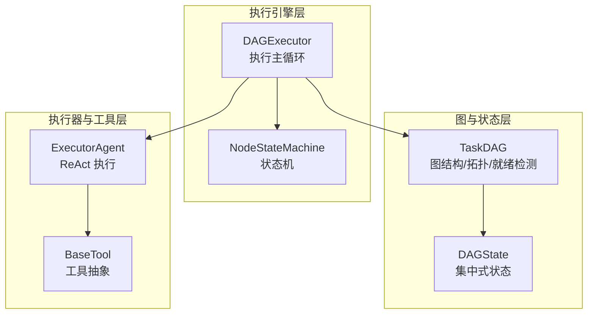
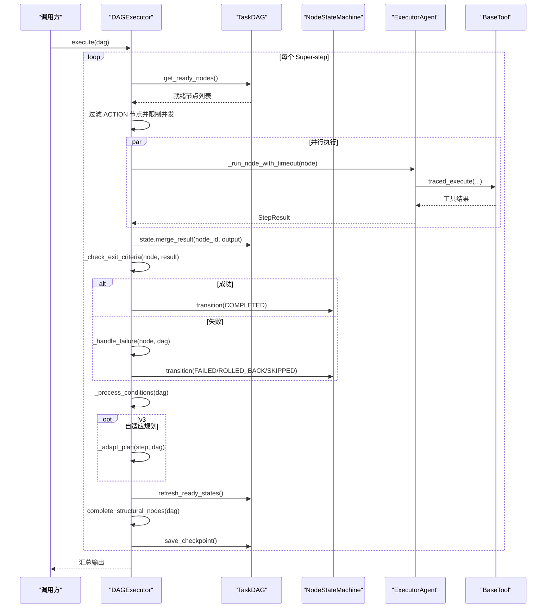
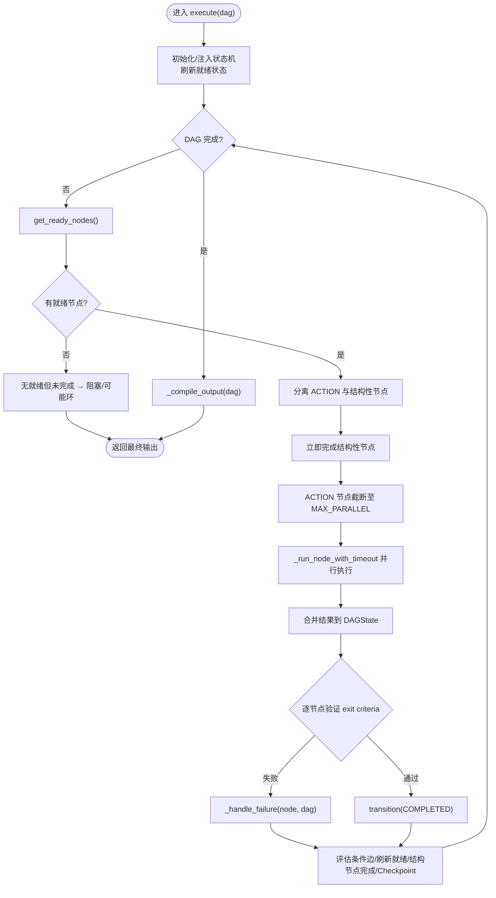
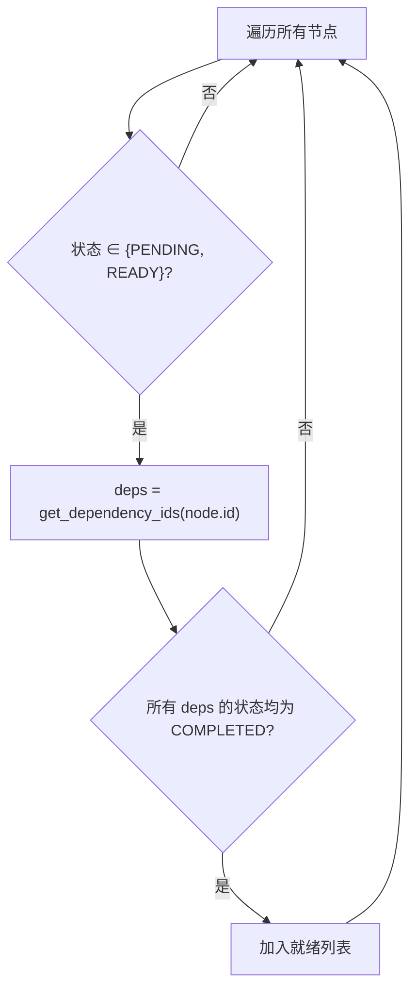
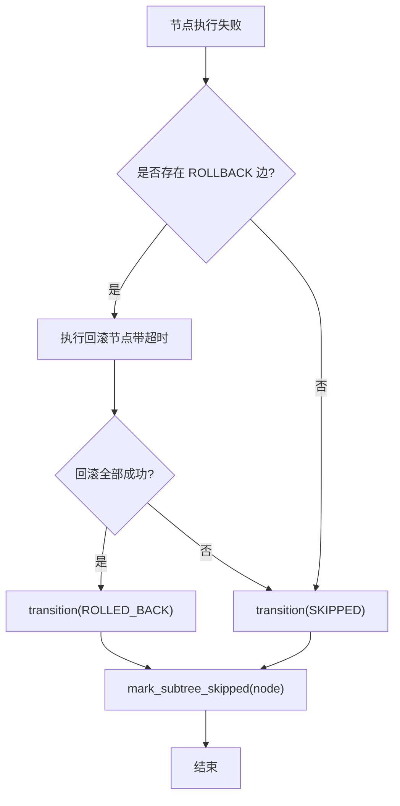
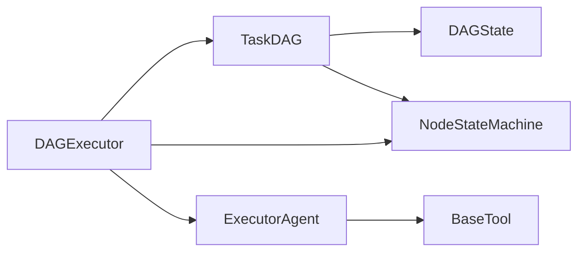

# 执行引擎

<cite>
**本文引用的文件**
- [dag/executor.py](file://dag/executor.py)
- [dag/graph.py](file://dag/graph.py)
- [dag/state_machine.py](file://dag/state_machine.py)
- [agents/executor.py](file://agents/executor.py)
- [tools/base.py](file://tools/base.py)
- [schema.py](file://schema.py)
- [config.py](file://config.py)
- [tests/test_dag_capabilities.py](file://tests/test_dag_capabilities.py)
- [README_CN.md](file://README_CN.md)
</cite>

## 目录
1. [简介](#简介)
2. [项目结构](#项目结构)
3. [核心组件](#核心组件)
4. [架构总览](#架构总览)
5. [详细组件分析](#详细组件分析)
6. [依赖关系分析](#依赖关系分析)
7. [性能考量](#性能考量)
8. [故障排查指南](#故障排查指南)
9. [结论](#结论)
10. [附录](#附录)

## 简介
本文件围绕 DAG 执行引擎，系统性解析 DAGExecutor 的执行模型与调度机制，重点涵盖：
- Super-step 并行执行的概念与实现
- 就绪节点发现算法（get_ready_nodes）的工作原理与并发调度策略
- 执行循环的控制流程（状态检查、节点执行、结果处理、状态更新）
- 失败处理与重试机制（节点重试、子树跳过、回滚操作）
- 性能监控与优化（并发控制、资源管理、错误恢复）
- 执行引擎与状态机、工具系统的集成方式与扩展接口

## 项目结构
与执行引擎直接相关的核心模块如下：
- 执行引擎：dag/executor.py
- 图与状态：dag/graph.py、dag/state_machine.py
- 执行器（ReAct）：agents/executor.py
- 工具抽象：tools/base.py
- 数据模型与配置：schema.py、config.py
- 能力测试：tests/test_dag_capabilities.py
- 项目说明：README_CN.md

图表来源
- [dag/executor.py:110-264](file://dag/executor.py#L110-L264)
- [dag/graph.py:43-81](file://dag/graph.py#L43-L81)
- [dag/state_machine.py:55-114](file://dag/state_machine.py#L55-L114)
- [agents/executor.py:66-125](file://agents/executor.py#L66-L125)
- [tools/base.py:22-75](file://tools/base.py#L22-L75)

章节来源
- [README_CN.md:122-174](file://README_CN.md#L122-L174)

## 核心组件
- DAGExecutor：执行主循环，负责 Super-step 并行、就绪节点筛选、结果合并、失败处理、条件边评估、自适应规划与 Checkpoint。
- TaskDAG：维护节点、边、集中式状态，提供就绪节点发现、拓扑排序、下游子树跳过、动态图变更等能力。
- NodeStateMachine：严格的节点状态机，保证状态转移合法性，防止非法状态。
- ExecutorAgent：ReAct 执行器，封装 LLM 与工具调用，执行 ACTION 节点。
- BaseTool：工具抽象，提供 OpenAI function schema 与可选追踪包装。

章节来源
- [dag/executor.py:62-104](file://dag/executor.py#L62-L104)
- [dag/graph.py:43-81](file://dag/graph.py#L43-L81)
- [dag/state_machine.py:55-114](file://dag/state_machine.py#L55-L114)
- [agents/executor.py:66-125](file://agents/executor.py#L66-L125)
- [tools/base.py:22-75](file://tools/base.py#L22-L75)

## 架构总览
DAGExecutor 以 Super-step 为单位，每轮：
1) 从 TaskDAG 发现就绪节点（依赖全部完成的 PENDING/READY）
2) 限制并发（MAX_PARALLEL_NODES）并行执行 ACTION 节点
3) 将结果写入 DAGState（集中式状态）
4) 逐节点验证 exit criteria（Reflector）
5) 失败处理：执行 ROLLBACK 节点、跳过下游子树
6) 评估 CONDITIONAL 边，动态启用/跳过分支
7) 可选：自适应规划（Planner）在超步间调整 DAG
8) 保存 Checkpoint，准备下一轮

图表来源
- [dag/executor.py:110-264](file://dag/executor.py#L110-L264)
- [dag/graph.py:101-126](file://dag/graph.py#L101-L126)
- [agents/executor.py:131-164](file://agents/executor.py#L131-L164)
- [tools/base.py:60-124](file://tools/base.py#L60-L124)

## 详细组件分析

### DAGExecutor：执行模型与调度
- Super-step 并行：通过 asyncio.gather 并行执行当前批次 ACTION 节点，return_exceptions=True 防止单节点异常影响兄弟节点。
- 并发控制：受 MAX_PARALLEL_NODES 限制，避免资源竞争。
- 结果合并：将 StepResult.output 写入 DAGState.node_results，等价于 LangGraph 的 Reducer。
- 失败处理：统一捕获异常与失败节点，执行 ROLLBACK（若有）并跳过下游子树。
- 条件边：评估 CONDITIONAL 边，满足则继续，否则 SKIPPED 并级联跳过。
- 自适应规划（v3）：按间隔与完成数触发 Planner.adapt_plan()，动态增删改 DAG。
- Checkpoint：每轮结束保存快照，支持事后调试。

图表来源
- [dag/executor.py:110-264](file://dag/executor.py#L110-L264)
- [dag/executor.py:271-310](file://dag/executor.py#L271-L310)
- [dag/executor.py:350-399](file://dag/executor.py#L350-L399)
- [dag/executor.py:405-448](file://dag/executor.py#L405-L448)
- [dag/executor.py:578-632](file://dag/executor.py#L578-L632)

章节来源
- [dag/executor.py:110-264](file://dag/executor.py#L110-L264)

### 就绪节点发现算法（get_ready_nodes）
- 输入：TaskDAG.nodes、依赖边（DEPENDENCY）
- 策略：遍历节点，若状态为 PENDING/READY 且其所有 DEPENDENCY 前置节点均为 COMPLETED，则加入就绪列表。
- 时间复杂度：O(V+E)，通过预构建反向邻接表实现。
- 并发调度：DAGExecutor 在每轮 Super-step 中调用 get_ready_nodes()，并按 MAX_PARALLEL 限制并发。

图表来源
- [dag/graph.py:101-126](file://dag/graph.py#L101-L126)
- [dag/graph.py:128-134](file://dag/graph.py#L128-L134)

章节来源
- [dag/graph.py:101-126](file://dag/graph.py#L101-L126)

### 执行循环控制流程
- 状态检查：DAGExecutor 在每轮开始检查 DAG 是否完成，以及是否存在 FAILED 节点。
- 节点执行：ExecutorAgent.execute_node() 通过 ReAct 循环执行 ACTION 节点，工具调用经 BaseTool.traced_execute() 包装。
- 结果处理：将 StepResult.output 写入 DAGState，记录 node.result。
- 状态更新：根据 exit criteria 验证结果，成功则 COMPLETED，失败则 FAILED 并进入失败处理。
- 下游推进：refresh_ready_states() 将满足依赖的 PENDING 提升为 READY，结构节点自动完成。

章节来源
- [agents/executor.py:131-164](file://agents/executor.py#L131-L164)
- [tools/base.py:60-124](file://tools/base.py#L60-L124)
- [dag/graph.py:199-213](file://dag/graph.py#L199-L213)

### 失败处理与重试机制
- 节点重试：记录单节点失败次数，超过阈值给出警告，避免 FAILED->PENDING 死循环。
- 回滚：若存在 ROLLBACK 边，执行回滚节点（通常清理/撤销），成功则标记 ROLLED_BACK，否则 SKIPPED。
- 子树跳过：mark_subtree_skipped() 通过 BFS 找到下游节点并统一跳过，防止在不完整状态继续执行。
- 终态约束：FAILED 节点必须经失败处理后转为 ROLLED_BACK 或 SKIPPED，DAG 才视为完成。

图表来源
- [dag/executor.py:350-399](file://dag/executor.py#L350-L399)
- [dag/graph.py:184-198](file://dag/graph.py#L184-L198)

章节来源
- [dag/executor.py:337-399](file://dag/executor.py#L337-L399)
- [dag/graph.py:184-198](file://dag/graph.py#L184-L198)

### 条件边评估与动态分支
- 条件边：CONDITIONAL 边仅在源节点 COMPLETED 且其结果包含指定关键词时激活目标节点。
- 匹配策略：CJK 文本使用子串匹配，拉丁文本使用词边界正则匹配，避免误匹配。
- 缓存：_processed_conditions 集合避免重复评估相同 (source,target) 对。
- 跳过：条件不满足时，目标节点 SKIPPED 并级联跳过其下游子树。

章节来源
- [dag/executor.py:405-448](file://dag/executor.py#L405-L448)
- [dag/executor.py:449-473](file://dag/executor.py#L449-L473)

### 结构性节点自动完成
- GOAL/SUBGOAL 为结构性分组，不直接执行，其状态由子节点决定。
- 当所有子节点均到达终态（COMPLETED/SKIPPED/ROLLED_BACK）时，结构节点自动完成或跳过。
- 若存在 FAILED 子节点，延迟处理，避免状态不一致。

章节来源
- [dag/executor.py:479-541](file://dag/executor.py#L479-L541)

### 输出编译与拓扑排序
- 按拓扑序汇总 ACTION 节点结果，确保输出顺序与依赖关系一致。
- 若拓扑排序不完整（可能存在环），回退到节点字典顺序。

章节来源
- [dag/executor.py:547-572](file://dag/executor.py#L547-L572)
- [dag/graph.py:219-249](file://dag/graph.py#L219-L249)

### 自适应规划（v3）
- 触发条件：间隔检查（ADAPT_PLAN_INTERVAL）、最少完成数（ADAPT_PLAN_MIN_COMPLETED）、有待执行节点。
- 触发后：Planner.adapt_plan() 返回 AdaptationResult，apply_adaptations() 应用变更（新增/修改/移除节点/边）。
- 事件通知：发出 plan_adaptation 事件，必要时广播 DAG 变更。

章节来源
- [dag/executor.py:578-632](file://dag/executor.py#L578-L632)
- [dag/graph.py:341-443](file://dag/graph.py#L341-L443)

## 依赖关系分析
- DAGExecutor 依赖 TaskDAG（就绪发现、状态合并、拓扑、动态变更、Checkpoint）、NodeStateMachine（状态校验）、ExecutorAgent（ReAct 执行）、BaseTool（工具调用）。
- TaskDAG 依赖 NodeStateMachine（状态转移）、DAGState（集中式状态）。
- ExecutorAgent 依赖 LLMClient、ToolRouter、BaseTool。
- BaseTool 提供 traced_execute 包装，支持可选追踪。

图表来源
- [dag/executor.py:87-104](file://dag/executor.py#L87-L104)
- [dag/graph.py:65-68](file://dag/graph.py#L65-L68)
- [agents/executor.py:101-125](file://agents/executor.py#L101-L125)
- [tools/base.py:74-124](file://tools/base.py#L74-L124)

章节来源
- [dag/executor.py:87-104](file://dag/executor.py#L87-L104)
- [dag/graph.py:65-68](file://dag/graph.py#L65-L68)

## 性能考量
- 并发控制
  - MAX_PARALLEL_NODES：限制每轮并发节点数，避免资源争用。
  - NODE_EXECUTION_TIMEOUT：单节点执行超时，防止卡死阻塞批次。
- 状态与数据流
  - DAGState.node_results 采用字典写入，天然无锁冲突，适合并行写入。
  - 邻接表预构建：get_ready_nodes()/topological_sort() 复杂度从 O(V*E) 降至 O(V+E)。
- 资源管理
  - MAX_CHECKPOINTS：限制内存中 Checkpoint 数量，防止长时间运行内存膨胀。
  - 工具执行超时与追踪：BaseTool.traced_execute() 提供可选追踪与参数脱敏。
- 错误恢复
  - return_exceptions=True：并行执行中单节点异常不影响其他节点。
  - 失败处理：回滚 + 子树跳过，避免无效重试。

章节来源
- [config.py:44-59](file://config.py#L44-L59)
- [dag/graph.py:82-95](file://dag/graph.py#L82-L95)
- [dag/executor.py:179-182](file://dag/executor.py#L179-L182)
- [tools/base.py:74-124](file://tools/base.py#L74-L124)

## 故障排查指南
- DAG 被阻塞
  - 现象：某轮无就绪节点但 DAG 未完成，日志提示“failed nodes blocking progress”或“possible cycle”。
  - 排查：检查 FAILED 节点、条件边未满足、依赖环。
- 节点反复失败
  - 现象：单节点失败次数累计，触发警告。
  - 排查：查看回滚是否成功、工具是否稳定、条件边是否误判。
- 条件分支未生效
  - 现象：目标节点未被激活。
  - 排查：确认 CONDITIONAL 边的 condition 关键词、源节点输出是否包含关键词。
- 结构性节点卡住
  - 现象：GOAL/SUBGOAL 无法完成。
  - 排查：确认子节点状态是否全部进入终态，是否存在 FAILED 子节点导致延迟处理。
- 自适应规划未触发
  - 现象：未按预期增删改节点。
  - 排查：检查 ADAPTIVE_PLANNING_ENABLED、ADAPT_PLAN_INTERVAL、ADAPT_PLAN_MIN_COMPLETED、已完成 ACTION 数量。

章节来源
- [dag/executor.py:134-141](file://dag/executor.py#L134-L141)
- [dag/executor.py:337-349](file://dag/executor.py#L337-L349)
- [dag/executor.py:405-448](file://dag/executor.py#L405-L448)
- [dag/executor.py:479-541](file://dag/executor.py#L479-L541)
- [dag/executor.py:578-599](file://dag/executor.py#L578-L599)

## 结论
DAGExecutor 以 Super-step 并行为核心，结合严格的节点状态机、集中式状态、条件边与回滚机制，实现了高效、可控、可扩展的 DAG 执行。通过自适应规划与动态图变更，系统在执行过程中持续演进，兼顾鲁棒性与灵活性。配合完善的性能控制与错误恢复策略，能够在复杂任务场景中稳定运行。

## 附录
- 配置参考：MAX_PARALLEL_NODES、NODE_EXECUTION_TIMEOUT、MAX_CHECKPOINTS、ADAPTIVE_PLANNING_ENABLED、ADAPT_PLAN_INTERVAL、ADAPT_PLAN_MIN_COMPLETED 等。
- 测试覆盖：能力测试包含分层规划、并行执行、条件分支与回滚、动态图变更、工具路由、自适应规划集成等场景。

章节来源
- [config.py:44-67](file://config.py#L44-L67)
- [tests/test_dag_capabilities.py:1-800](file://tests/test_dag_capabilities.py#L1-L800)