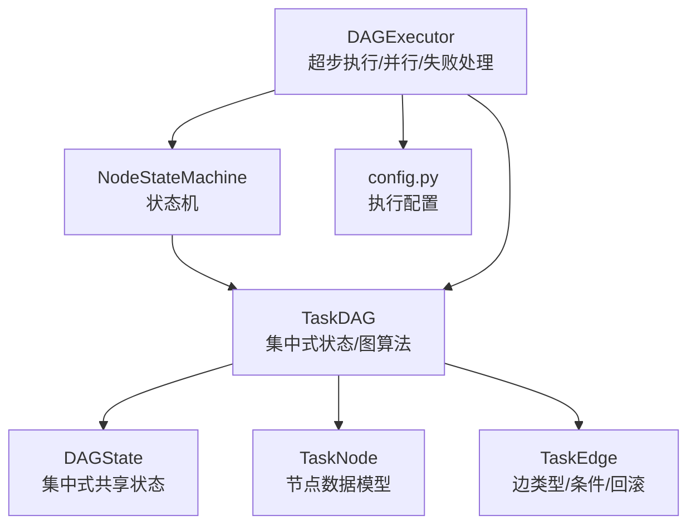
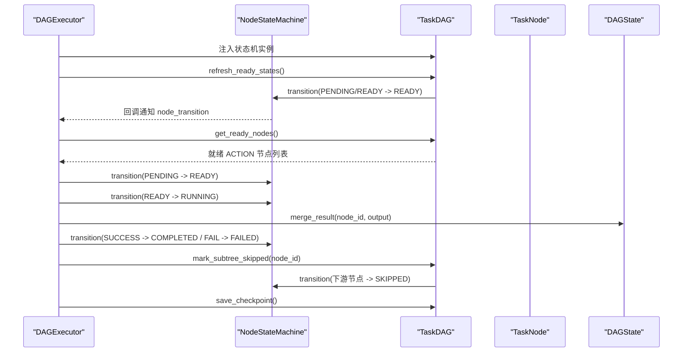
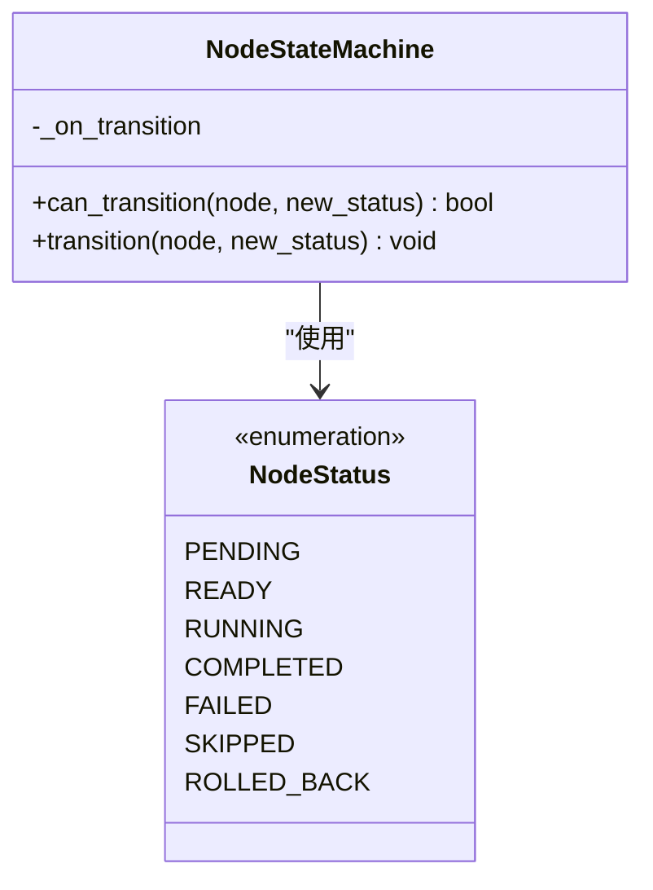
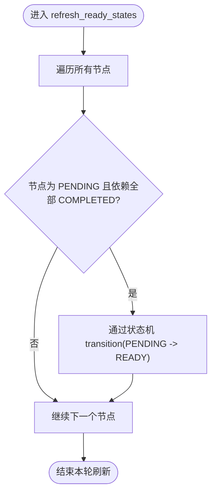
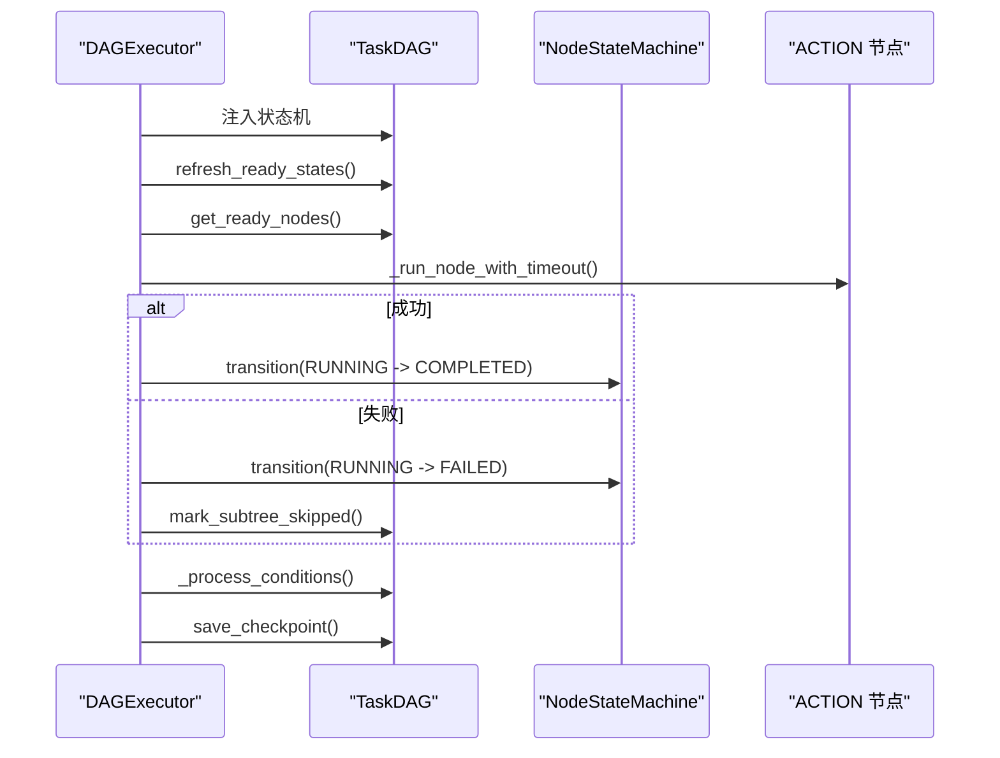
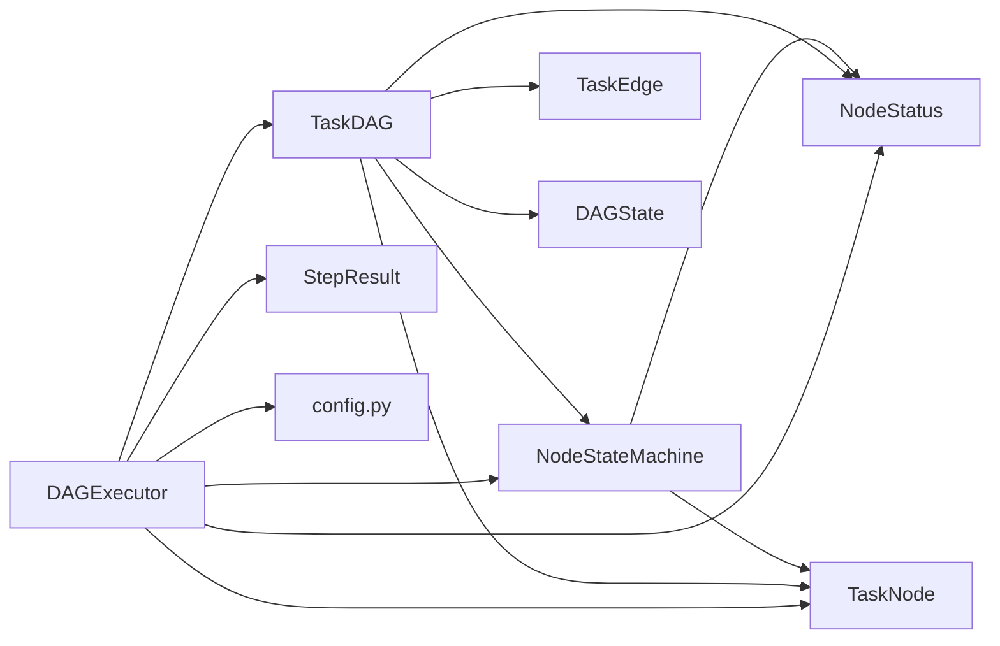

# 状态机管理

<cite>
**本文引用的文件**
- [dag/state_machine.py](file://dag/state_machine.py)
- [dag/graph.py](file://dag/graph.py)
- [dag/executor.py](file://dag/executor.py)
- [schema.py](file://schema.py)
- [config.py](file://config.py)
</cite>

## 目录
1. [简介](#简介)
2. [项目结构](#项目结构)
3. [核心组件](#核心组件)
4. [架构总览](#架构总览)
5. [详细组件分析](#详细组件分析)
6. [依赖分析](#依赖分析)
7. [性能考量](#性能考量)
8. [故障排查指南](#故障排查指南)
9. [结论](#结论)
10. [附录](#附录)

## 简介
本文件面向“状态机管理系统”，聚焦 NodeStateMachine 的设计与实现，系统性阐述节点状态枚举、状态转换规则、触发条件与约束、统一管理机制、原子性与一致性保障、调试与监控方法，以及与 DAG 执行流程的集成与性能优化策略。文档同时给出可视化图示，帮助读者快速把握状态机在 DAG 执行中的作用与行为边界。

## 项目结构
围绕状态机与 DAG 执行的关键文件如下：
- 状态机核心：NodeStateMachine（定义状态枚举与转换规则）
- DAG 图与状态：TaskDAG（集中式状态、就绪节点发现、拓扑排序、条件边、回滚、子树跳过等）
- 执行引擎：DAGExecutor（超步模型、并行执行、失败处理、条件评估、输出编译、检查点）
- 数据模型：NodeStatus、TaskNode、TaskEdge、DAGState 等
- 配置：超时、并行度、检查点上限等

图表来源
- [dag/state_machine.py:55-113](file://dag/state_machine.py#L55-L113)
- [dag/graph.py:43-81](file://dag/graph.py#L43-L81)
- [dag/executor.py:62-104](file://dag/executor.py#L62-L104)
- [schema.py:87-116](file://schema.py#L87-L116)
- [config.py:58-59](file://config.py#L58-L59)

章节来源
- [dag/state_machine.py:1-114](file://dag/state_machine.py#L1-L114)
- [dag/graph.py:1-627](file://dag/graph.py#L1-L627)
- [dag/executor.py:1-648](file://dag/executor.py#L1-L648)
- [schema.py:87-116](file://schema.py#L87-L116)
- [config.py:1-109](file://config.py#L1-L109)

## 核心组件
- NodeStateMachine：提供状态校验与应用，统一的转换入口，保证状态变更合法与可观测。
- TaskDAG：集中式 DAG 状态与图算法，封装就绪节点发现、拓扑排序、条件边、回滚、子树跳过等。
- DAGExecutor：超步模型执行器，负责并行执行、失败处理、条件评估、输出编译、检查点与自适应规划。
- NodeStatus/TaskNode/TaskEdge/DAGState：数据模型支撑状态机与 DAG 的一致性与可追踪性。

章节来源
- [dag/state_machine.py:55-113](file://dag/state_machine.py#L55-L113)
- [dag/graph.py:43-81](file://dag/graph.py#L43-L81)
- [dag/executor.py:62-104](file://dag/executor.py#L62-L104)
- [schema.py:87-116](file://schema.py#L87-L116)

## 架构总览
状态机在 DAG 执行中的位置与职责：
- 统一状态机：DAGExecutor 将自身的状态机实例注入 TaskDAG，确保 DAG 内部状态转移（如刷新就绪、子树跳过）与外部 UI/事件回调一致。
- 状态机职责：校验转换合法性、应用状态变更、触发回调（UI/日志）。
- DAG 职责：基于状态机进行就绪节点发现、拓扑排序、条件边评估、回滚与子树跳过。
- 执行器职责：超步并行执行、失败处理、条件评估、输出编译、检查点与自适应规划。

图表来源
- [dag/executor.py:110-264](file://dag/executor.py#L110-L264)
- [dag/graph.py:199-213](file://dag/graph.py#L199-L213)
- [dag/state_machine.py:88-113](file://dag/state_machine.py#L88-L113)

## 详细组件分析

### NodeStateMachine 设计与实现
- 状态枚举与转换规则
  - 节点状态：PENDING、READY、RUNNING、COMPLETED、FAILED、SKIPPED、ROLLED_BACK
  - 转移表：定义从任一状态可合法转移到的状态集合，终态不可再转移
  - 转移图（v2 版本）：PENDING→READY/ SKIPPED；READY→RUNNING/ SKIPPED；RUNNING→COMPLETED/ FAILED/ SKIPPED；FAILED→ROLLED_BACK/ SKIPPED/ PENDING；终态：COMPLETED、SKIPPED、ROLLED_BACK
- 核心方法
  - can_transition(node, new_status)：基于转移表判断合法性
  - transition(node, new_status)：非法转移抛出异常；合法则应用状态变更并触发可选回调
- 回调与可观测性
  - on_transition(node_id, old_status, new_status)：用于 UI 实时更新与日志
  - 回调异常被安全捕获并记录，不影响主流程

图表来源
- [dag/state_machine.py:55-113](file://dag/state_machine.py#L55-L113)
- [schema.py:87-106](file://schema.py#L87-L106)

章节来源
- [dag/state_machine.py:38-113](file://dag/state_machine.py#L38-L113)
- [schema.py:87-106](file://schema.py#L87-L106)

### TaskDAG 的状态管理与图算法
- 集中式状态：DAGState 作为单一真相来源，节点结果以 node_id 为键写入，避免并行写冲突
- 就绪节点发现：仅当依赖全部 COMPLETED 且节点为 PENDING/READY 时可执行
- 拓扑排序：Kahn 算法，仅考虑 DEPENDENCY 边，时间复杂度 O(V+E)，用于合法性与顺序保证
- 条件边：CONDITIONAL 边仅在源节点结果包含关键字时激活目标节点
- 回滚与子树跳过：ROLLBACK 边触发清理节点；FAILED 节点导致下游子树级联跳过
- 结构性节点自动完成：GOAL/SUBGOAL 的状态由子节点终态推导

图表来源
- [dag/graph.py:199-213](file://dag/graph.py#L199-L213)

章节来源
- [dag/graph.py:101-276](file://dag/graph.py#L101-L276)

### DAGExecutor 的超步执行与状态机集成
- 统一状态机：在 execute() 开始时将自身的状态机实例注入 DAG，确保 DAG 内部状态转移与 UI 事件一致
- 超步模型：每轮查找就绪节点（ACTION 节点），最多 MAX_PARALLEL_NODES 并行执行
- 失败处理：FAILED 节点触发回滚（若有 ROLLBACK 边）、子树跳过；失败计数用于检测重试循环
- 条件边评估：在节点完成后评估 CONDITIONAL 边，不满足则跳过目标节点及其子树
- 输出编译：按拓扑序汇总 ACTION 节点结果
- 检查点：每轮保存 DAG 快照，受 MAX_CHECKPOINTS 限制

图表来源
- [dag/executor.py:110-264](file://dag/executor.py#L110-L264)
- [dag/graph.py:405-448](file://dag/graph.py#L405-L448)

章节来源
- [dag/executor.py:110-264](file://dag/executor.py#L110-L264)
- [dag/graph.py:405-448](file://dag/graph.py#L405-L448)

### 状态转换的触发条件与约束
- 依赖满足：PENDING 节点需所有 DEPENDENCY 类前置节点均为 COMPLETED 才能成为 READY
- 执行完成：RUNNING 节点在成功与失败之间转换，成功经 exit criteria 验证后进入 COMPLETED，失败进入 FAILED
- 条件判断：CONDITIONAL 边仅在源节点结果包含关键字时激活目标节点；不满足则跳过目标及其子树
- 失败处理：FAILED 节点可回滚（ROLLBACK 边）；若回滚成功则进入 ROLLED_BACK，否则进入 SKIPPED；随后级联跳过下游子树
- 终态约束：COMPLETED、SKIPPED、ROLLED_BACK 不再发生进一步状态转移

章节来源
- [dag/graph.py:101-126](file://dag/graph.py#L101-L126)
- [dag/executor.py:206-227](file://dag/executor.py#L206-L227)
- [dag/executor.py:350-399](file://dag/executor.py#L350-L399)
- [schema.py:87-106](file://schema.py#L87-L106)

### 统一管理机制与原子性、一致性
- 统一状态机：DAGExecutor 将状态机注入 DAG，避免 DAG 内部状态转移与外部事件不一致
- 原子性：单次 transition() 在 can_transition 校验后一次性应用状态变更，异常即刻中断，保证状态机内部一致性
- 一致性：DAGState 以 node_id 为键写入，避免并行写冲突；拓扑排序与邻接表维护确保依赖关系正确
- 可观测性：状态机回调转发为 UI 事件，日志记录状态变更与异常

章节来源
- [dag/executor.py:120-124](file://dag/executor.py#L120-L124)
- [dag/state_machine.py:88-113](file://dag/state_machine.py#L88-L113)
- [dag/graph.py:521-542](file://dag/graph.py#L521-L542)

### 调试与监控方法
- 状态变更日志：状态机记录每次状态变更；执行器在关键节点事件（完成、失败、回滚、条件评估）发出事件
- 检查点：每轮保存 DAG 快照，受 MAX_CHECKPOINTS 限制；支持时间旅行调试与故障恢复
- 诊断报告：get_blockage_report 生成阻塞节点统计与阻塞来源，辅助定位依赖问题
- 配置项：NODE_EXECUTION_TIMEOUT 控制节点执行超时；MAX_CHECKPOINTS 控制内存占用

章节来源
- [dag/state_machine.py:107-113](file://dag/state_machine.py#L107-L113)
- [dag/executor.py:638-647](file://dag/executor.py#L638-L647)
- [dag/graph.py:277-312](file://dag/graph.py#L277-L312)
- [dag/graph.py:521-542](file://dag/graph.py#L521-L542)
- [config.py:58-59](file://config.py#L58-L59)

### 与 DAG 执行流程的集成与性能优化
- 邻接表优化：预构建 DEPENDENCY 边的正向/反向邻接表，将 BFS/拓扑排序复杂度从 O(V*E) 降至 O(V+E)
- 并行执行：每轮最多 MAX_PARALLEL_NODES 个 ACTION 节点并行执行，超时保护避免阻塞
- 条件边缓存：已评估的 (source, target) 对去重，避免重复计算
- 检查点策略：定期保存快照，限制内存占用；支持增量检查点（参考分析文档）

章节来源
- [dag/graph.py:82-95](file://dag/graph.py#L82-L95)
- [dag/graph.py:219-249](file://dag/graph.py#L219-L249)
- [dag/executor.py:179-182](file://dag/executor.py#L179-L182)
- [dag/executor.py:405-448](file://dag/executor.py#L405-L448)
- [.trae/documents/DAG推理执行代码深度分析与优化方案.md:547-665](file://.trae/documents/DAG推理执行代码深度分析与优化方案.md#L547-L665)

## 依赖分析
- NodeStateMachine 依赖 NodeStatus/TaskNode（来自 schema.py）
- TaskDAG 依赖 NodeStateMachine、NodeStatus、TaskNode、TaskEdge、DAGState
- DAGExecutor 依赖 TaskDAG、NodeStateMachine、NodeStatus、TaskNode、StepResult、DAGState
- 配置模块 config.py 为执行提供超时、并行度、检查点上限等参数

图表来源
- [dag/state_machine.py:25-25](file://dag/state_machine.py#L25-L25)
- [dag/graph.py:36-38](file://dag/graph.py#L36-L38)
- [dag/executor.py:49-52](file://dag/executor.py#L49-L52)
- [schema.py:87-116](file://schema.py#L87-L116)
- [config.py:58-59](file://config.py#L58-L59)

章节来源
- [dag/state_machine.py:20-25](file://dag/state_machine.py#L20-L25)
- [dag/graph.py:36-38](file://dag/graph.py#L36-L38)
- [dag/executor.py:49-52](file://dag/executor.py#L49-L52)
- [schema.py:87-116](file://schema.py#L87-L116)
- [config.py:58-59](file://config.py#L58-L59)

## 性能考量
- 图算法优化：邻接表预构建 + Kahn 拓扑排序，O(V+E) 时间复杂度
- 并行度控制：MAX_PARALLEL_NODES 限制每轮并行节点数，避免资源竞争
- 超时保护：NODE_EXECUTION_TIMEOUT 防止单节点卡死影响批次
- 检查点内存：MAX_CHECKPOINTS 限制快照数量，避免内存泄漏
- 条件边评估缓存：已评估对去重，降低重复计算

章节来源
- [dag/graph.py:82-95](file://dag/graph.py#L82-L95)
- [dag/graph.py:219-249](file://dag/graph.py#L219-L249)
- [dag/executor.py:179-182](file://dag/executor.py#L179-L182)
- [config.py:58-59](file://config.py#L58-L59)

## 故障排查指南
- 非法状态转移：InvalidTransitionError 抛出，提示当前状态与合法目标；检查转移表与调用路径
- 节点被阻塞：get_blockage_report 输出阻塞节点与阻塞来源；检查依赖是否全部终态
- 死锁检测：无就绪节点但 DAG 未完成时记录警告；若存在 FAILED 节点，记录错误日志
- 回滚失败：FAILED 节点触发回滚，若回滚部分失败则标记为 SKIPPED；检查 ROLLBACK 边与回滚节点
- 超时与异常：节点执行超时或异常被捕获并记录；必要时增加超时或修复节点逻辑

章节来源
- [dag/state_machine.py:98-102](file://dag/state_machine.py#L98-L102)
- [dag/graph.py:277-312](file://dag/graph.py#L277-L312)
- [dag/executor.py:134-141](file://dag/executor.py#L134-L141)
- [dag/executor.py:350-399](file://dag/executor.py#L350-L399)
- [dag/executor.py:296-310](file://dag/executor.py#L296-L310)

## 结论
NodeStateMachine 通过严格的转移表与统一回调，确保 DAG 执行中状态变更的合法性与可观测性；TaskDAG 与 DAGExecutor 在超步模型下协同工作，结合邻接表优化、并行执行、条件边评估与检查点机制，形成高效、稳健、可调试的执行闭环。通过统一状态机与集中式状态，系统在复杂 DAG 场景下仍能保持一致性与可预测性。

## 附录
- 关键配置项
  - NODE_EXECUTION_TIMEOUT：节点执行超时（秒）
  - MAX_CHECKPOINTS：内存中保留的最大检查点数量
  - MAX_PARALLEL_NODES：每轮最大并行节点数
- 状态机与 DAG 的交互要点
  - DAGExecutor 注入状态机，保证 DAG 内部状态转移与 UI 事件一致
  - 状态机回调用于 UI 实时更新与日志记录
  - DAGState 以 node_id 为键写入，避免并行写冲突

章节来源
- [config.py:58-59](file://config.py#L58-L59)
- [dag/executor.py:120-124](file://dag/executor.py#L120-L124)
- [dag/state_machine.py:109-113](file://dag/state_machine.py#L109-L113)
- [dag/graph.py:521-542](file://dag/graph.py#L521-L542)