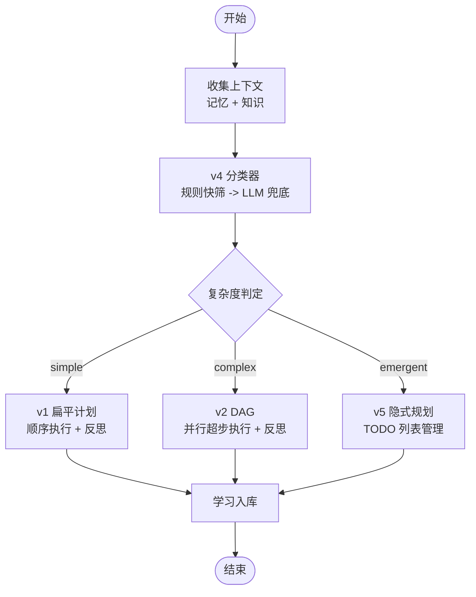
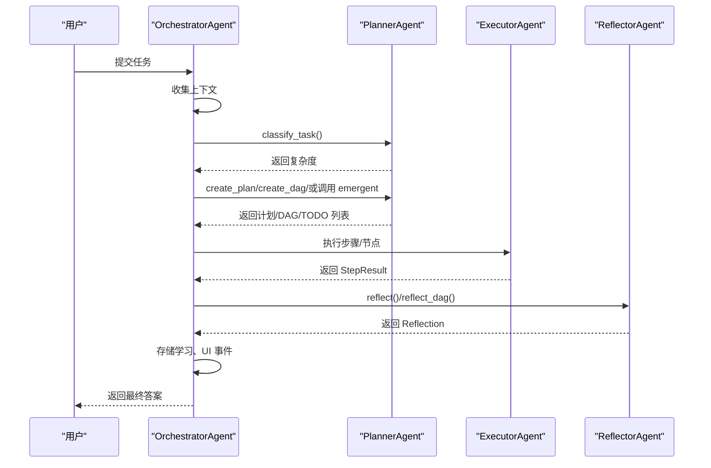
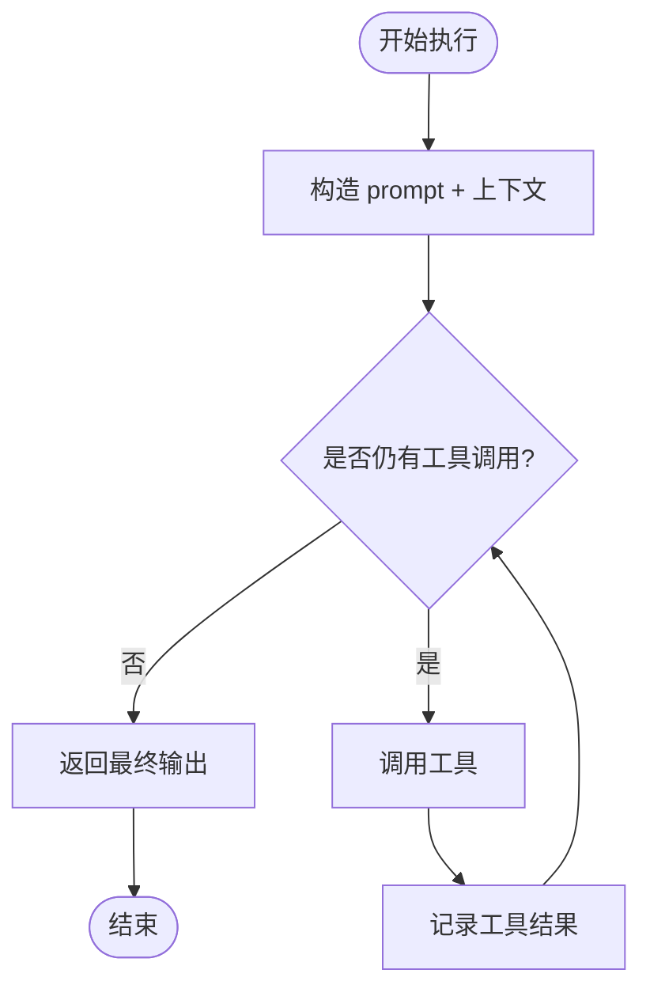
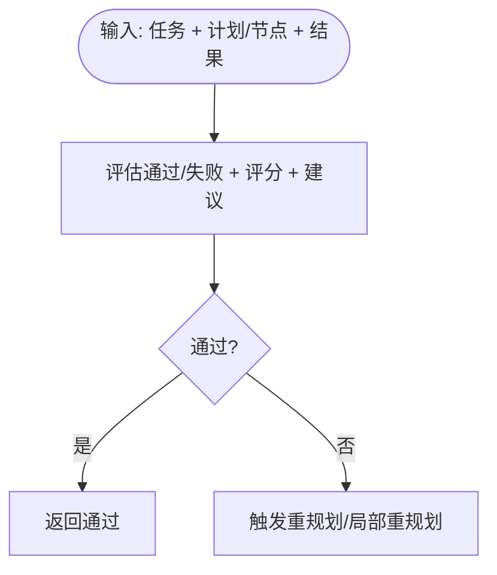
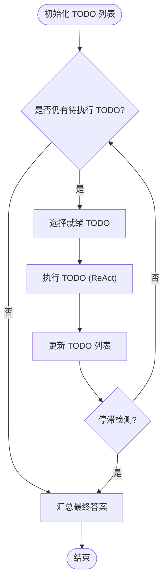
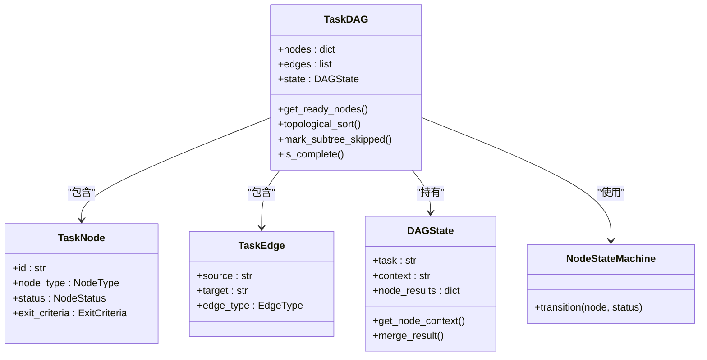
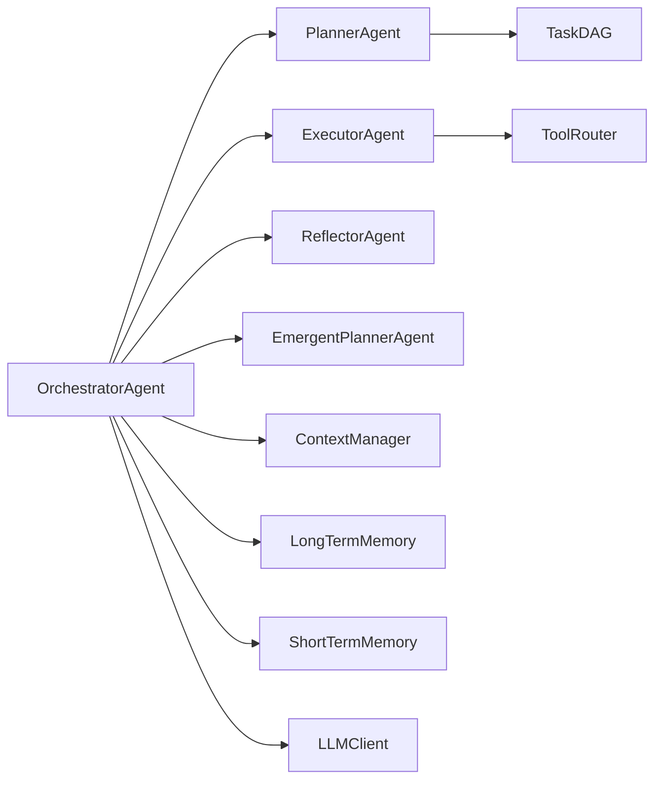

# OrchestratorAgent（协调者）

<cite>
**本文引用的文件**
- [agents/orchestrator.py](file://agents/orchestrator.py)
- [agents/planner.py](file://agents/planner.py)
- [agents/executor.py](file://agents/executor.py)
- [agents/reflector.py](file://agents/reflector.py)
- [agents/emergent_planner.py](file://agents/emergent_planner.py)
- [dag/graph.py](file://dag/graph.py)
- [dag/executor.py](file://dag/executor.py)
- [schema.py](file://schema.py)
- [config.py](file://config.py)
- [context/manager.py](file://context/manager.py)
- [memory/long_term.py](file://memory/long_term.py)
- [memory/short_term.py](file://memory/short_term.py)
- [tools/router.py](file://tools/router.py)
</cite>

## 更新摘要
**变更内容**
- 更新了部分重规划机制，现在考虑 FAILED 和 SKIPPED 节点进行局部重规划
- 改进了重规划触发逻辑，增强了日志记录和错误处理
- 更新了 DAG 执行反思流程，支持更精细的问题节点识别

## 目录
1. [简介](#简介)
2. [项目结构](#项目结构)
3. [核心组件](#核心组件)
4. [架构总览](#架构总览)
5. [详细组件分析](#详细组件分析)
6. [依赖分析](#依赖分析)
7. [性能考量](#性能考量)
8. [故障排查指南](#故障排查指南)
9. [结论](#结论)
10. [附录](#附录)

## 简介
OrchestratorAgent（协调者）是多智能体流水线的中央编排者，负责任务全生命周期管理：上下文收集、复杂度分类、路由到 v1 扁平计划、v2 DAG 分层计划或 v5 隐式规划路径、执行与反思、重规划与学习入库。其 v4 混合路由架构采用"规则快筛 + LLM 兜底"的两阶段分类机制，兼顾吞吐与准确性；事件驱动系统通过多播回调与 UI 更新策略保障可观测性与交互体验；与 Planner、Executor、Reflector、EmergentPlanner 等子智能体通过清晰的协议与数据模型协作。

**更新** 重大改进：部分重规划现在考虑 FAILED 和 SKIPPED 节点，提供更精确的局部重规划能力。

## 项目结构
本项目围绕"智能体 + 数据模型 + 执行器 + 记忆/上下文 + 工具"分层组织，OrchestratorAgent 位于顶层，协调各子智能体完成端到端任务执行。

```mermaid
graph TB
subgraph "顶层编排"
ORCH[OrchestratorAgent]
end
subgraph "子智能体"
PLAN[PlannerAgent]
EXEC[ExecutorAgent]
REF[ReflectorAgent]
EMERG[EmergentPlannerAgent]
end
subgraph "执行与图"
DAG[TaskDAG]
SM[NodeStateMachine]
END
subgraph "上下文与记忆"
CTX[ContextManager]
LTM[LongTermMemory]
STM[ShortTermMemory]
end
subgraph "工具与路由"
TOOL[Tools]
ROUTER[ToolRouter]
end
ORCH --> PLAN
ORCH --> EXEC
ORCH --> REF
ORCH --> EMERG
ORCH --> DAG
ORCH --> CTX
ORCH --> LTM
ORCH --> STM
EXEC --> ROUTER
EXEC --> TOOL
PLAN --> DAG
DAG --> SM
```

**章节来源**
- [agents/orchestrator.py:60-152](file://agents/orchestrator.py#L60-L152)
- [agents/planner.py:147-206](file://agents/planner.py#L147-L206)
- [agents/executor.py:66-125](file://agents/executor.py#L66-L125)
- [agents/reflector.py:59-83](file://agents/reflector.py#L59-L83)
- [agents/emergent_planner.py:72-128](file://agents/emergent_planner.py#L72-L128)
- [dag/graph.py:43-81](file://dag/graph.py#L43-L81)
- [context/manager.py:22-47](file://context/manager.py#L22-L47)
- [memory/long_term.py:24-36](file://memory/long_term.py#L24-L36)
- [memory/short_term.py:20-29](file://memory/short_term.py#L20-L29)
- [tools/router.py:47-74](file://tools/router.py#L47-L74)

## 核心组件
- 任务生命周期编排：上下文收集 → 复杂度分类 → 路由执行 → 反思与重规划 → 学习入库
- v4 混合路由：规则快筛（零成本）+ LLM 兜底（轻量调用）
- 事件驱动与 UI 更新：多播回调，隔离 UI 异常不影响主流程
- 记忆与知识：长期记忆与短期记忆、TF-IDF 知识检索
- 工具与路由：基于失败统计的智能工具切换

**更新** 部分重规划机制：现在考虑 FAILED 和 SKIPPED 节点，提供更精确的局部重规划能力。

**章节来源**
- [agents/orchestrator.py:158-222](file://agents/orchestrator.py#L158-L222)
- [agents/planner.py:213-259](file://agents/planner.py#L213-L259)
- [agents/executor.py:195-321](file://agents/executor.py#L195-L321)
- [agents/reflector.py:202-254](file://agents/reflector.py#L202-L254)
- [agents/emergent_planner.py:134-276](file://agents/emergent_planner.py#L134-L276)
- [memory/long_term.py:70-101](file://memory/long_term.py#L70-L101)
- [memory/short_term.py:36-67](file://memory/short_term.py#L36-L67)
- [tools/router.py:82-147](file://tools/router.py#L82-L147)

## 架构总览
v4 混合路由的两阶段分类：规则快筛在 1ms 内完成，仅对模糊区间触发 LLM 分类；执行阶段按复杂度选择 v1 扁平计划（顺序执行）、v2 DAG（并行超步执行）或 v5 隐式规划（TODO 列表管理）。反思阶段作为质量门控，失败时触发重规划或局部重规划（DAG 子树）。

**更新** 改进的重规划触发逻辑：现在会检查 FAILED 和 SKIPPED 节点，提供更精确的问题定位。



**章节来源**
- [agents/orchestrator.py:181-222](file://agents/orchestrator.py#L181-L222)
- [agents/planner.py:213-259](file://agents/planner.py#L213-L259)
- [agents/reflector.py:135-195](file://agents/reflector.py#L135-L195)
- [agents/emergent_planner.py:134-276](file://agents/emergent_planner.py#L134-L276)

## 详细组件分析

### OrchestratorAgent（协调者）
- 角色与职责
  - 生命周期编排：上下文收集、复杂度分类、路由执行、反思与重规划、学习入库
  - 事件驱动：多播回调，同时向 UI 与追踪桥发送事件
  - 记忆与知识：整合长期记忆、短期记忆与知识检索结果
  - 可选特性：目标驱动规划（v8）与统一 ReActEngine（v6.0）
- 关键流程
  - run(task)：主入口，串联上下文、分类、路由、执行、反思、存储
  - _execute_and_reflect_simple：v1 路径，顺序执行 + 重规划
  - _execute_dag_and_reflect：v2 路径，DAG 并行执行 + 局部重规划
  - _execute_emergent：v5 路径，TODO 列表管理；可选 v8 目标驱动
  - 事件发射：_emit，UI 回调隔离异常；多播桥接追踪
- 数据与模型
  - TokenUsageSummary：聚合 LLM 调用消耗
  - MemoryEntry：学习入库条目

**更新** 改进的 DAG 重规划触发逻辑：现在会检查 FAILED 和 SKIPPED 节点，提供更精确的问题定位和重规划触发。



**章节来源**
- [agents/orchestrator.py:94-152](file://agents/orchestrator.py#L94-L152)
- [agents/orchestrator.py:158-222](file://agents/orchestrator.py#L158-L222)
- [agents/orchestrator.py:257-352](file://agents/orchestrator.py#L257-L352)
- [agents/orchestrator.py:439-508](file://agents/orchestrator.py#L439-L508)
- [agents/orchestrator.py:370-432](file://agents/orchestrator.py#L370-L432)
- [agents/orchestrator.py:590-600](file://agents/orchestrator.py#L590-L600)

### PlannerAgent（规划者）
- v4 混合路由分类器
  - 规则快筛：基于长度、多步/条件/并行/动作动词等启发式打分
  - LLM 兜底：对模糊区间进行轻量 JSON 分类，确定 simple/complex/emergent
  - 可强制覆盖：PLAN_MODE
- v1 扁平计划：2-6 步顺序计划
- v2 DAG 规划：Goal/SubGoal/Action 三层结构，一次性生成
- v3 自适应规划：执行中基于已完成结果评估并调整待执行节点
- v5 隐式规划：可选，与 Orchestrator 的 v5 路由配合

**更新** 局部重规划增强：replan_subtree 现在考虑 FAILED 和 SKIPPED 节点，提供更精确的子树重规划。

```mermaid
flowchart TD
S(["输入任务"]) --> RULE["规则快筛"]
RULE --> SCORE{"得分区间"}
SCORE --> |<=-1| SIM["simple"]
SCORE --> |>=2| COM["complex"]
SCORE --> |(-1,2)| LLM["LLM 兜底分类"]
LLM --> DEC{"分类结果"}
DEC --> |simple| PLAN1["create_plan()"]
DEC --> |complex| PLAN2["create_dag()"]
DEC --> |emergent| PLAN3["可选 emergent 路由"]
```

**章节来源**
- [agents/planner.py:213-259](file://agents/planner.py#L213-L259)
- [agents/planner.py:261-327](file://agents/planner.py#L261-L327)
- [agents/planner.py:329-362](file://agents/planner.py#L329-L362)

### ExecutorAgent（执行者）
- ReAct 循环：think_with_tools → 工具调用 → observe → 反复直至完成
- v6.0 统一 ReActEngine：可选抽取式引擎，v1/v2 路径均可复用
- v3 工具路由：基于失败统计提供替代工具建议，避免死循环
- 执行节点：execute_node（DAG）与 execute_step（v1）



**章节来源**
- [agents/executor.py:131-164](file://agents/executor.py#L131-L164)
- [agents/executor.py:171-188](file://agents/executor.py#L171-L188)
- [agents/executor.py:195-321](file://agents/executor.py#L195-L321)
- [tools/router.py:82-147](file://tools/router.py#L82-L147)

### ReflectorAgent（反思者）
- v1 反思：对 v1 扁平计划结果进行质量评估与改进建议
- v2 反思（DAG）：对完整 DAG 执行进行综合评估，作为质量门控
- 逐节点完成判据验证：轻量 LLM 问答回归，失败即触发重规划



**章节来源**
- [agents/reflector.py:202-254](file://agents/reflector.py#L202-L254)
- [agents/reflector.py:135-195](file://agents/reflector.py#L135-L195)
- [agents/reflector.py:90-128](file://agents/reflector.py#L90-L128)

### EmergentPlannerAgent（隐式规划者）
- v5 隐式规划：无显式计划，通过 TODO 列表管理自然涌现
- 主循环：初始化 TODO → while 有待执行 → 选择就绪 TODO → ReAct 执行 → 更新 TODO → 汇总结果
- 质量门控：BLOCKED TODO 检测，必要时降级为复杂模式建议



**章节来源**
- [agents/emergent_planner.py:134-276](file://agents/emergent_planner.py#L134-L276)
- [agents/emergent_planner.py:465-581](file://agents/emergent_planner.py#L465-L581)

### DAG 与状态机
- TaskDAG：节点（Goal/SubGoal/Action）、边（依赖/条件/回滚）、集中式状态（DAGState）
- NodeStateMachine：统一管理节点状态转移（PENDING/READY/RUNNING/COMPLETED/FAILED/SKIPPED/ROLLED_BACK）
- 动态图变更：新增/删除节点与边、修改节点描述/完成判据、级联跳过与孤儿节点处理
- 超步并行：get_ready_nodes + 拓扑排序 + 并行执行 + 检查点

**更新** 改进的节点状态管理：FAILED 和 SKIPPED 节点现在都会被考虑在重规划触发逻辑中。



**章节来源**
- [dag/graph.py:43-81](file://dag/graph.py#L43-L81)
- [dag/graph.py:101-126](file://dag/graph.py#L101-L126)
- [dag/graph.py:219-249](file://dag/graph.py#L219-L249)
- [schema.py:157-176](file://schema.py#L157-L176)
- [schema.py:178-187](file://schema.py#L178-L187)
- [schema.py:192-253](file://schema.py#L192-L253)

## 依赖分析
- 组件耦合
  - Orchestrator 与 Planner/Executor/Reflector/EmergentPlanner：通过方法调用与数据模型解耦
  - Planner 与 DAG：规划生成 DAG，执行阶段由 DAGExecutor 驱动
  - Executor 与 ToolRouter：失败统计驱动工具切换建议
  - ContextManager 与各 Agent：统一上下文压缩，避免 Token 超限
  - Memory：长期/短期记忆与知识检索为 Planner/Executor 提供背景
- 外部依赖
  - LLMClient：统一的 LLM 调用封装，支持重试与 Token 追踪
  - TracingBridge：可选全链路追踪桥接，与 UI 多播



**章节来源**
- [agents/orchestrator.py:115-128](file://agents/orchestrator.py#L115-L128)
- [agents/planner.py:147-206](file://agents/planner.py#L147-L206)
- [agents/executor.py:66-125](file://agents/executor.py#L66-L125)
- [agents/reflector.py:59-83](file://agents/reflector.py#L59-L83)
- [agents/emergent_planner.py:72-128](file://agents/emergent_planner.py#L72-L128)
- [dag/graph.py:43-81](file://dag/graph.py#L43-L81)
- [context/manager.py:22-47](file://context/manager.py#L22-L47)
- [memory/long_term.py:24-36](file://memory/long_term.py#L24-L36)
- [memory/short_term.py:20-29](file://memory/short_term.py#L20-L29)

## 性能考量
- 规则快筛优先：v4 分类器在 1ms 内完成，仅对模糊区间触发 LLM，显著节省 Token
- DAG 并行超步：MAX_PARALLEL_NODES 控制每轮并行节点数，提升吞吐
- 上下文压缩：ContextManager 基于 LLM 摘要在超限时压缩旧消息，保留最近对话
- 工具路由降噪：连续失败阈值触发替代工具建议，减少无效重试
- 检查点与回滚：DAG 支持检查点与子树回滚，降低失败成本
- Token 追踪：LLM 调用汇总统计，便于成本控制与优化

**更新** 改进的重规划性能：考虑 FAILED 和 SKIPPED 节点的局部重规划减少了不必要的整体重规划，提高了重规划效率。

**章节来源**
- [agents/planner.py:213-259](file://agents/planner.py#L213-L259)
- [config.py:44-59](file://config.py#L44-L59)
- [context/manager.py:82-136](file://context/manager.py#L82-L136)
- [tools/router.py:101-105](file://tools/router.py#L101-L105)
- [dag/graph.py:521-542](file://dag/graph.py#L521-L542)

## 故障排查指南
- 事件驱动与 UI 更新
  - UI 回调异常被隔离，不影响主流程；多播回调确保追踪桥与 UI 同步
- 反思失败与重规划
  - v1：逐步骤重规划，保留最近一次失败结果
  - v2：现在会检查 FAILED 和 SKIPPED 节点，仅重规划失败子树，保留已完成工作
  - v5：BLOCKED TODO 质量门控，必要时建议切换到复杂模式
- 工具执行错误
  - ToolRouter 记录失败并提供替代工具建议；执行器对错误结果进行标记
- DAG 阻塞与停滞
  - get_blockage_report 诊断阻塞节点；try_recover_blocked_nodes 尝试恢复
  - EmergentPlanner 的停滞检测提前退出，避免无限循环
- 记忆与知识
  - 长期记忆检索基于关键词重叠；知识检索 TOP-K 控制召回规模

**更新** 改进的重规划触发逻辑：现在会检查 FAILED 和 SKIPPED 节点，提供更精确的问题定位和重规划触发。

**章节来源**
- [agents/orchestrator.py:570-588](file://agents/orchestrator.py#L570-L588)
- [agents/reflector.py:172-195](file://agents/reflector.py#L172-L195)
- [agents/reflector.py:233-247](file://agents/reflector.py#L233-L247)
- [agents/executor.py:282-312](file://agents/executor.py#L282-L312)
- [tools/router.py:91-105](file://tools/router.py#L91-L105)
- [dag/graph.py:277-312](file://dag/graph.py#L277-L312)
- [agents/emergent_planner.py:177-190](file://agents/emergent_planner.py#L177-L190)
- [memory/long_term.py:79-101](file://memory/long_term.py#L79-L101)

## 结论
OrchestratorAgent 通过 v4 混合路由与事件驱动架构，实现了高吞吐、可扩展、可观测的多智能体流水线。规则快筛与 LLM 兜底的两阶段分类机制在成本与准确性间取得平衡；DAG 并行与局部重规划提升了复杂任务的鲁棒性；隐式规划路径为探索性任务提供了灵活性。结合上下文压缩、工具路由与记忆系统，整体具备良好的工程化落地能力。

**更新** 重大改进：部分重规划现在考虑 FAILED 和 SKIPPED 节点，提供更精确的局部重规划能力，显著提高了重规划的准确性和效率。

## 附录
- 配置选项（节选）
  - PLAN_MODE：auto/simple/complex/emergent
  - MAX_REPLAN_ATTEMPTS：最大重规划次数
  - MAX_PARALLEL_NODES：DAG 每轮并行节点数
  - ADAPTIVE_PLANNING_ENABLED/ADAPT_PLAN_INTERVAL：自适应规划开关与间隔
  - TOOL_FAILURE_THRESHOLD：工具连续失败阈值
  - NODE_EXECUTION_TIMEOUT：节点执行超时
  - EMERGENT_PLANNING_ENABLED：隐式规划开关
  - ENABLE_REACT_ENGINE_V2：统一 ReActEngine 开关
  - TRACING_ENABLED：全链路追踪开关
- 使用示例（路径）
  - 运行 Orchestrator：[agents/orchestrator.py:158-222](file://agents/orchestrator.py#L158-L222)
  - v1 执行与反思：[agents/orchestrator.py:257-352](file://agents/orchestrator.py#L257-L352)
  - v2 DAG 执行与反思：[agents/orchestrator.py:439-508](file://agents/orchestrator.py#L439-L508)
  - v5 隐式规划：[agents/orchestrator.py:370-432](file://agents/orchestrator.py#L370-L432)
  - Planner 分类器：[agents/planner.py:213-259](file://agents/planner.py#L213-L259)
  - DAG 构建与执行：[agents/planner.py:481-506](file://agents/planner.py#L481-L506)，[dag/graph.py:549-578](file://dag/graph.py#L549-L578)
  - 执行器 ReAct 循环：[agents/executor.py:195-321](file://agents/executor.py#L195-L321)
  - 反思评估：[agents/reflector.py:135-195](file://agents/reflector.py#L135-L195)，[agents/reflector.py:202-254](file://agents/reflector.py#L202-L254)
  - 工具路由：[tools/router.py:123-147](file://tools/router.py#L123-L147)
  - 记忆与知识：[memory/long_term.py:79-101](file://memory/long_term.py#L79-L101)，[memory/short_term.py:36-67](file://memory/short_term.py#L36-L67)

**更新** 改进的重规划触发逻辑示例：现在会检查 FAILED 和 SKIPPED 节点，提供更精确的问题定位。