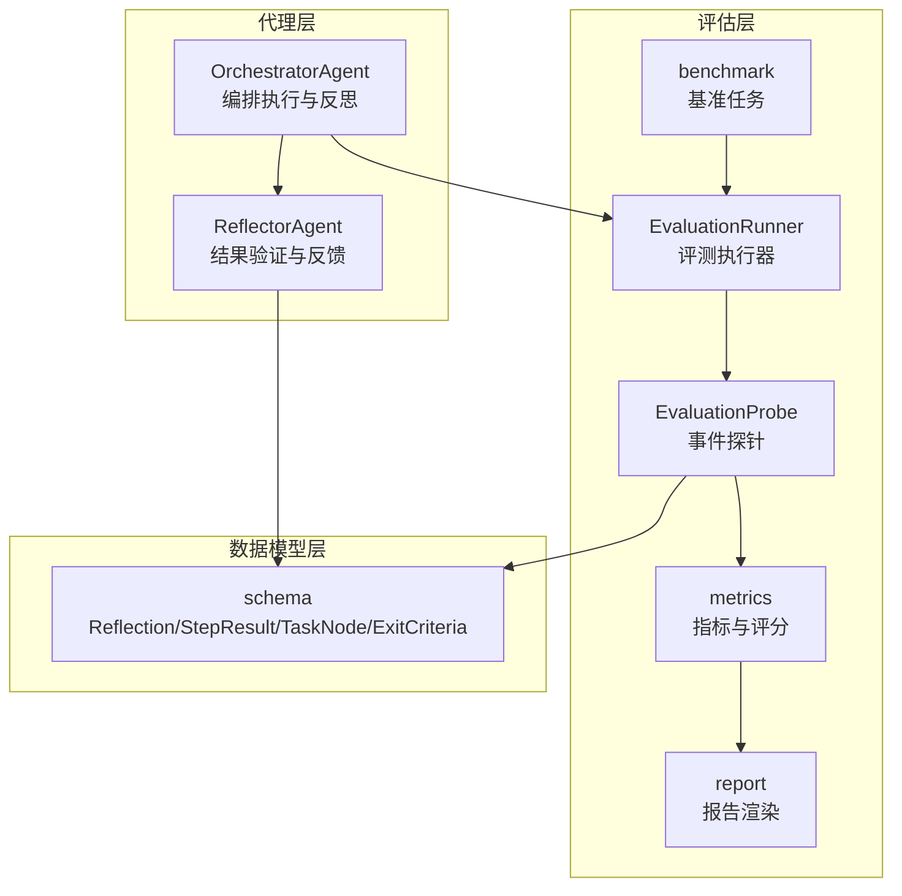
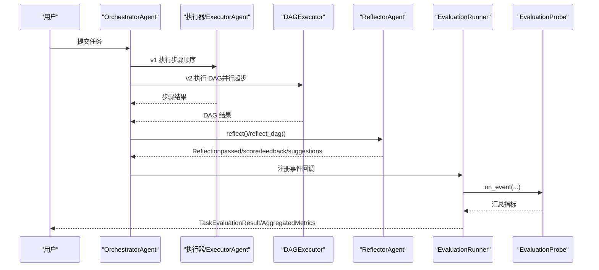
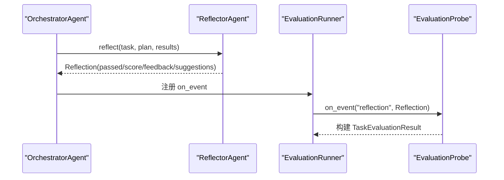
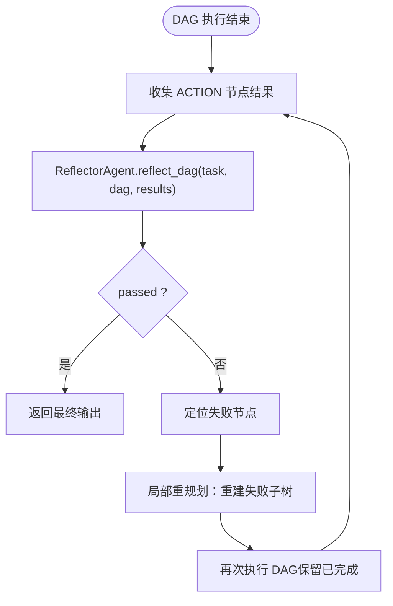
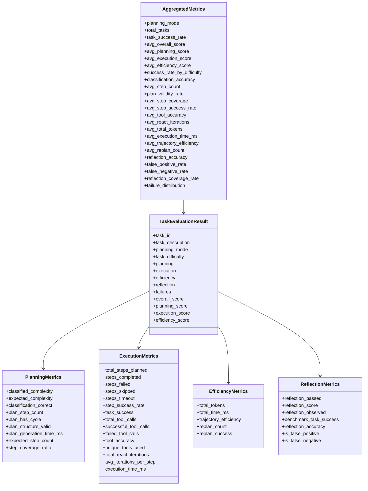
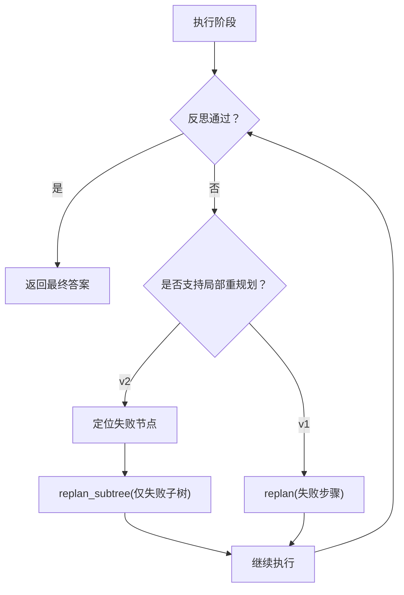
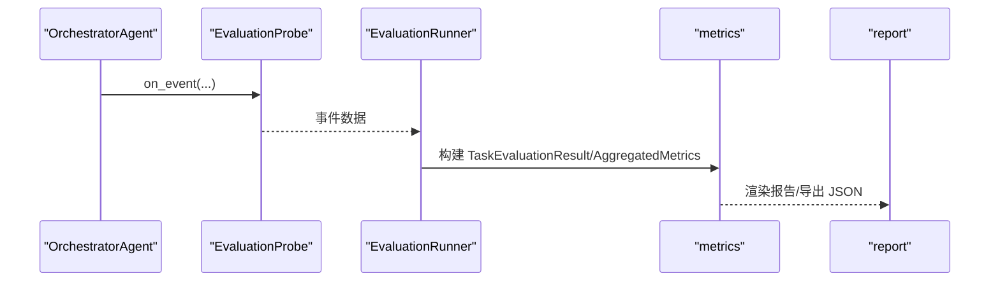
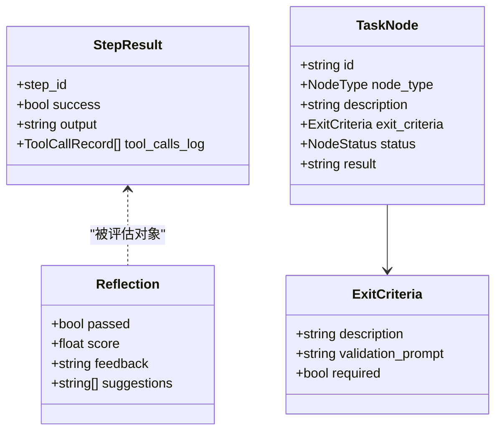
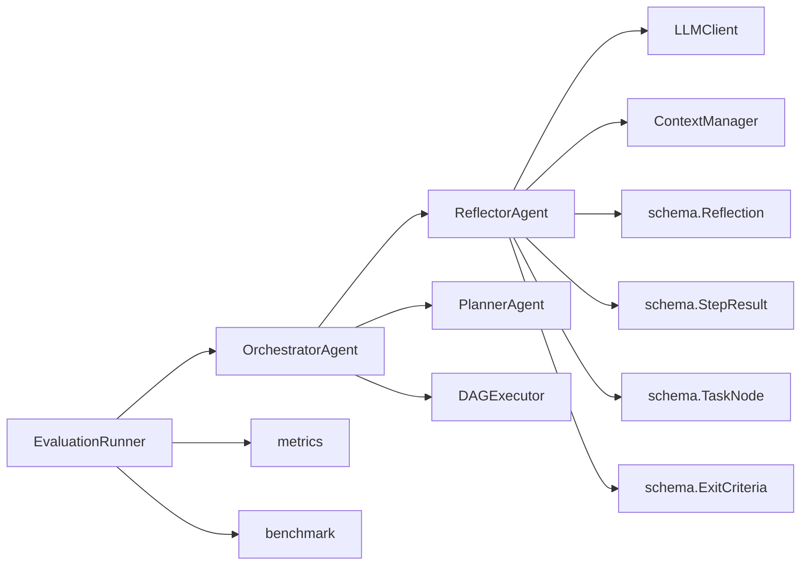

# 反思和评估

<cite>
**本文引用的文件**
- [agents/reflector.py](file://agents/reflector.py)
- [evaluation/metrics.py](file://evaluation/metrics.py)
- [evaluation/runner.py](file://evaluation/runner.py)
- [evaluation/report.py](file://evaluation/report.py)
- [evaluation/benchmark.py](file://evaluation/benchmark.py)
- [schema.py](file://schema.py)
- [agents/orchestrator.py](file://agents/orchestrator.py)
- [evaluation/eval_cli.py](file://evaluation/eval_cli.py)
- [tests/test_evaluation.py](file://tests/test_evaluation.py)
</cite>

## 目录
1. [简介](#简介)
2. [项目结构](#项目结构)
3. [核心组件](#核心组件)
4. [架构总览](#架构总览)
5. [详细组件分析](#详细组件分析)
6. [依赖分析](#依赖分析)
7. [性能考量](#性能考量)
8. [故障排查指南](#故障排查指南)
9. [结论](#结论)
10. [附录](#附录)

## 简介
本文件聚焦“反思和评估”模块，系统阐述 Manus Demo 中的反思与评估机制，包括：
- v1 简单规划的步骤级反思
- v2 DAG 的整体反思策略
- 质量评估指标体系（通过标准、评分体系与反思准确性）
- 局部重规划触发条件与决策逻辑
- 反馈信息收集与处理流程（成功案例与失败原因分析）
- 反思结果的数据结构定义与使用模式
- 评估准确性优化与反馈质量提升建议

## 项目结构
反思与评估模块横跨多个层次：
- 代理层：ReflectorAgent 负责结果验证与反馈
- 评估层：metrics 定义指标与评分；runner 收集事件并构建评测结果；report 生成报告
- 数据模型层：schema 定义 Reflection、StepResult、TaskNode、ExitCriteria 等核心结构
- 协调层：OrchestratorAgent 在执行流程中触发反思与重规划
- 基准层：benchmark 提供带参考答案的任务集合

图表来源
- [agents/orchestrator.py:60-600](file://agents/orchestrator.py#L60-L600)
- [agents/reflector.py:59-255](file://agents/reflector.py#L59-L255)
- [evaluation/runner.py:55-570](file://evaluation/runner.py#L55-L570)
- [evaluation/metrics.py:1-475](file://evaluation/metrics.py#L1-L475)
- [evaluation/report.py:1-309](file://evaluation/report.py#L1-L309)
- [evaluation/benchmark.py:1-311](file://evaluation/benchmark.py#L1-L311)
- [schema.py:368-377](file://schema.py#L368-L377)

章节来源
- [agents/orchestrator.py:60-600](file://agents/orchestrator.py#L60-L600)
- [agents/reflector.py:59-255](file://agents/reflector.py#L59-L255)
- [evaluation/runner.py:55-570](file://evaluation/runner.py#L55-L570)
- [evaluation/metrics.py:1-475](file://evaluation/metrics.py#L1-L475)
- [evaluation/report.py:1-309](file://evaluation/report.py#L1-L309)
- [evaluation/benchmark.py:1-311](file://evaluation/benchmark.py#L1-L311)
- [schema.py:368-377](file://schema.py#L368-L377)

## 核心组件
- ReflectorAgent：负责对 v1 步骤结果与 v2 DAG 结果进行质量评估，产出通过/失败判定、质量评分、反馈与改进建议，并决定是否触发重规划。
- EvaluationRunner/EvaluationProbe：在 OrchestratorAgent 的事件流上采集指标，构建 TaskEvaluationResult，并计算综合评分。
- metrics：定义 PlanningMetrics、ExecutionMetrics、EfficiencyMetrics、ReflectionMetrics、FailureRecord 等，提供评分计算与聚合逻辑。
- report：生成对比表格、按难度分布、失败分布与 JSON 导出。
- benchmark：提供带参考答案的基准任务，支撑成功与否的判定与步骤覆盖率计算。
- schema：定义 Reflection、StepResult、TaskNode、ExitCriteria 等数据结构，支撑反思与评估。

章节来源
- [agents/reflector.py:59-255](file://agents/reflector.py#L59-L255)
- [evaluation/runner.py:55-570](file://evaluation/runner.py#L55-L570)
- [evaluation/metrics.py:76-475](file://evaluation/metrics.py#L76-L475)
- [evaluation/report.py:35-309](file://evaluation/report.py#L35-L309)
- [evaluation/benchmark.py:35-311](file://evaluation/benchmark.py#L35-L311)
- [schema.py:368-377](file://schema.py#L368-L377)

## 架构总览
反思与评估在执行流程中的位置如下：

图表来源
- [agents/orchestrator.py:158-508](file://agents/orchestrator.py#L158-L508)
- [agents/reflector.py:202-255](file://agents/reflector.py#L202-L255)
- [evaluation/runner.py:440-570](file://evaluation/runner.py#L440-L570)

章节来源
- [agents/orchestrator.py:158-508](file://agents/orchestrator.py#L158-L508)
- [agents/reflector.py:202-255](file://agents/reflector.py#L202-L255)
- [evaluation/runner.py:440-570](file://evaluation/runner.py#L440-L570)

## 详细组件分析

### v1 步骤级反思（reflect）
- 触发时机：v1 执行完成后，OrchestratorAgent 调用 ReflectorAgent.reflect(task, plan, results)。
- 输入：原始任务、v1 Plan、各步骤 StepResult。
- 输出：Reflection（passed/score/feedback/suggestions）。
- 关键点：
  - 通过系统提示词约束评估维度（达成度、差距、评分、是否需要重规划）。
  - JSON 输出解析失败时，回退为 passed=false，触发重规划，避免静默失败。
  - 与 EvaluationProbe 的事件流配合，构建 TaskEvaluationResult。

图表来源
- [agents/orchestrator.py:325-351](file://agents/orchestrator.py#L325-L351)
- [agents/reflector.py:202-255](file://agents/reflector.py#L202-L255)
- [evaluation/runner.py:277-433](file://evaluation/runner.py#L277-L433)

章节来源
- [agents/orchestrator.py:257-351](file://agents/orchestrator.py#L257-L351)
- [agents/reflector.py:202-255](file://agents/reflector.py#L202-L255)
- [evaluation/runner.py:277-433](file://evaluation/runner.py#L277-L433)

### v2 DAG 整体反思（reflect_dag）
- 触发时机：DAG 执行结束后，OrchestratorAgent 调用 ReflectorAgent.reflect_dag(task, dag, results)。
- 输入：原始任务、TaskDAG、ACTION 节点的 StepResult 列表。
- 输出：Reflection。
- 关键点：
  - 逐节点 exit criteria 验证（validate_exit_criteria）：在 DAG 超步循环中对每个节点执行后进行轻量级 LLM 判断，满足即视为完成，否则触发节点失败处理。
  - 整体 DAG 反思（reflect_dag）：对 DAG 节点状态与结果进行全局评估，JSON 解析失败时回退 passed=false，触发局部重规划。
  - 局部重规划：仅重建失败子树，保留已完成工作，避免全盘重来。

图表来源
- [agents/orchestrator.py:439-508](file://agents/orchestrator.py#L439-L508)
- [agents/reflector.py:135-195](file://agents/reflector.py#L135-L195)

章节来源
- [agents/orchestrator.py:439-508](file://agents/orchestrator.py#L439-L508)
- [agents/reflector.py:89-195](file://agents/reflector.py#L89-L195)

### 质量评估指标与评分体系
- 指标维度：
  - 规划质量：分类准确性、计划结构有效性、步骤覆盖率、计划生成耗时
  - 执行质量：任务成功率、步骤成功率、工具使用准确率、ReAct 迭代效率
  - 效率：轨迹效率（score/step）、Token 消耗、执行耗时、重规划次数
  - 反思准确性：反思判定与真实任务成功的吻合度（FP/FN 率）
- 评分计算：
  - 规划评分：在分类被强制时权重重新分配，优先考虑结构与覆盖率与速度
  - 执行评分：任务成功（50%）、步骤成功率（30%）、工具准确率（20%）
  - 效率评分：轨迹效率、Token 效率、时间效率、重规划惩罚
  - 综合评分：规划×30% + 执行×40% + 效率×20% + 反思准确率×10%
- 聚合统计：按模式、难度、失败类别等维度聚合，支持导出 JSON 报告

图表来源
- [evaluation/metrics.py:76-475](file://evaluation/metrics.py#L76-L475)

章节来源
- [evaluation/metrics.py:76-475](file://evaluation/metrics.py#L76-L475)

### 局部重规划触发条件与决策逻辑
- v1：步骤失败时，OrchestratorAgent 调用 Planner.replan，保留成功步骤与最近一次失败结果，进行重规划与继续执行。
- v2：DAG 反思失败时，OrchestratorAgent 定位首个 FAILED 节点，调用 Planner.replan_subtree，仅重建失败子树，保留已完成节点与结果，再次执行。
- 事件探测：EvaluationProbe 捕获“plan_adaptation”、“Re-planning”、“Partial replan”等事件，统计重规划次数与类型。

图表来源
- [agents/orchestrator.py:481-508](file://agents/orchestrator.py#L481-L508)
- [evaluation/runner.py:426-433](file://evaluation/runner.py#L426-L433)

章节来源
- [agents/orchestrator.py:439-508](file://agents/orchestrator.py#L439-L508)
- [evaluation/runner.py:426-433](file://evaluation/runner.py#L426-L433)

### 反馈信息的收集与处理流程
- 事件驱动：EvaluationProbe 通过 on_event 接收 OrchestratorAgent 的事件，记录规划、执行、反射、重规划、工具调用、Token 使用等。
- 任务成功判定：结合基准任务 GroundTruth 的 must_include_keywords、must_not_include 与最终答案文本进行判定。
- 步骤覆盖率：英文按空白/标点切分 token，中文使用 2-gram 滑窗匹配，计算覆盖比例。
- 反思准确性：当观察到 reflection 事件时，比较 Reflection.passed 与基准任务成功状态，计算 FP/FN 与准确率。
- 报告输出：支持对比表、按难度分布、失败分布与 JSON 导出。

图表来源
- [evaluation/runner.py:55-433](file://evaluation/runner.py#L55-L433)
- [evaluation/metrics.py:393-475](file://evaluation/metrics.py#L393-L475)
- [evaluation/report.py:35-309](file://evaluation/report.py#L35-L309)

章节来源
- [evaluation/runner.py:55-433](file://evaluation/runner.py#L55-L433)
- [evaluation/metrics.py:393-475](file://evaluation/metrics.py#L393-L475)
- [evaluation/report.py:35-309](file://evaluation/report.py#L35-L309)

### 反思结果的数据结构定义与使用模式
- Reflection：包含 passed、score、feedback、suggestions，用于指导重规划与生成报告。
- StepResult：v1/v2 共用，承载单步/节点执行结果与工具调用日志。
- ExitCriteria：定义节点完成判据，validate_exit_criteria 基于此进行 LLM 验证。
- 使用模式：
  - v1：ReflectorAgent.reflect 返回 Reflection，OrchestratorAgent 根据 passed 决定是否重规划。
  - v2：ReflectorAgent.validate_exit_criteria 逐节点验证，reflect_dag 进行整体评估，失败时局部重规划。
  - 评测：EvaluationProbe 收集事件，metrics 计算评分，report 渲染结果。

图表来源
- [schema.py:368-377](file://schema.py#L368-L377)
- [schema.py:352-361](file://schema.py#L352-L361)
- [schema.py:121-142](file://schema.py#L121-L142)
- [schema.py:157-176](file://schema.py#L157-L176)

章节来源
- [schema.py:368-377](file://schema.py#L368-L377)
- [schema.py:352-361](file://schema.py#L352-L361)
- [schema.py:121-142](file://schema.py#L121-L142)
- [schema.py:157-176](file://schema.py#L157-L176)

## 依赖分析
- ReflectorAgent 依赖：
  - LLMClient：生成 JSON 结果并解析
  - ContextManager：上下文管理
  - schema.Reflection、schema.StepResult、schema.TaskNode、schema.ExitCriteria
- EvaluationRunner 依赖：
  - OrchestratorAgent 事件回调（on_event）
  - metrics：评分与聚合
  - benchmark：GroundTruth 与任务过滤
- OrchestratorAgent 依赖：
  - ReflectorAgent：反思
  - Planner/DAGExecutor：重规划与执行
  - schema：数据结构

图表来源
- [agents/reflector.py:77-83](file://agents/reflector.py#L77-L83)
- [evaluation/runner.py:454-570](file://evaluation/runner.py#L454-L570)
- [agents/orchestrator.py:116-128](file://agents/orchestrator.py#L116-L128)

章节来源
- [agents/reflector.py:77-83](file://agents/reflector.py#L77-L83)
- [evaluation/runner.py:454-570](file://evaluation/runner.py#L454-L570)
- [agents/orchestrator.py:116-128](file://agents/orchestrator.py#L116-L128)

## 性能考量
- 反思成本控制：
  - validate_exit_criteria 采用轻量级 yes/no 问题，避免昂贵的 full reflect 调用
  - reflect_dag 仅对 ACTION 节点结果进行评估，减少上下文规模
- 重规划粒度：
  - v2 局部重规划仅重建失败子树，降低重执行成本
- 评测开销：
  - EvaluationProbe 仅监听事件，不修改执行路径
  - 评分与聚合在内存中完成，避免额外 IO

## 故障排查指南
- 反思 JSON 解析失败：
  - 现象：ReflectorAgent 在解析失败时回退 passed=false，并生成建议
  - 建议：检查系统提示词格式、温度设置、输出长度限制
- 事件探测不生效：
  - 现象：重规划次数统计为 0
  - 建议：确认 on_event 回调注册、事件名称匹配（如“Re-planning”、“Partial replan”、“plan_adaptation”）
- 步骤覆盖率不准确：
  - 现象：中文任务覆盖率偏低
  - 建议：确认英文 token 切分与中文 n-gram 匹配逻辑
- 反思准确性为 0：
  - 现象：未观察到 reflection 事件
  - 建议：确认 OrchestratorAgent 是否发出“reflection”事件

章节来源
- [agents/reflector.py:171-189](file://agents/reflector.py#L171-L189)
- [evaluation/runner.py:426-433](file://evaluation/runner.py#L426-L433)
- [tests/test_evaluation.py:426-538](file://tests/test_evaluation.py#L426-L538)

## 结论
反思与评估模块通过 v1 步骤级反思与 v2 DAG 整体反思，结合完善的指标体系与事件驱动的评测流程，实现了对任务执行质量的闭环把控。validate_exit_criteria 与 reflect_dag 的协同，既保证了执行效率，又提升了结果可靠性。通过局部重规划与失败分类统计，系统能够持续优化执行策略与反馈质量。

## 附录
- 评估 CLI：支持多模式、多难度、任务筛选与 JSON 导出
- 基准任务：提供 easy/medium/hard 三档任务与参考答案，便于对比分析

章节来源
- [evaluation/eval_cli.py:93-186](file://evaluation/eval_cli.py#L93-L186)
- [evaluation/benchmark.py:78-311](file://evaluation/benchmark.py#L78-L311)