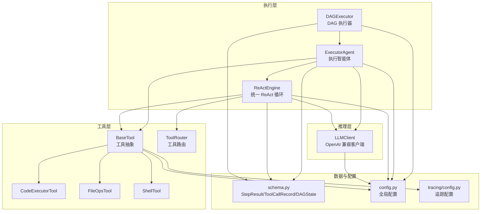
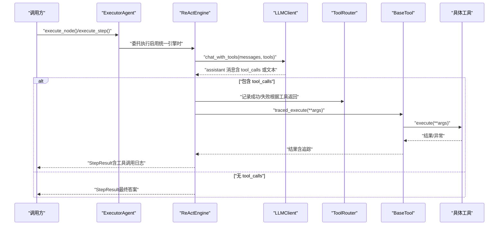
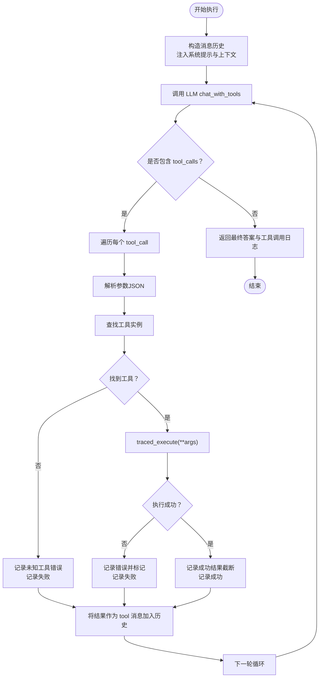
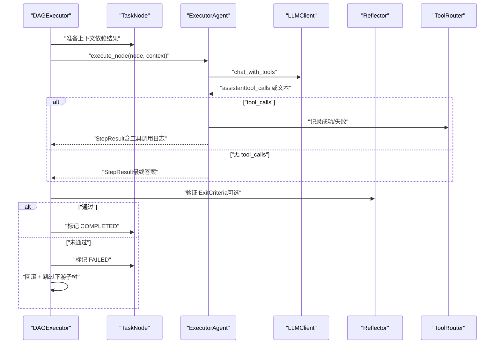
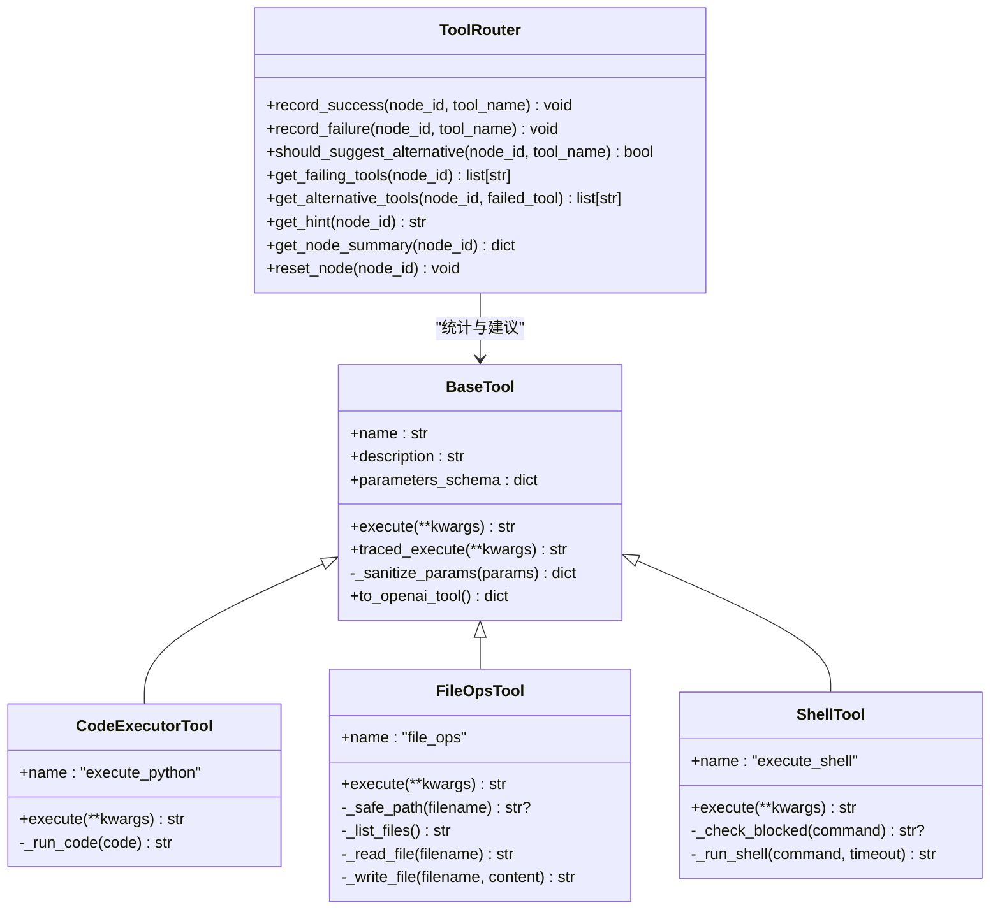
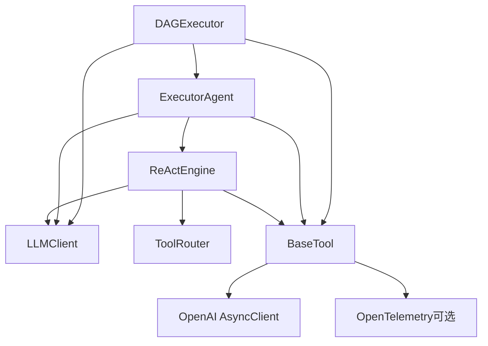

# 执行引擎

<cite>
**本文引用的文件**
- [react/engine.py](file://react/engine.py)
- [agents/executor.py](file://agents/executor.py)
- [dag/executor.py](file://dag/executor.py)
- [tools/base.py](file://tools/base.py)
- [tools/router.py](file://tools/router.py)
- [llm/client.py](file://llm/client.py)
- [schema.py](file://schema.py)
- [config.py](file://config.py)
- [tools/code_executor.py](file://tools/code_executor.py)
- [tools/file_ops.py](file://tools/file_ops.py)
- [tools/shell_tool.py](file://tools/shell_tool.py)
- [tracing/config.py](file://tracing/config.py)
- [tracing/decorators.py](file://tracing/decorators.py)
- [tests/test_real_tools.py](file://tests/test_real_tools.py)
</cite>

## 目录
1. [简介](#简介)
2. [项目结构](#项目结构)
3. [核心组件](#核心组件)
4. [架构总览](#架构总览)
5. [详细组件分析](#详细组件分析)
6. [依赖分析](#依赖分析)
7. [性能考虑](#性能考虑)
8. [故障排查指南](#故障排查指南)
9. [结论](#结论)
10. [附录](#附录)

## 简介
本文件面向“执行引擎”的技术文档，聚焦 ReAct 循环的实现与落地，涵盖推理（Reasoning）与行动（Act）两阶段的交互机制、工具调用与切换、失败处理与重试策略、执行器与工具系统的集成方式、以及监控与调试方法。文档同时提供性能优化与资源管理建议，帮助读者在保证安全性与稳定性的同时，最大化执行效率。

## 项目结构
执行引擎相关的关键模块分布如下：
- ReAct 引擎：统一的 ReAct 循环实现，负责与 LLM 的函数调用交互、工具选择与执行、结果记录与错误处理。
- 执行智能体：封装 ReAct 循环，支持传统步骤式与 DAG 节点式两种入口。
- DAG 执行器：以 Super-step 模型并行执行 TaskDAG，负责节点状态机、条件边、失败回滚与自适应规划。
- 工具系统：统一的 BaseTool 抽象、工具路由（ToolRouter）、具体工具（代码执行、文件操作、Shell 命令等）。
- LLM 客户端：统一的 OpenAI 兼容 API 封装，支持重试与追踪。
- 数据模型与配置：StepResult、ToolCallRecord、DAGState 等模型，以及全局配置与追踪配置。

图表来源
- [react/engine.py:43-246](file://react/engine.py#L43-L246)
- [agents/executor.py:66-323](file://agents/executor.py#L66-L323)
- [dag/executor.py:62-648](file://dag/executor.py#L62-L648)
- [tools/base.py:22-175](file://tools/base.py#L22-L175)
- [tools/router.py:47-168](file://tools/router.py#L47-L168)
- [llm/client.py:32-420](file://llm/client.py#L32-L420)
- [schema.py:342-361](file://schema.py#L342-L361)
- [config.py:1-109](file://config.py#L1-L109)
- [tracing/config.py:14-79](file://tracing/config.py#L14-L79)

章节来源
- [react/engine.py:43-246](file://react/engine.py#L43-L246)
- [agents/executor.py:66-323](file://agents/executor.py#L66-L323)
- [dag/executor.py:62-648](file://dag/executor.py#L62-L648)
- [tools/base.py:22-175](file://tools/base.py#L22-L175)
- [tools/router.py:47-168](file://tools/router.py#L47-L168)
- [llm/client.py:32-420](file://llm/client.py#L32-L420)
- [schema.py:342-361](file://schema.py#L342-L361)
- [config.py:1-109](file://config.py#L1-L109)
- [tracing/config.py:14-79](file://tracing/config.py#L14-L79)

## 核心组件
- ReActEngine：统一的 ReAct 循环实现，负责与 LLM 的函数调用交互、工具选择与执行、结果记录与错误处理。支持可配置的最大迭代次数、工具路由提示、工具调用记录与节点级统计。
- ExecutorAgent：封装 ReAct 循环，支持 execute_step（旧版步骤）与 execute_node（DAG 节点）两种入口；当启用统一 ReActEngine 时，委托给 ReActEngine 执行。
- DAGExecutor：以 Super-step 模型并行执行 TaskDAG，负责节点状态机、条件边评估、失败回滚与跳过、自适应规划、输出汇总与检查点。
- BaseTool：工具抽象，定义工具名称、描述、参数 Schema 与执行接口；提供 traced_execute 以支持追踪埋点。
- ToolRouter：工具路由与失败切换建议，记录每个节点的工具使用统计，提供失败阈值触发的替代工具建议。
- LLMClient：统一的 OpenAI 兼容 API 封装，支持重试与追踪；提供 chat、chat_with_tools、chat_json 三种调用方式。
- schema：定义 StepResult、ToolCallRecord、DAGState 等关键数据结构，支撑执行结果与状态管理。
- config：全局配置，包括 LLM、工具、DAG 执行、追踪等参数；支持环境变量与 .env 文件。
- 具体工具：CodeExecutorTool、FileOpsTool、ShellTool 等，提供代码执行、文件操作、Shell 命令等能力，并内置安全与并发限制。

章节来源
- [react/engine.py:43-246](file://react/engine.py#L43-L246)
- [agents/executor.py:66-323](file://agents/executor.py#L66-L323)
- [dag/executor.py:62-648](file://dag/executor.py#L62-L648)
- [tools/base.py:22-175](file://tools/base.py#L22-L175)
- [tools/router.py:47-168](file://tools/router.py#L47-L168)
- [llm/client.py:32-420](file://llm/client.py#L32-L420)
- [schema.py:342-361](file://schema.py#L342-L361)
- [config.py:1-109](file://config.py#L1-L109)

## 架构总览
执行引擎采用“分层解耦 + 统一 ReAct 循环”的设计：
- 执行层：ReActEngine 与 ExecutorAgent 负责 ReAct 循环；DAGExecutor 负责 DAG 并行执行。
- 工具层：BaseTool 抽象 + 具体工具 + ToolRouter；工具通过 traced_execute 统一接入追踪。
- 推理层：LLMClient 统一封装 LLM 调用，支持重试与追踪。
- 数据与配置：schema 提供统一的数据结构，config 提供运行参数与追踪配置。

图表来源
- [agents/executor.py:131-188](file://agents/executor.py#L131-L188)
- [react/engine.py:84-241](file://react/engine.py#L84-L241)
- [llm/client.py:125-176](file://llm/client.py#L125-L176)
- [tools/base.py:60-124](file://tools/base.py#L60-L124)
- [tools/router.py:82-105](file://tools/router.py#L82-L105)

## 详细组件分析

### ReActEngine：统一 ReAct 循环
- 核心职责
  - 维护消息历史与工具 Schema，调用 LLM 的函数调用接口，解析 tool_calls 并逐一执行。
  - 记录工具调用日志（ToolCallRecord），包含工具名、参数与结果（成功截断、错误保留全文）。
  - 通过 ToolRouter 提供失败提示，指导 LLM 在连续失败时切换工具。
  - 支持最大迭代次数限制，避免无限循环。
- 关键流程
  - 构造系统提示与用户输入，首次注入 ToolRouter 的提示（如连续失败建议）。
  - 调用 LLM 的 chat_with_tools，解析响应消息。
  - 若存在 tool_calls：解析参数、查找工具、执行 traced_execute、记录结果与错误标记、将结果以 tool 角色加入消息历史。
  - 若无 tool_calls：返回最终答案与工具调用日志。
  - 达到最大迭代次数：返回失败与工具调用日志。
- 错误处理
  - LLM 调用异常：直接返回失败与错误信息。
  - 工具未知或执行异常：记录失败并标记错误，继续下一轮循环。
- 可观测性
  - 提供 get_node_summary 获取节点级工具使用统计（调用次数、失败次数、连续失败次数、成功率）。

图表来源
- [react/engine.py:84-241](file://react/engine.py#L84-L241)
- [tools/router.py:82-105](file://tools/router.py#L82-L105)
- [tools/base.py:60-124](file://tools/base.py#L60-L124)

章节来源
- [react/engine.py:43-246](file://react/engine.py#L43-L246)
- [tools/router.py:47-168](file://tools/router.py#L47-L168)
- [tools/base.py:22-175](file://tools/base.py#L22-L175)

### ExecutorAgent：执行智能体与入口
- 入口
  - execute_step：旧版步骤式入口，支持统一 ReActEngine 与旧版循环。
  - execute_node：DAG 节点入口，委托给 ReActEngine 或旧版循环。
- 旧版循环（legacy _react_loop）
  - 与 ReActEngine 相同的工具调用与消息历史维护逻辑，但由智能体自身维护消息与工具路由。
- 统一引擎集成
  - 当 ENABLE_REACT_ENGINE_V2=true 时，ExecutorAgent 内部持有 ReActEngine 实例，execute_node/execute_step 直接委托执行。

章节来源
- [agents/executor.py:66-323](file://agents/executor.py#L66-L323)
- [config.py:80](file://config.py#L80)

### DAGExecutor：DAG 并行执行与失败处理
- Super-step 模型
  - 每轮找出 READY/PENDING 节点中依赖已满足的节点，最多 MAX_PARALLEL_NODES 个并发执行。
  - 使用 asyncio.gather 并行执行，return_exceptions=True 防止单节点异常影响其他节点。
- 结果合并与退出条件验证
  - 将结果写入 DAGState（node_results），调用 Reflector 验证退出条件（ExitCriteria）。
  - 未通过：标记 FAILED，触发失败处理；通过：标记 COMPLETED。
- 失败处理
  - 回滚：若存在 ROLLBACK 边，先执行回滚节点，根据回滚结果决定原节点状态（ROLLED_BACK 或 SKIPPED）。
  - 跳过：对失败节点的下游子树进行级联跳过（mark_subtree_skipped）。
  - 重试检测：记录单节点失败次数，超过阈值发出警告，避免 FAILED->PENDING 循环。
- 条件边
  - 评估 CONDITIONAL 边：根据源节点结果中的关键字匹配（CJK 子串匹配，拉丁词边界匹配）决定目标节点是否激活。
- 自适应规划（v3）
  - 按间隔与完成数量触发 Planner 的自适应规划，动态调整 DAG。
- 输出汇总
  - 按拓扑序汇总 ACTION 节点结果，形成最终输出。

图表来源
- [dag/executor.py:110-264](file://dag/executor.py#L110-L264)
- [dag/executor.py:271-310](file://dag/executor.py#L271-L310)
- [dag/executor.py:337-399](file://dag/executor.py#L337-L399)
- [dag/executor.py:405-473](file://dag/executor.py#L405-L473)
- [agents/executor.py:131-188](file://agents/executor.py#L131-L188)
- [llm/client.py:125-176](file://llm/client.py#L125-L176)

章节来源
- [dag/executor.py:62-648](file://dag/executor.py#L62-L648)
- [agents/executor.py:66-323](file://agents/executor.py#L66-L323)

### 工具系统：BaseTool 与 ToolRouter
- BaseTool
  - 抽象接口：name、description、parameters_schema、execute。
  - traced_execute：在 TRACING_ENABLED=true 时创建工具执行 Span，记录参数、耗时、结果大小、错误等属性；否则直接调用 execute。
  - 参数脱敏：对敏感键进行脱敏处理，避免追踪中泄露。
- ToolRouter
  - 统计：记录每个节点的工具调用次数、失败次数、连续失败次数。
  - 建议：当连续失败超过阈值（TOOL_FAILURE_THRESHOLD）时，生成提示建议替代工具。
  - 节点级重置：支持在重试前清空统计，避免跨节点污染。

图表来源
- [tools/base.py:22-175](file://tools/base.py#L22-L175)
- [tools/code_executor.py:25-102](file://tools/code_executor.py#L25-L102)
- [tools/file_ops.py:23-138](file://tools/file_ops.py#L23-L138)
- [tools/shell_tool.py:25-152](file://tools/shell_tool.py#L25-L152)
- [tools/router.py:47-168](file://tools/router.py#L47-L168)

章节来源
- [tools/base.py:22-175](file://tools/base.py#L22-L175)
- [tools/router.py:47-168](file://tools/router.py#L47-L168)
- [tools/code_executor.py:25-102](file://tools/code_executor.py#L25-L102)
- [tools/file_ops.py:23-138](file://tools/file_ops.py#L23-L138)
- [tools/shell_tool.py:25-152](file://tools/shell_tool.py#L25-L152)

### LLM 客户端：重试与追踪
- 重试机制
  - 支持指数退避重试（可配置最大重试次数与退避因子），对限流、超时、API 错误进行自动重试。
- 追踪集成
  - 为 chat、chat_with_tools、chat_json 创建 Span，记录请求参数、耗时、Token 使用、错误信息等。
  - 与工具追踪协同，形成端到端的调用链。
- Token 使用追踪
  - 记录每次调用的 prompt_tokens、completion_tokens、total_tokens，支持聚合统计。

章节来源
- [llm/client.py:32-420](file://llm/client.py#L32-L420)
- [config.py:83-85](file://config.py#L83-L85)

### 数据模型与配置
- StepResult/ToolCallRecord：统一的执行结果与工具调用记录结构，便于 UI 展示与调试。
- DAGState：集中式状态存储，按节点 ID 写入结果，避免并行写入冲突。
- 配置项：包括 LLM 参数、最大迭代次数、最大并行节点数、工具失败阈值、节点执行超时、追踪开关与导出参数等。

章节来源
- [schema.py:342-361](file://schema.py#L342-L361)
- [schema.py:192-253](file://schema.py#L192-L253)
- [config.py:1-109](file://config.py#L1-L109)

## 依赖分析
- 组件耦合
  - ReActEngine 依赖 LLMClient、ToolRouter、BaseTool；通过工具 Schema 与 traced_execute 解耦具体工具实现。
  - ExecutorAgent 与 DAGExecutor 分别依赖 ReActEngine 或自身循环，向上依赖 LLMClient 与工具系统。
  - DAGExecutor 依赖 Reflector（ExitCriteria 验证）与 NodeStateMachine（状态机）。
- 外部依赖
  - OpenAI 兼容 API（AsyncOpenAI）。
  - OpenTelemetry（可选）用于追踪埋点。
  - asyncio 并发模型用于并行执行与超时控制。

图表来源
- [react/engine.py:64-83](file://react/engine.py#L64-L83)
- [agents/executor.py:92-121](file://agents/executor.py#L92-L121)
- [dag/executor.py:87-101](file://dag/executor.py#L87-L101)
- [llm/client.py:51-54](file://llm/client.py#L51-L54)
- [tools/base.py:74-124](file://tools/base.py#L74-L124)

章节来源
- [react/engine.py:64-83](file://react/engine.py#L64-L83)
- [agents/executor.py:92-121](file://agents/executor.py#L92-L121)
- [dag/executor.py:87-101](file://dag/executor.py#L87-L101)
- [llm/client.py:51-54](file://llm/client.py#L51-L54)
- [tools/base.py:74-124](file://tools/base.py#L74-L124)

## 性能考虑
- 并发与限流
  - 工具并发：ShellTool 与 CodeExecutorTool 内置 asyncio.Semaphore 控制最大并发，避免资源争用。
  - DAG 并行：DAGExecutor 通过 MAX_PARALLEL_NODES 限制每轮并发节点数，结合 asyncio.gather 并行执行。
- 超时与稳定性
  - 节点执行超时：NODE_EXECUTION_TIMEOUT 防止单节点卡死；工具执行超时：SHELL_EXEC_TIMEOUT、CODE_EXEC_TIMEOUT。
  - LLM 重试：LLM_RETRY_ENABLED、LLM_RETRY_MAX_ATTEMPTS、LLM_RETRY_BACKOFF_FACTOR 提升鲁棒性。
- 日志与追踪
  - TRACING_ENABLED 开启时，工具与 LLM 调用均产生 Span，便于定位热点与瓶颈。
  - TRACING_MAX_ATTRIBUTE_LENGTH 限制属性长度，避免追踪系统压力过大。
- 结果截断
  - StepResult 中成功结果截断到 1000 字符，降低日志与追踪体积。

章节来源
- [config.py:44-76](file://config.py#L44-L76)
- [config.py:83-85](file://config.py#L83-L85)
- [tools/shell_tool.py:57-67](file://tools/shell_tool.py#L57-L67)
- [tools/code_executor.py:31-37](file://tools/code_executor.py#L31-L37)
- [tools/base.py:109-111](file://tools/base.py#L109-L111)
- [tracing/config.py:41](file://tracing/config.py#L41)

## 故障排查指南
- LLM 调用失败
  - 现象：StepResult.success=False，output 包含错误信息。
  - 排查：检查 LLM_BASE_URL、LLM_API_KEY、LLM_MODEL；确认 LLM_RETRY_ENABLED 与退避参数；查看 LLMClient 的重试日志。
- 工具未知或执行异常
  - 现象：工具调用日志中出现“未知工具”或“工具执行错误”，StepResult.success=False。
  - 排查：确认工具名称与 Schema 一致；检查 traced_execute 是否正确记录错误；查看 ToolRouter 的失败统计。
- 超时与阻塞
  - 现象：节点执行超时或 DAG 无进展。
  - 排查：提高 NODE_EXECUTION_TIMEOUT；检查 MAX_PARALLEL_NODES；确认工具并发上限；查看 DAGExecutor 的“无就绪节点”日志。
- 条件边与失败回滚
  - 现象：下游节点被跳过或失败后未正确回滚。
  - 排查：核对条件表达式与匹配策略；确认 ROLLBACK 边是否配置；查看 DAGExecutor 的条件评估日志。
- 追踪与调试
  - 现象：缺少调用链或属性缺失。
  - 排查：开启 TRACING_ENABLED 与 TRACING_LOG_PROMPTS；检查敏感键脱敏与属性长度限制；确认导出后端配置。

章节来源
- [react/engine.py:160-167](file://react/engine.py#L160-L167)
- [react/engine.py:193-204](file://react/engine.py#L193-L204)
- [dag/executor.py:291-310](file://dag/executor.py#L291-L310)
- [dag/executor.py:405-473](file://dag/executor.py#L405-L473)
- [llm/client.py:93-115](file://llm/client.py#L93-L115)
- [tracing/config.py:17-43](file://tracing/config.py#L17-L43)

## 结论
执行引擎通过统一的 ReAct 循环与工具系统，实现了推理与行动的高效闭环；配合 DAG 并行执行、失败回滚与自适应规划，显著提升了复杂任务的执行稳定性与扩展性。借助 LLM 与工具的追踪埋点，开发者能够获得完整的可观测性与调试能力。通过合理的并发、超时与重试策略，系统在保证安全的前提下实现了高吞吐与低延迟。

## 附录
- 测试参考
  - 真实工具调用测试：验证 CodeExecutorTool 与 FileOpsTool 的基本功能、错误处理与路径穿越防护。
- 追踪装饰器
  - traced 装饰器提供方法级追踪，支持同步与异步函数，统一属性截断与敏感键脱敏。

章节来源
- [tests/test_real_tools.py:13-110](file://tests/test_real_tools.py#L13-L110)
- [tracing/decorators.py:70-146](file://tracing/decorators.py#L70-L146)