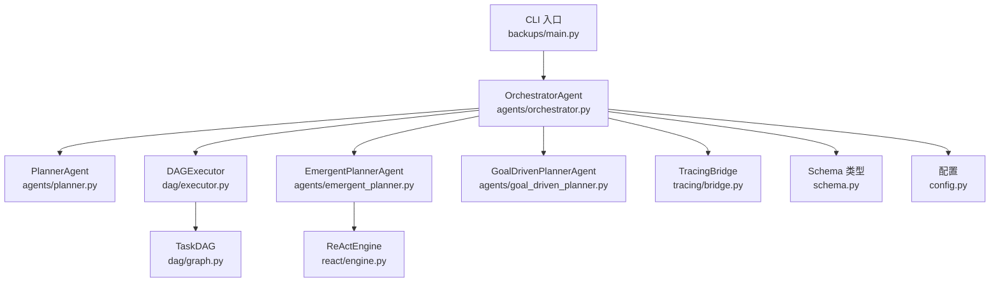
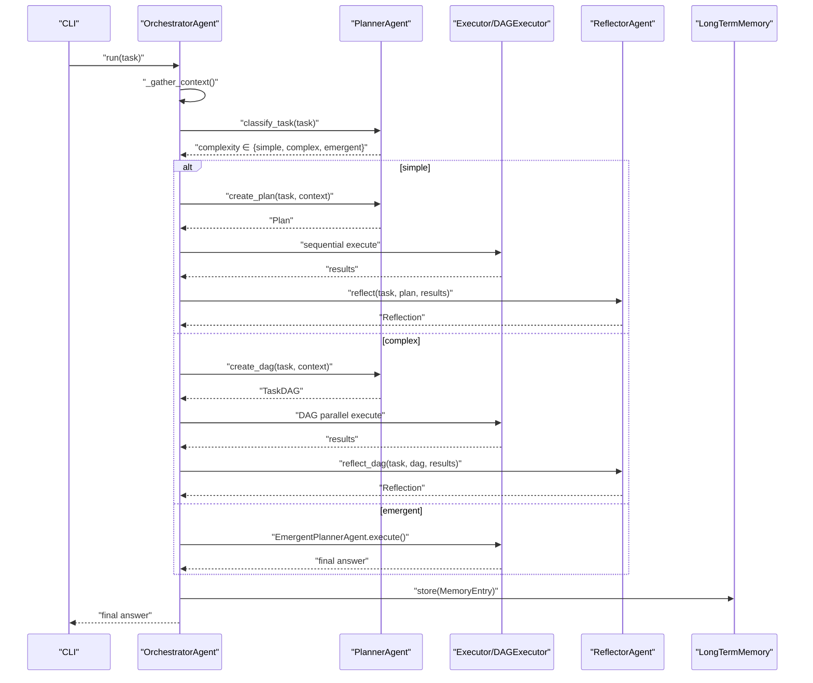
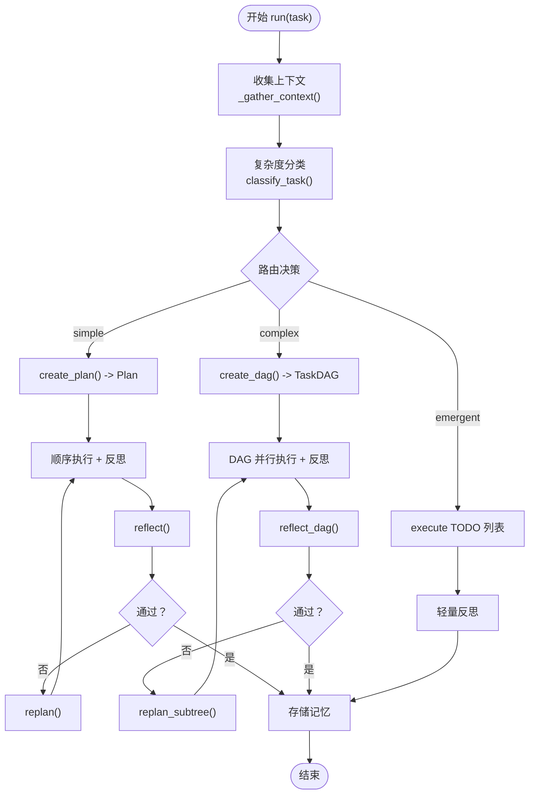
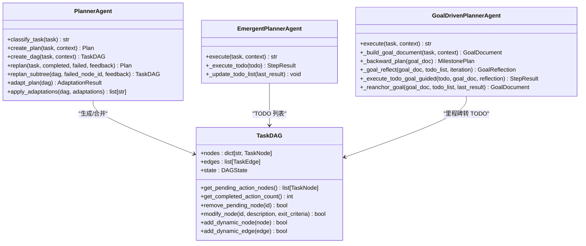
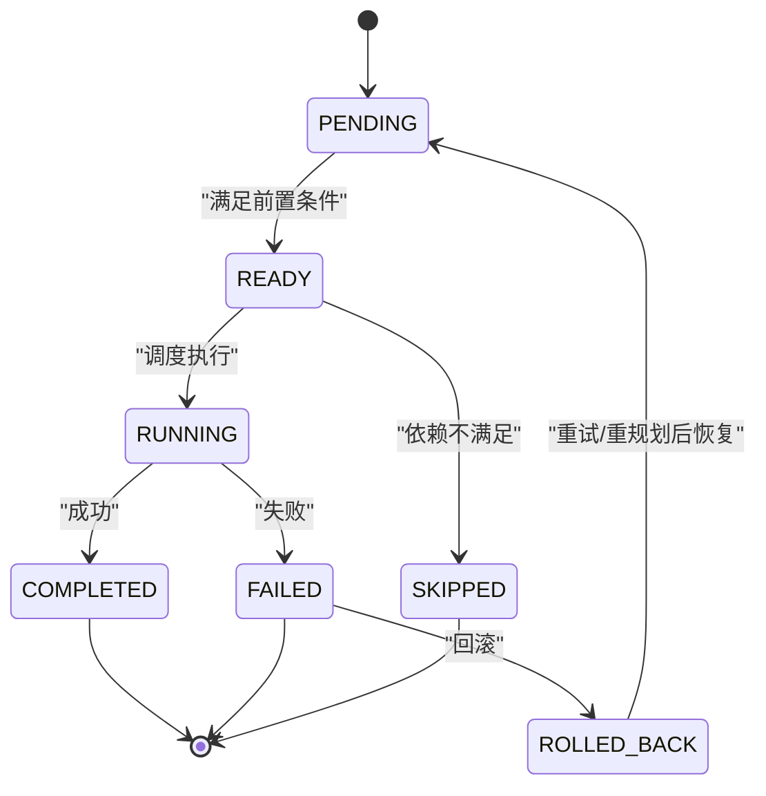
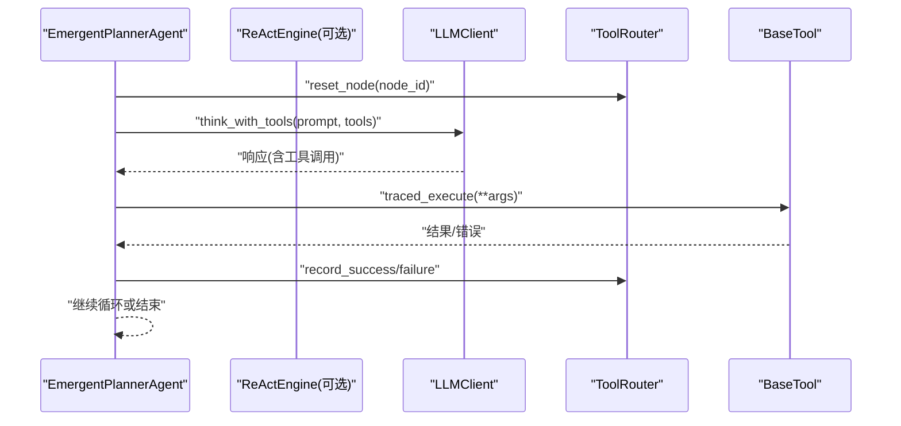
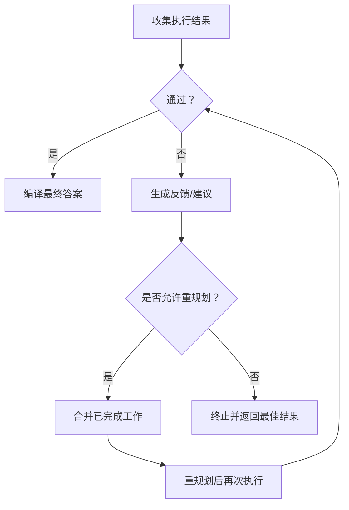
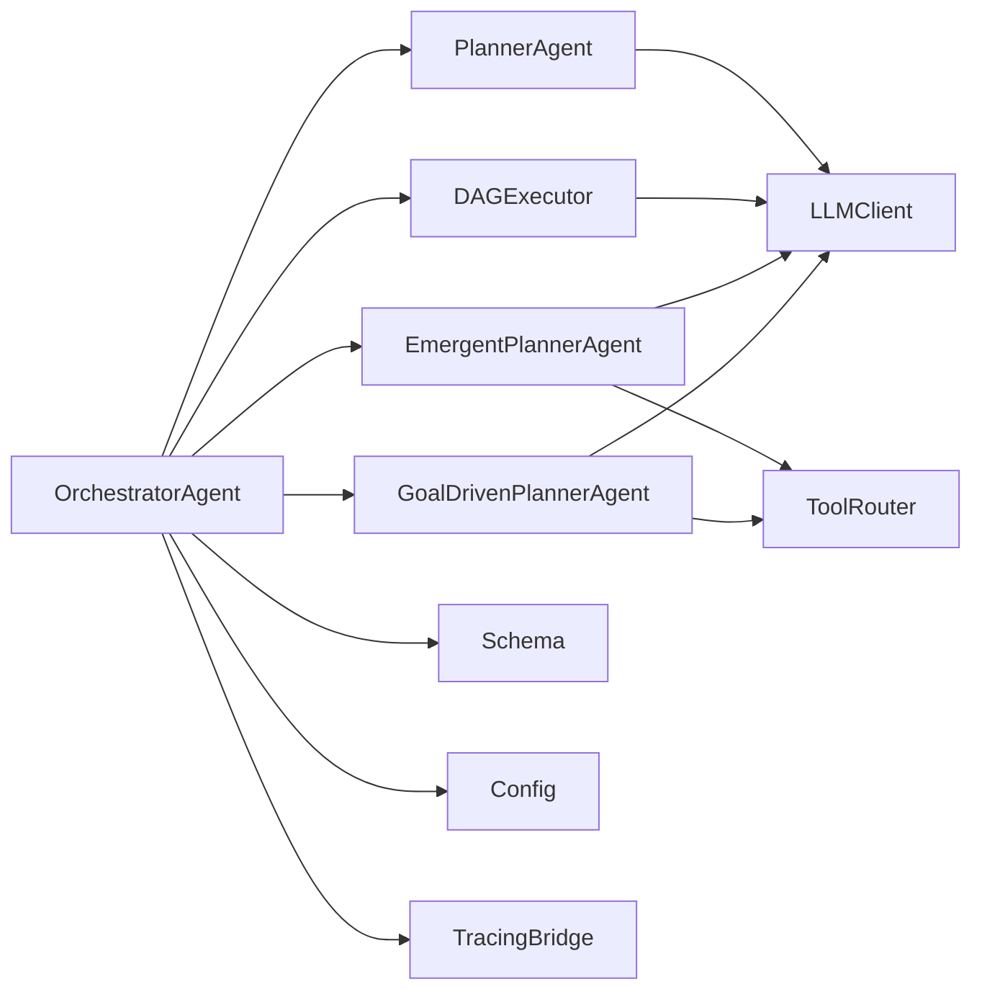

# 核心模块详解

<cite>
**本文引用的文件**
- [backups/main.py](file://backups/main.py)
- [agents/orchestrator.py](file://agents/orchestrator.py)
- [agents/planner.py](file://agents/planner.py)
- [agents/emergent_planner.py](file://agents/emergent_planner.py)
- [agents/goal_driven_planner.py](file://agents/goal_driven_planner.py)
- [dag/graph.py](file://dag/graph.py)
- [dag/executor.py](file://dag/executor.py)
- [dag/state_machine.py](file://dag/state_machine.py)
- [react/engine.py](file://react/engine.py)
- [tools/router.py](file://tools/router.py)
- [schema.py](file://schema.py)
- [config.py](file://config.py)
</cite>

## 目录
1. [引言](#引言)
2. [项目结构](#项目结构)
3. [核心组件](#核心组件)
4. [架构总览](#架构总览)
5. [详细组件分析](#详细组件分析)
6. [依赖分析](#依赖分析)
7. [性能考虑](#性能考虑)
8. [故障排查指南](#故障排查指南)
9. [结论](#结论)
10. [附录](#附录)

## 引言
本文件面向 manus_demo 的核心模块，围绕 OrchestratorAgent 的主入口与生命周期管理、任务路由与复杂度分类机制、规划系统（v1 扁平规划、v2 DAG 规划、v5 新兴规划）实现、DAG 执行引擎的数据结构与状态机、ReAct 循环与工具调用机制、反思与评估模块的质量评估方法，以及模块间依赖与交互方式进行系统化技术说明。文档同时提供流程图与序列图，帮助读者快速把握整体架构与关键路径。

## 项目结构
manus_demo 采用“多智能体 + 执行引擎 + 工具”分层组织，核心入口位于 CLI，OrchestratorAgent 作为中枢协调器，PlannerAgent 负责任务复杂度分类与规划生成，DAG 执行引擎负责并行超步执行，EmergentPlannerAgent 与 GoalDrivenPlannerAgent 提供隐式规划路径，React 引擎提供统一 ReAct 执行能力，TracingBridge 提供全链路追踪。

图表来源
- [backups/main.py:30-36](file://backups/main.py#L30-L36)
- [agents/orchestrator.py:94-141](file://agents/orchestrator.py#L94-L141)
- [agents/planner.py:147-161](file://agents/planner.py#L147-L161)
- [agents/emergent_planner.py:90-128](file://agents/emergent_planner.py#L90-L128)
- [agents/goal_driven_planner.py:205-246](file://agents/goal_driven_planner.py#L205-L246)
- [dag/executor.py:1-50](file://dag/executor.py#L1-L50)
- [dag/graph.py:1-50](file://dag/graph.py#L1-L50)
- [react/engine.py:1-50](file://react/engine.py#L1-L50)
- [schema.py:1-120](file://schema.py#L1-L120)
- [config.py:1-120](file://config.py#L1-L120)

章节来源
- [backups/main.py:17-36](file://backups/main.py#L17-L36)
- [agents/orchestrator.py:60-92](file://agents/orchestrator.py#L60-L92)

## 核心组件
- OrchestratorAgent：多智能体流水线中枢，负责上下文收集、任务复杂度分类、路由到 v1/v2/v5 规划路径、执行、反思与记忆存储。
- PlannerAgent：混合规划器，两阶段复杂度分类（规则快筛 + LLM 兜底），生成 v1 扁平计划、v2 DAG 或 v5 隐式 TODO 列表，并支持局部重规划与自适应调整。
- DAGExecutor：基于 TaskDAG 的并行超步执行引擎，管理节点状态机与条件边评估，支持部分重规划与自适应调整。
- EmergentPlannerAgent：Claude Code 风格的隐式规划，通过 TODO 列表动态演化与 ReAct 循环执行，支持统一 ReActEngine。
- GoalDrivenPlannerAgent：v8 目标驱动引擎，以终为始，逆向规划里程碑，结合目标反思与目标重锚定，维持目标一致性。
- ReactEngine：统一 ReAct 执行引擎，封装思考 + 工具调用循环，支持工具路由与超时控制。
- Schema：类型与数据模型（Plan、TaskDAG、TodoList、StepResult、Reflection 等）。
- Config：运行时配置（路由开关、迭代上限、超时、追踪开关等）。

章节来源
- [agents/orchestrator.py:60-151](file://agents/orchestrator.py#L60-L151)
- [agents/planner.py:147-206](file://agents/planner.py#L147-L206)
- [agents/emergent_planner.py:72-128](file://agents/emergent_planner.py#L72-L128)
- [agents/goal_driven_planner.py:205-246](file://agents/goal_driven_planner.py#L205-L246)
- [react/engine.py:1-50](file://react/engine.py#L1-L50)
- [schema.py:1-120](file://schema.py#L1-L120)
- [config.py:1-120](file://config.py#L1-L120)

## 架构总览
OrchestratorAgent 的混合路由架构将任务复杂度分为 simple/complex/emergent 三类，分别走 v1 扁平顺序执行、v2 DAG 并行超步执行、v5 隐式 TODO 列表管理。执行完成后进入反思阶段，若未通过则进行局部重规划（DAG）或重规划（v1），并将结果存入长期记忆。

图表来源
- [agents/orchestrator.py:158-222](file://agents/orchestrator.py#L158-L222)
- [agents/planner.py:213-259](file://agents/planner.py#L213-L259)
- [agents/emergent_planner.py:134-276](file://agents/emergent_planner.py#L134-L276)
- [agents/goal_driven_planner.py:252-380](file://agents/goal_driven_planner.py#L252-L380)

## 详细组件分析

### OrchestratorAgent：主入口与生命周期管理
- 生命周期阶段
  - 上下文收集：检索长期记忆与知识库，拼接短期上下文。
  - 复杂度分类：两阶段混合分类（规则快筛 + LLM 兜底），支持强制覆盖与禁用 emergent 降级。
  - 路由执行：simple 走 v1 扁平顺序执行；complex 走 v2 DAG 并行超步；emergent 走 v5 隐式 TODO 列表或 v8 目标驱动。
  - 反思与重规划：v1 逐步骤重规划；v2 局部子树重规划；若仍未通过，最多重试若干次。
  - 记忆存储：将任务摘要与学习存入长期记忆。
- 事件驱动 UI：通过多播回调将事件广播至 UI 与追踪桥。
- 配置开关：支持目标驱动规划器、统一 ReAct 引擎、追踪桥等特性开关。

图表来源
- [agents/orchestrator.py:158-222](file://agents/orchestrator.py#L158-L222)
- [agents/orchestrator.py:257-352](file://agents/orchestrator.py#L257-L352)
- [agents/orchestrator.py:439-508](file://agents/orchestrator.py#L439-L508)

章节来源
- [agents/orchestrator.py:94-151](file://agents/orchestrator.py#L94-L151)
- [agents/orchestrator.py:158-222](file://agents/orchestrator.py#L158-L222)
- [agents/orchestrator.py:257-352](file://agents/orchestrator.py#L257-L352)
- [agents/orchestrator.py:439-508](file://agents/orchestrator.py#L439-L508)

### 规划系统：v1 扁平规划、v2 DAG 规划、v5 新兴规划
- v1 扁平规划（simple）
  - 生成 2-6 步骤的线性计划，支持依赖检查与失败早停。
  - 执行后进行反思，若未通过则基于已完成结果与反馈重规划。
- v2 DAG 规划（complex）
  - 三层结构：Goal → SubGoals → Actions，支持风险评估、置信度、回滚策略、条件边与回滚。
  - 支持局部子树重规划（仅重建失败子树），保留已完成工作。
  - 支持执行中自适应调整（基于已完成动作与待执行动作的对比）。
- v5 新兴规划（emergent）
  - 无预定义计划，通过 TODO 列表动态演化，Claude Code 风格的 while(tool_use) 循环。
  - 支持统一 ReActEngine，具备停滞检测、超时保护与失败重试。
  - v8 目标驱动规划（可选）：以终为始，逆向规划里程碑，目标反思与目标重锚定。

图表来源
- [agents/planner.py:147-206](file://agents/planner.py#L147-L206)
- [agents/planner.py:481-506](file://agents/planner.py#L481-L506)
- [agents/planner.py:513-567](file://agents/planner.py#L513-L567)
- [agents/planner.py:573-722](file://agents/planner.py#L573-L722)
- [dag/graph.py:1-50](file://dag/graph.py#L1-L50)
- [agents/emergent_planner.py:72-128](file://agents/emergent_planner.py#L72-L128)
- [agents/goal_driven_planner.py:205-246](file://agents/goal_driven_planner.py#L205-L246)

章节来源
- [agents/planner.py:213-259](file://agents/planner.py#L213-L259)
- [agents/planner.py:369-431](file://agents/planner.py#L369-L431)
- [agents/planner.py:481-506](file://agents/planner.py#L481-L506)
- [agents/planner.py:513-567](file://agents/planner.py#L513-L567)
- [agents/planner.py:573-722](file://agents/planner.py#L573-L722)
- [agents/emergent_planner.py:134-276](file://agents/emergent_planner.py#L134-L276)
- [agents/goal_driven_planner.py:252-380](file://agents/goal_driven_planner.py#L252-L380)

### DAG 执行引擎：TaskDAG、状态机与并行执行模型
- TaskDAG 数据结构
  - 节点类型：Goal/SubGoal/Action，支持风险评估、置信度、回滚策略、条件边与回滚。
  - 边类型：依赖边、条件边；支持动态增删节点与边。
  - 状态：节点状态机（PENDING/READY/RUNNING/COMPLETED/FAILED/SKIPPED/ROLLED_BACK）。
- 状态机管理
  - 节点状态流转由 DAGExecutor 驱动，支持条件边评估与分支选择。
  - 回滚机制：失败节点可回滚，影响上游依赖与后续执行。
- 并行执行模型（超步）
  - 每轮超步选择 READY 节点并行执行，完成后评估条件边与状态迁移。
  - 支持自适应规划：在超步间评估已完成结果，决定是否调整待执行节点。

图表来源
- [dag/state_machine.py:1-120](file://dag/state_machine.py#L1-L120)
- [dag/graph.py:1-50](file://dag/graph.py#L1-L50)

章节来源
- [dag/graph.py:1-50](file://dag/graph.py#L1-L50)
- [dag/state_machine.py:1-120](file://dag/state_machine.py#L1-L120)
- [dag/executor.py:1-50](file://dag/executor.py#L1-L50)

### 执行引擎的 ReAct 循环与工具调用机制
- ReAct 循环
  - 思考 + 工具调用 + 观察 + 决策是否继续，直至达到目标或达到最大迭代。
  - 支持工具路由（ToolRouter）记录工具使用历史，失败时自动切换工具。
- 工具调用
  - 通过 OpenAI Function Calling 协议调用工具，记录工具调用日志与结果。
  - 支持 traced_execute，便于追踪与审计。
- 统一 ReActEngine（可选）
  - v6.0 提供统一 ReActEngine，封装思考 + 工具调用循环，便于复用与优化。

图表来源
- [agents/emergent_planner.py:465-581](file://agents/emergent_planner.py#L465-L581)
- [react/engine.py:1-50](file://react/engine.py#L1-L50)
- [tools/router.py:1-120](file://tools/router.py#L1-L120)

章节来源
- [agents/emergent_planner.py:465-581](file://agents/emergent_planner.py#L465-L581)
- [react/engine.py:1-50](file://react/engine.py#L1-L50)
- [tools/router.py:1-120](file://tools/router.py#L1-L120)

### 反思与评估模块：结果验证与质量评估
- v1 轻量反思：基于已完成步骤与失败步骤的汇总，给出通过/不通过、分数与反馈。
- v2 DAG 反思：基于 ACTION 节点结果进行整体评估，支持部分重规划。
- v5 轻量反思：对 TODO 列表中阻塞项进行质量门控，必要时建议切换到复杂模式。
- v8 目标驱动反思：基于目标文档与当前状态对比，给出差距分析、建议动作与进度百分比。

图表来源
- [agents/orchestrator.py:325-351](file://agents/orchestrator.py#L325-L351)
- [agents/orchestrator.py:471-507](file://agents/orchestrator.py#L471-L507)
- [agents/emergent_planner.py:424-431](file://agents/emergent_planner.py#L424-L431)
- [agents/goal_driven_planner.py:311-321](file://agents/goal_driven_planner.py#L311-L321)

章节来源
- [agents/orchestrator.py:325-351](file://agents/orchestrator.py#L325-L351)
- [agents/orchestrator.py:471-507](file://agents/orchestrator.py#L471-L507)
- [agents/emergent_planner.py:424-431](file://agents/emergent_planner.py#L424-L431)
- [agents/goal_driven_planner.py:311-321](file://agents/goal_driven_planner.py#L311-L321)

## 依赖分析
- 组件耦合
  - OrchestratorAgent 依赖 PlannerAgent、DAGExecutor、EmergentPlannerAgent、GoalDrivenPlannerAgent、ReflectorAgent、TracingBridge、Schema、Config。
  - PlannerAgent 依赖 LLMClient、ContextManager、TaskDAG、Schema。
  - DAGExecutor 依赖 TaskDAG、ExecutorAgent、ReflectorAgent、PlannerAgent。
  - EmergentPlannerAgent 依赖 LLMClient、ToolRouter、Tools、ReActEngine（可选）。
  - GoalDrivenPlannerAgent 依赖 LLMClient、ToolRouter、Tools、Schema。
- 外部依赖
  - LLMClient：统一的 LLM 调用接口与 JSON/工具调用封装。
  - Tools：WebSearch、CodeExecutor、FileOps、ShellTool 等工具集合。
  - TracingBridge：全链路追踪桥接，与 UI 事件多播共存。

图表来源
- [agents/orchestrator.py:94-141](file://agents/orchestrator.py#L94-L141)
- [agents/planner.py:147-206](file://agents/planner.py#L147-L206)
- [agents/emergent_planner.py:90-128](file://agents/emergent_planner.py#L90-L128)
- [agents/goal_driven_planner.py:205-246](file://agents/goal_driven_planner.py#L205-L246)
- [schema.py:1-120](file://schema.py#L1-L120)
- [config.py:1-120](file://config.py#L1-L120)

章节来源
- [agents/orchestrator.py:94-141](file://agents/orchestrator.py#L94-L141)
- [agents/planner.py:147-206](file://agents/planner.py#L147-L206)
- [agents/emergent_planner.py:90-128](file://agents/emergent_planner.py#L90-L128)
- [agents/goal_driven_planner.py:205-246](file://agents/goal_driven_planner.py#L205-L246)

## 性能考虑
- 复杂度分类优化
  - 规则快筛在 < 1ms 内完成，仅对模糊区间触发 LLM 分类，显著节省 token 与延迟。
- 执行并行化
  - DAG 超步并行执行，提升吞吐；条件边评估与状态机迁移需避免热点依赖。
- 工具调用与路由
  - ToolRouter 记录工具使用历史，失败时自动切换，减少无效尝试。
- 上下文管理
  - ContextManager 与有界消息窗口（v8 目标驱动）控制上下文长度，避免 OOM。
- 超时与重试
  - 节点执行超时与 TODO 失败重试上限，防止长时间卡死。
- 日志与追踪
  - 事件驱动 UI 与 TracingBridge 多播，不影响主流程，便于定位问题。

## 故障排查指南
- 常见问题
  - 任务未通过反思：查看 Reflection 的反馈与建议，确认是否需要切换到复杂模式或增加重规划次数。
  - DAG 执行失败：检查 FAILED 节点的失败原因与工具调用日志，必要时进行局部子树重规划。
  - emergent TODO 阻塞：关注 TODO 列表中的 BLOCKED 项，考虑增加重试或切换到复杂模式。
  - 目标驱动停滞：检查目标反思与 TODO 刷新频率，适当降低锚定间隔或提高刷新频率。
- 排查步骤
  - 查看 CLI 输出的事件流（任务开始、阶段切换、节点状态、条件边评估、反思结果、最终答案）。
  - 检查 LLM 调用记录与工具调用日志，定位失败环节。
  - 启用 --verbose 查看详细日志，必要时开启追踪桥。

章节来源
- [backups/main.py:108-235](file://backups/main.py#L108-L235)
- [agents/orchestrator.py:590-600](file://agents/orchestrator.py#L590-L600)
- [agents/emergent_planner.py:177-190](file://agents/emergent_planner.py#L177-L190)
- [agents/goal_driven_planner.py:293-310](file://agents/goal_driven_planner.py#L293-L310)

## 结论
manus_demo 的核心模块通过 OrchestratorAgent 的混合路由与反思闭环，实现了从简单到复杂的渐进式规划与执行。v1/v2/v5 三种规划路径覆盖不同任务复杂度，DAG 执行引擎提供强大的并行与自适应能力，ReAct 循环与工具调用机制保障执行稳定性，反思与评估模块确保质量可控。配合统一配置与事件驱动 UI，系统在可解释性、可扩展性与性能之间取得良好平衡。

## 附录
- 配置选项（节选）
  - PLAN_MODE：强制覆盖复杂度分类（simple/complex/emergent）。
  - EMERGENT_PLANNING_ENABLED：启用/禁用 v5 隐式规划。
  - ENABLE_GOAL_DRIVEN_PLANNER：启用/禁用 v8 目标驱动规划器。
  - ENABLE_REACT_ENGINE_V2：启用/禁用统一 ReActEngine。
  - MAX_REPLAN_ATTEMPTS：最大重规划次数。
  - MAX_TODO_ITEMS/MAX_TODO_RETRIES：TODO 列表规模与重试上限。
  - NODE_EXECUTION_TIMEOUT：节点执行超时时间。
  - TRACING_ENABLED：启用/禁用全链路追踪。
- 使用模式
  - 交互模式：python main.py，支持多轮对话与长期记忆累积。
  - 单任务模式：python main.py "你的任务描述"，执行完毕退出。
  - 调试模式：python main.py --verbose，查看详细日志与 LLM 调用记录。

章节来源
- [config.py:1-120](file://config.py#L1-L120)
- [backups/main.py:330-351](file://backups/main.py#L330-L351)