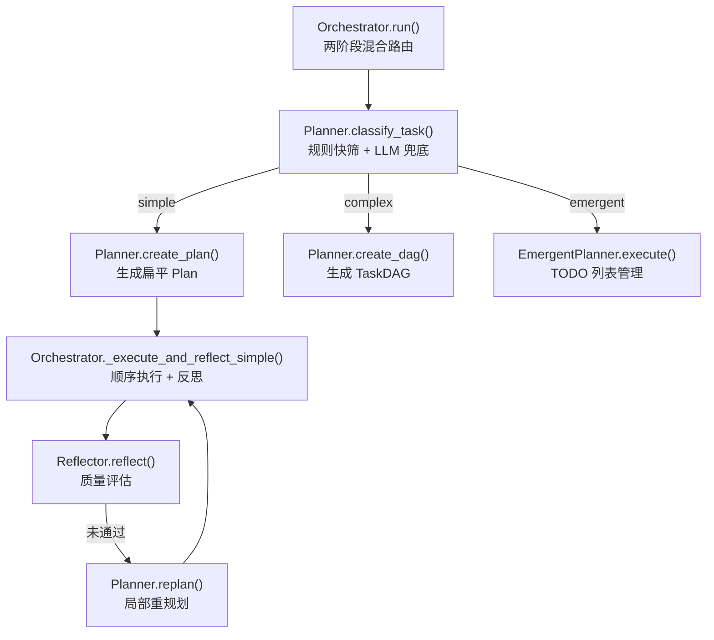
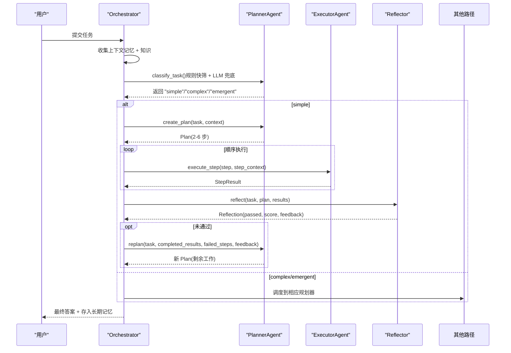
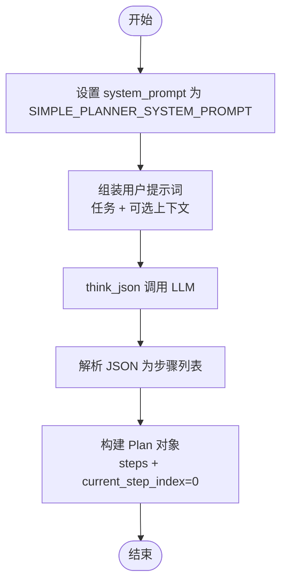
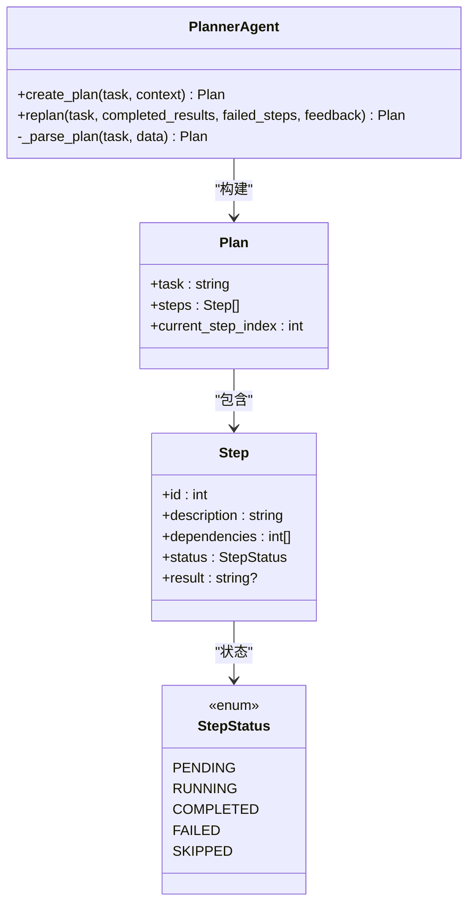
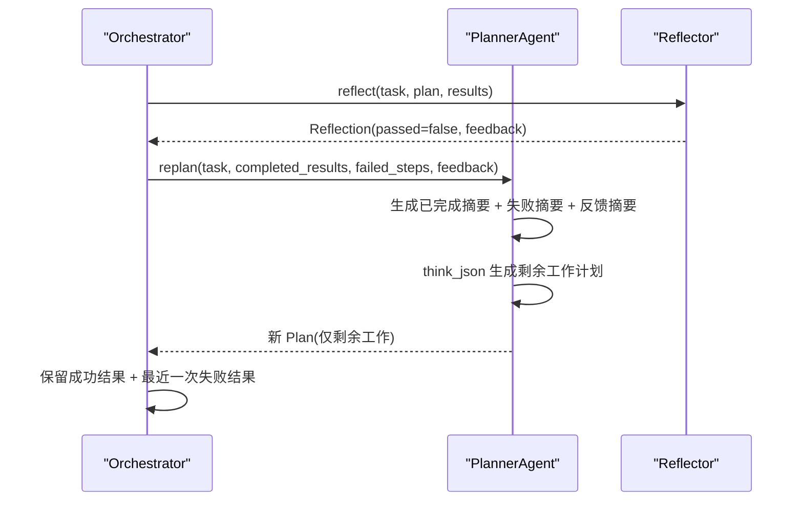
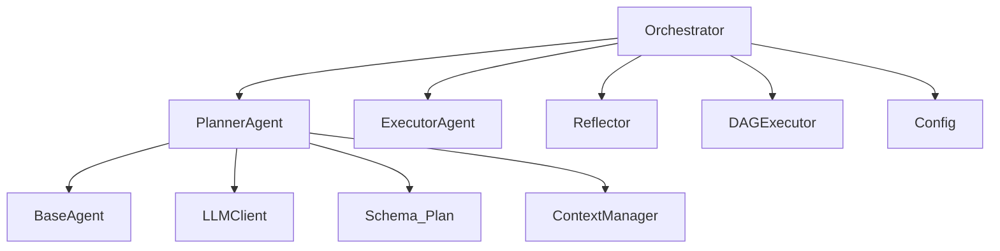

# v1简单规划（扁平步骤）

<cite>
**本文档引用的文件**
- [agents/planner.py](file://agents/planner.py)
- [agents/orchestrator.py](file://agents/orchestrator.py)
- [schema.py](file://schema.py)
- [config.py](file://config.py)
- [README_CN.md](file://README_CN.md)
</cite>

## 目录
1. [简介](#简介)
2. [项目结构](#项目结构)
3. [核心组件](#核心组件)
4. [架构概览](#架构概览)
5. [详细组件分析](#详细组件分析)
6. [依赖分析](#依赖分析)
7. [性能考虑](#性能考虑)
8. [故障排查指南](#故障排查指南)
9. [结论](#结论)

## 简介
本文件为 v1 简单规划（扁平步骤）系统的技术文档，聚焦于 2-6 步线性执行计划的设计理念、生成机制与重规划流程。v1 模式将复杂任务分解为扁平的步骤列表，步骤之间通过明确的依赖关系串联，适合简单、明确、可顺序执行的任务。本文档将深入解析以下要点：
- 扁平步骤规划的设计理念与适用场景
- 2-6 步线性执行计划的生成机制
- SIMPLE_PLANNER_SYSTEM_PROMPT 的提示词设计与约束规则
- create_plan 方法的实现细节（LLM 调用、JSON 解析、Plan 对象构建）
- replan 方法的局部重规划机制（已完成步骤摘要、失败步骤处理、反馈整合）
- 规划质量评估标准与性能优化建议

## 项目结构
v1 简单规划位于混合路由体系中的一个路径，与 v2 DAG 规划、v5 隐式规划并存。其核心流程如下：
- Orchestrator 根据任务复杂度选择路由（v4 两阶段混合分类器）
- 对于 simple 类型任务，调用 Planner.create_plan 生成扁平 Plan
- 通过 Orchestrator._execute_and_reflect_simple 顺序执行步骤
- 若反思失败，触发 Planner.replan 生成新的剩余工作计划

**图表来源**
- [agents/orchestrator.py:158-222](file://agents/orchestrator.py#L158-L222)
- [agents/planner.py:213-259](file://agents/planner.py#L213-L259)
- [agents/planner.py:369-431](file://agents/planner.py#L369-L431)

**章节来源**
- [agents/orchestrator.py:158-222](file://agents/orchestrator.py#L158-L222)
- [agents/planner.py:213-259](file://agents/planner.py#L213-L259)

## 核心组件
- PlannerAgent：负责任务复杂度分类、扁平计划生成与重规划
- Orchestrator：编排记忆检索、规划路由、执行与反思
- Schema：定义 Plan、Step、StepStatus 等数据模型
- Config：提供路由模式（PLAN_MODE）、重规划次数等配置

关键职责映射：
- Planner.create_plan：生成 2-6 步扁平计划
- Planner.replan：基于已完成结果与反馈生成剩余工作计划
- Orchestrator._execute_and_reflect_simple：顺序执行步骤并进行反思
- Schema.Plan/Step：承载 v1 计划的数据结构

**章节来源**
- [agents/planner.py:147-161](file://agents/planner.py#L147-L161)
- [agents/orchestrator.py:257-352](file://agents/orchestrator.py#L257-L352)
- [schema.py:59-67](file://schema.py#L59-L67)

## 架构概览
v1 简单规划在混合路由体系中的位置与交互如下：

**图表来源**
- [agents/orchestrator.py:158-222](file://agents/orchestrator.py#L158-L222)
- [agents/orchestrator.py:257-352](file://agents/orchestrator.py#L257-L352)
- [agents/planner.py:369-431](file://agents/planner.py#L369-L431)

## 详细组件分析

### 扁平步骤规划的设计理念与适用场景
- 设计理念
  - 2-6 步线性列表：步骤数量有限，逻辑清晰，便于顺序执行
  - 明确依赖：通过 step.dependencies 指定前置步骤，避免并发冲突
  - 工具可用性：每个步骤由具备 web_search、execute_python、file_ops 的执行器完成
- 适用场景
  - 明确、单一、可顺序执行的任务
  - 不涉及条件分支、并行子任务或复杂回滚需求
  - 对执行路径稳定性要求高，希望最小化 LLM 调用开销

**章节来源**
- [agents/planner.py:63-90](file://agents/planner.py#L63-L90)

### 2-6 步线性执行计划的生成机制
- LLM 提示词驱动
  - 使用 SIMPLE_PLANNER_SYSTEM_PROMPT 约束步骤数量、描述清晰度与可执行性
  - 强制输出 JSON，包含 steps 数组，每项包含 id、description、dependencies
- 生成流程
  - 设置 system_prompt 为 SIMPLE_PLANNER_SYSTEM_PROMPT
  - 组装用户提示词（任务 + 可选上下文）
  - think_json 调用 LLM，得到结构化 JSON
  - _parse_plan 将 JSON 解析为 Plan 对象（包含步骤列表与当前索引）

**图表来源**
- [agents/planner.py:369-389](file://agents/planner.py#L369-L389)
- [agents/planner.py:433-474](file://agents/planner.py#L433-L474)

**章节来源**
- [agents/planner.py:369-389](file://agents/planner.py#L369-L389)
- [agents/planner.py:433-474](file://agents/planner.py#L433-L474)

### SIMPLE_PLANNER_SYSTEM_PROMPT 的提示词设计与约束规则
- 规则约束
  - 步骤数量：2-6 个具体、可执行的步骤
  - 步骤独立性：每个步骤可由具备工具的执行器独立完成
  - 逻辑顺序：明确依赖关系，必要时指定依赖步骤
  - 描述清晰：步骤描述应具体、可操作
- 输出格式
  - 严格要求输出 JSON，包含 steps 数组
  - 每个步骤包含 id、description、dependencies 字段
- 设计动机
  - 通过强约束降低 LLM 输出歧义，提高计划可执行性
  - 与执行器工具能力对齐，避免生成无法执行的步骤

**章节来源**
- [agents/planner.py:63-90](file://agents/planner.py#L63-L90)

### create_plan 方法实现细节
- 关键步骤
  - 设置 system_prompt 为 SIMPLE_PLANNER_SYSTEM_PROMPT
  - 组装提示词（任务 + 可选上下文）
  - think_json 调用 LLM，获得结构化 JSON
  - _parse_plan 将 JSON 解析为 Plan 对象
  - 恢复 system_prompt 为 v2 规划器默认值
- JSON 解析与容错
  - 若 data 非字典，记录警告并使用空字典
  - 若 steps 缺失或为空，尝试备用键（plan、tasks、actions）
  - 若仍为空，记录警告并创建空 Plan
- Plan 构建
  - 为每个步骤创建 Step 对象（包含 id、description、dependencies、默认状态 PENDING）
  - 构造 Plan(task, steps, current_step_index=0)

**图表来源**
- [agents/planner.py:369-389](file://agents/planner.py#L369-L389)
- [agents/planner.py:433-474](file://agents/planner.py#L433-L474)
- [schema.py:59-67](file://schema.py#L59-L67)
- [schema.py:47-57](file://schema.py#L47-L57)
- [schema.py:35-45](file://schema.py#L35-L45)

**章节来源**
- [agents/planner.py:369-389](file://agents/planner.py#L369-L389)
- [agents/planner.py:433-474](file://agents/planner.py#L433-L474)
- [schema.py:59-67](file://schema.py#L59-L67)
- [schema.py:47-57](file://schema.py#L47-L57)
- [schema.py:35-45](file://schema.py#L35-L45)

### replan 方法的局部重规划机制
- 输入参数
  - completed_results：已完成步骤的结果列表
  - failed_steps：失败的步骤列表（可选）
  - feedback：反思给出的反馈（可选）
- 重规划流程
  - 设置 system_prompt 为 SIMPLE_PLANNER_SYSTEM_PROMPT
  - 生成已完成步骤摘要（包含步骤 ID、成功/失败、输出摘要）
  - 组装提示词：原始任务 + 已完成步骤摘要 + 失败步骤摘要（如有）+ 反馈（如有）
  - 限定为“为剩余工作创建新计划”，避免重复已完成步骤
  - think_json 调用 LLM，_parse_plan 解析为新 Plan
  - 恢复 system_prompt 为 v2 规划器默认值
- 与执行器的协作
  - Orchestrator._execute_and_reflect_simple 在反思未通过时调用 replan
  - 保留最近一次失败结果，以便重规划时参考失败原因

**图表来源**
- [agents/orchestrator.py:332-350](file://agents/orchestrator.py#L332-L350)
- [agents/planner.py:391-431](file://agents/planner.py#L391-L431)

**章节来源**
- [agents/orchestrator.py:332-350](file://agents/orchestrator.py#L332-L350)
- [agents/planner.py:391-431](file://agents/planner.py#L391-L431)

### 规划质量评估标准
- v1 质量门控（Reflector.reflect）
  - passed：是否认为任务完成
  - score：0.0-1.0 的质量评分
  - feedback：总体评价与改进建议
  - suggestions：具体改进建议列表
- 评估输入
  - 原始任务
  - 扁平 Plan 的步骤列表
  - 各步骤的执行结果（包含成功/失败与输出摘要）
- 评估流程
  - Orchestrator._execute_and_reflect_simple 顺序执行后调用 Reflector.reflect
  - 若未通过，触发 replan 重规划

**章节来源**
- [agents/reflector.py:202-254](file://agents/reflector.py#L202-L254)
- [agents/orchestrator.py:325-331](file://agents/orchestrator.py#L325-L331)

## 依赖分析
- PlannerAgent 依赖
  - BaseAgent：消息历史管理、think/think_json/think_with_tools
  - LLMClient：统一 LLM 调用封装
  - Schema：Plan、Step、StepStatus 等数据模型
  - ContextManager：上下文压缩（在 BaseAgent 中使用）
- Orchestrator 依赖
  - PlannerAgent：任务复杂度分类与规划
  - ExecutorAgent：步骤执行
  - Reflector：质量评估
  - DAGExecutor（在复杂路径中使用）
- 配置依赖
  - config.MAX_REPLAN_ATTEMPTS：最大重规划次数
  - config.PLAN_MODE：强制规划模式（auto/simple/complex/emergent）

**图表来源**
- [agents/planner.py:34-54](file://agents/planner.py#L34-L54)
- [agents/orchestrator.py:42-54](file://agents/orchestrator.py#L42-L54)
- [config.py:25-40](file://config.py#L25-L40)

**章节来源**
- [agents/planner.py:34-54](file://agents/planner.py#L34-L54)
- [agents/orchestrator.py:42-54](file://agents/orchestrator.py#L42-L54)
- [config.py:25-40](file://config.py#L25-L40)

## 性能考虑
- LLM 调用优化
  - v1 仅在生成与重规划阶段调用 LLM，步骤执行阶段不触发额外 LLM 调用
  - 使用 think_json 保证结构化输出，减少后处理成本
- 上下文管理
  - BaseAgent 通过 ContextManager 在消息过长时自动压缩，避免超出上下文限制
- 重规划次数限制
  - config.MAX_REPLAN_ATTEMPTS 控制最大重规划次数，避免无限循环
- 步骤数量控制
  - SIMPLE_PLANNER_SYSTEM_PROMPT 限制步骤数量在 2-6，降低执行复杂度与 LLM 成本

**章节来源**
- [agents/base.py:87-121](file://agents/base.py#L87-L121)
- [config.py:25-26](file://config.py#L25-L26)
- [agents/planner.py:63-90](file://agents/planner.py#L63-L90)

## 故障排查指南
- LLM 输出非字典或缺少 steps
  - 现象：_parse_plan 记录警告并使用空字典/备用键
  - 处理：检查 SIMPLE_PLANNER_SYSTEM_PROMPT 输出格式是否符合要求
- 重规划未生效
  - 现象：反思未通过但计划未更新
  - 处理：确认 Orchestrator._execute_and_reflect_simple 是否正确调用 replan，并保留最近一次失败结果
- 步骤依赖未满足
  - 现象：步骤被跳过
  - 处理：检查 failed_steps 与 completed_results 的依赖关系，确保前置步骤成功完成
- 路由错误
  - 现象：任务被错误路由到 v1
  - 处理：检查 config.PLAN_MODE 与规则分类器的阈值设置

**章节来源**
- [agents/planner.py:433-474](file://agents/planner.py#L433-L474)
- [agents/orchestrator.py:332-350](file://agents/orchestrator.py#L332-L350)
- [agents/planner.py:213-259](file://agents/planner.py#L213-L259)

## 结论
v1 简单规划通过扁平步骤与强约束提示词，实现了对简单、明确任务的高效执行与稳定重规划。其核心优势在于：
- 低 LLM 成本：仅在生成与重规划阶段调用 LLM
- 明确的执行路径：2-6 步线性列表，步骤依赖清晰
- 质量门控：通过 Reflector 的反射评估与反馈，确保输出质量
- 局部重规划：基于已完成结果与反馈生成剩余工作计划，避免重复劳动

在实际应用中，建议结合任务复杂度与质量要求，合理选择 v1、v2 或 v5 路径，并通过配置项（如 PLAN_MODE、MAX_REPLAN_ATTEMPTS）进行精细化控制。