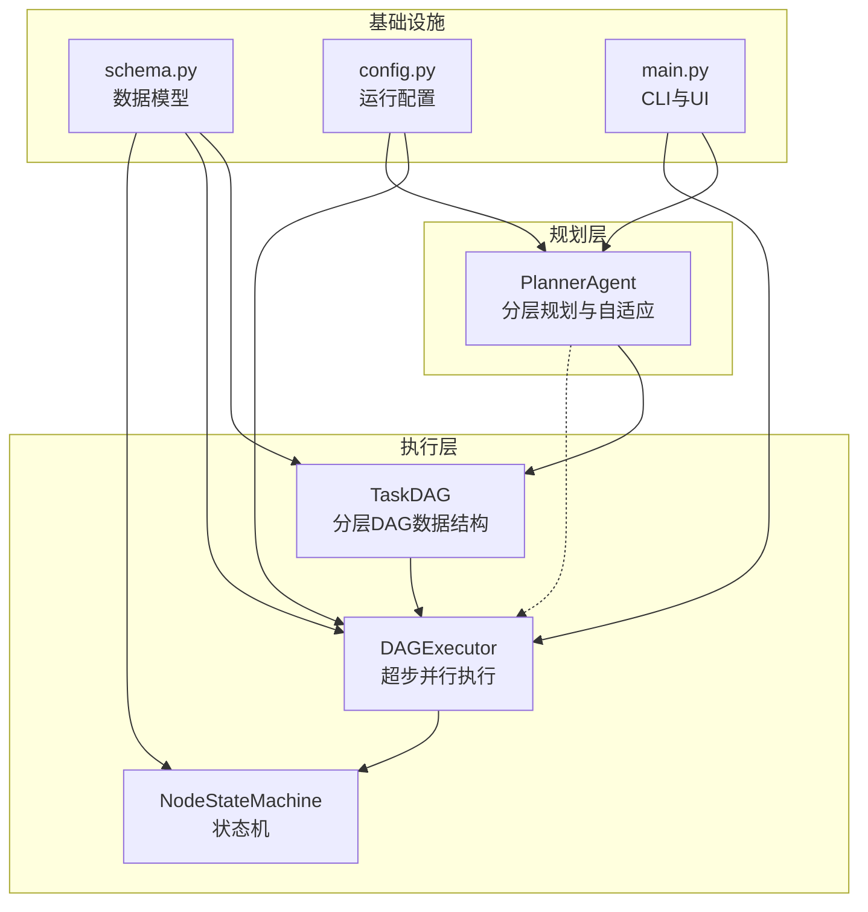
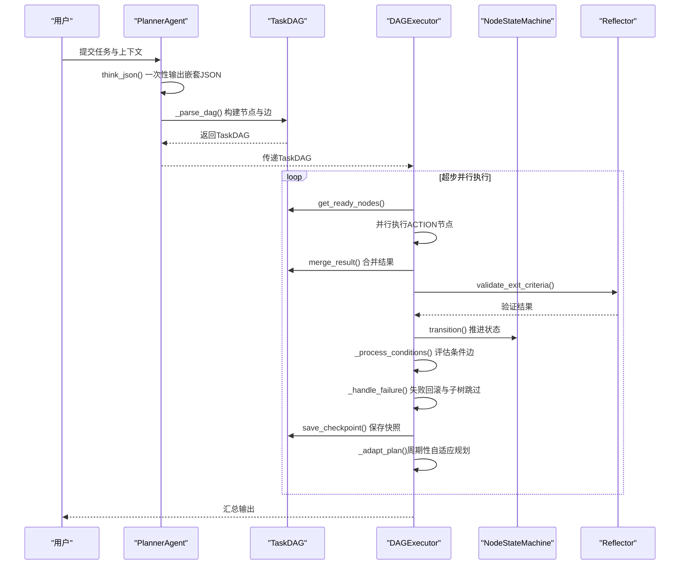
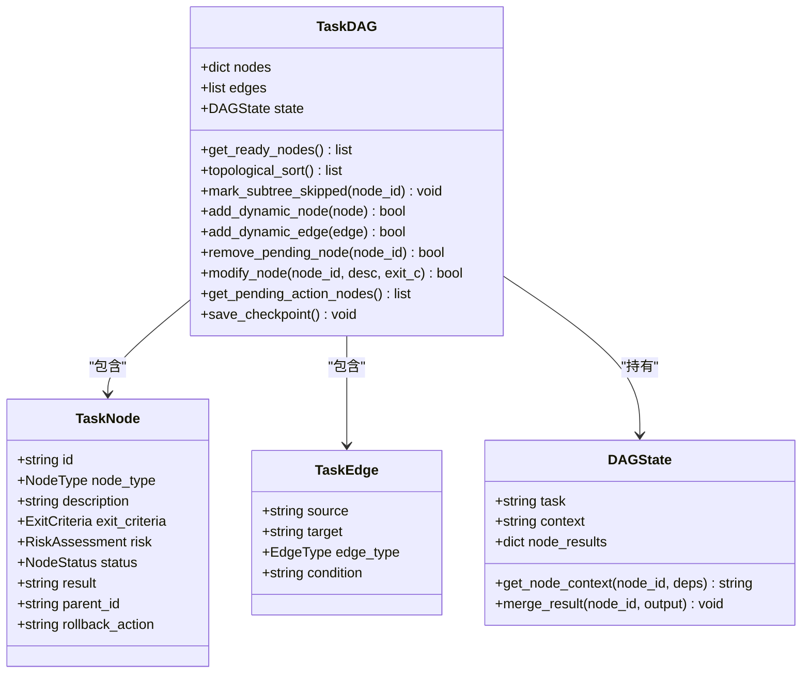
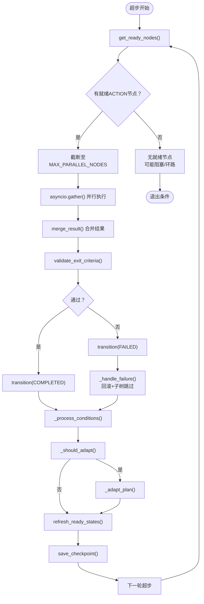
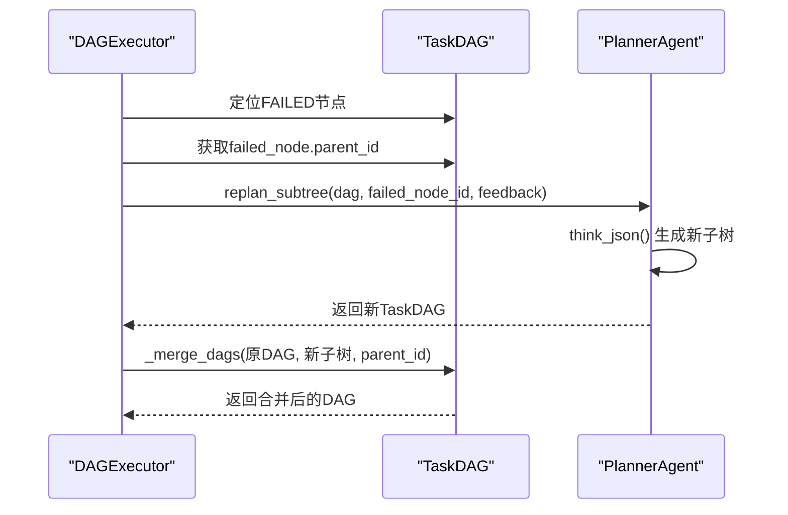
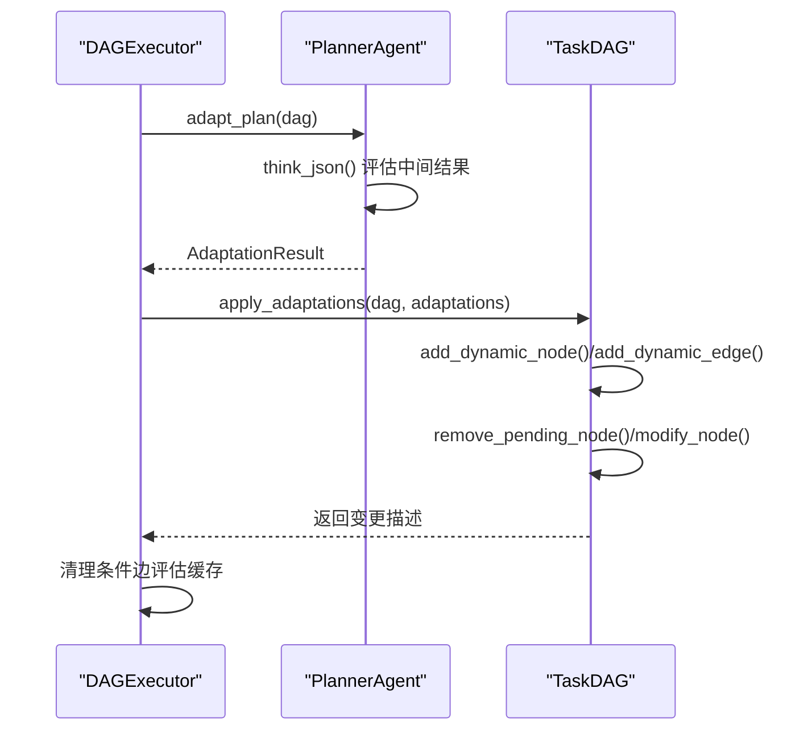
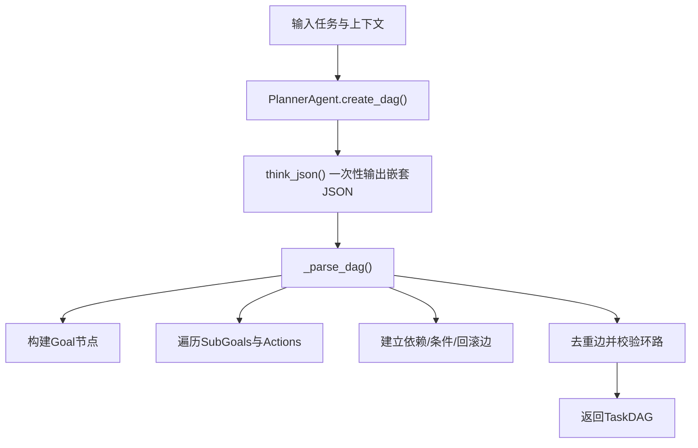
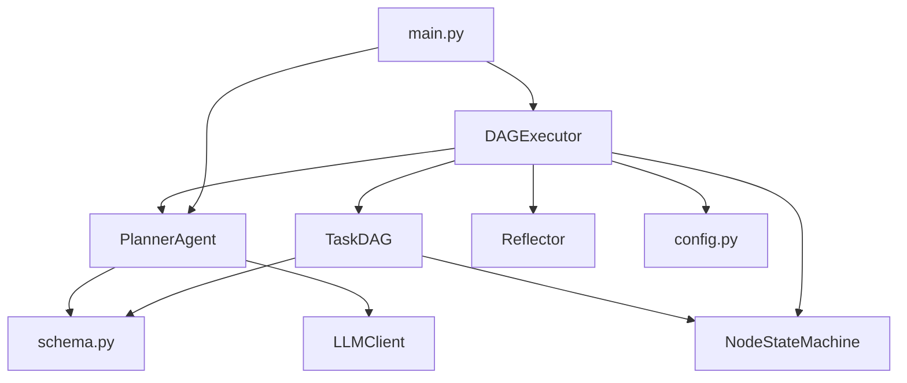

# v2 DAG规划（分层结构）

<cite>
**本文档引用的文件**
- [dag/graph.py](file://dag/graph.py)
- [dag/executor.py](file://dag/executor.py)
- [dag/state_machine.py](file://dag/state_machine.py)
- [agents/planner.py](file://agents/planner.py)
- [schema.py](file://schema.py)
- [config.py](file://config.py)
- [main.py](file://main.py)
- [tests/test_dag_capabilities.py](file://tests/test_dag_capabilities.py)
</cite>

## 目录
1. [简介](#简介)
2. [项目结构](#项目结构)
3. [核心组件](#核心组件)
4. [架构概览](#架构概览)
5. [详细组件分析](#详细组件分析)
6. [依赖分析](#依赖分析)
7. [性能考量](#性能考量)
8. [故障排查指南](#故障排查指南)
9. [结论](#结论)
10. [附录](#附录)

## 简介
本文件面向v2 DAG规划系统，系统性阐述分层DAG规划的设计原理与实现细节，重点覆盖以下主题：
- 分层DAG规划的三层结构（Goal-SubGoal-Action）生成机制
- PlannerAgent如何通过LLM一次性输出嵌套JSON并转换为TaskDAG
- DAGExecutor的超步并行执行模型与状态机驱动
- 局部重规划replan_subtree的失败节点定位、父节点选择与子树重建
- 自适应规划adapt_plan的中间结果评估、待执行节点分析与动态调整策略
- apply_adaptations的调整应用过程与节点修改操作
- DAG构建的最佳实践与性能优化建议

## 项目结构
本项目围绕“规划-执行-反馈-调整”的闭环构建，DAG规划位于核心层，向上承接任务分类与路由，向下驱动执行器并集成反思与工具路由。

**图表来源**
- [dag/graph.py:43-81](file://dag/graph.py#L43-L81)
- [dag/executor.py:62-104](file://dag/executor.py#L62-L104)
- [dag/state_machine.py:55-114](file://dag/state_machine.py#L55-L114)
- [agents/planner.py:147-206](file://agents/planner.py#L147-L206)
- [schema.py:157-253](file://schema.py#L157-L253)
- [config.py:44-60](file://config.py#L44-L60)
- [main.py:448-455](file://main.py#L448-L455)

**章节来源**
- [dag/graph.py:1-627](file://dag/graph.py#L1-L627)
- [dag/executor.py:1-648](file://dag/executor.py#L1-L648)
- [dag/state_machine.py:1-114](file://dag/state_machine.py#L1-L114)
- [agents/planner.py:1-934](file://agents/planner.py#L1-L934)
- [schema.py:1-702](file://schema.py#L1-L702)
- [config.py:1-109](file://config.py#L1-L109)
- [main.py:1-516](file://main.py#L1-L516)

## 核心组件
- TaskDAG：分层任务DAG的数据结构与图算法，提供就绪节点发现、拓扑排序、条件分支与回滚子树跳过、动态图变更等能力。
- DAGExecutor：超步并行执行引擎，驱动节点状态机、合并结果、评估条件、处理失败与回滚、周期性自适应规划。
- NodeStateMachine：强制合法状态转移的状态机，确保节点状态变迁符合预定义转移表。
- PlannerAgent：混合路由规划器，负责v1/v2/v5路径选择、分层DAG创建、局部重规划与自适应规划。
- schema.py：定义TaskNode、TaskEdge、DAGState、AdaptAction等核心数据模型。
- config.py：提供执行参数、自适应规划开关与间隔、并行度、超时等配置。

**章节来源**
- [dag/graph.py:43-127](file://dag/graph.py#L43-L127)
- [dag/executor.py:62-104](file://dag/executor.py#L62-L104)
- [dag/state_machine.py:55-114](file://dag/state_machine.py#L55-L114)
- [agents/planner.py:147-206](file://agents/planner.py#L147-L206)
- [schema.py:157-296](file://schema.py#L157-L296)
- [config.py:44-60](file://config.py#L44-L60)

## 架构概览
v2 DAG规划采用“规划-执行-反馈-调整”闭环：
- 规划阶段：PlannerAgent基于任务描述与上下文，一次性输出嵌套JSON，解析为Goal/SubGoal/Action三层DAG。
- 执行阶段：DAGExecutor以超步为单位并行执行就绪ACTION节点，通过NodeStateMachine推进状态，合并结果到DAGState。
- 反馈阶段：Reflector对节点完成判据进行验证，条件边根据前序结果动态启用/跳过，失败节点触发回滚与子树跳过。
- 调整阶段：DAGExecutor周期性触发PlannerAgent的adapt_plan，基于中间结果对待执行节点进行增删改。

**图表来源**
- [agents/planner.py:481-506](file://agents/planner.py#L481-L506)
- [agents/planner.py:729-755](file://agents/planner.py#L729-L755)
- [dag/executor.py:110-264](file://dag/executor.py#L110-L264)
- [dag/executor.py:578-632](file://dag/executor.py#L578-L632)
- [dag/state_machine.py:88-114](file://dag/state_machine.py#L88-L114)

**章节来源**
- [agents/planner.py:481-506](file://agents/planner.py#L481-L506)
- [dag/executor.py:110-264](file://dag/executor.py#L110-L264)
- [dag/state_machine.py:88-114](file://dag/state_machine.py#L88-L114)

## 详细组件分析

### 分层DAG规划与TaskDAG
- 三层结构生成：PlannerAgent.create_dag通过LLM一次性输出嵌套JSON（goal/subgoals/actions），随后解析为TaskNode与TaskEdge，构建TaskDAG。
- 图算法与就绪检测：TaskDAG提供get_ready_nodes()动态发现就绪节点，topological_sort()保证合法执行顺序，mark_subtree_skipped()在条件失败或失败时级联跳过下游子树。
- 动态图变更：支持运行时add_dynamic_node/add_dynamic_edge/remove_pending_node/modify_node，配合环检测与邻接表维护，保障拓扑有效性。

**图表来源**
- [dag/graph.py:57-127](file://dag/graph.py#L57-L127)
- [schema.py:157-187](file://schema.py#L157-L187)
- [schema.py:192-253](file://schema.py#L192-L253)

**章节来源**
- [agents/planner.py:481-506](file://agents/planner.py#L481-L506)
- [agents/planner.py:729-755](file://agents/planner.py#L729-L755)
- [dag/graph.py:101-127](file://dag/graph.py#L101-L127)
- [dag/graph.py:219-276](file://dag/graph.py#L219-L276)
- [dag/graph.py:341-494](file://dag/graph.py#L341-L494)
- [schema.py:157-187](file://schema.py#L157-L187)
- [schema.py:192-253](file://schema.py#L192-L253)

### DAGExecutor超步并行执行模型
- 超步循环：每轮超步发现就绪ACTION节点，最多MAX_PARALLEL_NODES个节点并行执行，结果合并到DAGState。
- 状态推进：通过NodeStateMachine进行状态转移，支持FAILED->ROLLED_BACK/SKIPPED/PENDING的回退与重试。
- 条件边与失败处理：评估CONDITIONAL边，未满足则跳过目标节点及其子树；失败节点触发ROLLBACK边（若有）与mark_subtree_skipped()。
- 自适应规划：周期性触发adapt_plan，基于已完成ACTION节点与待执行节点进行增删改。

**图表来源**
- [dag/executor.py:110-264](file://dag/executor.py#L110-L264)
- [dag/executor.py:350-400](file://dag/executor.py#L350-L400)
- [dag/executor.py:405-473](file://dag/executor.py#L405-L473)
- [dag/executor.py:578-632](file://dag/executor.py#L578-L632)

**章节来源**
- [dag/executor.py:110-264](file://dag/executor.py#L110-L264)
- [dag/executor.py:350-400](file://dag/executor.py#L350-L400)
- [dag/executor.py:405-473](file://dag/executor.py#L405-L473)
- [dag/executor.py:578-632](file://dag/executor.py#L578-L632)

### 局部重规划 replan_subtree
- 失败节点定位：在DAG中定位FAILED节点，获取其parent_id（若无则使用节点ID本身）。
- 父节点选择：以失败节点父节点为根，仅对该子树进行重规划，保留已完成节点与结果。
- 子树重建：调用PlannerAgent.replan_subtree，基于已完成结果与反馈生成新子树，再通过_merge_dags合并回原DAG。

**图表来源**
- [agents/planner.py:513-566](file://agents/planner.py#L513-L566)
- [dag/executor.py:350-400](file://dag/executor.py#L350-L400)

**章节来源**
- [agents/planner.py:513-566](file://agents/planner.py#L513-L566)
- [dag/executor.py:350-400](file://dag/executor.py#L350-L400)

### 自适应规划 adapt_plan 与 apply_adaptations
- adapt_plan评估：基于已完成ACTION节点数量、待执行ACTION节点集合与中间结果，决定是否需要调整。
- 调整动作：支持KEEP/MODIFY/REMOVE/ADD四种动作，PlannerAgent生成AdaptationResult。
- 应用调整：DAGExecutor调用apply_adaptations，通过add_dynamic_node/add_dynamic_edge/remove_pending_node/modify_node应用变更，必要时清空条件边评估缓存。

**图表来源**
- [agents/planner.py:573-672](file://agents/planner.py#L573-L672)
- [agents/planner.py:674-722](file://agents/planner.py#L674-L722)
- [dag/executor.py:601-632](file://dag/executor.py#L601-L632)

**章节来源**
- [agents/planner.py:573-672](file://agents/planner.py#L573-L672)
- [agents/planner.py:674-722](file://agents/planner.py#L674-L722)
- [dag/executor.py:601-632](file://dag/executor.py#L601-L632)

### PlannerAgent.create_dag 的嵌套JSON生成与解析
- LLM一次性输出嵌套JSON（goal/subgoals/actions），包含完成判据、风险评估、条件与回滚等元数据。
- 解析流程：构建Goal节点，遍历SubGoals与Actions，建立依赖边（DEPENDENCY/CONDITIONAL/ROLLBACK），去重边并校验环路，最终返回TaskDAG。

**图表来源**
- [agents/planner.py:481-506](file://agents/planner.py#L481-L506)
- [agents/planner.py:729-755](file://agents/planner.py#L729-L755)

**章节来源**
- [agents/planner.py:481-506](file://agents/planner.py#L481-L506)
- [agents/planner.py:729-755](file://agents/planner.py#L729-L755)

## 依赖分析
- PlannerAgent依赖schema.py中的TaskNode/TaskEdge/DAGState/AdaptAction等模型，依赖LLMClient进行JSON输出。
- TaskDAG依赖NodeStateMachine进行状态变更，依赖schema.py中的枚举与模型。
- DAGExecutor依赖TaskDAG、NodeStateMachine、Reflector与PlannerAgent（可选），依赖config.py中的执行参数。
- main.py提供事件驱动UI，将DAG树形可视化与事件流整合。

**图表来源**
- [agents/planner.py:147-206](file://agents/planner.py#L147-L206)
- [dag/graph.py:43-81](file://dag/graph.py#L43-L81)
- [dag/executor.py:62-104](file://dag/executor.py#L62-L104)
- [main.py:448-455](file://main.py#L448-L455)

**章节来源**
- [agents/planner.py:147-206](file://agents/planner.py#L147-L206)
- [dag/graph.py:43-81](file://dag/graph.py#L43-L81)
- [dag/executor.py:62-104](file://dag/executor.py#L62-L104)
- [main.py:448-455](file://main.py#L448-L455)

## 性能考量
- 并行度控制：MAX_PARALLEL_NODES限制每轮超步并行节点数，避免资源争用与超时。
- 就绪检测优化：预构建依赖邻接表，get_ready_nodes()与get_dependency_ids()均为O(1)/O(E)。
- 拓扑排序：Kahn算法O(V+E)，topological_sort()用于顺序验证与输出汇总。
- 环检测：动态加边时即时拓扑验证，失败则回滚，确保DAG有效性。
- 超时保护：NODE_EXECUTION_TIMEOUT防止单节点卡死影响批次。
- 快照与内存：MAX_CHECKPOINTS限制内存中checkpoint数量，避免长时间运行内存泄漏。

**章节来源**
- [config.py:44-60](file://config.py#L44-L60)
- [dag/graph.py:82-95](file://dag/graph.py#L82-L95)
- [dag/graph.py:219-249](file://dag/graph.py#L219-L249)
- [dag/graph.py:384-396](file://dag/graph.py#L384-L396)
- [dag/executor.py:291-310](file://dag/executor.py#L291-L310)

## 故障排查指南
- DAG阻塞：get_blockage_report()可诊断阻塞节点与依赖关系；try_recover_blocked_nodes()尝试恢复被阻塞的PENDING节点。
- 失败节点处理：_handle_failure()会执行ROLLBACK边（若有）并mark_subtree_skipped()，确保下游不再执行。
- 条件边误判：_evaluate_condition()对CJK与拉丁文采用不同匹配策略，避免误匹配。
- 状态机异常：InvalidTransitionError表明状态转移非法，检查转移表与调用顺序。
- 自适应规划未触发：确认ADAPTIVE_PLANNING_ENABLED、ADAPT_PLAN_INTERVAL、ADAPT_PLAN_MIN_COMPLETED配置，以及待执行ACTION节点存在。

**章节来源**
- [dag/graph.py:277-334](file://dag/graph.py#L277-L334)
- [dag/executor.py:350-400](file://dag/executor.py#L350-L400)
- [dag/executor.py:449-473](file://dag/executor.py#L449-L473)
- [dag/state_machine.py:30-114](file://dag/state_machine.py#L30-L114)
- [config.py:46-51](file://config.py#L46-L51)

## 结论
v2 DAG规划系统通过分层结构与超步并行执行实现了高灵活性与鲁棒性：PlannerAgent一次性输出嵌套JSON构建TaskDAG，DAGExecutor以状态机驱动的超步模型实现并行执行与条件分支，NodeStateMachine确保状态变迁合法，局部重规划与自适应规划在失败与中间结果基础上持续优化计划。结合邻接表与拓扑算法，系统在大规模任务中仍保持高效与可维护性。

## 附录
- 最佳实践
  - 规划阶段：为每个节点明确exit_criteria与风险评估，合理设置条件边与回滚边。
  - 执行阶段：控制MAX_PARALLEL_NODES与NODE_EXECUTION_TIMEOUT，避免资源瓶颈与超时。
  - 动态变更：优先使用modify_node/remove_pending_node，谨慎使用add_dynamic_node/add_dynamic_edge，确保环检测通过。
  - 自适应规划：合理设置ADAPT_PLAN_INTERVAL与ADAPT_PLAN_MIN_COMPLETED，避免过于频繁的调整。
- 参考测试
  - 分层规划能力与并行执行：tests/test_dag_capabilities.py
  - 条件分支与回滚：tests/test_dag_capabilities.py
  - 动态图变更：tests/test_dag_capabilities.py
  - 自适应规划集成：tests/test_dag_capabilities.py

**章节来源**
- [tests/test_dag_capabilities.py:134-208](file://tests/test_dag_capabilities.py#L134-L208)
- [tests/test_dag_capabilities.py:346-533](file://tests/test_dag_capabilities.py#L346-L533)
- [tests/test_dag_capabilities.py:540-646](file://tests/test_dag_capabilities.py#L540-L646)
- [tests/test_dag_capabilities.py:728-826](file://tests/test_dag_capabilities.py#L728-L826)