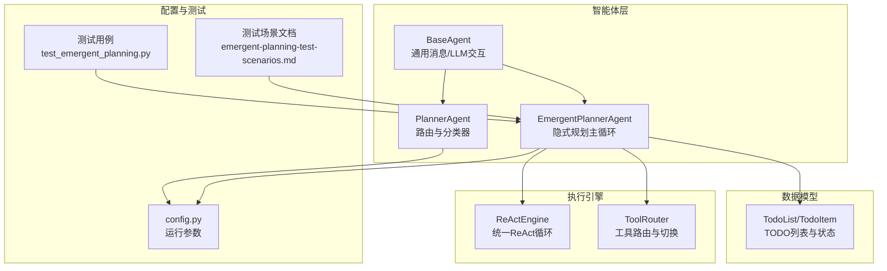
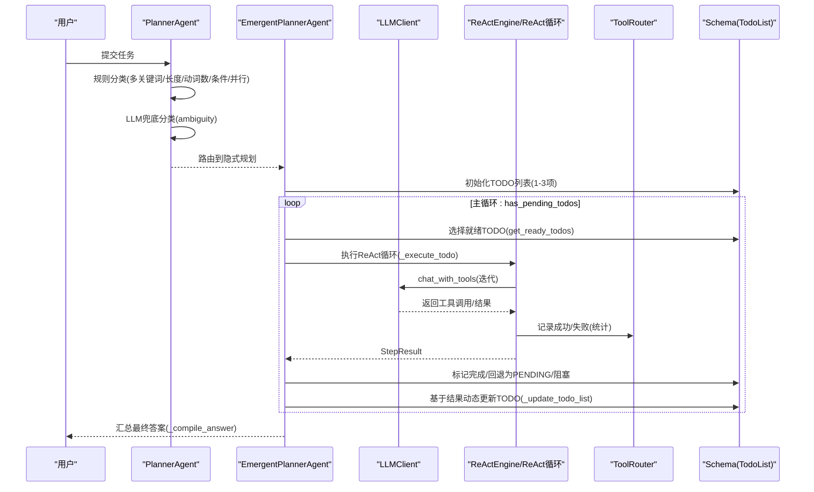
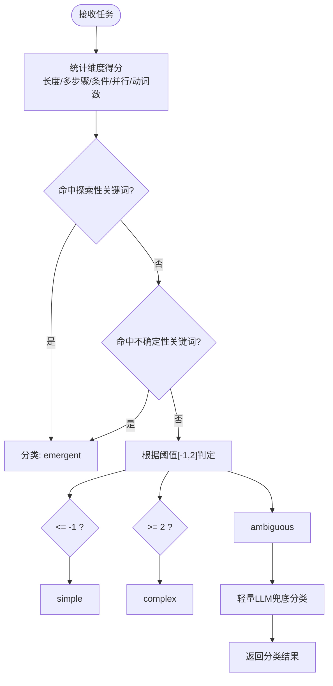
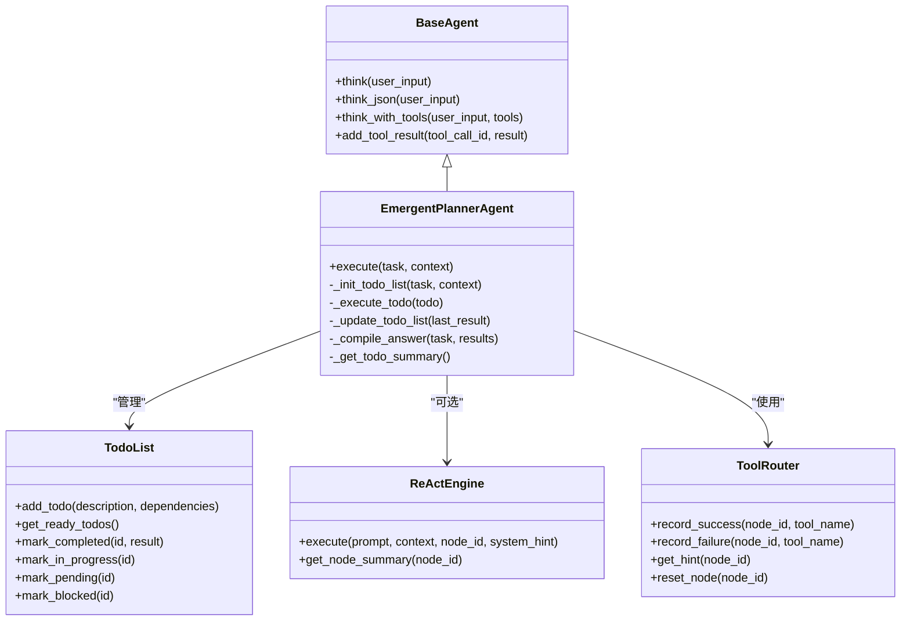
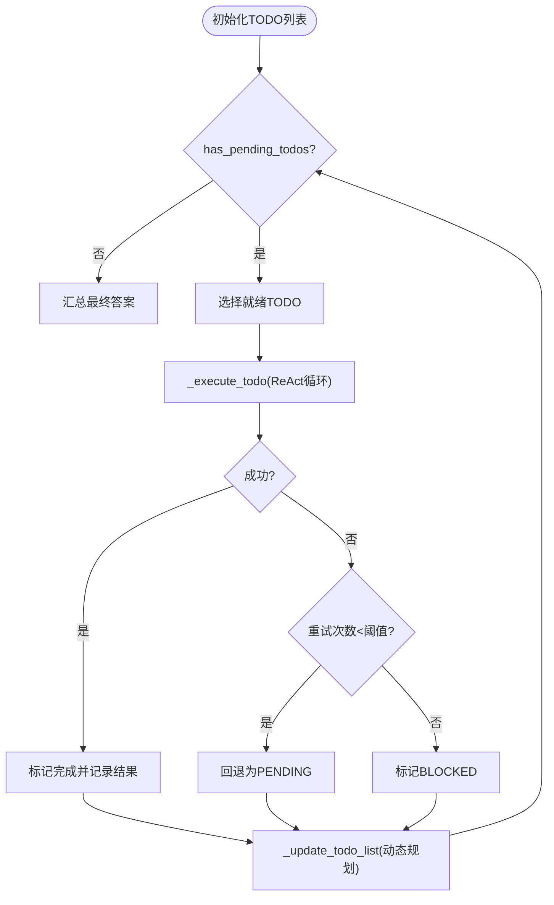
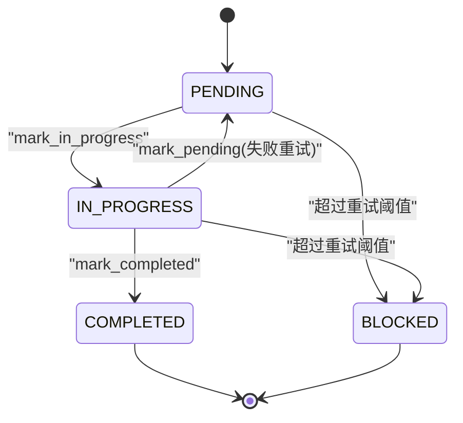
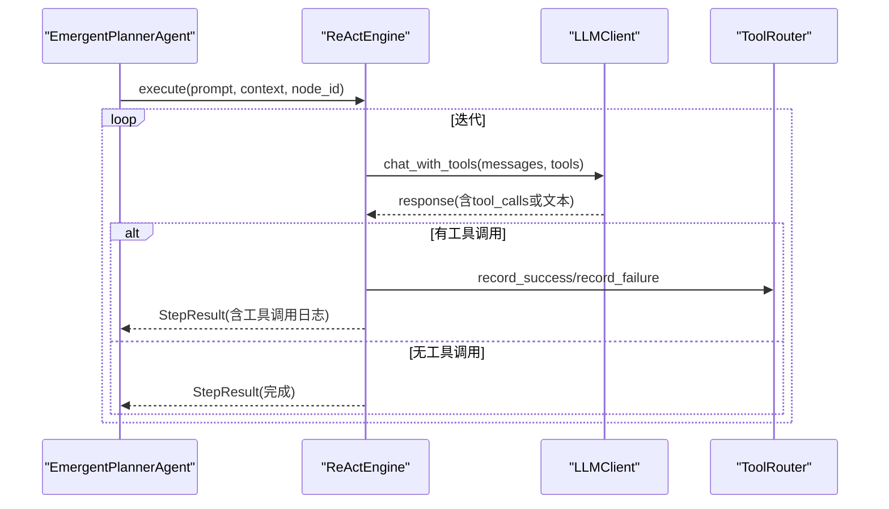
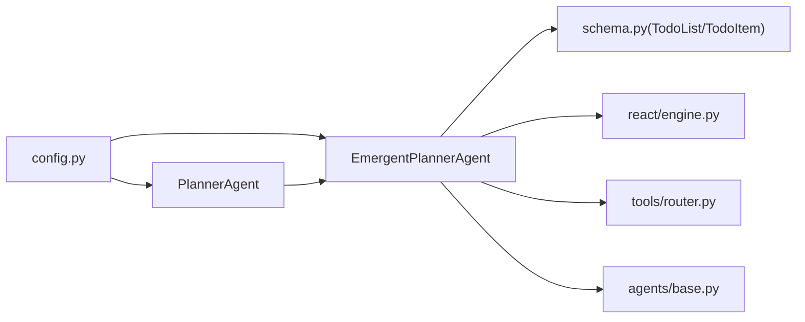

# v5新兴规划（隐式探索）

<cite>
**本文档引用的文件**
- [agents/emergent_planner.py](file://agents/emergent_planner.py)
- [agents/base.py](file://agents/base.py)
- [agents/planner.py](file://agents/planner.py)
- [schema.py](file://schema.py)
- [config.py](file://config.py)
- [react/engine.py](file://react/engine.py)
- [tools/router.py](file://tools/router.py)
- [tests/test_emergent_planning.py](file://tests/test_emergent_planning.py)
- [sxw_aicoding/docs/emergent-planning-test-scenarios.md](file://sxw_aicoding/docs/emergent-planning-test-scenarios.md)
- [sxw_aicoding/docs/planning-gap-analysis.md](file://sxw_aicoding/docs/planning-gap-analysis.md)
</cite>

## 目录
1. [简介](#简介)
2. [项目结构](#项目结构)
3. [核心组件](#核心组件)
4. [架构概览](#架构概览)
5. [详细组件分析](#详细组件分析)
6. [依赖分析](#依赖分析)
7. [性能考量](#性能考量)
8. [故障排查指南](#故障排查指南)
9. [结论](#结论)
10. [附录](#附录)

## 简介
本文件面向v5新兴规划系统（隐式探索），系统性阐述其设计理念、探索性/不确定性任务的关键词检测机制、EmergentPlannerAgent的实现原理与传统规划器的区别、探索性任务的动态规划生成过程与迭代发现机制，并总结适用场景、优势与局限性，最后提供处理策略与性能优化建议。

## 项目结构
v5新兴规划位于agents子包中，围绕EmergentPlannerAgent构建，配合BaseAgent的通用消息与LLM交互能力、Schema中的TodoList/TodoItem数据模型、Config中的运行参数、以及可选的ReActEngine统一执行引擎与ToolRouter工具路由。

图表来源
- [agents/emergent_planner.py:1-685](file://agents/emergent_planner.py#L1-L685)
- [agents/base.py:1-183](file://agents/base.py#L1-L183)
- [agents/planner.py:1-934](file://agents/planner.py#L1-L934)
- [schema.py:380-568](file://schema.py#L380-L568)
- [react/engine.py:1-246](file://react/engine.py#L1-L246)
- [tools/router.py:1-168](file://tools/router.py#L1-L168)
- [config.py:1-109](file://config.py#L1-L109)
- [tests/test_emergent_planning.py:1-432](file://tests/test_emergent_planning.py#L1-L432)
- [sxw_aicoding/docs/emergent-planning-test-scenarios.md:1-800](file://sxw_aicoding/docs/emergent-planning-test-scenarios.md#L1-L800)

章节来源
- [agents/emergent_planner.py:1-685](file://agents/emergent_planner.py#L1-L685)
- [agents/base.py:1-183](file://agents/base.py#L1-L183)
- [agents/planner.py:1-934](file://agents/planner.py#L1-L934)
- [schema.py:380-568](file://schema.py#L380-L568)
- [react/engine.py:1-246](file://react/engine.py#L1-L246)
- [tools/router.py:1-168](file://tools/router.py#L1-L168)
- [config.py:1-109](file://config.py#L1-L109)
- [tests/test_emergent_planning.py:1-432](file://tests/test_emergent_planning.py#L1-L432)
- [sxw_aicoding/docs/emergent-planning-test-scenarios.md:1-800](file://sxw_aicoding/docs/emergent-planning-test-scenarios.md#L1-L800)

## 核心组件
- EmergentPlannerAgent：实现Claude Code风格的隐式规划，核心是while(tool_use)主循环，通过TODO列表的动态创建/更新/完成组织执行。
- BaseAgent：提供系统提示词管理、消息历史追踪、LLM交互（chat/chat_with_tools/chat_json）与上下文压缩。
- PlannerAgent：混合路由分类器，负责将任务分类为simple/complex/emergent，并在v5路径中触发EmergentPlannerAgent。
- Schema（TodoList/TodoItem）：集中式TODO列表，支持状态机（PENDING/IN_PROGRESS/COMPLETED/BLOCKED）、依赖检查与环检测。
- ReActEngine：统一的ReAct执行引擎，抽取自Executor与EmergentPlanner，支持迭代、工具调用记录与错误处理。
- ToolRouter：工具使用统计与失败切换建议，避免陷入工具失败死循环。
- Config：运行参数（如EMERGENT_PLANNING_ENABLED、MAX_TODO_ITEMS、MAX_TODO_RETRIES、ENABLE_REACT_ENGINE_V2等）。

章节来源
- [agents/emergent_planner.py:72-685](file://agents/emergent_planner.py#L72-L685)
- [agents/base.py:29-183](file://agents/base.py#L29-L183)
- [agents/planner.py:147-362](file://agents/planner.py#L147-L362)
- [schema.py:384-568](file://schema.py#L384-L568)
- [react/engine.py:43-246](file://react/engine.py#L43-L246)
- [tools/router.py:47-168](file://tools/router.py#L47-L168)
- [config.py:61-86](file://config.py#L61-L86)

## 架构概览
v5新兴规划的核心思想是“无预先完整规划”，规划在执行过程中自然涌现。PlannerAgent通过规则+LLM的两阶段分类器识别探索性/不确定性任务，自动路由到EmergentPlannerAgent；后者维护单一扁平消息历史，持续通过ReAct循环与工具交互，动态更新TODO列表，直至所有任务完成。

图表来源
- [agents/planner.py:213-259](file://agents/planner.py#L213-L259)
- [agents/emergent_planner.py:134-276](file://agents/emergent_planner.py#L134-L276)
- [react/engine.py:84-241](file://react/engine.py#L84-L241)
- [tools/router.py:82-147](file://tools/router.py#L82-L147)
- [schema.py:422-568](file://schema.py#L422-L568)

## 详细组件分析

### 探索性/不确定性任务关键词检测模式
PlannerAgent内置规则分类器，其中v5新增的探索性/不确定性关键词模式用于识别适合隐式规划的任务：
- EXPLORATORY_PATTERN：匹配“探索/调研/研究/分析并建议/检查并修复/优化/改进/评估/审查”等词汇（中英文）
- UNCERTAINTY_PATTERN：匹配“不确定/可能/也许/大概/尝试/看看/试着/了解”等词汇（中英文）

分类逻辑：
- 先统计任务文本长度、多步骤关键词、条件分支、并行执行、动作动词数量等维度打分
- 若上述任一维度命中探索性/不确定性关键词，则直接判定为emergent
- 否则根据阈值区间[-1,2]判定simple/complex/ambiguous，ambiguous时触发轻量LLM兜底

图表来源
- [agents/planner.py:163-327](file://agents/planner.py#L163-L327)

章节来源
- [agents/planner.py:187-198](file://agents/planner.py#L187-L198)
- [agents/planner.py:261-327](file://agents/planner.py#L261-L327)

### EmergentPlannerAgent实现原理与与传统规划器的区别
- 无独立规划阶段：不预先生成完整DAG或扁平计划，而是通过TODO列表在执行中自然涌现
- 单一扁平消息历史：所有工具调用与结果在同一上下文中，便于LLM在完整历史中推理
- TODO列表动态管理：支持新增、修改、阻塞标记；失败时回退为PENDING以便重试
- ReAct循环：支持Legacy实现或统一ReActEngine（通过ENABLE_REACT_ENGINE_V2开关）
- 与传统规划器对比：
  - v1/v2：显式规划（扁平/分层DAG），执行前完整规划，执行中按既定计划推进
  - v5：隐式规划，执行中动态规划，更灵活但对LLM能力依赖更高

图表来源
- [agents/base.py:29-183](file://agents/base.py#L29-L183)
- [agents/emergent_planner.py:90-685](file://agents/emergent_planner.py#L90-L685)
- [react/engine.py:43-246](file://react/engine.py#L43-L246)
- [tools/router.py:47-168](file://tools/router.py#L47-L168)
- [schema.py:422-568](file://schema.py#L422-L568)

章节来源
- [agents/emergent_planner.py:72-128](file://agents/emergent_planner.py#L72-L128)
- [agents/base.py:87-168](file://agents/base.py#L87-L168)
- [react/engine.py:84-241](file://react/engine.py#L84-L241)
- [schema.py:422-568](file://schema.py#L422-L568)
- [tools/router.py:82-147](file://tools/router.py#L82-L147)

### 探索性任务的动态规划生成与迭代发现机制
- 初始化：从任务描述生成1-3个初始TODO，作为探索起点
- 主循环：选择就绪TODO，执行ReAct循环，根据结果更新TODO列表
- 动态更新：基于上次执行结果，决定是否新增/修改/阻塞现有TODO
- 重试与阻塞：失败时回退为PENDING并累计重试次数，超过阈值标记BLOCKED
- 停滞检测：若连续多轮无已完成TODO增量，提前退出，避免无效循环
- 汇总：将所有已完成TODO的结果综合为最终答案

图表来源
- [agents/emergent_planner.py:162-276](file://agents/emergent_planner.py#L162-L276)
- [agents/emergent_planner.py:347-459](file://agents/emergent_planner.py#L347-L459)
- [schema.py:422-568](file://schema.py#L422-L568)

章节来源
- [agents/emergent_planner.py:134-276](file://agents/emergent_planner.py#L134-L276)
- [agents/emergent_planner.py:347-459](file://agents/emergent_planner.py#L347-L459)
- [schema.py:422-568](file://schema.py#L422-L568)

### 关键数据结构与状态机
- TodoStatus：PENDING/IN_PROGRESS/COMPLETED/BLOCKED
- TodoItem：包含描述、依赖、结果、重试计数、时间戳
- TodoList：集中式管理，提供依赖环检测、就绪项筛选、状态变更、完成判定

图表来源
- [schema.py:384-420](file://schema.py#L384-L420)
- [schema.py:515-551](file://schema.py#L515-L551)

章节来源
- [schema.py:384-568](file://schema.py#L384-L568)

### ReAct执行引擎与工具路由
- ReActEngine：标准化ReAct循环，支持迭代上限、工具调用记录、错误处理与工具统计
- ToolRouter：记录每个节点的工具使用统计，当连续失败超过阈值时向LLM提供替代工具建议

图表来源
- [react/engine.py:84-241](file://react/engine.py#L84-L241)
- [tools/router.py:82-147](file://tools/router.py#L82-L147)

章节来源
- [react/engine.py:43-246](file://react/engine.py#L43-L246)
- [tools/router.py:47-168](file://tools/router.py#L47-L168)

## 依赖分析
- PlannerAgent依赖正则模式与Config参数进行任务分类，决定是否启用v5隐式规划
- EmergentPlannerAgent依赖BaseAgent的LLM交互能力、Schema的TodoList状态机、可选ReActEngine与ToolRouter
- Config提供运行参数（如EMERGENT_PLANNING_ENABLED、MAX_TODO_ITEMS、MAX_TODO_RETRIES、ENABLE_REACT_ENGINE_V2等），影响行为与性能

图表来源
- [config.py:61-86](file://config.py#L61-L86)
- [agents/planner.py:200-259](file://agents/planner.py#L200-L259)
- [agents/emergent_planner.py:90-128](file://agents/emergent_planner.py#L90-L128)
- [schema.py:422-568](file://schema.py#L422-L568)
- [react/engine.py:64-83](file://react/engine.py#L64-L83)
- [tools/router.py:65-83](file://tools/router.py#L65-L83)
- [agents/base.py:40-54](file://agents/base.py#L40-L54)

章节来源
- [config.py:61-86](file://config.py#L61-L86)
- [agents/planner.py:200-259](file://agents/planner.py#L200-L259)
- [agents/emergent_planner.py:90-128](file://agents/emergent_planner.py#L90-L128)
- [schema.py:422-568](file://schema.py#L422-L568)
- [react/engine.py:64-83](file://react/engine.py#L64-L83)
- [tools/router.py:65-83](file://tools/router.py#L65-L83)
- [agents/base.py:40-54](file://agents/base.py#L40-L54)

## 性能考量
- 上下文窗口与压缩：BaseAgent通过ContextManager在消息过多时压缩历史，避免Token超限
- 迭代上限：MAX_REACT_ITERATIONS限制单个TODO的ReAct循环次数，避免无限迭代
- TODO数量与重试：MAX_TODO_ITEMS限制TODO列表规模，MAX_TODO_RETRIES控制失败重试次数
- 统一ReAct引擎：ENABLE_REACT_ENGINE_V2开启后，v2/v5共享执行逻辑，减少重复实现与提升一致性
- 工具路由：TOOL_FAILURE_THRESHOLD与ToolRouter统计帮助在失败时切换工具，提升鲁棒性

章节来源
- [agents/base.py:87-121](file://agents/base.py#L87-L121)
- [config.py:23-25](file://config.py#L23-L25)
- [config.py:64-67](file://config.py#L64-L67)
- [config.py:80-85](file://config.py#L80-L85)
- [tools/router.py:101-147](file://tools/router.py#L101-L147)
- [react/engine.py:64-83](file://react/engine.py#L64-L83)

## 故障排查指南
- 任务被错误路由到非隐式路径：检查PLAN_MODE与分类器阈值，确认探索性/不确定性关键词是否命中
- TODO列表增长过快或停滞：调整MAX_TODO_ITEMS与停滞检测逻辑，观察更新频率（每3轮周期性review）
- 失败重试与阻塞：确认MAX_TODO_RETRIES与mark_pending回退机制是否按预期工作
- LLM重试与工具切换：启用LLM_RETRY_ENABLED与ToolRouter阈值，观察重试日志与替代工具建议
- 上下文压缩：当上下文Token接近阈值时，确认压缩策略与TODO压缩阈值（TODO_COMPRESSION_THRESHOLD）

章节来源
- [tests/test_emergent_planning.py:375-403](file://tests/test_emergent_planning.py#L375-L403)
- [sxw_aicoding/docs/emergent-planning-test-scenarios.md:573-598](file://sxw_aicoding/docs/emergent-planning-test-scenarios.md#L573-L598)
- [config.py:63-67](file://config.py#L63-L67)
- [tools/router.py:101-147](file://tools/router.py#L101-L147)

## 结论
v5新兴规划通过“无预先完整规划”的隐式探索范式，有效应对探索性/不确定性任务，具备更高的灵活性与对未知场景的适应能力。其核心在于：
- 基于关键词的规则+LLM分类器精准识别适合隐式规划的任务
- 统一的ReAct执行引擎与工具路由提升鲁棒性
- 集中式TODO列表与状态机支撑动态规划与迭代发现
- 配置参数与停滞检测保障性能与稳定性

适用场景：开放式研究、代码审查与改进建议、需求不明确的创意任务、高容错能力需求的网络不稳定环境。
局限性：对LLM能力依赖较高，工具生态与真实环境交互能力仍有待完善。

## 附录
- 适用场景与对比：详见测试场景文档与规划差距分析
- 配置项参考：EMERGENT_PLANNING_ENABLED、MAX_TODO_ITEMS、MAX_TODO_RETRIES、ENABLE_REACT_ENGINE_V2、LLM_RETRY_ENABLED等
- 测试用例：涵盖基础功能、TODO动态管理、复杂探索性任务、容错与重试、对比测试等

章节来源
- [sxw_aicoding/docs/emergent-planning-test-scenarios.md:123-136](file://sxw_aicoding/docs/emergent-planning-test-scenarios.md#L123-L136)
- [sxw_aicoding/docs/planning-gap-analysis.md:477-493](file://sxw_aicoding/docs/planning-gap-analysis.md#L477-493)
- [config.py:61-86](file://config.py#L61-L86)
- [tests/test_emergent_planning.py:307-432](file://tests/test_emergent_planning.py#L307-L432)