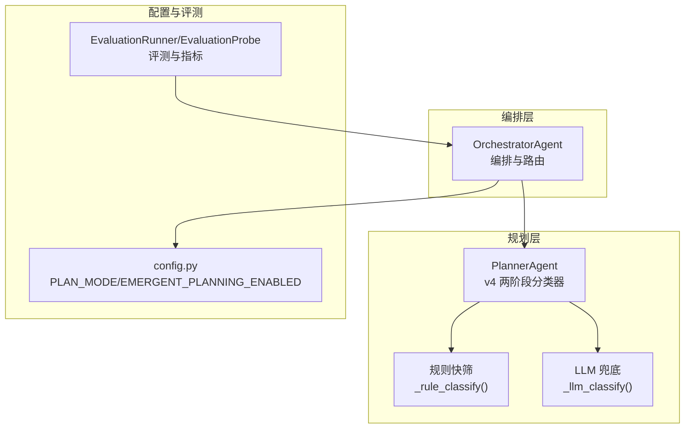
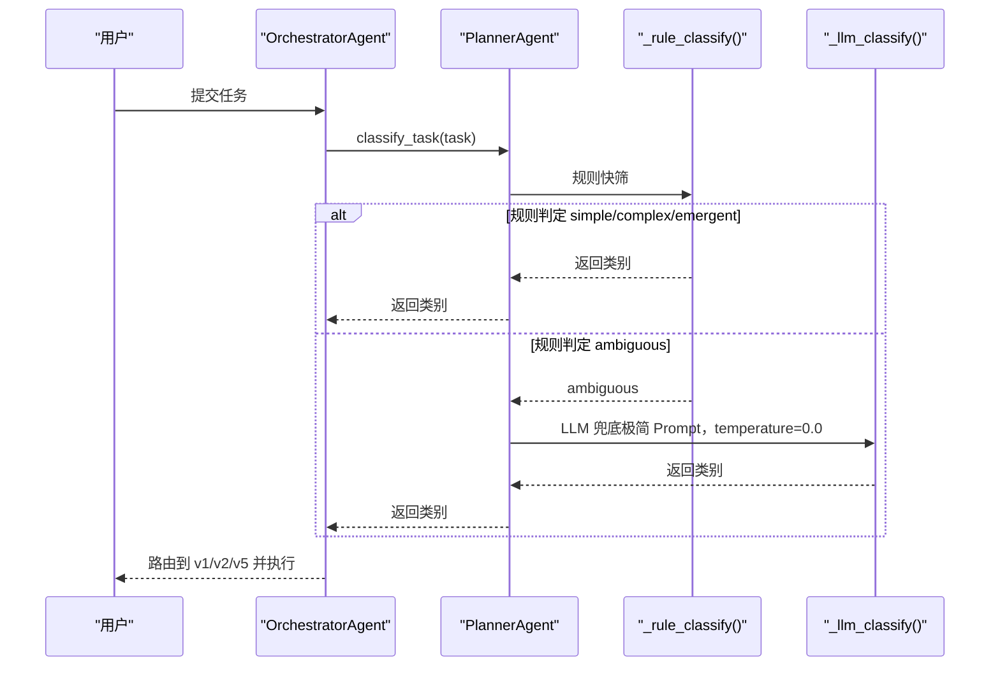
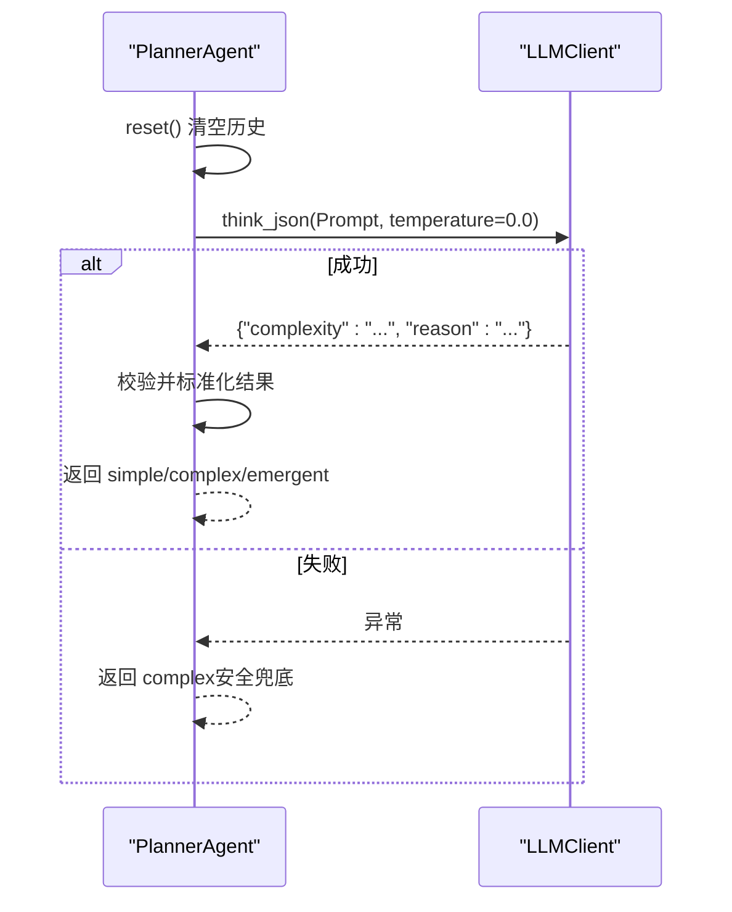
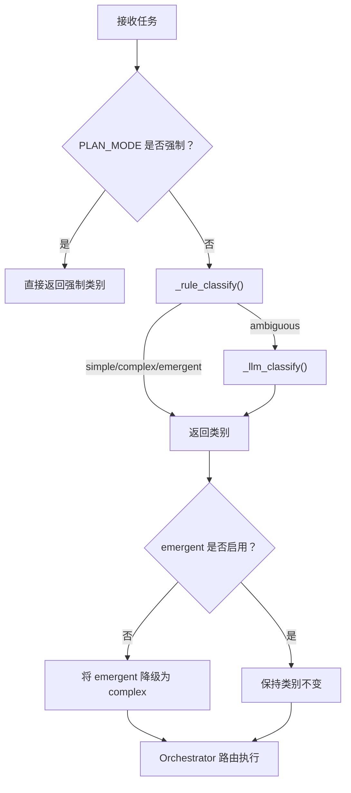
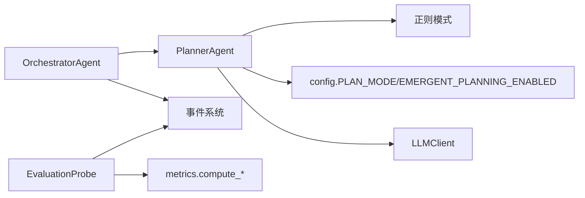

# 任务复杂度分类器

<cite>
**本文引用的文件**
- [agents/planner.py](file://agents/planner.py)
- [sxw_aicoding/old_docs/hybrid-plan-routing-v4.md](file://sxw_aicoding/old_docs/hybrid-plan-routing-v4.md)
- [config.py](file://config.py)
- [agents/orchestrator.py](file://agents/orchestrator.py)
- [evaluation/runner.py](file://evaluation/runner.py)
- [evaluation/metrics.py](file://evaluation/metrics.py)
- [evaluation/eval_cli.py](file://evaluation/eval_cli.py)
- [CLAUDE.md](file://CLAUDE.md)
</cite>

## 目录
1. [简介](#简介)
2. [项目结构](#项目结构)
3. [核心组件](#核心组件)
4. [架构总览](#架构总览)
5. [详细组件分析](#详细组件分析)
6. [依赖分析](#依赖分析)
7. [性能考虑](#性能考虑)
8. [故障排查指南](#故障排查指南)
9. [结论](#结论)
10. [附录](#附录)

## 简介
本文件面向“任务复杂度分类器”（v4 两阶段混合分类器），系统性阐述其工作机制与实现细节，包括：
- 规则快筛（Stage 1）：基于文本特征的启发式打分与关键词匹配，零 LLM 成本，快速判定“简单/复杂/涌现/模糊”
- LLM 兜底（Stage 2）：仅对模糊区间触发的轻量级分类，确保确定性输出与安全兜底
- 决策与路由：从“ambiguous”到最终类别（simple/complex/emergent）的策略
- 性能优化与调试：阈值与权重设计、Prompt 与温度参数、评估与可观测性

## 项目结构
围绕分类器的关键文件与职责如下：
- agents/planner.py：实现 v4 两阶段混合分类器（规则快筛 + LLM 兜底），并提供 v1/v2 路径的计划生成入口
- sxw_aicoding/old_docs/hybrid-plan-routing-v4.md：v4 设计文档，包含评分维度、阈值与 Prompt 设计
- config.py：PLAN_MODE 强制覆盖、EMERGENT_PLANNING_ENABLED 等关键配置
- agents/orchestrator.py：编排入口，调用分类器并路由到 v1/v2/v5 路径
- evaluation/*：评测与指标体系，支持强制模式与自动模式的差异化评分
- CLAUDE.md：总体设计要点与版本演进说明



**图表来源**
- [agents/orchestrator.py:158-222](file://agents/orchestrator.py#L158-L222)
- [agents/planner.py:213-259](file://agents/planner.py#L213-L259)
- [config.py:38-67](file://config.py#L38-L67)
- [evaluation/runner.py:440-570](file://evaluation/runner.py#L440-L570)

**章节来源**
- [agents/orchestrator.py:158-222](file://agents/orchestrator.py#L158-L222)
- [agents/planner.py:213-259](file://agents/planner.py#L213-L259)
- [config.py:38-67](file://config.py#L38-L67)
- [evaluation/runner.py:440-570](file://evaluation/runner.py#L440-L570)

## 核心组件
- 两阶段混合分类器
  - Stage 1：规则快筛（零成本）——基于文本长度、多步指示词、条件/分支词、并行需求词、动作动词数等维度打分，阈值区间判定 simple/complex/emergent/ambiguous
  - Stage 2：LLM 兜底（仅模糊区间触发）——极简 Prompt + temperature=0.0，失败时默认 complex
- 配置与开关
  - PLAN_MODE：强制 simple/complex/emergent，便于测试与调试
  - EMERGENT_PLANNING_ENABLED：控制是否允许 emergent 路径
- 路由与执行
  - Orchestrator 根据分类结果选择 v1 扁平计划或 v2 DAG 分层计划，或 v5 隐式规划

**章节来源**
- [agents/planner.py:213-362](file://agents/planner.py#L213-L362)
- [config.py:38-67](file://config.py#L38-L67)
- [agents/orchestrator.py:188-212](file://agents/orchestrator.py#L188-L212)

## 架构总览
v4 的核心是“规则快筛 + LLM 兜底”的两阶段混合路由，目标是在 60-70% 的显式任务上零成本快速分类，在 30-40% 的模糊任务上以极小 LLM 成本进行裁决。



**图表来源**
- [agents/planner.py:213-259](file://agents/planner.py#L213-L259)
- [agents/orchestrator.py:188-212](file://agents/orchestrator.py#L188-L212)

## 详细组件分析

### 规则快筛（Stage 1）：_rule_classify()
- 关键维度与权重
  - 文本长度：短任务倾向 simple，长任务倾向 complex
  - 多步指示词：>=2 个显著增加复杂度权重
  - 条件/分支词：出现即加分
  - 并行需求词：出现即加分
  - 动作动词数：<=1 个扣分，>=3 个加分
  - 探索性/不确定性词：检测到即直接返回 emergent（v5 路径）
- 阈值与区间
  - score <= -1 → simple
  - score >= 2 → complex
  - 其他 → ambiguous（触发 Stage 2）
- 关键词模式（正则）
  - 多步指示词：中文“然后/接着/之后/随后/再/首先…然后/第X步”与英文“then/next/finally/after that/followed by/step N”
  - 条件/分支词：中文“如果/假如/若是/取决于/根据…决定/分情况”与英文“if/depending/based on/whether/in case/when…then”
  - 并行需求词：中文“同时/并行/另外/此外/与此同时/一方面…另一方面”与英文“meanwhile/simultaneously/in parallel/also…and”
  - 动作动词：涵盖搜索/查找/分析/计算/生成/创建/编写/下载/保存/对比/总结/翻译/转换/部署/测试/爬取/整理/汇总/调研等中英动词集合
  - 探索性/不确定性：中文“探索/调研/研究/分析.*并.*建议/检查.*并.*修复/优化/改进/评估/审查”与英文“investigate/explore/research/analyze.*and.*suggest/check.*and.*fix/optimize/improve/evaluate/assess/review/audit”

```mermaid
flowchart TD
S["开始"] --> T["统计文本长度得分"]
T --> M["统计多步指示词命中数"]
M --> C["检测条件/分支词"]
C --> P["检测并行需求词"]
P --> A["统计动作动词数量"]
A --> E["检测探索性/不确定性词"]
E --> |命中| EM["返回 emergent"]
E --> |未命中| SUM["累计各项得分"]
SUM --> TH{"阈值判定"}
TH --> |<=-1| SIM["返回 simple"]
TH --> |>=2| COM["返回 complex"]
TH --> |(-1,2)| AMB["返回 ambiguous触发 Stage 2"]
```

**图表来源**
- [agents/planner.py:261-327](file://agents/planner.py#L261-L327)
- [agents/planner.py:163-198](file://agents/planner.py#L163-L198)

**章节来源**
- [agents/planner.py:261-327](file://agents/planner.py#L261-L327)
- [agents/planner.py:163-198](file://agents/planner.py#L163-L198)
- [sxw_aicoding/old_docs/hybrid-plan-routing-v4.md:79-164](file://sxw_aicoding/old_docs/hybrid-plan-routing-v4.md#L79-L164)

### LLM 兜底（Stage 2）：_llm_classify()
- 触发条件：仅当 Stage 1 返回 ambiguous（约 30-40% 的请求）
- Prompt 设计：极简 Prompt，约 60 tokens，明确三类别定义与 JSON 输出格式
- 参数设置：temperature=0.0，确保确定性输出；异常时默认返回 complex
- 结果校验：限定返回值域为 simple/complex/emergent，非法值兜底为 complex



**图表来源**
- [agents/planner.py:329-362](file://agents/planner.py#L329-L362)

**章节来源**
- [agents/planner.py:329-362](file://agents/planner.py#L329-L362)
- [sxw_aicoding/old_docs/hybrid-plan-routing-v4.md:138-164](file://sxw_aicoding/old_docs/hybrid-plan-routing-v4.md#L138-L164)

### 决策与路由逻辑
- PLAN_MODE 强制覆盖：当 PLAN_MODE 为 simple/complex/emergent 时，绕过分类器直接返回对应路径
- emergent 路径开关：若禁用 emergent，则将 emergent 分类降级为 complex
- Orchestrator 路由：根据分类结果选择 v1 扁平计划、v2 DAG 分层计划或 v5 隐式规划



**图表来源**
- [agents/planner.py:213-259](file://agents/planner.py#L213-L259)
- [agents/orchestrator.py:188-212](file://agents/orchestrator.py#L188-L212)
- [config.py:38-67](file://config.py#L38-L67)

**章节来源**
- [agents/planner.py:213-259](file://agents/planner.py#L213-L259)
- [agents/orchestrator.py:188-212](file://agents/orchestrator.py#L188-L212)
- [config.py:38-67](file://config.py#L38-L67)

## 依赖分析
- PlannerAgent 依赖
  - 正则模式：多步/条件/并行/动作动词/探索性/不确定性
  - LLMClient：think_json 调用与温度参数
  - config：PLAN_MODE、EMERGENT_PLANNING_ENABLED
- OrchestratorAgent 依赖
  - PlannerAgent.classify_task() 的返回值进行路由
  - 事件系统：task_complexity、phase、plan/dag_created 等事件用于 UI 与评测
- 评测与指标
  - EvaluationProbe 通过事件流采集分类结果、计划结构、执行与反思等指标
  - compute_planning_score 对强制模式与自动模式采用不同权重



**图表来源**
- [agents/planner.py:163-198](file://agents/planner.py#L163-L198)
- [config.py:38-67](file://config.py#L38-L67)
- [agents/orchestrator.py:188-212](file://agents/orchestrator.py#L188-L212)
- [evaluation/runner.py:55-150](file://evaluation/runner.py#L55-L150)
- [evaluation/metrics.py:270-294](file://evaluation/metrics.py#L270-L294)

**章节来源**
- [agents/planner.py:163-198](file://agents/planner.py#L163-L198)
- [config.py:38-67](file://config.py#L38-L67)
- [agents/orchestrator.py:188-212](file://agents/orchestrator.py#L188-L212)
- [evaluation/runner.py:55-150](file://evaluation/runner.py#L55-L150)
- [evaluation/metrics.py:270-294](file://evaluation/metrics.py#L270-L294)

## 性能考虑
- 规则快筛零 LLM 成本，< 1ms，覆盖 60-70% 的任务
- Stage 2 仅对 30-40% 的 ambiguous 请求触发，Prompt 约 60 tokens，temperature=0.0
- 评测指标中对“分类正确性”的权重在自动模式下占 40%，强制模式下不计入，以避免偏差
- 通过 EMERGENT_PLANNING_ENABLED 与 PLAN_MODE 实现运行时降级与调试能力

**章节来源**
- [sxw_aicoding/old_docs/hybrid-plan-routing-v4.md:32-33](file://sxw_aicoding/old_docs/hybrid-plan-routing-v4.md#L32-L33)
- [evaluation/metrics.py:270-294](file://evaluation/metrics.py#L270-L294)
- [config.py:38-67](file://config.py#L38-L67)

## 故障排查指南
- 分类结果异常
  - 检查 PLAN_MODE 是否被强制覆盖（强制模式下不计入分类正确性）
  - 确认 EMERGENT_PLANNING_ENABLED 开关状态，避免 emergent 被降级
- LLM 兜底失败
  - 查看日志中“LLM classify failed”警告，确认 temperature=0.0 设置与 Prompt 结构
  - 核对 think_json 返回字段“complexity”是否在合法集合内
- 评测与指标
  - 使用 EvaluationRunner/EvaluationProbe 检查 task_complexity、plan/dag_created、reflection 等事件
  - compute_planning_score 对强制模式采用不同权重，避免误判

**章节来源**
- [agents/planner.py:231-251](file://agents/planner.py#L231-L251)
- [agents/planner.py:352-362](file://agents/planner.py#L352-L362)
- [evaluation/runner.py:159-293](file://evaluation/runner.py#L159-L293)
- [evaluation/metrics.py:270-294](file://evaluation/metrics.py#L270-L294)

## 结论
v4 两阶段混合分类器通过规则快筛与 LLM 兜底的组合，实现了高性价比的任务复杂度路由：在绝大多数显式任务上零成本快速分类，在少量模糊任务上以极小成本获得确定性裁决。配合 PLAN_MODE 与 EMERGENT_PLANNING_ENABLED 的配置开关，以及完善的评测与可观测性体系，系统在准确性、性能与可维护性之间取得了良好平衡。

## 附录
- 设计依据与版本演进
  - 参考 DAAO 与 RouteLLM 的工程思想，v4 在 demo 规模上实现“先低成本估难度，再分配资源”
  - v4 在 v3 的基础上引入混合路由，自动选择 v1/v2 路径，减少 token 与延迟浪费
- 相关文档与实现
  - v4 设计文档：hybrid-plan-routing-v4.md
  - 评测 CLI：evaluation/eval_cli.py
  - 全链路追踪：CLAUDE.md 中的 v7 tracing 设计与使用

**章节来源**
- [CLAUDE.md:240-249](file://CLAUDE.md#L240-L249)
- [sxw_aicoding/old_docs/hybrid-plan-routing-v4.md:25-33](file://sxw_aicoding/old_docs/hybrid-plan-routing-v4.md#L25-L33)
- [evaluation/eval_cli.py:145-186](file://evaluation/eval_cli.py#L145-L186)