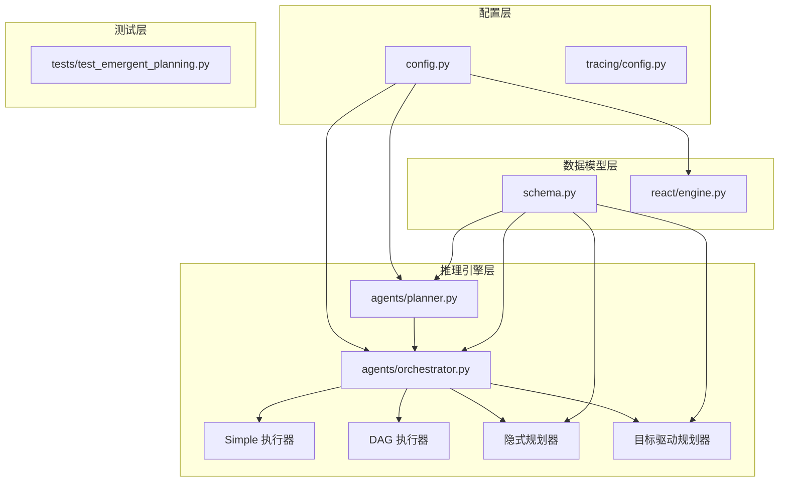
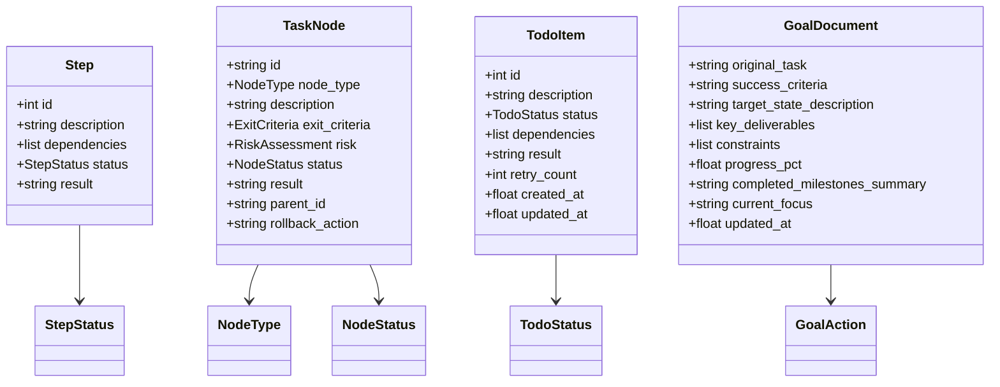
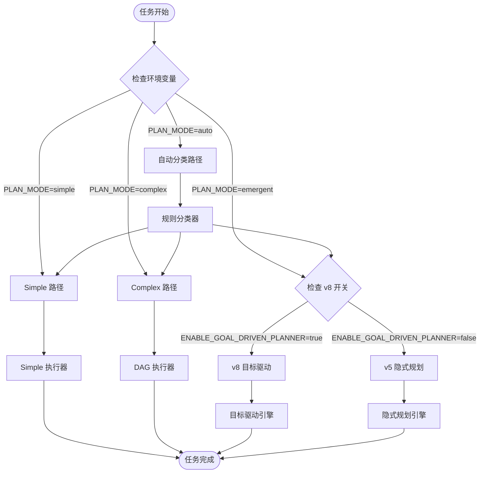
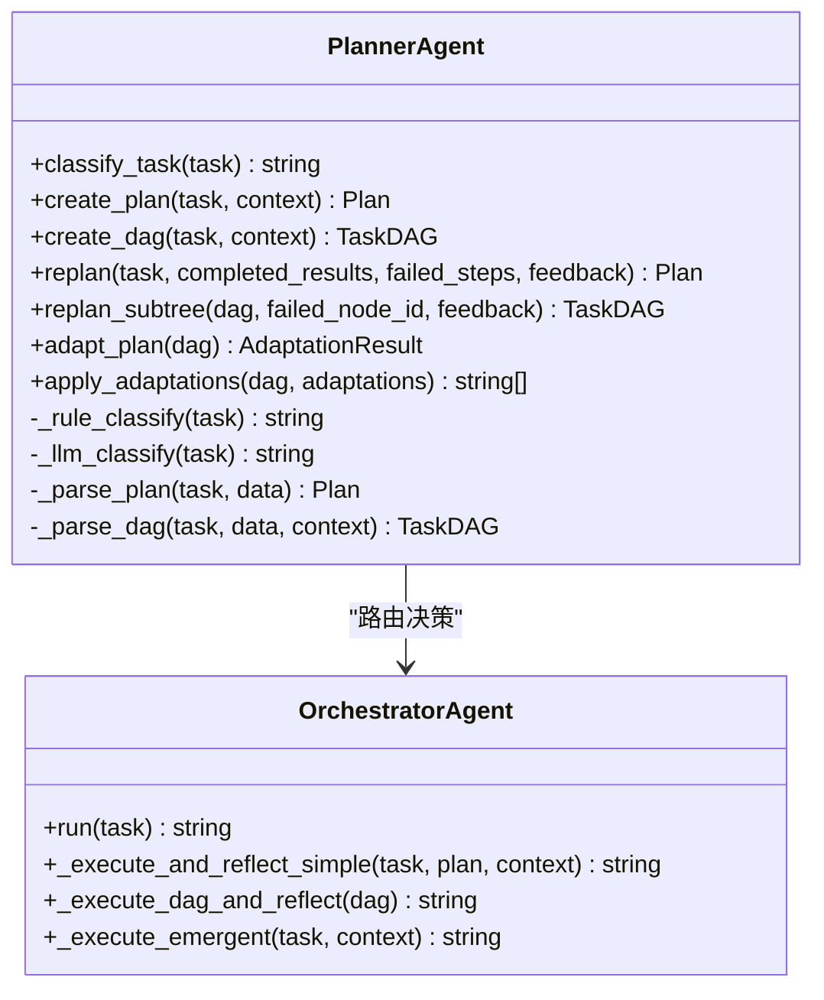
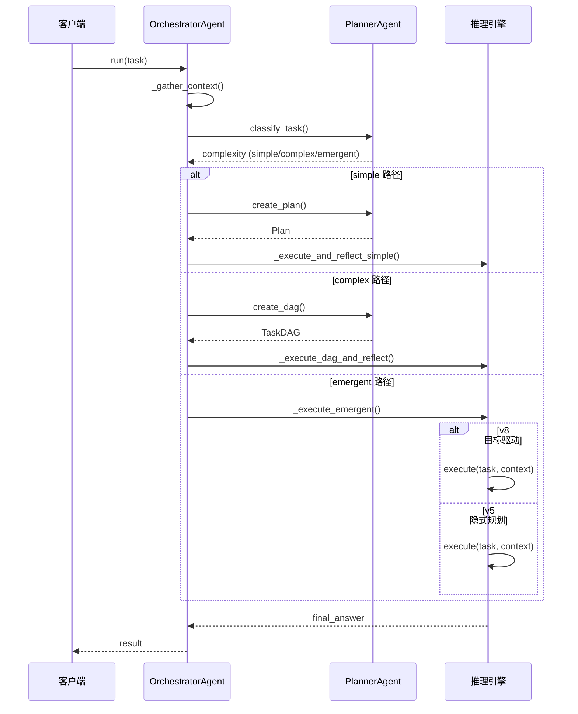
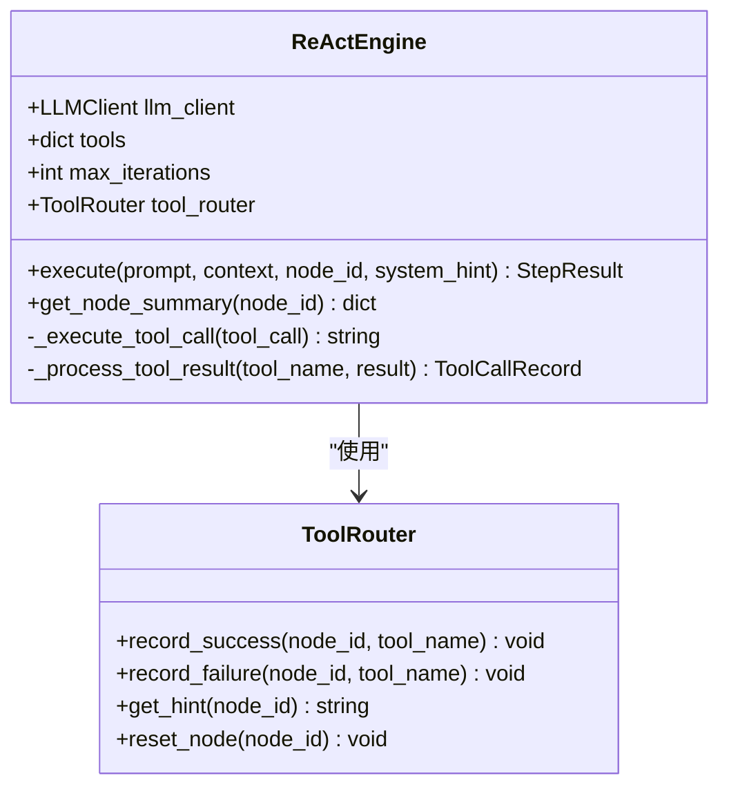
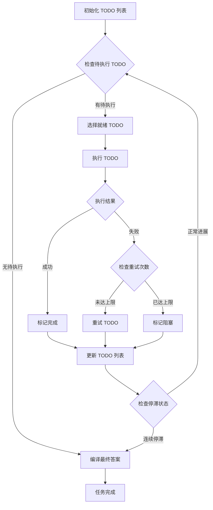
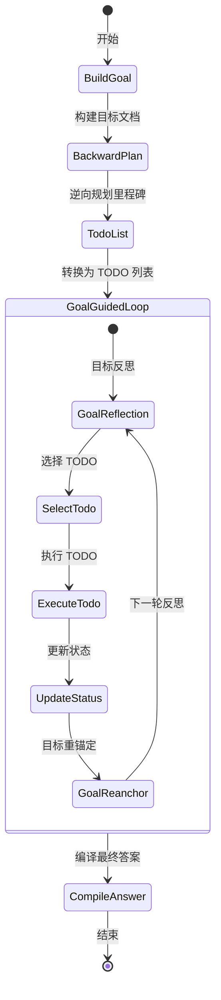
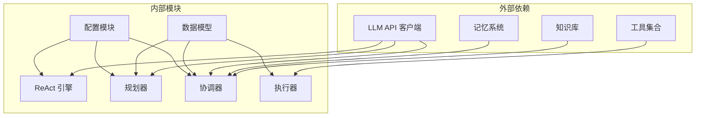

# 推理引擎类型环境变量配置

<cite>
**本文档引用的文件**
- [推理引擎类型环境变量配置.md](file://sxw_aicoding/docs/推理引擎类型环境变量配置.md)
- [config.py](file://config.py)
- [schema.py](file://schema.py)
- [engine.py](file://react/engine.py)
- [planner.py](file://agents/planner.py)
- [orchestrator.py](file://agents/orchestrator.py)
- [emergent_planner.py](file://agents/emergent_planner.py)
- [goal_driven_planner.py](file://agents/goal_driven_planner.py)
- [config.py](file://tracing/config.py)
- [test_emergent_planning.py](file://tests/test_emergent_planning.py)
</cite>

## 目录
1. [简介](#简介)
2. [项目结构](#项目结构)
3. [核心组件](#核心组件)
4. [架构概览](#架构概览)
5. [详细组件分析](#详细组件分析)
6. [依赖分析](#依赖分析)
7. [性能考虑](#性能考虑)
8. [故障排除指南](#故障排除指南)
9. [结论](#结论)

## 简介

本文档详细介绍了 Manus Demo 项目中的推理引擎类型环境变量配置系统。该项目实现了四种不同的推理引擎类型，通过环境变量进行灵活配置和切换：

- **Simple（v1）**：扁平计划 - 顺序执行
- **Complex（v2）**：DAG - 并行超步执行  
- **Emergent v5**：TODO 列表驱动
- **Emergent v8**：目标驱动规划（GoalDriven）

系统通过两个核心环境变量 `PLAN_MODE` 和 `ENABLE_GOAL_DRIVEN_PLANNER` 来控制推理引擎的选择和行为。

## 项目结构

项目采用模块化的架构设计，主要包含以下核心模块：

**图表来源**
- [config.py:1-109](file://config.py#L1-L109)
- [planner.py:1-800](file://agents/planner.py#L1-L800)
- [orchestrator.py:1-601](file://agents/orchestrator.py#L1-L601)

**章节来源**
- [config.py:1-109](file://config.py#L1-L109)
- [schema.py:1-702](file://schema.py#L1-L702)

## 核心组件

### 环境变量配置系统

系统通过环境变量实现灵活的推理引擎配置，主要包含以下配置项：

#### 核心路由变量
| 变量名 | 默认值 | 作用 | 影响范围 |
|--------|--------|------|----------|
| `PLAN_MODE` | `auto` | 决定走 simple / complex / emergent 路径 | 全局路由控制 |
| `ENABLE_GOAL_DRIVEN_PLANNER` | `false` | 在 emergent 路径内决定走 v5 还是 v8 | v8 目标驱动引擎开关 |

#### 推理引擎专用配置
| 变量名 | 默认值 | 作用 | 适用引擎 |
|--------|--------|------|----------|
| `EMERGENT_PLANNING_ENABLED` | `true` | 是否启用隐式规划模式 | v5/v8 引擎 |
| `ENABLE_REACT_ENGINE_V2` | `false` | 使用抽取后的统一 ReActEngine | v5/v8 引擎 |
| `MAX_TODO_ITEMS` | `20` | TODO 列表最大项数 | v5/v8 引擎 |
| `MAX_GOAL_DRIVEN_ITERATIONS` | `60` | v8 主循环最大迭代数 | v8 引擎 |

**章节来源**
- [推理引擎类型环境变量配置.md:17-95](file://sxw_aicoding/docs/推理引擎类型环境变量配置.md#L17-L95)
- [config.py:38-96](file://config.py#L38-L96)

### 数据模型架构

系统使用 Pydantic 数据模型定义了四种推理引擎的数据结构：

**图表来源**
- [schema.py:47-625](file://schema.py#L47-L625)

**章节来源**
- [schema.py:1-702](file://schema.py#L1-L702)

## 架构概览

系统采用混合路由架构，通过两阶段分类器自动选择最适合的推理引擎：

**图表来源**
- [planner.py:287-436](file://agents/planner.py#L287-L436)
- [orchestrator.py:158-222](file://agents/orchestrator.py#L158-L222)

**章节来源**
- [planner.py:287-436](file://agents/planner.py#L287-L436)
- [orchestrator.py:158-222](file://agents/orchestrator.py#L158-L222)

## 详细组件分析

### PlannerAgent 类分析

PlannerAgent 是系统的分类器和路由中心，负责根据任务复杂度选择合适的推理引擎：

**图表来源**
- [planner.py:221-799](file://agents/planner.py#L221-L799)
- [orchestrator.py:60-510](file://agents/orchestrator.py#L60-L510)

#### 任务分类算法

PlannerAgent 实现了两阶段的任务复杂度分类算法：

1. **规则快筛阶段**：基于关键词模式匹配和启发式规则快速判断
2. **LLM 分类阶段**：对模糊任务进行轻量级 LLM 分类

**章节来源**
- [planner.py:287-436](file://agents/planner.py#L287-L436)

### OrchestratorAgent 类分析

OrchestratorAgent 作为系统的协调器，负责执行具体的推理引擎：

**图表来源**
- [orchestrator.py:158-222](file://agents/orchestrator.py#L158-L222)
- [planner.py:443-580](file://agents/planner.py#L443-L580)

**章节来源**
- [orchestrator.py:158-222](file://agents/orchestrator.py#L158-L222)

### ReActEngine 统一执行引擎

ReActEngine 提供了统一的推理-行动执行框架：

**图表来源**
- [engine.py:43-246](file://react/engine.py#L43-L246)

**章节来源**
- [engine.py:43-246](file://react/engine.py#L43-L246)

### EmergentPlannerAgent 分析

隐式规划器实现了 Claude Code 风格的 TODO 列表管理：

**图表来源**
- [emergent_planner.py:134-276](file://agents/emergent_planner.py#L134-L276)

**章节来源**
- [emergent_planner.py:134-276](file://agents/emergent_planner.py#L134-L276)

### GoalDrivenPlannerAgent 分析

目标驱动规划器实现了 ReflAct 风格的目标状态反思：

**图表来源**
- [goal_driven_planner.py:261-399](file://agents/goal_driven_planner.py#L261-L399)

**章节来源**
- [goal_driven_planner.py:261-399](file://agents/goal_driven_planner.py#L261-L399)

## 依赖分析

系统采用松耦合的设计，主要依赖关系如下：

**图表来源**
- [config.py:1-109](file://config.py#L1-L109)
- [orchestrator.py:37-56](file://agents/orchestrator.py#L37-L56)

**章节来源**
- [config.py:1-109](file://config.py#L1-L109)
- [orchestrator.py:37-56](file://agents/orchestrator.py#L37-L56)

## 性能考虑

### 并行执行优化

系统通过以下机制优化性能：

1. **DAG 并行执行**：复杂任务通过并行超步执行提升吞吐量
2. **智能重试机制**：失败的 TODO 项支持有限次数的重试
3. **停滞检测**：防止无限循环执行
4. **资源限制**：通过配置项控制最大并行度和执行时间

### 内存管理

- **短期记忆窗口**：控制短期记忆的大小
- **TODO 列表限制**：防止 TODO 列表无限增长
- **执行结果压缩**：超过阈值时自动压缩上下文

## 故障排除指南

### 常见配置问题

1. **推理引擎无法切换**
   - 检查 `PLAN_MODE` 环境变量设置
   - 确认 `ENABLE_GOAL_DRIVEN_PLANNER` 开关状态

2. **v8 引擎未生效**
   - 确认 `ENABLE_GOAL_DRIVEN_PLANNER=true`
   - 检查 `EMERGENT_PLANNING_ENABLED=true`

3. **TODO 列表管理异常**
   - 检查 `MAX_TODO_ITEMS` 配置
   - 验证 TODO 依赖关系的正确性

### 性能问题诊断

1. **执行速度慢**
   - 检查 `MAX_PARALLEL_NODES` 设置
   - 优化 `NODE_EXECUTION_TIMEOUT`

2. **内存占用过高**
   - 调整 `SHORT_TERM_WINDOW`
   - 检查 TODO 列表增长情况

**章节来源**
- [config.py:21-96](file://config.py#L21-L96)
- [test_emergent_planning.py:272-279](file://tests/test_emergent_planning.py#L272-L279)

## 结论

Manus Demo 项目的推理引擎类型环境变量配置系统提供了高度灵活和可扩展的推理能力。通过精心设计的环境变量体系和模块化架构，系统能够根据不同任务的特点自动选择最优的推理策略。

关键优势包括：

1. **灵活的路由机制**：支持手动强制和自动分类两种模式
2. **可插拔的执行引擎**：四种不同的推理引擎可以独立配置和优化
3. **完善的监控体系**：通过追踪配置实现全链路可观测性
4. **强大的扩展性**：新的推理引擎类型可以轻松集成

该配置系统为复杂任务处理提供了坚实的技术基础，能够适应从简单到复杂的各种应用场景。