# 目标驱动规划器

<cite>
**本文引用的文件**
- [goal_driven_planner.py](file://agents/goal_driven_planner.py)
- [base.py](file://agents/base.py)
- [planner.py](file://agents/planner.py)
- [orchestrator.py](file://agents/orchestrator.py)
- [schema.py](file://schema.py)
- [config.py](file://config.py)
- [test_goal_driven_planner.py](file://tests/test_goal_driven_planner.py)
- [README.md](file://README.md)
- [executor.py](file://dag/executor.py)
- [graph.py](file://dag/graph.py)
- [manager.py](file://context/manager.py)
- [state_machine.py](file://dag/state_machine.py)
</cite>

## 目录
1. [简介](#简介)
2. [项目结构](#项目结构)
3. [核心组件](#核心组件)
4. [架构总览](#架构总览)
5. [详细组件分析](#详细组件分析)
6. [依赖分析](#依赖分析)
7. [性能考量](#性能考量)
8. [故障排查指南](#故障排查指南)
9. [结论](#结论)
10. [附录](#附录)

## 简介
本技术文档围绕目标驱动规划器（Goal-Driven Planner）展开，系统阐述其"以终为始"的核心理念、架构设计与实现细节。目标驱动规划器通过在执行过程中持续锚定目标文档（GoalDocument），采用逆向规划生成里程碑（Milestone），并以目标反思（GoalReflection）指导下一步行动，结合有界消息上下文与主动 TODO 刷新，形成闭环的计划-执行-反思-再锚定流程。相比传统规划器（如 v1 扁平计划、v2 DAG 分层计划、v5 隐式规划），目标驱动规划器在长周期任务中显著降低目标漂移风险，提升稳定性与一致性。

**更新** v8版本引入了多项重要增强：双模式条件评估策略、改进的上下文管理（安全分割点查找）、改进的DAG执行（条件跳过和回退重定向），进一步提升了系统的智能化水平和执行效率。

## 项目结构
目标驱动规划器位于 agents 子模块中，与 Orchestrator 协调工作，通过配置开关启用/禁用。其核心数据模型定义在 schema.py 中，基础交互能力由 BaseAgent 提供，路由与调度由 Orchestrator 负责。

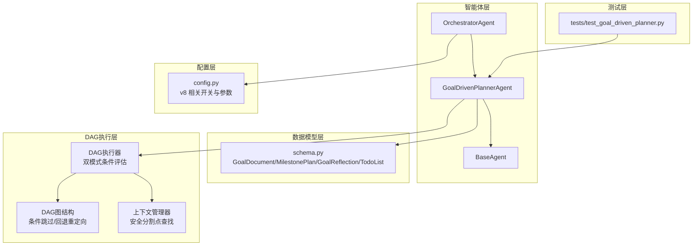

**图表来源**
- [goal_driven_planner.py:1-120](file://agents/goal_driven_planner.py#L1-L120)
- [base.py:1-183](file://agents/base.py#L1-L183)
- [schema.py:570-656](file://schema.py#L570-L656)
- [config.py:90-97](file://config.py#L90-L97)
- [test_goal_driven_planner.py:1-120](file://tests/test_goal_driven_planner.py#L1-L120)
- [executor.py:460-510](file://dag/executor.py#L460-L510)
- [graph.py:1-627](file://dag/graph.py#L1-L627)
- [manager.py:150-190](file://context/manager.py#L150-L190)

**章节来源**
- [README.md:22-76](file://README.md#L22-L76)
- [config.py:90-97](file://config.py#L90-L97)

## 核心组件
- GoalDrivenPlannerAgent：目标驱动规划与执行引擎，负责目标锚定、逆向规划、里程碑转 TODO、目标反思、目标重锚定、TODO 主动刷新与最终答案合成。
- BaseAgent：提供系统提示词管理、消息历史追踪、与 LLMClient 的交互封装以及上下文压缩。
- 数据模型：GoalDocument、Milestone、MilestonePlan、GoalReflection、TodoList/TodoItem 等，支撑目标状态、里程碑序列与 TODO 列表管理。
- Orchestrator：在 v8 模式下将任务路由到 GoalDrivenPlannerAgent，提供事件广播与质量门控。
- 配置：ENABLE_GOAL_DRIVEN_PLANNER、GOAL_REANCHOR_INTERVAL、GOAL_REFLECTION_INTERVAL、MAX_GOAL_DRIVEN_ITERATIONS、GOAL_DRIVEN_STAGNATION_WINDOW 等参数控制行为。
- **新增** DAG执行器：实现双模式条件评估策略，支持元条件和内容关键词两种评估方式。
- **新增** 上下文管理器：实现安全分割点查找，确保工具调用配对不被破坏。
- **新增** DAG图结构：支持条件跳过和回退重定向机制。

**章节来源**
- [goal_driven_planner.py:214-400](file://agents/goal_driven_planner.py#L214-L400)
- [base.py:29-183](file://agents/base.py#L29-L183)
- [schema.py:570-656](file://schema.py#L570-L656)
- [orchestrator.py:130-142](file://agents/orchestrator.py#L130-L142)
- [config.py:90-97](file://config.py#L90-L97)
- [executor.py:460-510](file://dag/executor.py#L460-L510)
- [manager.py:150-190](file://context/manager.py#L150-L190)
- [graph.py:180-213](file://dag/graph.py#L180-L213)

## 架构总览
目标驱动规划器采用"目标锚定 + 逆向规划 + TODO 列表 + 目标反思 + 目标重锚定 + 主动 TODO 刷新"的闭环流程。其核心思想是：先定义"完成"（GoalDocument），再从目标状态逆向推导里程碑，将里程碑转化为可执行的 TODO，然后在每次迭代中通过目标反思选择下一步，执行 TODO 并在必要时重锚定目标与刷新 TODO。

**更新** v8版本架构中集成了改进的DAG执行系统，支持更智能的条件评估和执行控制。

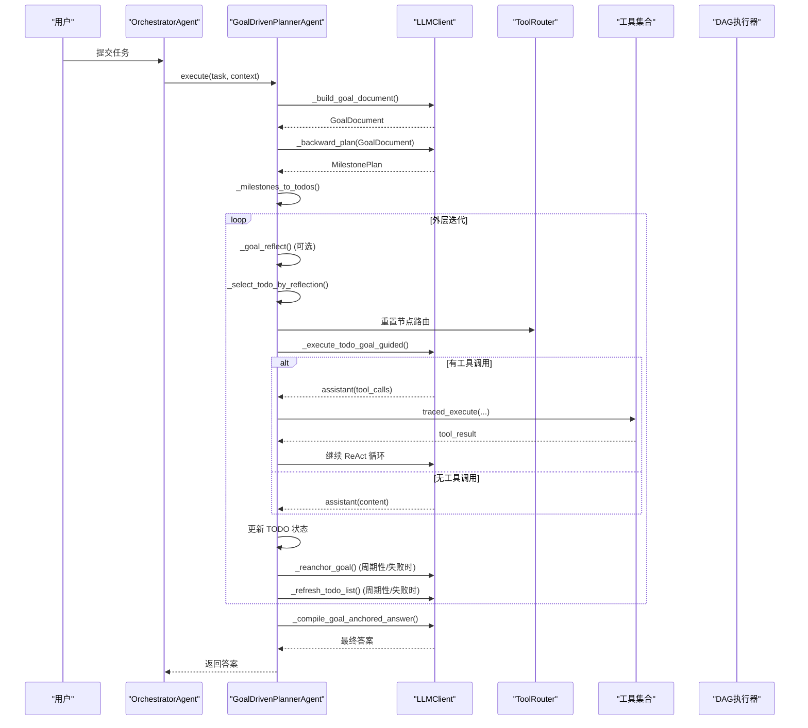

**图表来源**
- [goal_driven_planner.py:261-399](file://agents/goal_driven_planner.py#L261-L399)
- [goal_driven_planner.py:575-752](file://agents/goal_driven_planner.py#L575-L752)
- [goal_driven_planner.py:759-800](file://agents/goal_driven_planner.py#L759-L800)
- [goal_driven_planner.py:185-202](file://agents/goal_driven_planner.py#L185-L202)

**章节来源**
- [goal_driven_planner.py:261-399](file://agents/goal_driven_planner.py#L261-L399)

## 详细组件分析

### GoalDrivenPlannerAgent 类与核心流程
GoalDrivenPlannerAgent 继承自 BaseAgent，具备独立的消息历史与系统提示词，通过有界 ReAct 循环执行 TODO，并在每次迭代中进行目标反思与 TODO 刷新，周期性进行目标重锚定以抵御目标漂移。

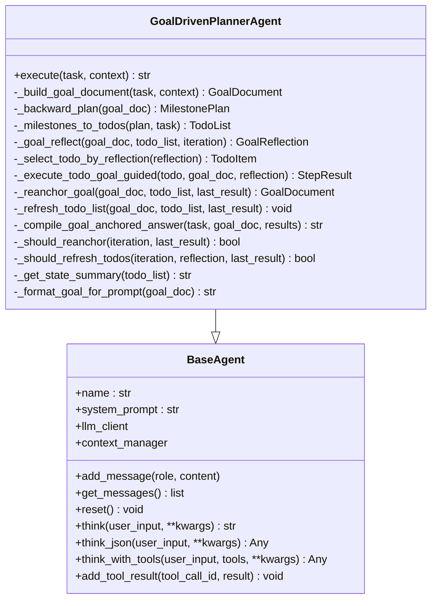

**图表来源**
- [base.py:29-183](file://agents/base.py#L29-L183)
- [goal_driven_planner.py:214-400](file://agents/goal_driven_planner.py#L214-L400)

**章节来源**
- [goal_driven_planner.py:214-400](file://agents/goal_driven_planner.py#L214-L400)

### 目标锚定与逆向规划
- 目标锚定：通过结构化 JSON 提示词 Ask LLM 定义"完成"标准、目标状态、关键交付物与约束，生成 GoalDocument。
- 逆向规划：从目标状态出发，反向推导里程碑序列，形成"目标 → 里程碑 → 子目标"的倒序结构，便于聚焦阶段性成果。
- 里程碑到 TODO：将里程碑线性化为有依赖的 TODO 列表，保证执行顺序与可验证性。

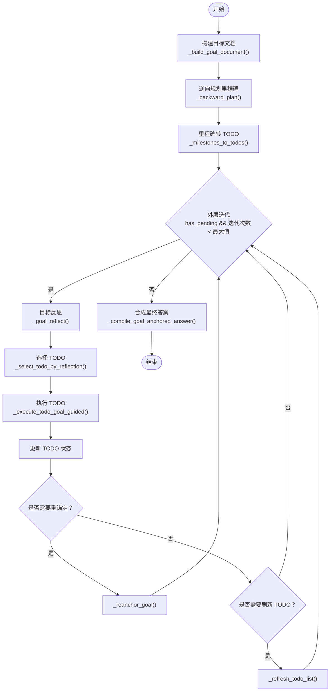

**图表来源**
- [goal_driven_planner.py:406-480](file://agents/goal_driven_planner.py#L406-L480)
- [goal_driven_planner.py:486-524](file://agents/goal_driven_planner.py#L486-L524)
- [goal_driven_planner.py:547-568](file://agents/goal_driven_planner.py#L547-L568)
- [goal_driven_planner.py:575-752](file://agents/goal_driven_planner.py#L575-L752)
- [goal_driven_planner.py:759-800](file://agents/goal_driven_planner.py#L759-L800)
- [goal_driven_planner.py:203-212](file://agents/goal_driven_planner.py#L203-L212)

**章节来源**
- [goal_driven_planner.py:406-480](file://agents/goal_driven_planner.py#L406-L480)
- [goal_driven_planner.py:486-524](file://agents/goal_driven_planner.py#L486-L524)
- [goal_driven_planner.py:547-568](file://agents/goal_driven_planner.py#L547-L568)
- [goal_driven_planner.py:575-752](file://agents/goal_driven_planner.py#L575-L752)
- [goal_driven_planner.py:759-800](file://agents/goal_driven_planner.py#L759-L800)
- [goal_driven_planner.py:203-212](file://agents/goal_driven_planner.py#L203-L212)

### 目标反思与 TODO 选择
- 目标反思：比较当前状态与目标，输出差距分析、下一步里程碑、进度百分比与建议动作（执行/重规划/完成）。
- TODO 选择：优先匹配反思中的"下一步里程碑"，否则选择第一个就绪 TODO；若无可执行 TODO，则选择第一个待执行 TODO 作为逃生舱口。

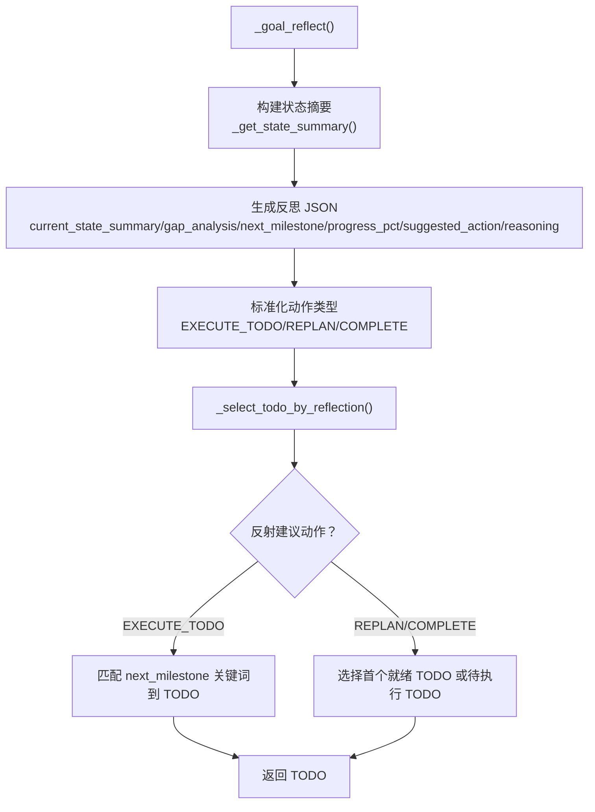

**图表来源**
- [goal_driven_planner.py:486-524](file://agents/goal_driven_planner.py#L486-L524)
- [goal_driven_planner.py:526-541](file://agents/goal_driven_planner.py#L526-L541)
- [goal_driven_planner.py:547-568](file://agents/goal_driven_planner.py#L547-L568)

**章节来源**
- [goal_driven_planner.py:486-524](file://agents/goal_driven_planner.py#L486-L524)
- [goal_driven_planner.py:526-541](file://agents/goal_driven_planner.py#L526-L541)
- [goal_driven_planner.py:547-568](file://agents/goal_driven_planner.py#L547-L568)

### 目标引导的 ReAct 执行
- 有界消息上下文：每轮 ReAct 仅保留系统消息与最近约 20 条消息，保护工具调用配对，避免上下文溢出。
- 目标注入：首次消息包含目标文档摘要（成功标准、目标状态、关键交付物、约束、进度、当前焦点），后续迭代注入"继续"与"当前焦点"。
- 工具调用：记录工具调用日志，支持错误标记与重试策略；达到最大迭代次数仍未完成则视为失败。

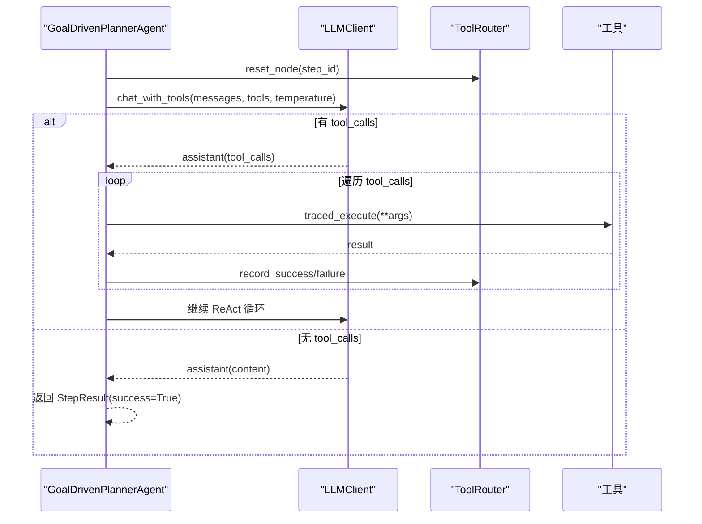

**图表来源**
- [goal_driven_planner.py:575-752](file://agents/goal_driven_planner.py#L575-L752)

**章节来源**
- [goal_driven_planner.py:575-752](file://agents/goal_driven_planner.py#L575-L752)

### 改进的上下文管理（安全分割点查找）
**新增** v8版本引入了改进的上下文管理器，实现了安全分割点查找机制，确保工具调用配对不被破坏。

- **安全分割点查找**：在上下文压缩时，通过 `_find_safe_split()` 方法找到不切割 tool_calls 组的安全切分点。
- **工具调用配对保护**：确保 assistant{tool_calls} 与其后的 tool{tool_call_id} 消息不会被分割，维护对话历史的完整性。
- **智能压缩策略**：在保留 system prompt 和最近消息的同时，智能压缩旧消息，避免破坏工具调用的结构化配对。

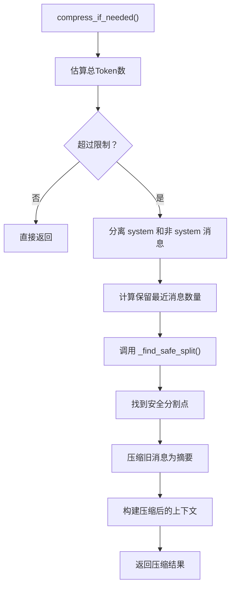

**图表来源**
- [manager.py:82-144](file://context/manager.py#L82-L144)
- [manager.py:150-190](file://context/manager.py#L150-L190)

**章节来源**
- [manager.py:82-144](file://context/manager.py#L82-L144)
- [manager.py:150-190](file://context/manager.py#L150-L190)

### 增强的条件评估（双模式策略）
**新增** v8版本在DAG执行器中实现了双模式条件评估策略，显著提升了条件判断的智能化水平。

- **元条件评估**：条件中引用节点 ID（如 "act_1_1成功"）时，直接检查被引用节点的执行状态，而非在源节点结果中做子串匹配。
- **内容关键词匹配**：条件是期望出现在结果文本中的关键词时，对源节点输出做子串/正则匹配。
- **智能降级机制**：当元条件引用的节点 ID 不存在时，自动降级到内容关键词匹配逻辑。
- **多语言支持**：针对CJK字符和拉丁文本分别采用不同的匹配策略，确保跨语言场景的准确性。

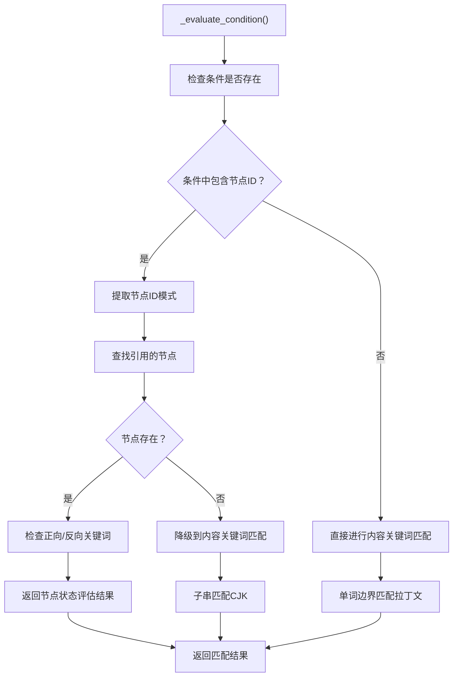

**图表来源**
- [executor.py:460-510](file://dag/executor.py#L460-L510)

**章节来源**
- [executor.py:460-510](file://dag/executor.py#L460-L510)

### 改进的DAG执行（条件跳过和回退重定向）
**新增** v8版本增强了DAG执行系统，实现了更智能的条件跳过和回退重定向机制。

- **条件跳过机制**：当条件评估失败时，自动跳过目标节点及其整个子树，避免在不完整状态上继续执行。
- **回退重定向**：支持失败节点的回滚和重定向，通过状态机确保节点状态的合法性转移。
- **级联跳过**：当上游节点失败时，自动级联跳过所有下游依赖节点，防止错误传播。
- **状态机强制**：通过 NodeStateMachine 确保节点只能按照合法路径进行状态转移。

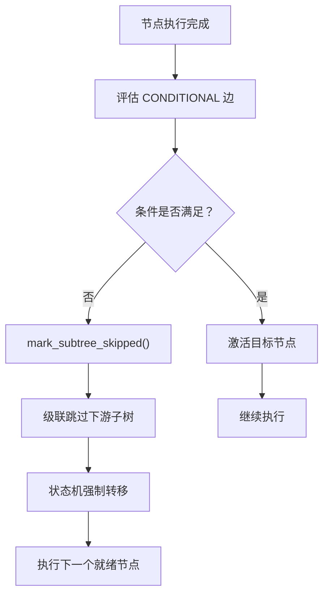

**图表来源**
- [graph.py:184-198](file://dag/graph.py#L184-L198)
- [state_machine.py:88-103](file://dag/state_machine.py#L88-L103)

**章节来源**
- [graph.py:184-198](file://dag/graph.py#L184-L198)
- [state_machine.py:88-103](file://dag/state_machine.py#L88-L103)

### 目标重锚定与 TODO 主动刷新
- 目标重锚定：周期性或失败时，基于执行进度、已完成里程碑、剩余 TODO 与最后结果，更新目标文档的进度与当前焦点，检测目标偏移并应用纠正。
- TODO 主动刷新：周期性或失败时，基于执行进度与最后结果，对 TODO 列表进行新增、修改或阻塞处理，避免死循环与无效工作。

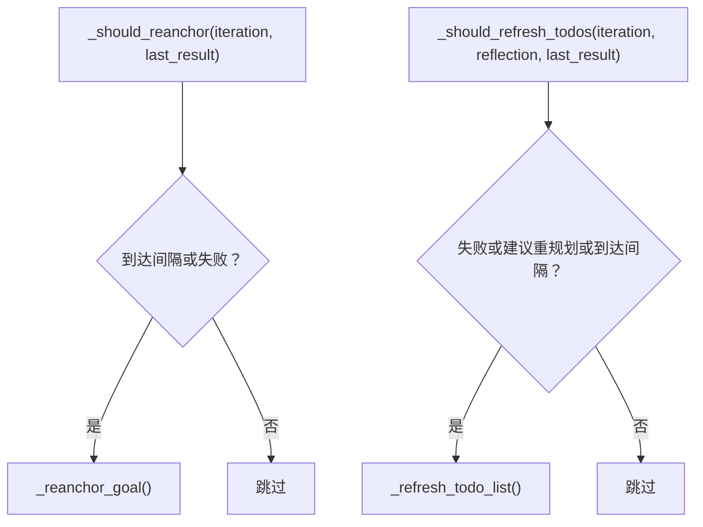

**图表来源**
- [goal_driven_planner.py:759-800](file://agents/goal_driven_planner.py#L759-L800)
- [goal_driven_planner.py:390-394](file://agents/goal_driven_planner.py#L390-L394)

**章节来源**
- [goal_driven_planner.py:759-800](file://agents/goal_driven_planner.py#L759-L800)
- [goal_driven_planner.py:390-394](file://agents/goal_driven_planner.py#L390-L394)

### 数据模型与状态管理
- GoalDocument：持久化目标状态，包含原始任务、成功标准、目标状态描述、关键交付物、约束、进度百分比、已完成里程碑摘要、当前焦点与更新时间。
- Milestone/MilestonePlan：里程碑序列与逆向推理依据。
- GoalReflection：每次迭代的目标状态对比结果，包含当前状态摘要、差距分析、下一步里程碑、进度百分比、建议动作与推理。
- TodoList/TodoItem：TODO 列表与项，支持依赖、状态（待执行/进行中/已完成/阻塞）、重试计数与结果记录。

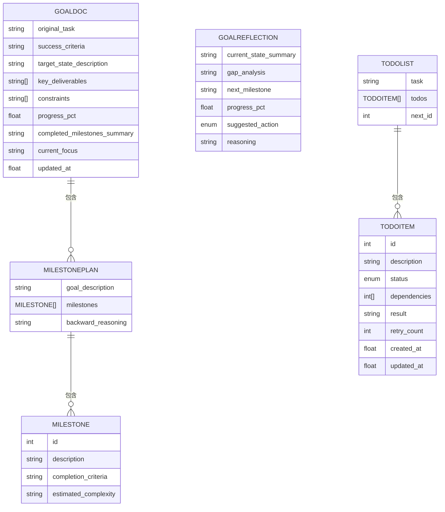

**图表来源**
- [schema.py:596-656](file://schema.py#L596-L656)
- [schema.py:575-594](file://schema.py#L575-L594)
- [schema.py:631-645](file://schema.py#L631-L645)
- [schema.py:395-440](file://schema.py#L395-L440)

**章节来源**
- [schema.py:596-656](file://schema.py#L596-L656)
- [schema.py:575-594](file://schema.py#L575-L594)
- [schema.py:631-645](file://schema.py#L631-L645)
- [schema.py:395-440](file://schema.py#L395-L440)

## 依赖分析
- 与 Orchestrator 的耦合：Orchestrator 在 v8 模式下将任务路由到 GoalDrivenPlannerAgent，并在完成后进行质量门控与事件广播。
- 与 Schema 的耦合：GoalDrivenPlannerAgent 依赖 GoalDocument、MilestonePlan、GoalReflection、TodoList 等数据模型。
- 与 Config 的耦合：通过配置参数控制目标重锚定间隔、目标反思间隔、最大迭代次数、停滞窗口等。
- 与 BaseAgent 的耦合：复用系统提示词管理、消息历史与 LLM 交互能力。
- **新增** 与 DAG执行器的耦合：集成双模式条件评估和智能执行控制。
- **新增** 与上下文管理器的耦合：实现安全的上下文压缩和分割点查找。

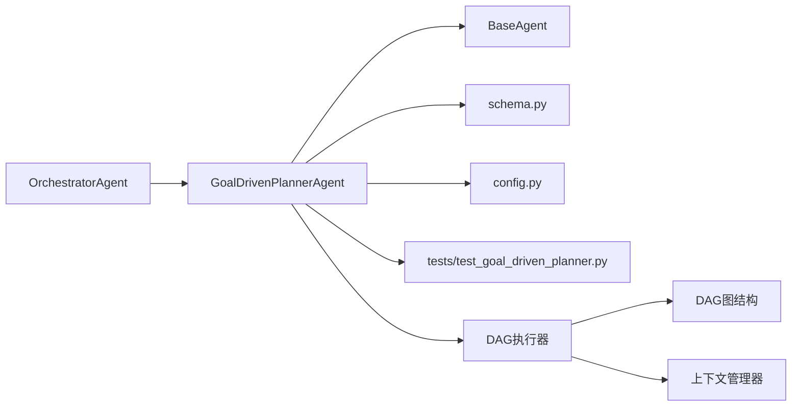

**图表来源**
- [orchestrator.py:130-142](file://agents/orchestrator.py#L130-L142)
- [goal_driven_planner.py:214-400](file://agents/goal_driven_planner.py#L214-L400)
- [schema.py:570-656](file://schema.py#L570-L656)
- [config.py:90-97](file://config.py#L90-L97)
- [test_goal_driven_planner.py:1-120](file://tests/test_goal_driven_planner.py#L1-L120)
- [executor.py:460-510](file://dag/executor.py#L460-L510)
- [manager.py:150-190](file://context/manager.py#L150-L190)

**章节来源**
- [orchestrator.py:130-142](file://agents/orchestrator.py#L130-L142)
- [goal_driven_planner.py:214-400](file://agents/goal_driven_planner.py#L214-L400)
- [schema.py:570-656](file://schema.py#L570-L656)
- [config.py:90-97](file://config.py#L90-L97)
- [test_goal_driven_planner.py:1-120](file://tests/test_goal_driven_planner.py#L1-L120)

## 性能考量
- 有界消息上下文：ReAct 循环中仅保留系统消息与最近约 20 条消息，避免上下文膨胀导致的延迟与成本上升。
- 最大迭代限制：通过 MAX_REACT_ITERATIONS 控制单个 TODO 的最大迭代次数，防止无限循环。
- 停滞检测：连续若干轮无进度突破自动终止，减少无效执行。
- 目标重锚定与 TODO 刷新：周期性执行可避免长期执行中的目标偏移与 TODO 膨胀，提高整体效率。
- 工具路由：失败阈值触发替代工具建议，减少无效重试。
- **新增** 双模式条件评估：元条件评估避免了不必要的文本匹配开销，提高了条件判断效率。
- **新增** 安全上下文压缩：智能分割点查找减少了上下文压缩的失败率，提升了整体执行稳定性。
- **新增** DAG执行优化：条件跳过和回退重定向减少了无效执行，提高了DAG执行的整体效率。

## 故障排查指南
- 目标反思建议动作异常：动作类型经归一化处理，若出现"重规划/完成"等变体，将映射为标准枚举值，确保流程稳定。
- TODO 选择失败：当反思中的"下一步里程碑"无法匹配到 TODO 时，将回退到首个就绪 TODO；若无可执行 TODO，选择首个待执行 TODO。
- 执行超时：单个 TODO 执行超时将返回失败 StepResult，触发 TODO 状态更新与可能的阻塞。
- 目标重锚定：失败时总是触发重锚定，周期性触发由 GOAL_REANCHOR_INTERVAL 控制；成功但进度停滞也可能触发。
- TODO 刷新：失败或建议重规划或到达间隔时触发，避免长期执行中的 TODO 偏离实际。
- **新增** 条件评估异常：当元条件引用的节点不存在时，系统会自动降级到内容关键词匹配，确保执行不中断。
- **新增** 上下文压缩失败：当无法找到安全分割点时，系统会放弃压缩并返回原始消息，确保对话历史完整性。
- **新增** DAG执行错误：当节点状态转移非法时，NodeStateMachine 会抛出 InvalidTransitionError，帮助定位执行问题。

**章节来源**
- [goal_driven_planner.py:504-515](file://agents/goal_driven_planner.py#L504-L515)
- [goal_driven_planner.py:547-568](file://agents/goal_driven_planner.py#L547-L568)
- [goal_driven_planner.py:350-365](file://agents/goal_driven_planner.py#L350-L365)
- [goal_driven_planner.py:382-388](file://agents/goal_driven_planner.py#L382-L388)
- [goal_driven_planner.py:390-394](file://agents/goal_driven_planner.py#L390-L394)
- [executor.py:460-510](file://dag/executor.py#L460-L510)
- [manager.py:150-190](file://context/manager.py#L150-L190)
- [state_machine.py:88-103](file://dag/state_machine.py#L88-L103)

## 结论
目标驱动规划器通过"以终为始"的目标锚定与逆向规划，结合目标反思与目标重锚定，有效降低了长周期任务中的目标漂移风险；通过有界消息上下文与主动 TODO 刷新，提升了执行稳定性与资源利用率。相较传统规划器，它在探索性与不确定性任务中更具鲁棒性，适合需要持续对齐目标与动态调整计划的场景。

**更新** v8版本通过引入双模式条件评估、改进的上下文管理和DAG执行优化，进一步提升了系统的智能化水平和执行效率。这些增强功能使得目标驱动规划器在复杂任务场景中表现更加出色，能够更好地处理条件复杂的执行流程和跨语言的多模态任务。

## 附录
- 应用场景建议
  - 需要明确"完成"标准的长周期任务（如生成报告、构建系统、代码重构）。
  - 探索性与不确定性任务（如调研、审计、问题诊断），通过目标反思与重锚定持续对齐目标。
  - 需要严格进度评估与里程碑验证的任务，利用里程碑与 TODO 列表进行过程管理。
  - **新增** 复杂条件判断任务：利用双模式条件评估处理多种类型的条件逻辑。
  - **新增** 多语言混合任务：受益于改进的上下文管理和条件评估策略。
  - **新增** 需要智能回退的任务：利用DAG执行的回退重定向机制处理失败场景。
- 最佳实践
  - 明确成功标准与关键交付物，确保 GoalDocument 的可验证性。
  - 合理设置目标反思与重锚定间隔，避免过度干预影响执行效率。
  - 使用工具路由与失败阈值，提升工具使用的稳定性与成功率。
  - 在停滞检测与最大迭代限制下，及时调整任务分解与执行策略。
  - **新增** 利用双模式条件评估：合理设计条件表达式，充分利用元条件和内容关键词的优势。
  - **新增** 优化上下文管理：注意工具调用配对的保护，避免因上下文压缩导致的执行问题。
  - **新增** 设计健壮的DAG结构：合理设置条件边和回退机制，确保执行流程的灵活性和可靠性。