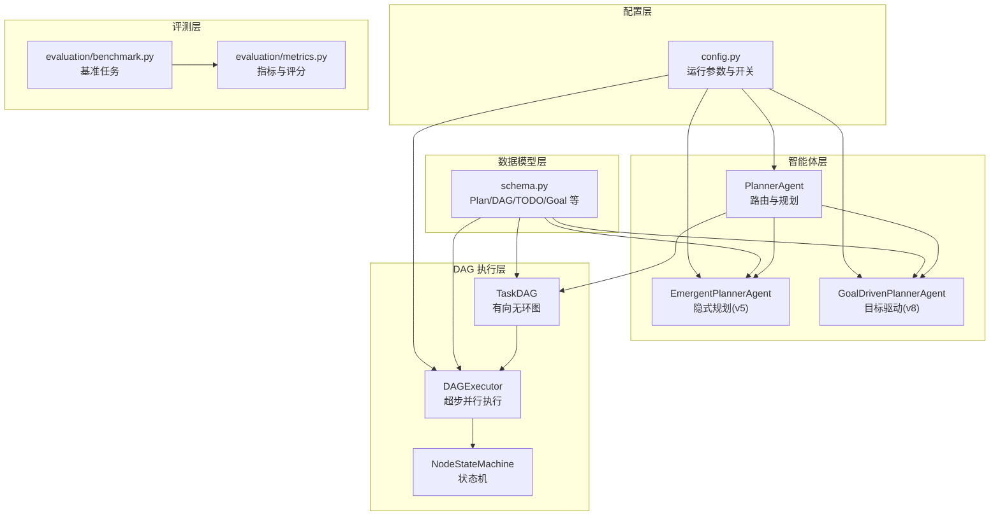
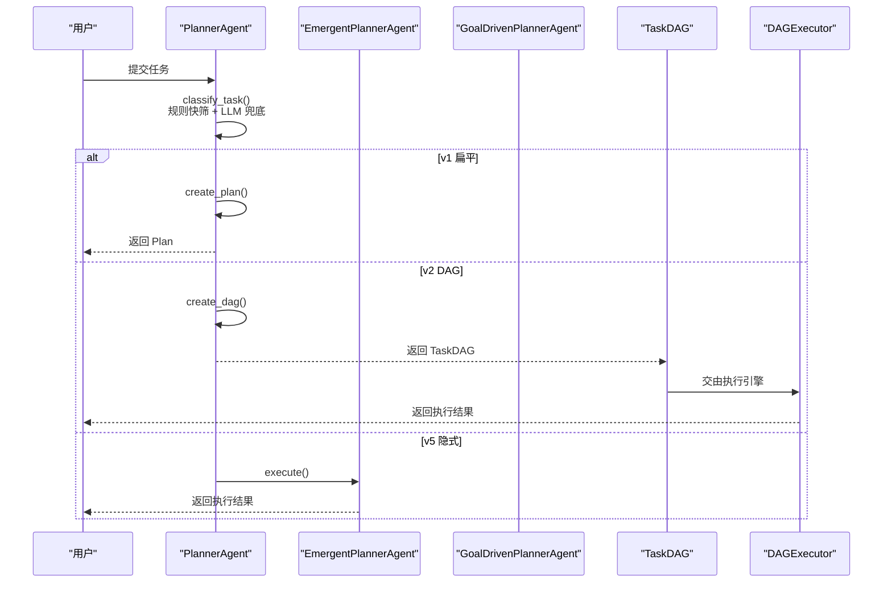
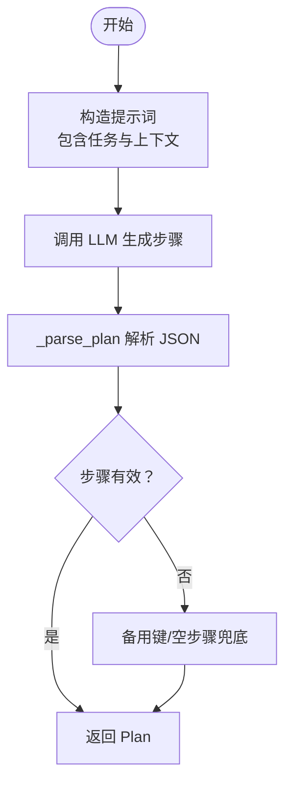
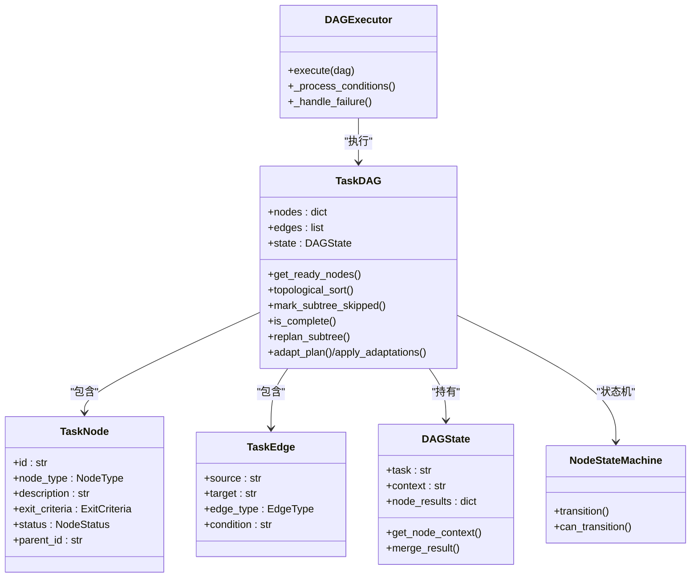
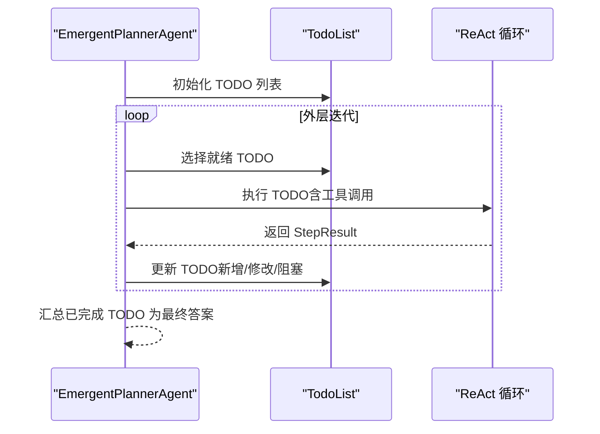
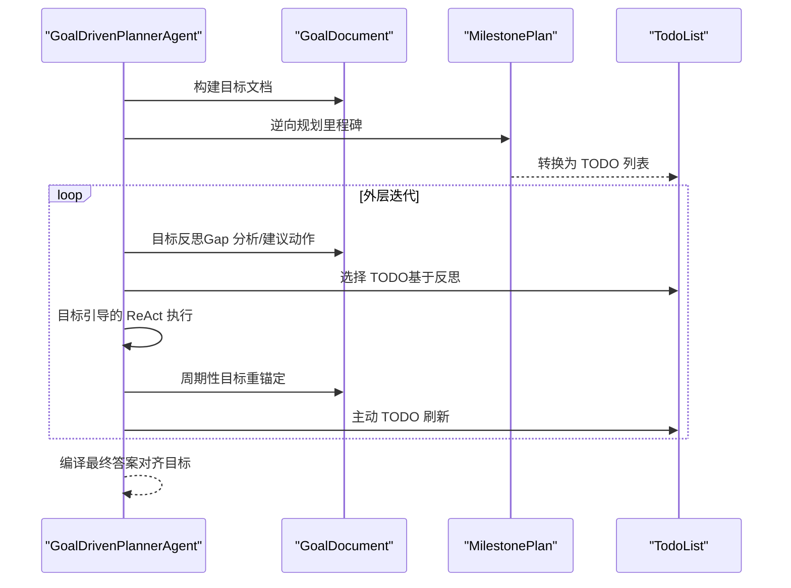
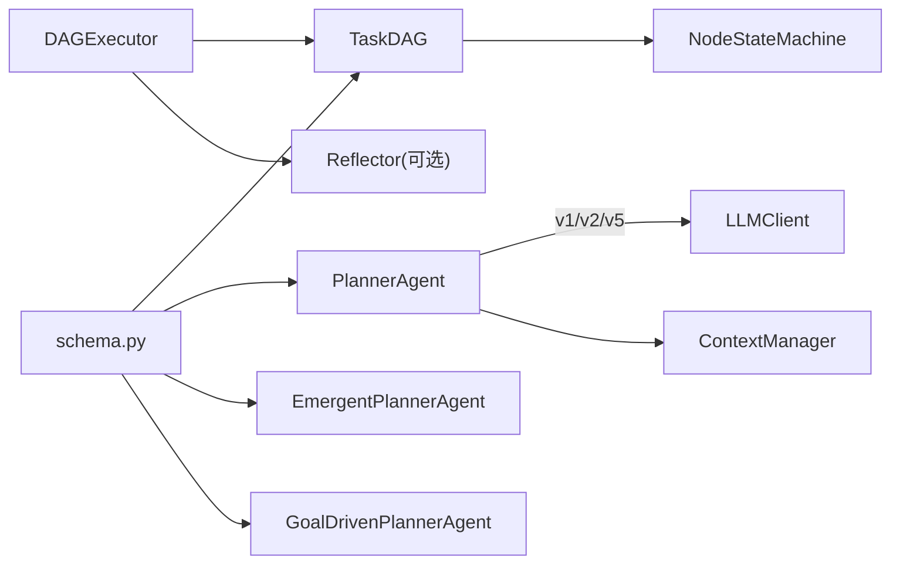

# 规划系统

<cite>
**本文引用的文件**
- [agents/planner.py](file://agents/planner.py)
- [agents/emergent_planner.py](file://agents/emergent_planner.py)
- [agents/goal_driven_planner.py](file://agents/goal_driven_planner.py)
- [dag/graph.py](file://dag/graph.py)
- [dag/executor.py](file://dag/executor.py)
- [dag/state_machine.py](file://dag/state_machine.py)
- [schema.py](file://schema.py)
- [config.py](file://config.py)
- [evaluation/benchmark.py](file://evaluation/benchmark.py)
- [evaluation/metrics.py](file://evaluation/metrics.py)
</cite>

## 目录
1. [简介](#简介)
2. [项目结构](#项目结构)
3. [核心组件](#核心组件)
4. [架构总览](#架构总览)
5. [详细组件分析](#详细组件分析)
6. [依赖分析](#依赖分析)
7. [性能考量](#性能考量)
8. [故障排查指南](#故障排查指南)
9. [结论](#结论)
10. [附录](#附录)

## 简介
本文件为“规划系统”的全面技术文档，聚焦三种规划路径：v1 扁平规划（简单任务）、v2 DAG 规划（复杂任务）与 v5 隐式规划（探索性/不确定性任务）。文档还阐述了任务复杂度分类器的两阶段混合策略（规则快筛 + LLM 兜底）、重规划机制（局部 vs 全局）、目标驱动规划器（v8）的新特性，并给出规划结果的数据结构定义、参数配置与使用示例，以及规划质量评估与性能优化建议。

## 项目结构
- 智能体层：PlannerAgent（路由与规划）、EmergentPlannerAgent（隐式规划）、GoalDrivenPlannerAgent（目标驱动）
- DAG 执行层：TaskDAG（有向无环图）、DAGExecutor（超步并行执行）、NodeStateMachine（状态机）
- 数据模型层：schema.py（Plan/DAG/TODO/Goal 等）
- 配置层：config.py（运行参数与开关）
- 评测层：evaluation/benchmark.py（基准任务）、evaluation/metrics.py（指标与评分）



图表来源
- [agents/planner.py](file://agents/planner.py)
- [agents/emergent_planner.py](file://agents/emergent_planner.py)
- [agents/goal_driven_planner.py](file://agents/goal_driven_planner.py)
- [dag/graph.py](file://dag/graph.py)
- [dag/executor.py](file://dag/executor.py)
- [dag/state_machine.py](file://dag/state_machine.py)
- [schema.py](file://schema.py)
- [config.py](file://config.py)
- [evaluation/benchmark.py](file://evaluation/benchmark.py)
- [evaluation/metrics.py](file://evaluation/metrics.py)

章节来源
- [agents/planner.py](file://agents/planner.py)
- [agents/emergent_planner.py](file://agents/emergent_planner.py)
- [agents/goal_driven_planner.py](file://agents/goal_driven_planner.py)
- [dag/graph.py](file://dag/graph.py)
- [dag/executor.py](file://dag/executor.py)
- [dag/state_machine.py](file://dag/state_machine.py)
- [schema.py](file://schema.py)
- [config.py](file://config.py)
- [evaluation/benchmark.py](file://evaluation/benchmark.py)
- [evaluation/metrics.py](file://evaluation/metrics.py)

## 核心组件
- PlannerAgent：混合路由与规划，支持 v1 扁平计划、v2 DAG 分层计划、v5 隐式规划；内置两阶段复杂度分类器（规则快筛 + LLM 兜底）；提供 replan 与 adapt_plan 能力。
- TaskDAG：分层任务图，支持依赖边、条件边、回滚边；集中式 DAGState；支持动态增删改节点与边；提供拓扑排序、就绪节点发现、下游级联跳过等。
- DAGExecutor：超步并行执行引擎，每轮并行执行就绪 ACTION 节点；支持条件边评估、失败回滚与子树跳过、自适应规划集成。
- NodeStateMachine：强制合法状态转移，保障 DAG 状态一致性。
- EmergentPlannerAgent：隐式规划（v5），以 TODO 列表为中心，Claude Code 风格的 while(tool_use) 主循环，动态演进。
- GoalDrivenPlannerAgent：目标驱动规划（v8），以终为始，逆向规划里程碑，持续目标反思与锚定。
- schema.py：统一数据模型（Plan/DAG/TODO/Goal 等），定义节点类型、状态、边类型、完成判据、风险评估、自适应规划等。
- config.py：运行参数与开关（路由模式、并行度、自适应规划间隔、工具路由阈值、超时、上下文窗口、目标驱动参数等）。
- 评测：benchmark.py（基准任务与参考答案）、metrics.py（指标与评分）。

章节来源
- [agents/planner.py](file://agents/planner.py)
- [dag/graph.py](file://dag/graph.py)
- [dag/executor.py](file://dag/executor.py)
- [dag/state_machine.py](file://dag/state_machine.py)
- [agents/emergent_planner.py](file://agents/emergent_planner.py)
- [agents/goal_driven_planner.py](file://agents/goal_driven_planner.py)
- [schema.py](file://schema.py)
- [config.py](file://config.py)
- [evaluation/benchmark.py](file://evaluation/benchmark.py)
- [evaluation/metrics.py](file://evaluation/metrics.py)

## 架构总览
规划系统采用“路由 + 多路径规划 + 执行引擎”的分层架构：
- 路由层：PlannerAgent 基于两阶段分类器自动选择 v1/v2/v5。
- 规划层：v1 生成扁平步骤；v2 生成分层 DAG；v5 生成 TODO 列表。
- 执行层：DAGExecutor 负责超步并行执行；NodeStateMachine 保证状态合法；Reflector 可选参与完成判据验证。
- 目标驱动层：GoalDrivenPlannerAgent 在 v8 中提供“以终为始”的反思与锚定机制。
- 评测层：benchmark 与 metrics 提供客观评估与评分。



图表来源
- [agents/planner.py](file://agents/planner.py)
- [agents/emergent_planner.py](file://agents/emergent_planner.py)
- [agents/goal_driven_planner.py](file://agents/goal_driven_planner.py)
- [dag/graph.py](file://dag/graph.py)
- [dag/executor.py](file://dag/executor.py)

## 详细组件分析

### v1 扁平规划（简单任务）
- 设计要点
  - 2-6 步线性序列，顺序执行。
  - 使用轻量提示词生成扁平 Plan。
  - 支持 replan 基于已完成结果与反馈修正剩余工作。
- 关键实现
  - create_plan：构造提示词并调用 LLM，解析为 Plan。
  - replan：汇总已完成结果与失败步骤，生成新 Plan。
  - _parse_plan：健壮性处理（备用键、空步骤回退）。
- 适用场景
  - 单一明确动作、无需并行/条件分支、步骤数较少的任务。



图表来源
- [agents/planner.py](file://agents/planner.py)

章节来源
- [agents/planner.py](file://agents/planner.py)

### v2 DAG 规划（复杂任务）
- 设计要点
  - 三层结构：Goal -> SubGoals -> Actions。
  - 支持依赖边、条件边、回滚边；集中式 DAGState。
  - 超步并行执行，动态就绪发现与条件评估。
- 关键实现
  - create_dag：一次性生成嵌套 JSON，解析为 TaskDAG。
  - replan_subtree：仅重规划失败节点父节点下的子树，保留已完成工作。
  - adapt_plan + apply_adaptations：超步间自适应调整（增/删/改/修）。
  - DAGExecutor：超步并行、条件边评估、失败回滚与子树跳过。
- 适用场景
  - 多阶段、多步骤、并行与条件分支、失败回滚需求高的复杂任务。



图表来源
- [dag/graph.py](file://dag/graph.py)
- [dag/executor.py](file://dag/executor.py)
- [dag/state_machine.py](file://dag/state_machine.py)
- [schema.py](file://schema.py)

章节来源
- [agents/planner.py](file://agents/planner.py)
- [dag/graph.py](file://dag/graph.py)
- [dag/executor.py](file://dag/executor.py)
- [dag/state_machine.py](file://dag/state_machine.py)
- [schema.py](file://schema.py)

### v5 隐式规划（探索性/不确定性任务）
- 设计要点
  - 无预定义计划结构，通过 TODO 列表在执行中动态演化。
  - 单一扁平消息历史，LLM 自组织推进。
  - while(tool_use) 主循环，停滞检测，失败重试与阻塞标记。
- 关键实现
  - execute：初始化 TODO 列表，主循环执行与更新，最终合成答案。
  - _init_todo_list/_update_todo_list：基于 LLM 的 TODO 初始化与更新。
  - _execute_todo：ReAct 循环执行单个 TODO，支持超时与异常保护。
- 适用场景
  - 开放式探索、迭代研究、不确定目标、需要动态发现与调整的任务。



图表来源
- [agents/emergent_planner.py](file://agents/emergent_planner.py)
- [schema.py](file://schema.py)

章节来源
- [agents/emergent_planner.py](file://agents/emergent_planner.py)
- [schema.py](file://schema.py)

### v8 目标驱动规划器（以终为始）
- 设计要点
  - 维护持久化 GoalDocument，逆向规划里程碑，每轮目标反思与锚定。
  - 有界消息上下文，避免无界历史膨胀。
  - 主动 TODO 刷新，非仅失败时被动调整。
- 关键实现
  - execute：构建目标文档、逆向规划、转换为 TODO 列表、目标引导的 ReAct 执行、周期性目标重锚定与 TODO 刷新。
  - _build_goal_document/_backward_plan/_goal_reflect/_reanchor_goal：目标状态管理与反思。
  - _execute_todo_goal_guided：注入目标文档的有界 ReAct 循环。
- 适用场景
  - 长流程、高复杂度、目标漂移风险高的任务，强调“以终为始”的一致性与可解释性。



图表来源
- [agents/goal_driven_planner.py](file://agents/goal_driven_planner.py)
- [schema.py](file://schema.py)

章节来源
- [agents/goal_driven_planner.py](file://agents/goal_driven_planner.py)
- [schema.py](file://schema.py)

### 任务复杂度分类器（v4 混合路由）
- 设计原理
  - 规则快筛（零成本、<1ms）处理 60-70% 明显任务。
  - 模糊区间触发轻量 LLM 分类（~60 tokens，temperature=0.0）。
  - 支持 PLAN_MODE 强制覆盖（便于测试/调试）。
- 关键实现
  - classify_task：路由逻辑（强制覆盖 -> 规则分类 -> LLM 分类）。
  - _rule_classify：多维度打分（长度、多步词、条件词、并行词、动作动词、探索/不确定性词）。
  - _llm_classify：极简提示词 + 确定性输出。
- 适用场景
  - 高吞吐路由，兼顾准确性与成本。

```mermaid
flowchart TD
Start(["开始"]) --> Force{"PLAN_MODE 强制？"}
Force --> |是| ReturnForce["返回强制模式"]
Force --> |否| Rule["_rule_classify 打分"]
Rule --> Score{"分数区间"}
Score --> |<= -1| Simple["simple"]
Score --> |>= 2| Complex["complex"]
Score --> |(-1,2)| Ambiguous["ambiguous"]
Ambiguous --> LLM["_llm_classify LLM 分类"]
LLM --> Result["返回 LLM 结果"]
Simple --> End(["结束"])
Complex --> End
Result --> End
```

图表来源
- [agents/planner.py](file://agents/planner.py)

章节来源
- [agents/planner.py](file://agents/planner.py)

### 重规划机制（局部 vs 全局）
- v1 全局重规划
  - replan：基于已完成结果与反馈，生成新 Plan，不重复已完成步骤。
- v2 局部重规划
  - replan_subtree：仅重规划失败节点父节点下的子树，保留已完成工作。
  - adapt_plan：超步间基于中间结果主动调整待执行节点（增/删/改/修）。
- v5 隐式规划
  - TODO 列表动态更新：失败时必触发，周期性 review 以保留涌现能力。
- v8 目标驱动
  - 周期性目标反思与重锚定，主动 TODO 刷新，避免目标漂移。

章节来源
- [agents/planner.py](file://agents/planner.py)
- [dag/executor.py](file://dag/executor.py)
- [agents/emergent_planner.py](file://agents/emergent_planner.py)
- [agents/goal_driven_planner.py](file://agents/goal_driven_planner.py)

### 规划结果数据结构定义
- v1 扁平计划
  - Plan：包含 task、steps（Step 列表）、current_step_index。
  - Step：id、description、dependencies、status、result。
- v2 DAG 规划
  - TaskNode：id、node_type（GOAL/SUBGOAL/ACTION）、description、exit_criteria、risk、status、result、parent_id、rollback_action。
  - TaskEdge：source、target、edge_type（DEPENDENCY/CONDITIONAL/ROLLBACK）、condition。
  - DAGState：task、context、node_results（node_id -> output）。
  - AdaptationResult/PlanAdaptation：自适应规划的调整建议与结果。
- v5 隐式规划
  - TodoList/TodoItem：集中式 TODO 列表与项，支持依赖、状态、重试计数、时间戳。
- v8 目标驱动
  - GoalDocument/MilestonePlan/GoalReflection：目标文档、里程碑计划、目标反思。

章节来源
- [schema.py](file://schema.py)

### 参数配置与使用示例
- 关键配置项（节选）
  - PLAN_MODE：auto/simple/complex/emergent（强制路由）
  - MAX_PARALLEL_NODES：每轮最大并行节点数
  - ADAPTIVE_PLANNING_ENABLED/ADAPT_PLAN_INTERVAL/ADAPT_PLAN_MIN_COMPLETED：自适应规划开关与间隔
  - EMERGENT_PLANNING_ENABLED/MAX_TODO_ITEMS/MAX_TODO_RETRIES：隐式规划开关与限制
  - ENABLE_GOAL_DRIVEN_PLANNER/GOAL_REANCHOR_INTERVAL/GOAL_REFLECTION_INTERVAL：目标驱动开关与间隔
  - NODE_EXECUTION_TIMEOUT/MAX_CHECKPOINTS：执行超时与检查点上限
  - LLM_*：模型、API Key、基础 URL
- 使用示例（路径引用）
  - v1：[agents/planner.py](file://agents/planner.py)
  - v2：[agents/planner.py](file://agents/planner.py)、[dag/graph.py](file://dag/graph.py)、[dag/executor.py](file://dag/executor.py)
  - v5：[agents/emergent_planner.py](file://agents/emergent_planner.py)
  - v8：[agents/goal_driven_planner.py](file://agents/goal_driven_planner.py)
  - 配置：[config.py](file://config.py)

章节来源
- [config.py](file://config.py)
- [agents/planner.py](file://agents/planner.py)
- [agents/emergent_planner.py](file://agents/emergent_planner.py)
- [agents/goal_driven_planner.py](file://agents/goal_driven_planner.py)
- [dag/graph.py](file://dag/graph.py)
- [dag/executor.py](file://dag/executor.py)

## 依赖分析
- PlannerAgent 依赖
  - 规划路径：v1（扁平）、v2（DAG）、v5（隐式）。
  - LLMClient：两阶段分类器与计划生成。
  - ContextManager：上下文注入。
- DAGExecutor 依赖
  - TaskDAG：图结构与状态。
  - NodeStateMachine：状态转移。
  - 反射器（可选）：完成判据验证。
- NodeStateMachine
  - 严格的转移表，禁止非法状态迁移，保障 DAG 一致性。
- schema.py
  - 统一数据模型，支撑 v1/v2/v5/v8 的数据契约。



图表来源
- [agents/planner.py](file://agents/planner.py)
- [dag/executor.py](file://dag/executor.py)
- [dag/state_machine.py](file://dag/state_machine.py)
- [schema.py](file://schema.py)

章节来源
- [agents/planner.py](file://agents/planner.py)
- [dag/executor.py](file://dag/executor.py)
- [dag/state_machine.py](file://dag/state_machine.py)
- [schema.py](file://schema.py)

## 性能考量
- 路由成本
  - 规则快筛近零成本，仅在模糊区间触发 LLM，显著节省 token 与延迟。
- 执行效率
  - v2 通过超步并行执行就绪节点，减少串行瓶颈。
  - DAGExecutor 使用邻接表与拓扑排序，降低就绪发现与环检测复杂度。
  - NodeStateMachine 防止非法状态迁移，避免无效重试。
- 上下文与内存
  - v5 TODO 列表支持环检测与压缩阈值，避免上下文窗口溢出。
  - v8 采用有界消息上下文与定期目标重锚定，控制上下文增长。
  - DAG 支持检查点（checkpoint）与上限控制，防止内存泄漏。
- 工具与 LLM
  - 工具路由失败阈值与重试策略，提升鲁棒性。
  - LLM 调用重试与退避因子，降低外部不稳定因素影响。

章节来源
- [agents/planner.py](file://agents/planner.py)
- [dag/graph.py](file://dag/graph.py)
- [dag/executor.py](file://dag/executor.py)
- [agents/emergent_planner.py](file://agents/emergent_planner.py)
- [agents/goal_driven_planner.py](file://agents/goal_driven_planner.py)
- [config.py](file://config.py)

## 故障排查指南
- DAG 执行卡住
  - 现象：无就绪节点但 DAG 未完成。
  - 排查：检查阻塞报告、条件边是否满足、是否存在循环。
  - 处理：DAGExecutor 会记录摘要并终止；必要时人工干预。
- 节点失败与回滚
  - 现象：节点 FAILED。
  - 排查：是否存在 ROLLBACK 边、回滚是否成功。
  - 处理：自动级联跳过下游子树；若回滚部分失败，标记为 SKIPPED。
- 超时与异常
  - 现象：节点执行超时或异常。
  - 排查：NODE_EXECUTION_TIMEOUT 设置、工具执行超时、子进程输出限制。
  - 处理：超时包装返回失败结果；异常捕获并记录。
- v5 TODO 列表异常
  - 现象：阻塞/停滞、依赖无效。
  - 排查：依赖 ID 存在性、环检测、最大项数限制。
  - 处理：自动阻塞标记与摘要输出；必要时减少 TODO 数量。
- v8 目标漂移
  - 现象：目标偏离。
  - 排查：目标反思与重锚定频率、完成里程碑摘要。
  - 处理：提高反思间隔权重，定期重锚定。

章节来源
- [dag/executor.py](file://dag/executor.py)
- [dag/graph.py](file://dag/graph.py)
- [agents/emergent_planner.py](file://agents/emergent_planner.py)
- [agents/goal_driven_planner.py](file://agents/goal_driven_planner.py)

## 结论
本规划系统通过“两阶段混合路由 + 多路径规划 + 执行引擎”的架构，实现了对简单、复杂与探索性任务的高效适配。v1/v2/v5/v8 各路径在不同场景下发挥优势：v1 适合简单明确任务；v2 适合复杂多阶段与并行条件；v5 适合开放式探索；v8 适合长流程目标一致性。结合 DAGExecutor 的超步并行、NodeStateMachine 的状态约束、以及自适应规划与目标驱动反思，系统在准确性、鲁棒性与效率方面取得良好平衡。

## 附录
- 评测与指标
  - 基准任务：覆盖 easy/medium/hard，包含复杂度分类、步骤结构、工具需求、成功标准与参考输出。
  - 指标体系：规划质量（分类准确、结构有效、步骤覆盖率）、执行质量（任务/步骤成功率、工具准确率）、效率（token/时间/轨迹效率）、鲁棒性（重规划频率、错误恢复）、反思准确性。
- 使用建议
  - 根据任务复杂度选择路由模式（PLAN_MODE）或让分类器自动判断。
  - 复杂任务优先使用 v2；探索性任务优先使用 v5；长流程高一致性任务使用 v8。
  - 合理设置并行度与超时，监控失败与回滚，及时调整工具与提示词。

章节来源
- [evaluation/benchmark.py](file://evaluation/benchmark.py)
- [evaluation/metrics.py](file://evaluation/metrics.py)