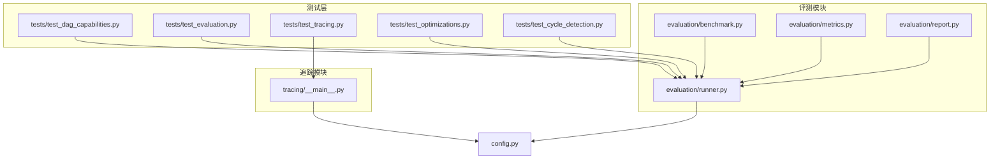
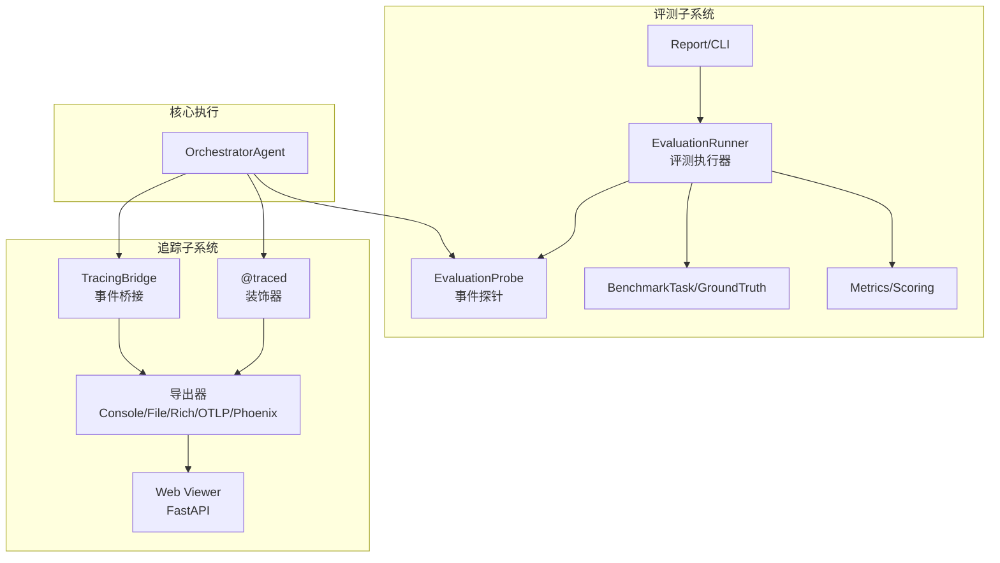
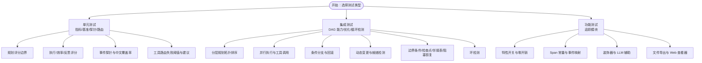
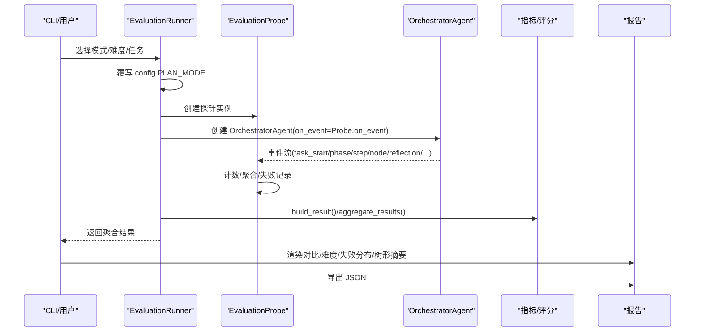
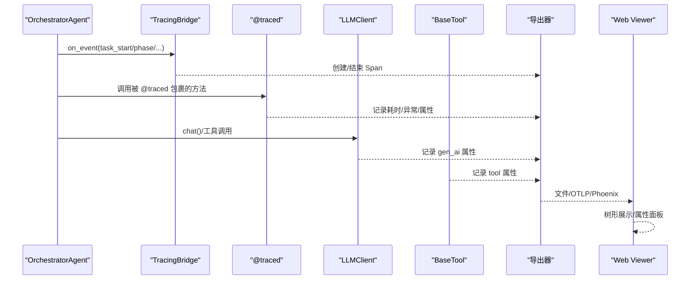
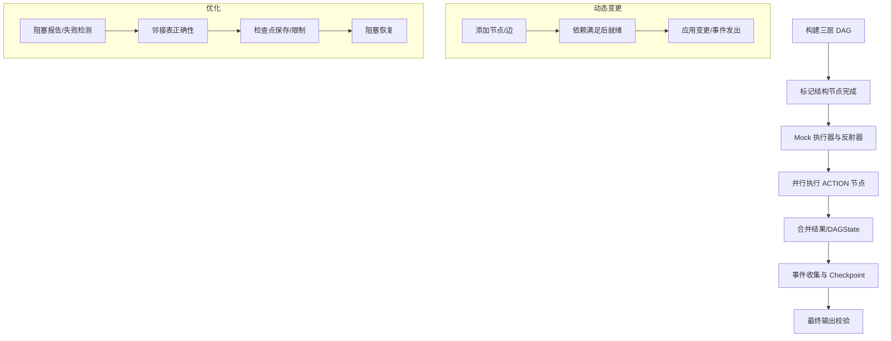
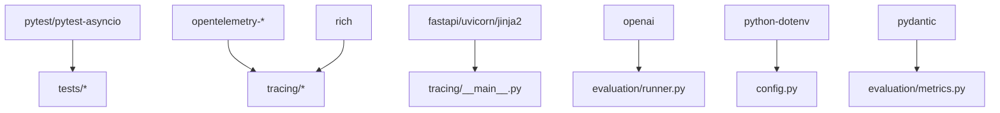

# 测试和调试

<cite>
**本文引用的文件**
- [tests/test_dag_capabilities.py](file://tests/test_dag_capabilities.py)
- [tests/test_evaluation.py](file://tests/test_evaluation.py)
- [tests/test_tracing.py](file://tests/test_tracing.py)
- [tests/test_cycle_detection.py](file://tests/test_cycle_detection.py)
- [tests/test_optimizations.py](file://tests/test_optimizations.py)
- [evaluation/runner.py](file://evaluation/runner.py)
- [evaluation/benchmark.py](file://evaluation/benchmark.py)
- [evaluation/metrics.py](file://evaluation/metrics.py)
- [evaluation/report.py](file://evaluation/report.py)
- [tracing/__main__.py](file://tracing/__main__.py)
- [sxw_aicoding/docs/evaluation-guide.md](file://sxw_aicoding/docs/evaluation-guide.md)
- [sxw_aicoding/docs/tracing-guide.md](file://sxw_aicoding/docs/tracing-guide.md)
- [config.py](file://config.py)
- [requirements.txt](file://requirements.txt)
</cite>

## 目录
1. [简介](#简介)
2. [项目结构](#项目结构)
3. [核心组件](#核心组件)
4. [架构总览](#架构总览)
5. [详细组件分析](#详细组件分析)
6. [依赖分析](#依赖分析)
7. [性能考虑](#性能考虑)
8. [故障排除指南](#故障排除指南)
9. [结论](#结论)
10. [附录](#附录)

## 简介
本指南面向 manus_demo 项目的测试与调试实践，系统阐述测试框架的组织方式（单元测试、集成测试、DAG 能力测试）、调试技巧（日志配置、追踪分析、性能监控）、测试用例设计原理与覆盖范围，并提供评估系统与基准测试的使用方法、性能分析与瓶颈识别技巧、故障排除与回归测试及持续集成建议。

## 项目结构
manus_demo 的测试与评估相关结构如下：
- tests/：测试套件，覆盖 DAG 能力、评测指标、追踪、优化与循环检测等
- evaluation/：评测模块，包含基准任务、指标模型、运行器、报告与 CLI
- tracing/：全链路追踪模块，提供事件桥接、装饰器、导出器与 Web 查看器
- config.py：统一配置入口，包含评测与追踪等关键开关与参数
- requirements.txt：测试与追踪相关依赖清单

**图表来源**
- [tests/test_dag_capabilities.py:1-1211](file://tests/test_dag_capabilities.py#L1-L1211)
- [tests/test_evaluation.py:1-587](file://tests/test_evaluation.py#L1-L587)
- [tests/test_tracing.py:1-948](file://tests/test_tracing.py#L1-L948)
- [tests/test_optimizations.py:1-358](file://tests/test_optimizations.py#L1-L358)
- [tests/test_cycle_detection.py:1-91](file://tests/test_cycle_detection.py#L1-L91)
- [evaluation/benchmark.py:1-311](file://evaluation/benchmark.py#L1-L311)
- [evaluation/metrics.py:1-475](file://evaluation/metrics.py#L1-L475)
- [evaluation/runner.py:1-570](file://evaluation/runner.py#L1-L570)
- [evaluation/report.py:1-309](file://evaluation/report.py#L1-L309)
- [tracing/__main__.py:1-108](file://tracing/__main__.py#L1-L108)
- [config.py:1-109](file://config.py#L1-L109)

**章节来源**
- [tests/test_dag_capabilities.py:1-1211](file://tests/test_dag_capabilities.py#L1-L1211)
- [tests/test_evaluation.py:1-587](file://tests/test_evaluation.py#L1-L587)
- [tests/test_tracing.py:1-948](file://tests/test_tracing.py#L1-L948)
- [tests/test_optimizations.py:1-358](file://tests/test_optimizations.py#L1-L358)
- [tests/test_cycle_detection.py:1-91](file://tests/test_cycle_detection.py#L1-L91)
- [evaluation/benchmark.py:1-311](file://evaluation/benchmark.py#L1-L311)
- [evaluation/metrics.py:1-475](file://evaluation/metrics.py#L1-L475)
- [evaluation/runner.py:1-570](file://evaluation/runner.py#L1-L570)
- [evaluation/report.py:1-309](file://evaluation/report.py#L1-L309)
- [tracing/__main__.py:1-108](file://tracing/__main__.py#L1-L108)
- [config.py:1-109](file://config.py#L1-L109)

## 核心组件
- 测试框架与组织
  - 单元测试：围绕指标计算、基准任务、事件探针、装饰器、工具路由等进行细粒度验证
  - 集成测试：覆盖 DAG 执行器、自适应规划、条件分支与回滚、动态变更等端到端流程
  - 功能测试：追踪模块的事件映射、导出器、Web 查看器与装饰器行为
  - 边界与稳健性：循环检测、优化（检查点、邻接表、阻塞恢复）等
- 评测模块
  - 基准任务与 Ground Truth：定义任务描述、难度、期望工具与关键词
  - 指标体系：规划、执行、效率、反思与失败分类
  - 运行器：强制模式、事件探针、结果聚合与报告
- 追踪模块
  - 事件桥接：将 Orchestrator 事件映射为 Span
  - 导出器：控制台、文件、Rich、OTLP、Phoenix
  - Web 查看器：基于 FastAPI 的树形 Trace 查看
- 配置中心
  - 统一管理 LLM、Agent 限制、DAG 执行、自适应规划、工具路由、追踪等参数

**章节来源**
- [tests/test_evaluation.py:1-587](file://tests/test_evaluation.py#L1-L587)
- [evaluation/benchmark.py:1-311](file://evaluation/benchmark.py#L1-L311)
- [evaluation/metrics.py:1-475](file://evaluation/metrics.py#L1-L475)
- [evaluation/runner.py:1-570](file://evaluation/runner.py#L1-L570)
- [evaluation/report.py:1-309](file://evaluation/report.py#L1-L309)
- [tests/test_tracing.py:1-948](file://tests/test_tracing.py#L1-L948)
- [tracing/__main__.py:1-108](file://tracing/__main__.py#L1-L108)
- [config.py:1-109](file://config.py#L1-L109)

## 架构总览
评测与追踪两大子系统均通过事件回调与装饰器实现零侵入式接入，核心执行路径保持不变。

**图表来源**
- [evaluation/runner.py:1-570](file://evaluation/runner.py#L1-L570)
- [evaluation/benchmark.py:1-311](file://evaluation/benchmark.py#L1-L311)
- [evaluation/metrics.py:1-475](file://evaluation/metrics.py#L1-L475)
- [evaluation/report.py:1-309](file://evaluation/report.py#L1-L309)
- [tests/test_tracing.py:1-948](file://tests/test_tracing.py#L1-L948)
- [tracing/__main__.py:1-108](file://tracing/__main__.py#L1-L108)

## 详细组件分析

### 测试框架组织与用例设计
- 单元测试
  - 指标计算：规划、执行、效率、反思评分与聚合
  - 基准任务：过滤、难度与关键词校验
  - 事件探针：ReAct 迭代、工具错误识别、中文步骤覆盖率、must_not_include 等边界
  - 工具路由：失败阈值、替代建议、提示生成、节点隔离
- 集成测试
  - DAG 能力：分层规划、并行执行、条件分支与回滚、动态变更、工具路由器、自适应规划集成
  - 优化：边界条件、检查点、邻接表、阻塞恢复
  - 循环检测：有环与无环 DAG 的行为验证
- 功能测试
  - 追踪：特性开关、Span 常量、事件映射、装饰器、LLM 客户端辅助、文件导出、Web 查看器

**图表来源**
- [tests/test_evaluation.py:1-587](file://tests/test_evaluation.py#L1-L587)
- [tests/test_dag_capabilities.py:1-1211](file://tests/test_dag_capabilities.py#L1-L1211)
- [tests/test_optimizations.py:1-358](file://tests/test_optimizations.py#L1-L358)
- [tests/test_cycle_detection.py:1-91](file://tests/test_cycle_detection.py#L1-L91)
- [tests/test_tracing.py:1-948](file://tests/test_tracing.py#L1-L948)

**章节来源**
- [tests/test_evaluation.py:1-587](file://tests/test_evaluation.py#L1-L587)
- [tests/test_dag_capabilities.py:1-1211](file://tests/test_dag_capabilities.py#L1-L1211)
- [tests/test_optimizations.py:1-358](file://tests/test_optimizations.py#L1-L358)
- [tests/test_cycle_detection.py:1-91](file://tests/test_cycle_detection.py#L1-L91)
- [tests/test_tracing.py:1-948](file://tests/test_tracing.py#L1-L948)

### 评测模块：指标体系与运行流程
- 指标体系
  - 规划质量：分类准确、计划结构有效性、步骤覆盖率、生成耗时
  - 执行质量：任务成功、步骤成功率、工具准确率
  - 效率指标：轨迹效率、Token 效率、时间效率、重规划惩罚
  - 反思准确性：与 GT 对齐、误判通过/拒绝率、覆盖率
  - 失败分类：规划、执行、反思、系统四层
- 运行流程
  - 强制模式覆盖 config.PLAN_MODE，逐任务逐模式运行
  - EvaluationProbe 通过 on_event 回调收集指标
  - runner.build_result() 计算评分，aggregate_results() 聚合
  - report 渲染对比表、难度分布、失败分布与树形摘要，支持 JSON 导出

**图表来源**
- [evaluation/runner.py:1-570](file://evaluation/runner.py#L1-L570)
- [evaluation/metrics.py:1-475](file://evaluation/metrics.py#L1-L475)
- [evaluation/report.py:1-309](file://evaluation/report.py#L1-L309)
- [evaluation/benchmark.py:1-311](file://evaluation/benchmark.py#L1-L311)

**章节来源**
- [evaluation/runner.py:1-570](file://evaluation/runner.py#L1-L570)
- [evaluation/metrics.py:1-475](file://evaluation/metrics.py#L1-L475)
- [evaluation/report.py:1-309](file://evaluation/report.py#L1-L309)
- [evaluation/benchmark.py:1-311](file://evaluation/benchmark.py#L1-L311)
- [sxw_aicoding/docs/evaluation-guide.md:1-665](file://sxw_aicoding/docs/evaluation-guide.md#L1-L665)

### 追踪模块：事件桥接与可视化
- 事件桥接
  - TracingBridge 将 task_start/phase/node_running/node_failed/reflection/task_complete 等事件映射为 Span
  - 多播模式与 UI 回调、EvaluationProbe 共存，互不影响
- 装饰器与工具集成
  - @traced 为方法级埋点，自动记录耗时、异常与属性
  - BaseTool.traced_execute 作为统一入口，LLMClient 提供 _start_llm_span/_end_llm_span 辅助
- 导出与查看
  - 控制台、文件、Rich、OTLP、Phoenix 多后端
  - Web 查看器基于 FastAPI，支持树形浏览、属性面板与 JSON API

**图表来源**
- [tests/test_tracing.py:1-948](file://tests/test_tracing.py#L1-L948)
- [tracing/__main__.py:1-108](file://tracing/__main__.py#L1-L108)

**章节来源**
- [tests/test_tracing.py:1-948](file://tests/test_tracing.py#L1-L948)
- [tracing/__main__.py:1-108](file://tracing/__main__.py#L1-L108)
- [sxw_aicoding/docs/tracing-guide.md:1-1007](file://sxw_aicoding/docs/tracing-guide.md#L1-L1007)

### DAG 能力与优化测试
- 能力测试
  - 分层规划：拓扑排序、并行就绪检测、退出条件与风险评估
  - 并行执行：ACTION 节点并行、工具调用记录、checkpoint
  - 条件分支与回滚：条件评估、失败触发回滚、下游跳过
  - 动态变更：运行时增删改节点/边、依赖满足后就绪
  - 工具路由器：失败阈值、替代建议、提示生成、节点隔离
  - 自适应规划集成：超步间 adapt_plan 调用、应用变更、事件发出
- 优化测试
  - 边界条件：空 DAG、单节点、失败节点检测、阻塞报告
  - 检查点：保存状态、数量限制、内容完整性、只读副本
  - 邻接表：依赖查询、节点移除/边添加后的更新、条件边不影响依赖
  - 阻塞恢复：无依赖/依赖终态/依赖跳过时的恢复

**图表来源**
- [tests/test_dag_capabilities.py:1-1211](file://tests/test_dag_capabilities.py#L1-L1211)
- [tests/test_optimizations.py:1-358](file://tests/test_optimizations.py#L1-L358)

**章节来源**
- [tests/test_dag_capabilities.py:1-1211](file://tests/test_dag_capabilities.py#L1-L1211)
- [tests/test_optimizations.py:1-358](file://tests/test_optimizations.py#L1-L358)

### 循环依赖检测测试
- 有环 DAG：构造 a→b→c→a，期望抛出 ValueError（包含“Cycle detected”）
- 无环 DAG：a→b→c，创建成功
- 通过异常消息与返回值验证环检测逻辑

**章节来源**
- [tests/test_cycle_detection.py:1-91](file://tests/test_cycle_detection.py#L1-L91)

## 依赖分析
- 测试依赖
  - pytest、pytest-asyncio：异步测试与参数化
  - OpenTelemetry：追踪导出与 SDK
  - FastAPI/Uvicorn/Jinja2：Web 查看器
  - rich：Rich 控制台导出
- 运行时依赖
  - openai、pydantic、python-dotenv：LLM 客户端、数据模型、环境变量
  - config.py：统一配置，决定评测与追踪行为

**图表来源**
- [requirements.txt:1-19](file://requirements.txt#L1-L19)
- [config.py:1-109](file://config.py#L1-L109)
- [evaluation/runner.py:1-570](file://evaluation/runner.py#L1-L570)
- [tracing/__main__.py:1-108](file://tracing/__main__.py#L1-L108)

**章节来源**
- [requirements.txt:1-19](file://requirements.txt#L1-L19)
- [config.py:1-109](file://config.py#L1-L109)

## 性能考虑
- 追踪性能
  - TRACING_ENABLED=false 时零开销：装饰器透传、SDK 不加载、TracingBridge 为 no-op
  - 开启时：Bridge 事件处理 ~0.01ms/事件，Span 创建 ~0.05ms/Span，Batch 处理异步
  - 采样率优化：TRACING_SAMPLE_RATE=0.1 降低开销
- 评测性能
  - 通过强制模式与事件探针避免修改核心执行路径
  - 评测运行时配置快照记录在 TaskEvaluationResult.config_snapshot 中，便于回溯
- 工具与 LLM
  - 工具执行超时、最大并发、输出大小限制等参数可调
  - LLM 重试机制与 Token 跟踪可按需开启

**章节来源**
- [sxw_aicoding/docs/tracing-guide.md:661-694](file://sxw_aicoding/docs/tracing-guide.md#L661-L694)
- [config.py:1-109](file://config.py#L1-L109)
- [evaluation/runner.py:1-570](file://evaluation/runner.py#L1-L570)

## 故障排除指南
- 追踪相关
  - 症状：启用后性能下降
    - 排查：确认 TRACING_ENABLED=true/false；生产环境降低采样率或关闭
  - 症状：OTLP/Phoenix 无数据
    - 排查：检查 TRACING_ENDPOINT、网络连通性、后端可用性
  - 症状：Web 查看器无法显示 trace
    - 排查：确认 TRACING_BACKEND=file 且 traces 目录存在；使用 python -m tracing 启动查看器
- 评测相关
  - 症状：评测失败或崩溃
    - 排查：查看 EvaluationRunner 的异常捕获与 FailureRecord；核对 LLM API Key/URL/Model
  - 症状：中文步骤覆盖率异常
    - 排查：确认 runner 的中文分词与 2-gram 匹配逻辑
- DAG 与优化
  - 症状：DAG 执行卡住
    - 排查：使用 get_blockage_report() 查看阻塞节点；检查邻接表与依赖满足情况
  - 症状：检查点过多占用内存
    - 排查：调整 MAX_CHECKPOINTS；确认 save_checkpoint() 调用频率
- 循环检测
  - 症状：创建 DAG 抛异常
    - 排查：检查边的方向与环；使用测试用例验证环检测逻辑

**章节来源**
- [tests/test_tracing.py:1-948](file://tests/test_tracing.py#L1-L948)
- [tests/test_optimizations.py:1-358](file://tests/test_optimizations.py#L1-L358)
- [tests/test_cycle_detection.py:1-91](file://tests/test_cycle_detection.py#L1-L91)
- [evaluation/runner.py:1-570](file://evaluation/runner.py#L1-L570)

## 结论
manus_demo 的测试与调试体系以“零侵入”为核心，通过事件桥接与装饰器实现评测与追踪的无缝集成；测试覆盖从指标计算到端到端 DAG 执行与动态变更，再到追踪导出与 Web 查看器；配合完善的配置中心与性能优化策略，能够高效定位问题、评估系统表现并指导持续改进。

## 附录

### 如何编写新的测试用例与扩展现有测试
- 新增单元测试
  - 在 tests/test_evaluation.py 中仿照现有模式，使用 _make_result 系列辅助函数构造输入，断言指标与评分
  - 使用 pytest 标记与参数化覆盖不同场景
- 新增 DAG 能力测试
  - 在 tests/test_dag_capabilities.py 中新增 class TestXxx，使用 _build_research_dag 或自定义 nodes/edges
  - 验证状态机合法性、事件发出、工具调用记录与 DAGState 合并
- 新增追踪测试
  - 在 tests/test_tracing.py 中新增 class TestXxx，结合 setup_tracing fixture 与 _InMemoryExporter
  - 验证特性开关、Span 层级、装饰器行为与导出器输出
- 新增优化测试
  - 在 tests/test_optimizations.py 中新增用例，覆盖边界条件、检查点、邻接表与阻塞恢复
- 新增循环检测测试
  - 在 tests/test_cycle_detection.py 中新增用例，构造环与无环场景

**章节来源**
- [tests/test_evaluation.py:1-587](file://tests/test_evaluation.py#L1-L587)
- [tests/test_dag_capabilities.py:1-1211](file://tests/test_dag_capabilities.py#L1-L1211)
- [tests/test_tracing.py:1-948](file://tests/test_tracing.py#L1-L948)
- [tests/test_optimizations.py:1-358](file://tests/test_optimizations.py#L1-L358)
- [tests/test_cycle_detection.py:1-91](file://tests/test_cycle_detection.py#L1-L91)

### 评估系统与基准测试使用方法
- 快速开始
  - 查看基准任务：python -m evaluation.eval_cli --dry-run
  - 运行简单评测：python -m evaluation.eval_cli --difficulty easy --modes simple
  - 完整评测并导出：python -m evaluation.eval_cli --output results.json
- 命令行参数
  - --modes/--difficulty/--tasks/--output/--dry-run/--verbose
- 报告输出
  - 控制台对比表、难度成功率、失败分布、各模式详情与树形摘要；支持 JSON 导出

**章节来源**
- [sxw_aicoding/docs/evaluation-guide.md:319-548](file://sxw_aicoding/docs/evaluation-guide.md#L319-L548)
- [evaluation/report.py:1-309](file://evaluation/report.py#L1-L309)

### 性能分析与瓶颈识别技巧
- 追踪分析
  - 使用 file 后端收集 trace，分析 LLM spans 的 duration_ms、gen_ai.usage、tool spans 的 success 与 latency_ms
  - 统计 Token 消耗与工具调用成功率，定位热点与失败点
- 评测分析
  - 对比三种模式的 avg_overall_score、avg_execution_time_ms、avg_total_tokens、avg_replan_count
  - 按难度分层查看 success_rate_by_difficulty，识别模式优势区间
- 优化建议
  - 降低采样率、减少 prompt 记录、限制属性长度
  - 调整 MAX_PARALLEL_NODES、MAX_REACT_ITERATIONS、NODE_EXECUTION_TIMEOUT 等参数

**章节来源**
- [sxw_aicoding/docs/tracing-guide.md:696-800](file://sxw_aicoding/docs/tracing-guide.md#L696-L800)
- [evaluation/metrics.py:1-475](file://evaluation/metrics.py#L1-L475)
- [config.py:1-109](file://config.py#L1-L109)

### 调试示例与工具使用
- 启用追踪
  - TRACING_ENABLED=true TRACING_BACKEND=file；运行后使用 python -m tracing 查看 Web Viewer
- 评测调试
  - 使用 --verbose 输出调试日志；核对 config_snapshot 中的运行时配置
- DAG 调试
  - 使用 get_blockage_report()、get_pending_action_nodes()、checkpoints 快速定位阻塞与状态
- 追踪调试
  - @traced 为关键方法添加埋点；检查导出器输出与 Web 查看器树形结构

**章节来源**
- [tracing/__main__.py:1-108](file://tracing/__main__.py#L1-L108)
- [evaluation/runner.py:1-570](file://evaluation/runner.py#L1-L570)
- [tests/test_tracing.py:1-948](file://tests/test_tracing.py#L1-L948)

### 回归测试与持续集成
- 回归测试
  - 单元测试：pytest tests/test_evaluation.py -v
  - 集成测试：pytest tests/test_dag_capabilities.py -v
  - 追踪测试：pytest tests/test_tracing.py -v
  - 优化与循环检测：pytest tests/test_optimizations.py -v；pytest tests/test_cycle_detection.py -v
- CI 建议
  - 安装依赖：pip install -r requirements.txt
  - 设置 LLM 环境变量（评测需要）
  - 分阶段执行：先单元/功能测试，再集成/基准测试
  - 追踪与评测输出归档，便于对比与审计

**章节来源**
- [requirements.txt:1-19](file://requirements.txt#L1-L19)
- [tests/test_evaluation.py:1-587](file://tests/test_evaluation.py#L1-L587)
- [tests/test_dag_capabilities.py:1-1211](file://tests/test_dag_capabilities.py#L1-L1211)
- [tests/test_tracing.py:1-948](file://tests/test_tracing.py#L1-L948)
- [tests/test_optimizations.py:1-358](file://tests/test_optimizations.py#L1-L358)
- [tests/test_cycle_detection.py:1-91](file://tests/test_cycle_detection.py#L1-L91)