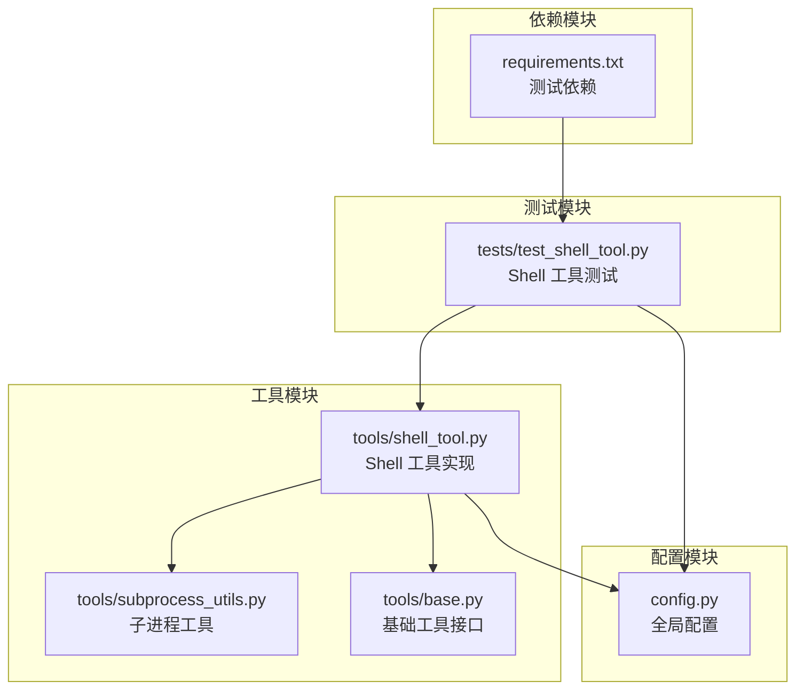
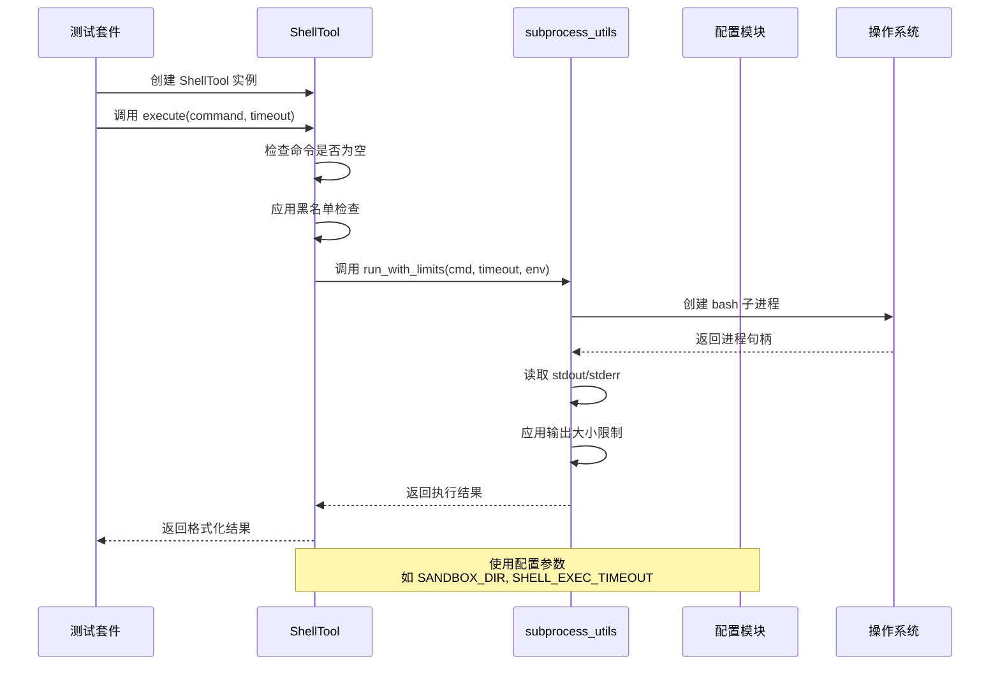
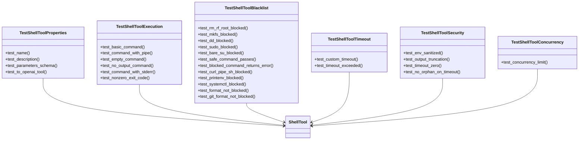
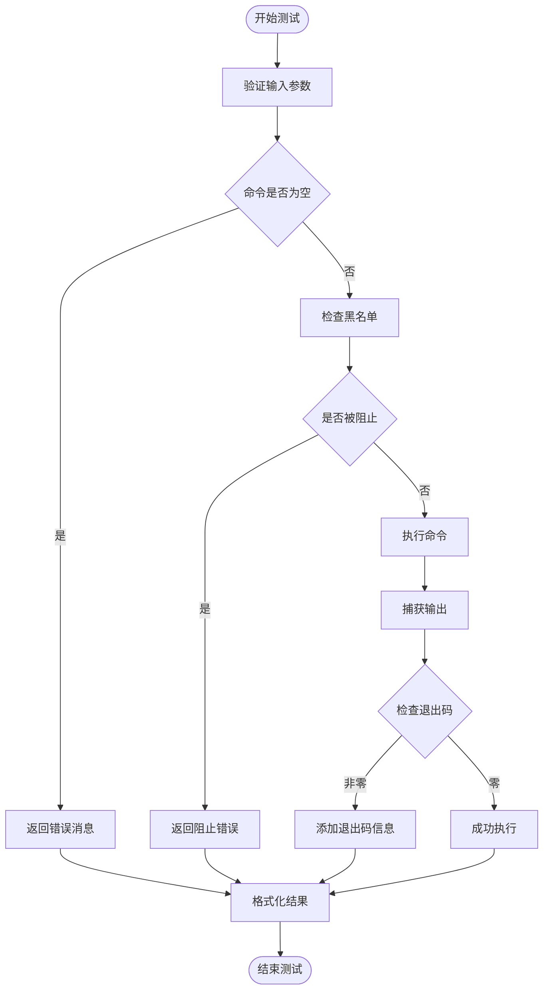
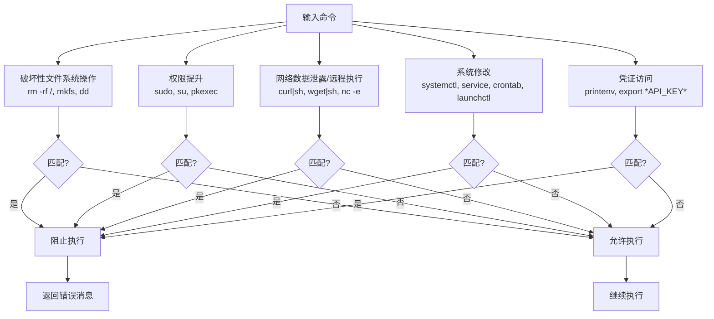
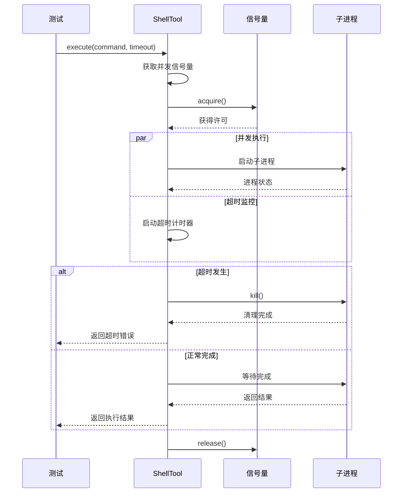
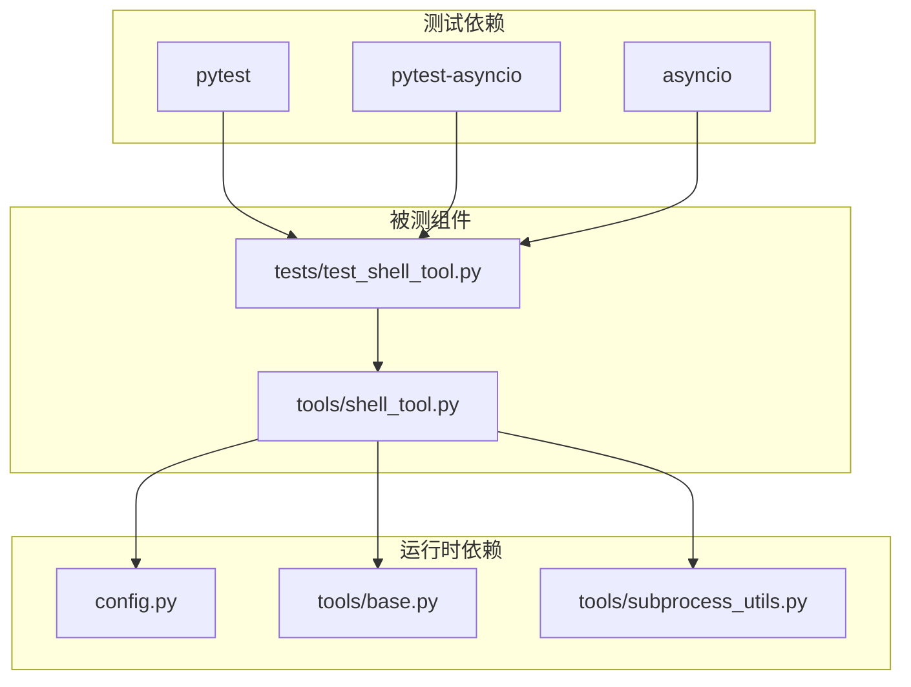

# Shell 工具测试

<cite>
**本文档引用的文件**
- [tests/test_shell_tool.py](file://tests/test_shell_tool.py)
- [tools/shell_tool.py](file://tools/shell_tool.py)
- [tools/subprocess_utils.py](file://tools/subprocess_utils.py)
- [tools/base.py](file://tools/base.py)
- [config.py](file://config.py)
- [requirements.txt](file://requirements.txt)
</cite>

## 目录
1. [简介](#简介)
2. [项目结构](#项目结构)
3. [核心组件](#核心组件)
4. [架构概览](#架构概览)
5. [详细组件分析](#详细组件分析)
6. [依赖关系分析](#依赖关系分析)
7. [性能考量](#性能考量)
8. [故障排除指南](#故障排除指南)
9. [结论](#结论)
10. [附录](#附录)

## 简介

本文件为 manus_demo 项目的 Shell 工具测试提供详细的测试文档。Shell 工具允许在沙箱环境中执行 shell 命令，具有超时保护、命令黑名单安全检查、环境变量清理和输出大小限制等功能。本文档详细解释了测试设计原理、实现方法、测试环境配置要求、安全考虑事项、跨平台兼容性测试方法以及测试用例设计策略。

## 项目结构

manus_demo 项目采用模块化架构，Shell 工具测试位于 `tests/` 目录下，核心实现位于 `tools/` 目录中：



**图表来源**
- [tests/test_shell_tool.py:1-221](file://tests/test_shell_tool.py#L1-L221)
- [tools/shell_tool.py:1-152](file://tools/shell_tool.py#L1-L152)
- [tools/subprocess_utils.py:1-156](file://tools/subprocess_utils.py#L1-L156)
- [tools/base.py:1-175](file://tools/base.py#L1-L175)
- [config.py:1-109](file://config.py#L1-L109)
- [requirements.txt:1-19](file://requirements.txt#L1-L19)

**章节来源**
- [tests/test_shell_tool.py:1-221](file://tests/test_shell_tool.py#L1-L221)
- [tools/shell_tool.py:1-152](file://tools/shell_tool.py#L1-L152)
- [config.py:1-109](file://config.py#L1-L109)

## 核心组件

### ShellTool 类

ShellTool 是一个继承自 BaseTool 的异步工具类，负责在沙箱环境中执行 shell 命令。其核心特性包括：

- **命令执行**：通过 bash 子进程执行 shell 命令
- **超时控制**：支持自定义超时时间
- **安全检查**：内置命令黑名单过滤
- **环境隔离**：使用沙箱目录和清理的环境变量
- **输出限制**：防止内存耗尽的输出大小限制

### subprocess_utils 模块

提供子进程管理的核心功能：

- **环境变量清理**：移除敏感的 API Key、密钥等
- **输出大小限制**：防止内存溢出
- **超时处理**：确保进程正确清理
- **并发控制**：支持异步并发执行

### 测试框架

使用 pytest 和 pytest-asyncio 进行测试，包含以下测试类别：

- **属性测试**：验证工具的基本属性和接口
- **执行测试**：测试命令执行的各种场景
- **黑名单测试**：验证安全检查机制
- **超时测试**：测试超时行为
- **安全测试**：验证安全硬化的功能
- **并发测试**：测试并发控制

**章节来源**
- [tools/shell_tool.py:25-152](file://tools/shell_tool.py#L25-L152)
- [tools/subprocess_utils.py:38-156](file://tools/subprocess_utils.py#L38-L156)
- [tests/test_shell_tool.py:14-221](file://tests/test_shell_tool.py#L14-L221)

## 架构概览

Shell 工具测试的整体架构如下：



**图表来源**
- [tools/shell_tool.py:99-152](file://tools/shell_tool.py#L99-L152)
- [tools/subprocess_utils.py:62-156](file://tools/subprocess_utils.py#L62-L156)
- [config.py:69-77](file://config.py#L69-L77)

## 详细组件分析

### 测试套件结构

测试套件按照功能模块组织，每个测试类别都有明确的职责：



**图表来源**
- [tests/test_shell_tool.py:14-221](file://tests/test_shell_tool.py#L14-L221)
- [tools/shell_tool.py:25-152](file://tools/shell_tool.py#L25-L152)

### 命令执行测试流程

命令执行测试涵盖了各种 shell 命令场景：



**图表来源**
- [tools/shell_tool.py:99-152](file://tools/shell_tool.py#L99-L152)
- [tests/test_shell_tool.py:43-78](file://tests/test_shell_tool.py#L43-L78)

### 安全检查机制

Shell 工具的安全检查基于正则表达式模式匹配：



**图表来源**
- [tools/shell_tool.py:31-55](file://tools/shell_tool.py#L31-L55)
- [tests/test_shell_tool.py:83-135](file://tests/test_shell_tool.py#L83-L135)

### 超时和并发控制



**图表来源**
- [tools/shell_tool.py:64-67](file://tools/shell_tool.py#L64-L67)
- [tools/shell_tool.py:114-121](file://tools/shell_tool.py#L114-L121)
- [tests/test_shell_tool.py:147-151](file://tests/test_shell_tool.py#L147-L151)

**章节来源**
- [tests/test_shell_tool.py:14-221](file://tests/test_shell_tool.py#L14-L221)
- [tools/shell_tool.py:25-152](file://tools/shell_tool.py#L25-L152)
- [tools/subprocess_utils.py:62-156](file://tools/subprocess_utils.py#L62-L156)

## 依赖关系分析

### 测试依赖关系



**图表来源**
- [requirements.txt:16-19](file://requirements.txt#L16-L19)
- [tests/test_shell_tool.py:6-11](file://tests/test_shell_tool.py#L6-L11)
- [tools/shell_tool.py:18-20](file://tools/shell_tool.py#L18-L20)

### 配置依赖

Shell 工具依赖多个配置参数：

| 配置项 | 默认值 | 用途 |
|--------|--------|------|
| SANDBOX_DIR | ~/.manus_demo/sandbox | 沙箱工作目录 |
| SHELL_EXEC_TIMEOUT | 30 秒 | Shell 命令执行超时 |
| SUBPROCESS_MAX_OUTPUT_BYTES | 512KB | 子进程最大输出字节 |
| SHELL_MAX_CONCURRENT | 3 | 最大并发 Shell 子进程数 |

**章节来源**
- [config.py:69-77](file://config.py#L69-L77)
- [requirements.txt:16-19](file://requirements.txt#L16-L19)

## 性能考量

### 并发控制

Shell 工具使用信号量进行并发控制，防止过多的子进程同时运行：

- **默认并发限制**：3 个并发进程
- **动态调整**：可通过配置参数调整
- **资源保护**：避免系统资源耗尽

### 输出大小限制

为了防止内存耗尽，系统实现了严格的输出大小限制：

- **默认限制**：512KB
- **自动截断**：超过限制时自动截断并标记
- **安全清理**：确保被截断的进程被正确清理

### 超时机制

- **自定义超时**：每个命令可指定独立的超时时间
- **默认超时**：使用配置中的默认超时值
- **强制清理**：超时后确保进程被杀死和清理

## 故障排除指南

### 常见问题及解决方案

#### 1. 命令被意外阻止

**症状**：执行命令返回 "blocked" 错误
**原因**：命令匹配了黑名单模式
**解决****：检查命令是否包含破坏性操作或权限提升

#### 2. 超时问题

**症状**：命令执行超时
**原因**：命令执行时间超过设定的超时限制
**解决**：增加超时时间或优化命令效率

#### 3. 输出被截断

**症状**：结果中出现截断标记
**原因**：输出超过大小限制
**解决**：减少输出量或调整配置

#### 4. 并发冲突

**症状**：命令执行失败或响应缓慢
**原因**：超过并发限制
**解决**：减少同时执行的命令数量

### 调试技巧

#### 1. 启用详细日志

```python
# 在测试中添加日志配置
import logging
logging.basicConfig(level=logging.INFO)
```

#### 2. 使用调试模式

```bash
# 运行特定测试用例
pytest tests/test_shell_tool.py::TestShellToolExecution::test_basic_command -v -s
```

#### 3. 检查环境变量

```python
# 验证环境变量是否被正确清理
import os
from tools.subprocess_utils import build_safe_env
safe_env = build_safe_env()
print([k for k in safe_env.keys() if 'key' in k.lower()])
```

**章节来源**
- [tests/test_shell_tool.py:156-197](file://tests/test_shell_tool.py#L156-L197)
- [tools/subprocess_utils.py:38-52](file://tools/subprocess_utils.py#L38-L52)

## 结论

Shell 工具测试文档详细介绍了 manus_demo 项目中 Shell 工具的测试设计和实现方法。通过全面的测试覆盖，包括命令执行测试、输出验证、错误处理测试、安全检查测试、超时测试和并发测试，确保了 Shell 工具在各种场景下的可靠性和安全性。

测试框架采用了现代的异步测试方法，结合了正则表达式安全检查、输出大小限制、超时控制和并发管理等多重安全机制。这些特性使得 Shell 工具能够在保持功能强大的同时，确保系统的安全性和稳定性。

## 附录

### 测试环境配置

#### 必需的测试依赖

```bash
pip install pytest pytest-asyncio
```

#### 环境变量配置

```bash
# 基础配置
export SANDBOX_DIR=~/.manus_demo/sandbox
export SHELL_EXEC_TIMEOUT=30
export SUBPROCESS_MAX_OUTPUT_BYTES=524288
export SHELL_MAX_CONCURRENT=3

# 测试专用配置
export TEST_ENV=true
```

### 跨平台兼容性测试

#### Linux/macOS 支持

- **bash 兼容性**：测试在不同版本 bash 下的行为
- **文件系统权限**：验证文件权限和路径处理
- **进程管理**：检查进程创建和清理机制

#### Windows 兼容性考虑

- **路径分隔符**：使用 `os.path.join()` 处理路径
- **权限模型**：Windows 权限模型的差异处理
- **进程隔离**：确保子进程正确隔离

### 测试用例设计策略

#### 边界条件测试

| 测试类型 | 边界条件 | 预期结果 |
|----------|----------|----------|
| 输入验证 | 空命令 | 错误消息 |
| 输入验证 | 特殊字符 | 正常执行 |
| 超时测试 | 超过默认超时 | 超时错误 |
| 超时测试 | 零超时 | 立即超时 |
| 输出测试 | 大量输出 | 截断输出 |
| 输出测试 | 无输出 | 成功消息 |
| 权限测试 | 破坏性命令 | 被阻止 |
| 权限测试 | 安全命令 | 正常执行 |

#### 异常情况测试

- **进程孤儿检测**：验证超时后进程被正确清理
- **内存泄漏检测**：长时间运行测试
- **资源竞争**：并发执行大量命令
- **信号处理**：测试中断信号的处理

### 编写指南

#### 新测试用例编写规范

1. **命名规范**：使用 `test_*` 前缀
2. **文档注释**：为每个测试方法添加清晰的注释
3. **断言明确**：使用具体的断言消息
4. **异步测试**：使用 `@pytest.mark.asyncio` 装饰器
5. **资源清理**：确保测试后清理临时资源

#### 调试最佳实践

1. **逐步调试**：使用 `-s` 参数输出调试信息
2. **日志记录**：在关键位置添加日志
3. **状态检查**：验证中间状态
4. **资源监控**：监控内存和进程使用情况