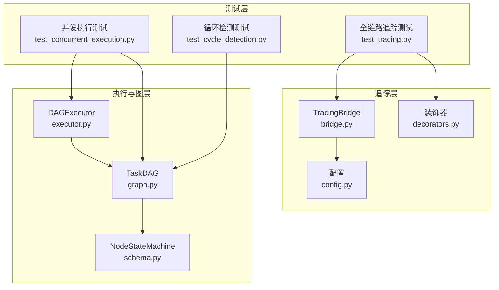
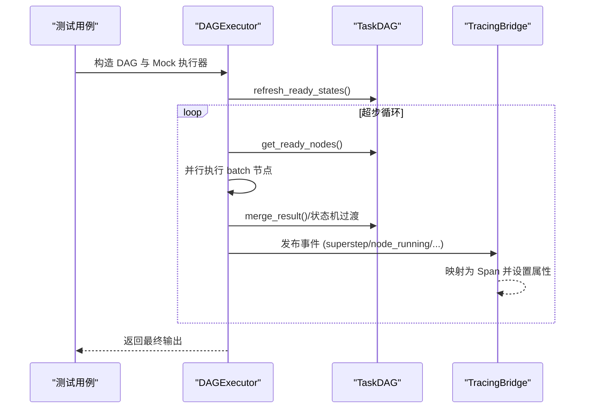
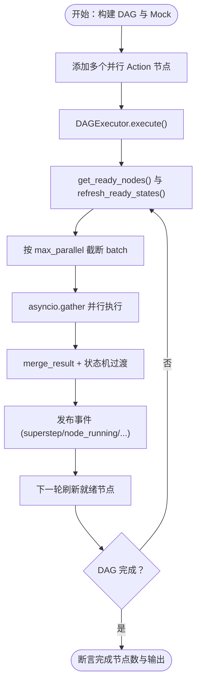
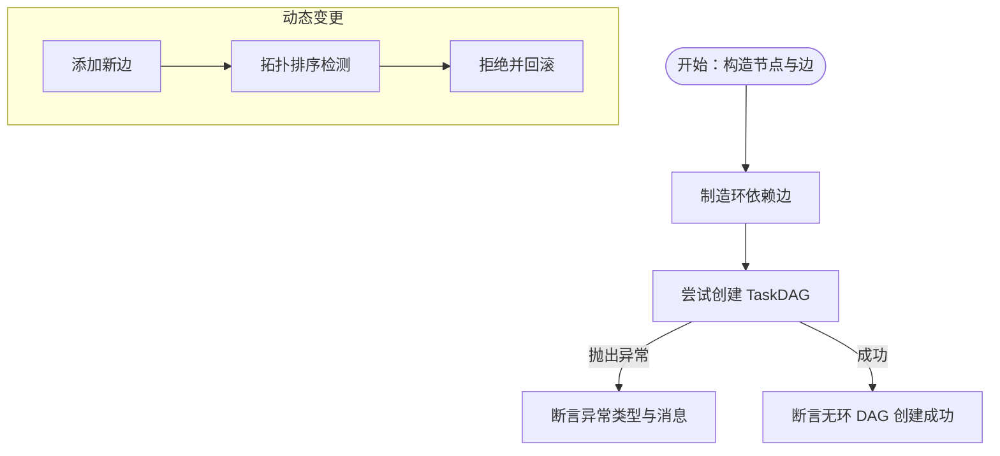
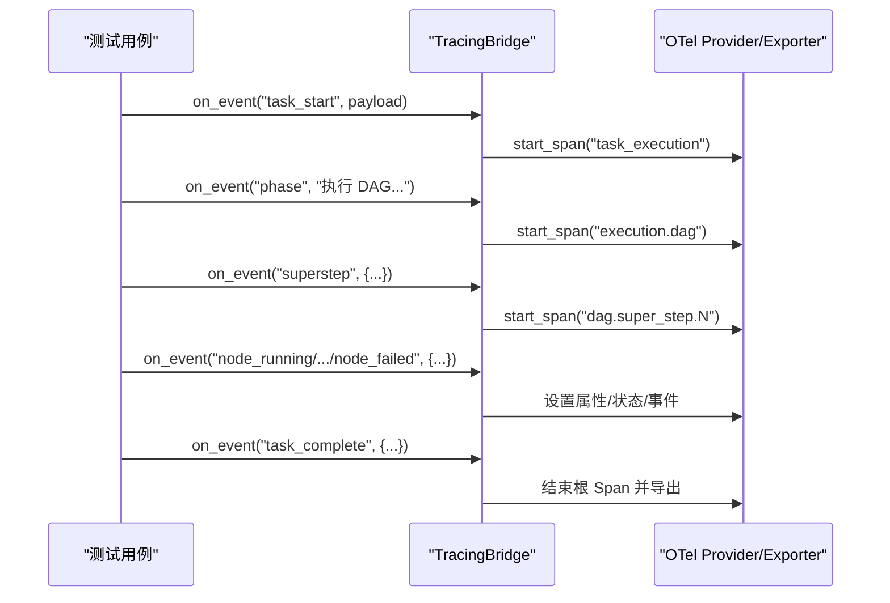
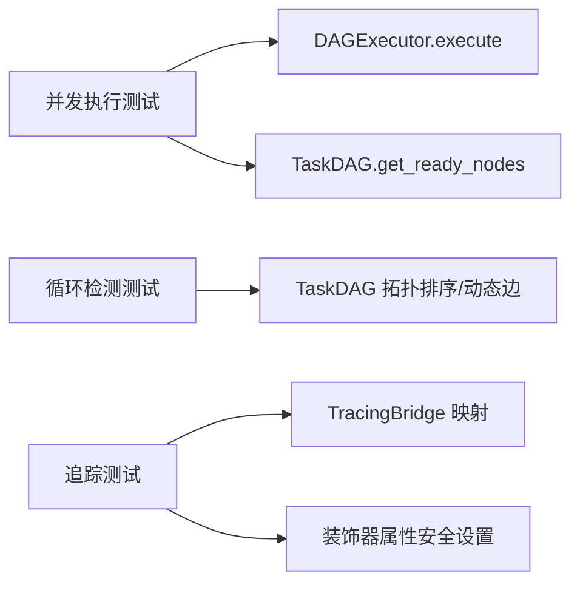

# 功能测试

<cite>
**本文引用的文件**
- [tests/test_concurrent_execution.py](file://tests/test_concurrent_execution.py)
- [tests/test_cycle_detection.py](file://tests/test_cycle_detection.py)
- [tests/test_tracing.py](file://tests/test_tracing.py)
- [dag/graph.py](file://dag/graph.py)
- [dag/executor.py](file://dag/executor.py)
- [schema.py](file://schema.py)
- [tracing/bridge.py](file://tracing/bridge.py)
- [tracing/decorators.py](file://tracing/decorators.py)
- [config.py](file://config.py)
</cite>

## 目录
1. [简介](#简介)
2. [项目结构](#项目结构)
3. [核心组件](#核心组件)
4. [架构总览](#架构总览)
5. [详细组件分析](#详细组件分析)
6. [依赖分析](#依赖分析)
7. [性能考量](#性能考量)
8. [故障排查指南](#故障排查指南)
9. [结论](#结论)
10. [附录](#附录)

## 简介
本文件面向 manus_demo 的功能测试，围绕三大测试主题展开：并发执行测试、循环检测测试与全链路追踪测试。文档解释各测试的设计目标、测试范围、实现方法与结果分析策略，并结合代码结构给出可视化图示与执行建议，帮助读者快速理解并高效开展测试工作。

## 项目结构
manus_demo 采用模块化设计，功能测试主要覆盖以下关键模块：
- DAG 执行与图结构：TaskDAG、DAGExecutor、NodeStateMachine
- 数据模型：TaskNode、TaskEdge、DAGState、NodeStatus、EdgeType 等
- 全链路追踪：TracingBridge、装饰器、导出器、配置
- 配置中心：config.py 提供执行参数与追踪开关

图表来源
- [tests/test_concurrent_execution.py:1-163](file://tests/test_concurrent_execution.py#L1-L163)
- [tests/test_cycle_detection.py:1-91](file://tests/test_cycle_detection.py#L1-L91)
- [tests/test_tracing.py:1-948](file://tests/test_tracing.py#L1-L948)
- [dag/graph.py:1-627](file://dag/graph.py#L1-L627)
- [dag/executor.py:1-648](file://dag/executor.py#L1-L648)
- [schema.py:1-702](file://schema.py#L1-L702)
- [tracing/bridge.py:1-765](file://tracing/bridge.py#L1-L765)
- [tracing/decorators.py:1-146](file://tracing/decorators.py#L1-L146)
- [config.py:1-109](file://config.py#L1-L109)

章节来源
- [tests/test_concurrent_execution.py:1-163](file://tests/test_concurrent_execution.py#L1-L163)
- [tests/test_cycle_detection.py:1-91](file://tests/test_cycle_detection.py#L1-L91)
- [tests/test_tracing.py:1-948](file://tests/test_tracing.py#L1-L948)
- [dag/graph.py:1-627](file://dag/graph.py#L1-L627)
- [dag/executor.py:1-648](file://dag/executor.py#L1-L648)
- [schema.py:1-702](file://schema.py#L1-L702)
- [tracing/bridge.py:1-765](file://tracing/bridge.py#L1-L765)
- [tracing/decorators.py:1-146](file://tracing/decorators.py#L1-L146)
- [config.py:1-109](file://config.py#L1-L109)

## 核心组件
- 并发执行测试：验证高并发与中等并发下的节点调度、并行执行、结果合并与事件上报。
- 循环检测测试：验证 TaskDAG 在构造阶段与动态变更时的环检测与异常抛出。
- 全链路追踪测试：验证事件到 Span 的映射、父子关系、装饰器行为、特性开关、导出器格式、LLM/工具追踪集成等。

章节来源
- [tests/test_concurrent_execution.py:15-137](file://tests/test_concurrent_execution.py#L15-L137)
- [tests/test_cycle_detection.py:12-59](file://tests/test_cycle_detection.py#L12-L59)
- [tests/test_tracing.py:35-839](file://tests/test_tracing.py#L35-L839)

## 架构总览
下图展示了功能测试与核心执行与追踪模块的交互关系，以及事件流如何被 TracingBridge 转换为 OpenTelemetry Span。

图表来源
- [dag/executor.py:110-264](file://dag/executor.py#L110-L264)
- [dag/graph.py:101-126](file://dag/graph.py#L101-L126)
- [tracing/bridge.py:117-143](file://tracing/bridge.py#L117-L143)

## 详细组件分析

### 并发执行测试
- 设计目标
  - 验证高并发（20 个并行 Action）与中等并发（每 SubGoal 5 个 Action）场景下的调度与执行稳定性。
  - 验证 max_parallel 参数对每轮并行度的限制与资源竞争控制。
  - 验证节点状态机在并发下的正确过渡与事件上报。
- 实现方法
  - 构造包含多个并行 Action 的 DAG，设置合适的依赖边。
  - 使用 AsyncMock 注入执行器与反射器，模拟节点执行与完成判据验证。
  - 通过 DAGExecutor.execute 执行，断言完成节点数量与最终输出。
- 关键验证点
  - 完成节点计数与状态一致性。
  - 并行度受 max_parallel 限制。
  - 事件回调（superstep、node_running、node_completed）按预期触发。
- 执行策略
  - 使用 asyncio.run 运行异步测试入口，捕获异常并打印堆栈。
  - 可通过修改 config.py 中 MAX_PARALLEL_NODES 调整并发上限进行对比测试。

图表来源
- [tests/test_concurrent_execution.py:15-137](file://tests/test_concurrent_execution.py#L15-L137)
- [dag/executor.py:169-251](file://dag/executor.py#L169-L251)
- [dag/graph.py:199-213](file://dag/graph.py#L199-L213)

章节来源
- [tests/test_concurrent_execution.py:15-137](file://tests/test_concurrent_execution.py#L15-L137)
- [dag/executor.py:169-251](file://dag/executor.py#L169-L251)
- [dag/graph.py:199-213](file://dag/graph.py#L199-L213)
- [config.py:44](file://config.py#L44)

### 循环检测测试
- 设计目标
  - 验证 TaskDAG 在构造阶段与动态变更（添加边）时的环检测逻辑。
  - 验证异常类型与消息内容符合预期。
- 实现方法
  - 构造制造环的依赖边，期望抛出 ValueError。
  - 构造无环 DAG，验证可正常创建。
  - 动态添加边时，TaskDAG 内部通过拓扑排序检测并拒绝引入环的边。
- 关键验证点
  - 环检测异常消息包含“Cycle detected”。
  - 无环 DAG 构建成功。
  - 动态添加边失败并回滚邻接表。
- 执行策略
  - 直接运行测试脚本，观察异常捕获与断言结果。

图表来源
- [tests/test_cycle_detection.py:12-59](file://tests/test_cycle_detection.py#L12-L59)
- [dag/graph.py:384-399](file://dag/graph.py#L384-L399)
- [dag/graph.py:585-604](file://dag/graph.py#L585-L604)

章节来源
- [tests/test_cycle_detection.py:12-59](file://tests/test_cycle_detection.py#L12-L59)
- [dag/graph.py:384-399](file://dag/graph.py#L384-L399)
- [dag/graph.py:585-604](file://dag/graph.py#L585-L604)

### 全链路追踪测试
- 设计目标
  - 验证 TracingBridge 将事件映射为 Span 的正确性与父子层级关系。
  - 验证装饰器（同步/异步）行为、特性开关（TRACING_ENABLED）零开销。
  - 验证导出器（文件/控制台/OTLP）输出格式与属性完整性。
  - 验证 LLMClient 与工具调用的追踪集成。
- 实现方法
  - 使用 pytest fixture 配置 OpenTelemetry TracerProvider 与 InMemoryExporter。
  - 通过 Mock 事件流触发 TracingBridge，断言生成的 Span 名称、属性与层级。
  - 验证装饰器对异常的记录与延迟属性设置。
  - 验证 TODO/DAG 执行事件的 span 层级与错误状态。
- 关键验证点
  - 任务生命周期：task_start → phase → superstep → node → task_complete。
  - 装饰器：同步/异步函数均创建 Span，异常被捕获并记录。
  - 导出器：JSON 文件包含 trace_id、spans、events 等字段。
  - LLM/工具：生成上下文并记录成功/失败状态。
- 执行策略
  - 使用 pytest 运行测试套件，必要时通过环境变量开启 TRACING_ENABLED 与配置导出后端。

图表来源
- [tests/test_tracing.py:191-281](file://tests/test_tracing.py#L191-L281)
- [tests/test_tracing.py:308-384](file://tests/test_tracing.py#L308-L384)
- [tests/test_tracing.py:391-464](file://tests/test_tracing.py#L391-L464)
- [tests/test_tracing.py:507-563](file://tests/test_tracing.py#L507-L563)
- [tests/test_tracing.py:570-613](file://tests/test_tracing.py#L570-L613)
- [tests/test_tracing.py:620-647](file://tests/test_tracing.py#L620-L647)
- [tests/test_tracing.py:702-783](file://tests/test_tracing.py#L702-L783)
- [tracing/bridge.py:117-196](file://tracing/bridge.py#L117-L196)
- [tracing/decorators.py:70-146](file://tracing/decorators.py#L70-L146)

章节来源
- [tests/test_tracing.py:191-281](file://tests/test_tracing.py#L191-L281)
- [tests/test_tracing.py:308-384](file://tests/test_tracing.py#L308-L384)
- [tests/test_tracing.py:391-464](file://tests/test_tracing.py#L391-L464)
- [tests/test_tracing.py:507-563](file://tests/test_tracing.py#L507-L563)
- [tests/test_tracing.py:570-613](file://tests/test_tracing.py#L570-L613)
- [tests/test_tracing.py:620-647](file://tests/test_tracing.py#L620-L647)
- [tests/test_tracing.py:702-783](file://tests/test_tracing.py#L702-L783)
- [tracing/bridge.py:117-196](file://tracing/bridge.py#L117-L196)
- [tracing/decorators.py:70-146](file://tracing/decorators.py#L70-L146)

## 依赖分析
- 并发执行测试依赖 DAGExecutor 与 TaskDAG 的就绪节点发现与并行执行逻辑，以及 NodeStateMachine 的状态机过渡。
- 循环检测测试依赖 TaskDAG 的拓扑排序与动态边添加时的环检测。
- 全链路追踪测试依赖 TracingBridge 的事件映射、装饰器的安全属性设置与导出器的输出格式。

图表来源
- [tests/test_concurrent_execution.py:15-137](file://tests/test_concurrent_execution.py#L15-L137)
- [tests/test_cycle_detection.py:12-59](file://tests/test_cycle_detection.py#L12-L59)
- [tests/test_tracing.py:35-839](file://tests/test_tracing.py#L35-L839)
- [dag/executor.py:110-264](file://dag/executor.py#L110-L264)
- [dag/graph.py:101-126](file://dag/graph.py#L101-L126)
- [tracing/bridge.py:84-115](file://tracing/bridge.py#L84-L115)
- [tracing/decorators.py:51-68](file://tracing/decorators.py#L51-L68)

章节来源
- [tests/test_concurrent_execution.py:15-137](file://tests/test_concurrent_execution.py#L15-L137)
- [tests/test_cycle_detection.py:12-59](file://tests/test_cycle_detection.py#L12-L59)
- [tests/test_tracing.py:35-839](file://tests/test_tracing.py#L35-L839)
- [dag/executor.py:110-264](file://dag/executor.py#L110-L264)
- [dag/graph.py:101-126](file://dag/graph.py#L101-L126)
- [tracing/bridge.py:84-115](file://tracing/bridge.py#L84-L115)
- [tracing/decorators.py:51-68](file://tracing/decorators.py#L51-L68)

## 性能考量
- 并发度控制：通过 config.py 的 MAX_PARALLEL_NODES 限制每轮并行节点数，避免资源争用与超时。
- 超时保护：DAGExecutor 对单节点执行设置 NODE_EXECUTION_TIMEOUT，防止卡死影响批次。
- 检查点策略：TaskDAG 保存检查点以支持时间旅行调试，需关注 MAX_CHECKPOINTS 防止内存膨胀。
- 追踪开销：TRACING_ENABLED 关闭时，追踪模块提供零开销桩；开启时注意导出后端与采样率对性能的影响。

章节来源
- [config.py:44](file://config.py#L44)
- [config.py:58](file://config.py#L58)
- [config.py:59](file://config.py#L59)
- [config.py:102-109](file://config.py#L102-L109)
- [dag/executor.py:291-310](file://dag/executor.py#L291-L310)
- [dag/graph.py:521-542](file://dag/graph.py#L521-L542)

## 故障排查指南
- 并发执行失败
  - 检查 max_parallel 是否过低导致节点长期无法调度。
  - 关注 asyncio.gather 的 return_exceptions=True 是否导致异常被吞没。
  - 核对事件回调是否正确转发，定位节点状态机过渡异常。
- 循环检测失败
  - 确认拓扑排序结果长度与节点总数一致。
  - 动态添加边时检查邻接表回滚逻辑。
- 追踪异常
  - 确认 TRACING_ENABLED 开关与后端配置。
  - 检查装饰器属性截断与敏感信息保护逻辑。
  - 核对导出器输出格式与 OTel SDK 版本兼容性。

章节来源
- [dag/executor.py:179-182](file://dag/executor.py#L179-L182)
- [dag/graph.py:247-249](file://dag/graph.py#L247-L249)
- [tracing/bridge.py:127-134](file://tracing/bridge.py#L127-L134)
- [tracing/decorators.py:30-68](file://tracing/decorators.py#L30-L68)

## 结论
本文档系统梳理了 manus_demo 的功能测试设计与实现要点，覆盖并发执行、循环检测与全链路追踪三大领域。通过测试用例与核心代码的映射关系，读者可据此制定执行策略、进行结果分析与问题定位，确保 DAG 执行的稳定性、安全性与可观测性。

## 附录
- 执行命令示例
  - 并发执行测试：python tests/test_concurrent_execution.py
  - 循环检测测试：python tests/test_cycle_detection.py
  - 全链路追踪测试：pytest tests/test_tracing.py -v
- 关键配置参考
  - 并发与超时：MAX_PARALLEL_NODES、NODE_EXECUTION_TIMEOUT
  - 追踪开关与导出：TRACING_ENABLED、TRACING_BACKEND、TRACING_ENDPOINT