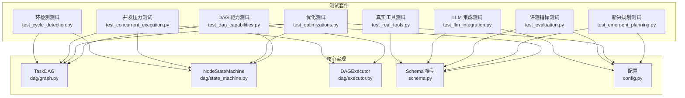
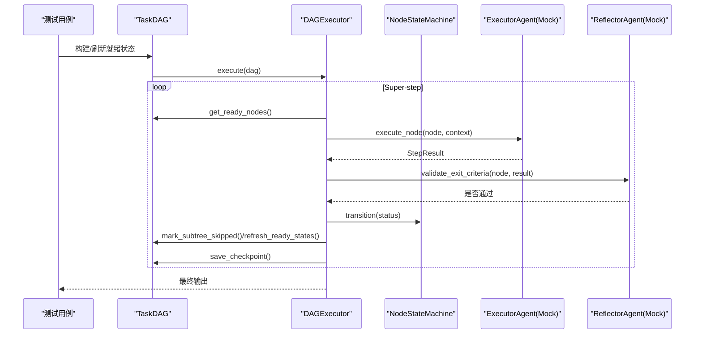
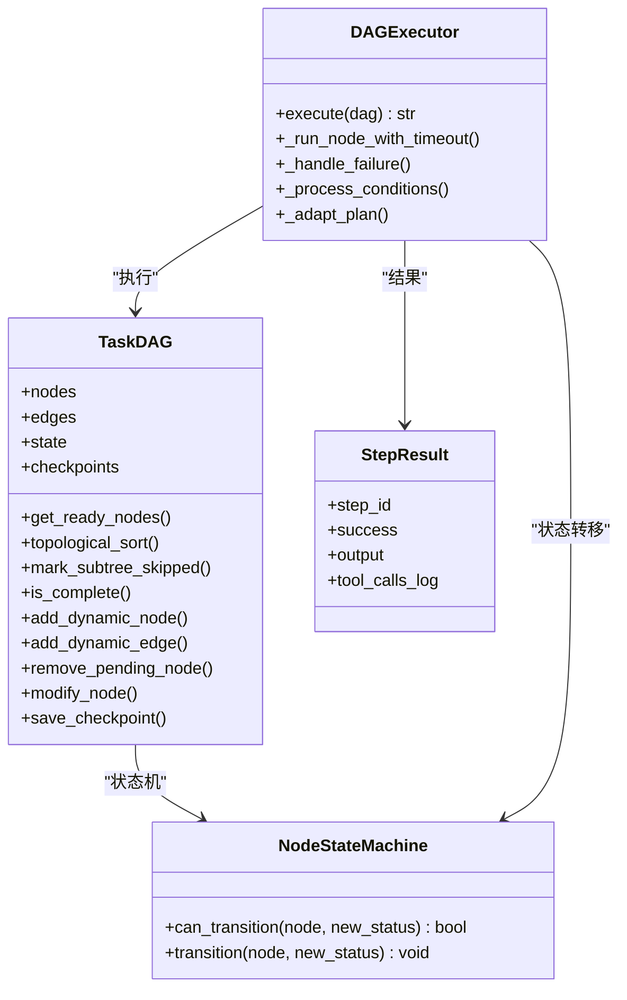
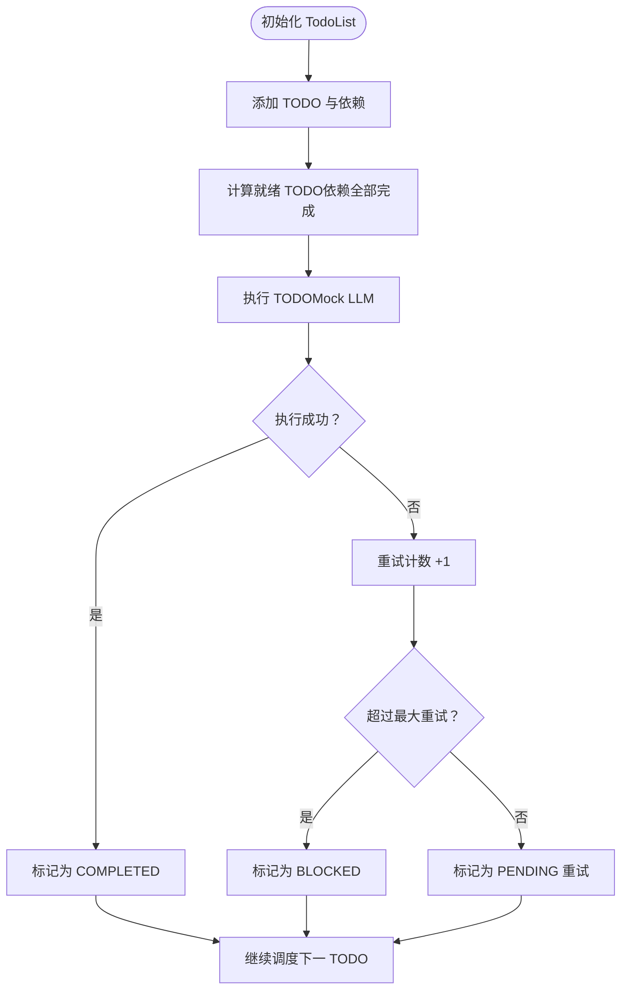
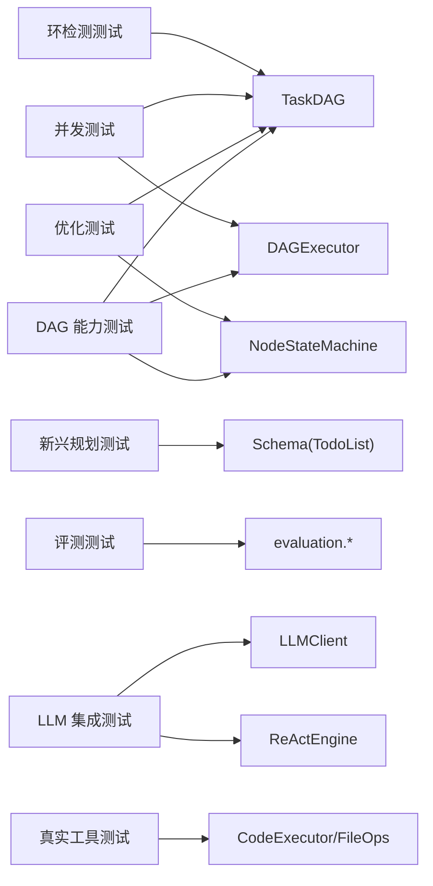

# 单元测试

<cite>
**本文引用的文件**
- [tests/test_dag_capabilities.py](file://tests/test_dag_capabilities.py)
- [tests/test_emergent_planning.py](file://tests/test_emergent_planning.py)
- [tests/test_optimizations.py](file://tests/test_optimizations.py)
- [tests/test_evaluation.py](file://tests/test_evaluation.py)
- [tests/test_llm_integration.py](file://tests/test_llm_integration.py)
- [tests/test_real_tools.py](file://tests/test_real_tools.py)
- [tests/test_cycle_detection.py](file://tests/test_cycle_detection.py)
- [tests/test_concurrent_execution.py](file://tests/test_concurrent_execution.py)
- [dag/graph.py](file://dag/graph.py)
- [dag/state_machine.py](file://dag/state_machine.py)
- [dag/executor.py](file://dag/executor.py)
- [schema.py](file://schema.py)
- [config.py](file://config.py)
</cite>

## 目录
1. [简介](#简介)
2. [项目结构](#项目结构)
3. [核心组件](#核心组件)
4. [架构总览](#架构总览)
5. [详细组件分析](#详细组件分析)
6. [依赖分析](#依赖分析)
7. [性能考量](#性能考量)
8. [故障排查指南](#故障排查指南)
9. [结论](#结论)
10. [附录](#附录)

## 简介
本文件面向 manus_demo 的单元测试体系，系统阐述测试设计原则、实现方法与最佳实践，覆盖 DAG 能力、新兴规划（隐式规划）、优化能力、评测指标、LLM 集成与真实工具验证、并发与环检测等主题。文档强调：
- 测试用例组织结构与职责分离
- Mock 对象的使用策略与断言验证机制
- 异步测试与事件驱动测试的处理
- 测试数据构建（DAG 图与节点状态模拟）
- 单元测试编写示例与测试覆盖率分析方法

## 项目结构
manus_demo 的测试主要位于 tests/ 目录，围绕 DAG 执行、规划模式、优化、评测、LLM 集成与真实工具展开；核心执行与数据模型位于 dag/、schema.py 与 config.py。

图表来源
- [tests/test_dag_capabilities.py:1-1211](file://tests/test_dag_capabilities.py#L1-L1211)
- [tests/test_emergent_planning.py:1-432](file://tests/test_emergent_planning.py#L1-L432)
- [tests/test_optimizations.py:1-358](file://tests/test_optimizations.py#L1-L358)
- [tests/test_evaluation.py:1-587](file://tests/test_evaluation.py#L1-L587)
- [tests/test_llm_integration.py:1-535](file://tests/test_llm_integration.py#L1-L535)
- [tests/test_real_tools.py:1-110](file://tests/test_real_tools.py#L1-L110)
- [tests/test_concurrent_execution.py:1-163](file://tests/test_concurrent_execution.py#L1-L163)
- [tests/test_cycle_detection.py:1-91](file://tests/test_cycle_detection.py#L1-L91)
- [dag/graph.py:1-627](file://dag/graph.py#L1-L627)
- [dag/state_machine.py:1-114](file://dag/state_machine.py#L1-L114)
- [dag/executor.py:1-648](file://dag/executor.py#L1-L648)
- [schema.py:1-702](file://schema.py#L1-L702)
- [config.py:1-109](file://config.py#L1-L109)

章节来源
- [tests/test_dag_capabilities.py:1-1211](file://tests/test_dag_capabilities.py#L1-L1211)
- [tests/test_emergent_planning.py:1-432](file://tests/test_emergent_planning.py#L1-L432)
- [tests/test_optimizations.py:1-358](file://tests/test_optimizations.py#L1-L358)
- [tests/test_evaluation.py:1-587](file://tests/test_evaluation.py#L1-L587)
- [tests/test_llm_integration.py:1-535](file://tests/test_llm_integration.py#L1-L535)
- [tests/test_real_tools.py:1-110](file://tests/test_real_tools.py#L1-L110)
- [tests/test_concurrent_execution.py:1-163](file://tests/test_concurrent_execution.py#L1-L163)
- [tests/test_cycle_detection.py:1-91](file://tests/test_cycle_detection.py#L1-L91)
- [dag/graph.py:1-627](file://dag/graph.py#L1-L627)
- [dag/state_machine.py:1-114](file://dag/state_machine.py#L1-L114)
- [dag/executor.py:1-648](file://dag/executor.py#L1-L648)
- [schema.py:1-702](file://schema.py#L1-L702)
- [config.py:1-109](file://config.py#L1-L109)

## 核心组件
- DAG 执行器（DAGExecutor）：实现 Super-step 并行执行、条件边评估、失败回滚、自适应规划集成与检查点持久化。
- 任务有向无环图（TaskDAG）：维护节点、边、集中式状态与检查点；提供就绪节点发现、拓扑排序、子树跳过、动态图变更与邻接表优化。
- 节点状态机（NodeStateMachine）：统一校验与强制节点状态合法转移，防止不一致状态。
- Schema 模型：定义节点类型、状态、边类型、完成判据、风险评估、工具调用记录、StepResult 等核心数据结构。
- 配置（config.py）：提供执行参数、超步间自适应规划、工具路由阈值、并发与超时、追踪开关等全局配置。

章节来源
- [dag/executor.py:62-264](file://dag/executor.py#L62-L264)
- [dag/graph.py:43-627](file://dag/graph.py#L43-L627)
- [dag/state_machine.py:55-114](file://dag/state_machine.py#L55-L114)
- [schema.py:77-253](file://schema.py#L77-L253)
- [config.py:42-109](file://config.py#L42-L109)

## 架构总览
DAG 能力测试以 TaskDAG 与 DAGExecutor 为核心，通过 Mock ExecutorAgent/ReflectorAgent 验证并行执行、条件分支与回滚、动态图变更与工具路由；新兴规划测试验证 TodoList 的就绪/完成/阻塞状态与环检测；优化测试覆盖边界条件、检查点、邻接表与失败恢复；评测测试验证指标聚合与报告渲染；LLM 集成测试验证客户端与 ReAct 引擎；并发与环检测测试保障大规模并行与图结构安全。

图表来源
- [dag/executor.py:110-264](file://dag/executor.py#L110-L264)
- [dag/graph.py:199-276](file://dag/graph.py#L199-L276)
- [dag/state_machine.py:88-114](file://dag/state_machine.py#L88-L114)
- [tests/test_dag_capabilities.py:223-340](file://tests/test_dag_capabilities.py#L223-L340)

## 详细组件分析

### DAG 能力测试（分层规划、并行执行、条件分支与回滚、动态变更、工具路由、自适应规划）
- 分层规划能力：验证三层结构（Goal/SubGoal/Action）、拓扑排序、并行就绪检测与节点质量门控（完成判据与风险评估）。
- 并行执行与工具调用：通过 AsyncMock 模拟 ReAct 执行，验证并行节点在同一 Super-step 执行、结果合并到 DAGState、工具调用记录与检查点保存。
- 条件分支与回滚：构造条件边与回滚边，验证条件评估事件、失败触发回滚、下游子树跳过、状态机合法性。
- 动态图变更：运行时添加/移除/修改节点与边，验证依赖满足后动态节点就绪、邻接表更新与环检测。
- 工具路由器：记录连续失败、阈值触发、替代工具建议与提示生成。
- 自适应规划集成：在超步间调用 Planner.adapt_plan()，应用调整（移除/修改/新增）并发出事件。

图表来源
- [dag/graph.py:43-627](file://dag/graph.py#L43-L627)
- [dag/state_machine.py:55-114](file://dag/state_machine.py#L55-L114)
- [dag/executor.py:62-648](file://dag/executor.py#L62-L648)
- [schema.py:352-361](file://schema.py#L352-L361)

章节来源
- [tests/test_dag_capabilities.py:134-800](file://tests/test_dag_capabilities.py#L134-L800)
- [dag/graph.py:82-494](file://dag/graph.py#L82-L494)
- [dag/executor.py:110-632](file://dag/executor.py#L110-L632)
- [dag/state_machine.py:88-114](file://dag/state_machine.py#L88-L114)
- [schema.py:157-176](file://schema.py#L157-L176)

### 新兴规划测试（隐式规划 v5）
- TodoItem/TodoList 数据模型与状态流转（PENDING/IN_PROGRESS/COMPLETED/BLOCKED）。
- TODO 列表的就绪节点发现、依赖满足判断与环检测（Kahn 算法）。
- 执行过程中的 TODO 更新、失败重试与阻塞、停滞检测与答案合成。
- 与 Orchestrator 的路由集成与配置开关验证。

图表来源
- [tests/test_emergent_planning.py:54-170](file://tests/test_emergent_planning.py#L54-L170)
- [schema.py:422-567](file://schema.py#L422-L567)

章节来源
- [tests/test_emergent_planning.py:1-432](file://tests/test_emergent_planning.py#L1-L432)
- [schema.py:384-567](file://schema.py#L384-L567)

### 优化测试（边界条件、检查点、邻接表、失败恢复）
- 边界条件：空 DAG 完成、单节点 DAG、失败节点检测、阻塞报告。
- 检查点：保存/上限/内容/只读副本。
- 邻接表：依赖查找、动态添加边后更新、条件边不影响依赖邻接。
- 失败恢复：无依赖/依赖终态/非终态/跳过依赖的恢复策略。

章节来源
- [tests/test_optimizations.py:1-358](file://tests/test_optimizations.py#L1-L358)
- [dag/graph.py:128-213](file://dag/graph.py#L128-L213)
- [dag/graph.py:314-334](file://dag/graph.py#L314-L334)

### 评测指标测试（指标计算、聚合、报告）
- 规划得分、执行得分、效率得分与总体得分的组合权重。
- 指标聚合（任务成功率、难度分布、失败类别分布、反射覆盖率与误报/漏报）。
- 基准任务加载、反射事件处理、中文覆盖度与 Must-Not-Include 校验、配置快照。

章节来源
- [tests/test_evaluation.py:1-587](file://tests/test_evaluation.py#L1-L587)
- [evaluation/benchmark.py:1-200](file://evaluation/benchmark.py#L1-L200)
- [evaluation/metrics.py:1-300](file://evaluation/metrics.py#L1-L300)
- [evaluation/report.py:1-200](file://evaluation/report.py#L1-L200)

### LLM 集成测试（OpenAI SDK、工具调用、JSON 结构化输出、ReAct 引擎）
- LLMClient 初始化、温度/最大令牌参数、错误处理与重试配置。
- Function Calling（工具调用）：单工具/多工具、工具执行流。
- JSON 结构化输出：基本/复杂结构解析。
- ReAct 引擎：初始化、简单/多工具任务、上下文透传、最大迭代限制、系统提示。

章节来源
- [tests/test_llm_integration.py:1-535](file://tests/test_llm_integration.py#L1-L535)
- [llm/client.py:1-200](file://llm/client.py#L1-L200)
- [react/engine.py:1-200](file://react/engine.py#L1-L200)

### 真实工具测试（代码执行与文件操作）
- CodeExecutorTool：简单/复杂代码执行、错误处理、异常捕获。
- FileOpsTool：写入/读取/列出、错误处理、路径穿越保护、测试文件清理。

章节来源
- [tests/test_real_tools.py:1-110](file://tests/test_real_tools.py#L1-L110)
- [tools/code_executor.py:1-200](file://tools/code_executor.py#L1-L200)
- [tools/file_ops.py:1-200](file://tools/file_ops.py#L1-L200)

### 并发与环检测测试
- 并发压力测试：20 个/10 个并行 Action，限制每轮最大并行数，验证全部完成。
- 环检测测试：制造环与无环 DAG，验证异常抛出与正常创建。

章节来源
- [tests/test_concurrent_execution.py:1-163](file://tests/test_concurrent_execution.py#L1-L163)
- [tests/test_cycle_detection.py:1-91](file://tests/test_cycle_detection.py#L1-L91)
- [dag/graph.py:585-604](file://dag/graph.py#L585-L604)

## 依赖分析
- 测试对实现的耦合：DAG 能力测试强依赖 TaskDAG/DAGExecutor/NodeStateMachine；新兴规划测试依赖 schema 的 TodoList；优化测试依赖 TaskDAG 的内部算法；评测测试依赖 evaluation 模块；LLM/工具测试依赖 llm/client 与 tools；并发/环检测测试依赖 dag/graph。
- Mock 策略：对外部系统（LLM、工具）采用 AsyncMock/MagicMock，对内部组件（状态机、规划器）采用最小化替身，确保测试可控与稳定。
- 配置依赖：通过 config.py 的全局开关与阈值控制行为（如自适应规划、工具路由阈值、最大并行节点数、检查点上限、节点执行超时）。

图表来源
- [tests/test_dag_capabilities.py:223-340](file://tests/test_dag_capabilities.py#L223-L340)
- [tests/test_emergent_planning.py:171-256](file://tests/test_emergent_planning.py#L171-L256)
- [tests/test_optimizations.py:126-160](file://tests/test_optimizations.py#L126-L160)
- [tests/test_evaluation.py:1-140](file://tests/test_evaluation.py#L1-L140)
- [tests/test_llm_integration.py:105-147](file://tests/test_llm_integration.py#L105-L147)
- [tests/test_real_tools.py:13-84](file://tests/test_real_tools.py#L13-L84)
- [tests/test_concurrent_execution.py:15-72](file://tests/test_concurrent_execution.py#L15-L72)
- [tests/test_cycle_detection.py:12-59](file://tests/test_cycle_detection.py#L12-L59)
- [dag/graph.py:43-627](file://dag/graph.py#L43-L627)
- [dag/executor.py:62-120](file://dag/executor.py#L62-L120)
- [dag/state_machine.py:55-114](file://dag/state_machine.py#L55-L114)
- [schema.py:422-567](file://schema.py#L422-L567)
- [config.py:42-109](file://config.py#L42-L109)

章节来源
- [tests/test_dag_capabilities.py:1-1211](file://tests/test_dag_capabilities.py#L1-L1211)
- [tests/test_emergent_planning.py:1-432](file://tests/test_emergent_planning.py#L1-L432)
- [tests/test_optimizations.py:1-358](file://tests/test_optimizations.py#L1-L358)
- [tests/test_evaluation.py:1-587](file://tests/test_evaluation.py#L1-L587)
- [tests/test_llm_integration.py:1-535](file://tests/test_llm_integration.py#L1-L535)
- [tests/test_real_tools.py:1-110](file://tests/test_real_tools.py#L1-L110)
- [tests/test_concurrent_execution.py:1-163](file://tests/test_concurrent_execution.py#L1-L163)
- [tests/test_cycle_detection.py:1-91](file://tests/test_cycle_detection.py#L1-L91)
- [dag/graph.py:1-627](file://dag/graph.py#L1-L627)
- [dag/executor.py:1-648](file://dag/executor.py#L1-L648)
- [dag/state_machine.py:1-114](file://dag/state_machine.py#L1-L114)
- [schema.py:1-702](file://schema.py#L1-L702)
- [config.py:1-109](file://config.py#L1-L109)

## 性能考量
- 并行度控制：通过 config.MAX_PARALLEL_NODES 限制每轮并行节点数，避免资源争用。
- 邻接表优化：TaskDAG 预构建依赖邻接表，将依赖查询与拓扑排序复杂度从 O(V*E) 降至 O(V+E)。
- 超时与重试：节点执行超时（NODE_EXECUTION_TIMEOUT）与 LLM 重试配置（LLM_RETRY_*）提升鲁棒性。
- 检查点与内存：MAX_CHECKPOINTS 控制内存中快照数量，避免长时间运行导致内存泄漏。
- 失败恢复：try_recover_blocked_nodes 在依赖终态时主动恢复 PENDING 节点，减少阻塞。

章节来源
- [config.py:44-59](file://config.py#L44-L59)
- [dag/graph.py:82-95](file://dag/graph.py#L82-L95)
- [dag/graph.py:314-334](file://dag/graph.py#L314-L334)
- [dag/executor.py:296-310](file://dag/executor.py#L296-L310)

## 故障排查指南
- 环检测失败：构造 DAG 时若引入环，将抛出 ValueError，需检查边方向与依赖关系。
- 状态机非法转移：NodeStateMachine 对非法状态转移抛出 InvalidTransitionError，需遵循状态转移表。
- 超步无就绪节点：若 DAG 未完成但无就绪节点，可能因失败节点阻塞或存在环，可通过 get_blockage_report 诊断。
- 条件边未触发：确认条件关键词匹配策略（CJK 子串匹配 vs 拉丁词边界匹配），并检查已评估缓存。
- 工具路由阈值：连续失败次数达到 TOOL_FAILURE_THRESHOLD 后建议替代工具，注意节点隔离统计。
- 检查点过多：检查 MAX_CHECKPOINTS 设置，必要时降低或清理历史快照。

章节来源
- [tests/test_cycle_detection.py:12-59](file://tests/test_cycle_detection.py#L12-L59)
- [dag/state_machine.py:30-52](file://dag/state_machine.py#L30-L52)
- [dag/graph.py:277-313](file://dag/graph.py#L277-L313)
- [dag/executor.py:405-473](file://dag/executor.py#L405-L473)
- [tests/test_dag_capabilities.py:652-722](file://tests/test_dag_capabilities.py#L652-L722)
- [config.py:54-59](file://config.py#L54-L59)

## 结论
manus_demo 的单元测试体系以“真实基础设施 + 精准 Mock”的策略，全面覆盖 DAG 执行、规划模式、优化能力、评测指标、LLM 集成与真实工具验证。通过清晰的测试组织、严谨的断言与事件驱动验证、完善的异步与并发处理，确保系统在复杂场景下的稳定性与可维护性。建议持续扩展覆盖率，特别是对边缘路径与错误恢复的细化测试。

## 附录

### 单元测试编写方法与最佳实践
- 测试用例组织
  - 按功能域划分：DAG 能力、新兴规划、优化、评测、LLM 集成、真实工具、并发与环检测。
  - 每个类/模块聚焦单一职责，使用 setUp/tearDown 或工厂函数构建测试数据。
- Mock 策略
  - 对外部系统（LLM、工具）使用 AsyncMock/MagicMock，对内部组件使用最小替身，避免过度耦合。
  - 对关键事件（如 superstep、condition_evaluated、node_failed）进行回调收集与断言。
- 断言验证
  - 状态断言：节点状态（COMPLETED/SKIPPED/FAILED/ROLLED_BACK）、就绪节点集合、拓扑序一致性。
  - 结果断言：DAGState.node_results 合并、工具调用记录、检查点数量与内容。
  - 行为断言：事件回调、条件评估、失败回滚、邻接表更新。
- 异步与事件驱动
  - 使用 pytest.mark.asyncio 标注异步测试；通过 on_event 回调收集事件，断言事件类型与负载。
  - 对超时、失败与停滞场景进行明确的异常与日志断言。
- 测试数据构建
  - DAG：使用 _build_research_dag() 等工厂函数快速构建三层结构；动态变更场景使用 add/remove/modify_node。
  - TodoList：通过 add_todo 构建依赖链，手动编辑依赖制造环，验证 _has_cycle。
  - 工具调用：构造 StepResult 与 ToolCallRecord，模拟不同工具与参数。
- 测试覆盖率分析
  - 使用 pytest 与 coverage 结合：pytest --cov=src --cov-report=html
  - 关注关键路径：状态机转移、条件边评估、失败回滚、邻接表更新、检查点保存。
  - 对比覆盖率报告，补充缺失分支与异常路径测试。

章节来源
- [tests/test_dag_capabilities.py:46-127](file://tests/test_dag_capabilities.py#L46-L127)
- [tests/test_emergent_planning.py:326-432](file://tests/test_emergent_planning.py#L326-L432)
- [tests/test_optimizations.py:126-160](file://tests/test_optimizations.py#L126-L160)
- [tests/test_evaluation.py:145-323](file://tests/test_evaluation.py#L145-L323)
- [tests/test_llm_integration.py:105-147](file://tests/test_llm_integration.py#L105-L147)
- [tests/test_real_tools.py:13-84](file://tests/test_real_tools.py#L13-L84)
- [tests/test_concurrent_execution.py:15-72](file://tests/test_concurrent_execution.py#L15-L72)
- [tests/test_cycle_detection.py:12-59](file://tests/test_cycle_detection.py#L12-L59)