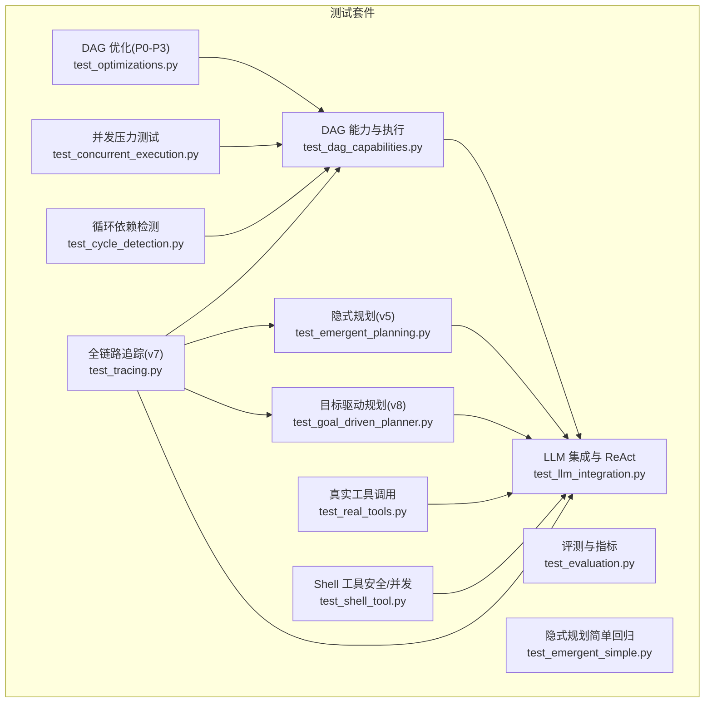
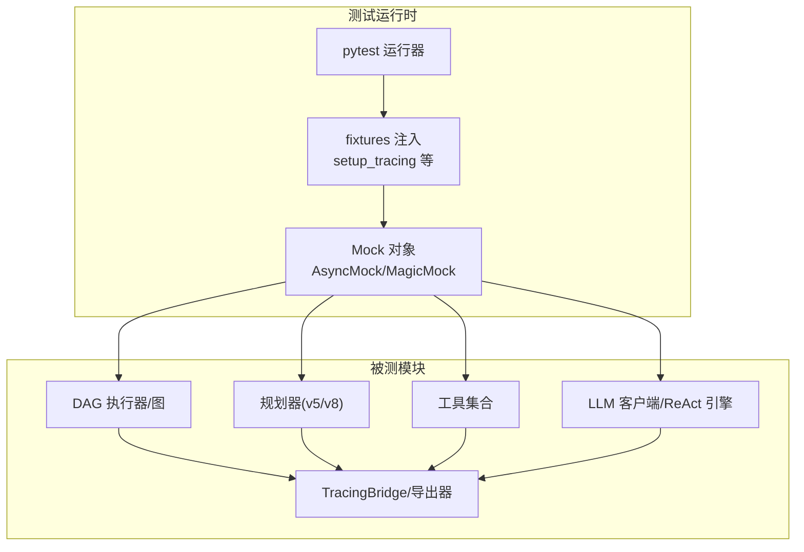
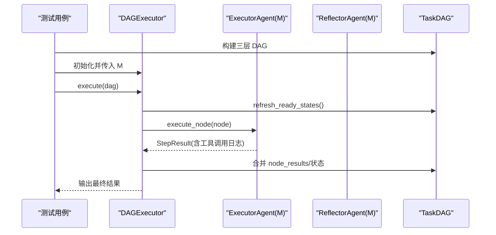
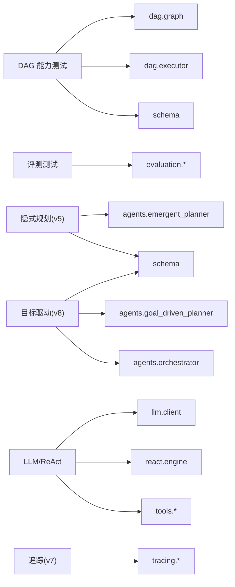

# 测试框架

<cite>
**本文引用的文件**
- [tests/test_dag_capabilities.py](file://tests/test_dag_capabilities.py)
- [tests/test_evaluation.py](file://tests/test_evaluation.py)
- [tests/test_emergent_planning.py](file://tests/test_emergent_planning.py)
- [tests/test_goal_driven_planner.py](file://tests/test_goal_driven_planner.py)
- [tests/test_llm_integration.py](file://tests/test_llm_integration.py)
- [tests/test_optimizations.py](file://tests/test_optimizations.py)
- [tests/test_real_tools.py](file://tests/test_real_tools.py)
- [tests/test_shell_tool.py](file://tests/test_shell_tool.py)
- [tests/test_concurrent_execution.py](file://tests/test_concurrent_execution.py)
- [tests/test_cycle_detection.py](file://tests/test_cycle_detection.py)
- [tests/test_tracing.py](file://tests/test_tracing.py)
- [tests/test_emergent_simple.py](file://tests/test_emergent_simple.py)
</cite>

## 目录
1. [简介](#简介)
2. [项目结构](#项目结构)
3. [核心组件](#核心组件)
4. [架构总览](#架构总览)
5. [详细组件分析](#详细组件分析)
6. [依赖分析](#依赖分析)
7. [性能考虑](#性能考虑)
8. [故障排查指南](#故障排查指南)
9. [结论](#结论)
10. [附录](#附录)

## 简介
本文件系统化梳理 manus_demo 的测试框架，覆盖 pytest 配置、测试组织结构与命名约定、测试类型划分（单元测试、集成测试、端到端测试）、辅助工具与 Mock 使用、测试数据准备与清理、运行方式与并行执行、覆盖率与 CI 配置建议、断言策略与错误处理模式。文档面向不同技术背景读者，既提供高层概览，也给出代码级图示与来源标注。

## 项目结构
manus_demo 的测试位于 tests/ 目录，按功能域划分，每个文件聚焦一类能力或模块：
- DAG 能力与执行：test_dag_capabilities.py
- 评测与指标：test_evaluation.py
- 隐式规划（v5）：test_emergent_planning.py
- 目标驱动规划（v8）：test_goal_driven_planner.py
- LLM 集成与 ReAct 引擎：test_llm_integration.py
- DAG 优化（边界条件/P0-P3）：test_optimizations.py
- 真实工具调用：test_real_tools.py
- Shell 工具安全与并发：test_shell_tool.py
- 并发执行压力测试：test_concurrent_execution.py
- 循环依赖检测：test_cycle_detection.py
- 全链路追踪（v7）：test_tracing.py
- 隐式规划简单回归：test_emergent_simple.py

图表来源
- [tests/test_dag_capabilities.py:1-1211](file://tests/test_dag_capabilities.py#L1-L1211)
- [tests/test_evaluation.py:1-587](file://tests/test_evaluation.py#L1-L587)
- [tests/test_emergent_planning.py:1-432](file://tests/test_emergent_planning.py#L1-L432)
- [tests/test_goal_driven_planner.py:1-814](file://tests/test_goal_driven_planner.py#L1-L814)
- [tests/test_llm_integration.py:1-535](file://tests/test_llm_integration.py#L1-L535)
- [tests/test_optimizations.py:1-358](file://tests/test_optimizations.py#L1-L358)
- [tests/test_real_tools.py:1-110](file://tests/test_real_tools.py#L1-L110)
- [tests/test_shell_tool.py:1-221](file://tests/test_shell_tool.py#L1-L221)
- [tests/test_concurrent_execution.py:1-163](file://tests/test_concurrent_execution.py#L1-L163)
- [tests/test_cycle_detection.py:1-91](file://tests/test_cycle_detection.py#L1-L91)
- [tests/test_tracing.py:1-948](file://tests/test_tracing.py#L1-L948)
- [tests/test_emergent_simple.py:1-124](file://tests/test_emergent_simple.py#L1-L124)

章节来源
- [tests/test_dag_capabilities.py:1-1211](file://tests/test_dag_capabilities.py#L1-L1211)
- [tests/test_evaluation.py:1-587](file://tests/test_evaluation.py#L1-L587)
- [tests/test_emergent_planning.py:1-432](file://tests/test_emergent_planning.py#L1-L432)
- [tests/test_goal_driven_planner.py:1-814](file://tests/test_goal_driven_planner.py#L1-L814)
- [tests/test_llm_integration.py:1-535](file://tests/test_llm_integration.py#L1-L535)
- [tests/test_optimizations.py:1-358](file://tests/test_optimizations.py#L1-L358)
- [tests/test_real_tools.py:1-110](file://tests/test_real_tools.py#L1-L110)
- [tests/test_shell_tool.py:1-221](file://tests/test_shell_tool.py#L1-L221)
- [tests/test_concurrent_execution.py:1-163](file://tests/test_concurrent_execution.py#L1-L163)
- [tests/test_cycle_detection.py:1-91](file://tests/test_cycle_detection.py#L1-L91)
- [tests/test_tracing.py:1-948](file://tests/test_tracing.py#L1-L948)
- [tests/test_emergent_simple.py:1-124](file://tests/test_emergent_simple.py#L1-L124)

## 核心组件
- pytest 配置与运行
  - 使用命令行运行单个测试文件或按关键字筛选，例如：pytest tests/test_llm_integration.py -k "chat" -v。
  - 支持异步测试（pytest.mark.asyncio），常见于 DAG 执行器、规划器与工具调用。
- 测试组织与命名约定
  - 文件名：test_xxx.py，按功能域命名，如 test_dag_capabilities.py、test_evaluation.py。
  - 类名：TestXxx，每个类聚焦一类职责或模块。
  - 方法名：test_xxx，清晰表达断言意图。
- Mock 与辅助工具
  - 使用 unittest.mock.AsyncMock/MagicMock 构造异步/同步桩对象，模拟 LLM、工具与执行器。
  - 使用 pytest fixtures（如 setup_tracing）注入 OpenTelemetry 环境，避免全局状态污染。
- 断言策略
  - 行为断言：关注事件流、状态转换、工具调用次数与参数、输出内容片段。
  - 结构断言：校验数据模型字段、枚举值范围、序列化格式。
  - 性能/边界断言：并发上限、超步间隔、阻塞报告、环检测异常。
- 错误处理
  - 显式捕获与断言异常类型（如 ValueError），确保错误路径可验证。
  - 对外部依赖（OTel、文件系统）进行零依赖或最小化依赖的测试。

章节来源
- [tests/test_llm_integration.py:1-535](file://tests/test_llm_integration.py#L1-L535)
- [tests/test_dag_capabilities.py:1-1211](file://tests/test_dag_capabilities.py#L1-L1211)
- [tests/test_tracing.py:1-948](file://tests/test_tracing.py#L1-L948)

## 架构总览
测试框架围绕“模块化、可替换、可观测”展开：
- 模块化：每个测试文件独立覆盖一个子系统（DAG、规划、工具、追踪等）。
- 可替换：通过 Mock 替换外部服务（LLM、文件系统、子进程），保证测试稳定与可重复。
- 可观测：利用 TracingBridge 记录事件与跨度，便于定位问题与回归分析。

图表来源
- [tests/test_dag_capabilities.py:223-340](file://tests/test_dag_capabilities.py#L223-L340)
- [tests/test_llm_integration.py:336-458](file://tests/test_llm_integration.py#L336-L458)
- [tests/test_tracing.py:191-301](file://tests/test_tracing.py#L191-L301)

## 详细组件分析

### DAG 能力与执行测试（test_dag_capabilities.py）
- 测试目标
  - 分层规划（Goal/SubGoal/Action）结构与拓扑排序。
  - 并行执行与工具调用链路。
  - 条件分支与失败回滚。
  - 动态 DAG 变更（新增/删除/修改节点与边）。
  - 工具路由器的失败追踪与替代建议。
  - 自适应规划集成（超步间调整）。
- 关键实现要点
  - 使用 AsyncMock 模拟执行器与反射器，构造 StepResult/ToolCallRecord。
  - 通过 DAGExecutor 的事件回调收集超步、条件评估、节点状态变化。
  - 验证节点 readiness、依赖满足、状态机合法性（禁止终态再转移）。
- 断言策略
  - 结构断言：节点类型、父子关系、边类型。
  - 行为断言：并行节点在同一超步执行、工具调用记录完整、checkpoint 存在。
  - 错误处理：状态机非法转移抛出异常。

图表来源
- [tests/test_dag_capabilities.py:223-340](file://tests/test_dag_capabilities.py#L223-L340)

章节来源
- [tests/test_dag_capabilities.py:1-1211](file://tests/test_dag_capabilities.py#L1-L1211)

### 评测与指标测试（test_evaluation.py）
- 测试目标
  - 规划、执行、效率、反思等指标计算逻辑。
  - 基准任务加载与过滤。
  - 报告渲染（烟雾测试）。
  - 探针事件处理（重计划检测、工具错误识别、中文覆盖度、todo 计数提取、反思观察标记、must_not_include 校验、配置快照）。
- 关键实现要点
  - 使用 _make_* 工厂函数快速构造数据模型实例，确保测试数据一致性。
  - 使用正则与 n-gram 匹配中文子任务覆盖度。
  - 事件探针对不同事件类型进行精确匹配与计数。
- 断言策略
  - 数值断言：得分边界、聚合率、分布统计。
  - 结构断言：字段存在性、枚举值范围、序列化结果。

章节来源
- [tests/test_evaluation.py:1-587](file://tests/test_evaluation.py#L1-L587)

### 隐式规划（v5）测试（test_emergent_planning.py）
- 测试目标
  - TODO 列表数据模型与依赖关系管理。
  - EmergentPlannerAgent 核心循环（初始化、执行、TODO 更新）。
  - 循环检测（依赖环）。
  - 与 Orchestrator 路由集成。
  - 失败重试与阻塞、停滞检测、答案合成。
- 关键实现要点
  - 使用 AsyncMock 模拟 LLM JSON/文本响应，控制计划生成与思考过程。
  - 通过 think_with_tools 的异常注入模拟失败路径。
  - 验证 TODO 列表的就绪/完成/阻塞状态转换。
- 断言策略
  - 行为断言：TODO 状态迁移、阻塞节点恢复、停滞检测触发。
  - 结构断言：依赖环检测抛出异常。

章节来源
- [tests/test_emergent_planning.py:1-432](file://tests/test_emergent_planning.py#L1-L432)

### 目标驱动规划（v8）测试（test_goal_driven_planner.py）
- 测试目标
  - 目标文档、里程碑计划、反思数据模型。
  - GoalDrivenPlannerAgent 核心循环（目标锚定、反向规划、反思、重锚定）。
  - 与 Orchestrator 路由集成（v8 开关）。
  - 事件发射与 TracingBridge 兼容性。
  - 目标引导的 ReAct 循环（最大迭代、工具调用注入）。
- 关键实现要点
  - 通过 think_json/think 控制目标文档、里程碑与反思生成。
  - 模拟 _execute_todo_goal_guided 的成功/失败路径，验证停滞检测与重锚定。
  - 事件兼容性断言确保 v8 事件能在 TracingBridge 中正确映射。
- 断言策略
  - 事件序列断言：goal_anchor、todo_list_initialized、goal_reflection、todo_start/complete。
  - 数据结构断言：里程碑顺序、进度百分比、建议动作。

章节来源
- [tests/test_goal_driven_planner.py:1-814](file://tests/test_goal_driven_planner.py#L1-L814)

### LLM 集成与 ReAct 引擎测试（test_llm_integration.py）
- 测试目标
  - LLMClient 初始化与配置（环境变量加载、重试配置）。
  - 基础聊天、系统提示、温度影响、最大 token 限制。
  - 函数调用（工具调用）、多工具协作、工具执行流程。
  - 结构化 JSON 输出、错误处理与无效 JSON。
  - ReAct 引擎初始化、简单任务、上下文透传、最大迭代、系统提示。
  - v6.0 特性开关（ReAct v2、LLM 重试）。
  - 端到端集成：完整 ReAct 循环与多轮对话。
- 关键实现要点
  - 自定义 BaseTool 子类（EchoTool/AddTool）验证工具协议。
  - 使用 AsyncMock 模拟 chat/chat_with_tools/chat_json，控制响应与工具调用。
  - ReActEngine.execute 返回 StepResult，包含 success、output、tool_calls_log。
- 断言策略
  - 行为断言：工具调用参数解析、执行结果、迭代次数限制。
  - 结构断言：响应类型、JSON 解析、特征开关存在且默认兼容。

章节来源
- [tests/test_llm_integration.py:1-535](file://tests/test_llm_integration.py#L1-L535)

### DAG 优化测试（P0-P3）（test_optimizations.py）
- 测试目标
  - P1：边界条件（空 DAG 完成、单节点 DAG、失败节点检测、阻塞报告）。
  - P2：Checkpoint 机制（保存状态、数量限制、内容完整性、只读属性）。
  - P3：邻接表优化（依赖查找、动态边添加/节点移除后的更新、条件边不影响依赖邻接）。
  - P0：失败恢复增强（无依赖/依赖终态/依赖非终态/依赖跳过时的恢复）。
- 关键实现要点
  - 通过 get_dependency_ids、get_blockage_report、save_checkpoint、try_recover_blocked_nodes 验证优化效果。
  - 集成测试确保多项优化协同工作。
- 断言策略
  - 边界断言：空/单节点 DAG 的行为。
  - 机制断言：checkpoint 数量上限、邻接表一致性、阻塞报告准确性。

章节来源
- [tests/test_optimizations.py:1-358](file://tests/test_optimizations.py#L1-L358)

### 真实工具调用测试（test_real_tools.py）
- 测试目标
  - CodeExecutorTool：简单/复杂代码执行、错误处理（除零等）。
  - FileOpsTool：写入/读取/列出、错误处理（不存在文件）、路径穿越保护。
- 关键实现要点
  - 使用真实工具实例，直接调用 execute，断言输出包含预期片段或错误信息。
  - 清理测试文件，避免污染工作空间。
- 断言策略
  - 行为断言：输出包含预期结果或错误提示。
  - 安全断言：路径穿越保护生效。

章节来源
- [tests/test_real_tools.py:1-110](file://tests/test_real_tools.py#L1-L110)

### Shell 工具安全与并发测试（test_shell_tool.py）
- 测试目标
  - 基本属性与参数模式、OpenAI 工具适配。
  - 命令执行（管道、stderr、非零退出码、空命令）。
  - 黑名单安全检查（rm -rf、mkfs、dd、sudo、su、printenv、systemctl 等）。
  - 超时行为、环境变量清洗、输出截断、并发信号量控制、孤儿进程清理。
- 关键实现要点
  - _check_blocked 对危险命令进行拦截，execute 返回错误信息。
  - 通过 monkeypatch 设置环境变量，验证环境变量未泄漏。
  - 使用 asyncio.Semaphore 控制并发，确保资源隔离。
- 断言策略
  - 安全断言：黑名单命令被拦截。
  - 行为断言：超时、输出截断、并发限制、孤儿进程清理。

章节来源
- [tests/test_shell_tool.py:1-221](file://tests/test_shell_tool.py#L1-L221)

### 并发执行压力测试（test_concurrent_execution.py）
- 测试目标
  - 高并发（20 个并行 Action）与中等并发（每组 5 个 Action）场景。
  - 验证 DAGExecutor 的并发调度与完成统计。
- 关键实现要点
  - 构造包含多个并行 Action 的 DAG，设置 max_parallel 限制每轮并发数。
  - 使用 AsyncMock 的 execute_node 返回固定成功结果。
- 断言策略
  - 结果断言：所有节点完成计数符合预期。

章节来源
- [tests/test_concurrent_execution.py:1-163](file://tests/test_concurrent_execution.py#L1-L163)

### 循环依赖检测测试（test_cycle_detection.py）
- 测试目标
  - 环检测：制造 a->b->c->a 的环，断言抛出 ValueError。
  - 无环 DAG 正常创建。
- 关键实现要点
  - 通过 TaskDAG 构造边，触发环检测逻辑。
- 断言策略
  - 异常断言：环检测抛出包含特定提示的异常；无环 DAG 创建成功。

章节来源
- [tests/test_cycle_detection.py:1-91](file://tests/test_cycle_detection.py#L1-L91)

### 全链路追踪（v7）测试（test_tracing.py）
- 测试目标
  - 特性开关：TRACING_ENABLED=false 时零开销。
  - Span 常量与事件名称有效性。
  - TracingBridge：任务生命周期、阶段事件、复杂度记录、异常安全。
  - 导出器：FileSpanExporter JSON 输出结构。
  - 装饰器：@traced 对同步/异步函数的跨度创建与异常记录。
  - LLMClient 追踪辅助：_start_llm_span/_end_llm_span。
  - BaseTool.traced_execute：工具执行跨度。
  - 配置：敏感键集合、采样率、属性长度限制。
  - 多播事件分发：回调隔离失败。
  - DAG/Emergent 事件桥接：superstep/node_running/node_completed/node_failed 的层次关系。
- 关键实现要点
  - 使用 setup_tracing fixture 注入测试 TracerProvider，避免全局冲突。
  - 通过 _InMemoryExporter 收集并断言导出结果。
  - 事件兼容性断言确保 v8 事件能被 TracingBridge 正确映射。
- 断言策略
  - 结构断言：JSON 文件结构、属性键存在性。
  - 行为断言：装饰器记录异常、LLM span 上下文、工具执行跨度。

章节来源
- [tests/test_tracing.py:1-948](file://tests/test_tracing.py#L1-L948)

### 隐式规划简单回归（test_emergent_simple.py）
- 测试目标
  - TodoItem/TodoList 基本功能。
  - 配置项存在性。
  - 导入与 Orchestrator 集成。
- 关键实现要点
  - 使用标准断言验证数据模型与配置。
- 断言策略
  - 存在性断言：类与属性存在。

章节来源
- [tests/test_emergent_simple.py:1-124](file://tests/test_emergent_simple.py#L1-L124)

## 依赖分析
- 组件耦合
  - DAG 测试依赖 TaskDAG/DAGExecutor/NodeStateMachine/schema。
  - 规划器测试依赖 agents.*、schema、tools.*。
  - LLM/工具测试依赖 llm.client、tools.*、react.engine。
  - 追踪测试依赖 tracing.*、OpenTelemetry SDK。
- 外部依赖
  - OpenTelemetry SDK（用于追踪测试）。
  - 环境变量（LLM_BASE_URL/LLM_API_KEY/LLM_MODEL）。
- 潜在循环依赖
  - 测试文件之间无直接导入循环；各文件仅导入被测模块与通用工具。

图表来源
- [tests/test_dag_capabilities.py:24-38](file://tests/test_dag_capabilities.py#L24-L38)
- [tests/test_evaluation.py:15-33](file://tests/test_evaluation.py#L15-L33)
- [tests/test_emergent_planning.py:17-18](file://tests/test_emergent_planning.py#L17-L18)
- [tests/test_goal_driven_planner.py:22-32](file://tests/test_goal_driven_planner.py#L22-L32)
- [tests/test_llm_integration.py:45-48](file://tests/test_llm_integration.py#L45-L48)
- [tests/test_tracing.py:191-301](file://tests/test_tracing.py#L191-L301)

## 性能考虑
- 并发与限流
  - DAGExecutor 的 max_parallel 控制每轮并发节点数，避免资源争用。
  - ShellTool 使用 asyncio.Semaphore 控制并发，防止系统过载。
- 超步与检查点
  - P2 优化：定期保存 checkpoint，降低大规模 DAG 失败重跑成本。
- 资源清理
  - 并发测试后清理孤儿进程，避免僵尸进程占用资源。
- I/O 与输出截断
  - FileOpsTool/ShellTool 对输出进行截断与安全检查，防止内存与磁盘溢出。

## 故障排查指南
- 追踪开关导致的异常
  - 当 TRACING_ENABLED=false 时，TracingBridge 应为无操作；若出现异常，检查配置恢复与导入时机。
- 环检测失败
  - 构造 DAG 时出现环，需检查边方向与依赖关系，确保拓扑有序。
- 并发问题
  - 并发过高导致资源不足或超时，适当降低 max_parallel 或增加系统资源。
- 工具安全
  - ShellTool 的黑名单拦截应覆盖常见危险命令；若发现绕过，更新黑名单规则。
- LLM/工具调用失败
  - 使用 AsyncMock 提供稳定的响应，逐步替换为真实调用以定位问题。

章节来源
- [tests/test_tracing.py:35-72](file://tests/test_tracing.py#L35-L72)
- [tests/test_cycle_detection.py:12-38](file://tests/test_cycle_detection.py#L12-L38)
- [tests/test_shell_tool.py:80-135](file://tests/test_shell_tool.py#L80-L135)
- [tests/test_llm_integration.py:305-335](file://tests/test_llm_integration.py#L305-L335)

## 结论
manus_demo 的测试框架以 pytest 为核心，采用模块化与可替换策略，结合丰富的 Mock 与事件追踪，覆盖从单元到端到端的多层级验证。通过明确的断言策略与错误处理模式，测试具备良好的稳定性与可维护性。建议在持续集成中引入覆盖率统计与并行执行，进一步提升回归效率与质量保障。

## 附录

### 测试类型划分与标准
- 单元测试
  - 面向具体函数/类的最小可验证单元，如数据模型、工具方法、状态机。
  - 示例：test_optimizations.py、test_shell_tool.py、test_emergent_simple.py。
- 集成测试
  - 关注模块间交互与接口契约，如 DAGExecutor 与工具、规划器与 Orchestrator。
  - 示例：test_dag_capabilities.py、test_llm_integration.py、test_evaluation.py。
- 端到端测试
  - 模拟真实用户场景，验证完整流程，如并发压力测试、真实工具调用。
  - 示例：test_concurrent_execution.py、test_real_tools.py。

### 运行方式与并行执行
- 运行单个测试文件
  - pytest tests/test_llm_integration.py -v
- 按关键字运行
  - pytest tests/test_llm_integration.py -k "chat" -v
- 指定测试类别
  - pytest tests/test_llm_integration.py -k "tools" -v
  - pytest tests/test_llm_integration.py -k "retry" -v
- 使用真实 API（需配置密钥）
  - DEEP_SEEK_API_KEY=your_key pytest tests/test_llm_integration.py -v
- 并行执行（建议）
  - 使用 pytest-xdist 插件进行并行测试（需安装 pytest-xdist），在 CI 中按 CPU 核心数配置 worker 数量。

### 测试数据准备与清理
- Mock 数据
  - 使用工厂函数（如 _make_*）统一构造测试数据，确保一致性与可读性。
- 文件与进程
  - 真实工具测试后清理临时文件；并发测试后检查并清理孤儿进程。
- 环境变量
  - 通过 .env 加载 LLM 配置；在测试前后恢复默认值，避免跨用例污染。

### 断言策略与错误处理模式
- 行为断言
  - 关注事件序列、工具调用、状态转换、输出片段。
- 结构断言
  - 校验数据模型字段、枚举范围、序列化格式。
- 错误断言
  - 显式捕获异常类型与消息，确保错误路径可验证。
- 异常安全
  - 追踪桥接器在异常情况下不应影响上层逻辑，保持零开销。

### 覆盖率分析与持续集成配置（建议）
- 覆盖率
  - 使用 pytest-cov 生成覆盖率报告，建议设置阈值（如语句/分支）。
- CI 配置
  - 在流水线中执行 pytest（含 -v/--tb=short）、并行执行、覆盖率收集与报告。
  - 对关键模块（DAG、规划、工具、追踪）设置最低覆盖率阈值。
- 日志与报告
  - 保存测试日志与覆盖率报告，便于回归分析与质量度量。