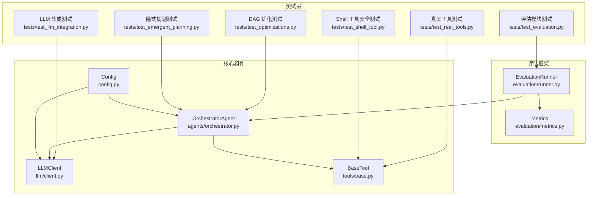
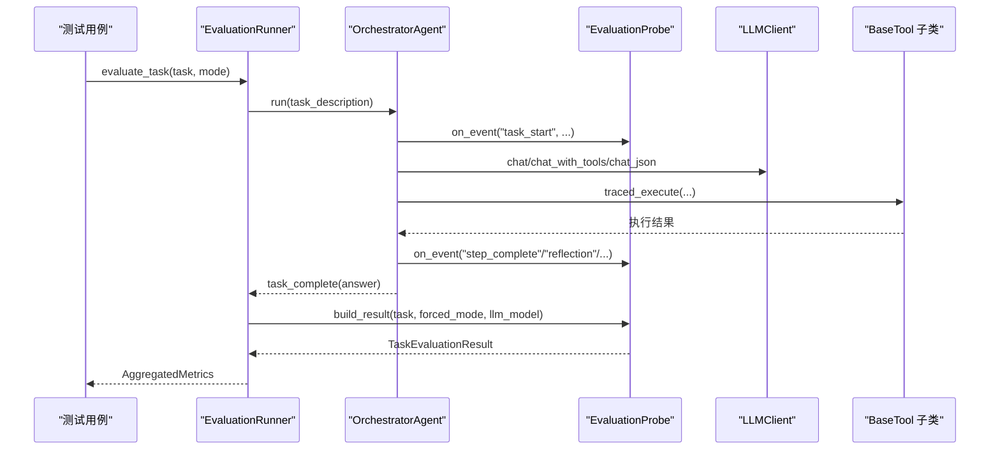
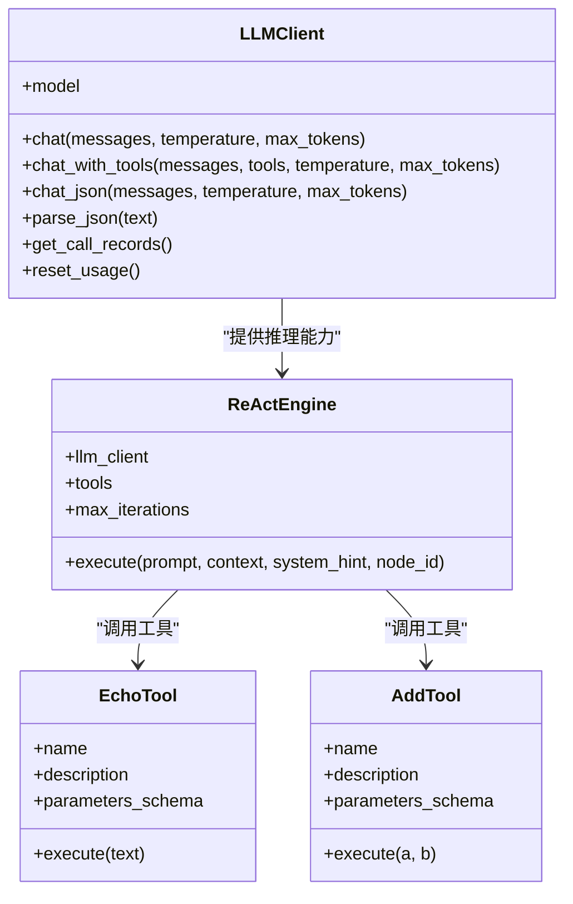
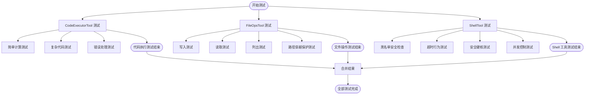
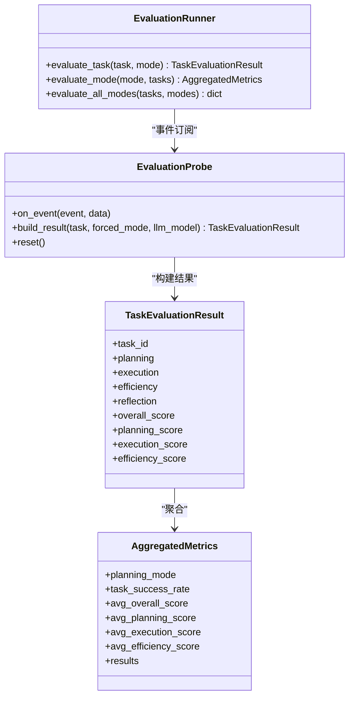
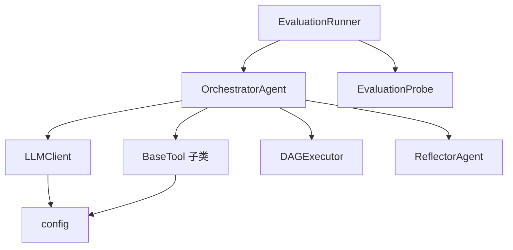

# 集成测试

<cite>
**本文引用的文件**
- [tests/test_llm_integration.py](file://tests/test_llm_integration.py)
- [tests/test_real_tools.py](file://tests/test_real_tools.py)
- [tests/test_shell_tool.py](file://tests/test_shell_tool.py)
- [tests/test_evaluation.py](file://tests/test_evaluation.py)
- [tests/test_optimizations.py](file://tests/test_optimizations.py)
- [tests/test_emergent_planning.py](file://tests/test_emergent_planning.py)
- [evaluation/runner.py](file://evaluation/runner.py)
- [evaluation/metrics.py](file://evaluation/metrics.py)
- [llm/client.py](file://llm/client.py)
- [tools/base.py](file://tools/base.py)
- [agents/orchestrator.py](file://agents/orchestrator.py)
- [config.py](file://config.py)
- [README.md](file://README.md)
</cite>

## 目录
1. [简介](#简介)
2. [项目结构](#项目结构)
3. [核心组件](#核心组件)
4. [架构概览](#架构概览)
5. [详细组件分析](#详细组件分析)
6. [依赖分析](#依赖分析)
7. [性能考虑](#性能考虑)
8. [故障排查指南](#故障排查指南)
9. [结论](#结论)
10. [附录](#附录)

## 简介
本文件为 manus_demo 项目的集成测试详细文档，聚焦以下目标：
- 解释集成测试的整体架构与测试策略，涵盖组件间交互验证与端到端流程测试
- 详细说明 LLM 集成测试的实现方法，包括 API 调用模拟与响应验证
- 介绍真实工具测试的设计原理，包括工具执行结果验证与错误处理测试
- 解释评估测试的指标计算与性能基准测试方法
- 提供集成测试的配置方法与测试环境搭建指南

## 项目结构
manus_demo 是一个基于 DAG 的多智能体系统，支持三种规划路径：v1 扁平计划、v2 DAG 并行执行、v5 隐式规划（TODO 列表）。集成测试围绕 OrchestratorAgent 的事件驱动流水线展开，通过 EvaluationRunner 将 Orchestrator 的事件转化为评测指标，形成闭环验证。

图表来源
- [tests/test_llm_integration.py:1-535](file://tests/test_llm_integration.py#L1-L535)
- [tests/test_real_tools.py:1-110](file://tests/test_real_tools.py#L1-L110)
- [tests/test_shell_tool.py:1-221](file://tests/test_shell_tool.py#L1-L221)
- [tests/test_evaluation.py:1-587](file://tests/test_evaluation.py#L1-L587)
- [tests/test_optimizations.py:1-358](file://tests/test_optimizations.py#L1-L358)
- [tests/test_emergent_planning.py:1-432](file://tests/test_emergent_planning.py#L1-L432)
- [evaluation/runner.py:1-570](file://evaluation/runner.py#L1-L570)
- [evaluation/metrics.py:1-475](file://evaluation/metrics.py#L1-L475)
- [llm/client.py:1-420](file://llm/client.py#L1-L420)
- [tools/base.py:1-175](file://tools/base.py#L1-L175)
- [agents/orchestrator.py:1-600](file://agents/orchestrator.py#L1-L600)
- [config.py:1-109](file://config.py#L1-L109)

章节来源
- [README.md:1-400](file://README.md#L1-L400)

## 核心组件
- LLMClient：统一的 OpenAI 兼容 API 封装，支持重试、追踪与结构化 JSON 输出
- BaseTool：工具抽象接口，定义工具名称、描述、参数 Schema 与执行方法
- OrchestratorAgent：多智能体流水线的中央协调者，负责任务分类、路由与反思
- EvaluationRunner：评测执行器，通过事件探针收集指标并聚合为评估结果
- EvaluationProbe：事件探针，拦截 Orchestrator 的事件流，构建 TaskEvaluationResult
- Metrics：评测指标与聚合逻辑，包含规划、执行、效率、反思等维度

章节来源
- [llm/client.py:32-420](file://llm/client.py#L32-L420)
- [tools/base.py:22-175](file://tools/base.py#L22-L175)
- [agents/orchestrator.py:60-600](file://agents/orchestrator.py#L60-L600)
- [evaluation/runner.py:55-570](file://evaluation/runner.py#L55-L570)
- [evaluation/metrics.py:76-475](file://evaluation/metrics.py#L76-L475)

## 架构概览
集成测试采用“事件驱动 + 指标采集”的架构：
- OrchestratorAgent 通过事件回调向外广播任务生命周期事件
- EvaluationProbe 订阅这些事件，构建评测指标
- EvaluationRunner 聚合指标并输出综合评分
- 测试用例通过断言事件、指标与最终结果，验证端到端流程

图表来源
- [evaluation/runner.py:462-524](file://evaluation/runner.py#L462-L524)
- [evaluation/runner.py:294-433](file://evaluation/runner.py#L294-L433)
- [agents/orchestrator.py:158-222](file://agents/orchestrator.py#L158-L222)
- [llm/client.py:73-228](file://llm/client.py#L73-L228)
- [tools/base.py:60-124](file://tools/base.py#L60-L124)

## 详细组件分析

### LLM 集成测试
本测试套件验证 LLMClient 的核心能力与 ReActEngine 的统一推理引擎集成，覆盖：
- 初始化与配置加载（默认与自定义）
- 基础聊天补全、系统提示、温度影响、max_tokens 限制
- 工具调用（Function Calling）与多工具协作
- 结构化 JSON 输出（含回退机制）
- 错误处理与重试机制
- ReActEngine 的初始化、执行与上下文传递

图表来源
- [llm/client.py:32-420](file://llm/client.py#L32-L420)
- [tests/test_llm_integration.py:51-103](file://tests/test_llm_integration.py#L51-L103)
- [tests/test_llm_integration.py:336-458](file://tests/test_llm_integration.py#L336-L458)

章节来源
- [tests/test_llm_integration.py:105-535](file://tests/test_llm_integration.py#L105-L535)
- [llm/client.py:73-228](file://llm/client.py#L73-L228)

### 真实工具测试
本测试套件验证真实工具的执行与错误处理，包括：
- CodeExecutorTool：简单/复杂代码执行、异常捕获
- FileOpsTool：写入、读取、列出、错误处理与路径穿越保护
- ShellTool：命令执行、黑名单安全检查、超时与并发控制、输出截断与孤儿进程清理

图表来源
- [tests/test_real_tools.py:13-84](file://tests/test_real_tools.py#L13-L84)
- [tests/test_shell_tool.py:14-217](file://tests/test_shell_tool.py#L14-L217)

章节来源
- [tests/test_real_tools.py:1-110](file://tests/test_real_tools.py#L1-L110)
- [tests/test_shell_tool.py:1-221](file://tests/test_shell_tool.py#L1-L221)

### 评估测试与指标计算
评估模块通过 EvaluationRunner 驱动 OrchestratorAgent 执行任务，EvaluationProbe 拦截事件并构建 TaskEvaluationResult，随后由 metrics 模块计算各类指标并聚合为 AggregatedMetrics。

图表来源
- [evaluation/runner.py:440-570](file://evaluation/runner.py#L440-L570)
- [evaluation/runner.py:55-433](file://evaluation/runner.py#L55-L433)
- [evaluation/metrics.py:168-475](file://evaluation/metrics.py#L168-L475)

章节来源
- [tests/test_evaluation.py:1-587](file://tests/test_evaluation.py#L1-L587)
- [evaluation/runner.py:1-570](file://evaluation/runner.py#L1-L570)
- [evaluation/metrics.py:1-475](file://evaluation/metrics.py#L1-L475)

### DAG 优化与隐式规划集成测试
- DAG 优化测试覆盖边界条件、Checkpoint 机制、邻接表正确性与失败恢复增强
- 隐式规划测试覆盖 TODO 列表管理、EmergentPlannerAgent 核心循环与与 Orchestrator 的路由集成

章节来源
- [tests/test_optimizations.py:18-358](file://tests/test_optimizations.py#L18-L358)
- [tests/test_emergent_planning.py:20-432](file://tests/test_emergent_planning.py#L20-L432)

## 依赖分析
- OrchestratorAgent 依赖 LLMClient、BaseTool 子类、ContextManager、DAGExecutor、ReflectorAgent 等
- EvaluationRunner 依赖 OrchestratorAgent 与 EvaluationProbe，后者依赖 Orchestrator 的事件流
- LLMClient 依赖 config 与 OpenAI SDK，支持重试与追踪
- BaseTool 提供 traced_execute 以启用工具执行追踪

图表来源
- [agents/orchestrator.py:94-152](file://agents/orchestrator.py#L94-L152)
- [evaluation/runner.py:454-481](file://evaluation/runner.py#L454-L481)
- [llm/client.py:41-67](file://llm/client.py#L41-L67)
- [tools/base.py:60-124](file://tools/base.py#L60-L124)

章节来源
- [agents/orchestrator.py:1-600](file://agents/orchestrator.py#L1-L600)
- [evaluation/runner.py:1-570](file://evaluation/runner.py#L1-L570)
- [llm/client.py:1-420](file://llm/client.py#L1-L420)
- [tools/base.py:1-175](file://tools/base.py#L1-L175)

## 性能考虑
- 评测指标包含 Token 消耗、执行耗时、轨迹效率与重规划次数，用于衡量 LLM 调用成本与执行效率
- 通过 AggregatedMetrics 的平均值与分布统计，识别不同规划模式的性能差异
- 配置项如 MAX_REACT_ITERATIONS、MAX_PARALLEL_NODES、NODE_EXECUTION_TIMEOUT 等直接影响性能与稳定性

## 故障排查指南
- LLM 调用失败：检查 LLM_BASE_URL、LLM_API_KEY、LLM_MODEL 与 LLM_RETRY_* 配置
- 工具执行异常：查看工具返回的错误信息，确认参数 Schema 与执行超时设置
- 事件缺失：确认 Orchestrator 的事件回调是否正确注册，以及 EvaluationProbe 的 on_event 是否被调用
- 评测结果异常：检查 Ground Truth 关键词匹配、must_not_include 规则与 step_coverage 计算

章节来源
- [config.py:13-109](file://config.py#L13-L109)
- [evaluation/runner.py:139-293](file://evaluation/runner.py#L139-L293)
- [evaluation/metrics.py:259-391](file://evaluation/metrics.py#L259-L391)

## 结论
本集成测试文档系统性地梳理了 manus_demo 的测试架构与策略，覆盖 LLM 集成、真实工具、评估指标与性能基准。通过事件驱动的评测框架与严格的断言设计，能够有效验证多智能体系统的端到端流程与鲁棒性。

## 附录

### 集成测试配置与环境搭建
- 安装依赖与测试工具
  - pip install -r requirements.txt
  - pip install pytest pytest-asyncio
- 配置 LLM API
  - 复制示例配置文件并填入 API Key：cp .env.example .env
  - 编辑 .env 中的 LLM_BASE_URL、LLM_API_KEY、LLM_MODEL
- 运行测试
  - pytest tests/test_llm_integration.py -v
  - pytest tests/test_real_tools.py -v
  - pytest tests/test_shell_tool.py -v
  - pytest tests/test_evaluation.py -v
  - pytest tests/test_optimizations.py -v
  - pytest tests/test_emergent_planning.py -v

章节来源
- [README.md:156-265](file://README.md#L156-L265)