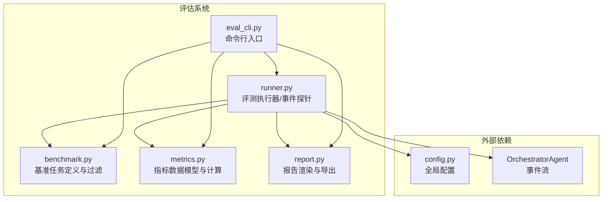
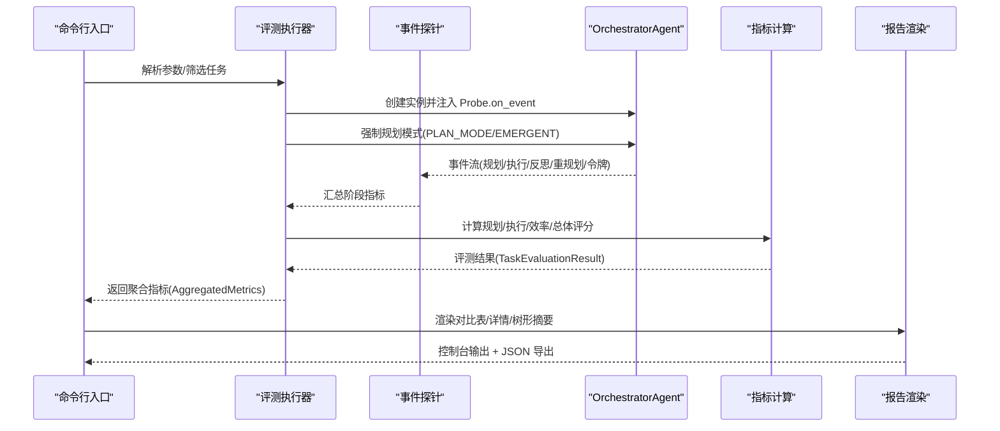
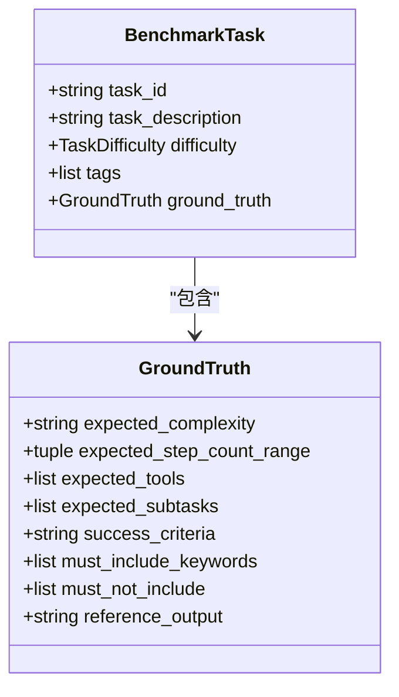
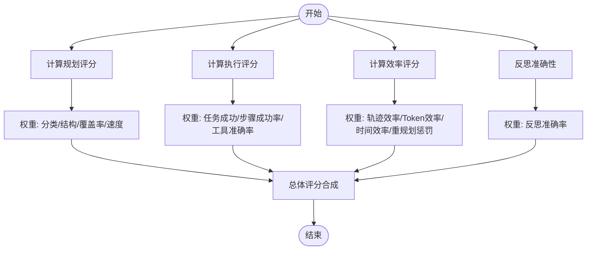
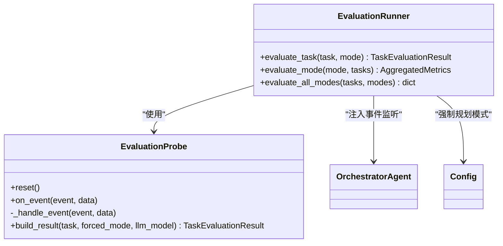
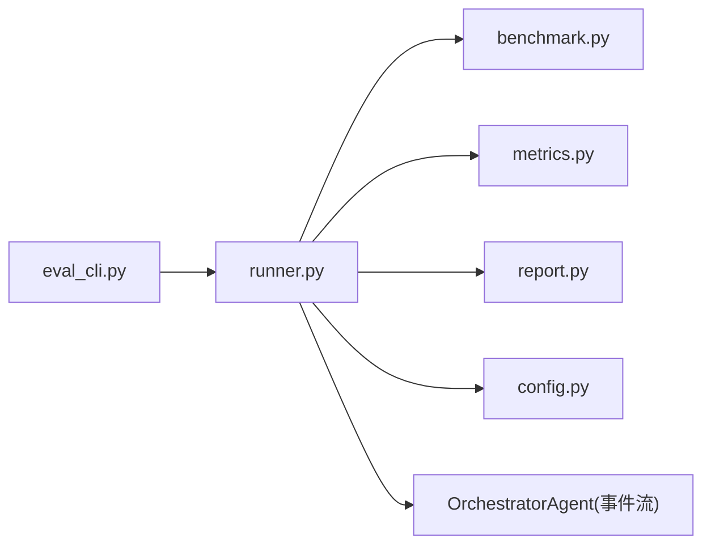

# 评估系统

<cite>
**本文引用的文件**
- [evaluation/__init__.py](file://evaluation/__init__.py)
- [evaluation/benchmark.py](file://evaluation/benchmark.py)
- [evaluation/metrics.py](file://evaluation/metrics.py)
- [evaluation/report.py](file://evaluation/report.py)
- [evaluation/runner.py](file://evaluation/runner.py)
- [evaluation/eval_cli.py](file://evaluation/eval_cli.py)
- [config.py](file://config.py)
- [tests/test_evaluation.py](file://tests/test_evaluation.py)
- [README.md](file://README.md)
</cite>

## 目录
1. [简介](#简介)
2. [项目结构](#项目结构)
3. [核心组件](#核心组件)
4. [架构总览](#架构总览)
5. [详细组件分析](#详细组件分析)
6. [依赖关系分析](#依赖关系分析)
7. [性能考量](#性能考量)
8. [故障排查指南](#故障排查指南)
9. [结论](#结论)
10. [附录](#附录)

## 简介
本文件为 Manus Demo 的评估系统提供系统化、可操作的技术文档。评估系统围绕“三种规划执行范式”（v1 简单扁平计划、v2 复杂 DAG 并行、v5 隐式规划 TODO 列表）设计基准测试、指标采集与报告生成机制，覆盖规划质量、执行质量、效率与鲁棒性、反思准确性等多个维度。文档将解释评估架构、工作流程、指标定义与计算方法、数据收集与存储、可视化展示、配置与自定义、实验设计与运行、报告生成与分析、扩展与集成方法，以及结果解读与改进建议。

## 项目结构
评估系统位于 evaluation 目录，包含以下关键模块：
- benchmark：基准任务定义与过滤
- metrics：指标数据模型与计算逻辑
- runner：评测执行器，事件探针与结果构建
- report：控制台与 JSON 报告渲染
- eval_cli：命令行入口，支持筛选、导出与干跑

图表来源
- [evaluation/runner.py:440-570](file://evaluation/runner.py#L440-L570)
- [evaluation/benchmark.py:78-311](file://evaluation/benchmark.py#L78-L311)
- [evaluation/metrics.py:1-475](file://evaluation/metrics.py#L1-L475)
- [evaluation/report.py:1-309](file://evaluation/report.py#L1-L309)
- [evaluation/eval_cli.py:1-186](file://evaluation/eval_cli.py#L1-L186)
- [config.py:1-109](file://config.py#L1-L109)

章节来源
- [evaluation/__init__.py:1-18](file://evaluation/__init__.py#L1-L18)
- [README.md:1-400](file://README.md#L1-L400)

## 核心组件
- 基准任务与地面真值：定义任务描述、难度、标签、期望复杂度、步骤范围、工具列表、成功标准与参考输出。
- 指标体系：规划质量、执行质量、效率与成本、鲁棒性、反思准确性。
- 事件探针：通过监听 OrchestratorAgent 的事件流，非侵入地采集各阶段数据。
- 评测执行器：编排任务执行、强制规划模式、构建评测结果并聚合。
- 报告模块：控制台富文本表格、树形摘要与 JSON 导出。
- 命令行入口：支持模式筛选、难度过滤、任务 ID 过滤、输出 JSON、干跑查看任务清单。

章节来源
- [evaluation/benchmark.py:35-311](file://evaluation/benchmark.py#L35-L311)
- [evaluation/metrics.py:32-475](file://evaluation/metrics.py#L32-L475)
- [evaluation/runner.py:55-570](file://evaluation/runner.py#L55-L570)
- [evaluation/report.py:35-309](file://evaluation/report.py#L35-L309)
- [evaluation/eval_cli.py:93-186](file://evaluation/eval_cli.py#L93-L186)

## 架构总览
评估系统采用“事件驱动 + 非侵入采集”的架构：评测执行器创建 OrchestratorAgent 实例，注入 EvaluationProbe 作为事件监听器，捕获规划、执行、反思、重规划、令牌消耗等事件，随后调用 metrics 模块计算各类评分，最终由 report 模块渲染控制台与 JSON 报告。

图表来源
- [evaluation/runner.py:462-570](file://evaluation/runner.py#L462-L570)
- [evaluation/metrics.py:259-391](file://evaluation/metrics.py#L259-L391)
- [evaluation/report.py:278-309](file://evaluation/report.py#L278-L309)
- [evaluation/eval_cli.py:93-143](file://evaluation/eval_cli.py#L93-L143)

## 详细组件分析

### 基准任务与地面真值（benchmark）
- GroundTruth：包含期望复杂度、步骤范围、期望工具、期望子任务、成功标准、关键词约束、参考输出。
- BenchmarkTask：封装任务 ID、描述、难度、标签与 GroundTruth。
- BENCHMARK_TASKS：内置 Easy/Medium/Hard 三档任务，覆盖单步与多步、顺序依赖与并行依赖、工具组合等场景。
- get_benchmark_tasks：支持按难度、标签、任务 ID 过滤。

图表来源
- [evaluation/benchmark.py:35-72](file://evaluation/benchmark.py#L35-L72)

章节来源
- [evaluation/benchmark.py:78-311](file://evaluation/benchmark.py#L78-L311)

### 指标体系与计算（metrics）
- 枚举：PlanMode（simple/complex/emergent）、TaskDifficulty（easy/medium/hard）、FailureCategory（规划/执行/反思/系统失败分类）。
- 数据模型：
  - PlanningMetrics：分类结果、计划结构有效性、步骤覆盖率、生成耗时等
  - ExecutionMetrics：步骤完成/失败/跳过/超时、成功率、工具使用统计、ReAct 迭代统计、执行耗时
  - EfficiencyMetrics：总 token、端到端耗时、轨迹效率、重规划次数与成功
  - ReflectionMetrics：反思判定、分数、观测情况、与 GT 的一致性、误判率、覆盖率
  - TaskEvaluationResult：单次任务完整评测结果
  - AggregatedMetrics：按模式聚合的统计指标
- 计算函数：
  - 规划评分：权重分配随“强制分类”与否而调整，包含分类正确性、结构有效性、步骤覆盖率、生成速度奖励
  - 执行评分：任务成功、步骤成功率、工具准确率
  - 效率评分：轨迹效率、token 效率、时间效率、重规划惩罚
  - 总体评分：加权合成，反思准确性作为额外奖励
  - 聚合：成功率、按难度分组、分类准确率、计划有效性、步骤覆盖率、执行成功率、工具准确率、ReAct 迭代、token/时间/轨迹效率、重规划次数、反思准确率与误判率、失败分布

图表来源
- [evaluation/metrics.py:259-391](file://evaluation/metrics.py#L259-L391)

章节来源
- [evaluation/metrics.py:32-475](file://evaluation/metrics.py#L32-L475)

### 事件探针与评测执行器（runner）
- EvaluationProbe：非侵入式事件监听，收集规划阶段（生成耗时、步骤数、DAG 节点数、TODO 项数、环检测）、执行阶段（步骤完成/失败/跳过/超时、工具调用、ReAct 迭代、执行耗时）、反思阶段（通过/分数/观测）、重规划计数、失败记录、令牌消耗、最终答案与任务成功判定。
- EvaluationRunner：对单任务/单模式/全模式评测，构建 TaskEvaluationResult 并聚合为 AggregatedMetrics；通过 config 强制规划模式，确保评测一致性。

图表来源
- [evaluation/runner.py:55-570](file://evaluation/runner.py#L55-L570)

章节来源
- [evaluation/runner.py:55-570](file://evaluation/runner.py#L55-L570)

### 报告与可视化（report）
- 控制台渲染：主对比表（任务数、成功率、各项评分、分类准确率、计划有效性、步骤覆盖率、执行/工具/迭代/Token/时间/重规划、反思准确率/覆盖率/误判率）、按难度分组的成功率、失败分布树形表。
- 详细模式页：单模式概览与逐任务明细。
- JSON 导出：包含聚合指标与逐任务结果，便于二次分析与可视化。

章节来源
- [evaluation/report.py:35-309](file://evaluation/report.py#L35-L309)

### 命令行入口（eval_cli）
- 参数支持：模式筛选（simple/complex/emergent）、难度筛选（easy/medium/hard）、任务 ID 列表、输出 JSON、干跑（仅显示任务清单）、详细日志。
- 流程：解析参数 → 获取任务 → 评测执行器 → 报告渲染 → JSON 导出。

章节来源
- [evaluation/eval_cli.py:93-186](file://evaluation/eval_cli.py#L93-L186)

## 依赖关系分析
- 评测执行器依赖 OrchestratorAgent 的事件流，通过 on_event 回调非侵入采集数据。
- 指标模块独立于执行路径，提供评分与聚合逻辑。
- 报告模块依赖指标聚合结果，提供控制台与 JSON 输出。
- 命令行入口串联 CLI、评测执行器与报告模块。
- 配置模块影响评测行为（如 PLAN_MODE、EMERGENT_PLANNING_ENABLED、MAX_REACT_ITERATIONS 等）。

图表来源
- [evaluation/eval_cli.py:93-143](file://evaluation/eval_cli.py#L93-L143)
- [evaluation/runner.py:440-570](file://evaluation/runner.py#L440-L570)
- [evaluation/benchmark.py:294-311](file://evaluation/benchmark.py#L294-L311)
- [evaluation/metrics.py:393-475](file://evaluation/metrics.py#L393-L475)
- [evaluation/report.py:278-309](file://evaluation/report.py#L278-L309)
- [config.py:40-67](file://config.py#L40-L67)

章节来源
- [evaluation/runner.py:440-570](file://evaluation/runner.py#L440-L570)
- [config.py:40-67](file://config.py#L40-L67)

## 性能考量
- 事件探针避免修改核心执行路径，仅读取事件数据，降低开销。
- 指标计算采用轻量级数值运算与集合统计，复杂度与任务规模线性相关。
- 聚合阶段对结果列表进行一次遍历，时间复杂度 O(N)。
- 报告渲染使用富文本表格与树形结构，适合终端展示；JSON 导出便于后续大数据分析。

## 故障排查指南
- 事件识别问题：探针对“重规划”事件有多种识别路径（phase 关键词、plan_adaptation、Re-planning），测试覆盖了多种事件形态，确保识别稳定。
- 工具错误检测：采用前缀匹配而非简单子串匹配，提升误报率控制。
- 中文文本匹配：步骤覆盖率对中文采用英文分词与 2-gram 滑窗匹配，提高跨语言覆盖。
- 反思观测：仅对实际观测到反思事件的任务计算误判率与覆盖率，避免空洞统计。
- 配置快照：确保评测结果包含关键配置项，便于复现实验。

章节来源
- [tests/test_evaluation.py:426-566](file://tests/test_evaluation.py#L426-L566)
- [evaluation/runner.py:139-294](file://evaluation/runner.py#L139-L294)

## 结论
Manus Demo 的评估系统通过事件驱动与非侵入采集，实现了对三种规划范式的全面对比评测。指标体系覆盖规划、执行、效率与反思等关键维度，报告模块提供直观的控制台与结构化的 JSON 输出。结合灵活的 CLI 参数与内置基准任务，用户可以快速开展定制化评测实验，并据此进行系统优化与改进。

## 附录

### 评估指标定义与计算方法
- 规划评分（0-1）：强制分类模式下权重重新分配，强调结构有效性与覆盖率；非强制模式包含分类正确性。
- 执行评分（0-1）：任务成功占比较高，辅以步骤成功率与工具准确率。
- 效率评分（0-1）：综合轨迹效率、Token 与时间消耗、重规划惩罚。
- 总体评分（0-1）：加权合成，反思准确性作为额外奖励。
- 聚合指标：成功率、按难度分组、分类准确率、计划有效性、步骤覆盖率、执行/工具/迭代/Token/时间/轨迹效率、重规划次数、反思准确率与误判率、失败分布。

章节来源
- [evaluation/metrics.py:259-475](file://evaluation/metrics.py#L259-L475)

### 评估数据收集与存储
- 事件采集：通过 EvaluationProbe 的 on_event/_handle_event 捕获规划、执行、反思、重规划、令牌消耗等事件。
- 结果构建：build_result 将探针数据映射为 TaskEvaluationResult，包含评分与失败记录。
- 聚合存储：AggregatedMetrics 提供按模式的统计摘要与逐任务明细，便于导出与二次分析。

章节来源
- [evaluation/runner.py:139-434](file://evaluation/runner.py#L139-L434)
- [evaluation/metrics.py:207-253](file://evaluation/metrics.py#L207-L253)

### 评估结果可视化
- 控制台：对比表、按难度分组、失败分布树形表、单模式详情与逐任务明细。
- JSON：包含聚合指标与逐任务结果，便于导入 BI 工具或二次分析脚本。

章节来源
- [evaluation/report.py:35-309](file://evaluation/report.py#L35-L309)

### 配置选项与自定义方法
- 规划模式强制：通过 config.PLAN_MODE 与 EMERGENT_PLANNING_ENABLED 控制评测模式。
- 执行限制：MAX_REACT_ITERATIONS、MAX_PARALLEL_NODES、NODE_EXECUTION_TIMEOUT 等影响评测稳定性与耗时。
- 工具与沙箱：SANDBOX_DIR、CODE_EXEC_TIMEOUT、SHELL_EXEC_TIMEOUT 等影响工具调用可靠性。
- 日志与追踪：TOKEN_TRACKING_ENABLED、TRACING_* 等用于调试与审计。

章节来源
- [config.py:40-109](file://config.py#L40-L109)
- [evaluation/runner.py:485-518](file://evaluation/runner.py#L485-L518)

### 设计与运行自定义评估实验
- 新增基准任务：在 BENCHMARK_TASKS 中添加 BenchmarkTask，设置难度、标签、GroundTruth。
- 过滤与筛选：使用 get_benchmark_tasks(difficulty/tags/task_ids) 精确控制评测范围。
- 模式对比：通过 CLI --modes 指定 simple/complex/emergent，或留空评测全部模式。
- 输出导出：使用 --output 导出 JSON，便于自动化分析与可视化。

章节来源
- [evaluation/benchmark.py:294-311](file://evaluation/benchmark.py#L294-L311)
- [evaluation/eval_cli.py:93-143](file://evaluation/eval_cli.py#L93-L143)

### 评估报告生成格式与分析方法
- 报告结构：主对比表、按难度分组、失败分布、单模式详情、逐任务明细、树形摘要。
- 分析要点：比较三种模式在成功率、评分与效率方面的差异；按难度分组观察模式稳健性；失败分布定位系统薄弱环节；反思覆盖率与误判率评估反思质量。
- JSON 导出：包含 per_task_results，便于外部工具进行统计分析与可视化。

章节来源
- [evaluation/report.py:278-309](file://evaluation/report.py#L278-L309)

### 扩展与集成指南
- 新增指标：在 metrics.py 中扩展数据模型与计算函数，注意与现有权重与聚合逻辑保持一致。
- 新增基准任务：在 benchmark.py 中扩展 BENCHMARK_TASKS，确保 GroundTruth 完整。
- 新增工具：在 tools 目录添加新工具并在 runner 中注册，确保探针能正确统计工具调用。
- 集成外部评测平台：利用 JSON 导出接口，将结果接入 CI/CD 或评测平台进行持续评估。

章节来源
- [evaluation/metrics.py:168-253](file://evaluation/metrics.py#L168-L253)
- [evaluation/benchmark.py:78-291](file://evaluation/benchmark.py#L78-L291)
- [evaluation/runner.py:472-477](file://evaluation/runner.py#L472-L477)

### 评估结果解读与改进建议
- 成功率与评分：关注三种模式在不同难度上的表现差异，识别模式适用场景。
- 步骤覆盖率与工具准确率：定位规划覆盖不足与工具选择/参数问题。
- 重规划与反思：高重规划次数提示规划不稳定，反思误判率高提示反思阈值或反馈质量需优化。
- Token 与时间：结合效率评分与轨迹效率，优化规划长度与执行路径。
- 失败分布：针对高频失败类别（如工具参数错误、解析失败）进行针对性修复与提示增强。

章节来源
- [evaluation/metrics.py:418-475](file://evaluation/metrics.py#L418-L475)
- [evaluation/report.py:145-171](file://evaluation/report.py#L145-L171)