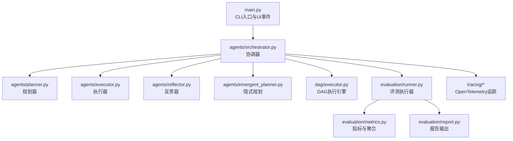
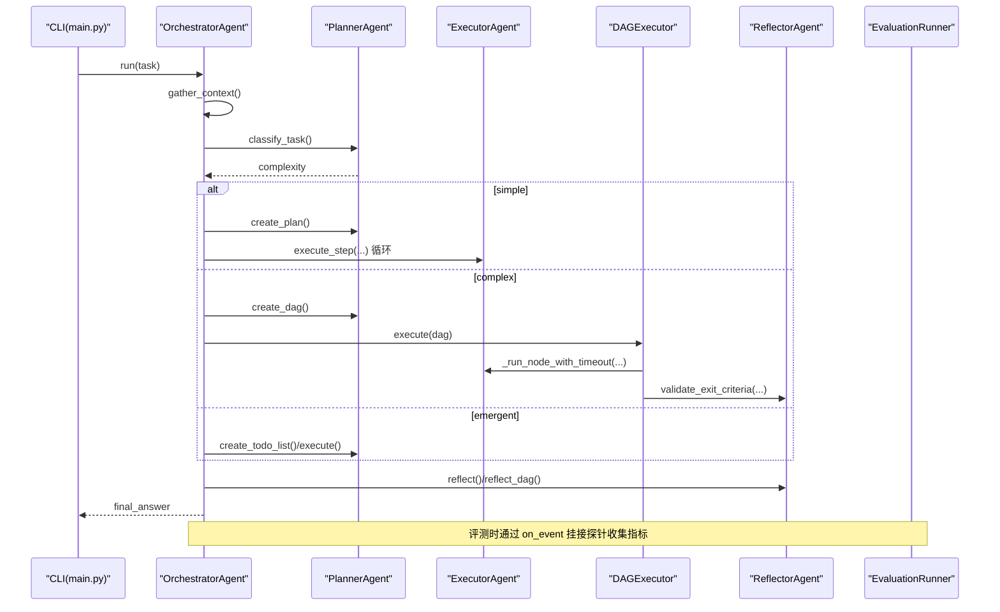
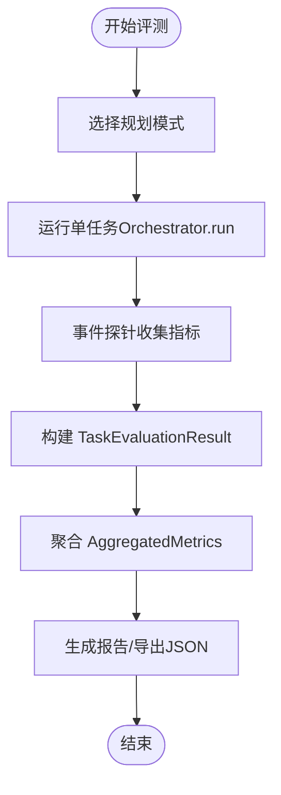
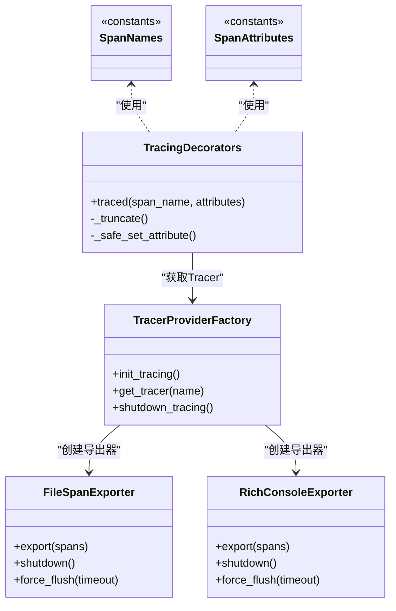
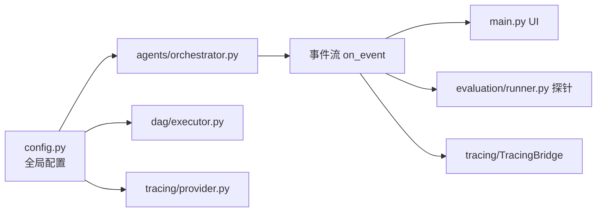

# 性能监控

<cite>
**本文引用的文件**
- [README.md](file://README.md)
- [main.py](file://main.py)
- [config.py](file://config.py)
- [orchestrator.py](file://agents/orchestrator.py)
- [executor.py](file://dag/executor.py)
- [benchmark.py](file://evaluation/benchmark.py)
- [runner.py](file://evaluation/runner.py)
- [metrics.py](file://evaluation/metrics.py)
- [report.py](file://evaluation/report.py)
- [provider.py](file://tracing/provider.py)
- [config.py](file://tracing/config.py)
- [decorators.py](file://tracing/decorators.py)
- [spans.py](file://tracing/spans.py)
- [exporters.py](file://tracing/exporters.py)
- [test_concurrent_execution.py](file://tests/test_concurrent_execution.py)
</cite>

## 目录
1. [简介](#简介)
2. [项目结构](#项目结构)
3. [核心组件](#核心组件)
4. [架构总览](#架构总览)
5. [详细组件分析](#详细组件分析)
6. [依赖分析](#依赖分析)
7. [性能考量](#性能考量)
8. [故障排查指南](#故障排查指南)
9. [结论](#结论)
10. [附录](#附录)

## 简介
本指南围绕 manus_demo 的性能监控与优化展开，聚焦以下目标：
- 指标采集：执行时间、资源使用（Token/迭代/并行度）、吞吐量（每任务耗时、每秒节点数）。
- 关键路径识别与瓶颈定位：通过事件流与追踪系统（OpenTelemetry）定位慢环节。
- 性能测试与对比：使用评测框架对比 v1/v2/v5 三种规划路径的性能表现。
- 基准与阈值：基于评测指标设定可量化的性能基线与告警阈值。
- 内存与并发：结合 DAG 并行执行与配置参数，分析资源占用与并发上限。
- 优化建议与回归测试：给出可操作的优化清单与自动化回归方案。

## 项目结构
manus_demo 采用“混合路由 + DAG 并行执行”的多智能体流水线，核心模块包括：
- 入口与 UI：main.py 提供交互与单任务模式，事件驱动 UI 更新。
- 协调器：agents/orchestrator.py 负责上下文收集、任务分类、路由到 v1/v2/v5 执行路径。
- 执行引擎：dag/executor.py 实现 Super-step 并行执行，支持条件分支、回滚与 Checkpoint。
- 评测框架：evaluation/* 提供基准任务、指标采集、聚合与报告。
- 追踪系统：tracing/* 基于 OpenTelemetry，提供装饰器、导出器与配置。

图表来源
- [main.py:395-516](file://main.py#L395-L516)
- [orchestrator.py:60-222](file://agents/orchestrator.py#L60-L222)
- [executor.py:62-130](file://dag/executor.py#L62-L130)
- [runner.py:440-570](file://evaluation/runner.py#L440-L570)
- [metrics.py:168-201](file://evaluation/metrics.py#L168-L201)
- [report.py:278-309](file://evaluation/report.py#L278-L309)
- [provider.py:45-118](file://tracing/provider.py#L45-L118)

章节来源
- [README.md:22-154](file://README.md#L22-L154)
- [main.py:1-516](file://main.py#L1-L516)
- [config.py:1-109](file://config.py#L1-L109)

## 核心组件
- 事件驱动 UI 与 Token 消耗追踪：main.py 提供事件回调与 Token 汇总渲染，便于观察端到端耗时与 LLM 使用情况。
- 协调器 Orchestrator：在 v4 混合路由下，根据任务复杂度选择 v1 扁平计划、v2 DAG 并行或 v5 隐式规划，并在每阶段发出丰富事件。
- DAG 执行引擎：实现 Super-step 并行、条件边评估、失败回滚与 Checkpoint，是性能瓶颈高发区。
- 评测框架：通过 EvaluationRunner 挂接事件探针，非侵入式采集规划、执行、效率与反思指标。
- 追踪系统：提供装饰器与导出器，支持控制台、文件与 OTLP 导出，统一语义化 Span 名称与属性键。

章节来源
- [main.py:184-390](file://main.py#L184-L390)
- [orchestrator.py:158-222](file://agents/orchestrator.py#L158-L222)
- [executor.py:110-264](file://dag/executor.py#L110-L264)
- [runner.py:55-130](file://evaluation/runner.py#L55-L130)
- [metrics.py:76-167](file://evaluation/metrics.py#L76-L167)
- [provider.py:45-118](file://tracing/provider.py#L45-L118)

## 架构总览
下图展示从任务输入到最终输出的关键路径与性能观测点：

图表来源
- [orchestrator.py:158-222](file://agents/orchestrator.py#L158-L222)
- [executor.py:110-264](file://dag/executor.py#L110-L264)
- [runner.py:462-524](file://evaluation/runner.py#L462-L524)

## 详细组件分析

### 事件驱动与性能观测（main.py）
- 事件类型覆盖：任务开始、阶段切换、计划/计划 DAG、Super-step、节点运行/完成/失败/回滚、条件评估、反思、Token 汇总、任务完成。
- UI 事件回调 on_event 将执行阶段可视化，便于定位卡顿与失败节点。
- Token 消耗汇总渲染：按调用维度与引擎维度统计，辅助 LLM 成本控制。

章节来源
- [main.py:184-390](file://main.py#L184-L390)

### 协调器（agents/orchestrator.py）
- 混合路由：两阶段分类（规则 + LLM），自动选择 v1/v2/v5。
- 事件发射：在规划、执行、反思各阶段发出丰富事件，供 UI 与评测探针使用。
- Token 追踪：重置并汇总 LLM 调用用量，输出到 UI。
- 多播桥接：可选启用 TracingBridge，将事件同时广播给追踪系统。

章节来源
- [orchestrator.py:107-114](file://agents/orchestrator.py#L107-L114)
- [orchestrator.py:173-222](file://agents/orchestrator.py#L173-L222)
- [orchestrator.py:590-600](file://agents/orchestrator.py#L590-L600)

### DAG 执行引擎（dag/executor.py）
- Super-step 并行：每轮找出 READY 节点，最多 MAX_PARALLEL_NODES 个并发执行，使用 asyncio.gather。
- 超时保护：单节点执行超时（NODE_EXECUTION_TIMEOUT）避免阻塞批次。
- 失败处理：FAILED 节点触发回滚与下游子树跳过，降低连锁失败影响。
- 条件边：按上游结果动态启用/跳过下游节点，减少无效执行。
- Checkpoint：每轮结束保存状态快照，利于调试与回放。

章节来源
- [executor.py:169-182](file://dag/executor.py#L169-L182)
- [executor.py:291-310](file://dag/executor.py#L291-L310)
- [executor.py:350-400](file://dag/executor.py#L350-L400)
- [executor.py:405-473](file://dag/executor.py#L405-L473)
- [executor.py:247-251](file://dag/executor.py#L247-L251)

### 评测框架（evaluation/*）
- EvaluationProbe：非侵入式事件探针，采集规划、执行、反思、失败、Token 等指标。
- EvaluationRunner：按规划模式（simple/complex/emergent）运行基准任务，聚合指标。
- metrics：定义 Planning/Execution/Efficiency/Reflection 指标与评分计算。
- report：生成对比表格、按模式详情与树形摘要，并可导出 JSON。

图表来源
- [runner.py:462-524](file://evaluation/runner.py#L462-L524)
- [runner.py:526-547](file://evaluation/runner.py#L526-L547)
- [metrics.py:168-201](file://evaluation/metrics.py#L168-L201)
- [report.py:278-309](file://evaluation/report.py#L278-L309)

章节来源
- [runner.py:55-130](file://evaluation/runner.py#L55-L130)
- [runner.py:462-524](file://evaluation/runner.py#L462-L524)
- [metrics.py:76-167](file://evaluation/metrics.py#L76-L167)
- [report.py:35-171](file://evaluation/report.py#L35-L171)

### 追踪系统（tracing/*）
- Provider：初始化 TracerProvider，支持 console/file/rich/otlp/phoenix 导出，采样率可控。
- Decorators：@traced 装饰器，自动记录耗时、异常与属性，支持同步/异步。
- Spans：统一的 Span 名称与属性键（如 task.complexity、node.status、tool.latency_ms 等）。
- Exporters：FileSpanExporter 与 RichConsoleExporter，便于离线分析与开发调试。

图表来源
- [provider.py:45-118](file://tracing/provider.py#L45-L118)
- [decorators.py:70-146](file://tracing/decorators.py#L70-L146)
- [spans.py:18-81](file://tracing/spans.py#L18-L81)
- [spans.py:86-185](file://tracing/spans.py#L86-L185)
- [exporters.py:28-98](file://tracing/exporters.py#L28-L98)
- [exporters.py:159-304](file://tracing/exporters.py#L159-L304)

章节来源
- [provider.py:45-118](file://tracing/provider.py#L45-L118)
- [config.py:14-79](file://tracing/config.py#L14-L79)
- [decorators.py:70-146](file://tracing/decorators.py#L70-L146)
- [spans.py:18-185](file://tracing/spans.py#L18-L185)
- [exporters.py:28-304](file://tracing/exporters.py#L28-L304)

## 依赖分析
- 配置中心：config.py 提供 LLM、执行限制、并发、超时、追踪等参数，贯穿 Orchestrator、DAG 执行器与评测框架。
- 事件耦合：Orchestrator 通过 on_event 与 UI、评测探针、追踪桥接器解耦通信。
- 追踪耦合：TracingBridge 与装饰器在不改变核心执行路径的前提下，统一埋点。

图表来源
- [config.py:1-109](file://config.py#L1-L109)
- [orchestrator.py:94-150](file://agents/orchestrator.py#L94-L150)
- [executor.py:87-104](file://dag/executor.py#L87-L104)
- [provider.py:45-118](file://tracing/provider.py#L45-L118)

章节来源
- [config.py:1-109](file://config.py#L1-L109)
- [orchestrator.py:94-150](file://agents/orchestrator.py#L94-L150)
- [executor.py:87-104](file://dag/executor.py#L87-L104)
- [provider.py:45-118](file://tracing/provider.py#L45-L118)

## 性能考量

### 执行时间与吞吐量
- 端到端耗时：评测框架通过事件探针记录规划、执行、反思阶段起止时间，计算总耗时与各阶段耗时。
- 吞吐量指标：每任务耗时、每轮 Super-step 节点数、每秒节点数（基于执行轮次与节点数）。
- ReAct 迭代效率：平均每次步骤的 ReAct 迭代次数越低，整体吞吐越高。

章节来源
- [runner.py:151-293](file://evaluation/runner.py#L151-L293)
- [metrics.py:97-123](file://evaluation/metrics.py#L97-L123)
- [metrics.py:297-320](file://evaluation/metrics.py#L297-L320)

### 资源使用与成本
- Token 消耗：评测框架汇总 per-call 与 per-engine 的 prompt/completion/total，结合效率评分衡量成本。
- LLM 调用重试：可配置重试次数与退避，需平衡稳定性与成本。
- 工具调用：工具执行耗时与成功率直接影响整体性能。

章节来源
- [runner.py:285-293](file://evaluation/runner.py#L285-L293)
- [metrics.py:125-139](file://evaluation/metrics.py#L125-L139)
- [config.py:82-86](file://config.py#L82-L86)

### 并发与内存
- 并发度：MAX_PARALLEL_NODES 控制每轮并行节点数，过高会导致资源争用，过低降低吞吐。
- 超时与回退：NODE_EXECUTION_TIMEOUT 防止单节点拖累批次；失败回滚与子树跳过减少无效执行。
- Checkpoint：MAX_CHECKPOINTS 控制内存中快照数量，避免内存膨胀。

章节来源
- [config.py:44-60](file://config.py#L44-L60)
- [executor.py:169-182](file://dag/executor.py#L169-L182)
- [executor.py:291-310](file://dag/executor.py#L291-L310)
- [executor.py:350-400](file://dag/executor.py#L350-L400)
- [executor.py:247-251](file://dag/executor.py#L247-L251)

### 关键路径与瓶颈定位
- 观察点：通过 UI 事件与评测指标定位“卡住的 Super-step”“频繁失败的节点”“高 Token 的 LLM 调用”。
- 追踪定位：使用 @traced 标注关键方法，结合 Span 名称与属性键快速定位慢环节。
- 并发压测：使用测试用例模拟高并发场景，验证并行上限与稳定性。

章节来源
- [main.py:184-390](file://main.py#L184-L390)
- [runner.py:151-293](file://evaluation/runner.py#L151-L293)
- [decorators.py:70-146](file://tracing/decorators.py#L70-L146)
- [test_concurrent_execution.py:15-72](file://tests/test_concurrent_execution.py#L15-L72)

## 故障排查指南

### 常见性能问题与定位
- 无就绪节点或 DAG 卡住：检查条件边评估与依赖满足情况，确认是否存在循环或阻塞。
- 节点超时：提高 NODE_EXECUTION_TIMEOUT 或优化工具执行逻辑。
- 失败连锁：关注失败回滚与子树跳过，避免无效重试导致的资源浪费。
- Token 爆涨：检查 prompt 长度、上下文压缩与工具调用频次。

章节来源
- [executor.py:131-142](file://dag/executor.py#L131-L142)
- [executor.py:405-473](file://dag/executor.py#L405-L473)
- [executor.py:291-310](file://dag/executor.py#L291-L310)
- [orchestrator.py:173-222](file://agents/orchestrator.py#L173-L222)

### 追踪与导出
- 启用追踪：设置 TRACING_ENABLED、TRACING_BACKEND、TRACING_SAMPLE_RATE 等。
- 导出方式：console/rich 适合开发调试；file/otlp/phoenix 适合生产与分析平台对接。
- 属性脱敏：敏感键（如 api_key、token）会被自动脱敏。

章节来源
- [config.py:102-109](file://config.py#L102-L109)
- [provider.py:165-196](file://tracing/provider.py#L165-L196)
- [exporters.py:28-98](file://tracing/exporters.py#L28-L98)
- [exporters.py:159-304](file://tracing/exporters.py#L159-L304)
- [decorators.py:42-68](file://tracing/decorators.py#L42-L68)

### 评测与回归
- 基准任务：覆盖简单/中等/困难任务，验证路由准确性与执行成功率。
- 指标对比：按模式比较成功率、Token、耗时、ReAct 迭代数与反思准确率。
- 回归测试：定期运行评测，对比关键指标变化，发现回归。

章节来源
- [benchmark.py:78-291](file://evaluation/benchmark.py#L78-L291)
- [runner.py:526-547](file://evaluation/runner.py#L526-L547)
- [metrics.py:393-475](file://evaluation/metrics.py#L393-L475)
- [report.py:278-309](file://evaluation/report.py#L278-L309)

## 结论
manus_demo 提供了完善的性能观测与评测基础设施：事件驱动 UI、非侵入式评测探针、统一的追踪语义与导出能力，以及可配置的执行参数。通过基准评测与追踪分析，可以系统性地识别瓶颈、设定阈值并制定优化策略，从而在不同规划模式间做出性能与成本的平衡决策。

## 附录

### 性能测试示例（对比 v1/v2/v5）
- 准备：准备一组覆盖简单/中等/困难的基准任务，确保 ground truth 明确。
- 运行：使用 EvaluationRunner 依次在 simple/complex/emergent 模式下运行，收集 TaskEvaluationResult。
- 分析：对比各模式的平均执行耗时、Token 消耗、步骤成功率、反思准确率与失败分布。
- 报告：使用 report.render_full_report 输出对比表与树形摘要，并导出 JSON 以便进一步分析。

章节来源
- [benchmark.py:78-291](file://evaluation/benchmark.py#L78-L291)
- [runner.py:462-524](file://evaluation/runner.py#L462-L524)
- [report.py:278-309](file://evaluation/report.py#L278-L309)

### 设置性能基准与监控阈值
- 基准：以中等难度任务在稳定环境下的评测结果为基准（如平均执行耗时、Token、成功率）。
- 阈值：为关键指标设定阈值（如执行耗时增长超过 20%、Token 增长超过 30%、失败率上升超过 5%）。
- 告警：结合评测报告与追踪导出，建立自动化告警与回归通知。

章节来源
- [metrics.py:259-391](file://evaluation/metrics.py#L259-L391)
- [report.py:35-171](file://evaluation/report.py#L35-L171)

### 内存使用监控与并发分析
- 内存快照：利用 Checkpoint 与 DAG 状态合并，监控节点结果累积与状态字典大小。
- 并发上限：通过高并发测试（如 20 个并行 Action）评估 MAX_PARALLEL_NODES 的最优值。
- 工具并发：控制 Shell/Code 执行并发数，避免系统资源饱和。

章节来源
- [executor.py:201-204](file://dag/executor.py#L201-L204)
- [executor.py:169-182](file://dag/executor.py#L169-L182)
- [test_concurrent_execution.py:15-72](file://tests/test_concurrent_execution.py#L15-L72)
- [config.py:71-77](file://config.py#L71-L77)

### 性能优化建议与最佳实践
- 优化规划路由：确保任务复杂度分类准确，避免不必要的 DAG 或隐式规划。
- 控制并行度：根据硬件资源调整 MAX_PARALLEL_NODES，避免过度并发导致抖动。
- 超时与重试：合理设置 NODE_EXECUTION_TIMEOUT 与 LLM_RETRY 参数，在稳定性与成本间平衡。
- 工具优化：减少工具调用次数与输出体积，使用缓存与增量处理。
- 追踪最小化：生产环境降低采样率或关闭敏感内容记录，减少追踪开销。

章节来源
- [config.py:23-86](file://config.py#L23-L86)
- [executor.py:291-310](file://dag/executor.py#L291-L310)
- [provider.py:79-86](file://tracing/provider.py#L79-L86)
- [decorators.py:30-68](file://tracing/decorators.py#L30-L68)