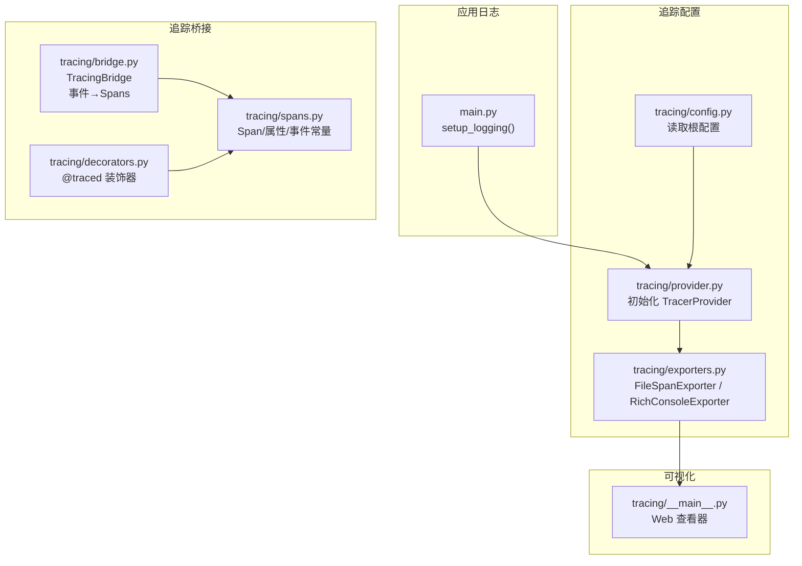
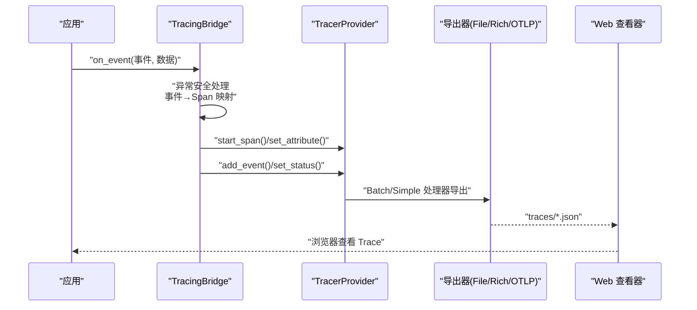
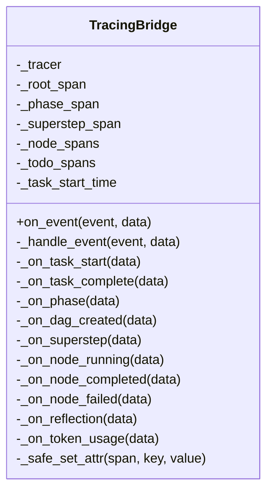
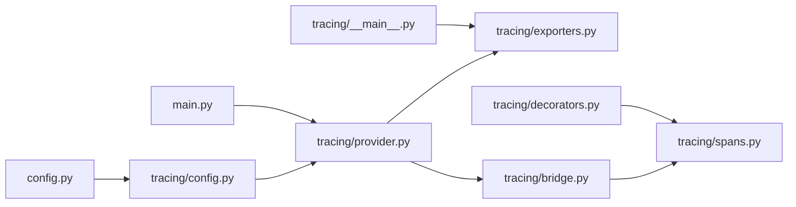

# 日志配置

<cite>
**本文引用的文件**
- [config.py](file://config.py)
- [main.py](file://main.py)
- [tracing/config.py](file://tracing/config.py)
- [tracing/provider.py](file://tracing/provider.py)
- [tracing/bridge.py](file://tracing/bridge.py)
- [tracing/exporters.py](file://tracing/exporters.py)
- [tracing/decorators.py](file://tracing/decorators.py)
- [tracing/spans.py](file://tracing/spans.py)
- [tracing/__main__.py](file://tracing/__main__.py)
- [tests/test_tracing.py](file://tests/test_tracing.py)
</cite>

## 目录
1. [简介](#简介)
2. [项目结构](#项目结构)
3. [核心组件](#核心组件)
4. [架构总览](#架构总览)
5. [详细组件分析](#详细组件分析)
6. [依赖分析](#依赖分析)
7. [性能考虑](#性能考虑)
8. [故障排查指南](#故障排查指南)
9. [结论](#结论)
10. [附录](#附录)

## 简介
本指南面向 manus_demo 项目的日志与追踪配置，重点覆盖以下方面：
- 如何配置和使用项目中的日志系统（日志级别、输出格式、第三方库噪声抑制）
- TracingBridge 的日志记录机制（异常安全、父子关系、调试信息收集）
- 不同环境下的日志级别调整示例（开发/生产/CI）
- 如何利用日志与追踪信息进行问题诊断与性能分析
- 日志轮转与清理策略的最佳实践

## 项目结构
与日志和追踪相关的核心模块如下：
- 应用日志：通过 RichHandler 配置，支持 INFO/DEBUG 级别与第三方库噪声抑制
- 追踪配置：集中于 tracing/config.py，从根 config.py 读取环境变量
- 追踪提供者：初始化 OpenTelemetry SDK，按后端选择导出器
- 追踪桥接：将事件系统转换为 OpenTelemetry Spans，保证异常安全
- 导出器：文件导出（JSON）、Rich 控制台树渲染
- 装饰器：统一的 @traced 装饰器，支持同步/异步，自动记录延迟与异常
- 常量：标准化 Span 名称、属性键、事件名
- 可视化：内置 Web 查看器，读取 traces 目录并提供浏览器界面

图表来源
- [main.py:396-412](file://main.py#L396-L412)
- [tracing/config.py:1-79](file://tracing/config.py#L1-L79)
- [tracing/provider.py:45-118](file://tracing/provider.py#L45-L118)
- [tracing/exporters.py:28-97](file://tracing/exporters.py#L28-L97)
- [tracing/bridge.py:38-116](file://tracing/bridge.py#L38-L116)
- [tracing/decorators.py:70-146](file://tracing/decorators.py#L70-L146)
- [tracing/spans.py:18-249](file://tracing/spans.py#L18-L249)
- [tracing/__main__.py:21-108](file://tracing/__main__.py#L21-L108)

章节来源
- [main.py:396-412](file://main.py#L396-L412)
- [tracing/config.py:1-79](file://tracing/config.py#L1-L79)
- [tracing/provider.py:45-118](file://tracing/provider.py#L45-L118)
- [tracing/exporters.py:28-97](file://tracing/exporters.py#L28-L97)
- [tracing/bridge.py:38-116](file://tracing/bridge.py#L38-L116)
- [tracing/decorators.py:70-146](file://tracing/decorators.py#L70-L146)
- [tracing/spans.py:18-249](file://tracing/spans.py#L18-L249)
- [tracing/__main__.py:21-108](file://tracing/__main__.py#L21-L108)

## 核心组件
- 应用日志配置
  - 通过 setup_logging 设置日志级别（INFO/DEBUG），使用 RichHandler 输出，抑制 httpx/openai/httpcore 的低优先级噪声
  - 适用于 CLI 交互与运行时事件展示
- 追踪配置
  - TRACING_ENABLED：总开关
  - TRACING_BACKEND：console/file/rich/otlp/phoenix
  - TRACING_ENDPOINT/SERVICE_NAME/SAMPLE_RATE：资源标识与采样
  - LOG_PROMPTS/MAX_ATTRIBUTE_LENGTH：隐私与长度控制
- 追踪提供者
  - 根据后端选择 SimpleSpanProcessor（console/rich）或 BatchSpanProcessor（file/otlp/phoenix）
  - 支持幂等初始化与优雅关闭
- 追踪桥接
  - 订阅事件系统，将事件映射为 Span，维护父子关系
  - 异常安全：on_event 内部 try/catch，避免影响主流程
- 导出器
  - FileSpanExporter：将每个 Trace 写入独立 JSON 文件，支持合并多批次
  - RichConsoleExporter：在终端渲染树形结构，便于开发调试
- 装饰器
  - @traced：自动记录延迟、异常、状态码，支持同步/异步
- 常量
  - 标准化 Span 名称、属性键、事件名，遵循 OpenTelemetry GenAI 语义约定
- 可视化
  - 内置 Web 查看器，读取 traces 目录，支持自动打开浏览器

章节来源
- [main.py:396-412](file://main.py#L396-L412)
- [tracing/config.py:17-43](file://tracing/config.py#L17-L43)
- [tracing/provider.py:45-118](file://tracing/provider.py#L45-L118)
- [tracing/bridge.py:117-134](file://tracing/bridge.py#L117-L134)
- [tracing/exporters.py:28-97](file://tracing/exporters.py#L28-L97)
- [tracing/decorators.py:70-146](file://tracing/decorators.py#L70-L146)
- [tracing/spans.py:18-249](file://tracing/spans.py#L18-L249)
- [tracing/__main__.py:21-108](file://tracing/__main__.py#L21-L108)

## 架构总览
下面的时序图展示了事件驱动的追踪流程：事件系统发出事件，TracingBridge 接收并创建/结束 Spans，随后由导出器写入文件或渲染到控制台。

图表来源
- [tracing/bridge.py:117-134](file://tracing/bridge.py#L117-L134)
- [tracing/provider.py:90-107](file://tracing/provider.py#L90-L107)
- [tracing/exporters.py:46-88](file://tracing/exporters.py#L46-L88)
- [tracing/__main__.py:94-103](file://tracing/__main__.py#L94-L103)

章节来源
- [tracing/bridge.py:117-134](file://tracing/bridge.py#L117-L134)
- [tracing/provider.py:90-107](file://tracing/provider.py#L90-L107)
- [tracing/exporters.py:46-88](file://tracing/exporters.py#L46-L88)
- [tracing/__main__.py:94-103](file://tracing/__main__.py#L94-L103)

## 详细组件分析

### 应用日志配置（RichHandler）
- 功能要点
  - INFO 级别：生产/演示场景，简洁输出
  - DEBUG 级别：verbose=True 时开启，显示内部调试信息
  - 抑制第三方库噪声：httpx/openai/httpcore 降为 WARNING
  - 输出格式：RichHandler，支持彩色、堆栈追踪、不显示文件路径
- 使用位置
  - CLI 启动时调用 setup_logging，配合控制台输出 UI
- 适用场景
  - 开发调试：verbose=True
  - 生产演示：默认 INFO，保持清晰输出

章节来源
- [main.py:396-412](file://main.py#L396-L412)

### 追踪配置（tracing/config.py）
- 配置项
  - ENABLED：总开关
  - BACKEND：console/file/rich/otlp/phoenix
  - ENDPOINT/SERVICE_NAME/SAMPLE_RATE：资源与采样
  - LOG_PROMPTS：是否记录完整 prompt（隐私保护）
  - MAX_ATTRIBUTE_LENGTH：属性最大长度（截断保护）
  - TRACE_OUTPUT_DIR：文件导出目录
  - 批处理参数：队列大小、批量大小、调度延迟
  - SENSITIVE_KEYS：敏感键集合（脱敏）
- 数据来源
  - 从根 config.py 读取环境变量，最终来源于 .env 或系统环境变量

章节来源
- [tracing/config.py:17-43](file://tracing/config.py#L17-L43)
- [tracing/config.py:53-67](file://tracing/config.py#L53-L67)
- [tracing/config.py:73-79](file://tracing/config.py#L73-L79)
- [config.py:102-109](file://config.py#L102-L109)

### 追踪提供者（tracing/provider.py）
- 初始化流程
  - Resource：service.name/service.version/deployment.environment
  - Sampler：全量或按采样率
  - Exporter：根据 BACKEND 选择
  - Processor：console/rich 使用 SimpleSpanProcessor；file/otlp 使用 BatchSpanProcessor
  - 幂等初始化与优雅关闭
- 关键行为
  - get_tracer：延迟初始化 TracerProvider
  - shutdown_tracing：刷新并关闭

章节来源
- [tracing/provider.py:45-118](file://tracing/provider.py#L45-L118)
- [tracing/provider.py:121-136](file://tracing/provider.py#L121-L136)
- [tracing/provider.py:139-151](file://tracing/provider.py#L139-L151)
- [tracing/provider.py:154-197](file://tracing/provider.py#L154-L197)

### 追踪桥接（tracing/bridge.py）
- 设计原则
  - 异常安全：on_event 内部 try/catch，避免影响主流程
  - 事件到 Span 的映射：通过事件分发表路由
  - 父子关系：维护根/阶段/超级步骤/节点/TODO 等层级
  - 时间统计：记录任务总耗时、节点/步骤耗时
- 关键事件
  - 任务生命周期：task_start/task_complete
  - 阶段：phase
  - 规划：plan/dag/todo_list
  - DAG 执行：superstep/node_running/node_completed/node_failed
  - 简单路径：step_start/step_complete/step_failed
  - 反思：reflection
  - 自适应：plan_adaptation/adaptive_planning
  - 记忆：memory_stored
  - v8 目标驱动：goal_anchor/goal_reflection/goal_reanchor/goal_drift_alert/stagnation_detected
- 辅助方法
  - _safe_set_attr：截断与敏感数据脱敏

图表来源
- [tracing/bridge.py:38-116](file://tracing/bridge.py#L38-L116)
- [tracing/bridge.py:149-196](file://tracing/bridge.py#L149-L196)
- [tracing/bridge.py:202-294](file://tracing/bridge.py#L202-L294)
- [tracing/bridge.py:425-535](file://tracing/bridge.py#L425-L535)
- [tracing/bridge.py:595-628](file://tracing/bridge.py#L595-L628)
- [tracing/bridge.py:647-672](file://tracing/bridge.py#L647-L672)
- [tracing/bridge.py:758-765](file://tracing/bridge.py#L758-L765)

章节来源
- [tracing/bridge.py:117-134](file://tracing/bridge.py#L117-L134)
- [tracing/bridge.py:149-196](file://tracing/bridge.py#L149-L196)
- [tracing/bridge.py:202-294](file://tracing/bridge.py#L202-L294)
- [tracing/bridge.py:425-535](file://tracing/bridge.py#L425-L535)
- [tracing/bridge.py:595-628](file://tracing/bridge.py#L595-L628)
- [tracing/bridge.py:647-672](file://tracing/bridge.py#L647-L672)
- [tracing/bridge.py:758-765](file://tracing/bridge.py#L758-L765)

### 导出器（tracing/exporters.py）
- FileSpanExporter
  - 输出目录：traces（相对路径）
  - 每个 Trace 写入独立 JSON 文件，包含 trace_id、导出时间、span_count、spans 列表
  - 支持合并多批次导出（同一 trace 多文件合并）
- RichConsoleExporter
  - 将 Trace 按树形结构渲染到终端，展示层级、耗时、状态与关键属性摘要
  - 缺失 rich 包时降级为 print

章节来源
- [tracing/exporters.py:28-97](file://tracing/exporters.py#L28-L97)
- [tracing/exporters.py:159-304](file://tracing/exporters.py#L159-L304)

### 装饰器（tracing/decorators.py）
- @traced
  - 支持同步/异步函数
  - 自动记录延迟（latency_ms）、异常、状态码
  - 属性安全设置：截断与敏感键脱敏
- 辅助函数
  - _truncate：按最大长度截断
  - _is_sensitive_key：敏感键检测
  - _safe_set_attribute：统一属性设置

章节来源
- [tracing/decorators.py:70-146](file://tracing/decorators.py#L70-L146)
- [tracing/decorators.py:30-68](file://tracing/decorators.py#L30-L68)

### 常量（tracing/spans.py）
- 标准化命名
  - SpanName：任务执行、上下文收集、规划、执行、DAG、简单路径、TODO、目标驱动、LLM/工具、反思、内存等
  - AttrKey：任务、GenAI、工具、DAG、节点、步骤、TODO、目标驱动、ReAct、反思、计划、记忆、知识、自适应、性能、错误等
  - EventName：请求开始/结束、重试、限流、工具调用、节点状态、计划生成、反思完成、上下文压缩等
- 图标映射：统一 Span 图标，便于终端可视化

章节来源
- [tracing/spans.py:18-249](file://tracing/spans.py#L18-L249)

### Web 查看器（tracing/__main__.py）
- 启动参数
  - --port/--dir/--host/--no-open
- 行为
  - 校验 traces 目录与 JSON 文件
  - 自动打开浏览器访问本地 Web 服务
  - 通过环境变量传递 traces 目录给服务器

章节来源
- [tracing/__main__.py:21-108](file://tracing/__main__.py#L21-L108)

## 依赖分析
- 组件耦合
  - tracing/provider.py 依赖 tracing/config.py 与 OpenTelemetry SDK
  - tracing/bridge.py 依赖 tracing/provider（get_tracer）、tracing/spans、tracing/config
  - tracing/exporters.py 依赖 OpenTelemetry SDK 与标准库
  - main.py 依赖 RichHandler 进行应用日志输出
- 外部依赖
  - OpenTelemetry SDK（trace、sdk.trace、sdk.resources、trace.export）
  - rich（控制台渲染）
  - uvicorn（Web 查看器）

图表来源
- [config.py:102-109](file://config.py#L102-L109)
- [tracing/config.py:11-11](file://tracing/config.py#L11-L11)
- [tracing/provider.py:23-36](file://tracing/provider.py#L23-L36)
- [tracing/exporters.py:22-25](file://tracing/exporters.py#L22-L25)
- [tracing/bridge.py:32-35](file://tracing/bridge.py#L32-L35)
- [tracing/spans.py:11-11](file://tracing/spans.py#L11-L11)
- [tracing/decorators.py:24-25](file://tracing/decorators.py#L24-L25)
- [main.py:28-43](file://main.py#L28-L43)
- [tracing/__main__.py:98-103](file://tracing/__main__.py#L98-L103)

章节来源
- [config.py:102-109](file://config.py#L102-L109)
- [tracing/config.py:11-11](file://tracing/config.py#L11-L11)
- [tracing/provider.py:23-36](file://tracing/provider.py#L23-L36)
- [tracing/exporters.py:22-25](file://tracing/exporters.py#L22-L25)
- [tracing/bridge.py:32-35](file://tracing/bridge.py#L32-L35)
- [tracing/spans.py:11-11](file://tracing/spans.py#L11-L11)
- [tracing/decorators.py:24-25](file://tracing/decorators.py#L24-L25)
- [main.py:28-43](file://main.py#L28-L43)
- [tracing/__main__.py:98-103](file://tracing/__main__.py#L98-L103)

## 性能考虑
- 采样率（SAMPLE_RATE）
  - 降低全量追踪带来的开销，建议在高负载场景下调小采样率
- 批处理（BatchSpanProcessor）
  - file/otlp 使用批处理提升吞吐，合理设置队列大小与导出间隔
- 属性长度与敏感数据
  - MAX_ATTRIBUTE_LENGTH 与敏感键脱敏减少数据体积与泄露风险
- 导出后端选择
  - console/rich：即时输出，适合开发调试
  - file：离线分析，注意磁盘空间与 JSON 文件数量
  - otlp/phoenix：远端可观测平台，需网络与后端支持
- 装饰器与事件处理
  - @traced 自动记录延迟与异常，有助于定位热点与错误

章节来源
- [tracing/config.py:33-43](file://tracing/config.py#L33-L43)
- [tracing/provider.py:98-105](file://tracing/provider.py#L98-L105)
- [tracing/decorators.py:30-68](file://tracing/decorators.py#L30-L68)
- [tracing/bridge.py:758-765](file://tracing/bridge.py#L758-L765)

## 故障排查指南
- 追踪未生效
  - 检查 TRACING_ENABLED 是否为 true
  - 确认 BACKEND 配置有效（console/file/rich/otlp/phoenix）
  - 若 OTLP 不可用，会降级为 console
- 导出失败
  - FileSpanExporter 出错会记录日志，检查输出目录权限与磁盘空间
  - RichConsoleExporter 缺少 rich 包会降级为 print
- 事件处理异常
  - TracingBridge.on_event 内部捕获异常并记录 debug 日志，不影响主流程
- Web 查看器
  - 确保 traces 目录存在且包含 JSON 文件
  - 未安装 uvicorn 会提示安装命令

章节来源
- [tracing/provider.py:185-196](file://tracing/provider.py#L185-L196)
- [tracing/exporters.py:86-88](file://tracing/exporters.py#L86-L88)
- [tracing/exporters.py:172-174](file://tracing/exporters.py#L172-L174)
- [tracing/bridge.py:127-133](file://tracing/bridge.py#L127-L133)
- [tracing/__main__.py:52-56](file://tracing/__main__.py#L52-L56)
- [tracing/__main__.py:89-92](file://tracing/__main__.py#L89-L92)

## 结论
本指南提供了 manus_demo 项目日志与追踪的完整配置与使用说明。通过应用日志（RichHandler）与追踪系统（OpenTelemetry）的协同，可以在不同环境下灵活调整日志级别与追踪策略，并借助文件导出与 Web 查看器进行问题诊断与性能分析。建议在开发环境开启 DEBUG 与 rich/console 后端，在生产环境根据负载选择合适的采样率与后端，并定期清理 traces 目录以控制存储成本。

## 附录

### 日志级别与输出格式配置示例
- 开发调试
  - 应用日志：verbose=True，启用 DEBUG 级别，RichHandler 输出
  - 追踪：TRACING_ENABLED=true，BACKEND=console/rich，便于即时查看
- 生产演示
  - 应用日志：默认 INFO，抑制第三方库噪声
  - 追踪：TRACING_ENABLED=false 或 BACKEND=file，结合 Web 查看器离线分析
- CI/自动化
  - 应用日志：INFO，确保输出稳定
  - 追踪：BACKEND=file，导出 JSON 供后续分析

章节来源
- [main.py:396-412](file://main.py#L396-L412)
- [tracing/config.py:17-43](file://tracing/config.py#L17-L43)
- [tracing/provider.py:93-105](file://tracing/provider.py#L93-L105)

### 日志轮转与清理策略最佳实践
- 文件导出（file）
  - 定期归档 traces 目录中的 JSON 文件至长期存储
  - 清理超过保留周期的历史文件，避免磁盘占满
  - 对超大文件进行拆分或压缩，降低 IO 压力
- 控制台导出（console/rich）
  - 仅用于开发调试，不建议在生产中长期保留
- OTLP/Phoenix
  - 交由远端可观测平台管理轮转与保留策略
- 属性与长度控制
  - 合理设置 MAX_ATTRIBUTE_LENGTH，避免属性过大
  - 使用敏感键脱敏，降低合规风险

章节来源
- [tracing/exporters.py:46-88](file://tracing/exporters.py#L46-L88)
- [tracing/config.py:41-43](file://tracing/config.py#L41-L43)
- [tracing/decorators.py:51-68](file://tracing/decorators.py#L51-L68)