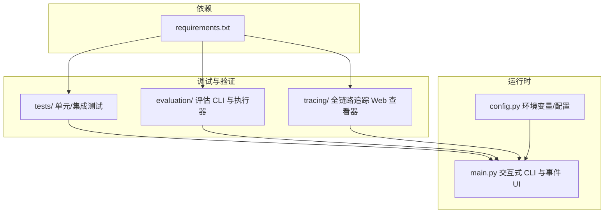
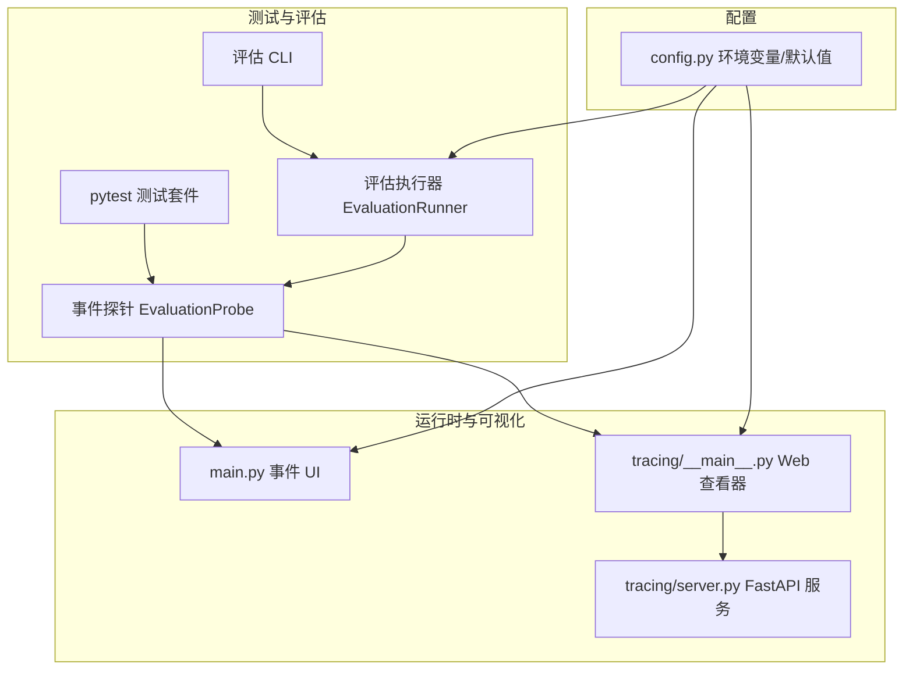
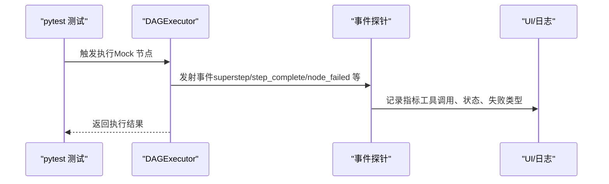
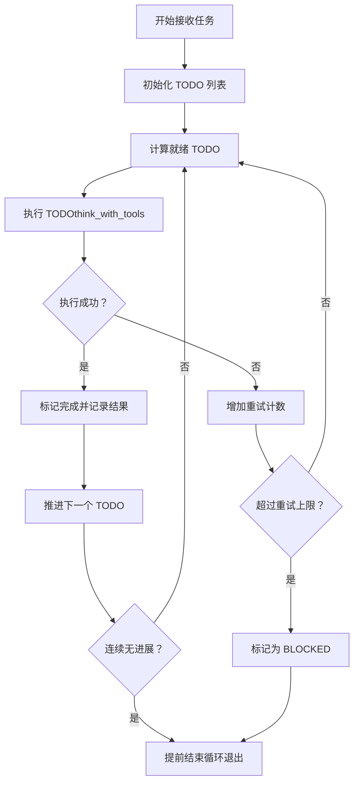
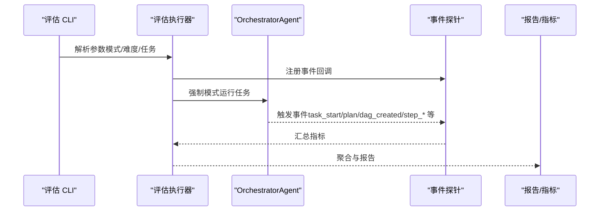
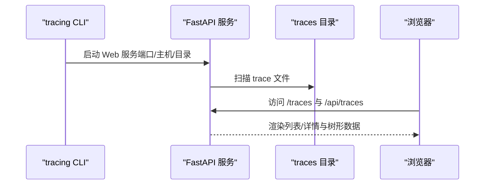
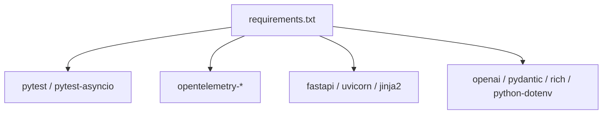

# 调试工具

<cite>
**本文引用的文件**
- [README.md](file://README.md)
- [requirements.txt](file://requirements.txt)
- [config.py](file://config.py)
- [main.py](file://main.py)
- [tests/test_dag_capabilities.py](file://tests/test_dag_capabilities.py)
- [tests/test_emergent_planning.py](file://tests/test_emergent_planning.py)
- [tests/test_evaluation.py](file://tests/test_evaluation.py)
- [evaluation/eval_cli.py](file://evaluation/eval_cli.py)
- [evaluation/runner.py](file://evaluation/runner.py)
- [tracing/__main__.py](file://tracing/__main__.py)
- [tracing/server.py](file://tracing/server.py)
</cite>

## 目录
1. [简介](#简介)
2. [项目结构](#项目结构)
3. [核心组件](#核心组件)
4. [架构总览](#架构总览)
5. [详细组件分析](#详细组件分析)
6. [依赖分析](#依赖分析)
7. [性能考虑](#性能考虑)
8. [故障排查指南](#故障排查指南)
9. [结论](#结论)
10. [附录](#附录)

## 简介
本指南面向 manus_demo 项目的调试与验证工作，覆盖单元测试、集成测试、评估与性能测试、全链路追踪可视化以及调试环境搭建与常用命令行选项。读者将学会：
- 如何使用 pytest 执行单元/集成测试，定位问题并验证修复；
- 如何使用评估 CLI 与评估执行器进行端到端功能与性能验证；
- 如何使用全链路追踪 Web 查看器观察执行过程；
- 如何通过命令行选项与环境变量进行调试与配置；
- 如何针对常见场景（DAG 并行、条件分支/回滚、隐式规划 TODO 列表、工具路由与自适应规划）进行断点调试与变量检查。

## 项目结构
manus_demo 采用“功能域+层次”的组织方式，核心调试相关模块如下：
- 测试与评估：tests/、evaluation/（含 CLI、执行器、指标与报告）
- 调试与可视化：tracing/（Web 查看器）、main.py（UI 事件与日志）
- 配置：config.py（环境变量与 .env 加载）
- 依赖：requirements.txt（测试与追踪依赖）

图表来源
- [README.md](file://README.md)
- [requirements.txt](file://requirements.txt)
- [config.py](file://config.py)
- [main.py](file://main.py)
- [evaluation/eval_cli.py](file://evaluation/eval_cli.py)
- [evaluation/runner.py](file://evaluation/runner.py)
- [tracing/__main__.py](file://tracing/__main__.py)
- [tracing/server.py](file://tracing/server.py)

章节来源
- [README.md](file://README.md)
- [requirements.txt](file://requirements.txt)

## 核心组件
- 测试框架与用例
  - pytest：执行单元测试与集成测试，覆盖 DAG 能力、隐式规划、评估模块等。
  - 测试文件路径参考：tests/test_dag_capabilities.py、tests/test_emergent_planning.py、tests/test_evaluation.py。
- 评估系统
  - 评估 CLI：命令行入口，支持模式过滤、难度过滤、输出 JSON、干跑等。
  - 评估执行器：通过事件探针收集指标，不侵入核心执行路径。
- 全链路追踪
  - 追踪 Web 查看器：FastAPI 提供的 Web 服务，展示 trace 列表与树形详情。
- 调试与日志
  - 交互式 CLI：丰富的事件 UI 与日志级别控制，便于观察执行阶段与状态变化。
  - 环境变量与 .env：统一配置入口，支持强制规划模式、超步并行、工具路由、自适应规划、追踪等。

章节来源
- [tests/test_dag_capabilities.py](file://tests/test_dag_capabilities.py)
- [tests/test_emergent_planning.py](file://tests/test_emergent_planning.py)
- [tests/test_evaluation.py](file://tests/test_evaluation.py)
- [evaluation/eval_cli.py](file://evaluation/eval_cli.py)
- [evaluation/runner.py](file://evaluation/runner.py)
- [tracing/__main__.py](file://tracing/__main__.py)
- [tracing/server.py](file://tracing/server.py)
- [main.py](file://main.py)
- [config.py](file://config.py)

## 架构总览
调试工具链围绕“事件驱动 + 配置驱动”的思路构建，测试与评估通过事件探针收集指标，CLI 与 Web 查看器提供可视化反馈。

图表来源
- [evaluation/eval_cli.py](file://evaluation/eval_cli.py)
- [evaluation/runner.py](file://evaluation/runner.py)
- [evaluation/runner.py](file://evaluation/runner.py)
- [main.py](file://main.py)
- [tracing/__main__.py](file://tracing/__main__.py)
- [tracing/server.py](file://tracing/server.py)
- [config.py](file://config.py)

## 详细组件分析

### 单元测试与断点调试
- 测试范围
  - DAG 能力：分层规划、并行执行、条件分支与回滚、动态变更、工具路由、自适应规划集成。
  - 隐式规划：TODO 列表管理、状态迁移、阻塞与重试、停滞检测、编译答案。
  - 评估模块：指标计算、聚合、报告渲染。
- 断点调试建议
  - 在 DAG 并行执行测试中，关注 DAGExecutor 的 super-step 并行调度与状态合并。
  - 在条件分支与回滚测试中，关注条件评估事件与回滚节点的触发。
  - 在隐式规划测试中，关注 TODO 列表初始化、执行失败重试与阻塞状态。
  - 在评估模块测试中，关注事件探针对工具错误的精确识别与中文覆盖率匹配。
- 常用断点位置（示例）
  - DAG 并行：DAGExecutor 执行循环与事件发射处。
  - 条件分支：条件评估事件与下游节点跳过逻辑。
  - 隐式规划：TODO 列表状态变更与停滞检测。
  - 评估指标：工具错误前缀匹配、中文分词与 n-gram 匹配。

图表来源
- [tests/test_dag_capabilities.py](file://tests/test_dag_capabilities.py)
- [evaluation/runner.py](file://evaluation/runner.py)
- [main.py](file://main.py)

章节来源
- [tests/test_dag_capabilities.py](file://tests/test_dag_capabilities.py)
- [tests/test_emergent_planning.py](file://tests/test_emergent_planning.py)
- [tests/test_evaluation.py](file://tests/test_evaluation.py)

### 隐式规划（v5）调试要点
- TODO 列表生命周期：初始化、就绪检测、完成与阻塞、重试上限。
- 循环控制：最大外层迭代、停滞检测、失败处理与最终合成答案。
- 事件观测：phase 事件、todo_start/todo_complete/todo_blocked、task_complete。

图表来源
- [tests/test_emergent_planning.py](file://tests/test_emergent_planning.py)
- [evaluation/runner.py](file://evaluation/runner.py)

章节来源
- [tests/test_emergent_planning.py](file://tests/test_emergent_planning.py)

### 评估 CLI 与评估执行器
- 评估 CLI 支持：
  - 指定模式（simple/complex/emergent）、难度（easy/medium/hard）、任务 ID、输出 JSON、干跑。
  - 详细日志模式（-v/--verbose）。
- 评估执行器：
  - 通过事件探针收集指标（分类、计划、执行、效率、反思）。
  - 支持强制规划模式覆盖，确保不同模式下的可比性。
  - 指标计算与聚合，生成综合报告。

图表来源
- [evaluation/eval_cli.py](file://evaluation/eval_cli.py)
- [evaluation/runner.py](file://evaluation/runner.py)

章节来源
- [evaluation/eval_cli.py](file://evaluation/eval_cli.py)
- [evaluation/runner.py](file://evaluation/runner.py)

### 全链路追踪 Web 查看器
- 启动方式：python -m tracing [--port PORT] [--dir DIR] [--host HOST] [--no-open]
- 功能：列出 traces 目录中的 JSON 文件，提供树形视图与 API 接口。
- 依赖：FastAPI、Jinja2、Uvicorn（可选安装）。

图表来源
- [tracing/__main__.py](file://tracing/__main__.py)
- [tracing/server.py](file://tracing/server.py)

章节来源
- [tracing/__main__.py](file://tracing/__main__.py)
- [tracing/server.py](file://tracing/server.py)

### 命令行调试选项与环境变量
- 命令行选项
  - -v/--verbose：启用详细日志（DEBUG 级别）。
  - 交互模式：python main.py；单任务模式：python main.py "任务描述"。
  - 强制规划模式：PLAN_MODE=simple|complex|emergent。
- 环境变量与 .env
  - LLM_BASE_URL/API_KEY/MODEL、MAX_CONTEXT_TOKENS、MAX_REACT_ITERATIONS、MAX_REPLAN_ATTEMPTS、MAX_PARALLEL_NODES、MEMORY_DIR、SHORT_TERM_WINDOW、SANDBOX_DIR、PLAN_MODE、EMERGENT_PLANNING_ENABLED、MAX_TODO_ITEMS、TODO_COMPRESSION_THRESHOLD、ADAPTIVE_PLANNING_ENABLED、ADAPT_PLAN_INTERVAL、ADAPT_PLAN_MIN_COMPLETED、TOOL_FAILURE_THRESHOLD、NODE_EXECUTION_TIMEOUT、MAX_CHECKPOINTS、TRACING_ENABLED、TRACING_BACKEND、TRACING_ENDPOINT、TRACING_SERVICE_NAME、TRACING_SAMPLE_RATE、TRACING_LOG_PROMPTS、TRACING_MAX_ATTRIBUTE_LENGTH 等。

章节来源
- [main.py](file://main.py)
- [config.py](file://config.py)
- [README.md](file://README.md)

## 依赖分析
- 测试依赖：pytest、pytest-asyncio（可选）。
- 追踪依赖：opentelemetry-*、fastapi、uvicorn、jinja2。
- 运行时依赖：openai、pydantic、rich、python-dotenv。

图表来源
- [requirements.txt](file://requirements.txt)

章节来源
- [requirements.txt](file://requirements.txt)

## 性能考虑
- 并行度与吞吐：通过 MAX_PARALLEL_NODES 控制每轮 Super-step 并行节点数，结合 DAG 的拓扑就绪检测提升吞吐。
- 工具路由与自适应：TOOL_FAILURE_THRESHOLD 与 ADAPTIVE_PLANNING_ENABLED 可降低失败重试成本，提高稳定性。
- 追踪开销：TRACING_ENABLED 与 TRACING_SAMPLE_RATE 影响性能与存储，建议在调试时开启，稳定后关闭或降低采样率。
- 日志级别：-v/--verbose 会输出大量事件与堆栈，仅在需要时开启。

## 故障排查指南
- 测试失败定位
  - 使用 pytest -v -k "关键词" 精确执行相关用例，结合断点查看事件序列与状态变化。
  - 关注工具错误前缀匹配（如 Error:/error:/ERROR:/Exception:/Traceback）与中文覆盖率匹配逻辑。
- 评估异常
  - 检查评估 CLI 参数（模式/难度/任务 ID）是否正确，确认 dry-run 与输出 JSON 的行为。
  - 核对评估执行器的事件回调是否被正确注册，确保指标采集完整。
- 追踪问题
  - 确认 traces 目录存在且包含 JSON 文件；启动 tracing 时指定正确的 --dir。
  - 检查 Web 查看器端口占用与主机绑定，必要时使用 --no-open 与手动打开。
- 配置问题
  - 检查 .env 是否存在且变量覆盖顺序（系统环境变量优先于 .env）。
  - 核对 LLM API 配置与模型名称，确保可用性。

章节来源
- [tests/test_evaluation.py](file://tests/test_evaluation.py)
- [evaluation/eval_cli.py](file://evaluation/eval_cli.py)
- [tracing/__main__.py](file://tracing/__main__.py)
- [tracing/server.py](file://tracing/server.py)
- [config.py](file://config.py)

## 结论
manus_demo 提供了完善的调试与验证工具链：pytest 测试用于快速定位与回归验证，评估 CLI/执行器用于端到端功能与性能评估，全链路追踪 Web 查看器用于可视化诊断。配合命令行选项与环境变量，可在不同场景下灵活调试与优化。

## 附录
- 常见调试场景操作清单
  - DAG 并行与状态机：执行 tests/test_dag_capabilities.py 中的并行与状态机相关用例，观察事件序列与状态转移。
  - 条件分支与回滚：执行条件分支与回滚用例，检查条件评估与下游跳过逻辑。
  - 隐式规划 TODO 列表：执行隐式规划测试，观察初始化、就绪、阻塞与重试。
  - 评估验证：使用 evaluation/eval_cli.py 指定模式/难度/任务，导出 JSON 并核对指标。
  - 追踪可视化：运行 tracing/__main__.py，访问 Web 查看器，核对树形结构与关键事件。
  - 强制规划模式：设置 PLAN_MODE=simple|complex|emergent，观察不同模式下的计划与执行差异。
  - 详细日志：使用 -v/--verbose，结合断点查看事件细节与错误堆栈。