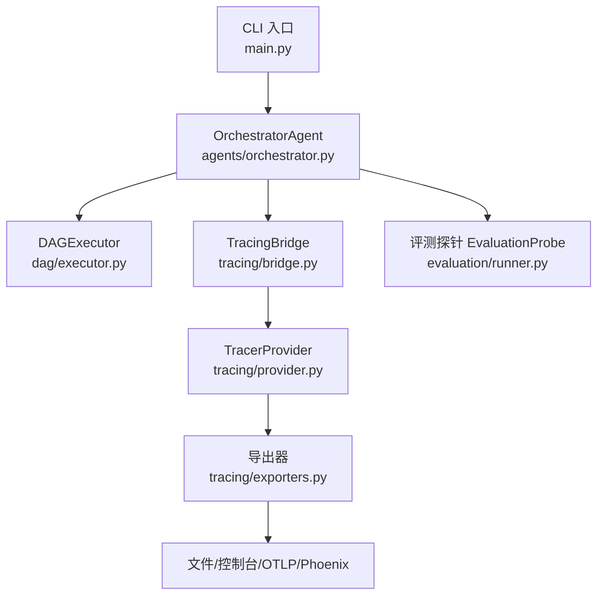
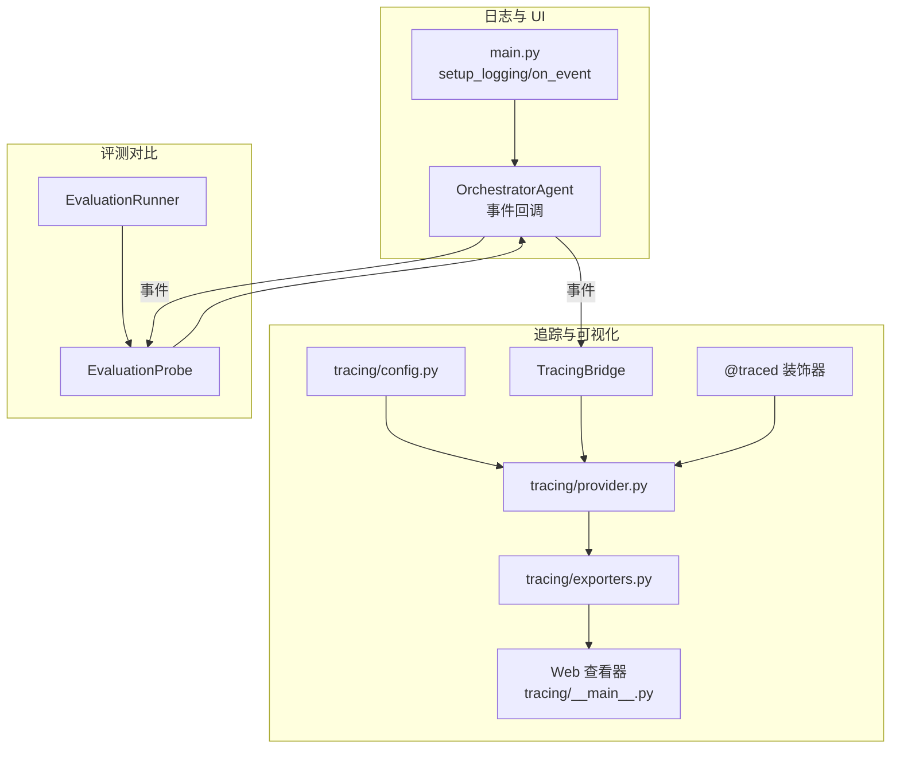
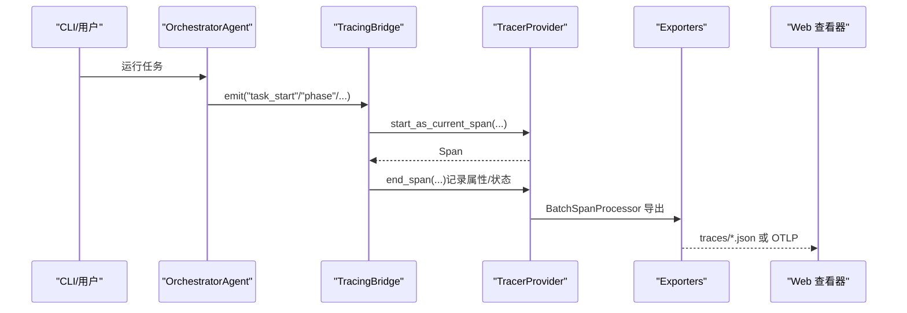
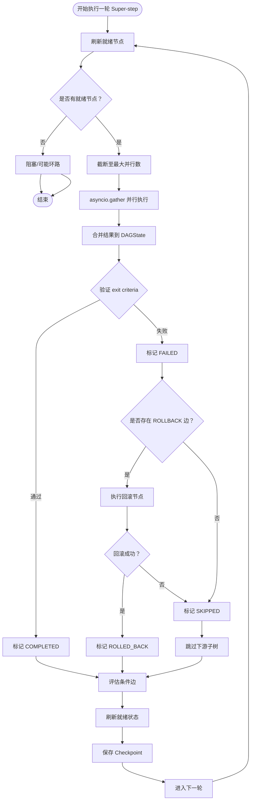
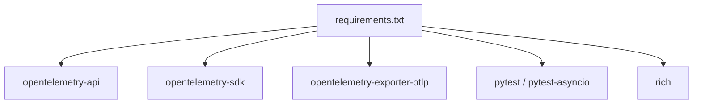

# 调试技巧

<cite>
**本文引用的文件**
- [README.md](file://README.md)
- [config.py](file://config.py)
- [main.py](file://main.py)
- [tracing/config.py](file://tracing/config.py)
- [tracing/provider.py](file://tracing/provider.py)
- [tracing/decorators.py](file://tracing/decorators.py)
- [tracing/exporters.py](file://tracing/exporters.py)
- [tracing/spans.py](file://tracing/spans.py)
- [tracing/__main__.py](file://tracing/__main__.py)
- [tests/test_tracing.py](file://tests/test_tracing.py)
- [dag/executor.py](file://dag/executor.py)
- [agents/orchestrator.py](file://agents/orchestrator.py)
- [requirements.txt](file://requirements.txt)
- [sxw_aicoding/docs/tracing-guide.md](file://sxw_aicoding/docs/tracing-guide.md)
- [sxw_aicoding/docs/tracing-design.md](file://sxw_aicoding/docs/tracing-design.md)
- [sxw_aicoding/docs/evaluation-guide.md](file://sxw_aicoding/docs/evaluation-guide.md)
</cite>

## 目录
1. [简介](#简介)
2. [项目结构](#项目结构)
3. [核心组件](#核心组件)
4. [架构总览](#架构总览)
5. [详细组件分析](#详细组件分析)
6. [依赖分析](#依赖分析)
7. [性能考量](#性能考量)
8. [故障排除指南](#故障排除指南)
9. [结论](#结论)
10. [附录](#附录)

## 简介
本指南围绕 manus_demo 的调试与可观测性，系统讲解如何使用内置的日志、追踪（Tracing）、Web 可视化与评测模块进行问题定位、性能分析与优化。重点覆盖：
- 日志配置与输出控制
- 全链路追踪（OpenTelemetry）的启用、导出与可视化
- DAG 执行过程的状态变化与节点依赖分析
- 性能瓶颈识别与优化方法
- 使用测试工具进行问题重现与验证
- 调试环境搭建与配置

## 项目结构
manus_demo 采用“事件驱动 + 多智能体 + DAG 执行”的架构，调试相关的关键位置包括：
- CLI 入口与日志：main.py
- 配置中心：config.py
- 追踪模块：tracing/*（提供 OpenTelemetry 集成、导出器、装饰器、Web 查看器）
- DAG 执行器：dag/executor.py（核心执行循环、状态机、条件边、失败处理、自适应规划）
- 评测模块：evaluation/*（事件驱动的评测探针，用于对比不同规划范式）

图表来源
- [main.py:395-516](file://main.py#L395-L516)
- [agents/orchestrator.py:60-200](file://agents/orchestrator.py#L60-L200)
- [dag/executor.py:62-130](file://dag/executor.py#L62-L130)
- [tracing/provider.py:45-120](file://tracing/provider.py#L45-L120)
- [tracing/exporters.py:28-100](file://tracing/exporters.py#L28-L100)

章节来源
- [README.md:156-292](file://README.md#L156-L292)
- [main.py:395-516](file://main.py#L395-L516)
- [agents/orchestrator.py:60-200](file://agents/orchestrator.py#L60-L200)
- [dag/executor.py:62-130](file://dag/executor.py#L62-L130)
- [tracing/provider.py:45-120](file://tracing/provider.py#L45-L120)
- [tracing/exporters.py:28-100](file://tracing/exporters.py#L28-L100)

## 核心组件
- 日志系统
  - 使用 RichHandler 输出结构化日志，支持 -v/--verbose 切换至 DEBUG 级别，抑制第三方噪声。
  - 位置：main.py 的 setup_logging 与事件回调 on_event。
- 配置中心
  - 从 .env 或环境变量读取，包含 LLM、DAG、工具、追踪等配置项。
  - 位置：config.py。
- 追踪系统（v7）
  - 基于 OpenTelemetry，提供事件桥接（TracingBridge）与方法级埋点（@traced），支持 Console/File/Rich/OTLP/Phoenix 后端。
  - 位置：tracing/*。
- DAG 执行器
  - 超步（super-step）并行执行，状态机驱动，条件边评估，失败回滚与子树跳过，自适应规划。
  - 位置：dag/executor.py。
- 评测模块
  - 通过 EvaluationProbe 订阅事件，产出结构化评测报告，支持多模式对比。
  - 位置：evaluation/*。

章节来源
- [main.py:396-413](file://main.py#L396-L413)
- [config.py:1-109](file://config.py#L1-L109)
- [tracing/config.py:1-79](file://tracing/config.py#L1-L79)
- [tracing/decorators.py:70-146](file://tracing/decorators.py#L70-L146)
- [dag/executor.py:62-130](file://dag/executor.py#L62-L130)
- [sxw_aicoding/docs/evaluation-guide.md:101-150](file://sxw_aicoding/docs/evaluation-guide.md#L101-L150)

## 架构总览
下图展示了调试相关的三条主线：日志与 UI、追踪与可视化、评测对比。

图表来源
- [main.py:396-413](file://main.py#L396-L413)
- [agents/orchestrator.py:103-114](file://agents/orchestrator.py#L103-L114)
- [tracing/config.py:1-79](file://tracing/config.py#L1-L79)
- [tracing/provider.py:45-120](file://tracing/provider.py#L45-L120)
- [tracing/exporters.py:28-100](file://tracing/exporters.py#L28-L100)
- [tracing/__main__.py](file://tracing/__main__.py)
- [sxw_aicoding/docs/evaluation-guide.md:101-150](file://sxw_aicoding/docs/evaluation-guide.md#L101-L150)

## 详细组件分析

### 日志与 UI 调试
- 启用调试日志
  - 使用 -v/--verbose 切换到 DEBUG 级别，显示内部事件与详细信息。
  - 位置：main.py 的 main()/setup_logging。
- UI 事件渲染
  - on_event 将任务生命周期、DAG 执行、反思等事件渲染为 Rich 面板与表格，便于快速定位问题阶段。
  - 位置：main.py 的 on_event。
- 建议实践
  - 交互模式下逐步观察 phase 与 DAG 树变化，结合 -v 定位异常节点。
  - 单任务模式下配合 Tracing 的 file/rich 后端，形成“事件 + 追踪 + UI”三位一体的诊断视角。

章节来源
- [main.py:396-413](file://main.py#L396-L413)
- [main.py:184-390](file://main.py#L184-L390)

### 追踪系统（OpenTelemetry 集成）
- 启用与配置
  - TRACING_ENABLED=true/false 控制开关；TRACING_BACKEND 选择 console/file/rich/otlp/phoenix；TRACING_SAMPLE_RATE 控制采样；TRACING_LOG_PROMPTS 控制是否记录 prompt。
  - 位置：config.py 与 tracing/config.py。
- 初始化与导出
  - provider.py 负责创建 TracerProvider、Sampler、Processor 与 Exporter；exporters.py 提供 File/Rich 导出器。
  - 位置：tracing/provider.py、tracing/exporters.py。
- 事件桥接
  - TracingBridge 将 OrchestratorAgent 的事件映射为 Span 树，自动继承父子关系。
  - 位置：agents/orchestrator.py（多播桥接）、tracing/bridge.py（事件映射）。
- 方法级埋点
  - @traced 装饰器自动记录耗时、异常、静态属性；对敏感键名自动脱敏与截断。
  - 位置：tracing/decorators.py。
- Web 查看器
  - tracing/__main__.py 提供 traces 目录浏览与树形可视化，支持暗色主题与属性面板。
  - 位置：tracing/__main__.py。
- 常见后端选择
  - 开发：TRACING_BACKEND=file 或 rich；生产：TRACING_BACKEND=otlp/phoenix；采样率建议 0.1。
  - 位置：tracing-guide.md。

图表来源
- [agents/orchestrator.py:103-114](file://agents/orchestrator.py#L103-L114)
- [tracing/provider.py:45-120](file://tracing/provider.py#L45-L120)
- [tracing/exporters.py:28-100](file://tracing/exporters.py#L28-L100)
- [tracing/__main__.py](file://tracing/__main__.py)

章节来源
- [config.py:98-109](file://config.py#L98-L109)
- [tracing/config.py:1-79](file://tracing/config.py#L1-L79)
- [tracing/provider.py:45-120](file://tracing/provider.py#L45-L120)
- [tracing/decorators.py:70-146](file://tracing/decorators.py#L70-L146)
- [tracing/exporters.py:28-100](file://tracing/exporters.py#L28-L100)
- [tracing/__main__.py](file://tracing/__main__.py)
- [sxw_aicoding/docs/tracing-guide.md:195-230](file://sxw_aicoding/docs/tracing-guide.md#L195-L230)

### DAG 执行与状态机调试
- 关键流程
  - refresh_ready_states → get_ready_nodes → 并行执行（asyncio.gather）→ 合并结果 → 验证 exit criteria → 失败处理（回滚/跳过子树）→ 条件边评估 → Checkpoint。
  - 位置：dag/executor.py 的 execute。
- 状态机与事件
  - NodeStateMachine 强制合法转移；DAGExecutor 将状态变化转发为 UI 事件（node_transition）。
  - 位置：dag/executor.py。
- 失败与回滚
  - 检测 FAILED->PENDING 循环尝试；执行 ROLLBACK 边；标记下游子树 SKIPPED。
  - 位置：dag/executor.py 的 _handle_failure。
- 条件边
  - 智能匹配策略（CJK 子串 vs 拉丁词边界），避免重复评估。
  - 位置：dag/executor.py 的 _process_conditions/_evaluate_condition。
- 自适应规划（v3）
  - 按间隔与完成数触发，应用变更并刷新 DAG 视图。
  - 位置：dag/executor.py 的 _should_adapt/_adapt_plan。

图表来源
- [dag/executor.py:110-264](file://dag/executor.py#L110-L264)
- [dag/executor.py:350-448](file://dag/executor.py#L350-L448)
- [dag/executor.py:405-473](file://dag/executor.py#L405-L473)

章节来源
- [dag/executor.py:110-264](file://dag/executor.py#L110-L264)
- [dag/executor.py:350-448](file://dag/executor.py#L350-L448)
- [dag/executor.py:405-473](file://dag/executor.py#L405-L473)

### 评测模块与问题重现
- 设计思想
  - 零侵入：通过事件探针被动收集数据；强制路由：临时覆写 PLAN_MODE 控制变量。
  - 位置：sxw_aicoding/docs/evaluation-guide.md。
- 使用方法
  - 通过命令行选择模式与难度，输出 Rich 报告与 JSON；也可仅 dry-run 查看任务定义。
  - 位置：evaluation/eval_cli.py 与 runner.py。
- 与调试联动
  - 在相同任务上对比 simple/complex/emergent 三种模式，快速定位规划/执行/反思环节的差异。
  - 位置：evaluation/runner.py（强制模式）。

章节来源
- [sxw_aicoding/docs/evaluation-guide.md:101-150](file://sxw_aicoding/docs/evaluation-guide.md#L101-L150)
- [sxw_aicoding/docs/evaluation-guide.md:319-380](file://sxw_aicoding/docs/evaluation-guide.md#L319-L380)

## 依赖分析
- OpenTelemetry 依赖
  - requirements.txt 明确列出 opentelemetry-api/sdk/exporter-otlp。
  - 位置：requirements.txt。
- 追踪后端
  - Console/File/Rich 无需额外依赖；OTLP/Phoenix 需要相应导出器。
  - 位置：tracing/provider.py、tracing/exporters.py。
- 评测依赖
  - pytest/pytest-asyncio 用于单元测试；Rich 用于报告渲染。
  - 位置：requirements.txt、evaluation/report.py。

图表来源
- [requirements.txt:1-19](file://requirements.txt#L1-L19)

章节来源
- [requirements.txt:1-19](file://requirements.txt#L1-L19)
- [tracing/provider.py:154-197](file://tracing/provider.py#L154-L197)
- [tracing/exporters.py:28-100](file://tracing/exporters.py#L28-L100)

## 性能考量
- Tracing 性能
  - TRACING_ENABLED=false 时零开销；开启时主要开销在 Span 创建与异步导出；采样率可显著降低开销。
  - 位置：tracing-guide.md 的“性能影响”。
- DAG 并行与超步
  - MAX_PARALLEL_NODES 控制每轮并行节点数；NODE_EXECUTION_TIMEOUT 防止单节点卡死。
  - 位置：config.py、dag/executor.py。
- Token 与 LLM 调用
  - TOKEN_TRACKING_ENABLED 可开启 Token 追踪；结合 Tracing 的 GenAI 属性进行统计分析。
  - 位置：config.py、tracing/spans.py。

章节来源
- [sxw_aicoding/docs/tracing-guide.md:661-694](file://sxw_aicoding/docs/tracing-guide.md#L661-L694)
- [config.py:44-59](file://config.py#L44-L59)
- [dag/executor.py:291-310](file://dag/executor.py#L291-L310)
- [tracing/spans.py:86-185](file://tracing/spans.py#L86-L185)

## 故障排除指南
- 启动与环境
  - 确认 .env/.env.example 已配置 LLM API；安装依赖（含 OTel 与可选 rich/fastapi）。
  - 位置：README.md 的“Quick Start”与“requirements.txt”。
- 追踪后端问题
  - OTLP/Phoenix 依赖缺失：安装 opentelemetry-exporter-otlp；Phoenix 需要 arize-phoenix 或 OTLP 兼容后端。
  - 位置：requirements.txt、tracing/provider.py。
- 追踪数据不可见
  - file 后端：确认 traces/ 目录存在且有写权限；BatchSpanProcessor 可能在程序退出前未导出，需正常退出或手动调用 shutdown_tracing。
  - rich 后端：安装 rich；OTLP/Phoenix：确认端点可达。
  - 位置：tracing-guide.md、tracing/exporters.py、tracing/provider.py。
- DAG 执行卡住
  - 检查是否有 FAILED 节点阻塞；查看 UI DAG 树与日志；结合 Tracing 的 DAG Super-step 与 node spans 定位。
  - 位置：dag/executor.py 的 stuck 检测与日志。
- 事件桥接异常
  - TracingBridge 对异常进行隔离，不影响主流程；若 UI 事件缺失，检查多播桥接是否正确初始化。
  - 位置：agents/orchestrator.py 的多播桥接与 tests/test_tracing.py 的异常安全测试。
- 评测运行失败
  - 确认 LLM API Key 配置；使用 --dry-run 验证任务定义；仅运行单元测试验证探针逻辑。
  - 位置：sxw_aicoding/docs/evaluation-guide.md。

章节来源
- [README.md:156-292](file://README.md#L156-L292)
- [requirements.txt:1-19](file://requirements.txt#L1-L19)
- [tracing/provider.py:154-197](file://tracing/provider.py#L154-L197)
- [tracing/exporters.py:28-100](file://tracing/exporters.py#L28-L100)
- [dag/executor.py:134-141](file://dag/executor.py#L134-L141)
- [agents/orchestrator.py:103-114](file://agents/orchestrator.py#L103-L114)
- [tests/test_tracing.py:264-281](file://tests/test_tracing.py#L264-L281)
- [sxw_aicoding/docs/evaluation-guide.md:319-380](file://sxw_aicoding/docs/evaluation-guide.md#L319-L380)

## 结论
通过“日志 + 追踪 + 评测”的组合拳，manus_demo 能够在复杂 DAG 执行与多智能体协作场景下实现高可观察性与高效调试。建议在开发阶段使用 file/rich 后端与 UI 事件，上线前切换到 OTLP/Phoenix 并设置采样率，配合评测模块进行跨模式对比与回归验证。

## 附录
- 快速调试清单
  - 开发：TRACING_ENABLED=true TRACING_BACKEND=rich 或 file；-v 启用 DEBUG。
  - 生产：TRACING_ENABLED=true TRACING_BACKEND=otlp/phoenix；TRACING_SAMPLE_RATE=0.1；TRACING_LOG_PROMPTS=false。
  - DAG：调整 MAX_PARALLEL_NODES 与 NODE_EXECUTION_TIMEOUT；关注 FAILED/ROLLBACK/SKIPPED 状态。
  - 评测：--modes/--difficulty/--tasks 组合运行；--output 导出 JSON；--dry-run 验证任务定义。
- 参考文档
  - tracing-guide.md 与 tracing-design.md 提供完整配置、后端与隐私策略说明。
  - evaluation-guide.md 提供评测模块的命令行与报告说明。

章节来源
- [sxw_aicoding/docs/tracing-guide.md:195-230](file://sxw_aicoding/docs/tracing-guide.md#L195-L230)
- [sxw_aicoding/docs/tracing-guide.md:696-788](file://sxw_aicoding/docs/tracing-guide.md#L696-L788)
- [sxw_aicoding/docs/evaluation-guide.md:404-420](file://sxw_aicoding/docs/evaluation-guide.md#L404-L420)
- [sxw_aicoding/docs/evaluation-guide.md:421-480](file://sxw_aicoding/docs/evaluation-guide.md#L421-L480)