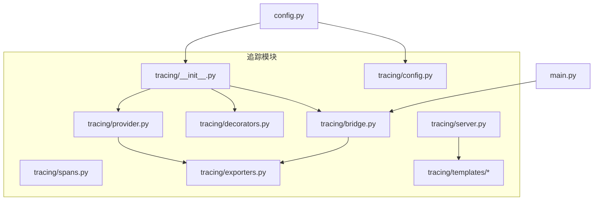
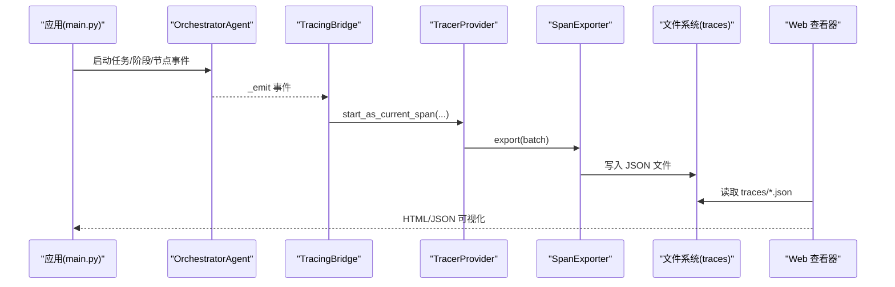
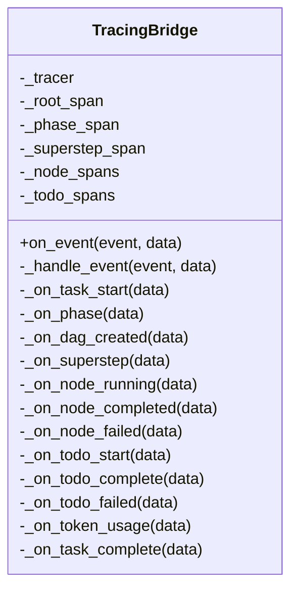
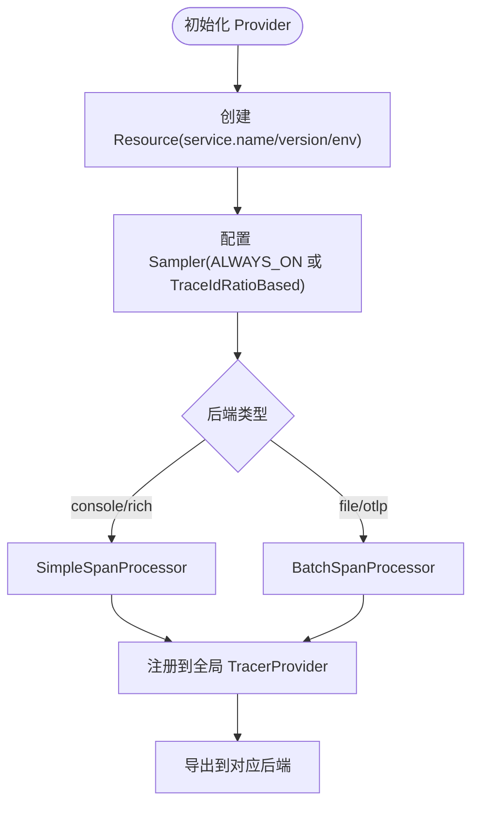
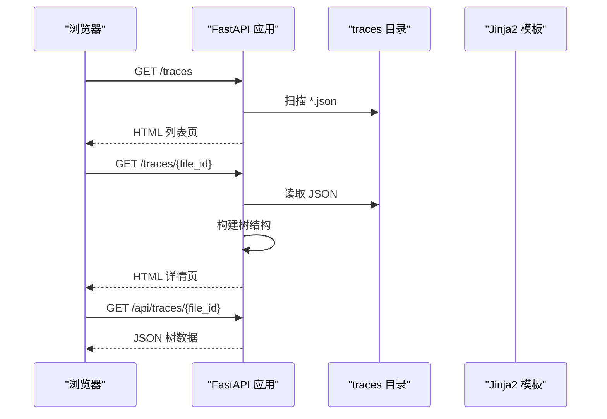
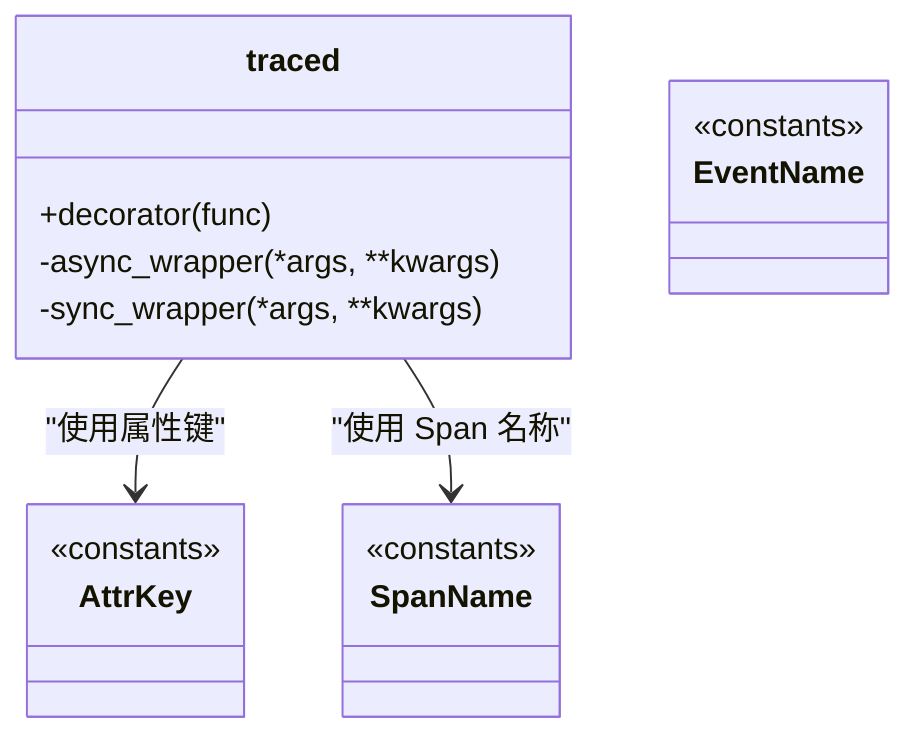
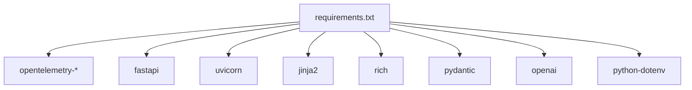

# 追踪数据分析

<cite>
**本文引用的文件**
- [tracing/__init__.py](file://tracing/__init__.py)
- [tracing/config.py](file://tracing/config.py)
- [tracing/provider.py](file://tracing/provider.py)
- [tracing/decorators.py](file://tracing/decorators.py)
- [tracing/spans.py](file://tracing/spans.py)
- [tracing/bridge.py](file://tracing/bridge.py)
- [tracing/exporters.py](file://tracing/exporters.py)
- [tracing/server.py](file://tracing/server.py)
- [tracing/templates/base.html](file://tracing/templates/base.html)
- [tracing/templates/trace_detail.html](file://tracing/templates/trace_detail.html)
- [config.py](file://config.py)
- [main.py](file://main.py)
- [tests/test_tracing.py](file://tests/test_tracing.py)
- [requirements.txt](file://requirements.txt)
</cite>

## 目录
1. [简介](#简介)
2. [项目结构](#项目结构)
3. [核心组件](#核心组件)
4. [架构总览](#架构总览)
5. [详细组件分析](#详细组件分析)
6. [依赖分析](#依赖分析)
7. [性能考虑](#性能考虑)
8. [故障排查指南](#故障排查指南)
9. [结论](#结论)
10. [附录](#附录)

## 简介
本指南面向 manus_demo 的追踪数据分析场景，围绕内置的 OpenTelemetry 驱动的全链路追踪系统，提供从采集、存储、可视化到离线分析的完整方法论。内容涵盖：
- 如何启用与配置追踪后端（控制台、文件、OTLP、Phoenix）
- 如何解读 Span 层级结构与事件关系
- 如何定位执行瓶颈、识别异常路径与分析任务执行时间
- 如何使用 traces 目录中的数据进行离线分析
- 追踪服务器的使用与数据导出选项
- 常见问题的追踪分析方法与解决方案

## 项目结构
manus_demo 的追踪能力由 tracing 包提供，核心文件组织如下：
- tracing/__init__.py：追踪模块入口，按配置决定是否启用实际追踪或空实现
- tracing/config.py：集中式追踪配置，读取自根 config 模块
- tracing/provider.py：TracerProvider 工厂，负责资源、采样、导出器与处理器装配
- tracing/decorators.py：通用方法级追踪装饰器
- tracing/spans.py：Span 名称、属性键、事件名称与图标映射的语义常量
- tracing/bridge.py：事件到 Span 的桥接器，订阅 OrchestratorAgent 的 _emit 事件流
- tracing/exporters.py：自定义导出器（文件与 Rich 控制台）
- tracing/server.py：FastAPI 追踪 Web 查看器，提供 HTML 与 JSON API
- tracing/templates/*：Jinja2 模板，支撑 Web 查看器界面
- config.py：根配置，包含 TRACING_* 环境变量
- main.py：应用入口，演示事件驱动 UI 与追踪集成
- tests/test_tracing.py：追踪模块测试，覆盖桥接、装饰器、导出器等行为
- requirements.txt：追踪相关依赖（OpenTelemetry、FastAPI、Jinja2）

图表来源
- [tracing/__init__.py:1-67](file://tracing/__init__.py#L1-L67)
- [tracing/config.py:1-79](file://tracing/config.py#L1-L79)
- [tracing/provider.py:1-197](file://tracing/provider.py#L1-L197)
- [tracing/decorators.py:1-146](file://tracing/decorators.py#L1-L146)
- [tracing/spans.py:1-249](file://tracing/spans.py#L1-L249)
- [tracing/bridge.py:1-765](file://tracing/bridge.py#L1-L765)
- [tracing/exporters.py:1-304](file://tracing/exporters.py#L1-L304)
- [tracing/server.py:1-276](file://tracing/server.py#L1-L276)
- [config.py:102-109](file://config.py#L102-L109)
- [main.py:184-390](file://main.py#L184-L390)

章节来源
- [tracing/__init__.py:1-67](file://tracing/__init__.py#L1-L67)
- [tracing/config.py:1-79](file://tracing/config.py#L1-L79)
- [config.py:102-109](file://config.py#L102-L109)

## 核心组件
- 追踪配置中心：集中管理后端、采样率、服务名、输出目录、敏感键等
- TracerProvider 工厂：根据后端选择导出器，配置采样与批处理策略
- 事件桥接器：将 OrchestratorAgent 的 _emit 事件映射为 Span 层级，维护父子关系
- 自定义导出器：文件导出（JSON）与 Rich 控制台树形渲染
- Web 查看器：基于 FastAPI/Jinja2 的 HTML/JSON 可视化服务
- 通用装饰器：对方法级调用进行自动 Span 包裹与异常记录
- 语义常量：标准化 Span 名称、属性键与事件名称，遵循 GenAI 语义规范

章节来源
- [tracing/config.py:14-79](file://tracing/config.py#L14-L79)
- [tracing/provider.py:45-118](file://tracing/provider.py#L45-L118)
- [tracing/bridge.py:38-116](file://tracing/bridge.py#L38-L116)
- [tracing/exporters.py:28-97](file://tracing/exporters.py#L28-L97)
- [tracing/server.py:29-38](file://tracing/server.py#L29-L38)
- [tracing/decorators.py:70-146](file://tracing/decorators.py#L70-L146)
- [tracing/spans.py:18-249](file://tracing/spans.py#L18-L249)

## 架构总览
manus_demo 的追踪系统采用“事件驱动 + Span 映射”的架构：
- 应用通过 OrchestratorAgent 发出 _emit 事件
- TracingBridge 将事件映射为 Span，并建立父子层级
- Provider 根据配置选择导出器（控制台/文件/OTLP/Phoenix）
- 文件导出器将完整 Trace 写入 traces 目录，便于离线分析
- Web 查看器读取 traces 目录，提供树形可视化与详情面板

图表来源
- [main.py:451-455](file://main.py#L451-L455)
- [tracing/bridge.py:117-134](file://tracing/bridge.py#L117-L134)
- [tracing/provider.py:90-107](file://tracing/provider.py#L90-L107)
- [tracing/exporters.py:46-88](file://tracing/exporters.py#L46-L88)
- [tracing/server.py:65-121](file://tracing/server.py#L65-L121)

## 详细组件分析

### 组件 A：事件桥接器（TracingBridge）
- 职责：订阅 OrchestratorAgent 的 _emit 事件，创建/结束 Span，维护父子层级
- 设计要点：
  - 使用事件到处理器映射表，扩展性强
  - 异常安全：捕获并记录错误，不传播至主执行流
  - 支持并发：通过 contextvar 与上下文绑定保证 async 安全
  - 智能管理：跟踪任务、阶段、DAG 超步、节点与 TODO 等生命周期

图表来源
- [tracing/bridge.py:38-116](file://tracing/bridge.py#L38-L116)
- [tracing/bridge.py:149-196](file://tracing/bridge.py#L149-L196)
- [tracing/bridge.py:425-535](file://tracing/bridge.py#L425-L535)
- [tracing/bridge.py:701-751](file://tracing/bridge.py#L701-L751)

章节来源
- [tracing/bridge.py:1-765](file://tracing/bridge.py#L1-L765)

### 组件 B：TracerProvider 工厂与导出器
- Provider 工厂：
  - Resource：service.name/service.version/environment
  - Sampler：支持 ALWAYS_ON 与按采样率的 TraceIdRatioBased
  - Processor：console/rich 使用 SimpleSpanProcessor，file/otlp 使用 BatchSpanProcessor
- 自定义导出器：
  - FileSpanExporter：按 trace_id 写入 traces 目录，合并多批次数据
  - RichConsoleExporter：在终端渲染树形结构，便于开发调试

图表来源
- [tracing/provider.py:72-118](file://tracing/provider.py#L72-L118)
- [tracing/provider.py:154-197](file://tracing/provider.py#L154-L197)
- [tracing/exporters.py:28-97](file://tracing/exporters.py#L28-L97)

章节来源
- [tracing/provider.py:1-197](file://tracing/provider.py#L1-L197)
- [tracing/exporters.py:1-304](file://tracing/exporters.py#L1-L304)

### 组件 C：Web 查看器（FastAPI）
- 功能：
  - HTML 页面：trace 列表页与 trace 详情页（树形视图）
  - JSON API：/api/traces 与 /api/traces/{file_id}
- 数据处理：
  - 扫描 traces 目录，加载 JSON 文件元数据
  - 从扁平 span 列表重建树结构，处理缺失/重复/自引用父级等边界情况
  - 提供图标映射与状态展示

图表来源
- [tracing/server.py:219-247](file://tracing/server.py#L219-L247)
- [tracing/server.py:253-276](file://tracing/server.py#L253-L276)
- [tracing/server.py:65-121](file://tracing/server.py#L65-L121)
- [tracing/server.py:151-207](file://tracing/server.py#L151-L207)

章节来源
- [tracing/server.py:1-276](file://tracing/server.py#L1-L276)
- [tracing/templates/base.html:1-229](file://tracing/templates/base.html#L1-L229)
- [tracing/templates/trace_detail.html:1-644](file://tracing/templates/trace_detail.html#L1-L644)

### 组件 D：装饰器与语义常量
- @traced 装饰器：
  - 支持同步与异步函数
  - 自动记录开始时间、异常、状态与延迟
  - 属性安全处理：截断与敏感键脱敏
- 语义常量：
  - SpanName：任务执行、规划、执行、DAG、简单路径、TODO、目标驱动、LLM、工具、反射、内存等
  - AttrKey：任务、GenAI、工具、DAG、节点、步骤、TODO、目标驱动、ReAct、反射、计划、记忆、知识、自适应、性能等
  - EventName：LLM 请求、重试、限流、工具调用、节点状态、计划生成与自适应触发、步骤跳过、早期中断、反思完成、上下文压缩等
  - SPAN_ICONS：Span 名称前缀到图标映射

图表来源
- [tracing/decorators.py:70-146](file://tracing/decorators.py#L70-L146)
- [tracing/spans.py:18-249](file://tracing/spans.py#L18-L249)

章节来源
- [tracing/decorators.py:1-146](file://tracing/decorators.py#L1-L146)
- [tracing/spans.py:1-249](file://tracing/spans.py#L1-L249)

## 依赖分析
- OpenTelemetry 依赖：opentelemetry-api/sdk/exporter-otlp
- Web 查看器依赖：fastapi、uvicorn、jinja2
- 运行时依赖：rich（控制台渲染）、python-dotenv（环境变量）

图表来源
- [requirements.txt:1-19](file://requirements.txt#L1-L19)

章节来源
- [requirements.txt:1-19](file://requirements.txt#L1-L19)

## 性能考虑
- 采样策略：通过采样率降低全量追踪带来的开销，建议在生产环境适当下调采样率
- 批处理导出：file/otlp 使用 BatchSpanProcessor，合理设置队列大小与导出间隔，平衡延迟与吞吐
- 属性截断与敏感数据脱敏：避免过长文本与敏感信息进入 Span 属性，减少存储与传输成本
- 导出后端选择：
  - 控制台/终端：适合开发调试，即时输出
  - 文件：适合离线分析，需关注磁盘 IO 与文件数量
  - OTLP/Phoenix：适合集中式可观测性平台，需考虑网络与认证
- 装饰器零开销：当 TRACING_ENABLED=false 时，装饰器与桥接器为空实现，避免运行时损耗

## 故障排查指南
- 追踪未生效
  - 检查 TRACING_ENABLED 是否开启
  - 确认后端配置（TRACING_BACKEND）有效
  - 若 OTLP 不可用，会回退到控制台导出
- 导出失败或文件未生成
  - 检查 traces 目录权限与磁盘空间
  - 查看导出器日志与异常栈
- Web 查看器无法访问
  - 确认 traces 目录存在且可读
  - 检查路径遍历防护逻辑与文件名合法性
- 性能异常
  - 降低采样率或切换到文件/OTLP 后端
  - 关注属性长度与敏感键脱敏策略
- 事件映射异常
  - 检查 TracingBridge 的事件处理器映射
  - 确保事件数据格式与预期一致

章节来源
- [tracing/provider.py:176-196](file://tracing/provider.py#L176-L196)
- [tracing/exporters.py:86-88](file://tracing/exporters.py#L86-L88)
- [tracing/server.py:129-148](file://tracing/server.py#L129-L148)
- [tests/test_tracing.py:35-72](file://tests/test_tracing.py#L35-L72)

## 结论
manus_demo 的追踪系统以 OpenTelemetry 为核心，结合事件桥接与自定义导出器，提供了从开发调试到生产观测的完整能力。通过标准化的 Span 名称、属性与事件，配合 Web 查看器与 traces 目录的离线分析，能够高效定位瓶颈、识别异常路径并优化任务执行时间。建议在生产环境中合理配置采样率与导出后端，并持续完善事件数据结构与属性语义。

## 附录

### A. 追踪数据采集与存储
- 启用方式
  - 设置 TRACING_ENABLED=true，选择 TRACING_BACKEND（console/file/rich/otlp/phoenix）
  - 配置 TRACING_SAMPLE_RATE、TRACING_SERVICE_NAME、TRACING_ENDPOINT 等
- 存储位置
  - 文件导出：traces 目录，每个 trace_id 对应一个 JSON 文件
  - 控制台/OTLP：即时输出，适合实时观测
- 数据结构
  - JSON 包含 trace_id、exported_at、span_count 与 spans 列表
  - spans 每项包含 span_id、parent_span_id、name、start/end 时间、duration、attributes、events、status

章节来源
- [config.py:102-109](file://config.py#L102-L109)
- [tracing/config.py:53-67](file://tracing/config.py#L53-L67)
- [tracing/exporters.py:46-83](file://tracing/exporters.py#L46-L83)

### B. Span 层级与事件关系解读
- 任务生命周期
  - task_start → 阶段（gather_context/classify_task/create_plan/create_dag/create_todo_list 等）→ task_complete
- DAG 执行
  - superstep → node.execute（并行）→ 节点完成/失败
- TODO（涌现模式）
  - todo_start → todo.execute → todo_complete/todo_failed/todo_blocked
- 事件与属性
  - 反思：reflection.passed/reflection.score/reflection.feedback
  - 目标驱动：goal.anchor/goal.reflection/goal.reanchor/goal.drift_alert
  - Token 使用：gen_ai.usage.* 与 latency_ms

章节来源
- [tracing/bridge.py:149-196](file://tracing/bridge.py#L149-L196)
- [tracing/bridge.py:425-535](file://tracing/bridge.py#L425-L535)
- [tracing/bridge.py:788-800](file://tracing/bridge.py#L788-L800)
- [tracing/spans.py:18-249](file://tracing/spans.py#L18-L249)

### C. 离线分析方法
- 使用 traces 目录
  - 读取 JSON 文件，解析 spans 列表
  - 依据 parent_span_id 重建树结构，计算每个节点的 duration_ms
  - 统计任务总耗时、各阶段占比、错误分布
- Web 查看器
  - 访问 /traces 与 /traces/{file_id}，查看树形视图与详情面板
  - 使用 /api/traces 与 /api/traces/{file_id} 获取 JSON 数据进行二次分析

章节来源
- [tracing/server.py:65-121](file://tracing/server.py#L65-L121)
- [tracing/server.py:151-207](file://tracing/server.py#L151-L207)

### D. 追踪服务器使用与数据导出
- 启动 Web 查看器
  - 通过 FastAPI 应用提供 /traces 与 /traces/{file_id} 页面
  - JSON API：/api/traces 与 /api/traces/{file_id}
- 数据导出
  - 文件导出：traces 目录 JSON
  - OTLP/Phoenix：远程平台接入
  - 控制台：开发调试

章节来源
- [tracing/server.py:219-247](file://tracing/server.py#L219-L247)
- [tracing/server.py:253-276](file://tracing/server.py#L253-L276)
- [tracing/provider.py:176-196](file://tracing/provider.py#L176-L196)

### E. 常见问题与解决方案
- 追踪开关无效
  - 确认 TRACING_ENABLED 与导入时机
- 导出器不可用
  - 缺少 OTLP 依赖时回退控制台
- 事件未映射
  - 检查事件字符串与 _phase_to_span_name 映射
- 性能影响
  - 降低采样率、使用文件/OTLP 后端、精简属性

章节来源
- [tests/test_tracing.py:35-72](file://tests/test_tracing.py#L35-L72)
- [tests/test_tracing.py:282-301](file://tests/test_tracing.py#L282-L301)
- [tracing/provider.py:185-190](file://tracing/provider.py#L185-L190)