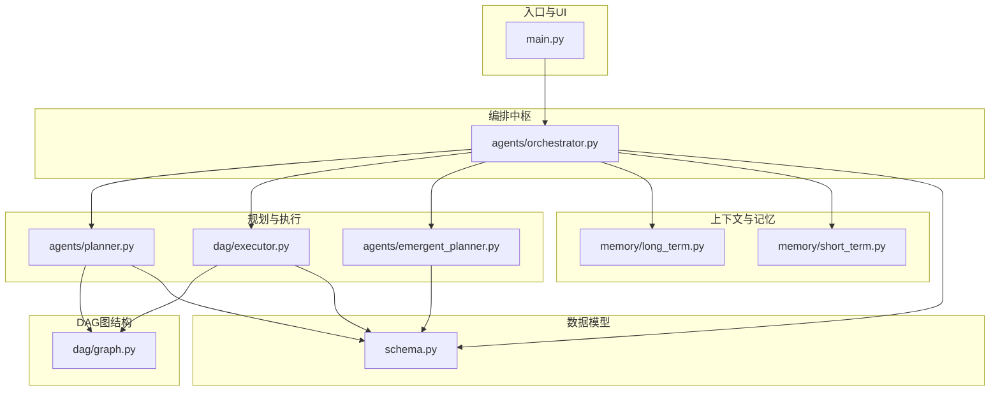
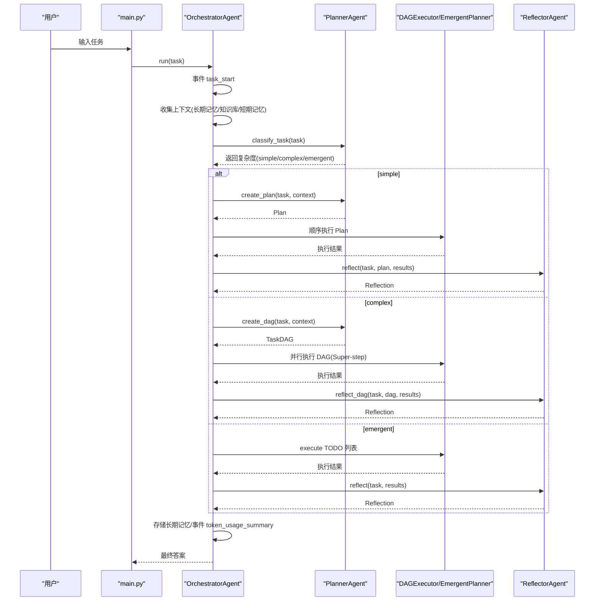
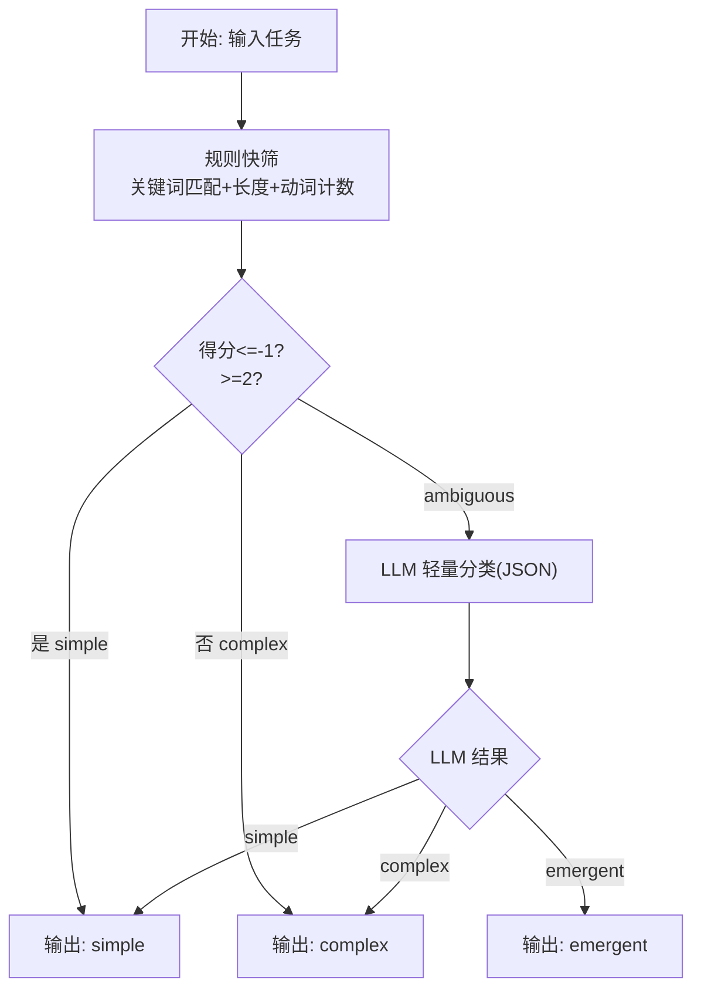
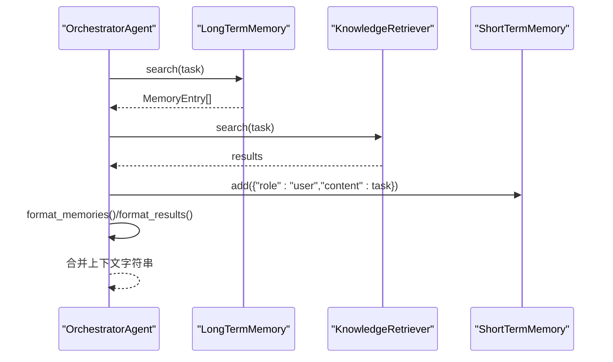
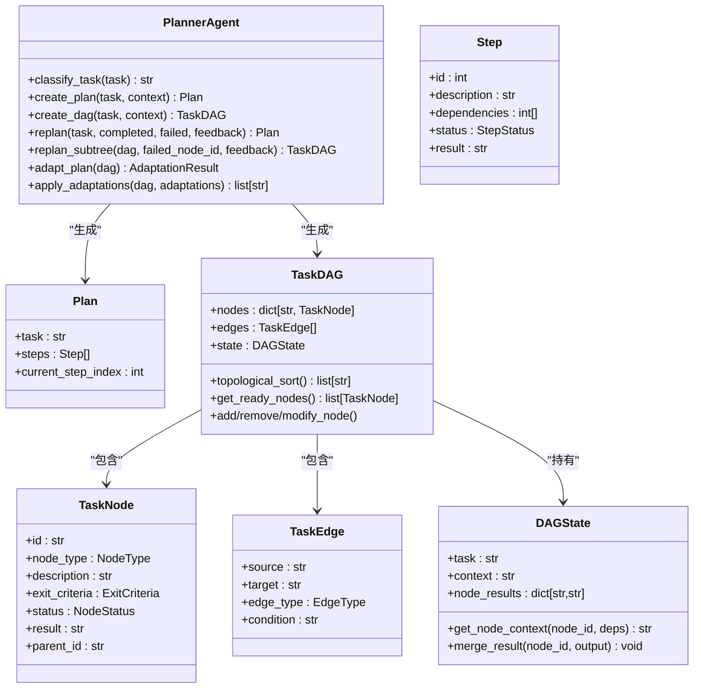
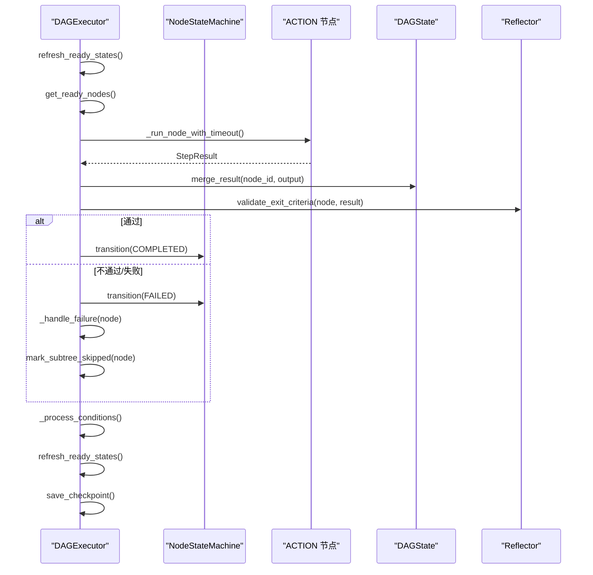
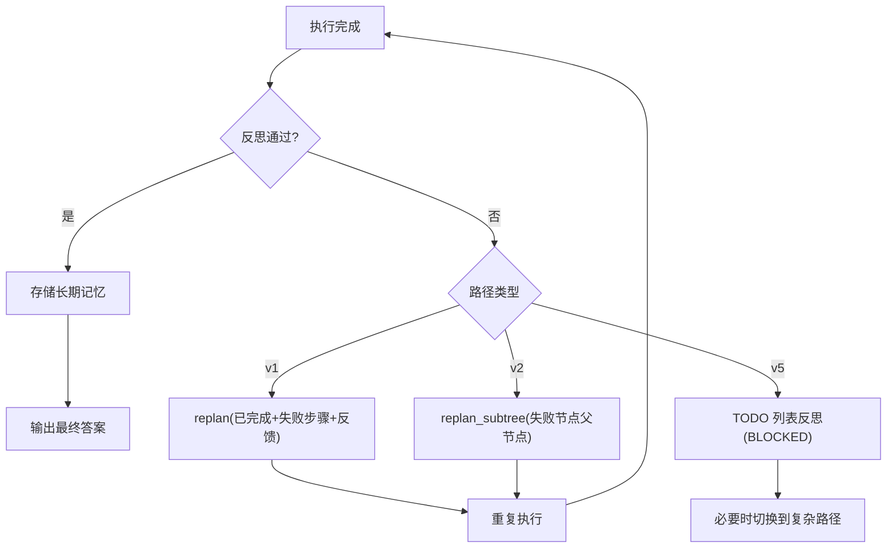
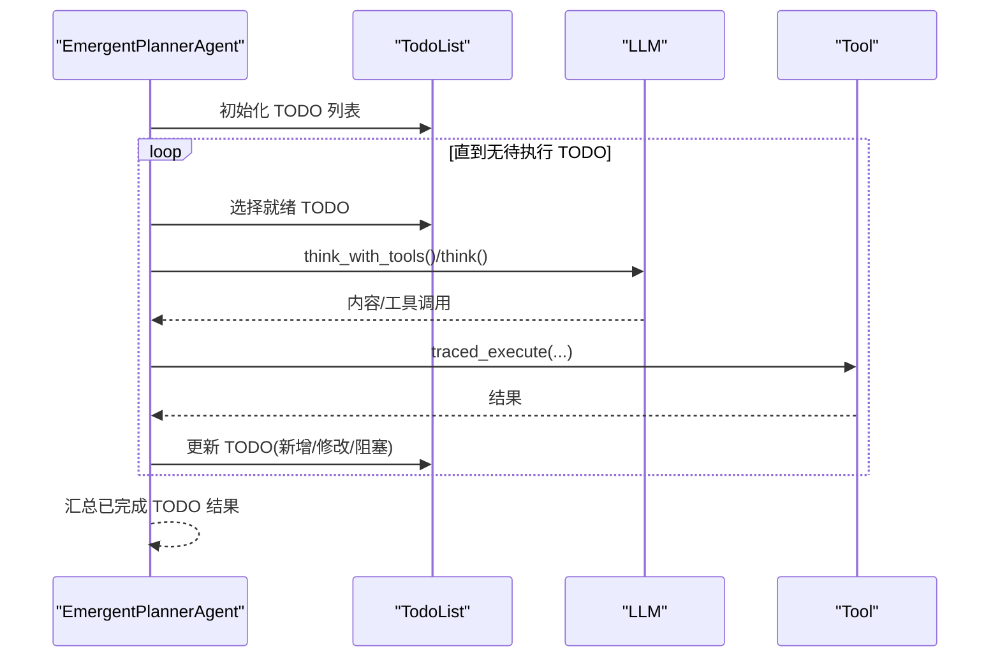
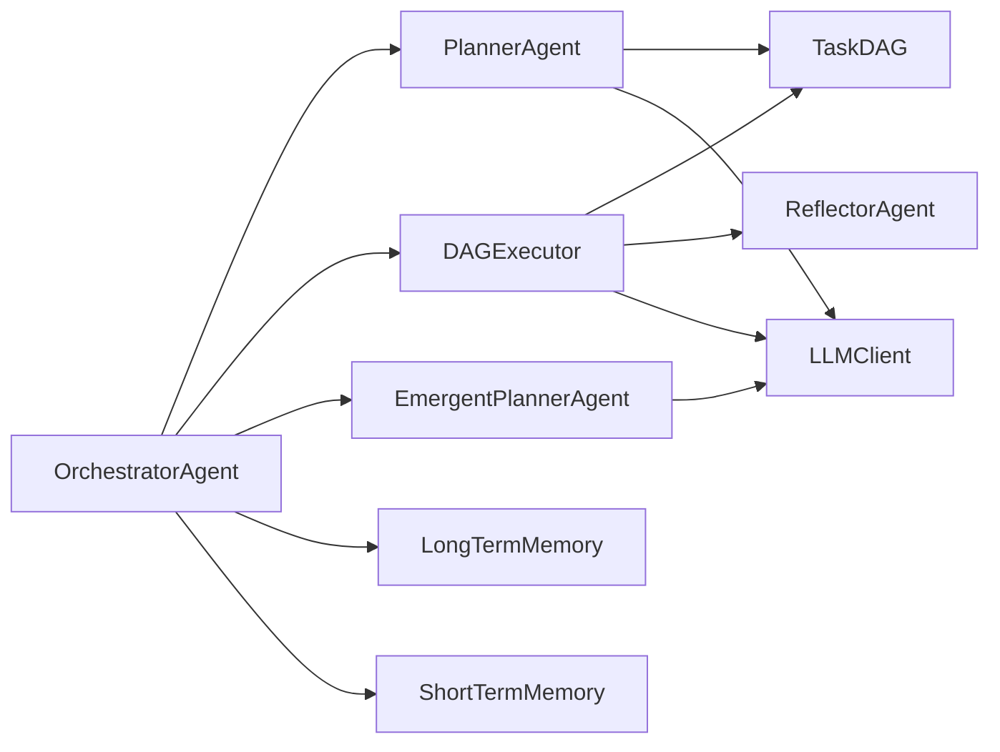

# 数据流分析

<cite>
**本文档引用的文件**
- [main.py](file://main.py)
- [orchestrator.py](file://agents/orchestrator.py)
- [planner.py](file://agents/planner.py)
- [emergent_planner.py](file://agents/emergent_planner.py)
- [graph.py](file://dag/graph.py)
- [executor.py](file://dag/executor.py)
- [schema.py](file://schema.py)
- [long_term.py](file://memory/long_term.py)
- [short_term.py](file://memory/short_term.py)
</cite>

## 目录
1. [简介](#简介)
2. [项目结构](#项目结构)
3. [核心组件](#核心组件)
4. [架构总览](#架构总览)
5. [详细组件分析](#详细组件分析)
6. [依赖分析](#依赖分析)
7. [性能考量](#性能考量)
8. [故障排查指南](#故障排查指南)
9. [结论](#结论)
10. [附录](#附录)

## 简介
本文件面向 manus_demo 的“多智能体混合路由”执行流水线，提供从用户输入到最终输出的完整数据流分析。重点涵盖：
- 任务复杂度分类过程中的规则筛选与 LLM 分类的数据流向
- 混合路由机制如何在 v1/v2/v5 路径间切换
- 上下文收集阶段短期记忆、长期记忆与知识库的融合方式
- 规划生成阶段从任务描述到 Plan/DAG 的数据结构变化
- 执行阶段的状态更新机制（节点状态、步骤结果、中间输出传递）
- 反思阶段的数据回传与反馈机制
- 数据验证规则、格式转换与错误恢复策略

## 项目结构
manus_demo 采用“事件驱动 + 数据模型驱动”的架构。核心模块包括：
- 入口与 UI：main.py 提供交互式 CLI 与事件渲染
- 编排中枢：agents/orchestrator.py 负责上下文收集、复杂度分类、路由与反思
- 规划器：agents/planner.py 提供 v1 扁平计划、v2 DAG 计划与自适应规划
- 执行器：dag/executor.py 以 Super-step 并行执行 DAG
- 隐式规划：agents/emergent_planner.py 基于 TODO 列表的 Claude Code 风格执行
- 数据模型：schema.py 定义 Plan/DAG/Todo 等核心数据结构
- 记忆与知识：memory/* 与 knowledge/* 提供上下文整合
- DAG 图结构：dag/graph.py 提供节点、边、状态与动态变更能力

图表来源
- [main.py:1-516](file://main.py#L1-L516)
- [orchestrator.py:1-600](file://agents/orchestrator.py#L1-L600)
- [planner.py:1-934](file://agents/planner.py#L1-L934)
- [executor.py:1-648](file://dag/executor.py#L1-L648)
- [emergent_planner.py:1-685](file://agents/emergent_planner.py#L1-L685)
- [graph.py:1-627](file://dag/graph.py#L1-L627)
- [schema.py:1-702](file://schema.py#L1-L702)
- [long_term.py:1-142](file://memory/long_term.py#L1-L142)
- [short_term.py:1-91](file://memory/short_term.py#L1-L91)

章节来源
- [main.py:1-516](file://main.py#L1-L516)
- [orchestrator.py:1-600](file://agents/orchestrator.py#L1-L600)

## 核心组件
- OrchestratorAgent：编排中枢，负责上下文收集、复杂度分类、路由到 v1/v2/v5、执行与反思、记忆存储与事件广播
- PlannerAgent：混合路由规划器，提供规则快筛 + LLM 兜底的复杂度分类，以及 v1 扁平计划、v2 DAG 计划、自适应规划与局部重规划
- DAGExecutor：基于 Super-step 的并行执行引擎，负责节点调度、并行执行、退出条件验证、失败处理、条件边评估与检查点
- EmergentPlannerAgent：隐式规划器，基于 TODO 列表的 while(tool_use) 主循环，动态演化 TODO
- TaskDAG：DAG 图结构与集中式状态，支持动态节点/边变更、拓扑排序、阻塞检测与回滚
- 数据模型：Plan/Step、TaskDAG/TaskNode/TaskEdge、DAGState、StepResult、Reflection、TodoList 等

章节来源
- [orchestrator.py:60-600](file://agents/orchestrator.py#L60-L600)
- [planner.py:147-934](file://agents/planner.py#L147-L934)
- [executor.py:62-648](file://dag/executor.py#L62-L648)
- [emergent_planner.py:72-685](file://agents/emergent_planner.py#L72-L685)
- [graph.py:43-627](file://dag/graph.py#L43-L627)
- [schema.py:35-702](file://schema.py#L35-L702)

## 架构总览
manus_demo 的数据流以“事件驱动”为核心，主要阶段如下：
1) 用户输入 → Orchestrator.run → 任务开始事件
2) 上下文收集：长期记忆检索 + 知识库检索 + 短期记忆注入 → 合并上下文字符串
3) 任务复杂度分类：规则快筛 → ambiguous？→ LLM 分类 → 输出 simple/complex/emergent
4) 路由执行：
   - simple：v1 扁平计划 → 顺序执行 → 反思
   - complex：v2 DAG → 并行 Super-step 执行 → 反思
   - emergent：v5 TODO 列表管理 → while(tool_use) 执行 → 反思
5) 反思通过 → 存储长期记忆 → 输出最终答案
6) 反思失败 → 可重规划（v1 逐步骤重规划；v2 局部子树重规划）→ 重复执行直至通过或达到最大尝试次数

图表来源
- [main.py:415-516](file://main.py#L415-L516)
- [orchestrator.py:158-222](file://agents/orchestrator.py#L158-L222)
- [planner.py:213-362](file://agents/planner.py#L213-L362)
- [executor.py:110-264](file://dag/executor.py#L110-L264)
- [emergent_planner.py:134-276](file://agents/emergent_planner.py#L134-L276)

## 详细组件分析

### 任务复杂度分类与混合路由
- 规则快筛阶段：基于关键词模式（多步、条件、并行、动作动词、探索性/不确定性）对任务文本打分，快速判定 simple/complex/emergent 或 ambiguous
- LLM 兜底阶段：对 ambiguous 结果进行轻量 JSON 分类，输出确定性结果
- 路由逻辑：根据复杂度选择 v1 扁平计划、v2 DAG 或 v5 隐式规划路径

图表来源
- [planner.py:213-362](file://agents/planner.py#L213-L362)

章节来源
- [planner.py:213-362](file://agents/planner.py#L213-L362)
- [orchestrator.py:188-212](file://agents/orchestrator.py#L188-L212)

### 上下文收集与融合
- 长期记忆：关键词重叠检索，格式化为可读上下文字符串
- 知识库：TF-IDF 检索，格式化为可读上下文字符串
- 短期记忆：滑动窗口保留最近对话，注入到当前任务上下文中
- 合并策略：将“过往经验”“相关知识”“当前对话”拼接为单一上下文字符串，供后续规划/执行使用

图表来源
- [orchestrator.py:229-250](file://agents/orchestrator.py#L229-L250)
- [long_term.py:79-138](file://memory/long_term.py#L79-L138)
- [short_term.py:36-84](file://memory/short_term.py#L36-L84)

章节来源
- [orchestrator.py:229-250](file://agents/orchestrator.py#L229-L250)
- [long_term.py:79-138](file://memory/long_term.py#L79-L138)
- [short_term.py:36-84](file://memory/short_term.py#L36-L84)

### 规划生成：从任务描述到 Plan/DAG
- v1 扁平计划：使用轻量系统提示词生成 2-6 步骤，支持依赖声明
- v2 DAG：一次性生成 Goal/SubGoal/Action 三层结构，构建 TaskNode/TaskEdge，形成 TaskDAG
- 自适应规划：在执行中基于已完成 ACTION 节点结果评估待执行节点，支持新增/修改/移除节点

图表来源
- [planner.py:369-566](file://agents/planner.py#L369-L566)
- [schema.py:47-253](file://schema.py#L47-L253)

章节来源
- [planner.py:369-566](file://agents/planner.py#L369-L566)
- [schema.py:47-253](file://schema.py#L47-L253)

### 执行阶段：状态更新与并行推进
- Super-step 并行：每轮选出 READY/PENDING 且前置依赖全部 COMPLETED 的节点，最多并行执行 MAX_PARALLEL_NODES 个 ACTION 节点
- 节点执行：从 DAGState 汇聚依赖结果构建上下文，委托 ExecutorAgent 执行 ReAct 循环
- 退出条件验证：Reflector 基于 LLM 或直接以执行成功与否判断节点是否满足 exit criteria
- 失败处理：执行失败或 exit criteria 不满足时，先尝试回滚（ROLLBACK 边），再级联跳过下游子树
- 条件边评估：根据源节点结果中的关键词匹配激活/跳过目标节点
- 结构性节点自动完成：GOAL/SUBGOAL 在子节点终态后自动完成
- 输出汇总：按拓扑序汇总 ACTION 节点结果

图表来源
- [executor.py:110-264](file://dag/executor.py#L110-L264)
- [executor.py:271-310](file://dag/executor.py#L271-L310)
- [executor.py:337-400](file://dag/executor.py#L337-L400)
- [executor.py:405-473](file://dag/executor.py#L405-L473)
- [executor.py:547-571](file://dag/executor.py#L547-L571)

章节来源
- [executor.py:110-264](file://dag/executor.py#L110-L264)
- [executor.py:271-310](file://dag/executor.py#L271-L310)
- [executor.py:337-400](file://dag/executor.py#L337-L400)
- [executor.py:405-473](file://dag/executor.py#L405-L473)
- [executor.py:547-571](file://dag/executor.py#L547-L571)

### 反思与反馈：质量门控与重规划
- v1：对 Plan 的步骤结果进行反思，若未通过则基于反馈与已完成/失败步骤进行局部重规划
- v2：对 DAG 执行结果进行反思，若未通过则仅重建失败子树，保留已完成工作
- v5：对 TODO 列表结果进行反思，若存在 BLOCKED TODO 则给出反馈与建议
- 反思通过后：存储长期记忆，输出最终答案；未通过则按路径进行重规划并重复执行

图表来源
- [orchestrator.py:325-350](file://agents/orchestrator.py#L325-L350)
- [orchestrator.py:471-508](file://agents/orchestrator.py#L471-L508)
- [emergent_planner.py:420-432](file://agents/emergent_planner.py#L420-L432)

章节来源
- [orchestrator.py:325-350](file://agents/orchestrator.py#L325-L350)
- [orchestrator.py:471-508](file://agents/orchestrator.py#L471-L508)
- [emergent_planner.py:420-432](file://agents/emergent_planner.py#L420-L432)

### 隐式规划（v5）：TODO 列表的动态演化
- 初始化：从任务描述生成 1-3 个初始 TODO
- 主循环：选择就绪 TODO，执行 ReAct 循环，更新 TODO 列表（新增/修改/阻塞）
- 停滞检测：连续多轮无进展则提前结束
- 汇总：将已完成 TODO 的结果综合为最终答案

图表来源
- [emergent_planner.py:134-276](file://agents/emergent_planner.py#L134-L276)
- [emergent_planner.py:283-459](file://agents/emergent_planner.py#L283-L459)
- [schema.py:395-567](file://schema.py#L395-L567)

章节来源
- [emergent_planner.py:134-276](file://agents/emergent_planner.py#L134-L276)
- [emergent_planner.py:283-459](file://agents/emergent_planner.py#L283-L459)
- [schema.py:395-567](file://schema.py#L395-L567)

## 依赖分析
- 组件耦合
  - Orchestrator 依赖 Planner、DAGExecutor、EmergentPlanner、Reflector、LongTermMemory、ShortTermMemory、KnowledgeRetriever
  - DAGExecutor 依赖 ExecutorAgent、Reflector、Planner（自适应规划）、NodeStateMachine
  - Planner 依赖 LLMClient、ContextManager、TaskDAG
  - DAGExecutor 与 TaskDAG 双向协作：前者驱动状态机与执行，后者承载状态与动态变更
- 外部依赖
  - LLMClient：统一的 LLM 调用与 Token 统计
  - 工具链：WebSearch/CodeExecutor/FileOps/ShellTool
  - 配置：MAX_PARALLEL_NODES、NODE_EXECUTION_TIMEOUT、ADAPTIVE_PLANNING_ENABLED 等

图表来源
- [orchestrator.py:115-141](file://agents/orchestrator.py#L115-L141)
- [executor.py:87-101](file://dag/executor.py#L87-L101)
- [planner.py:200-206](file://agents/planner.py#L200-L206)

章节来源
- [orchestrator.py:115-141](file://agents/orchestrator.py#L115-L141)
- [executor.py:87-101](file://dag/executor.py#L87-L101)
- [planner.py:200-206](file://agents/planner.py#L200-L206)

## 性能考量
- 规则分类阶段：O(n) 关键词匹配，毫秒级开销，零 LLM 调用
- LLM 分类阶段：极简 JSON prompt，~60 tokens，temperature=0.0，确定性输出
- DAG 执行阶段：邻接表预构建，拓扑排序 O(V+E)，并行度受 MAX_PARALLEL_NODES 限制
- 自适应规划：按间隔与完成数触发，避免频繁重规划
- Token 统计：集中式汇总，支持按引擎与总计展示
- 错误恢复：超时保护、回滚边、级联回滚/跳过、停滞检测、最大重试次数

## 故障排查指南
- DAG 执行停滞
  - 现象：无就绪节点但 DAG 未完成
  - 排查：检查阻塞报告、失败节点、条件边未满足、拓扑环
  - 处理：刷新就绪状态、尝试恢复阻塞节点、检查回滚边有效性
- 节点反复失败
  - 现象：FAILED→PENDING 循环
  - 排查：失败计数、条件边匹配策略、工具调用日志
  - 处理：增加重试上限、调整 exit criteria、检查回滚边
- 条件边误判
  - 现象：Latin 文本误匹配或 CJK 文本漏匹配
  - 处理：确认条件关键词、调整匹配策略（词边界 vs 子串）
- 任务复杂度误判
  - 现象：简单任务走 DAG，复杂任务走 v1
  - 处理：检查规则阈值、强制模式 PLAN_MODE、禁用 emergent 时的降级
- Token 消耗异常
  - 现象：总计与明细不一致
  - 处理：核对 per-call 记录、by_engine 汇总、总和计算

章节来源
- [executor.py:134-141](file://dag/executor.py#L134-L141)
- [executor.py:337-400](file://dag/executor.py#L337-L400)
- [executor.py:405-473](file://dag/executor.py#L405-L473)
- [graph.py:277-334](file://dag/graph.py#L277-L334)
- [main.py:113-176](file://main.py#L113-L176)

## 结论
manus_demo 通过“规则快筛 + LLM 兜底”的混合路由，结合 v1/v2/v5 三种执行路径，实现了从用户输入到最终输出的高可解释、可扩展数据流。DAG 的集中式状态与动态变更能力、Super-step 并行执行、条件边与回滚机制、以及反思驱动的重规划，共同构成了稳健的执行闭环。配合上下文融合与长期记忆存储，系统在复杂任务中具备良好的自适应与恢复能力。

## 附录
- 数据模型概览（节选）
  - v1：Plan/Step/StepStatus
  - v2：TaskDAG/TaskNode/TaskEdge/NodeStatus/ExitCriteria/DAGState
  - v5：TodoList/TodoItem/TodoStatus
  - 通用：StepResult/Reflection/ToolCallRecord/TokenUsage/TokenUsageSummary

章节来源
- [schema.py:35-702](file://schema.py#L35-L702)