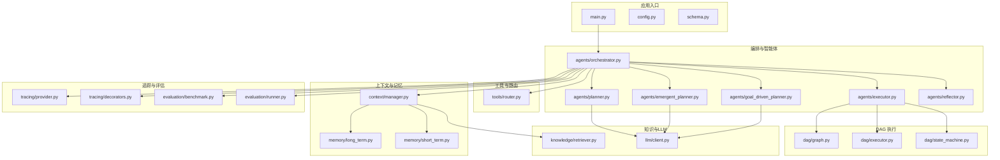
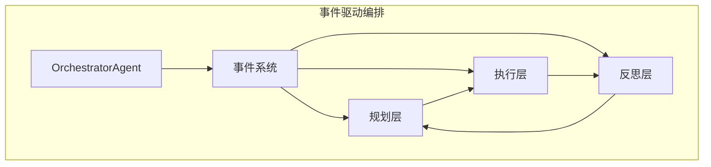
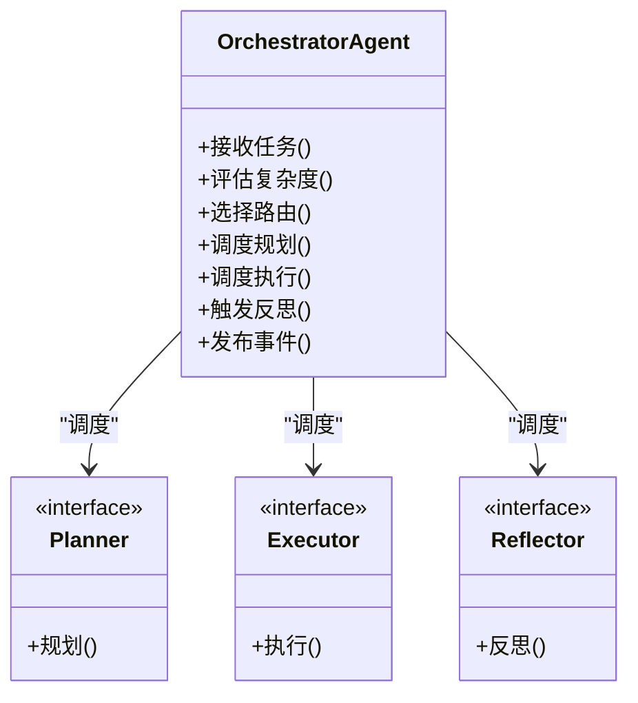
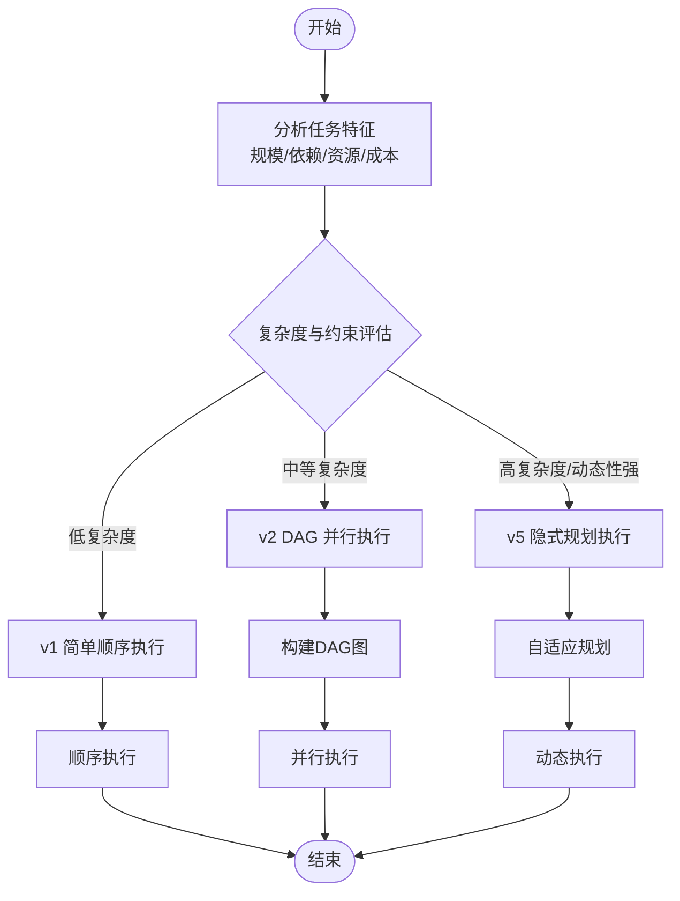
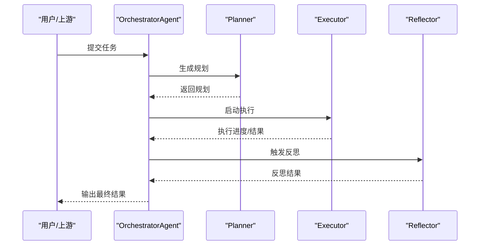
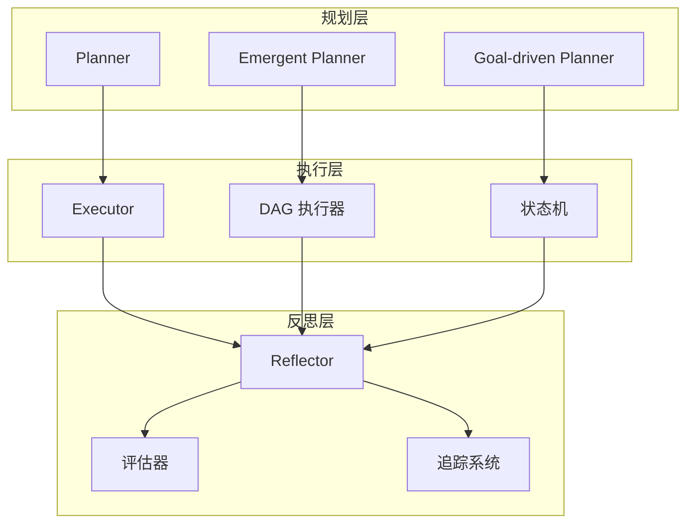
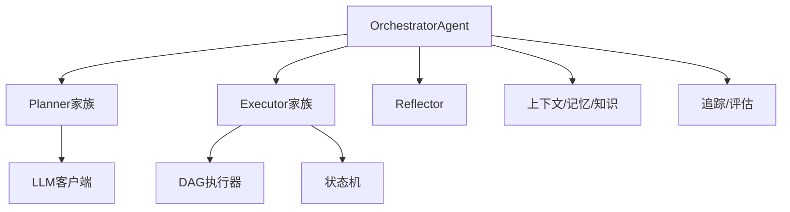

# 整体架构设计

<cite>
**本文引用的文件**
- [main.py](file://main.py)
- [config.py](file://config.py)
- [schema.py](file://schema.py)
- [agents/orchestrator.py](file://agents/orchestrator.py)
- [agents/planner.py](file://agents/planner.py)
- [agents/executor.py](file://agents/executor.py)
- [agents/reflector.py](file://agents/reflector.py)
- [agents/emergent_planner.py](file://agents/emergent_planner.py)
- [agents/goal_driven_planner.py](file://agents/goal_driven_planner.py)
- [dag/executor.py](file://dag/executor.py)
- [dag/graph.py](file://dag/graph.py)
- [dag/state_machine.py](file://dag/state_machine.py)
- [tools/router.py](file://tools/router.py)
- [context/manager.py](file://context/manager.py)
- [memory/long_term.py](file://memory/long_term.py)
- [memory/short_term.py](file://memory/short_term.py)
- [llm/client.py](file://llm/client.py)
- [knowledge/retriever.py](file://knowledge/retriever.py)
- [tracing/provider.py](file://tracing/provider.py)
- [tracing/decorators.py](file://tracing/decorators.py)
- [evaluation/benchmark.py](file://evaluation/benchmark.py)
- [evaluation/runner.py](file://evaluation/runner.py)
</cite>

## 目录
1. [引言](#引言)
2. [项目结构](#项目结构)
3. [核心组件](#核心组件)
4. [架构总览](#架构总览)
5. [详细组件分析](#详细组件分析)
6. [依赖关系分析](#依赖关系分析)
7. [性能考量](#性能考量)
8. [故障排查指南](#故障排查指南)
9. [结论](#结论)
10. [附录](#附录)

## 引言
本项目旨在构建一个可扩展的任务编排与执行系统，支持从简单到复杂的多种执行路径：v1 简单顺序路径、v2 DAG 路径、以及 v5 隐式规划路径。系统采用事件驱动与分层架构，围绕 OrchestratorAgent 作为中央协调者，结合规划层、执行层、反思层，实现对任务的智能路由与自适应执行。本文档系统性阐述高层架构模式、设计理念、混合路由机制、事件解耦通信、分层职责、技术权衡与设计原则，并给出系统边界、核心约束与最佳实践。

## 项目结构
项目采用按功能域分层的模块化组织方式，主要目录与职责如下：
- agents：智能体与编排核心，包含 OrchestratorAgent、Planner、Executor、Reflector 及其变体
- dag：DAG 执行引擎与状态机
- tools：工具集与路由策略
- context/memory/knowledge/llm：上下文管理、记忆、知识检索与大模型客户端
- tracing：全链路追踪与可观测性
- evaluation：评估基准与运行器
- config/schema：配置与数据模式定义
- main.py：应用入口与初始化流程

图表来源
- [main.py](file://main.py)
- [agents/orchestrator.py](file://agents/orchestrator.py)
- [agents/planner.py](file://agents/planner.py)
- [agents/emergent_planner.py](file://agents/emergent_planner.py)
- [agents/goal_driven_planner.py](file://agents/goal_driven_planner.py)
- [agents/executor.py](file://agents/executor.py)
- [dag/graph.py](file://dag/graph.py)
- [dag/executor.py](file://dag/executor.py)
- [dag/state_machine.py](file://dag/state_machine.py)
- [tools/router.py](file://tools/router.py)
- [context/manager.py](file://context/manager.py)
- [memory/long_term.py](file://memory/long_term.py)
- [memory/short_term.py](file://memory/short_term.py)
- [knowledge/retriever.py](file://knowledge/retriever.py)
- [llm/client.py](file://llm/client.py)
- [tracing/provider.py](file://tracing/provider.py)
- [tracing/decorators.py](file://tracing/decorators.py)
- [evaluation/benchmark.py](file://evaluation/benchmark.py)
- [evaluation/runner.py](file://evaluation/runner.py)

章节来源
- [main.py](file://main.py)
- [config.py](file://config.py)
- [schema.py](file://schema.py)

## 核心组件
- OrchestratorAgent（中央协调者）：负责接收任务、评估复杂度、选择执行路径（v1/v2/v5）、调度 Planner/Executor/Reflector、维护上下文与事件流。
- Planner 家族：传统 Planner、Emergent Planner（涌现式规划）、Goal-driven Planner（目标驱动规划），分别面向不同复杂度与场景。
- Executor（执行器）：统一执行接口，支持顺序执行与 DAG 并行执行；内部集成 DAG 图与状态机。
- Reflector（反思器）：对执行结果进行反思与反馈，驱动迭代优化。
- 工具与路由：基于任务特征选择合适工具链与执行策略。
- 上下文与记忆：短期/长期记忆、知识检索与上下文管理。
- 追踪与评估：提供全链路追踪与评估能力，支撑可观测性与质量保障。

章节来源
- [agents/orchestrator.py](file://agents/orchestrator.py)
- [agents/planner.py](file://agents/planner.py)
- [agents/emergent_planner.py](file://agents/emergent_planner.py)
- [agents/goal_driven_planner.py](file://agents/goal_driven_planner.py)
- [agents/executor.py](file://agents/executor.py)
- [agents/reflector.py](file://agents/reflector.py)
- [tools/router.py](file://tools/router.py)
- [context/manager.py](file://context/manager.py)
- [memory/long_term.py](file://memory/long_term.py)
- [memory/short_term.py](file://memory/short_term.py)
- [knowledge/retriever.py](file://knowledge/retriever.py)
- [llm/client.py](file://llm/client.py)
- [tracing/provider.py](file://tracing/provider.py)
- [evaluation/benchmark.py](file://evaluation/benchmark.py)

## 架构总览
系统采用“事件驱动 + 分层编排”的架构模式：
- 分层设计
  - 规划层：负责任务分解、路径规划与策略生成（含 v1/v2/v5 路由）
  - 执行层：负责具体动作执行与资源调度（顺序/并行）
  - 反思层：负责执行后评估与反馈，形成闭环
- 中央协调者（OrchestratorAgent）
  - 接收任务输入与上下文
  - 基于复杂度与约束进行混合路由
  - 协调各子系统协作，维护事件流与状态
- 解耦通信
  - 组件间通过事件与消息传递解耦，降低耦合度与提升扩展性
  - 支持异步与同步两种模式，依据任务特性选择

图表来源
- [agents/orchestrator.py](file://agents/orchestrator.py)
- [agents/planner.py](file://agents/planner.py)
- [agents/executor.py](file://agents/executor.py)
- [agents/reflector.py](file://agents/reflector.py)

## 详细组件分析

### OrchestratorAgent（中央协调者）
- 角色定位：系统中枢，负责任务接收、复杂度评估、路由决策、事件编排与状态协调
- 关键职责
  - 输入解析与上下文注入
  - 复杂度评估与路由选择（v1/v2/v5）
  - 规划器/执行器/反思器的动态调度
  - 事件发布与订阅，确保组件间解耦
  - 结果汇总与输出
- 设计要点
  - 以事件驱动为核心，避免强耦合
  - 对外暴露统一接口，对内按需装配子系统
  - 支持可插拔的规划器与执行器实现

图表来源
- [agents/orchestrator.py](file://agents/orchestrator.py)
- [agents/planner.py](file://agents/planner.py)
- [agents/executor.py](file://agents/executor.py)
- [agents/reflector.py](file://agents/reflector.py)

章节来源
- [agents/orchestrator.py](file://agents/orchestrator.py)

### 混合路由机制（v1/v2/v5）
- v1 简单路径：适用于低复杂度、线性步骤明确的任务，顺序执行即可满足需求
- v2 DAG 路径：适用于存在依赖关系与并行机会的任务，通过 DAG 表达依赖与并发
- v5 隐式规划路径：适用于需要自适应规划与动态调整的任务，强调涌现式与目标驱动
- 决策依据
  - 任务规模与依赖关系
  - 资源可用性与并发限制
  - 成本与时效性权衡
  - 反思反馈与历史经验

图表来源
- [agents/orchestrator.py](file://agents/orchestrator.py)
- [agents/planner.py](file://agents/planner.py)
- [agents/emergent_planner.py](file://agents/emergent_planner.py)
- [agents/goal_driven_planner.py](file://agents/goal_driven_planner.py)
- [agents/executor.py](file://agents/executor.py)
- [dag/graph.py](file://dag/graph.py)
- [dag/executor.py](file://dag/executor.py)

章节来源
- [agents/orchestrator.py](file://agents/orchestrator.py)
- [agents/planner.py](file://agents/planner.py)
- [agents/emergent_planner.py](file://agents/emergent_planner.py)
- [agents/goal_driven_planner.py](file://agents/goal_driven_planner.py)
- [agents/executor.py](file://agents/executor.py)
- [dag/graph.py](file://dag/graph.py)
- [dag/executor.py](file://dag/executor.py)

### 事件驱动架构与解耦通信
- 事件模型
  - 事件生产者：OrchestratorAgent、Planner、Executor、Reflector
  - 事件消费者：其他组件或外部系统
  - 事件通道：统一事件总线或消息队列
- 解耦优势
  - 组件独立演进
  - 易于测试与替换
  - 支撑可观测性与审计
- 实践建议
  - 事件命名规范与版本控制
  - 异常与重试策略
  - 事件幂等性设计

图表来源
- [agents/orchestrator.py](file://agents/orchestrator.py)
- [agents/planner.py](file://agents/planner.py)
- [agents/executor.py](file://agents/executor.py)
- [agents/reflector.py](file://agents/reflector.py)

章节来源
- [agents/orchestrator.py](file://agents/orchestrator.py)
- [agents/planner.py](file://agents/planner.py)
- [agents/executor.py](file://agents/executor.py)
- [agents/reflector.py](file://agents/reflector.py)

### 分层设计与职责划分
- 规划层
  - 职责：任务分解、路径生成、策略选择
  - 组件：Planner、Emergent Planner、Goal-driven Planner
  - 产出：v1/v2/v5 的执行计划
- 执行层
  - 职责：按计划执行、资源调度、并发控制
  - 组件：Executor、DAG 执行器、状态机
  - 产出：中间结果与最终结果
- 反思层
  - 职责：评估执行效果、提取经验、指导下次规划
  - 组件：Reflector、评估器、追踪系统
  - 产出：反思报告与改进建议

图表来源
- [agents/planner.py](file://agents/planner.py)
- [agents/emergent_planner.py](file://agents/emergent_planner.py)
- [agents/goal_driven_planner.py](file://agents/goal_driven_planner.py)
- [agents/executor.py](file://agents/executor.py)
- [dag/executor.py](file://dag/executor.py)
- [dag/state_machine.py](file://dag/state_machine.py)
- [agents/reflector.py](file://agents/reflector.py)
- [evaluation/benchmark.py](file://evaluation/benchmark.py)
- [tracing/provider.py](file://tracing/provider.py)

章节来源
- [agents/planner.py](file://agents/planner.py)
- [agents/emergent_planner.py](file://agents/emergent_planner.py)
- [agents/goal_driven_planner.py](file://agents/goal_driven_planner.py)
- [agents/executor.py](file://agents/executor.py)
- [dag/executor.py](file://dag/executor.py)
- [dag/state_machine.py](file://dag/state_machine.py)
- [agents/reflector.py](file://agents/reflector.py)
- [evaluation/benchmark.py](file://evaluation/benchmark.py)
- [tracing/provider.py](file://tracing/provider.py)

### 技术决策与权衡
- 顺序执行 vs 并行执行
  - 顺序执行：简单、可控、适合低复杂度与强依赖任务
  - 并行执行：高效、复杂、适合弱依赖与可并行任务；需注意资源竞争与一致性
- 固定规划 vs 自适应规划
  - 固定规划：规则明确、可预测、适合标准化流程
  - 自适应规划：灵活、可学习、适合动态与不确定性场景；需更强的反馈与评估机制
- 路由策略
  - 以任务特征为依据，结合成本、时效与稳定性进行动态选择
  - 在 v1/v2/v5 之间切换，确保在不同复杂度下取得最优性价比

章节来源
- [agents/orchestrator.py](file://agents/orchestrator.py)
- [agents/planner.py](file://agents/planner.py)
- [agents/emergent_planner.py](file://agents/emergent_planner.py)
- [agents/goal_driven_planner.py](file://agents/goal_driven_planner.py)
- [agents/executor.py](file://agents/executor.py)
- [dag/executor.py](file://dag/executor.py)

### 系统边界、约束与设计原则
- 系统边界
  - 输入：任务描述、上下文、约束条件
  - 输出：执行结果、反思报告、追踪日志
  - 外部依赖：工具链、大模型服务、存储与检索系统
- 核心约束
  - 资源限制（CPU/内存/并发度）
  - 时效性要求（SLA/超时处理）
  - 一致性与幂等性（事件与执行）
- 设计原则
  - 松耦合、高内聚
  - 可观测性优先
  - 可扩展与可替换
  - 安全与可审计

章节来源
- [config.py](file://config.py)
- [schema.py](file://schema.py)
- [context/manager.py](file://context/manager.py)
- [memory/long_term.py](file://memory/long_term.py)
- [memory/short_term.py](file://memory/short_term.py)
- [knowledge/retriever.py](file://knowledge/retriever.py)
- [llm/client.py](file://llm/client.py)

## 依赖关系分析
- 组件内聚与耦合
  - OrchestratorAgent 作为高阶协调者，对具体实现保持抽象，降低对 Planner/Executor 的直接耦合
  - Planner/Executor/Reflector 通过统一接口与事件系统交互，增强可替换性
- 外部依赖
  - LLM 客户端用于规划与反思
  - 知识检索与记忆系统提供上下文支撑
  - DAG 执行器与状态机提供并行与状态管理
- 循环依赖规避
  - 通过事件与接口解耦，避免直接循环引用
  - 使用装饰器与追踪系统隔离横切关注点

图表来源
- [agents/orchestrator.py](file://agents/orchestrator.py)
- [agents/planner.py](file://agents/planner.py)
- [agents/executor.py](file://agents/executor.py)
- [agents/reflector.py](file://agents/reflector.py)
- [llm/client.py](file://llm/client.py)
- [dag/executor.py](file://dag/executor.py)
- [dag/state_machine.py](file://dag/state_machine.py)
- [context/manager.py](file://context/manager.py)
- [memory/long_term.py](file://memory/long_term.py)
- [memory/short_term.py](file://memory/short_term.py)
- [knowledge/retriever.py](file://knowledge/retriever.py)
- [tracing/provider.py](file://tracing/provider.py)
- [evaluation/benchmark.py](file://evaluation/benchmark.py)

章节来源
- [agents/orchestrator.py](file://agents/orchestrator.py)
- [agents/planner.py](file://agents/planner.py)
- [agents/executor.py](file://agents/executor.py)
- [agents/reflector.py](file://agents/reflector.py)
- [llm/client.py](file://llm/client.py)
- [dag/executor.py](file://dag/executor.py)
- [dag/state_machine.py](file://dag/state_machine.py)
- [context/manager.py](file://context/manager.py)
- [memory/long_term.py](file://memory/long_term.py)
- [memory/short_term.py](file://memory/short_term.py)
- [knowledge/retriever.py](file://knowledge/retriever.py)
- [tracing/provider.py](file://tracing/provider.py)
- [evaluation/benchmark.py](file://evaluation/benchmark.py)

## 性能考量
- 路由选择对性能的影响
  - v1 顺序执行适合小任务，延迟低但吞吐有限
  - v2 DAG 并行执行适合中等规模任务，需平衡并发度与资源占用
  - v5 自适应规划适合复杂任务，需考虑规划开销与收敛速度
- 并发与资源管理
  - 合理设置并发上限，避免资源争用
  - 使用有界队列与背压机制，保证系统稳定性
- 可观测性与诊断
  - 通过追踪系统记录关键路径耗时，识别瓶颈
  - 评估器定期产出性能报告，指导容量规划

## 故障排查指南
- 常见问题
  - 路由错误：检查复杂度评估逻辑与路由阈值
  - 执行失败：查看 DAG 构建与状态机转换日志
  - 反思无效：确认反思器输入输出格式与评估指标
- 排查步骤
  - 启用详细日志与追踪
  - 复现最小化用例
  - 对比 v1/v2/v5 的行为差异
- 工具支持
  - 追踪可视化与事件回放
  - 评估运行器与基准测试

章节来源
- [tracing/decorators.py](file://tracing/decorators.py)
- [evaluation/runner.py](file://evaluation/runner.py)
- [evaluation/benchmark.py](file://evaluation/benchmark.py)

## 结论
本系统通过 OrchestratorAgent 将规划、执行与反思三大层有机整合，借助事件驱动与混合路由机制，在不同复杂度与约束条件下实现最优执行路径选择。分层设计与解耦通信提升了系统的可维护性与可扩展性；通过追踪与评估体系保障了可观测性与持续改进。未来可在路由自适应、资源调度优化与多模态规划方面进一步深化。

## 附录
- 快速上手
  - 配置环境变量与模型参数
  - 准备任务输入与上下文
  - 选择路由策略并启动执行
- 最佳实践
  - 明确任务特征，合理选择 v1/v2/v5
  - 控制并发度，避免资源过载
  - 建立反思闭环，持续优化规划与执行