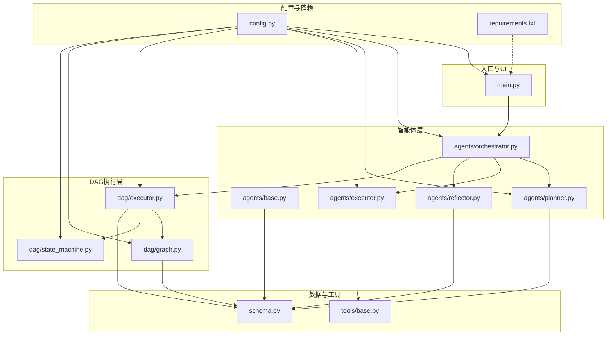
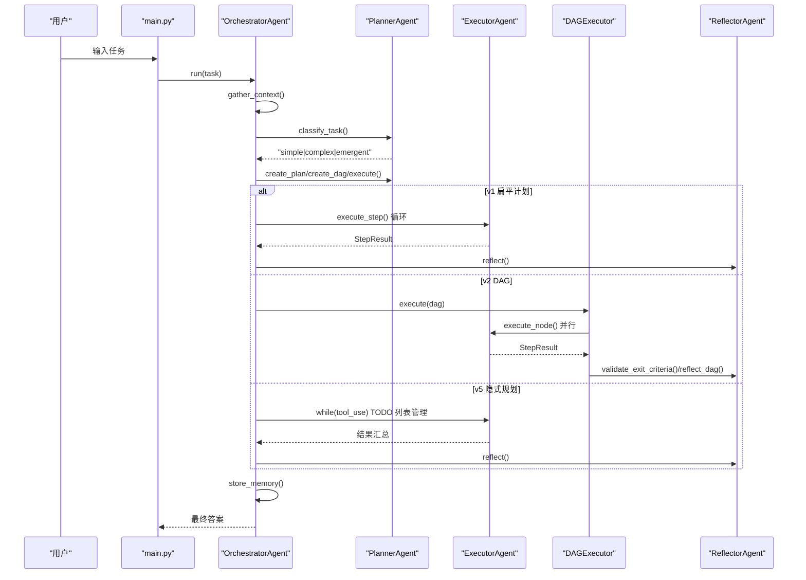
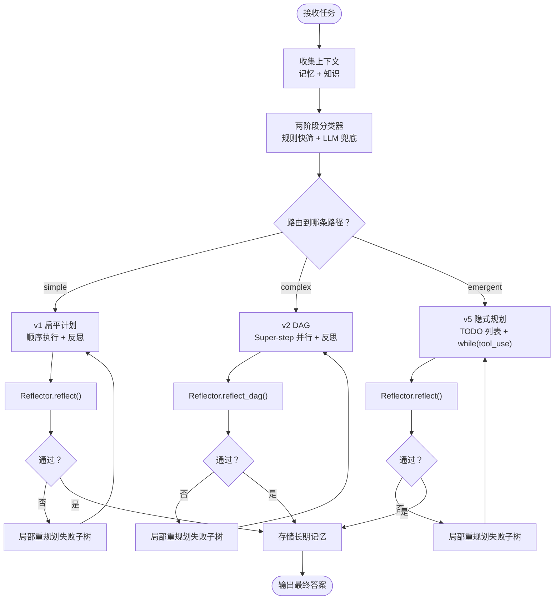
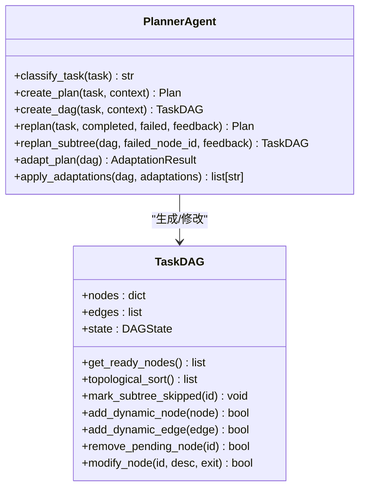
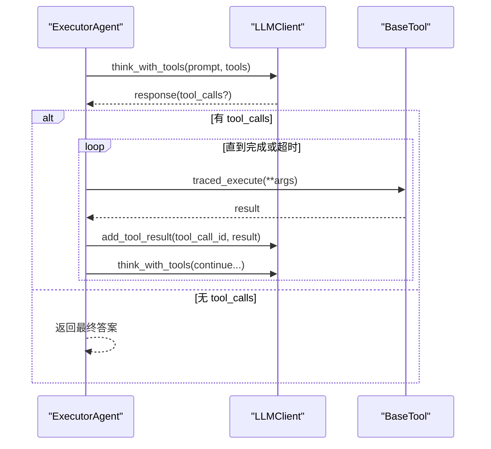
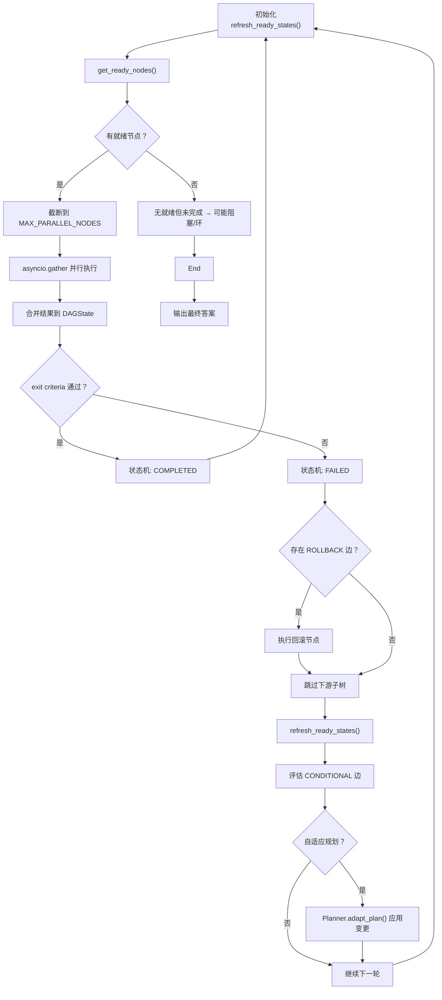
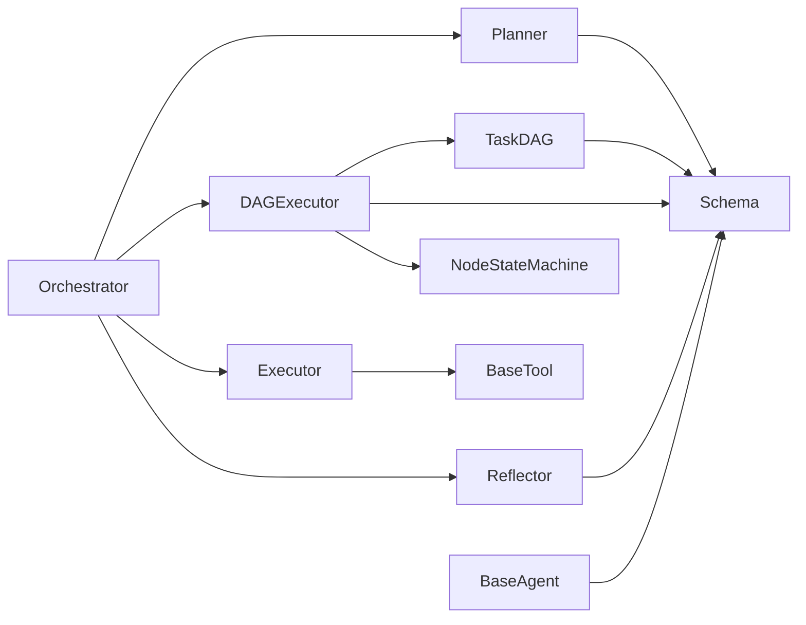

# 系统架构

<cite>
**本文引用的文件**
- [main.py](file://main.py)
- [agents/orchestrator.py](file://agents/orchestrator.py)
- [agents/base.py](file://agents/base.py)
- [agents/planner.py](file://agents/planner.py)
- [agents/executor.py](file://agents/executor.py)
- [agents/reflector.py](file://agents/reflector.py)
- [dag/graph.py](file://dag/graph.py)
- [dag/state_machine.py](file://dag/state_machine.py)
- [dag/executor.py](file://dag/executor.py)
- [schema.py](file://schema.py)
- [config.py](file://config.py)
- [tools/base.py](file://tools/base.py)
- [requirements.txt](file://requirements.txt)
- [README.md](file://README.md)
</cite>

## 目录
1. [简介](#简介)
2. [项目结构](#项目结构)
3. [核心组件](#核心组件)
4. [架构总览](#架构总览)
5. [详细组件分析](#详细组件分析)
6. [依赖关系分析](#依赖关系分析)
7. [性能考量](#性能考量)
8. [故障排查指南](#故障排查指南)
9. [结论](#结论)
10. [附录](#附录)

## 简介
本系统是一个基于 DAG 的多智能体协作平台，围绕 OrchestratorAgent（中央协调者）构建，采用事件驱动与状态机驱动相结合的执行模式，支持三种规划路径：v1 扁平计划、v2 分层 DAG 与 v5 隐式规划（TODO 列表）。系统通过集中式状态（DAGState）与节点状态机（NodeStateMachine）保障执行一致性，结合条件分支、回滚、部分重规划与自适应规划等机制，实现高鲁棒性的任务执行闭环。

## 项目结构
系统采用“按职责分层”的模块化组织方式：
- 入口与 UI：main.py 提供交互式 CLI 与事件驱动渲染
- 智能体层：agents/* 实现 Planner、Executor、Reflector、Orchestrator 等核心智能体
- DAG 执行层：dag/* 提供 TaskDAG、状态机与 DAGExecutor
- 数据模型：schema.py 定义统一的数据结构
- 工具层：tools/* 提供抽象工具接口与具体工具实现
- 配置与依赖：config.py、requirements.txt
- 文档与测试：README.md、tests/*

图表来源
- [main.py:1-516](file://main.py#L1-L516)
- [agents/orchestrator.py:1-600](file://agents/orchestrator.py#L1-L600)
- [agents/planner.py:1-934](file://agents/planner.py#L1-L934)
- [agents/executor.py:1-323](file://agents/executor.py#L1-L323)
- [agents/reflector.py:1-255](file://agents/reflector.py#L1-L255)
- [dag/graph.py:1-627](file://dag/graph.py#L1-L627)
- [dag/state_machine.py:1-114](file://dag/state_machine.py#L1-L114)
- [dag/executor.py:1-648](file://dag/executor.py#L1-L648)
- [schema.py:1-688](file://schema.py#L1-L688)
- [config.py:1-109](file://config.py#L1-L109)
- [requirements.txt:1-19](file://requirements.txt#L1-L19)

章节来源
- [README.md:97-154](file://README.md#L97-L154)

## 核心组件
- OrchestratorAgent（中央协调者）
  - 职责：收集上下文、任务复杂度分类与路由、编排 v1/v2/v5 执行路径、反思与重规划、长期记忆存储
  - 关键流程：gather_context → classify_task → create_plan/create_dag/execute → reflect → store_memory
- PlannerAgent（规划器）
  - 职责：两阶段混合分类器（规则快筛 + LLM 兜底）；生成 v1 扁平计划、v2 DAG；支持局部重规划与自适应规划
- ExecutorAgent（执行器）
  - 职责：ReAct 循环（Thought → Tool Call → Observation），支持统一 ReActEngine v2
- DAGExecutor（DAG 执行器）
  - 职责：Super-step 并行执行、条件边评估、失败回滚与子树跳过、自适应规划集成、Checkpoint 快照
- NodeStateMachine（节点状态机）
  - 职责：强制合法状态转移（PENDING → READY → RUNNING → COMPLETED/FAILED/ROLLED_BACK/SKIPPED）
- TaskDAG（任务有向无环图）
  - 职责：节点与边管理、拓扑排序、就绪节点发现、动态增删改、集中式状态合并
- ReflectorAgent（反思器）
  - 职责：逐节点 exit criteria 验证、DAG 全局反思、质量评分与改进建议
- BaseAgent（智能体基类）
  - 职责：系统提示词管理、消息历史、与 LLM 交互、上下文压缩
- BaseTool（工具抽象）
  - 职责：工具接口、OpenAI function-calling schema、可选追踪埋点

章节来源
- [agents/orchestrator.py:60-600](file://agents/orchestrator.py#L60-L600)
- [agents/planner.py:147-934](file://agents/planner.py#L147-L934)
- [agents/executor.py:66-323](file://agents/executor.py#L66-L323)
- [dag/executor.py:62-648](file://dag/executor.py#L62-L648)
- [dag/state_machine.py:55-114](file://dag/state_machine.py#L55-L114)
- [dag/graph.py:43-627](file://dag/graph.py#L43-L627)
- [agents/reflector.py:59-255](file://agents/reflector.py#L59-L255)
- [agents/base.py:29-183](file://agents/base.py#L29-L183)
- [tools/base.py:22-175](file://tools/base.py#L22-L175)

## 架构总览
系统采用“事件驱动 + 状态机驱动”的混合执行模式：
- 事件驱动：OrchestratorAgent 通过 on_event 将任务生命周期事件（任务开始、阶段切换、节点状态、反思结果等）推送到 UI 渲染
- 状态机驱动：DAGExecutor 与 NodeStateMachine 严格控制节点状态迁移，确保执行一致性
- 混合路由：PlannerAgent 基于规则与 LLM 的两阶段分类器自动选择 v1/v2/v5 路径
- 自适应规划：DAGExecutor 在超步之间触发 Planner 的 adapt_plan，动态调整 DAG 结构

图表来源
- [main.py:415-516](file://main.py#L415-L516)
- [agents/orchestrator.py:158-222](file://agents/orchestrator.py#L158-L222)
- [agents/planner.py:213-259](file://agents/planner.py#L213-L259)
- [agents/executor.py:171-188](file://agents/executor.py#L171-L188)
- [dag/executor.py:110-264](file://dag/executor.py#L110-L264)
- [agents/reflector.py:202-254](file://agents/reflector.py#L202-L254)

## 详细组件分析

### OrchestratorAgent（中央协调者）
- 职责与边界
  - 生命周期编排：收集上下文 → 任务复杂度分类 → 路由执行 → 反思 → 存储记忆 → UI 事件
  - 多智能体编排：Planner、Executor、Reflector、EmergentPlanner、GoalDrivenPlanner（可选）
  - 集成追踪桥接：多播事件到 UI 与 TracingBridge
- 关键流程
  - 两阶段分类器：规则快筛（<1ms）+ LLM 兜底（~60tokens）
  - 局部重规划：仅重建失败子树，保留已完成工作
  - Token 消耗追踪与汇总
- 事件驱动 UI
  - on_event 统一处理任务开始、阶段切换、计划/节点事件、反思、Token 汇总、任务完成等

图表来源
- [agents/orchestrator.py:158-222](file://agents/orchestrator.py#L158-L222)
- [agents/orchestrator.py:257-352](file://agents/orchestrator.py#L257-L352)
- [agents/orchestrator.py:439-508](file://agents/orchestrator.py#L439-L508)
- [agents/orchestrator.py:370-432](file://agents/orchestrator.py#L370-L432)

章节来源
- [agents/orchestrator.py:60-600](file://agents/orchestrator.py#L60-L600)
- [main.py:184-390](file://main.py#L184-L390)

### PlannerAgent（规划器）
- 两阶段分类器
  - 规则快筛：基于关键词与长度启发式，快速判断 simple/complex/emergent/ambiguous
  - LLM 兜底：对 ambiguous 场景进行确定性分类（temperature=0）
- v1 扁平计划
  - 2-6 步顺序计划，支持基于反馈的局部重规划
- v2 DAG 规划
  - Goal → SubGoal → Action 三层结构，支持 exit criteria、风险评估、条件边、回滚边
- 自适应规划
  - 超步间评估已完成 ACTION 节点，提出 REMOVE/MODIFY/ADD 动作建议并应用到 DAG

图表来源
- [agents/planner.py:147-934](file://agents/planner.py#L147-L934)
- [dag/graph.py:43-627](file://dag/graph.py#L43-L627)

章节来源
- [agents/planner.py:213-259](file://agents/planner.py#L213-L259)
- [agents/planner.py:369-474](file://agents/planner.py#L369-L474)
- [agents/planner.py:481-506](file://agents/planner.py#L481-L506)
- [agents/planner.py:513-566](file://agents/planner.py#L513-L566)
- [agents/planner.py:573-672](file://agents/planner.py#L573-L672)
- [agents/planner.py:674-722](file://agents/planner.py#L674-L722)

### ExecutorAgent（执行器）
- ReAct 循环
  - Thought → Tool Call → Observation → Repeat，直至满足 exit criteria 或达到最大迭代
- 工具路由（v3）
  - 连续失败阈值触发替代工具建议，提升鲁棒性
- 统一 ReActEngine v2（可选）
  - 通过 Feature Flag 启用，统一 v1/v2 的执行引擎

图表来源
- [agents/executor.py:195-321](file://agents/executor.py#L195-L321)
- [tools/base.py:60-146](file://tools/base.py#L60-L146)

章节来源
- [agents/executor.py:66-323](file://agents/executor.py#L66-L323)
- [tools/base.py:22-175](file://tools/base.py#L22-L175)

### DAGExecutor（DAG 执行器）
- Super-step 并行模型
  - 每轮找出就绪节点（依赖满足），最多 MAX_PARALLEL_NODES 并行执行
  - 合并结果到 DAGState，验证 exit criteria，处理失败（回滚 + 子树跳过）
- 条件边与回滚
  - 条件边根据上游结果动态激活/跳过；失败节点触发回滚边并级联跳过子树
- 自适应规划集成（v3）
  - 每 N 超步评估已完成节点，触发 Planner 的 adapt_plan，动态增删改 DAG 节点

图表来源
- [dag/executor.py:110-264](file://dag/executor.py#L110-L264)
- [dag/executor.py:271-310](file://dag/executor.py#L271-L310)
- [dag/executor.py:350-399](file://dag/executor.py#L350-L399)
- [dag/executor.py:405-473](file://dag/executor.py#L405-L473)
- [dag/executor.py:601-632](file://dag/executor.py#L601-L632)

章节来源
- [dag/executor.py:62-648](file://dag/executor.py#L62-L648)

### NodeStateMachine（节点状态机）
- 合法转移表
  - PENDING → READY → RUNNING → COMPLETED
  - FAILED → ROLLED_BACK / SKIPPED / PENDING（重试）
  - 终态：COMPLETED / SKIPPED / ROLLED_BACK
- 事件回调
  - 状态变更时触发 UI 事件，确保前端实时更新

章节来源
- [dag/state_machine.py:38-114](file://dag/state_machine.py#L38-L114)

### TaskDAG（任务有向无环图）
- 结构与状态
  - nodes、edges、DAGState、NodeStateMachine
  - 邻接表优化（依赖边）：get_ready_nodes()、topological_sort()、get_downstream()
- 动态变更（v3）
  - add/remove/modify 节点与边，自动环检测与回滚
- 快照（Checkpoint）
  - 每轮 Super-step 结束保存状态，支持调试与恢复

章节来源
- [dag/graph.py:43-627](file://dag/graph.py#L43-L627)

### ReflectorAgent（反思器）
- 逐节点 exit criteria 验证（v2）
  - 轻量 LLM 判断是否满足完成标准
- DAG 全局反思（v2）
  - 对完整执行结果进行质量评估、评分与建议
- 错误兜底
  - 解析失败或验证失败时返回失败，触发重规划

章节来源
- [agents/reflector.py:59-255](file://agents/reflector.py#L59-L255)

### BaseAgent 与 BaseTool
- BaseAgent
  - 系统提示词、消息历史、上下文压缩、与 LLM 交互（chat/chat_json/chat_with_tools）
- BaseTool
  - 工具抽象接口、OpenAI function-calling schema、可选追踪埋点 traced_execute()

章节来源
- [agents/base.py:29-183](file://agents/base.py#L29-L183)
- [tools/base.py:22-175](file://tools/base.py#L22-L175)

## 依赖关系分析
- 组件耦合
  - OrchestratorAgent 与 Planner/Executor/Reflector 强耦合，负责编排与事件分发
  - DAGExecutor 与 TaskDAG、NodeStateMachine 强耦合，共同保证执行一致性
  - ExecutorAgent 与 BaseTool 弱耦合，通过工具 schema 解耦
- 外部依赖
  - LLM API（OpenAI 兼容）、OpenTelemetry（追踪）、FastAPI/Uvicorn（追踪 Web 查看器）

图表来源
- [agents/orchestrator.py:115-141](file://agents/orchestrator.py#L115-L141)
- [dag/executor.py:87-104](file://dag/executor.py#L87-L104)
- [dag/graph.py:65-68](file://dag/graph.py#L65-L68)
- [agents/executor.py:107-111](file://agents/executor.py#L107-L111)

章节来源
- [requirements.txt:1-19](file://requirements.txt#L1-L19)
- [config.py:102-109](file://config.py#L102-L109)

## 性能考量
- 并行执行
  - Super-step 并行：MAX_PARALLEL_NODES 控制每轮并发节点数，避免资源争用
  - asyncio.gather 并行执行，return_exceptions 防止单节点异常影响整体
- 状态与上下文
  - DAGState 集中式状态合并，避免锁竞争；ContextManager 压缩长上下文
- 超时与健壮性
  - NODE_EXECUTION_TIMEOUT 防止单节点卡死；失败回滚与子树跳过降低连锁失败
- Token 与成本
  - 两阶段分类器优先规则快筛，仅在模糊场景触发 LLM；可选 ReActEngine v2 统一引擎，减少重复逻辑

## 故障排查指南
- 常见问题
  - 任务未完成：检查 DAG 是否存在 FAILED 节点，确认回滚与子树跳过是否正确执行
  - 节点阻塞：使用 DAG.get_blockage_report() 诊断依赖阻塞；必要时手动干预
  - 反思失败：查看 Reflection 的 feedback 与 suggestions，触发局部重规划
  - 工具失败：启用 ToolRouter，观察连续失败阈值触发的替代建议
- 日志与追踪
  - -v/--verbose 开启 DEBUG 日志；开启 TRACING_ENABLED 后可导出到控制台/文件/OTLP/Phoenix
- 配置检查
  - LLM API Key、MODEL、BASE_URL；MAX_PARALLEL_NODES、NODE_EXECUTION_TIMEOUT、ADAPTIVE_PLANNING_ENABLED 等

章节来源
- [dag/graph.py:277-312](file://dag/graph.py#L277-L312)
- [dag/executor.py:131-141](file://dag/executor.py#L131-L141)
- [agents/reflector.py:171-195](file://agents/reflector.py#L171-L195)
- [config.py:82-109](file://config.py#L82-L109)

## 结论
本系统通过 OrchestratorAgent 的中央编排、Planner 的混合路由、DAGExecutor 的状态机与并行执行，实现了高鲁棒、可扩展、可观测的任务执行闭环。事件驱动 UI 与集中式状态（DAGState）确保了执行过程的透明与可追溯；自适应规划与动态 DAG 变更使系统能够应对复杂与不确定场景。通过合理配置与工具扩展，可在教学演示与实际应用中灵活落地。

## 附录
- 技术栈与版本
  - Python 3.11+、OpenAI 兼容 API、OpenTelemetry（可选）、FastAPI/Uvicorn（可选）
- 基础设施要求
  - LLM API Key 与模型配置；可选 OpenTelemetry 后端（Console/File/OTLP/Phoenix）
- 部署拓扑
  - 单机部署：CLI 进程 + LLM API；可选本地模型（Ollama）或云端模型
  - 可选追踪服务：OTLP/Phoenix/Web 查看器（FastAPI/Uvicorn）

章节来源
- [requirements.txt:1-19](file://requirements.txt#L1-L19)
- [README.md:156-206](file://README.md#L156-L206)
- [config.py:102-109](file://config.py#L102-L109)