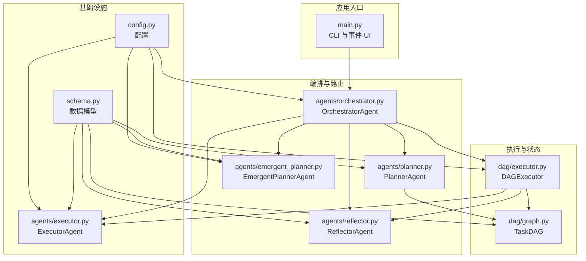
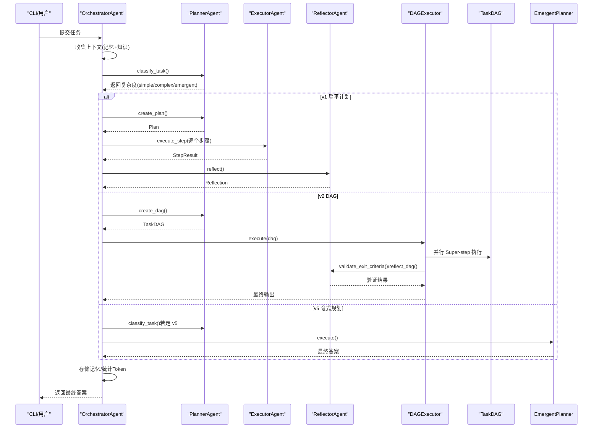
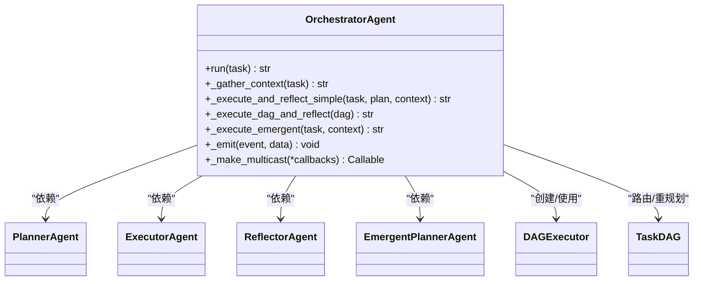
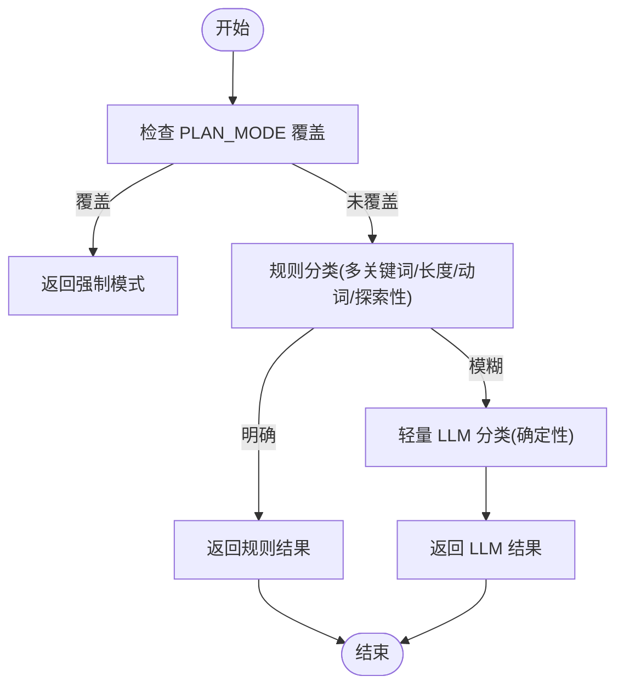
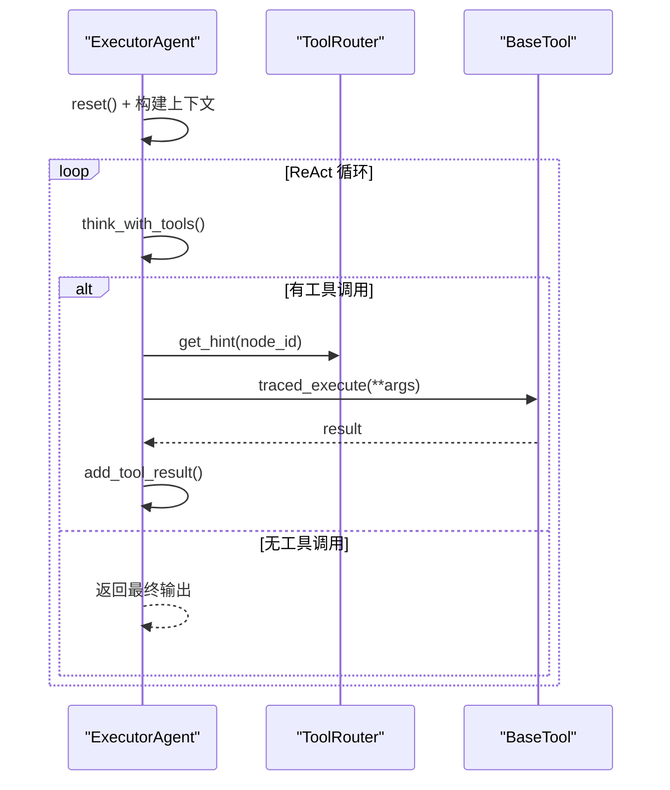
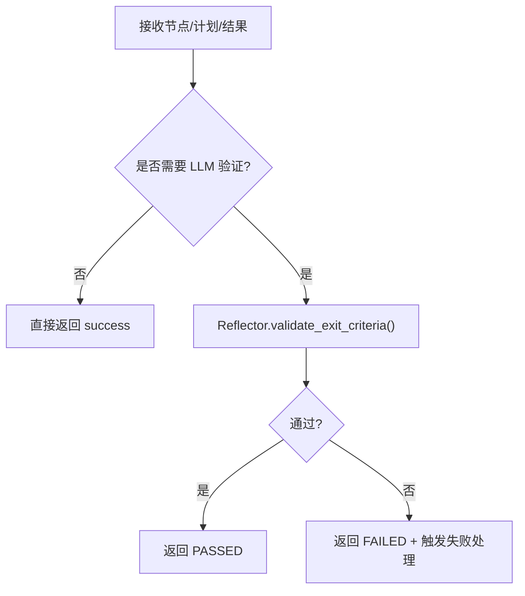
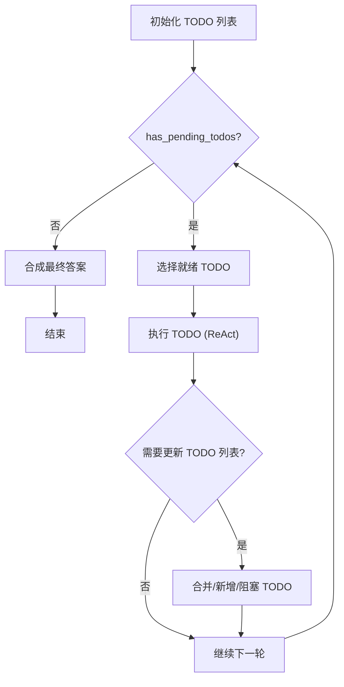
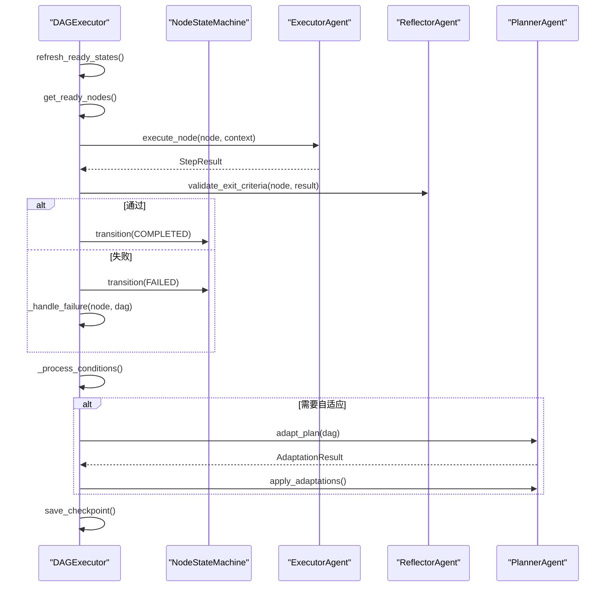
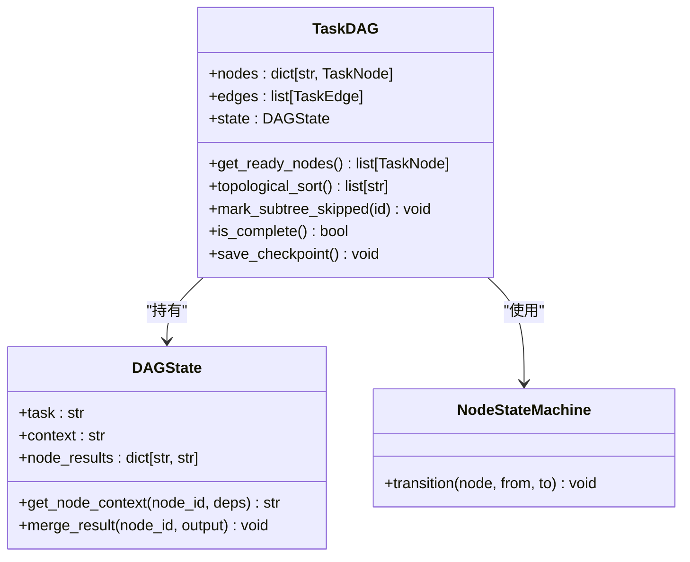
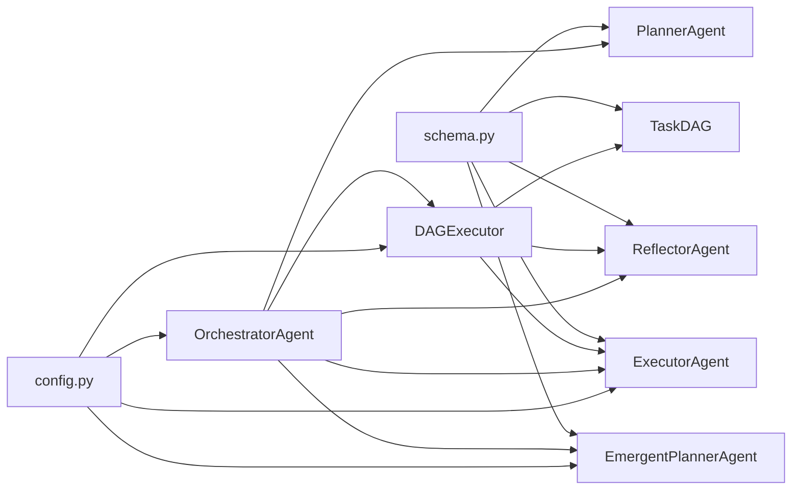

# 组件交互关系

<cite>
**本文引用的文件**
- [agents/orchestrator.py](file://agents/orchestrator.py)
- [agents/planner.py](file://agents/planner.py)
- [agents/executor.py](file://agents/executor.py)
- [agents/reflector.py](file://agents/reflector.py)
- [agents/emergent_planner.py](file://agents/emergent_planner.py)
- [dag/executor.py](file://dag/executor.py)
- [dag/graph.py](file://dag/graph.py)
- [schema.py](file://schema.py)
- [config.py](file://config.py)
- [main.py](file://main.py)
</cite>

## 目录
1. [简介](#简介)
2. [项目结构](#项目结构)
3. [核心组件](#核心组件)
4. [架构总览](#架构总览)
5. [详细组件分析](#详细组件分析)
6. [依赖关系分析](#依赖关系分析)
7. [性能考量](#性能考量)
8. [故障排查指南](#故障排查指南)
9. [结论](#结论)
10. [附录](#附录)

## 简介
本文件面向 manus_demo 的组件交互关系，聚焦 OrchestratorAgent 如何协调 Planner、Executor、Reflector、EmergentPlanner 等子智能体，以及 DAG 执行引擎与工具系统的集成方式。文档还涵盖事件驱动通信机制、生命周期管理、依赖注入模式、接口契约、消息格式规范与异常传播策略。

## 项目结构
项目采用“按职责分层 + 按功能聚合”的组织方式：
- agents：多智能体子系统（Orchestrator、Planner、Executor、Reflector、EmergentPlanner）
- dag：DAG 规划与执行引擎（TaskDAG、DAGExecutor）
- tools：工具抽象与具体实现（web_search、code_executor、file_ops、shell_tool）
- schema：核心数据模型（Plan、TaskDAG、Node/Edge 状态、TokenUsage 等）
- config：全局配置项（路由策略、执行限制、特性开关等）
- main：CLI 入口与事件驱动 UI

图表来源
- [main.py:415-493](file://main.py#L415-L493)
- [agents/orchestrator.py:94-152](file://agents/orchestrator.py#L94-L152)
- [agents/planner.py:147-206](file://agents/planner.py#L147-L206)
- [agents/executor.py:66-125](file://agents/executor.py#L66-L125)
- [agents/reflector.py:59-83](file://agents/reflector.py#L59-L83)
- [agents/emergent_planner.py:72-128](file://agents/emergent_planner.py#L72-L128)
- [dag/executor.py:62-104](file://dag/executor.py#L62-L104)
- [dag/graph.py:43-81](file://dag/graph.py#L43-L81)
- [schema.py:77-253](file://schema.py#L77-L253)
- [config.py:13-109](file://config.py#L13-L109)

章节来源
- [main.py:415-493](file://main.py#L415-L493)
- [agents/orchestrator.py:94-152](file://agents/orchestrator.py#L94-L152)
- [agents/planner.py:147-206](file://agents/planner.py#L147-L206)
- [agents/executor.py:66-125](file://agents/executor.py#L66-L125)
- [agents/reflector.py:59-83](file://agents/reflector.py#L59-L83)
- [agents/emergent_planner.py:72-128](file://agents/emergent_planner.py#L72-L128)
- [dag/executor.py:62-104](file://dag/executor.py#L62-L104)
- [dag/graph.py:43-81](file://dag/graph.py#L43-L81)
- [schema.py:77-253](file://schema.py#L77-L253)
- [config.py:13-109](file://config.py#L13-L109)

## 核心组件
- OrchestratorAgent：多智能体流水线的中央协调者，负责上下文收集、任务复杂度分类、路由到 v1/v2/v5 路径、执行与反思、记忆存储与事件广播。
- PlannerAgent：混合路由规划器，两阶段分类（规则快筛 + LLM 兜底），支持 v1 扁平计划、v2 DAG、v5 隐式规划，以及 v3 自适应规划。
- ExecutorAgent：ReAct 执行器，支持 v1 步骤执行与 v2 节点执行，集成统一 ReActEngine（可选）。
- ReflectorAgent：质量门控与反思器，对 v1 执行结果与 v2 DAG 执行进行评估，给出通过/失败、评分与建议。
- EmergentPlannerAgent：隐式规划器，基于 TODO 列表的 while(tool_use) 主循环，Claude Code 风格。
- DAGExecutor：DAG 执行引擎，基于 Super-step 的并行执行模型，支持条件边、回滚、失败处理、自适应规划与输出汇总。
- TaskDAG：有向无环图，承载节点、边、集中式状态与检查点，提供就绪节点发现、拓扑排序、失败级联跳过等能力。
- schema：统一的数据模型（Plan、TaskNode/TaskEdge、DAGState、StepResult、Reflection、TodoList 等）。
- config：全局配置，控制路由策略、执行限制、特性开关与可观测性参数。

章节来源
- [agents/orchestrator.py:60-152](file://agents/orchestrator.py#L60-L152)
- [agents/planner.py:147-206](file://agents/planner.py#L147-L206)
- [agents/executor.py:66-125](file://agents/executor.py#L66-L125)
- [agents/reflector.py:59-83](file://agents/reflector.py#L59-L83)
- [agents/emergent_planner.py:72-128](file://agents/emergent_planner.py#L72-L128)
- [dag/executor.py:62-104](file://dag/executor.py#L62-L104)
- [dag/graph.py:43-81](file://dag/graph.py#L43-L81)
- [schema.py:77-253](file://schema.py#L77-L253)
- [config.py:13-109](file://config.py#L13-L109)

## 架构总览
OrchestratorAgent 作为顶层编排者，通过事件驱动与多播桥接 TracingBridge，将 UI 事件与链路追踪并行输出。其内部依赖注入子智能体与工具，按任务复杂度路由到 v1 扁平计划、v2 DAG 并行执行，或 v5 隐式规划路径。DAGExecutor 与 TaskDAG 协作，实现条件分支、回滚、失败处理与自适应规划；ReflectorAgent 在每个阶段充当质量门控；ExecutorAgent 负责 ReAct 循环与工具调用；PlannerAgent 提供规划与重规划能力。

图表来源
- [agents/orchestrator.py:158-222](file://agents/orchestrator.py#L158-L222)
- [agents/planner.py:213-259](file://agents/planner.py#L213-L259)
- [agents/executor.py:171-188](file://agents/executor.py#L171-L188)
- [agents/reflector.py:202-254](file://agents/reflector.py#L202-L254)
- [agents/emergent_planner.py:134-276](file://agents/emergent_planner.py#L134-L276)
- [dag/executor.py:110-264](file://dag/executor.py#L110-L264)
- [dag/graph.py:101-126](file://dag/graph.py#L101-L126)

章节来源
- [agents/orchestrator.py:158-222](file://agents/orchestrator.py#L158-L222)
- [agents/planner.py:213-259](file://agents/planner.py#L213-L259)
- [agents/executor.py:171-188](file://agents/executor.py#L171-L188)
- [agents/reflector.py:202-254](file://agents/reflector.py#L202-L254)
- [agents/emergent_planner.py:134-276](file://agents/emergent_planner.py#L134-L276)
- [dag/executor.py:110-264](file://dag/executor.py#L110-L264)
- [dag/graph.py:101-126](file://dag/graph.py#L101-L126)

## 详细组件分析

### OrchestratorAgent：多智能体编排与事件驱动
- 依赖注入：通过构造函数注入 LLMClient、工具列表、事件回调；可选 TracingBridge 多播桥接。
- 生命周期：run() 为主线程，串联上下文收集、复杂度分类、路由执行、反思与记忆存储。
- 事件驱动：_emit() 将内部状态与阶段性结果广播给 UI；_make_multicast() 支持多订阅者隔离失败。
- v1/v2/v5 路由：根据 Planner.classify_task() 结果选择路径；支持最大重规划次数与部分重规划（DAG 子树）。
- DAG 集成：DAGExecutor 作为执行器，注入 Planner 以支持自适应规划；将 DAG 状态机注入 DAG，确保 UI 事件一致性。

图表来源
- [agents/orchestrator.py:94-152](file://agents/orchestrator.py#L94-L152)
- [agents/orchestrator.py:439-508](file://agents/orchestrator.py#L439-L508)
- [agents/orchestrator.py:370-432](file://agents/orchestrator.py#L370-L432)
- [agents/orchestrator.py:257-352](file://agents/orchestrator.py#L257-L352)
- [dag/executor.py:87-104](file://dag/executor.py#L87-L104)
- [dag/graph.py:43-81](file://dag/graph.py#L43-L81)

章节来源
- [agents/orchestrator.py:94-152](file://agents/orchestrator.py#L94-L152)
- [agents/orchestrator.py:158-222](file://agents/orchestrator.py#L158-L222)
- [agents/orchestrator.py:257-352](file://agents/orchestrator.py#L257-L352)
- [agents/orchestrator.py:370-432](file://agents/orchestrator.py#L370-L432)
- [agents/orchestrator.py:439-508](file://agents/orchestrator.py#L439-L508)
- [dag/executor.py:87-104](file://dag/executor.py#L87-L104)
- [dag/graph.py:43-81](file://dag/graph.py#L43-L81)

### PlannerAgent：混合路由与自适应规划
- 两阶段分类：规则快筛（零成本）+ LLM 兜底（~60 tokens），支持 emergent 模式降级。
- v1：扁平 Plan（2-6 步），顺序执行。
- v2：层次化 TaskDAG（Goal/SubGoal/Action），支持条件边、回滚边与完成判据。
- v3：自适应规划（adapt_plan + apply_adaptations），在执行中动态调整待执行节点。
- 重规划：v1 局部重规划（失败步骤）、v2 局部重规划（失败子树）。

图表来源
- [agents/planner.py:213-259](file://agents/planner.py#L213-L259)
- [agents/planner.py:261-327](file://agents/planner.py#L261-L327)
- [agents/planner.py:329-362](file://agents/planner.py#L329-L362)

章节来源
- [agents/planner.py:213-259](file://agents/planner.py#L213-L259)
- [agents/planner.py:261-327](file://agents/planner.py#L261-L327)
- [agents/planner.py:329-362](file://agents/planner.py#L329-L362)
- [agents/planner.py:513-566](file://agents/planner.py#L513-L566)
- [agents/planner.py:573-672](file://agents/planner.py#L573-L672)

### ExecutorAgent：ReAct 执行与工具集成
- v1：execute_step() 针对 Plan.Step 的 ReAct 循环。
- v2：execute_node() 针对 TaskNode 的 ReAct 循环，从 DAGState 构建上下文。
- v6.0：可选统一 ReActEngine 集成，减少重复逻辑。
- 工具路由：ToolRouter 提供失败后的工具切换建议，提升鲁棒性。
- 错误处理：检测工具返回的错误标记，记录 ToolCallRecord，避免单节点异常影响兄弟节点。

图表来源
- [agents/executor.py:171-188](file://agents/executor.py#L171-L188)
- [agents/executor.py:271-321](file://agents/executor.py#L271-L321)
- [agents/executor.py:240-250](file://agents/executor.py#L240-L250)

章节来源
- [agents/executor.py:171-188](file://agents/executor.py#L171-L188)
- [agents/executor.py:271-321](file://agents/executor.py#L271-L321)
- [agents/executor.py:240-250](file://agents/executor.py#L240-L250)

### ReflectorAgent：质量门控与反思
- v1：reflect(task, plan, results) 评估整体结果，输出通过/失败、评分与建议。
- v2：validate_exit_criteria(node, result) 轻量级逐节点验证；reflect_dag(dag, results) 评估完整 DAG。
- 异常处理：验证失败或解析失败时返回失败，触发重规划。

图表来源
- [agents/reflector.py:90-128](file://agents/reflector.py#L90-L128)
- [agents/reflector.py:135-195](file://agents/reflector.py#L135-L195)
- [agents/reflector.py:202-254](file://agents/reflector.py#L202-L254)

章节来源
- [agents/reflector.py:90-128](file://agents/reflector.py#L90-L128)
- [agents/reflector.py:135-195](file://agents/reflector.py#L135-L195)
- [agents/reflector.py:202-254](file://agents/reflector.py#L202-L254)

### EmergentPlannerAgent：隐式规划与 TODO 列表
- v5：Claude Code 风格，无预定义计划，通过 TODO 列表在执行中自然涌现。
- 主循环：初始化 TODO 列表 → while(has_pending_todos) → 选择就绪 TODO → ReAct 执行 → 更新 TODO 列表 → 汇总答案。
- 健壮性：停滞检测、超时保护、失败重试与阻塞标记、最大 TODO 数限制。
- v6.0：可选 ReActEngine 集成。

图表来源
- [agents/emergent_planner.py:134-276](file://agents/emergent_planner.py#L134-L276)
- [agents/emergent_planner.py:283-346](file://agents/emergent_planner.py#L283-L346)
- [agents/emergent_planner.py:347-459](file://agents/emergent_planner.py#L347-L459)

章节来源
- [agents/emergent_planner.py:134-276](file://agents/emergent_planner.py#L134-L276)
- [agents/emergent_planner.py:283-346](file://agents/emergent_planner.py#L283-L346)
- [agents/emergent_planner.py:347-459](file://agents/emergent_planner.py#L347-L459)

### DAGExecutor：并行 Super-step 执行引擎
- Super-step：每轮发现就绪节点（依赖满足），最多 MAX_PARALLEL_NODES 并行执行，超时保护。
- 状态机：统一 NodeStateMachine 管理节点状态转移（PENDING/READY/RUNNING/COMPLETED/FAILED/SKIPPED/ROLLED_BACK）。
- 条件边：运行时根据源节点结果匹配条件关键词，激活或跳过目标节点。
- 回滚与失败处理：失败节点触发回滚边（清理/撤销），失败节点下游子树级联跳过。
- 自适应规划：按间隔与完成数触发 Planner.adapt_plan()，动态增删改节点。
- 输出汇总：按拓扑序汇总 ACTION 节点结果。

图表来源
- [dag/executor.py:110-264](file://dag/executor.py#L110-L264)
- [dag/executor.py:271-310](file://dag/executor.py#L271-L310)
- [dag/executor.py:337-399](file://dag/executor.py#L337-L399)
- [dag/executor.py:405-473](file://dag/executor.py#L405-L473)
- [dag/executor.py:601-632](file://dag/executor.py#L601-L632)

章节来源
- [dag/executor.py:110-264](file://dag/executor.py#L110-L264)
- [dag/executor.py:271-310](file://dag/executor.py#L271-L310)
- [dag/executor.py:337-399](file://dag/executor.py#L337-L399)
- [dag/executor.py:405-473](file://dag/executor.py#L405-L473)
- [dag/executor.py:601-632](file://dag/executor.py#L601-L632)

### TaskDAG：集中式状态与动态图
- 节点与边：GOAL/SUBGOAL/ACTION 三层结构；DEPENDENCY/CONDITIONAL/ROLLBACK 三种边。
- 集中式状态：DAGState.node_results 作为唯一真相源，节点并行写入互不冲突。
- 就绪发现：运行时扫描依赖满足情况，动态发现可并行节点。
- 拓扑排序：Kahn 算法，保证执行顺序合法。
- 动态变更：v3 支持运行时 add/remove/modify 节点与边，自动维护邻接表并检测环。
- 检查点：保存状态快照，支持调试与恢复。

图表来源
- [dag/graph.py:43-81](file://dag/graph.py#L43-L81)
- [dag/graph.py:101-126](file://dag/graph.py#L101-L126)
- [dag/graph.py:219-249](file://dag/graph.py#L219-L249)
- [dag/graph.py:341-399](file://dag/graph.py#L341-L399)
- [dag/graph.py:521-542](file://dag/graph.py#L521-L542)

章节来源
- [dag/graph.py:43-81](file://dag/graph.py#L43-L81)
- [dag/graph.py:101-126](file://dag/graph.py#L101-L126)
- [dag/graph.py:219-249](file://dag/graph.py#L219-L249)
- [dag/graph.py:341-399](file://dag/graph.py#L341-L399)
- [dag/graph.py:521-542](file://dag/graph.py#L521-L542)

### 事件驱动通信机制
- 事件类型：任务开始、阶段切换、记忆/知识、复杂度、计划、步骤、DAG 创建、Super-step、节点状态、条件评估、自适应规划、反思、Token 汇总、任务完成等。
- 事件传递路径：各组件通过 _emit/on_event 广播；UI 侧 on_event() 统一渲染；TracingBridge 与原始回调并行。
- 异常传播：事件回调失败被隔离，不影响主流程；TracingBridge 亦采用相同策略。

章节来源
- [agents/orchestrator.py:590-600](file://agents/orchestrator.py#L590-L600)
- [agents/orchestrator.py:570-588](file://agents/orchestrator.py#L570-L588)
- [main.py:184-390](file://main.py#L184-L390)

### 生命周期管理
- 初始化：CLI 构造 LLMClient 与工具列表，注入 OrchestratorAgent；可选 TracingBridge 多播。
- 运行：Orchestrator.run() 执行完整生命周期；DAGExecutor 持续 Super-step 直到完成或超步。
- 销毁：程序退出；DAGExecutor 保存检查点；Orchestrator 存储长期记忆。

章节来源
- [main.py:448-492](file://main.py#L448-L492)
- [agents/orchestrator.py:158-222](file://agents/orchestrator.py#L158-L222)
- [dag/executor.py:253-264](file://dag/executor.py#L253-L264)

### 依赖注入模式
- 构造函数注入：OrchestratorAgent 注入 LLMClient、工具列表、事件回调；子智能体同样通过构造函数注入依赖。
- 可插拔工具：工具列表可扩展，ToolRouter 提供失败切换提示。
- 特性开关：ENABLE_REACT_ENGINE_V2、ENABLE_GOAL_DRIVEN_PLANNER 等通过 config 控制行为。

章节来源
- [agents/orchestrator.py:94-152](file://agents/orchestrator.py#L94-L152)
- [agents/executor.py:92-125](file://agents/executor.py#L92-L125)
- [agents/emergent_planner.py:90-128](file://agents/emergent_planner.py#L90-L128)
- [config.py:78-96](file://config.py#L78-L96)

### 接口契约与消息格式
- 统一数据模型：schema.py 定义 Plan、TaskNode/TaskEdge、DAGState、StepResult、Reflection、TodoList 等。
- LLM 输出契约：Planner/Reflector/EmergentPlanner 使用 think_json() 期望 JSON；失败时有默认降级策略。
- 工具调用契约：ExecutorAgent/ToolRouter 记录 ToolCallRecord，便于 UI 展示与调试。

章节来源
- [schema.py:77-253](file://schema.py#L77-L253)
- [schema.py:352-361](file://schema.py#L352-L361)
- [schema.py:342-350](file://schema.py#L342-L350)
- [agents/planner.py:342-362](file://agents/planner.py#L342-L362)
- [agents/reflector.py:171-195](file://agents/reflector.py#L171-L195)
- [agents/emergent_planner.py:521-543](file://agents/emergent_planner.py#L521-L543)

## 依赖关系分析
- 组件耦合：OrchestratorAgent 与 Planner/Executor/Reflector/EmergentPlanner 高内聚、低耦合；DAGExecutor 与 TaskDAG 强耦合但职责清晰。
- 外部依赖：LLMClient、工具系统、TracingBridge（可选）。
- 配置依赖：config.py 提供路由策略、执行限制、特性开关，影响各组件行为。

图表来源
- [config.py:13-109](file://config.py#L13-L109)
- [agents/orchestrator.py:94-152](file://agents/orchestrator.py#L94-L152)
- [dag/executor.py:87-104](file://dag/executor.py#L87-L104)
- [schema.py:77-253](file://schema.py#L77-L253)

章节来源
- [config.py:13-109](file://config.py#L13-L109)
- [agents/orchestrator.py:94-152](file://agents/orchestrator.py#L94-L152)
- [dag/executor.py:87-104](file://dag/executor.py#L87-L104)
- [schema.py:77-253](file://schema.py#L77-L253)

## 性能考量
- 并行执行：DAGExecutor 每轮最多 MAX_PARALLEL_NODES 并行，避免资源争用。
- 超时保护：单节点执行超时 NODE_EXECUTION_TIMEOUT，防止卡死拖垮批次。
- 令牌追踪：LLMClient 统计 per-call 与按引擎汇总，支持 TokenUsageSummary。
- 自适应规划：按间隔与完成数触发 adapt_plan，避免频繁重规划。
- 事件渲染：UI 事件按需渲染，避免过度刷屏。

章节来源
- [config.py:44-59](file://config.py#L44-L59)
- [config.py:87-88](file://config.py#L87-L88)
- [dag/executor.py:296-310](file://dag/executor.py#L296-L310)
- [dag/executor.py:578-599](file://dag/executor.py#L578-L599)
- [main.py:113-177](file://main.py#L113-L177)

## 故障排查指南
- 任务复杂度误判：检查 PLAN_MODE 与规则分类阈值；必要时开启 emergent 模式降级。
- DAG 卡住：查看 DAG.get_blockage_report()，确认阻塞节点与依赖；检查条件边匹配策略。
- 节点失败：关注 FAILED->ROLLED_BACK/SKIPPED 转移；回滚边是否成功；下游子树是否正确跳过。
- 事件丢失：确认 on_event 多播桥接；TracingBridge 初始化幂等。
- 工具失败：启用 ToolRouter 失败阈值；查看 ToolCallRecord；必要时更换工具。
- Token 消耗异常：核对 TOKEN_TRACKING_ENABLED；检查 per-call 与 by_engine 汇总。

章节来源
- [agents/orchestrator.py:570-588](file://agents/orchestrator.py#L570-L588)
- [dag/graph.py:277-312](file://dag/graph.py#L277-L312)
- [dag/executor.py:337-399](file://dag/executor.py#L337-L399)
- [main.py:184-390](file://main.py#L184-L390)
- [schema.py:342-350](file://schema.py#L342-L350)

## 结论
manus_demo 通过 OrchestratorAgent 将 Planner、Executor、Reflector、EmergentPlanner 与 DAG 执行引擎有机整合，形成“规则快筛 + LLM 兜底”的混合路由体系。DAGExecutor 以 Super-step 并行模型实现高吞吐、条件分支与回滚的稳健执行；事件驱动与集中式状态（DAGState）确保可观测性与可调试性。依赖注入与配置开关使系统具备良好的可扩展性与向后兼容性。

## 附录
- 配置项速览：PLAN_MODE、MAX_PARALLEL_NODES、NODE_EXECUTION_TIMEOUT、ADAPTIVE_PLANNING_ENABLED、ENABLE_REACT_ENGINE_V2、EMERGENT_PLANNING_ENABLED、TRACING_ENABLED 等。
- 数据模型速览：Plan/Step、TaskDAG/TaskNode/TaskEdge、DAGState、StepResult、Reflection、TodoList/TodoItem 等。

章节来源
- [config.py:40-96](file://config.py#L40-L96)
- [schema.py:47-67](file://schema.py#L47-L67)
- [schema.py:157-187](file://schema.py#L157-L187)
- [schema.py:192-253](file://schema.py#L192-L253)
- [schema.py:352-361](file://schema.py#L352-L361)
- [schema.py:384-420](file://schema.py#L384-L420)