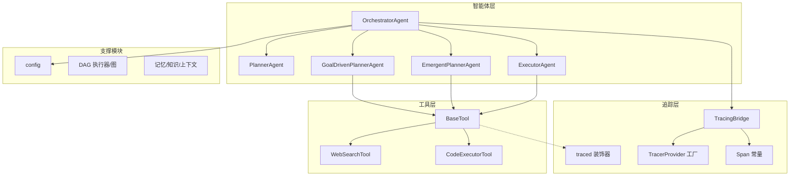
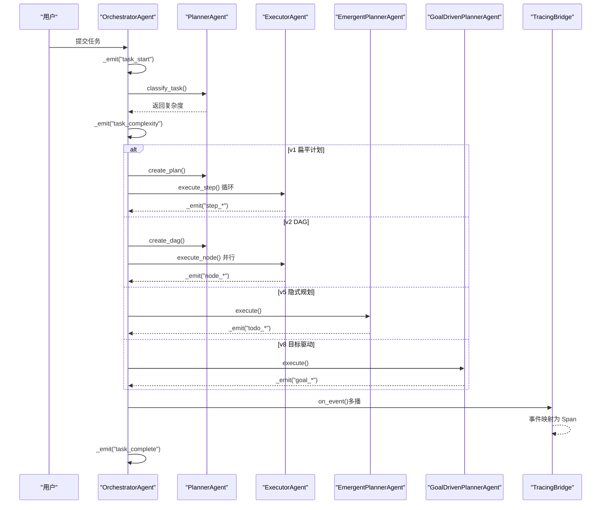
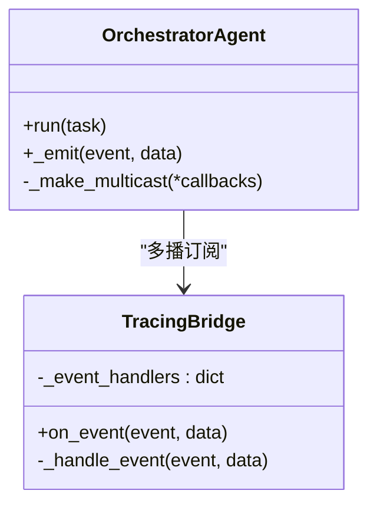
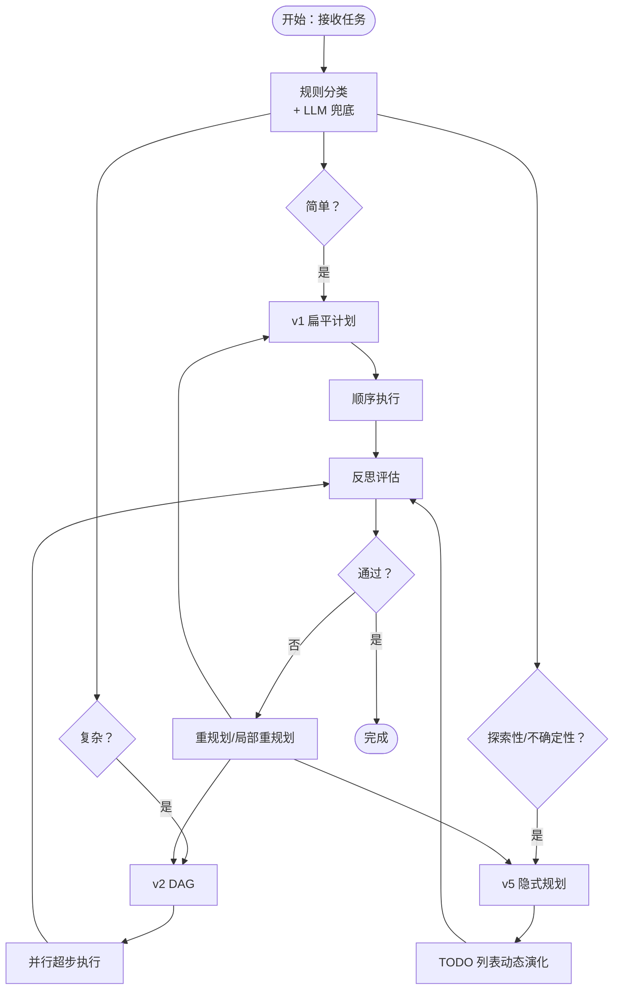
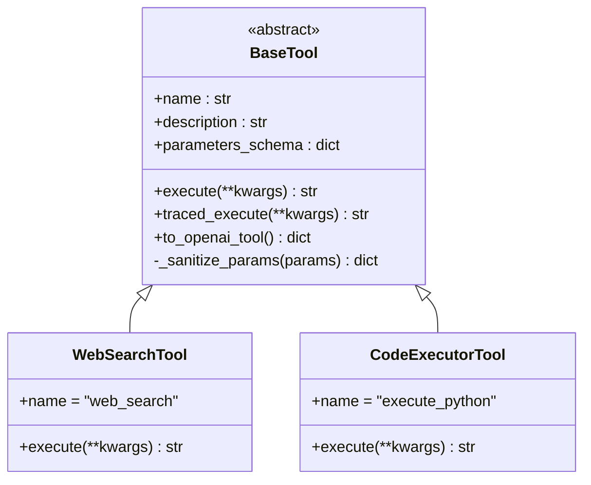
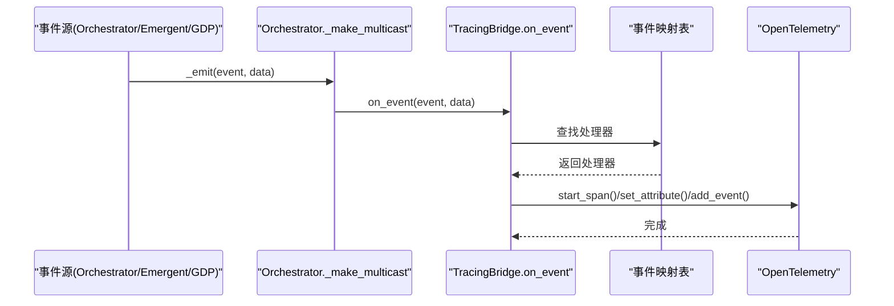
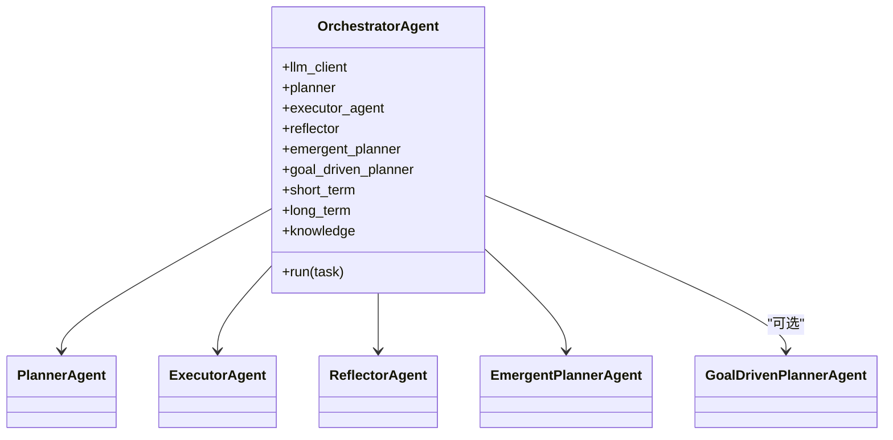
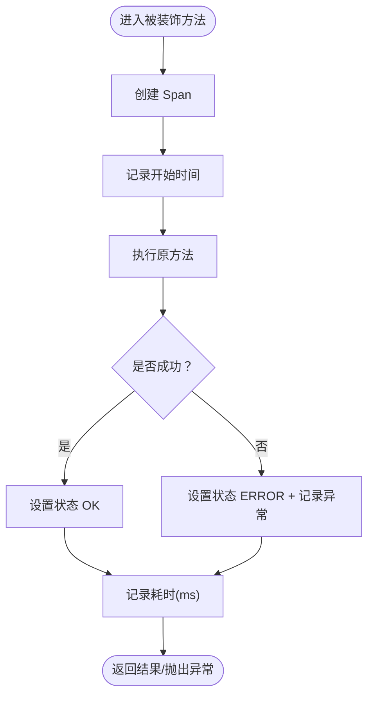
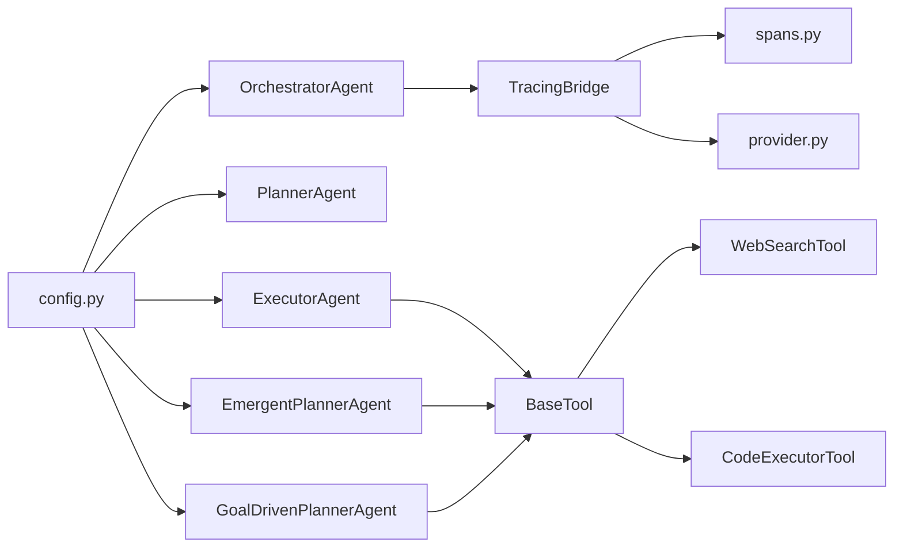

# 设计模式应用

<cite>
**本文引用的文件**
- [agents/base.py](file://agents/base.py)
- [tools/base.py](file://tools/base.py)
- [tracing/bridge.py](file://tracing/bridge.py)
- [tracing/decorators.py](file://tracing/decorators.py)
- [tracing/spans.py](file://tracing/spans.py)
- [tracing/provider.py](file://tracing/provider.py)
- [agents/planner.py](file://agents/planner.py)
- [agents/orchestrator.py](file://agents/orchestrator.py)
- [agents/emergent_planner.py](file://agents/emergent_planner.py)
- [agents/goal_driven_planner.py](file://agents/goal_driven_planner.py)
- [agents/executor.py](file://agents/executor.py)
- [tools/code_executor.py](file://tools/code_executor.py)
- [tools/web_search.py](file://tools/web_search.py)
- [config.py](file://config.py)
</cite>

## 目录
1. [引言](#引言)
2. [项目结构](#项目结构)
3. [核心组件](#核心组件)
4. [架构总览](#架构总览)
5. [详细组件分析](#详细组件分析)
6. [依赖分析](#依赖分析)
7. [性能考虑](#性能考虑)
8. [故障排查指南](#故障排查指南)
9. [结论](#结论)
10. [附录](#附录)

## 引言
本文件聚焦于 manus_demo 中的设计模式应用，系统梳理事件驱动架构、策略模式、代理模式、适配器模式、工厂模式与装饰器模式在项目中的落地方式与最佳实践。重点涵盖：
- 事件驱动架构与观察者模式：通过事件回调系统实现模块间松耦合，TracingBridge 将事件流适配为 OpenTelemetry Span。
- 策略模式：PlannerAgent 在 v1/v2/v5 路径间动态选择执行策略，统一接口支持多模式路由。
- 代理模式：BaseTool 为具体工具提供统一接口与追踪增强，traced_execute 作为代理方法在开启追踪时包装执行。
- 适配器模式：TracingBridge 作为事件到 Span 的适配器，将既有事件系统无缝接入 OpenTelemetry。
- 工厂模式：根据配置动态创建不同类型的规划器（v4/v5/v8），OrchestratorAgent 在运行时装配子组件。
- 装饰器模式：@traced 装饰器为方法提供声明式埋点，无需侵入业务逻辑。

## 项目结构
manus_demo 采用“按职责分层 + 按功能聚合”的组织方式：
- agents：智能体层（Planner、Executor、EmergentPlanner、GoalDrivenPlanner、Reflector、Orchestrator）
- tools：工具层（BaseTool 抽象 + 具体工具）
- tracing：追踪层（桥接器、装饰器、提供者、常量）
- dag/memory/knowledge/llm/context/schema：支撑模块
- config：全局配置与特征开关

图表来源
- [agents/orchestrator.py:60-150](file://agents/orchestrator.py#L60-L150)
- [agents/planner.py:147-210](file://agents/planner.py#L147-L210)
- [agents/executor.py:66-125](file://agents/executor.py#L66-L125)
- [agents/emergent_planner.py:72-128](file://agents/emergent_planner.py#L72-L128)
- [agents/goal_driven_planner.py:214-255](file://agents/goal_driven_planner.py#L214-L255)
- [tools/base.py:22-75](file://tools/base.py#L22-L75)
- [tools/web_search.py:56-113](file://tools/web_search.py#L56-L113)
- [tools/code_executor.py:25-102](file://tools/code_executor.py#L25-L102)
- [tracing/bridge.py:38-116](file://tracing/bridge.py#L38-L116)
- [tracing/decorators.py:70-146](file://tracing/decorators.py#L70-L146)
- [tracing/provider.py:45-137](file://tracing/provider.py#L45-L137)
- [tracing/spans.py:18-81](file://tracing/spans.py#L18-L81)
- [config.py:38-109](file://config.py#L38-L109)

章节来源
- [agents/orchestrator.py:60-150](file://agents/orchestrator.py#L60-L150)
- [config.py:38-109](file://config.py#L38-L109)

## 核心组件
- OrchestratorAgent：多智能体流水线的中央协调者，负责上下文收集、复杂度分类、路由到 v1/v2/v5 路径，并在反思失败时进行重规划与记忆存储。
- PlannerAgent：混合规划器，结合规则快筛与轻量 LLM 分类，自动选择 v1 扁平计划、v2 DAG 或 v5 隐式规划路径。
- ExecutorAgent：ReAct 执行器，封装思考-行动-观察循环，支持统一/遗留两种 ReAct 引擎。
- EmergentPlannerAgent：Claude Code 风格的隐式规划，通过 TODO 列表动态演化实现“涌现式”规划。
- GoalDrivenPlannerAgent：v8 目标驱动引擎，以终为始，逆向规划里程碑，持续目标反思与锚定。
- BaseTool：工具抽象接口，统一 name/description/parameters_schema/execute，并提供 traced_execute 代理方法。
- TracingBridge：事件到 Span 的桥接器，订阅 Orchestrator/Emergent/GDP 等发出的事件，生成 OTel Span。
- traced 装饰器：为方法提供声明式埋点，自动记录延迟、状态与异常。
- TracerProvider 工厂：根据配置初始化 OpenTelemetry SDK，支持多种导出后端。

章节来源
- [agents/orchestrator.py:60-150](file://agents/orchestrator.py#L60-L150)
- [agents/planner.py:147-210](file://agents/planner.py#L147-L210)
- [agents/executor.py:66-125](file://agents/executor.py#L66-L125)
- [agents/emergent_planner.py:72-128](file://agents/emergent_planner.py#L72-L128)
- [agents/goal_driven_planner.py:214-255](file://agents/goal_driven_planner.py#L214-L255)
- [tools/base.py:22-75](file://tools/base.py#L22-L75)
- [tracing/bridge.py:38-116](file://tracing/bridge.py#L38-L116)
- [tracing/decorators.py:70-146](file://tracing/decorators.py#L70-L146)
- [tracing/provider.py:45-137](file://tracing/provider.py#L45-L137)

## 架构总览
manus_demo 的事件驱动架构通过 on_event 回调实现模块间通信，TracingBridge 订阅这些事件并转换为 OpenTelemetry Span，形成“事件驱动 + 全链路追踪”的双轨体系。策略模式体现在 PlannerAgent 的路由选择，代理模式体现在 BaseTool 的 traced_execute，适配器模式体现在 TracingBridge，工厂模式体现在 OrchestratorAgent 的动态装配，装饰器模式体现在 @traced。

图表来源
- [agents/orchestrator.py:158-222](file://agents/orchestrator.py#L158-L222)
- [agents/planner.py:213-259](file://agents/planner.py#L213-L259)
- [agents/executor.py:171-188](file://agents/executor.py#L171-L188)
- [agents/emergent_planner.py:134-276](file://agents/emergent_planner.py#L134-L276)
- [agents/goal_driven_planner.py:261-399](file://agents/goal_driven_planner.py#L261-L399)
- [tracing/bridge.py:117-143](file://tracing/bridge.py#L117-L143)

## 详细组件分析

### 事件驱动架构与观察者模式
- 事件系统：OrchestratorAgent、EmergentPlannerAgent、GoalDrivenPlannerAgent 通过 _emit/on_event 发布事件；TracingBridge 订阅事件并生成 Span。
- 观察者实现：TracingBridge 内部维护事件到处理器的映射表，异常安全地处理事件，保证追踪不影响主流程。
- 多播模式：Orchestrator 在初始化时将原始回调与 TracingBridge 组合为多播，确保 UI 与追踪并行工作。

图表来源
- [agents/orchestrator.py:570-588](file://agents/orchestrator.py#L570-L588)
- [tracing/bridge.py:117-143](file://tracing/bridge.py#L117-L143)

章节来源
- [agents/orchestrator.py:570-588](file://agents/orchestrator.py#L570-L588)
- [tracing/bridge.py:84-116](file://tracing/bridge.py#L84-L116)

### 策略模式：规划路径选择
- 统一接口：PlannerAgent 提供 classify_task/create_plan/create_dag/replan/replan_subtree/adapt_plan 等方法，屏蔽 v1/v2/v5 差异。
- 路由策略：classify_task 采用两阶段混合分类（规则快筛 + LLM 兜底），根据结果选择 v1 扁平计划、v2 DAG 或 v5 隐式规划；v8 可选目标驱动引擎。
- 适配与降级：当禁用 emergent 或 LLM 建议 emergent 时，自动降级为 complex。

图表来源
- [agents/planner.py:213-259](file://agents/planner.py#L213-L259)
- [agents/planner.py:369-431](file://agents/planner.py#L369-L431)
- [agents/planner.py:481-506](file://agents/planner.py#L481-L506)
- [agents/planner.py:513-566](file://agents/planner.py#L513-L566)
- [agents/orchestrator.py:194-212](file://agents/orchestrator.py#L194-L212)

章节来源
- [agents/planner.py:213-259](file://agents/planner.py#L213-L259)
- [agents/planner.py:369-431](file://agents/planner.py#L369-L431)
- [agents/planner.py:481-506](file://agents/planner.py#L481-L506)
- [agents/planner.py:513-566](file://agents/planner.py#L513-L566)
- [agents/orchestrator.py:194-212](file://agents/orchestrator.py#L194-L212)

### 代理模式：BaseTool 的统一接口与追踪增强
- 统一接口：BaseTool 定义 name/description/parameters_schema/execute，所有具体工具继承该接口。
- 代理方法：traced_execute 在 TRACING_ENABLED=true 时创建 Span 包装 execute，记录参数、耗时、结果与错误；否则直接调用 execute，零开销。
- 参数脱敏：对敏感字段进行递归清洗，避免泄露。
- 工具注册：工具通过 to_openai_tool 转换为 OpenAI function calling 格式。

图表来源
- [tools/base.py:22-175](file://tools/base.py#L22-L175)
- [tools/web_search.py:56-113](file://tools/web_search.py#L56-L113)
- [tools/code_executor.py:25-102](file://tools/code_executor.py#L25-L102)

章节来源
- [tools/base.py:60-147](file://tools/base.py#L60-L147)
- [tools/web_search.py:87-113](file://tools/web_search.py#L87-L113)
- [tools/code_executor.py:64-102](file://tools/code_executor.py#L64-L102)

### 适配器模式：TracingBridge 事件到 Span 的适配
- 适配职责：将 Orchestrator/Emergent/GDP 等发出的事件名称映射为标准化 SpanName，设置属性与事件，维持父子关系。
- 异常安全：on_event 对异常进行捕获与记录，不传播至调用方。
- 扩展性：事件到处理器映射表集中管理，便于新增事件类型。
- 语义常量：使用 spans.SpanName/AttrKey/EventName 统一语义，遵循 OpenTelemetry GenAI 规范。

图表来源
- [agents/orchestrator.py:106-114](file://agents/orchestrator.py#L106-L114)
- [tracing/bridge.py:117-143](file://tracing/bridge.py#L117-L143)
- [tracing/bridge.py:84-116](file://tracing/bridge.py#L84-L116)
- [tracing/spans.py:18-81](file://tracing/spans.py#L18-L81)

章节来源
- [tracing/bridge.py:117-143](file://tracing/bridge.py#L117-L143)
- [tracing/bridge.py:149-196](file://tracing/bridge.py#L149-L196)
- [tracing/bridge.py:299-316](file://tracing/bridge.py#L299-L316)
- [tracing/bridge.py:425-467](file://tracing/bridge.py#L425-L467)
- [tracing/spans.py:18-81](file://tracing/spans.py#L18-L81)

### 工厂模式：智能体创建与动态装配
- OrchestratorAgent 在构造时根据配置动态装配子组件：
  - PlannerAgent：统一规划器
  - ExecutorAgent：ReAct 执行器
  - ReflectorAgent：反思器
  - EmergentPlannerAgent：隐式规划（v5）
  - GoalDrivenPlannerAgent：目标驱动（v8，可选）
- 配置驱动：通过 config.PLAN_MODE、ENABLE_GOAL_DRIVEN_PLANNER 等开关控制行为。
- 多播事件：将原始 UI 回调与 TracingBridge 组合，形成事件广播。

图表来源
- [agents/orchestrator.py:94-150](file://agents/orchestrator.py#L94-L150)
- [agents/orchestrator.py:115-141](file://agents/orchestrator.py#L115-L141)

章节来源
- [agents/orchestrator.py:94-150](file://agents/orchestrator.py#L94-L150)
- [config.py:38-109](file://config.py#L38-L109)

### 装饰器模式：@traced 的声明式埋点
- 适用范围：@traced 可装饰同步/异步方法，自动创建 Span、记录耗时、状态与异常。
- 属性处理：借助 _truncate/_safe_set_attribute 确保属性长度与敏感信息保护。
- 与工具追踪协同：BaseTool.traced_execute 与 @traced 共用属性处理逻辑，保证一致的追踪体验。

图表来源
- [tracing/decorators.py:70-146](file://tracing/decorators.py#L70-L146)
- [tracing/decorators.py:30-68](file://tracing/decorators.py#L30-L68)
- [tools/base.py:60-124](file://tools/base.py#L60-L124)

章节来源
- [tracing/decorators.py:70-146](file://tracing/decorators.py#L70-L146)
- [tracing/decorators.py:30-68](file://tracing/decorators.py#L30-L68)
- [tools/base.py:60-124](file://tools/base.py#L60-L124)

## 依赖分析
- 事件与追踪：OrchestratorAgent 通过多播将事件同时发送给 UI 与 TracingBridge；TracingBridge 依赖 spans 常量与 provider 工厂。
- 工具与执行：ExecutorAgent/EmergentPlannerAgent/GoalDrivenPlannerAgent 依赖 BaseTool 抽象与工具集合；工具通过 traced_execute 统一接入追踪。
- 配置与特征开关：config.py 提供 PLAN_MODE、ENABLE_GOAL_DRIVEN_PLANNER、TRACING_ENABLED 等关键开关，影响运行时行为。

图表来源
- [config.py:38-109](file://config.py#L38-L109)
- [agents/orchestrator.py:94-150](file://agents/orchestrator.py#L94-L150)
- [tracing/bridge.py:38-116](file://tracing/bridge.py#L38-L116)
- [tracing/spans.py:18-81](file://tracing/spans.py#L18-L81)
- [tracing/provider.py:45-137](file://tracing/provider.py#L45-L137)
- [agents/executor.py:66-125](file://agents/executor.py#L66-L125)
- [agents/emergent_planner.py:72-128](file://agents/emergent_planner.py#L72-L128)
- [agents/goal_driven_planner.py:214-255](file://agents/goal_driven_planner.py#L214-L255)
- [tools/base.py:22-75](file://tools/base.py#L22-L75)
- [tools/web_search.py:56-113](file://tools/web_search.py#L56-L113)
- [tools/code_executor.py:25-102](file://tools/code_executor.py#L25-L102)

章节来源
- [config.py:38-109](file://config.py#L38-L109)
- [agents/orchestrator.py:94-150](file://agents/orchestrator.py#L94-L150)
- [tracing/bridge.py:38-116](file://tracing/bridge.py#L38-L116)
- [tracing/spans.py:18-81](file://tracing/spans.py#L18-L81)
- [tracing/provider.py:45-137](file://tracing/provider.py#L45-L137)
- [agents/executor.py:66-125](file://agents/executor.py#L66-L125)
- [agents/emergent_planner.py:72-128](file://agents/emergent_planner.py#L72-L128)
- [agents/goal_driven_planner.py:214-255](file://agents/goal_driven_planner.py#L214-L255)
- [tools/base.py:22-75](file://tools/base.py#L22-L75)
- [tools/web_search.py:56-113](file://tools/web_search.py#L56-L113)
- [tools/code_executor.py:25-102](file://tools/code_executor.py#L25-L102)

## 性能考虑
- 事件驱动与多播：事件发布为 O(1)，多播通过独立 try-except 隔离，避免追踪失败影响主流程。
- 追踪开销控制：BaseTool.traced_execute 在 TRACING_ENABLED=false 时零开销；装饰器与属性处理均具备短路与截断逻辑。
- 并行与超步：DAG 执行采用 MAX_PARALLEL_NODES 控制并行度；节点超时与停滞检测减少资源浪费。
- 上下文压缩：BaseAgent 与 ContextManager 在消息过长时自动压缩，降低 Token 消耗。
- 工具并发限制：工具类通过 asyncio.Semaphore 控制并发，避免资源争用。

## 故障排查指南
- 追踪未生效
  - 检查 TRACING_ENABLED、TRACING_BACKEND、TRACING_ENDPOINT 等配置。
  - 确认 provider.init_tracing() 已被调用且未被重复初始化。
- 事件未生成 Span
  - 确认事件名称在 TracingBridge._event_handlers 中存在映射。
  - 检查异常安全日志，确认 on_event 是否被调用。
- 工具执行失败
  - 检查工具参数 schema 与参数值；查看 BaseTool._sanitize_params 是否误删必要字段。
  - 确认工具返回字符串格式，避免非字符串导致属性记录异常。
- 规划路径不符合预期
  - 检查 PLAN_MODE 与 EMERGENT_PLANNING_ENABLED；确认规则分类阈值与 LLM 分类温度设置。
- 目标驱动停滞
  - 调整 GOAL_REFLECTION_INTERVAL、GOAL_REANCHOR_INTERVAL、GOAL_DRIVEN_STAGNATION_WINDOW。

章节来源
- [config.py:102-109](file://config.py#L102-L109)
- [tracing/provider.py:45-137](file://tracing/provider.py#L45-L137)
- [tracing/bridge.py:117-143](file://tracing/bridge.py#L117-L143)
- [tools/base.py:60-147](file://tools/base.py#L60-L147)
- [agents/planner.py:231-259](file://agents/planner.py#L231-L259)
- [agents/goal_driven_planner.py:308-329](file://agents/goal_driven_planner.py#L308-L329)

## 结论
manus_demo 通过事件驱动与观察者模式实现模块解耦，借助策略模式在 v1/v2/v5 路径间灵活切换，利用代理模式统一工具接口与追踪增强，通过适配器模式将既有事件系统无缝接入 OpenTelemetry，配合工厂模式与装饰器模式，构建了高内聚、低耦合、可观测、可扩展的智能体执行框架。建议在生产环境中启用 TRACING_ENABLED 并合理配置采样率与导出后端，以获得完整的全链路视图。

## 附录
- 术语
  - 事件驱动：以事件为媒介的异步通信模式。
  - 观察者：一对多的依赖关系，当主题状态变化时通知所有观察者。
  - 策略：同一接口多种算法实现，运行时可切换。
  - 代理：为真实对象提供替身，控制访问并增加额外功能。
  - 适配器：将一个接口转换为客户期望的另一个接口。
  - 工厂：根据输入参数动态创建对象实例。
  - 装饰器：在不改变原函数行为的前提下，为函数增加新功能。