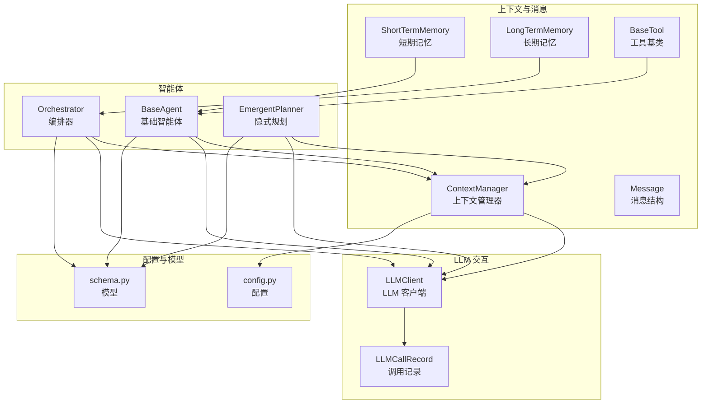
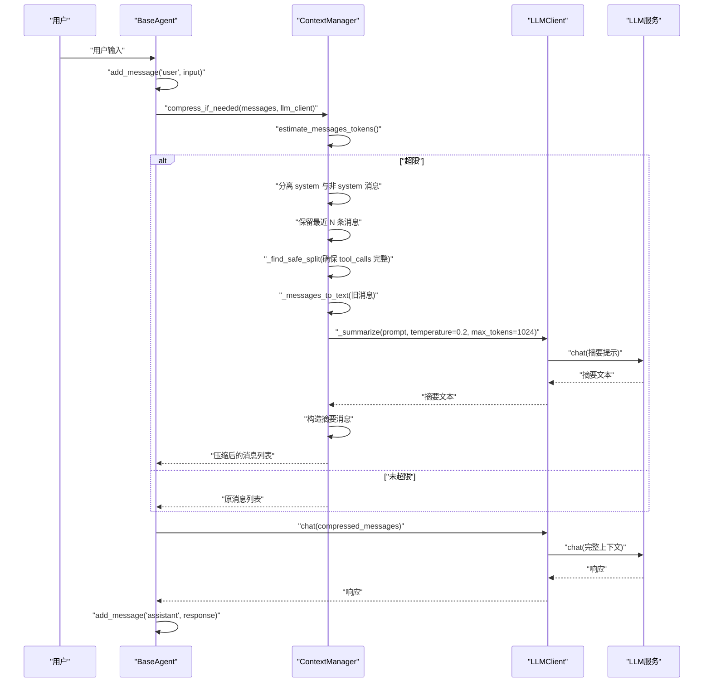
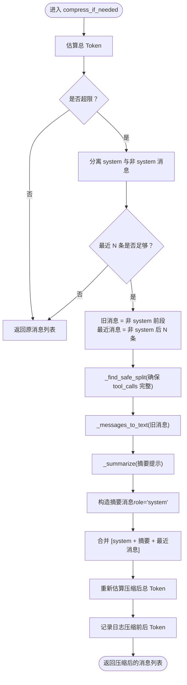
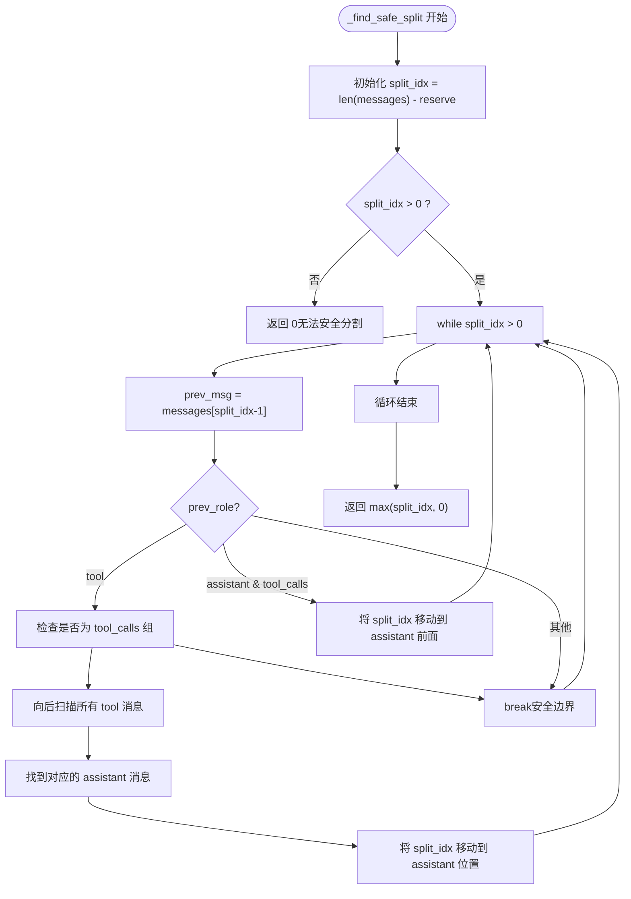
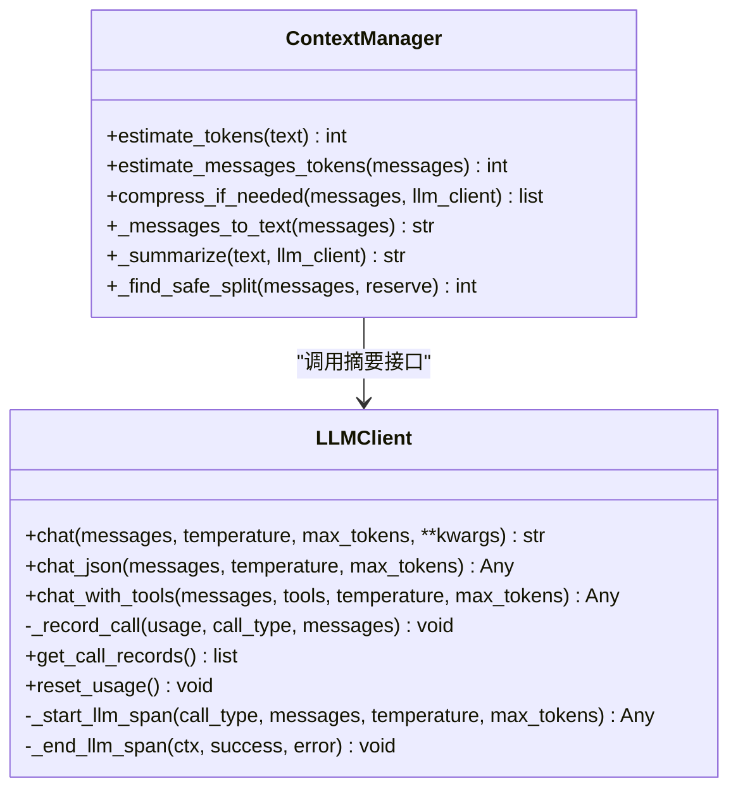
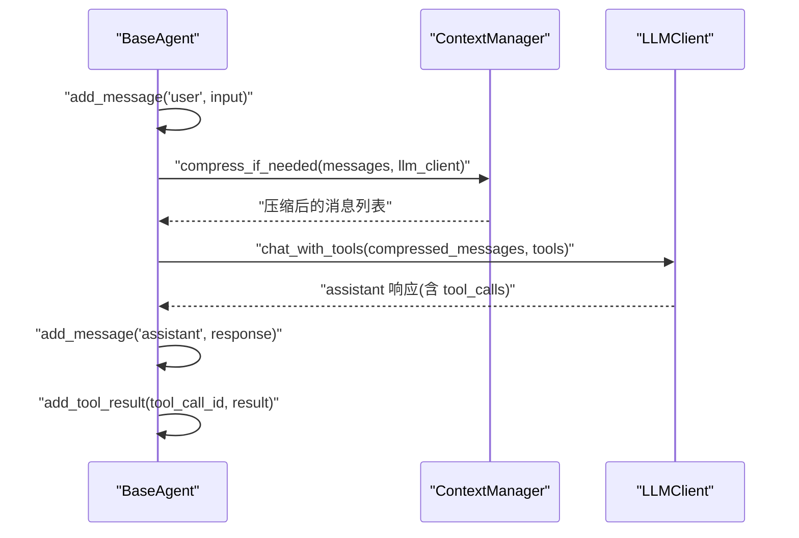
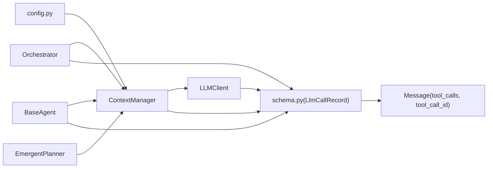

# 上下文管理

<cite>
**本文引用的文件**
- [context/manager.py](file://context/manager.py)
- [context/__init__.py](file://context/__init__.py)
- [llm/client.py](file://llm/client.py)
- [agents/base.py](file://agents/base.py)
- [agents/orchestrator.py](file://agents/orchestrator.py)
- [agents/emergent_planner.py](file://agents/emergent_planner.py)
- [memory/short_term.py](file://memory/short_term.py)
- [memory/long_term.py](file://memory/long_term.py)
- [config.py](file://config.py)
- [schema.py](file://schema.py)
- [tools/base.py](file://tools/base.py)
</cite>

## 目录
1. [简介](#简介)
2. [项目结构](#项目结构)
3. [核心组件](#核心组件)
4. [架构总览](#架构总览)
5. [详细组件分析](#详细组件分析)
6. [依赖分析](#依赖分析)
7. [性能考量](#性能考量)
8. [故障排查指南](#故障排查指南)
9. [结论](#结论)
10. [附录](#附录)

## 简介
本文件围绕上下文管理系统，聚焦 ContextManager 类的上下文窗口管理与 Token 估算机制，系统阐述上下文构建、截断与优化策略，说明不同类型消息（系统、用户、助手、工具）的处理方式，解释 Token 使用量的计算方法与限制控制，提供上下文配置选项与最佳实践，并说明与 LLM 客户端的集成关系及上下文长度优化与性能调优建议。

**更新** 新增了 `_find_safe_split()` 方法，确保在上下文压缩时不会分割 `tool_calls` 结构组，保持 `assistant-tool` 消息对的完整性。

## 项目结构
上下文管理相关代码主要分布在以下模块：
- context/manager.py：上下文管理器，负责 Token 估算、上下文压缩与摘要生成
- llm/client.py：LLM 客户端，提供 chat/chat_json/chat_with_tools 等接口，支持重试与追踪
- agents/base.py：基础智能体，封装消息历史与 LLM 交互，集成 ContextManager
- agents/orchestrator.py：编排器，协调多个子智能体，共享 ContextManager 实例
- agents/emergent_planner.py：隐式规划智能体，复用 ContextManager
- memory/short_term.py：短期记忆（滑动窗口），与 ContextManager 协同控制近期上下文
- memory/long_term.py：长期记忆（持久化 JSON），为上下文提供历史经验
- config.py：全局配置，包括上下文 Token 上限、短期窗口大小等
- schema.py：数据模型，包含消息结构、Token 使用记录等
- tools/base.py：工具基类，支持 OpenAI function-calling 格式

**图表来源**
- [context/manager.py:22-235](file://context/manager.py#L22-L235)
- [llm/client.py:32-420](file://llm/client.py#L32-L420)
- [agents/base.py:29-183](file://agents/base.py#L29-L183)
- [agents/orchestrator.py:95-294](file://agents/orchestrator.py#L95-L294)
- [agents/emergent_planner.py:90-289](file://agents/emergent_planner.py#L90-L289)
- [memory/short_term.py:20-91](file://memory/short_term.py#L20-L91)
- [memory/long_term.py:24-142](file://memory/long_term.py#L24-L142)
- [config.py:21-109](file://config.py#L21-L109)
- [schema.py:678-702](file://schema.py#L678-L702)
- [tools/base.py:22-175](file://tools/base.py#L22-L175)

**章节来源**
- [context/manager.py:1-235](file://context/manager.py#L1-L235)
- [llm/client.py:1-420](file://llm/client.py#L1-L420)
- [agents/base.py:1-183](file://agents/base.py#L1-L183)
- [agents/orchestrator.py:1-294](file://agents/orchestrator.py#L1-L294)
- [agents/emergent_planner.py:1-289](file://agents/emergent_planner.py#L1-L289)
- [memory/short_term.py:1-91](file://memory/short_term.py#L1-L91)
- [memory/long_term.py:1-142](file://memory/long_term.py#L1-L142)
- [config.py:1-109](file://config.py#L1-L109)
- [schema.py:1-702](file://schema.py#L1-L702)
- [tools/base.py:1-175](file://tools/base.py#L1-L175)

## 核心组件
- ContextManager：Token 感知的上下文窗口管理器，提供消息 Token 估算、上下文压缩与摘要生成能力，包含安全分割算法确保 `tool_calls` 结构完整性
- LLMClient：统一的异步 LLM 客户端，支持重试、追踪与 Token 使用记录
- BaseAgent：封装消息历史与 LLM 交互，集成 ContextManager 实现自动上下文压缩
- Orchestrator：编排器，共享 ContextManager 实例，协调多智能体执行
- ShortTermMemory：短期记忆（滑动窗口），保留最近若干条消息
- LongTermMemory：长期记忆（持久化 JSON），提供历史经验检索
- config.py：全局配置，包括上下文 Token 上限、短期窗口大小、追踪与重试开关等
- schema.py：消息与 Token 使用记录等数据模型
- tools/base.py：工具基类，支持 OpenAI function-calling 格式，为 ReAct 循环提供工具调用支持

**章节来源**
- [context/manager.py:22-235](file://context/manager.py#L22-L235)
- [llm/client.py:32-420](file://llm/client.py#L32-L420)
- [agents/base.py:29-183](file://agents/base.py#L29-L183)
- [agents/orchestrator.py:95-294](file://agents/orchestrator.py#L95-L294)
- [memory/short_term.py:20-91](file://memory/short_term.py#L20-L91)
- [memory/long_term.py:24-142](file://memory/long_term.py#L24-L142)
- [config.py:21-109](file://config.py#L21-L109)
- [schema.py:678-702](file://schema.py#L678-L702)
- [tools/base.py:22-175](file://tools/base.py#L22-L175)

## 架构总览
上下文管理在系统中的位置如下：
- 智能体在每次推理前，将用户输入与历史消息加入消息列表
- ContextManager 估算总 Token，若超限则压缩旧消息，保留 system 提示与最近若干条消息
- 压缩过程通过 LLMClient 调用摘要提示词，生成摘要消息替换旧消息
- LLMClient 支持重试与追踪，Token 使用记录可用于成本控制与性能分析
- **新增**：_find_safe_split() 方法确保在压缩过程中不会分割 `tool_calls` 结构组

**图表来源**
- [agents/base.py:87-105](file://agents/base.py#L87-L105)
- [context/manager.py:82-143](file://context/manager.py#L82-L143)
- [llm/client.py:73-118](file://llm/client.py#L73-L118)

**章节来源**
- [agents/base.py:87-105](file://agents/base.py#L87-L105)
- [context/manager.py:82-143](file://context/manager.py#L82-L143)
- [llm/client.py:73-118](file://llm/client.py#L73-L118)

## 详细组件分析

### ContextManager：上下文窗口管理与 Token 估算
- Token 估算
  - 文本粗略估算：按字符数估算 Token，英文约每 3 字符 1 Token，中文/日文/韩文约每 2 字符 1 Token
  - 消息开销：每条消息额外加约 4 Token 的固定开销
- 上下文压缩策略
  - 若总 Token 超过上限，则将消息分为 system 提示、旧消息与最近消息三部分
  - 旧消息经 LLM 摘要后，用单条摘要消息替换，保留 system 提示与最近消息
  - **新增**：使用 _find_safe_split() 方法找到安全的分割点，确保 `tool_calls` 结构组不被分割
  - 降级策略：摘要失败时，采用截断策略（保留最后若干字符并标注截断）
- 关键方法
  - estimate_tokens：估算单条文本的 Token
  - estimate_messages_tokens：估算消息列表总 Token（含开销）
  - compress_if_needed：按策略压缩上下文
  - _messages_to_text：将消息转为可读文本
  - _summarize：调用 LLM 生成摘要，失败时降级截断
  - **新增**：_find_safe_split：查找不切割 `tool_calls` 组的安全分割点

**图表来源**
- [context/manager.py:82-143](file://context/manager.py#L82-L143)
- [context/manager.py:150-189](file://context/manager.py#L150-L189)

**章节来源**
- [context/manager.py:22-235](file://context/manager.py#L22-L235)

### _find_safe_split：安全分割算法确保 `tool_calls` 结构完整性
- **新增功能**：防止在上下文压缩时分割 `tool_calls` 结构组
- **算法原理**：
  - 从最近消息边界开始向前扫描，找到第一个安全的分割点
  - 如果遇到 `tool` 消息，会向后扫描直到找到对应的 `assistant` 消息，确保整个 `tool_calls` 组不被分割
  - 如果遇到带有 `tool_calls` 的 `assistant` 消息，会将其移动到最近消息区域，保持完整的 `assistant-tool` 对
- **安全边界条件**：
  - 用户消息、没有 `tool_calls` 的助手消息、其他类型消息被视为安全边界
  - 任何可能破坏 `tool_calls` 结构组的分割都会被避免

**图表来源**
- [context/manager.py:150-189](file://context/manager.py#L150-L189)

**章节来源**
- [context/manager.py:150-189](file://context/manager.py#L150-L189)

### LLMClient：与 ContextManager 的集成关系
- 提供 chat/chat_json/chat_with_tools 接口，统一异步调用
- 支持可选重试（指数退避），提升稳定性
- 支持追踪（OpenTelemetry），记录请求属性与 Token 使用
- Token 使用记录：在每次调用后记录 prompt/completion/total tokens，便于成本与性能分析

**图表来源**
- [llm/client.py:32-420](file://llm/client.py#L32-L420)
- [context/manager.py:150-235](file://context/manager.py#L150-L235)

**章节来源**
- [llm/client.py:32-420](file://llm/client.py#L32-L420)
- [context/manager.py:150-235](file://context/manager.py#L150-L235)

### BaseAgent：消息管理与上下文压缩集成
- 维护自身消息历史与 system 提示
- think/think_json/think_with_tools 三个推理入口均在调用前执行 compress_if_needed
- 将 assistant 响应与工具调用结果写入消息历史，确保下一轮推理上下文连贯
- **支持工具调用**：通过 `think_with_tools` 方法处理 ReAct 循环中的工具调用

**图表来源**
- [agents/base.py:87-168](file://agents/base.py#L87-L168)
- [context/manager.py:82-143](file://context/manager.py#L82-L143)
- [llm/client.py:125-176](file://llm/client.py#L125-L176)

**章节来源**
- [agents/base.py:87-168](file://agents/base.py#L87-L168)

### Orchestrator：共享上下文管理与多智能体协作
- 编排器创建共享的 ContextManager 实例，供 Planner、Executor、Reflector、EmergentPlanner 等子智能体复用
- 在任务开始与结束时重置与汇总 Token 使用记录，便于成本控制与性能分析

**章节来源**
- [agents/orchestrator.py:95-141](file://agents/orchestrator.py#L95-L141)
- [llm/client.py:273-311](file://llm/client.py#L273-L311)

### ShortTermMemory 与 LongTermMemory：上下文来源与容量控制
- ShortTermMemory：滑动窗口保留最近若干条消息，避免短期内 Token 超限
- LongTermMemory：持久化存储历史经验，检索后注入到任务上下文中，增强智能体决策能力

**章节来源**
- [memory/short_term.py:20-91](file://memory/short_term.py#L20-L91)
- [memory/long_term.py:24-142](file://memory/long_term.py#L24-L142)

## 依赖分析
- ContextManager 依赖 config.py 中的 MAX_CONTEXT_TOKENS 与 SHORT_TERM_WINDOW（间接）
- BaseAgent/Orchestrator/EmergentPlanner 依赖 ContextManager
- ContextManager 依赖 LLMClient 进行摘要生成
- LLMClient 与 schema.py 中的 LLMCallRecord/TokenUsage 等模型配合，记录 Token 使用
- **新增**：ContextManager 依赖 schema.Message 中的 `tool_calls` 和 `tool_call_id` 字段来识别 `tool_calls` 结构组

**图表来源**
- [config.py:21-31](file://config.py#L21-L31)
- [context/manager.py:40-46](file://context/manager.py#L40-L46)
- [agents/base.py:23-24](file://agents/base.py#L23-L24)
- [agents/orchestrator.py:95-101](file://agents/orchestrator.py#L95-L101)
- [agents/emergent_planner.py:90-106](file://agents/emergent_planner.py#L90-L106)
- [llm/client.py:273-302](file://llm/client.py#L273-L302)
- [schema.py:314-325](file://schema.py#L314-L325)
- [schema.py:678-702](file://schema.py#L678-L702)

**章节来源**
- [config.py:21-31](file://config.py#L21-L31)
- [context/manager.py:40-46](file://context/manager.py#L40-L46)
- [agents/base.py:23-24](file://agents/base.py#L23-L24)
- [agents/orchestrator.py:95-101](file://agents/orchestrator.py#L95-L101)
- [agents/emergent_planner.py:90-106](file://agents/emergent_planner.py#L90-L106)
- [llm/client.py:273-302](file://llm/client.py#L273-L302)
- [schema.py:314-325](file://schema.py#L314-L325)
- [schema.py:678-702](file://schema.py#L678-L702)

## 性能考量
- Token 估算策略
  - 粗略估算避免引入外部依赖，但可能与真实模型存在偏差；建议结合实际使用情况校准
  - 消息开销固定值有助于稳定估算，减少波动
- 压缩触发频率
  - 合理设置 MAX_CONTEXT_TOKENS，避免频繁压缩导致上下文碎片化
  - 适当增大 reserve_recent，保留最新上下文以提升推理质量
- **新增**：_find_safe_split() 算法优化
  - 通过智能扫描避免分割 `tool_calls` 结构组，减少 ReAct 循环中断
  - 算法时间复杂度为 O(n)，其中 n 为需要压缩的消息数量
  - 在工具调用密集的场景中显著提升上下文连续性
- LLM 摘要成本
  - 摘要温度较低（0.2），提高一致性；max_tokens 控制摘要长度，平衡成本与信息密度
  - 摘要失败时的降级截断可保证继续执行，但会丢失历史细节
- 重试与追踪
  - 启用 LLM_RETRY_ENABLED 可提升稳定性；结合 TRACING_ENABLED 便于定位性能瓶颈
- 短期记忆与长期记忆
  - SHORT_TERM_WINDOW 与长期记忆检索结合，可在有限 Token 内最大化利用历史经验

[本节为通用性能建议，不直接分析具体文件]

## 故障排查指南
- 摘要失败
  - 现象：压缩阶段调用 LLM 摘要异常
  - 处理：ContextManager 内部捕获异常并降级为截断策略，保留最后若干字符并标注截断
  - 建议：检查网络与 LLM 服务可用性，必要时增加重试与退避
- **新增**：_find_safe_split() 算法问题
  - 现象：上下文压缩时工具调用信息丢失
  - 处理：检查消息结构是否符合 OpenAI function-calling 格式，确保 `tool_calls` 和 `tool_call_id` 字段正确设置
  - 建议：验证 ReAct 循环中 `assistant-tool` 消息对的完整性
- Token 估算偏差
  - 现象：估算与真实使用差异较大
  - 处理：根据实际模型微调估算规则（字符/Token 比例与消息开销）
  - 建议：开启 TOKEN_TRACKING_ENABLED，定期核对 LLMClient 的调用记录
- 上下文仍超限
  - 现象：压缩后仍超限
  - 处理：减小 MAX_CONTEXT_TOKENS 或增大 reserve_recent，或减少 system 提示长度
  - 建议：结合短期记忆与长期记忆策略，减少冗余信息
- 重试与追踪
  - 现象：网络抖动导致调用失败
  - 处理：启用 LLM_RETRY_ENABLED 并合理设置最大重试次数与退避因子
  - 建议：开启 TRACING_ENABLED，结合追踪日志定位问题

**章节来源**
- [context/manager.py:232-235](file://context/manager.py#L232-L235)
- [llm/client.py:92-118](file://llm/client.py#L92-L118)
- [config.py:82-88](file://config.py#L82-L88)
- [config.py:102-109](file://config.py#L102-L109)

## 结论
ContextManager 通过 Token 估算与 LLM 驱动的摘要压缩，在保证上下文质量的同时有效控制 Token 使用，与 LLMClient、BaseAgent、Orchestrator 等模块形成紧密协作。**新增的 _find_safe_split() 方法**确保了在上下文压缩过程中不会分割 `tool_calls` 结构组，从而保持 ReAct 循环的完整性。结合短期与长期记忆、重试与追踪机制，系统在复杂任务中实现了稳定的上下文管理与性能可控的成本控制。建议根据任务特点调整上下文阈值与保留策略，并持续监控 Token 使用记录以优化成本与效果。

[本节为总结性内容，不直接分析具体文件]

## 附录

### 上下文配置选项与最佳实践
- 上下文与窗口
  - MAX_CONTEXT_TOKENS：上下文 Token 上限，超限触发压缩
  - SHORT_TERM_WINDOW：短期记忆窗口大小，控制近期消息数量
- LLM 与重试
  - LLM_RETRY_ENABLED：启用/禁用 LLM 调用重试
  - LLM_RETRY_MAX_ATTEMPTS、LLM_RETRY_BACKOFF_FACTOR：重试次数与退避因子
- 追踪与成本
  - TRACING_ENABLED、TRACING_LOG_PROMPTS：追踪总开关与是否记录完整提示
  - TOKEN_TRACKING_ENABLED：启用 Token 使用记录
- **新增**：ReAct 循环优化
  - 工具调用密集场景建议适当增大 MAX_CONTEXT_TOKENS
  - 确保工具调用消息结构符合 OpenAI function-calling 格式
- 最佳实践
  - 合理设置 MAX_CONTEXT_TOKENS，避免频繁压缩
  - 适度增大 reserve_recent，保留最新上下文
  - 启用重试与追踪，提升稳定性与可观测性
  - 结合短期记忆与长期记忆，最大化上下文价值
  - **新增**：在工具调用密集的 ReAct 循环中，_find_safe_split() 算法会自动保护 `tool_calls` 结构组

**章节来源**
- [config.py:21-31](file://config.py#L21-L31)
- [config.py:82-88](file://config.py#L82-L88)
- [config.py:102-109](file://config.py#L102-L109)

### 消息类型与处理方式
- system：始终保留，作为智能体角色与行为约束
- user：用户输入，加入历史并在压缩时按策略处理
- assistant：LLM 响应，加入历史并在压缩时保留最近若干条
  - **新增**：支持 `tool_calls` 字段，表示工具调用请求
- tool：工具调用结果，与 assistant 消息共同构成 ReAct 循环的观察阶段
  - **新增**：必须包含 `tool_call_id` 字段，与对应的 `assistant` 消息关联
- **新增**：_find_safe_split() 算法保护机制
  - `tool_calls` 组：assistant{tool_calls} + tool{tool_call_id} 消息对
  - 算法确保这些消息对在压缩时不被分割

**章节来源**
- [schema.py:678-702](file://schema.py#L678-L702)
- [agents/base.py:170-179](file://agents/base.py#L170-L179)
- [context/manager.py:150-189](file://context/manager.py#L150-L189)