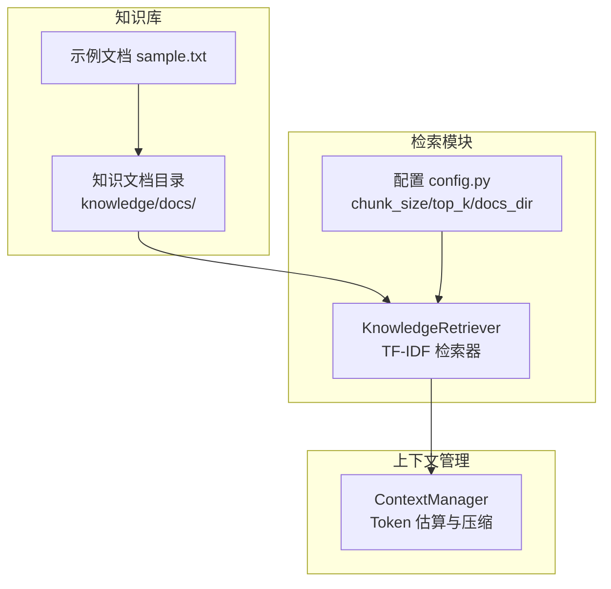
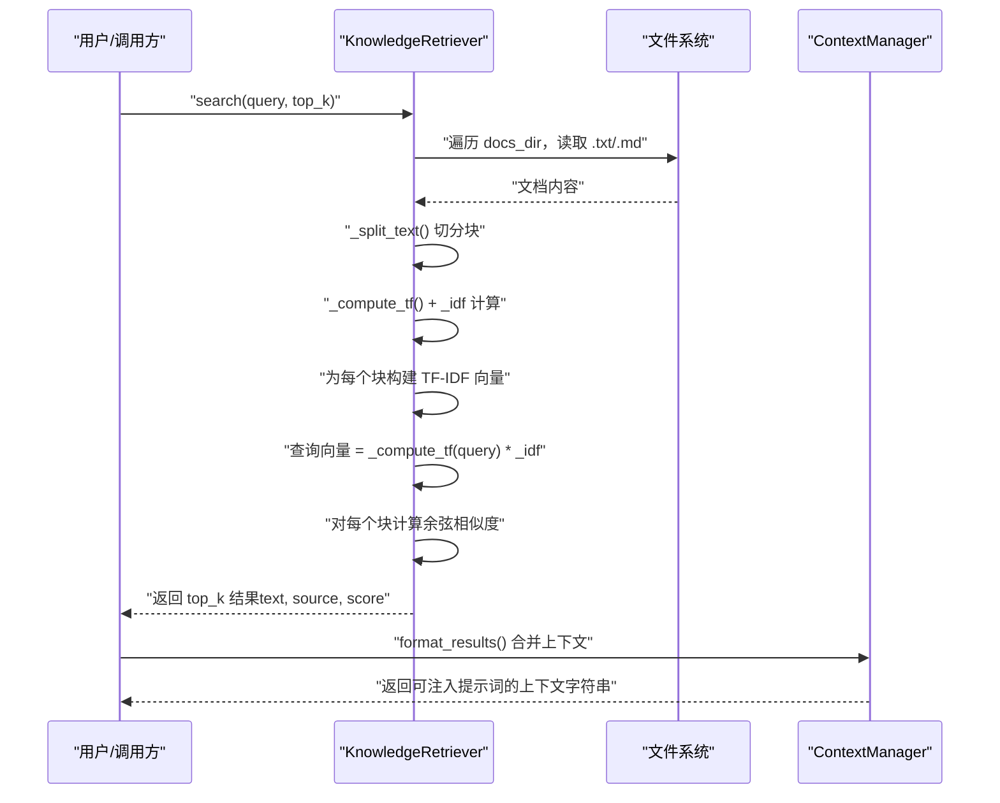
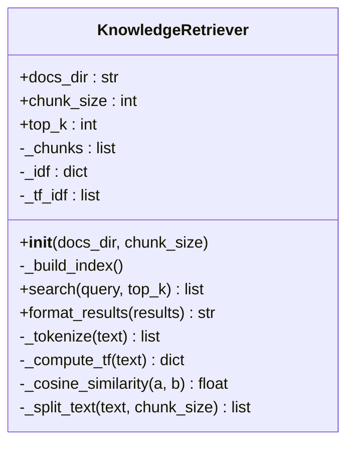
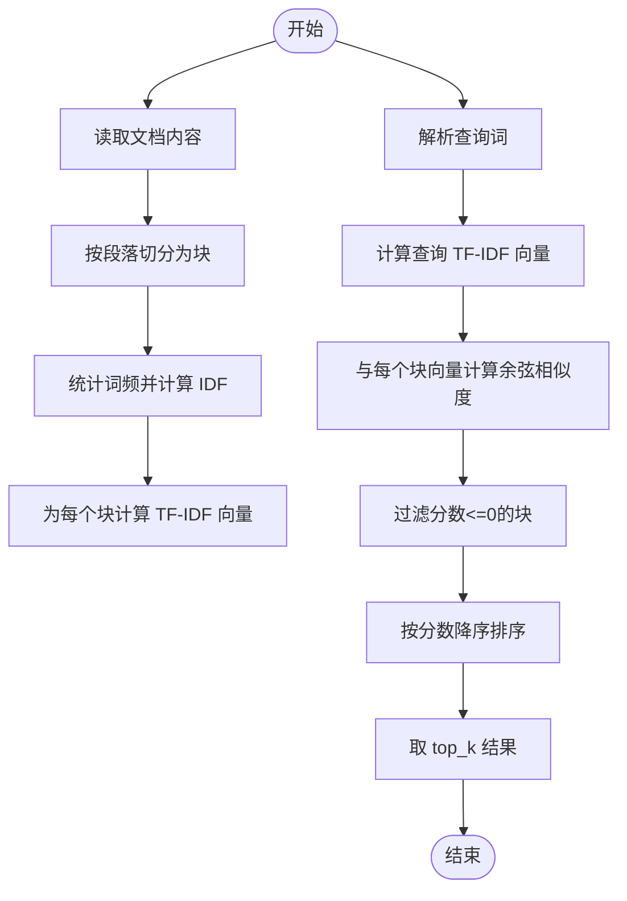
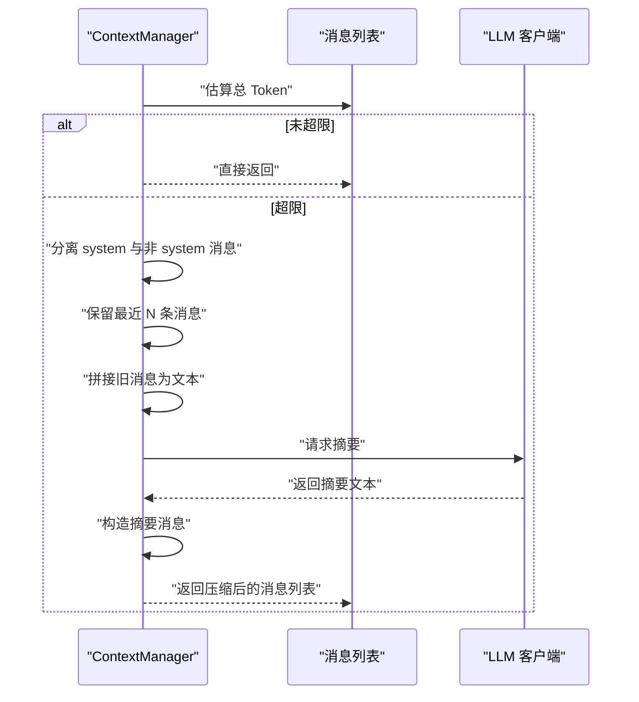
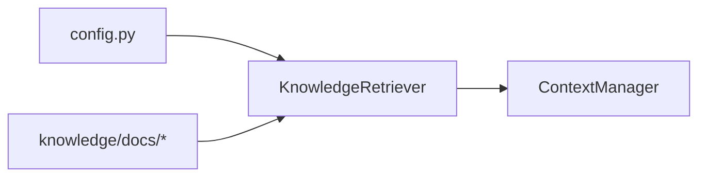

# 知识检索

<cite>
**本文引用的文件**
- [knowledge/retriever.py](file://knowledge/retriever.py)
- [config.py](file://config.py)
- [knowledge/docs/sample.txt](file://knowledge/docs/sample.txt)
- [context/manager.py](file://context/manager.py)
- [evaluation/benchmark.py](file://evaluation/benchmark.py)
- [sxw_aicoding/old_docs/data-structures-and-algorithms.md](file://sxw_aicoding/old_docs/data-structures-and-algorithms.md)
</cite>

## 目录
1. [简介](#简介)
2. [项目结构](#项目结构)
3. [核心组件](#核心组件)
4. [架构总览](#架构总览)
5. [详细组件分析](#详细组件分析)
6. [依赖关系分析](#依赖关系分析)
7. [性能考量](#性能考量)
8. [故障排查指南](#故障排查指南)
9. [结论](#结论)
10. [附录](#附录)

## 简介
本文件面向“知识检索系统”，聚焦于 KnowledgeRetriever 类的 TF-IDF 检索算法实现与文档匹配机制，系统性阐述：
- 文档预处理、向量化与相似度计算流程
- 检索结果排序与过滤逻辑
- 上下文压缩功能的实现原理与应用场景
- 检索配置参数与性能优化建议
- 与文档存储系统的集成方式
- 检索效果评估与调优指南

## 项目结构
知识检索位于 knowledge 子模块，核心类为 KnowledgeRetriever；检索结果会注入到智能体提示词中，与上下文管理器协同控制整体上下文长度。

图表来源
- [knowledge/retriever.py:37-46](file://knowledge/retriever.py#L37-L46)
- [config.py:34-36](file://config.py#L34-L36)
- [context/manager.py:40-46](file://context/manager.py#L40-L46)

章节来源
- [knowledge/retriever.py:1-229](file://knowledge/retriever.py#L1-L229)
- [config.py:32-36](file://config.py#L32-L36)

## 核心组件
- KnowledgeRetriever：基于 TF-IDF 的关键词检索器，负责加载文档、切分块、构建倒排索引、计算查询向量与余弦相似度，并按相关性排序返回结果。
- 配置项：KNOWLEDGE_DOCS_DIR、KNOWLEDGE_CHUNK_SIZE、KNOWLEDGE_TOP_K。
- 上下文管理器：在对话上下文过长时，使用 LLM 对旧消息进行摘要压缩，避免超出 Token 限制。

章节来源
- [knowledge/retriever.py:26-46](file://knowledge/retriever.py#L26-L46)
- [config.py:34-36](file://config.py#L34-L36)
- [context/manager.py:22-46](file://context/manager.py#L22-L46)

## 架构总览
检索流程概览如下：

图表来源
- [knowledge/retriever.py:111-143](file://knowledge/retriever.py#L111-L143)
- [knowledge/retriever.py:208-228](file://knowledge/retriever.py#L208-L228)
- [context/manager.py:145-158](file://context/manager.py#L145-L158)

## 详细组件分析

### KnowledgeRetriever 类
- 职责
  - 加载知识文档目录中的 .txt/.md 文件
  - 按段落边界切分为固定大小的块
  - 构建倒排 TF-IDF 索引（词 IDF、块 TF-IDF 向量）
  - 查询时计算查询向量并与所有块的向量做余弦相似度比较，按分数降序返回 top-k 结果
  - 提供格式化输出，便于注入 LLM 提示词

- 关键方法与实现要点
  - 构建索引：遍历文档、切分块、统计词频、计算 IDF、为每个块生成 TF-IDF 向量
  - 查询：对查询词计算 TF，乘以全局 IDF 得到查询向量；与每个块向量计算余弦相似度；过滤非正分数；排序取 top-k
  - 文本处理：分词（仅保留小写字母与数字）、词频归一化、余弦相似度（稀疏向量点积/范数）
  - 块切分：按段落边界切分，尽量不截断段落，超过阈值则换行存储

- 数据结构
  - _chunks：块列表，每块包含 text、source、index
  - _idf：词 -> IDF 映射
  - _tf_idf：每个块的词 -> TF-IDF 值映射（稀疏向量）

- 排序与过滤
  - 过滤：仅保留相似度大于 0 的块
  - 排序：按分数降序
  - 限制：top_k 由构造参数或配置决定

- 与配置的关系
  - docs_dir、chunk_size、top_k 来源于 config.py

章节来源
- [knowledge/retriever.py:37-46](file://knowledge/retriever.py#L37-L46)
- [knowledge/retriever.py:53-104](file://knowledge/retriever.py#L53-L104)
- [knowledge/retriever.py:111-143](file://knowledge/retriever.py#L111-L143)
- [knowledge/retriever.py:165-228](file://knowledge/retriever.py#L165-L228)
- [config.py:34-36](file://config.py#L34-L36)

#### 类图（代码级）

图表来源
- [knowledge/retriever.py:26-228](file://knowledge/retriever.py#L26-L228)

### 文档预处理与向量化
- 文档加载
  - 仅处理 .txt 与 .md 文件
  - 逐文件读取内容
- 文本切分
  - 按段落边界（空行）切分，避免截断语义
  - 超过 chunk_size 则换行存储
- 分词与词频
  - 分词规则：仅保留小写字母与数字
  - 词频归一化：除以最高词频，使 TF ∈ [0,1]
- IDF 计算
  - 使用 log((N+1)/(df+1))+1 平滑公式
- TF-IDF 向量
  - 每个块为稀疏向量（词 -> TF-IDF 值）
  - 查询向量同样为稀疏向量

章节来源
- [knowledge/retriever.py:63-75](file://knowledge/retriever.py#L63-L75)
- [knowledge/retriever.py:81-98](file://knowledge/retriever.py#L81-L98)
- [knowledge/retriever.py:165-187](file://knowledge/retriever.py#L165-L187)
- [knowledge/retriever.py:208-228](file://knowledge/retriever.py#L208-L228)

#### 流程图（向量化与相似度）

图表来源
- [knowledge/retriever.py:53-104](file://knowledge/retriever.py#L53-L104)
- [knowledge/retriever.py:111-143](file://knowledge/retriever.py#L111-L143)
- [knowledge/retriever.py:189-205](file://knowledge/retriever.py#L189-L205)

### 检索结果排序与过滤
- 过滤：仅保留相似度 > 0 的块
- 排序：按分数降序
- 限制：top_k 由调用方传入或使用默认配置
- 输出：包含 text、source、score 的字典列表，便于格式化为上下文字符串

章节来源
- [knowledge/retriever.py:119-143](file://knowledge/retriever.py#L119-L143)

### 上下文压缩功能
- 触发条件：对话消息总 Token 超过配置上限
- 压缩策略：
  - 保留 system prompt 与最近若干条消息
  - 将旧消息拼接为文本，调用 LLM 生成摘要
  - 用摘要消息替换旧消息，降低上下文长度
- Token 估算：按字符粗略估算，避免引入额外依赖
- 降级策略：摘要失败时回退为截断原文末尾 N 字符

章节来源
- [context/manager.py:82-136](file://context/manager.py#L82-L136)
- [context/manager.py:53-75](file://context/manager.py#L53-L75)
- [context/manager.py:157-186](file://context/manager.py#L157-L186)

#### 序列图（上下文压缩）

图表来源
- [context/manager.py:82-136](file://context/manager.py#L82-L136)

### 与文档存储系统的集成
- 存储位置：knowledge/docs/ 目录
- 文件类型：.txt、.md
- 加载策略：遍历目录，读取文件内容，按段落切分为块
- 示例：knowledge/docs/sample.txt

章节来源
- [knowledge/retriever.py:63-75](file://knowledge/retriever.py#L63-L75)
- [knowledge/docs/sample.txt:1-52](file://knowledge/docs/sample.txt#L1-L52)

## 依赖关系分析
- KnowledgeRetriever 依赖 config.py 中的配置项（文档目录、块大小、返回条数）
- 检索结果通过 format_results 合并为上下文字符串，供后续流程使用
- 上下文管理器独立于检索器，但共同作用于整体上下文长度控制

图表来源
- [config.py:34-36](file://config.py#L34-L36)
- [knowledge/retriever.py:37-46](file://knowledge/retriever.py#L37-L46)
- [context/manager.py:40-46](file://context/manager.py#L40-L46)

章节来源
- [config.py:34-36](file://config.py#L34-L36)
- [knowledge/retriever.py:37-46](file://knowledge/retriever.py#L37-L46)
- [context/manager.py:40-46](file://context/manager.py#L40-L46)

## 性能考量
- 时间复杂度
  - 索引构建：O(D·W + V·log V)，其中 D 为文档数，W 为每块平均词数，V 为词表规模
  - 查询：O(Q·log V + B·V)，其中 Q 为查询词数，B 为块数
- 空间复杂度
  - 存储稀疏向量，空间开销与非零元素数量相关
- 优化建议
  - 分词与词频归一化：仅保留字母数字，减少噪声词
  - 块大小：根据段落语义完整性与检索精度平衡，避免过大导致冗余
  - top_k：根据上下文窗口与 LLM 输入限制调整，避免过多无关块
  - 缓存：可考虑缓存 IDF 与 TF-IDF 向量，避免重复计算
  - 并行：在构建索引时可并行处理多个文件（注意线程安全与共享状态）
  - 降采样：对超大文档可采用滚动窗口或标题层级切分

章节来源
- [knowledge/retriever.py:165-187](file://knowledge/retriever.py#L165-L187)
- [knowledge/retriever.py:189-205](file://knowledge/retriever.py#L189-L205)
- [config.py:34-36](file://config.py#L34-L36)

## 故障排查指南
- 无知识文档
  - 现象：日志提示未找到知识文档目录或目录为空
  - 处理：确认 KNOWLEDGE_DOCS_DIR 路径存在且包含 .txt/.md 文件
- 检索结果为空
  - 现象：search 返回空列表
  - 处理：检查查询词是否被分词（仅字母数字）；确认索引已成功构建
- 相关性分数异常
  - 现象：相似度全为 0 或极低
  - 处理：检查分词规则与 IDF 平滑；确认查询与文档编码一致
- 上下文过长
  - 现象：对话上下文超出 Token 限制
  - 处理：调整 MAX_CONTEXT_TOKENS；适当减少保留的最近消息数量；确保摘要流程正常工作

章节来源
- [knowledge/retriever.py:58-60](file://knowledge/retriever.py#L58-L60)
- [knowledge/retriever.py:77-79](file://knowledge/retriever.py#L77-L79)
- [context/manager.py:96-98](file://context/manager.py#L96-L98)
- [config.py:23](file://config.py#L23)

## 结论
KnowledgeRetriever 以 TF-IDF 为核心，结合稀疏向量与余弦相似度，在本地文档上实现了快速、可解释的知识检索。通过合理的文档切分、IDF 平滑与 top-k 限制，能够在有限上下文内提供高质量的相关上下文。配合上下文管理器的摘要压缩，系统可在长对话场景中维持稳定的输入长度。建议在实际部署中结合业务文档规模与上下文窗口，动态调整 chunk_size 与 top_k，并考虑缓存与并行优化以进一步提升性能。

## 附录

### 检索配置参数
- KNOWLEDGE_DOCS_DIR：知识文档目录路径
- KNOWLEDGE_CHUNK_SIZE：文档切片大小（字符数）
- KNOWLEDGE_TOP_K：检索返回的最大条数

章节来源
- [config.py:34-36](file://config.py#L34-L36)

### 检索效果评估与调优指南
- 评估指标
  - 任务成功率、步骤覆盖率、工具使用准确性、Token 使用效率
  - 参考基准任务与评估模块的定义与实现
- 调优建议
  - 通过基准任务验证不同 chunk_size 与 top_k 组合的效果
  - 在复杂任务中适当提高 top_k，保证上下文丰富度
  - 对中文等语言，需引入专用分词器以提升检索质量（当前实现仅适用于英文）
  - 结合上下文压缩阈值与摘要质量，动态调整压缩策略

章节来源
- [evaluation/benchmark.py:62-311](file://evaluation/benchmark.py#L62-L311)
- [sxw_aicoding/old_docs/data-structures-and-algorithms.md:751-824](file://sxw_aicoding/old_docs/data-structures-and-algorithms.md#L751-L824)