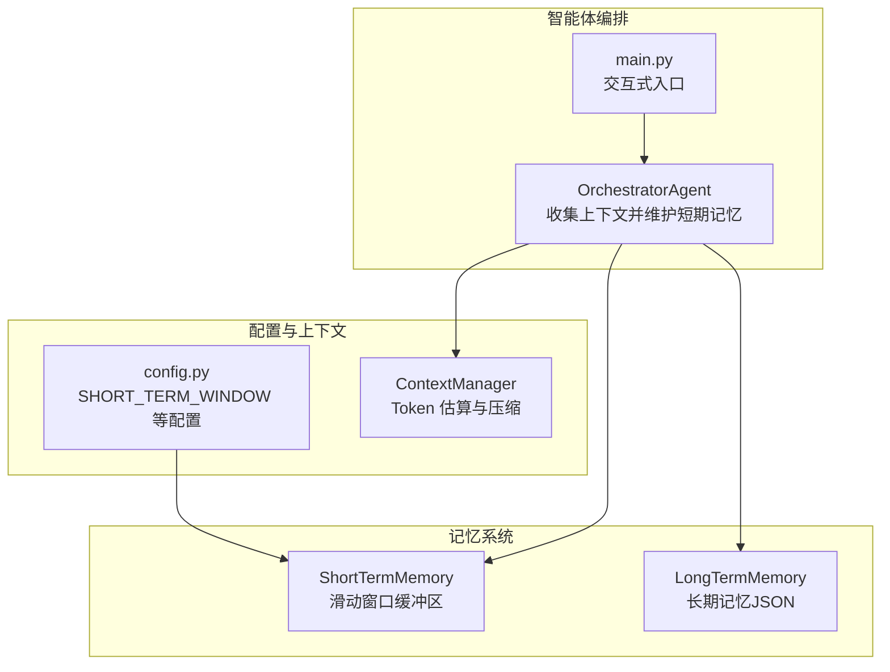
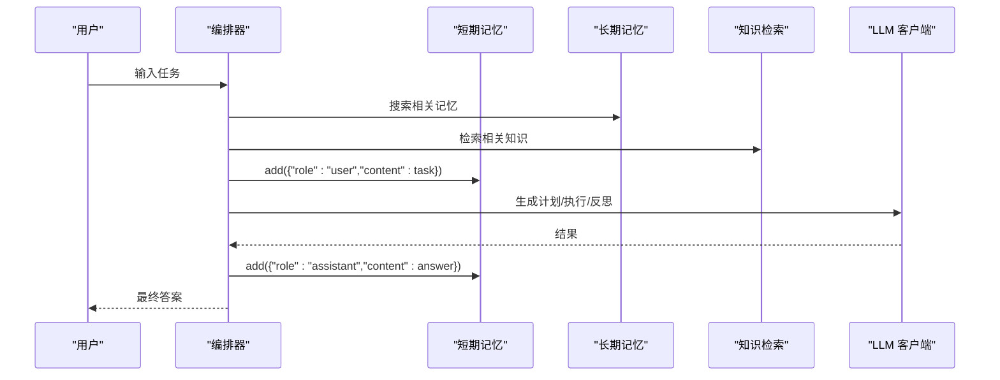
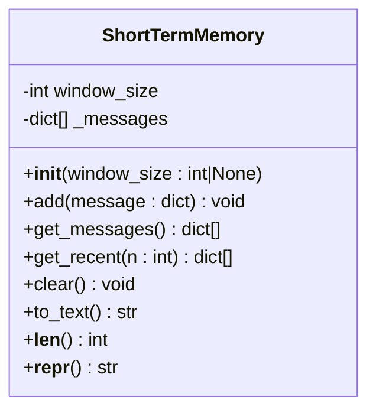
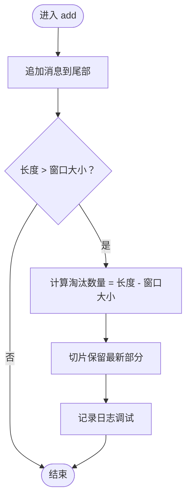
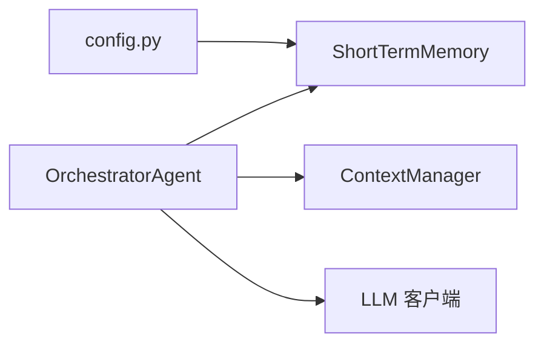

# 短期记忆

<cite>
**本文引用的文件**
- [memory/short_term.py](file://memory/short_term.py)
- [config.py](file://config.py)
- [agents/orchestrator.py](file://agents/orchestrator.py)
- [context/manager.py](file://context/manager.py)
- [main.py](file://main.py)
</cite>

## 目录
1. [简介](#简介)
2. [项目结构](#项目结构)
3. [核心组件](#核心组件)
4. [架构概览](#架构概览)
5. [详细组件分析](#详细组件分析)
6. [依赖分析](#依赖分析)
7. [性能考虑](#性能考虑)
8. [故障排查指南](#故障排查指南)
9. [结论](#结论)
10. [附录](#附录)

## 简介
短期记忆系统为智能体对话提供“最近 N 条消息”的滑动窗口缓冲区，确保在不超出 Token 限制的前提下，为后续推理与执行提供即时上下文。它采用 FIFO（先进先出）策略自动淘汰最旧消息，并提供消息序列化为可读文本的能力，便于调试与摘要输出。短期记忆与配置系统紧密集成，窗口大小可通过环境变量进行全局配置。

## 项目结构
短期记忆位于 memory 子模块，与配置、上下文管理器、智能体编排器协同工作：
- memory/short_term.py：短期记忆类实现
- config.py：全局配置（含 SHORT_TERM_WINDOW）
- agents/orchestrator.py：编排器在任务开始时收集上下文并维护短期记忆
- context/manager.py：上下文压缩器（基于 Token 估算与 LLM 摘要）
- main.py：交互式入口，演示短期记忆在多轮对话中的使用

图表来源
- [memory/short_term.py:1-91](file://memory/short_term.py#L1-L91)
- [config.py:27-31](file://config.py#L27-L31)
- [agents/orchestrator.py:144-146](file://agents/orchestrator.py#L144-L146)
- [context/manager.py:22-47](file://context/manager.py#L22-L47)
- [main.py:415-477](file://main.py#L415-L477)

章节来源
- [memory/short_term.py:1-91](file://memory/short_term.py#L1-L91)
- [config.py:27-31](file://config.py#L27-L31)
- [agents/orchestrator.py:144-146](file://agents/orchestrator.py#L144-L146)
- [context/manager.py:22-47](file://context/manager.py#L22-L47)
- [main.py:415-477](file://main.py#L415-L477)

## 核心组件
- ShortTermMemory：内存中的滑动窗口，保留最近 window_size 条消息，超出时按 FIFO 淘汰最旧消息；提供添加、获取、清理、序列化为文本等方法。
- 配置系统：通过 config.SHORT_TERM_WINDOW 提供默认窗口大小，支持通过环境变量覆盖。
- 编排器：在任务开始时将用户输入与系统提示注入短期记忆，并在任务完成后将最终答案加入短期记忆，以便后续对话复用。
- 上下文管理器：负责 Token 估算与上下文压缩，与短期记忆配合，确保整体上下文不超过配置上限。

章节来源
- [memory/short_term.py:20-91](file://memory/short_term.py#L20-L91)
- [config.py:27-31](file://config.py#L27-L31)
- [agents/orchestrator.py:229-250](file://agents/orchestrator.py#L229-L250)
- [context/manager.py:22-47](file://context/manager.py#L22-L47)

## 架构概览
短期记忆在智能体流水线中的位置如下：
- 任务开始时，编排器收集长期记忆与知识，拼接为上下文字符串，并将用户输入与系统提示写入短期记忆。
- 执行与反思阶段，短期记忆中的最近消息作为即时上下文提供给后续步骤。
- 任务结束时，将最终答案写入短期记忆，形成“最近对话”闭环。

图表来源
- [agents/orchestrator.py:229-250](file://agents/orchestrator.py#L229-L250)
- [agents/orchestrator.py:220-221](file://agents/orchestrator.py#L220-L221)
- [memory/short_term.py:36-45](file://memory/short_term.py#L36-L45)

章节来源
- [agents/orchestrator.py:229-250](file://agents/orchestrator.py#L229-L250)
- [agents/orchestrator.py:220-221](file://agents/orchestrator.py#L220-L221)

## 详细组件分析

### ShortTermMemory 类分析
ShortTermMemory 是一个轻量级的内存滑动窗口，核心职责包括：
- 窗口大小配置：默认从 config.SHORT_TERM_WINDOW 读取，可在实例化时覆盖。
- FIFO 淘汰策略：当消息数量超过窗口大小时，自动淘汰最旧的消息（通过切片保留最新部分）。
- 核心操作：
  - add：追加消息并触发淘汰。
  - get_messages：返回当前窗口内消息副本。
  - get_recent：返回最近 n 条消息（默认 5）。
  - clear：清空所有消息。
  - to_text：将所有消息序列化为可读文本，便于调试与摘要。
- 辅助方法：
  - __len__：返回当前消息数量。
  - __repr__：返回简要状态表示。

图表来源
- [memory/short_term.py:20-91](file://memory/short_term.py#L20-L91)

章节来源
- [memory/short_term.py:20-91](file://memory/short_term.py#L20-L91)

### 滑动窗口与 FIFO 淘汰机制
- 消息添加：每次 add 后检查长度是否超过窗口大小，若超过则计算需淘汰数量，并通过切片保留最新部分。
- 淘汰策略：严格遵循 FIFO，最早进入窗口的消息最先被淘汰。
- 时间复杂度：add 为 O(n)（n 为淘汰数量），get_messages/get_recent 为 O(n)，clear 为 O(1)。

图表来源
- [memory/short_term.py:36-45](file://memory/short_term.py#L36-L45)

章节来源
- [memory/short_term.py:36-45](file://memory/short_term.py#L36-L45)

### 消息序列化为可读文本
- to_text 方法将所有消息按“角色: 内容”的格式拼接为多行文本，便于调试与摘要输出。
- 该能力在多处用于日志与 UI 输出，帮助开发者快速定位上下文问题。

章节来源
- [memory/short_term.py:74-84](file://memory/short_term.py#L74-L84)

### 与配置系统的集成
- 窗口大小默认来源于 config.SHORT_TERM_WINDOW，可通过环境变量 SHORT_TERM_WINDOW 覆盖。
- 配置加载使用 dotenv，优先级低于系统环境变量。

章节来源
- [config.py:27-31](file://config.py#L27-L31)
- [memory/short_term.py:27-29](file://memory/short_term.py#L27-L29)

### 在智能体对话中的使用示例
- 任务开始时：编排器将用户输入写入短期记忆，作为初始上下文的一部分。
- 任务结束时：编排器将最终答案写入短期记忆，供后续对话复用。
- 交互式入口：main.py 的 run_interactive 循环中，每次用户输入都会触发编排器执行，短期记忆在多轮对话中持续累积。

章节来源
- [agents/orchestrator.py:229-250](file://agents/orchestrator.py#L229-L250)
- [agents/orchestrator.py:220-221](file://agents/orchestrator.py#L220-L221)
- [main.py:415-477](file://main.py#L415-L477)

## 依赖分析
- ShortTermMemory 依赖 config 模块读取窗口大小。
- 编排器在任务开始时调用短期记忆添加用户输入，在任务结束时添加最终答案。
- 上下文管理器负责整体 Token 估算与压缩，短期记忆提供“最近消息”片段，二者共同保证上下文长度可控。

图表来源
- [config.py:27-31](file://config.py#L27-L31)
- [memory/short_term.py:27-29](file://memory/short_term.py#L27-L29)
- [agents/orchestrator.py:144-146](file://agents/orchestrator.py#L144-L146)
- [context/manager.py:22-47](file://context/manager.py#L22-L47)

章节来源
- [config.py:27-31](file://config.py#L27-L31)
- [memory/short_term.py:27-29](file://memory/short_term.py#L27-L29)
- [agents/orchestrator.py:144-146](file://agents/orchestrator.py#L144-L146)
- [context/manager.py:22-47](file://context/manager.py#L22-L47)

## 性能考虑
- 时间复杂度：add 在需要淘汰时为 O(n)（n 为淘汰数量），get_messages/get_recent 为 O(n)，clear 为 O(1)。
- 空间复杂度：O(window_size)。
- 淘汰策略：FIFO 简洁高效，适合对话场景的“最近优先”需求。
- 与上下文压缩协作：当整体上下文接近 Token 上限时，短期记忆中的旧消息会被上下文管理器压缩或截断，从而降低整体负担。
- 最佳实践：
  - 合理设置 SHORT_TERM_WINDOW，避免过小导致上下文碎片化，过大导致内存占用与计算开销增加。
  - 在高频对话场景中，结合 to_text 输出进行定期审计，确认上下文有效性。
  - 对于长对话，优先使用上下文压缩器进行摘要，短期记忆仅保留必要的“最近片段”。

[本节为通用性能讨论，无需特定文件来源]

## 故障排查指南
- 症状：短期记忆频繁淘汰旧消息，导致上下文不连贯。
  - 排查：检查 SHORT_TERM_WINDOW 设置是否过小；查看 to_text 输出确认最近消息是否正确保留。
  - 处理：适当增大窗口大小或启用上下文压缩。
- 症状：日志出现“短期记忆已清空”提示。
  - 排查：确认是否在新会话开始时调用了 clear。
  - 处理：在多轮对话中避免误调用 clear，或在设计上明确会话边界。
- 症状：上下文过长导致 Token 超限。
  - 排查：结合上下文管理器的日志，确认是否触发了压缩。
  - 处理：调整 MAX_CONTEXT_TOKENS 或缩短短期记忆窗口，确保压缩策略生效。

章节来源
- [memory/short_term.py:45-45](file://memory/short_term.py#L45-L45)
- [memory/short_term.py:66-67](file://memory/short_term.py#L66-L67)
- [context/manager.py:82-136](file://context/manager.py#L82-L136)

## 结论
短期记忆系统通过滑动窗口与 FIFO 淘汰策略，为智能体对话提供了稳定且高效的上下文管理能力。它与配置系统、上下文管理器和编排器紧密协作，既能满足多轮对话的即时上下文需求，又能在整体上下文接近 Token 上限时通过压缩策略维持稳定性。合理配置窗口大小与结合上下文压缩，是发挥短期记忆价值的关键。

[本节为总结性内容，无需特定文件来源]

## 附录

### 使用示例（概念性说明）
- 在交互式入口中，每次用户输入都会触发编排器执行，短期记忆在多轮对话中持续累积：
  - 用户输入 → 编排器收集上下文 → 写入短期记忆（用户消息）→ 执行与反思 → 写入短期记忆（助手答案）→ 输出最终答案。
- 示例路径参考：
  - [main.py:415-477](file://main.py#L415-L477)
  - [agents/orchestrator.py:229-250](file://agents/orchestrator.py#L229-L250)
  - [agents/orchestrator.py:220-221](file://agents/orchestrator.py#L220-L221)

章节来源
- [main.py:415-477](file://main.py#L415-L477)
- [agents/orchestrator.py:229-250](file://agents/orchestrator.py#L229-L250)
- [agents/orchestrator.py:220-221](file://agents/orchestrator.py#L220-L221)